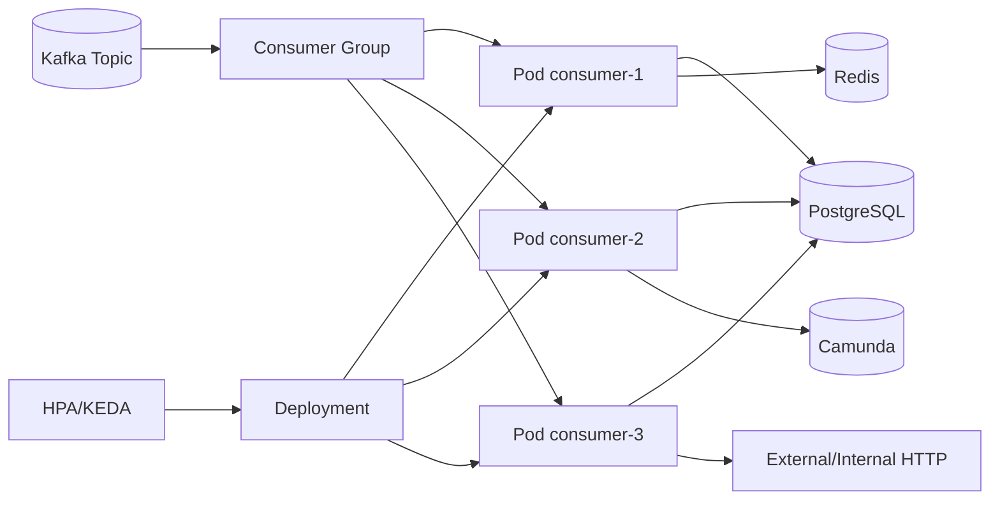
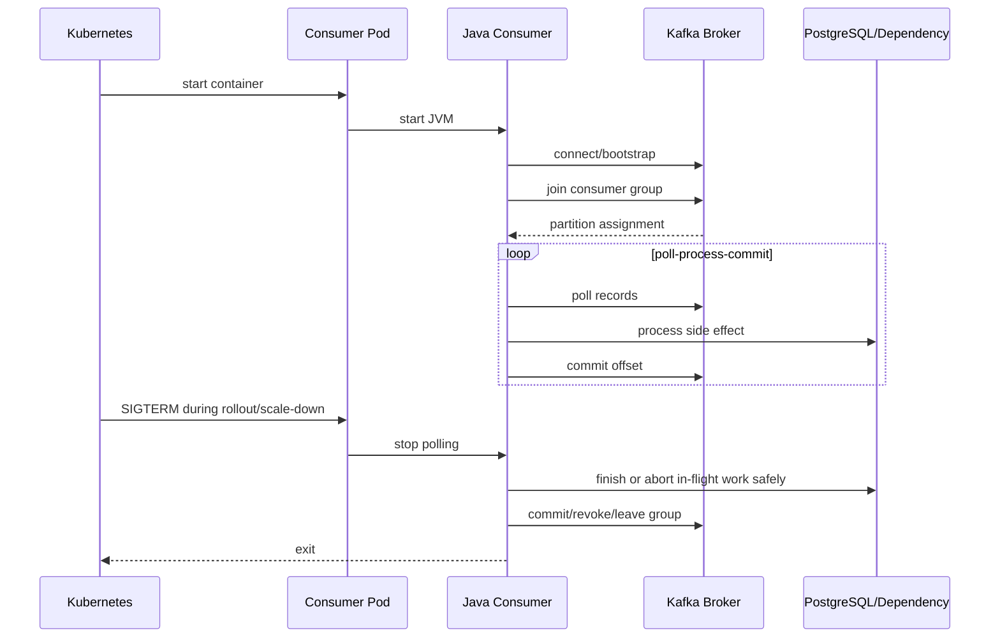
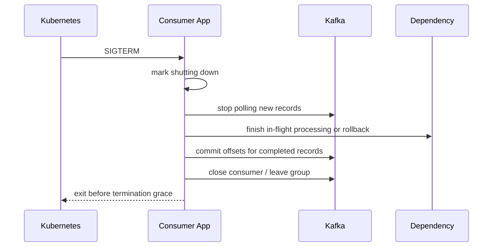
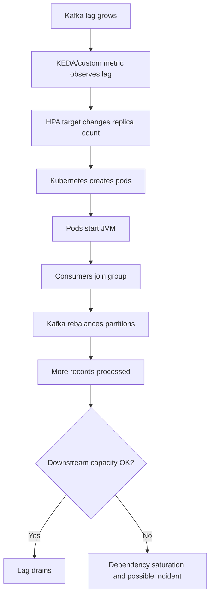

# Part 016 — Kafka Consumer Workload Operations

> Kafka consumer di Kubernetes bukan sekadar Deployment yang membaca topic. Ia adalah distributed processing member yang ikut consumer group, menerima partition assignment, melakukan polling, memproses record, commit offset, menghadapi rebalance, dan harus shutdown tanpa kehilangan atau menggandakan efek bisnis secara tidak terkendali.

Part ini membahas operasi Kafka consumer workload dari sudut pandang senior backend engineer. Fokusnya bukan administrasi Kafka cluster, tetapi bagaimana service owner mengoperasikan consumer Java di Kubernetes secara reliable, observable, scalable, dan aman terhadap failure.

Konteksnya: CPQ, quote/order lifecycle, event-driven processing, PostgreSQL, RabbitMQ interoperability, Redis, Camunda, Java 17+, JAX-RS adjacent service, Kubernetes rollout, GitOps, EKS/AKS/on-prem, dan production incident response.

---

## 1. Core Concept

Kafka consumer workload punya dua control plane sekaligus:

1. **Kubernetes control plane**
   - Deployment desired replicas
   - Pod lifecycle
   - rollout/rollback
   - readiness/liveness
   - resource scheduling
   - HPA/KEDA scaling
   - termination

2. **Kafka consumer group coordination**
   - group membership
   - partition assignment
   - polling loop
   - offset commit
   - rebalance
   - lag
   - retry/DLQ behavior

Masalah muncul ketika dua control plane ini tidak selaras.

Contoh:

- Kubernetes rolling update membunuh pod terlalu cepat, consumer belum commit offset.
- HPA scale out menambah pod, tetapi topic hanya punya sedikit partition.
- Pod restart memicu rebalance storm.
- Liveness probe membunuh pod saat broker lambat.
- Consumer lag naik, lalu autoscaling agresif memperberat database downstream.
- Consumer memproses message idempotency-unsafe sehingga duplicate processing merusak order state.

Operationally, Kafka consumer harus direasoning sebagai:

> long-running stateful-in-protocol workload running on stateless Kubernetes pods.

Pod boleh stateless, tetapi consumer group membership dan offset semantics tidak stateless.

---

## 2. Backend Engineer Responsibility Boundary

Backend service owner bertanggung jawab atas:

- topic consumption semantics
- consumer group ID
- processing logic
- idempotency
- offset commit strategy
- retry behavior
- DLQ behavior
- poison message handling
- graceful shutdown
- partition ordering assumptions
- consumer concurrency
- dependency interaction
- lag SLO/freshness SLO
- metrics/logs/traces
- operational runbook

Platform/SRE biasanya bertanggung jawab atas:

- Kubernetes cluster capacity
- node pool autoscaling
- KEDA/operator installation jika digunakan
- metrics adapter
- observability platform
- network/DNS/CNI
- GitOps controller
- Kafka platform connectivity baseline jika Kafka dikelola platform

Kafka/platform team biasanya bertanggung jawab atas:

- broker cluster health
- topic creation/config policy
- ACL/SASL/TLS policy
- partition count governance
- retention policy
- broker quota
- cluster upgrade

Security bertanggung jawab atas:

- credential/secret policy
- certificate/truststore policy
- network policy
- workload identity if applicable
- access audit

Boundary penting:

> Backend engineer tidak harus mengelola Kafka broker, tetapi wajib memahami consumer behavior yang bisa membuat lag, duplicate processing, rebalance storm, dan downstream overload.

---

## 3. Runtime Shape of Kafka Consumer in Kubernetes

Bentuk umum:

```yaml
kind: Deployment
```

Disertai:

- ConfigMap for topic/group/client config
- Secret for Kafka credentials/certificates
- ServiceAccount
- NetworkPolicy egress to broker
- HPA or KEDA ScaledObject if applicable
- PodDisruptionBudget
- resource request/limit
- dashboards and alerts

Diagram:



Important difference from API service:

- Tidak selalu butuh Ingress.
- Tidak selalu butuh Service untuk menerima traffic.
- Readiness tidak berarti external load balancing readiness.
- Scaling dibatasi oleh partition count dan dependency capacity.
- Termination semantics lebih penting daripada HTTP routing.

---

## 4. Consumer Group and Partition Assignment

Kafka membagi work berdasarkan partition.

Rule dasar:

```text
Maximum actively consuming pods for one consumer group <= number of partitions
```

Jika topic punya 6 partition:

- 1 pod: 1 pod membaca 6 partition
- 3 pod: masing-masing kira-kira 2 partition
- 6 pod: masing-masing 1 partition
- 10 pod: 4 pod idle untuk topic itu

Implication:

- Scaling replicas di atas partition count tidak menambah throughput untuk satu topic/group.
- Multi-topic consumer bisa lebih kompleks karena assignment across topics.
- Partition skew bisa membuat satu pod jauh lebih sibuk.
- Ordering guarantee hanya per partition.

Review questions:

- Berapa partition count topic?
- Berapa max replica consumer?
- Apakah satu pod bisa punya multiple consumer threads?
- Apakah consumer membaca satu topic atau beberapa topic?
- Apakah business ordering bergantung pada key?
- Apakah partition key benar untuk quote/order lifecycle?

For CPQ/order systems:

- Event key harus konsisten jika ordering per quote/order penting.
- Jika event untuk order yang sama tersebar ke partition berbeda, ordering tidak dijamin.
- Jika consumer parallelism naik, idempotency dan ordering harus diuji ulang.

---

## 5. Kafka Consumer Lifecycle in a Pod

Lifecycle umum:



Failure points:

- bootstrap DNS failure
- TLS/SASL auth failure
- group join failure
- assignment delay
- poll loop blocked
- processing takes longer than max poll interval
- offset commit failure
- dependency timeout
- pod killed before graceful shutdown
- rebalance during deployment

Operationally, you need metrics for each phase.

---

## 6. Readiness, Liveness, and Startup for Kafka Consumers

Consumer readiness is not the same as API readiness.

Possible readiness semantics:

- process started
- Kafka client connected
- group joined
- partition assigned
- not shutting down
- processing loop active

But be careful:

- If Kafka is temporarily unavailable, marking every pod unready may not help because no external Service is routing traffic anyway.
- If readiness gates rollout, Kafka dependency failure can block deployment even when rollback/mitigation is needed.
- If liveness depends on broker health, broker issue can cause restart storm.

Recommended stance:

- `startupProbe`: protects slow JVM/client startup.
- `livenessProbe`: process health only; avoid broker deep check.
- `readinessProbe`: useful if Service/rollout depends on it, but semantics must be deliberate.

For pure background consumer with no Service traffic, readiness mainly helps:

- rollout status
- deployment health visibility
- ensuring app initialization completed

It does not load-balance Kafka records. Kafka does partition assignment separately.

Anti-pattern:

```text
Kafka broker slow -> liveness fails -> all pods restart -> consumer group rebalances repeatedly -> lag worsens
```

---

## 7. Replica Count vs Partition Count

Replica count is not free throughput.

Formula for one topic, one group:

```text
active consuming replicas <= partition count
```

But real throughput depends on:

- processing time per record
- batch size
- poll interval
- downstream DB/write latency
- max concurrent processing inside pod
- partition skew
- broker quota
- serialization/deserialization cost
- retry behavior
- transaction/idempotency cost

Examples:

| Topic partitions | Replicas | Expected effect |
|---|---:|---|
| 6 | 3 | likely useful |
| 6 | 6 | max one pod per partition |
| 6 | 10 | extra pods idle for that topic/group |
| 24 | 4 | each pod handles many partitions |
| 24 | 24 | high parallelism, downstream pressure risk |

Review before increasing replicas:

- Is lag evenly distributed or only one hot partition?
- Is processing CPU-bound or dependency-bound?
- Can PostgreSQL handle more concurrent writes?
- Can external API handle more calls?
- Will increasing pods cause rebalance overhead?
- Is max poll interval safe for processing duration?

---

## 8. Consumer Lag Interpretation

Lag means records produced but not yet consumed/committed.

Lag can mean:

- producer traffic increased
- consumer pods down
- consumer processing slow
- downstream dependency slow
- rebalance in progress
- poison message blocking partition
- partition skew
- offset commit stuck
- autoscaling lagging

Lag does **not** automatically mean:

- need more pods
- Kafka broker is slow
- application is broken
- message loss happened

Operational signals:

- total group lag
- lag by topic/partition
- consumer records rate
- processing duration
- commit rate
- rebalance count
- assigned partitions per pod
- error rate
- retry/DLQ rate
- downstream latency

Better dashboard:

```text
Lag + consume rate + produce rate + processing latency + errors + rebalance count + pod health + dependency latency
```

Lag runbook first question:

> Is lag growing, stable, or draining?

- growing: capacity or failure issue
- stable: consumer keeping up with new load but backlog remains
- draining: recovery in progress

---

## 9. Rebalance Operations

Rebalance happens when group membership or subscription changes.

Triggers:

- pod starts
- pod stops
- pod restarts
- HPA scale event
- rolling deployment
- network blip
- session timeout
- max poll interval exceeded
- Kafka coordinator issue

Impact:

- partitions revoked and reassigned
- processing may pause
- duplicate processing possible depending commit timing
- lag can spike
- throughput drops temporarily
- logs may show frequent join/sync group

Rebalance storm symptoms:

- high rebalance count
- frequent pod restart or readiness failure
- consumer logs repeatedly joining group
- lag rises despite pods running
- CPU/network noise
- assignment never stabilizes

Mitigation:

- stop unnecessary rollout/restart
- stabilize pod count
- check liveness killing pods
- check max poll interval vs processing time
- review HPA/KEDA scaling policy
- consider static membership if supported and approved
- reduce deployment surge/disruption

Kubernetes interaction:

```text
RollingUpdate with many pods replaced quickly -> many group membership changes -> rebalance storm -> lag spike
```

Review `maxUnavailable`, `maxSurge`, PDB, termination grace, and HPA stabilization together.

---

## 10. Graceful Shutdown for Kafka Consumers

Kafka consumer shutdown must avoid unsafe half-processing.

Ideal shutdown:



Important decisions:

- Do you commit before or after side effect?
- What happens to record being processed during SIGTERM?
- Is processing idempotent if record is replayed?
- Is terminationGracePeriodSeconds long enough?
- Does consumer stop polling immediately on shutdown?
- Are worker threads awaited?
- Is commit synchronous during shutdown?

Common failure:

```text
Pod receives SIGTERM
Consumer still processing
terminationGracePeriodSeconds expires
SIGKILL
Offset not committed
Record replayed
Business side effect duplicated
```

If processing is idempotent, replay is acceptable. If not, production risk is high.

---

## 11. Offset Commit Strategy

Offset commit defines replay/duplicate behavior.

Common strategies:

### Auto commit

Pros:

- simple
- less code

Cons:

- can commit before processing completes
- possible data loss semantics if process crashes after commit before side effect
- hard to reason during incident

### Manual commit after processing

Pros:

- clearer at-least-once behavior
- replay possible if processing fails before commit

Cons:

- duplicate processing possible
- requires idempotency
- commit failure must be handled

### Batch commit

Pros:

- efficient
- lower commit overhead

Cons:

- replay batch on failure
- harder partial failure handling

Operational rule:

> Assume at-least-once delivery unless you have a rigorously verified stronger design.

Business implication:

- order update must be idempotent
- quote state transition must handle duplicate event
- external side effects need idempotency key
- DB write should enforce unique event processing if needed

Possible idempotency mechanisms:

- processed event table
- unique event ID constraint
- state machine transition guard
- version check
- natural business key
- outbox/inbox pattern

---

## 12. Poison Message and DLQ Operations

A poison message is a record that repeatedly fails processing.

Symptoms:

- lag stuck on one partition
- same error log repeated
- retry count grows
- DLQ spike
- consumer throughput low
- partition not progressing

Bad pattern:

```text
while true:
  poll same bad record
  fail
  retry immediately
  block partition forever
```

Better pattern:

- classify error as retryable/non-retryable
- bounded retry
- backoff
- DLQ after threshold
- preserve original payload/headers/error reason
- alert on DLQ rate
- provide replay/fix process

Operational checklist:

- Is there DLQ topic?
- Is retry bounded?
- Is backoff configured?
- Are poison messages visible?
- Is DLQ monitored?
- Who owns DLQ replay?
- Is replay idempotent?
- Is sensitive payload protected?

DLQ is not a trash bin. It is an operational queue requiring ownership.

---

## 13. Backpressure and Downstream Protection

Consumers can overload dependencies.

Examples:

- Kafka lag rises, HPA scales consumers, PostgreSQL saturates.
- More pods create more DB connections than allowed.
- Redis hot key becomes bottleneck.
- Camunda API receives too many job correlations.
- External HTTP dependency rate limits service.

Backpressure tools:

- limit replicas
- limit per-pod concurrency
- limit poll batch size
- limit DB pool
- use rate limiter
- pause/resume partitions if supported
- circuit breaker for downstream
- retry with backoff
- KEDA/HPA stabilization

Operational principle:

> Scaling consumers is safe only if downstream capacity scales or is protected.

Review questions:

- What is max records/sec per pod?
- What is max DB writes/sec downstream can handle?
- What is DB pool per pod and total at max replica?
- Is there external API rate limit?
- What happens when downstream is down?
- Does retry amplify load?

---

## 14. Autoscaling Kafka Consumers

Kafka consumers are often scaled by lag using KEDA or custom metrics.

Scaling inputs:

- consumer lag
- lag per partition
- records rate
- processing latency
- CPU/memory as secondary

Scaling constraints:

- partition count
- downstream capacity
- rebalance overhead
- startup time
- max poll interval
- pod scheduling delay
- node autoscaling delay

KEDA-style mental model:



Autoscaling failure modes:

- no metric available
- wrong consumer group ID in scaler
- lag metric delayed
- max replica too low
- max replica too high
- min replica zero causes cold start delay
- scale out triggers rebalance storm
- scale down kills consumers mid-processing
- cluster lacks node capacity
- DB/broker dependency becomes bottleneck

Review checklist:

- Is lag metric correct?
- Does scaler use right topic/group?
- What is min/max replica?
- Is max replica <= useful partition count unless multi-topic design justifies more?
- What is stabilization window?
- Is termination grace long enough for scale-down?
- Are downstream limits modeled?

---

## 15. Resource Tuning for Kafka Consumer Pods

Consumer resource profile depends on processing pattern.

CPU-heavy if:

- JSON/XML serialization heavy
- complex validation/transformation
- encryption/compression
- CPU-bound business rules
- high records/sec

Memory-heavy if:

- large batch poll
- large message payload
- buffering before processing
- large in-memory cache
- high concurrency
- high-cardinality metrics/log labels

IO/dependency-bound if:

- DB writes dominate
- external HTTP calls dominate
- Camunda API calls dominate
- Redis/broker roundtrip dominates

Metrics to watch:

- CPU usage
- CPU throttling
- memory usage
- GC pause
- heap used
- thread count
- records consumed/sec
- processing duration
- poll duration
- commit latency
- DB pool usage

Resource review:

- Is CPU request enough for steady processing?
- Does CPU limit cause throttling and max poll interval risk?
- Is memory limit enough for batch + heap + native headroom?
- Is batch size too large for memory?
- Is thread pool aligned with CPU?

---

## 16. Kafka Connectivity, DNS, TLS, and Secrets

Connectivity failure can look like consumer app failure.

Things to verify:

- bootstrap server DNS
- broker listener advertised address
- NetworkPolicy egress
- firewall/proxy path
- SASL credentials
- TLS certificate
- truststore/keystore
- ACL permission
- consumer group permission
- topic read permission
- schema registry access if used

Common symptoms:

- timeout connecting to bootstrap
- auth failed
- SSL handshake failed
- topic authorization failed
- group authorization failed
- metadata fetch timeout
- unknown host
- broker not reachable from pod network

Safe debugging:

- inspect logs without printing credentials
- check secret existence/version, not raw value
- verify mounted truststore path
- check DNS resolution from allowed debug path
- check network policy and egress path
- escalate broker ACL/listener issue to Kafka/platform team

EKS/AKS/on-prem differences:

- EKS may involve VPC endpoint, private hosted zone, security group, IRSA-based secret access.
- AKS may involve private endpoint, private DNS zone, NSG/UDR, managed identity/Key Vault.
- On-prem/hybrid may involve corporate DNS, proxy, firewall, internal CA, or air-gapped constraints.

---

## 17. Rollout Safety for Kafka Consumers

Rolling deployment of consumers causes group membership changes.

Before rollout:

- confirm processing logic backward compatible
- confirm schema/event compatibility
- confirm offset commit behavior unchanged or safe
- confirm retry/DLQ config
- confirm DB migration compatibility
- confirm maxSurge/maxUnavailable safe
- confirm termination grace
- confirm lag dashboard and rollback signal

During rollout:

- watch consumer group lag
- watch rebalance count
- watch pod restarts
- watch processing error rate
- watch DLQ rate
- watch DB/dependency saturation
- watch rollout state

After rollout:

- lag stable or draining
- no rebalance storm
- no DLQ spike
- no duplicate side effect alerts
- no dependency saturation
- new pods have assignments
- old pods terminated cleanly

Rollback caveat:

> Rollback image may not revert already processed events, DB side effects, emitted messages, or workflow transitions.

Kafka consumer rollback needs event/data compatibility reasoning.

---

## 18. Observability for Kafka Consumer Workloads

Dashboard should include:

### Kafka metrics

- consumer group lag total
- lag by topic/partition
- records consumed/sec
- bytes consumed/sec
- commit rate
- commit latency/error
- rebalance count/rate
- assigned partitions per pod
- poll duration
- records per poll

### Application metrics

- processing duration
- processing success/failure rate
- retry count
- DLQ publish count
- poison message count
- idempotency duplicate detected
- business events processed
- freshness/age of oldest unprocessed event

### Kubernetes metrics

- pod ready count
- restarts
- CrashLoopBackOff
- CPU/memory
- CPU throttling
- OOMKilled
- rollout revision
- HPA/KEDA desired/current replicas

### Dependency metrics

- DB pool active/waiting
- DB write latency
- Redis latency/error
- Camunda latency/error
- outbound HTTP dependency latency/error
- broker connectivity errors

### Release metrics

- deployment marker
- image tag/digest
- Git commit
- config version

Good consumer dashboard answers:

- Is lag growing or draining?
- Are consumers processing records?
- Are partitions assigned?
- Are pods restarting?
- Is rebalance excessive?
- Is downstream bottlenecked?
- Did a deployment cause this?

---

## 19. Alert Design for Kafka Consumers

Useful alerts:

- consumer lag above threshold for duration
- oldest unprocessed event age above SLO
- lag growth rate high
- zero records consumed while lag > 0
- rebalance rate high
- DLQ rate high
- processing error rate high
- consumer pod unavailable
- CrashLoopBackOff
- OOMKilled
- DB pool saturation
- dependency timeout spike
- KEDA/HPA metric unavailable

Avoid alerts:

- lag > 0 always
- single rebalance event
- CPU high without processing impact
- pod restart once without availability impact
- DLQ single message if operationally expected

Severity examples:

| Signal | Severity idea |
|---|---|
| Lag growing but no SLA breach | ticket/monitor |
| Event freshness SLO breached | page if business critical |
| DLQ spike affecting orders | page |
| Consumer group all pods down | page |
| Rebalance storm after deploy | page/incident depending impact |

Each alert needs:

- topic/group
- namespace/deployment
- lag/freshness metric
- dashboard link
- runbook link
- recent deployment marker
- owner/escalation path

---

## 20. Common Failure: Consumer Lag Spike

Runbook:

```text
Symptom: consumer lag spike
1. Check lag trend: growing, stable, or draining.
2. Check producer rate: did input increase?
3. Check pod health: ready pods, restarts, CrashLoop.
4. Check rebalance count.
5. Check processing errors and DLQ.
6. Check downstream latency: DB/Redis/Camunda/HTTP.
7. Check CPU throttling, memory, GC.
8. Check HPA/KEDA scaling state.
9. Check partition-level lag for hot partition.
10. Decide: wait, scale, reduce load, rollback, or escalate.
```

Interpretation:

- input increased, consumers healthy, lag draining: likely normal burst recovery
- one partition lag huge: hot key or poison message
- all partitions lag growing and errors high: processing/dependency issue
- lag grows during rollout: rebalance or bad deployment
- lag grows but pods idle: assignment/connectivity issue

Mitigation:

- scale only if partition/downstream capacity allows
- pause rollout if ongoing
- rollback if new version caused errors/lag
- route bad messages to DLQ if process supports it
- reduce producer rate if available and necessary
- escalate Kafka/platform if broker issue
- escalate DB/downstream owner if bottleneck external

---

## 21. Common Failure: Rebalance Storm

Symptoms:

- frequent `Revoking previously assigned partitions`
- frequent `Successfully joined group`
- lag spikes during steady traffic
- pods restart or readiness flaps
- HPA rapidly changes replicas
- max poll interval exceeded logs

Investigation:

1. Check deployment rollout events.
2. Check HPA/KEDA scaling events.
3. Check pod restarts/OOM/probe failures.
4. Check processing duration vs max poll interval.
5. Check broker coordinator errors.
6. Check network/DNS instability.

Likely causes:

- rolling deployment too aggressive
- liveness kills consumers
- processing blocks poll loop too long
- autoscaler thrashes
- node drain/eviction
- broker/network instability

Mitigation:

- pause rollout
- stabilize replica count
- fix probe causing restart
- increase max poll interval only with processing evidence
- reduce per-record processing time/concurrency risk
- tune autoscaling stabilization
- coordinate with platform/Kafka team

---

## 22. Common Failure: Duplicate Processing

Duplicate processing is expected under at-least-once semantics unless idempotency prevents side effects.

Causes:

- process completed but offset commit failed
- pod killed before commit
- rebalance revoked partition during processing
- retry after timeout where side effect actually succeeded
- manual replay
- DLQ replay
- producer duplicate event

Symptoms:

- duplicate DB rows
- repeated state transition
- duplicate order action
- duplicate external call
- duplicate workflow correlation
- idempotency violation logs

Prevention:

- event ID unique constraint
- processed event table
- idempotency key
- versioned state transition
- transactional outbox/inbox
- safe upsert
- deduplication window

Runbook:

1. Identify duplicate event key/event ID.
2. Check consumer logs for retry/rebalance/commit failure.
3. Check pod termination/restart around event time.
4. Check DB idempotency guard.
5. Check whether downstream side effect is reversible.
6. Stop replay if causing damage.
7. Escalate business/data correction if needed.

---

## 23. Common Failure: Poison Message Blocks Partition

Symptoms:

- one partition lag stuck
- same offset repeatedly fails
- processing error repeats
- total lag grows slowly
- DLQ absent or not working

Runbook:

```text
1. Identify topic/partition/offset.
2. Identify error type.
3. Check whether retryable or non-retryable.
4. Check if DLQ path exists.
5. If approved, move/skip/quarantine bad record using defined process.
6. Do not manually advance offset without approval and evidence.
7. Create corrective action for parser/schema/validation/idempotency gap.
```

Dangerous action:

- manually changing committed offset
- deleting topic data
- replaying DLQ blindly
- editing consumer group state without Kafka/platform approval

Backend engineer should provide evidence and business interpretation; Kafka/platform team may own offset manipulation depending policy.

---

## 24. Common Failure: Broker Connectivity or Auth Failure

Symptoms:

- cannot connect to bootstrap server
- SSL handshake failed
- SASL auth failed
- topic authorization failed
- group authorization failed
- metadata timeout
- unknown host
- NetworkPolicy timeout

Runbook:

1. Check recent secret/config/cert change.
2. Check pod logs for auth/TLS/DNS symptoms.
3. Check Kubernetes Secret/ExternalSecret sync status.
4. Check truststore/keystore mount path.
5. Check NetworkPolicy egress.
6. Check DNS resolution path.
7. Check Kafka ACL/topic/group permission with Kafka/platform team.
8. Rollback if bad config introduced.

Do not:

- print SASL password
- dump keystore secret into logs
- disable TLS/auth as mitigation
- hardcode credentials in manifest

---

## 25. Safe kubectl Commands for Consumer Investigation

Read-only commands:

```bash
kubectl get deploy -n <namespace> <consumer-deployment> -o wide
kubectl describe deploy -n <namespace> <consumer-deployment>
kubectl get pod -n <namespace> -l app=<consumer-app> -o wide
kubectl describe pod -n <namespace> <pod>
kubectl logs -n <namespace> <pod>
kubectl logs -n <namespace> <pod> --previous
kubectl get hpa -n <namespace>
kubectl describe hpa -n <namespace> <hpa-name>
kubectl get pdb -n <namespace>
kubectl get configmap -n <namespace> <config-name> -o yaml
kubectl get secret -n <namespace> <secret-name>
kubectl top pod -n <namespace>
kubectl rollout status deploy/<consumer-deployment> -n <namespace>
kubectl rollout history deploy/<consumer-deployment> -n <namespace>
```

Use with care:

```bash
kubectl exec -n <namespace> <pod> -- <approved-readonly-command>
kubectl debug -n <namespace> <pod> --image=<approved-debug-image>
```

Avoid without approval:

```bash
kubectl scale deploy/<consumer-deployment>
kubectl rollout restart deploy/<consumer-deployment>
kubectl delete pod
kubectl edit deploy/<consumer-deployment>
kubectl patch deploy/<consumer-deployment>
```

Reason:

- scale changes consumer group membership
- restart triggers rebalance
- delete pod hides evidence and can duplicate processing
- manual edit can conflict with GitOps

---

## 26. PR Review Checklist

Review Kubernetes manifest:

- Deployment replica count
- maxSurge/maxUnavailable
- terminationGracePeriodSeconds
- preStop hook if used
- startup/readiness/liveness probes
- resource request/limit
- HPA/KEDA config
- PDB
- ConfigMap topic/group config
- Secret/certificate references
- ServiceAccount/RBAC
- NetworkPolicy egress to Kafka and dependencies
- labels/annotations
- image tag/digest
- observability annotations

Review Kafka/application config:

- bootstrap servers
- topic names
- consumer group ID
- auto offset reset
- enable auto commit
- commit strategy
- max poll records
- max poll interval
- session timeout
- heartbeat interval
- retry/DLQ config
- concurrency per pod
- idempotency guard
- schema compatibility
- TLS/SASL config

Review operational risk:

- Will this change trigger replay?
- Will this change create new consumer group?
- Will this reset offset behavior?
- Will this increase downstream load?
- Is max replica useful relative to partition count?
- Is rollback safe after events processed?
- Are DLQ/replay procedures documented?

---

## 27. Internal Verification Checklist

Verify internally before assuming production behavior:

### Kafka topology

- Which Kafka cluster is used?
- Who owns the broker/platform?
- Topic names and environments?
- Partition count per topic?
- Retention policy?
- ACL model?
- TLS/SASL mechanism?
- Schema registry usage?

### Consumer ownership

- Consumer group ID?
- Service owner?
- On-call owner?
- Runbook link?
- Dashboard link?
- Alert owner?

### Processing semantics

- Offset commit strategy?
- Auto commit enabled or disabled?
- Processing idempotent?
- Event ID available?
- Duplicate detection mechanism?
- Retry strategy?
- DLQ topic?
- DLQ replay owner?
- Poison message procedure?

### Kubernetes runtime

- Deployment replicas?
- HPA/KEDA config?
- PDB?
- terminationGracePeriodSeconds?
- startup/readiness/liveness probes?
- resource request/limit?
- CPU throttling history?
- OOMKilled history?
- rollout strategy?

### Dependency capacity

- PostgreSQL pool per pod?
- DB max connection allocated?
- Redis dependency?
- Camunda dependency?
- external HTTP rate limit?
- downstream timeout/retry?
- NetworkPolicy egress?

### Observability

- consumer lag dashboard?
- lag by partition?
- rebalance metric?
- processing duration?
- DLQ rate?
- retry rate?
- commit error?
- pod restart?
- deployment marker?
- trace propagation from Kafka headers?

### EKS/AKS/on-prem

- EKS VPC endpoint/private DNS/security group path?
- AKS private endpoint/private DNS/NSG path?
- on-prem firewall/proxy/internal CA path?
- secret source: Kubernetes Secret, ExternalSecret, Key Vault, Secrets Manager?
- certificate rotation process?

---

## 28. Anti-Patterns

Avoid these:

- scaling consumer replicas beyond useful partition count without reason
- HPA based only on CPU for lag-driven workload
- liveness depends on Kafka broker health
- no graceful shutdown
- termination grace too short
- auto commit without understanding data loss/duplicate semantics
- no idempotency guard
- infinite retry on poison message
- DLQ without owner or replay procedure
- rollback assumption after irreversible side effects
- no lag by partition dashboard
- no rebalance metric
- scaling out during DB bottleneck
- manual offset manipulation without approval
- creating new consumer group accidentally by changing group ID
- using latest image tag for consumer
- no event schema compatibility review

---

## 29. Production Runbook Summary

For Kafka consumer incident:

```text
1. Confirm business impact: freshness, order processing delay, workflow delay, DLQ, failed side effect.
2. Check consumer lag trend: growing, stable, draining.
3. Check lag by partition for skew/poison message.
4. Check pod health: ready count, restarts, CrashLoop, OOMKilled.
5. Check recent deployment/config/secret change.
6. Check rebalance count and HPA/KEDA events.
7. Check processing errors, retry, DLQ.
8. Check downstream DB/Redis/Camunda/HTTP latency and saturation.
9. Check Kafka connectivity/auth/TLS/DNS if consumers disconnected.
10. Choose mitigation: pause rollout, rollback, scale carefully, reduce producer rate, quarantine poison message, or escalate.
11. Capture evidence before destructive action.
12. Update runbook and prevention checklist after incident.
```

---

## 30. Key Takeaways

- Kafka consumer workload combines Kubernetes lifecycle with Kafka group coordination.
- Replica count is bounded by partition count and downstream capacity.
- Lag must be interpreted with produce rate, consume rate, processing latency, rebalance, and dependency health.
- Rebalance is normal, but rebalance storm is operationally dangerous.
- Graceful shutdown and offset commit strategy determine duplicate/replay behavior.
- At-least-once semantics require idempotent processing.
- DLQ needs ownership, replay policy, and observability.
- Autoscaling consumers can fix backlog or amplify downstream incidents.
- Production debugging must be evidence-first and avoid unsafe restarts/scale changes.
