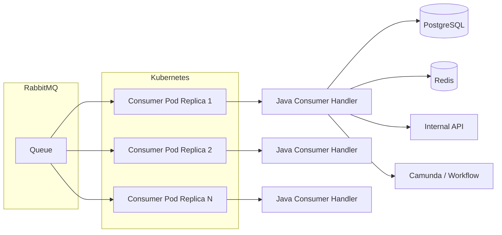
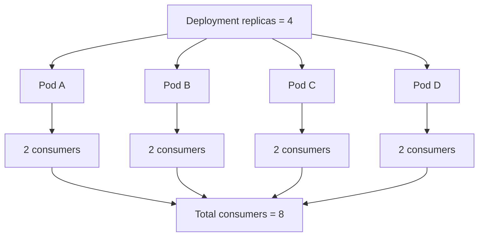
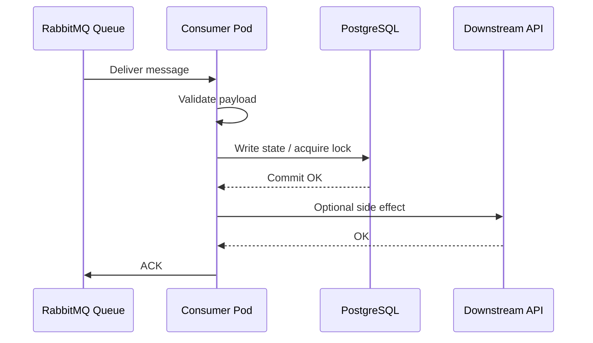
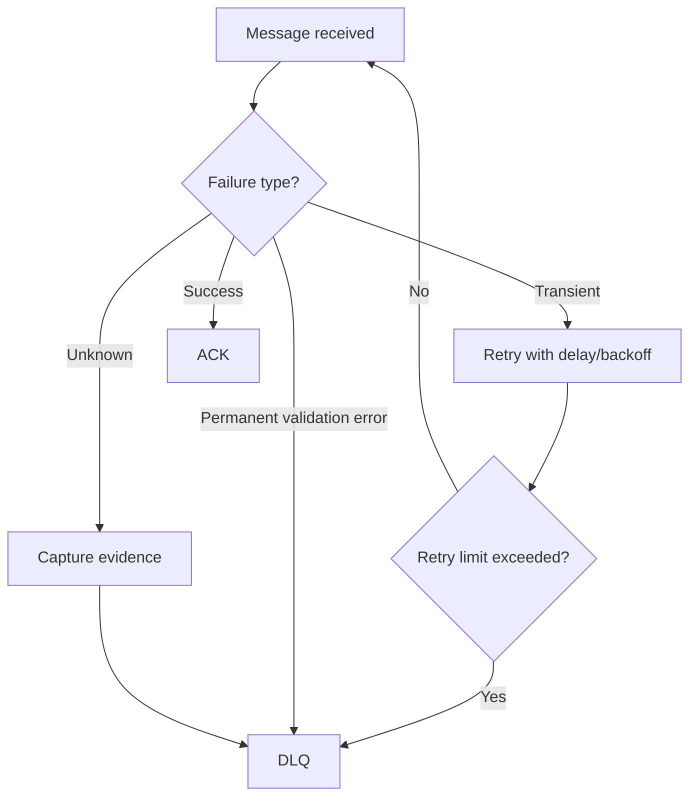
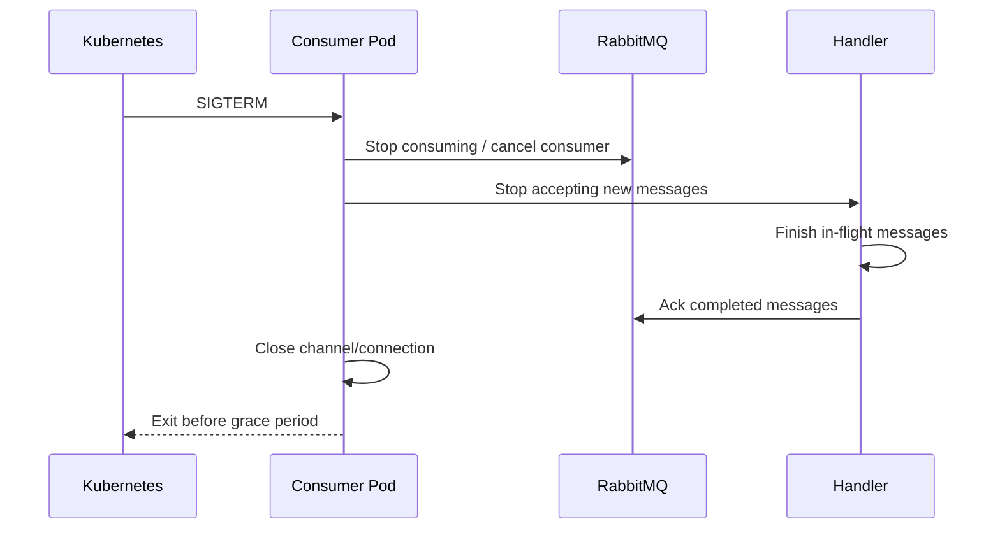
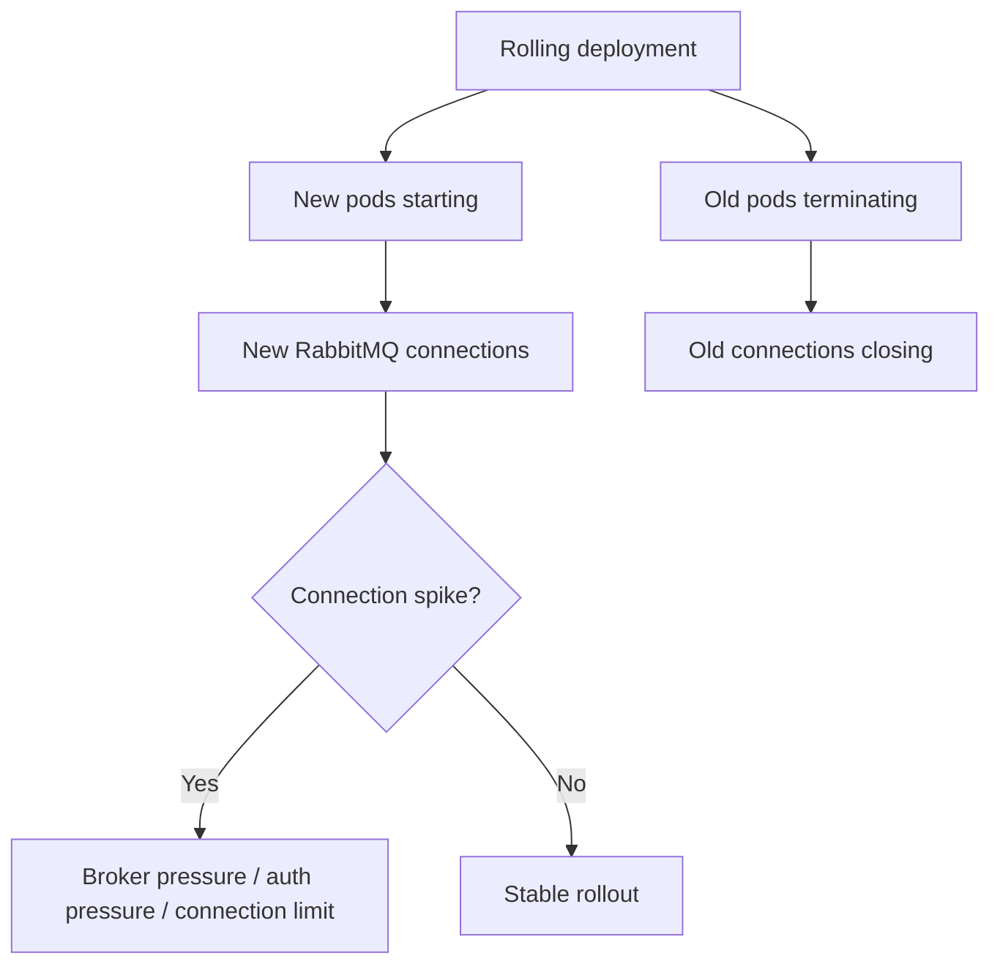
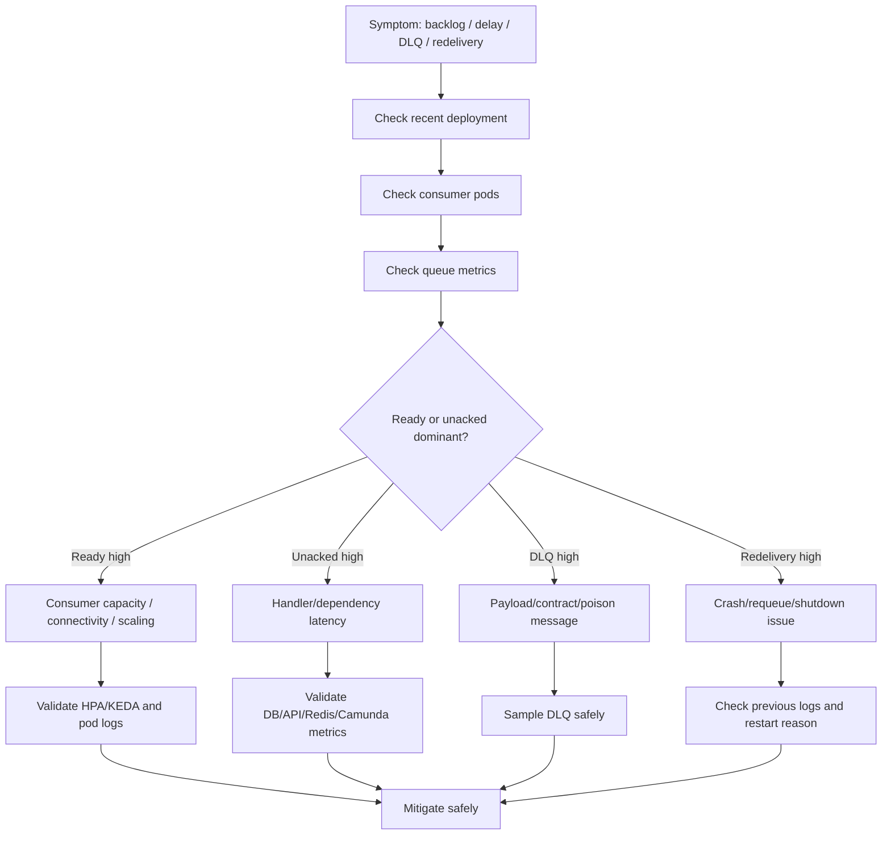

# Part 017 — RabbitMQ Consumer Workload Operations

RabbitMQ consumer yang berjalan di Kubernetes terlihat sederhana dari luar: ada `Deployment`, ada beberapa pod, pod membuka connection ke RabbitMQ, lalu mengonsumsi message dari queue. Dalam production system, model ini jauh lebih berisiko. Setiap replica pod dapat menambah consumer, connection, channel, unacked message, retry traffic, dan load ke dependency downstream seperti PostgreSQL, Redis, Camunda, atau service internal lain.

Untuk backend engineer, fokus operasionalnya bukan hanya “consumer pod running”. Fokus yang benar adalah:

1. apakah queue backlog sedang naik atau turun;
2. apakah consumer benar-benar memproses message atau hanya mengambil message lalu menggantung;
3. apakah unacked message meningkat;
4. apakah retry dan redelivery terkendali;
5. apakah pod restart menyebabkan duplicate processing;
6. apakah prefetch sesuai kapasitas service;
7. apakah scaling pod memperbaiki throughput atau justru menekan database/broker;
8. apakah shutdown consumer aman terhadap message yang sedang diproses;
9. apakah DLQ menangkap poison message dengan konteks yang cukup;
10. apakah observability cukup untuk triage incident.

Dalam konteks CPQ, quote/order lifecycle, order management, billing integration, dan workflow orchestration, RabbitMQ consumer sering menjadi komponen penting untuk asynchronous processing. Kegagalan kecil di consumer bisa berubah menjadi backlog besar, delayed order processing, duplicate downstream call, inconsistent state, atau incident lintas domain.

---

## 1. Mental Model RabbitMQ Consumer di Kubernetes

RabbitMQ consumer workload harus dibaca sebagai gabungan dari empat lapisan:



Lapisan operasionalnya:

| Lapisan | Yang dicek | Risiko utama |
|---|---|---|
| RabbitMQ queue | depth, ready, unacked, redelivered, publish rate, consume rate | backlog, poison message, retry storm |
| Consumer pod | running, ready, restart, CPU, memory, shutdown | pod tidak stabil, duplicate processing |
| Java handler | thread pool, prefetch, ack/nack, transaction boundary | message hilang, duplicate side effect |
| Dependency | PostgreSQL, Redis, HTTP service, Camunda | bottleneck pindah ke dependency |

Consumer bukan hanya “scale out = lebih cepat”. Dalam message system, scale out dapat memperbesar throughput hanya jika bottleneck memang ada di consumer processing. Jika bottleneck ada di database, lock, external API, Redis, atau Camunda, menambah pod dapat memperburuk kondisi.

---

## 2. Queue Depth, Ready Message, and Backlog Meaning

Queue depth adalah jumlah message yang belum selesai diproses. Dalam RabbitMQ, biasanya perlu dibedakan antara:

| Signal | Arti operasional |
|---|---|
| Ready messages | Message tersedia di queue dan belum dikirim ke consumer |
| Unacked messages | Message sudah dikirim ke consumer tetapi belum di-ack |
| Total queue depth | Ready + unacked |
| Publish rate | Kecepatan producer memasukkan message |
| Deliver/consume rate | Kecepatan message dikirim ke consumer |
| Ack rate | Kecepatan consumer menyelesaikan message |
| Redelivery rate | Kecepatan message dikirim ulang |

Interpretasi umum:

| Gejala | Kemungkinan penyebab |
|---|---|
| Ready naik, unacked rendah | consumer kurang, consumer down, routing issue, queue blocked |
| Ready rendah, unacked tinggi | consumer mengambil message tetapi lambat/hang |
| Ready dan unacked naik | throughput consumer kalah jauh dari producer |
| Redelivery naik | consumer crash, nack/requeue, timeout, poison message |
| Ack rate turun | dependency lambat, thread pool saturasi, DB lock, external API issue |

Backend engineer harus hati-hati: queue depth tinggi bukan selalu masalah RabbitMQ. Sering kali RabbitMQ hanya menampilkan symptom dari aplikasi atau dependency yang lambat.

---

## 3. Consumer Count and Replica Count

Di Kubernetes, jumlah consumer sering mengikuti jumlah pod replica, tetapi tidak selalu 1:1. Satu pod bisa membuka satu atau lebih consumer/channel. Karena itu, replica count harus dibaca bersama konfigurasi aplikasi.



Checklist reasoning:

| Pertanyaan | Kenapa penting |
|---|---|
| Berapa replica pod? | Menentukan kapasitas parallelism level Kubernetes |
| Berapa consumer per pod? | Menentukan actual broker consumer count |
| Berapa processing thread per consumer? | Menentukan concurrency internal aplikasi |
| Berapa prefetch per consumer/channel? | Menentukan jumlah message in-flight |
| Berapa DB connection per pod? | Menentukan tekanan ke PostgreSQL |
| Berapa HTTP client pool per pod? | Menentukan tekanan ke downstream service |

Formula kasar:

```text
actual_inflight_capacity = pod_replicas * consumers_per_pod * prefetch_count
potential_db_connections = pod_replicas * db_pool_max_per_pod
potential_downstream_concurrency = pod_replicas * handler_threads_per_pod
```

Jika `actual_inflight_capacity` terlalu besar dibanding kemampuan handler dan dependency, unacked message dapat meningkat dan redelivery akan menjadi lebih berbahaya saat pod restart.

---

## 4. Prefetch: The Most Important RabbitMQ Consumer Knob

`prefetch` membatasi berapa banyak message yang boleh dikirim RabbitMQ ke consumer sebelum message sebelumnya di-ack. Ini adalah mekanisme backpressure paling penting di consumer RabbitMQ.

Prefetch terlalu tinggi:

- unacked message besar;
- message “terkunci” di consumer lambat;
- shutdown menjadi lambat;
- restart meningkatkan redelivery batch besar;
- fairness antar consumer menurun;
- memory consumer bisa naik;
- dependency dapat menerima burst besar.

Prefetch terlalu rendah:

- throughput rendah;
- broker round-trip overhead lebih besar;
- consumer idle walaupun masih ada kapasitas processing;
- scaling butuh lebih banyak pod.

Prinsip praktis:

| Workload type | Prefetch starting point | Catatan |
|---|---:|---|
| Slow DB transaction | 1–5 | Prioritaskan safety dan fairness |
| External API call | 1–10 | Sesuaikan timeout dan rate limit downstream |
| CPU-bound local processing | 5–50 | Perhatikan CPU limit dan throttling |
| Fast idempotent cache update | 20–100 | Perlu observability unacked dan retry |
| Long-running order workflow | 1–3 | Hindari banyak in-flight message per pod |

Prefetch tidak boleh ditentukan hanya berdasarkan “ingin cepat”. Prefetch adalah kontrak antara broker, handler, dan dependency.

---

## 5. Ack, Nack, Reject, and Message Safety

RabbitMQ consumer harus jelas dalam pola acknowledgement.

| Aksi | Arti | Risiko |
|---|---|---|
| `ack` | Message dianggap selesai | Jika ack sebelum side effect commit, message bisa hilang secara logis |
| `nack requeue=true` | Message dikembalikan ke queue | Bisa menyebabkan retry loop tanpa delay |
| `nack requeue=false` | Message ditolak dan bisa masuk DLQ jika configured | Bisa kehilangan processing jika DLQ tidak dikonfigurasi |
| `reject` | Menolak single message | Mirip nack untuk kasus tertentu |

Boundary yang harus jelas:



Operational rule:

- Ack terlalu awal dapat menyebabkan message dianggap selesai padahal side effect gagal.
- Ack terlalu akhir dapat menyebabkan duplicate processing saat consumer crash setelah commit tetapi sebelum ack.
- Karena exactly-once hampir selalu ilusi di distributed system, handler harus idempotent.

---

## 6. Idempotency for RabbitMQ Consumers

RabbitMQ redelivery bisa terjadi karena:

- pod crash sebelum ack;
- network drop antara consumer dan broker;
- consumer timeout;
- manual nack/requeue;
- deployment rolling restart;
- node eviction;
- broker failover;
- connection/channel reset.

Karena itu, consumer handler harus dirancang untuk at-least-once delivery.

Idempotency pattern:

| Pattern | Cocok untuk | Catatan |
|---|---|---|
| Idempotency key table | order event, quote update, billing event | Simpan message id/business id |
| Unique constraint | create operation | Gunakan natural key atau command id |
| Status transition guard | lifecycle state | Pastikan transisi valid |
| Dedup cache | high-volume short-lived event | Hati-hati TTL dan recovery |
| Outbox/inbox pattern | cross-service consistency | Cocok untuk enterprise workflow |
| Optimistic locking | aggregate update | Tangani conflict secara eksplisit |

Contoh guard logis untuk quote/order lifecycle:

```text
Message: ORDER_CONFIRMED
Current order state: ACTIVATED
Expected previous state: SUBMITTED
Decision: ignore as duplicate or route to reconciliation, not apply side effect again
```

Consumer yang tidak idempotent adalah incident yang menunggu waktu.

---

## 7. Retry and DLQ Strategy

Retry harus dibedakan berdasarkan jenis failure.

| Failure | Retry? | Catatan |
|---|---|---|
| Temporary DB connection failure | Ya | Dengan backoff |
| External API timeout | Ya | Dengan limit dan circuit breaker |
| Validation error | Tidak | Kirim DLQ atau reject permanen |
| Missing mandatory field | Tidak | Poison message |
| Unknown reference data | Mungkin | Tergantung eventual consistency |
| Deadlock/serialization failure | Ya | Bounded retry |
| Permission denied | Tidak langsung | Eskalasi config/identity |

Anti-pattern umum:

```text
catch (Exception e) {
  nack(requeue = true)
}
```

Ini dapat menyebabkan infinite hot loop: message gagal, masuk queue lagi, langsung dikonsumsi lagi, gagal lagi, dan seterusnya.

Strategi yang lebih aman:



DLQ harus menyimpan cukup konteks:

- original message payload atau reference aman;
- error code;
- exception type;
- service version;
- timestamp;
- correlation ID;
- retry count;
- originating queue/exchange/routing key;
- business key seperti quoteId/orderId jika aman;
- trace ID jika ada.

---

## 8. Pod Shutdown and Message Safety

Kubernetes rolling update, node drain, autoscaling down, dan pod eviction akan mengirim SIGTERM ke container. RabbitMQ consumer harus merespons dengan graceful shutdown.

Shutdown yang aman:



Risiko shutdown buruk:

| Masalah | Dampak |
|---|---|
| Pod langsung exit | In-flight message redelivered |
| Ack sebelum processing selesai | Message hilang secara logis |
| Grace period terlalu pendek | Forced SIGKILL, duplicate processing |
| Prefetch terlalu besar | Banyak message redelivered saat shutdown |
| Consumer tetap menerima message setelah SIGTERM | Shutdown tidak pernah bersih |

Kubernetes setting yang relevan:

```yaml
terminationGracePeriodSeconds: 60
lifecycle:
  preStop:
    exec:
      command: ["/bin/sh", "-c", "sleep 10"]
```

`preStop sleep` bukan solusi utama. Solusi utama harus ada di aplikasi: stop consuming, drain in-flight work, lalu close connection.

---

## 9. Readiness Probe for Consumers

Untuk API service, readiness menentukan apakah pod menerima HTTP traffic. Untuk RabbitMQ consumer, readiness tidak selalu berarti hal yang sama. Consumer workload bisa tidak punya inbound Service sama sekali.

Namun readiness tetap berguna untuk lifecycle dan rollout.

Readiness consumer dapat berarti:

- app boot complete;
- RabbitMQ connection established;
- required config loaded;
- DB connection available;
- consumer registration complete;
- application is not in draining mode.

Hati-hati dependency check anti-pattern:

| Readiness design | Risiko |
|---|---|
| Readiness gagal saat RabbitMQ down | Pod dikeluarkan dari Service, tetapi untuk worker mungkin tidak relevan |
| Liveness gagal saat RabbitMQ down | Pod restart loop saat dependency down |
| Readiness mengecek semua downstream berat | Probe menjadi sumber load dan false negative |
| No readiness | Rollout bisa menganggap pod ready terlalu cepat |

Untuk worker, readiness lebih cocok sebagai sinyal “worker process initialized”, sedangkan dependency health detail harus ada di metrics/dashboard.

---

## 10. Scaling RabbitMQ Consumers in Kubernetes

Scaling consumer harus melihat empat hal:

1. backlog;
2. processing time per message;
3. downstream capacity;
4. broker capacity.

Scaling decision sederhana:

```text
required_consumers ≈ incoming_rate / sustainable_processing_rate_per_consumer
```

Namun di production, hitungan harus ditambah batas:

```text
max_safe_replicas <= min(
  database_capacity_limit,
  downstream_api_rate_limit,
  rabbitmq_connection_limit,
  node_capacity_limit,
  operational_blast_radius_limit
)
```

Scaling terlalu agresif dapat menyebabkan:

- DB connection exhaustion;
- lock contention;
- API rate limit downstream;
- Redis connection saturation;
- RabbitMQ channel/connection overhead;
- redelivery burst saat rolling restart;
- log/metric cost spike;
- noisy incident karena backlog turun tetapi dependency error naik.

---

## 11. HPA and KEDA Awareness

RabbitMQ consumer biasanya tidak ideal jika hanya diskalakan berdasarkan CPU. CPU bisa rendah walaupun queue backlog tinggi, misalnya consumer menunggu database atau external API.

Metric autoscaling yang lebih relevan:

| Metric | Kegunaan |
|---|---|
| Queue depth | Backlog kasar |
| Queue depth per consumer | Backlog relatif terhadap capacity |
| Ready messages | Work waiting to be consumed |
| Unacked messages | Work already in flight |
| Ack rate | Actual completion throughput |
| Processing latency | Service time per message |
| DLQ rate | Failure rate |

Dengan KEDA atau external metrics, consumer dapat scale berdasarkan queue length. Tetapi scaling berdasarkan queue length juga punya risiko:

- metric lag;
- scaling delay;
- max replica terlalu tinggi;
- consumer boot lambat;
- backlog turun sementara error naik;
- queue depth metric tidak membedakan poison message;
- scaling tidak membantu jika bottleneck downstream.

Checklist sebelum event-based scaling:

- Apakah handler idempotent?
- Apakah prefetch sesuai?
- Apakah DB pool aman saat max replica?
- Apakah downstream punya rate limit?
- Apakah DLQ dan retry terkendali?
- Apakah shutdown aman?
- Apakah ada dashboard queue + consumer + dependency?

---

## 12. Connection and Channel Lifecycle

RabbitMQ client biasanya memakai connection dan channel. Connection mahal, channel lebih ringan. Namun pola penggunaan tetap harus dikontrol.

Anti-pattern:

- membuat connection baru per message;
- membuat channel baru per message tanpa pooling/lifecycle jelas;
- tidak menutup channel saat shutdown;
- reconnect loop tanpa backoff;
- connection storm saat semua pod restart bersamaan;
- tidak punya metric connection/channel count.

Operational concern di Kubernetes:



Yang perlu dicek:

- connection per pod;
- channel per pod;
- heartbeat timeout;
- reconnect backoff;
- TLS overhead jika digunakan;
- credential rotation behavior;
- network policy egress;
- DNS resolution behavior;
- broker connection limit.

---

## 13. Backpressure and Downstream Protection

Consumer harus melindungi downstream. RabbitMQ queue sering menjadi buffer, tetapi buffer bukan alasan untuk memproses tanpa batas.

Backpressure layer:

| Layer | Backpressure mechanism |
|---|---|
| RabbitMQ | prefetch, queue length limit, flow control |
| Consumer app | worker thread pool, semaphore, bounded executor |
| Database | connection pool, lock timeout, query timeout |
| HTTP client | pool limit, rate limiter, timeout, circuit breaker |
| Kubernetes | HPA max replica, resource limits |
| Business process | SLA, retry window, reconciliation |

Jika consumer mengambil message lebih cepat daripada menyelesaikan side effect, pressure berpindah dari queue ke unacked memory dan downstream dependency. Dalam incident, ini membuat gejala terlihat seperti “RabbitMQ kosong”, padahal sebenarnya message sedang menggantung di consumer.

---

## 14. Observability for RabbitMQ Consumer Workloads

Minimal dashboard untuk RabbitMQ consumer:

| Dashboard panel | Kenapa penting |
|---|---|
| Queue ready messages | Melihat backlog belum dikonsumsi |
| Queue unacked messages | Melihat in-flight/hanging work |
| Publish rate | Input pressure |
| Ack rate | Output throughput |
| Redelivery rate | Duplicate/retry symptom |
| DLQ depth/rate | Poison/failure symptom |
| Consumer count | Actual active consumers |
| Pod replicas/restarts | Kubernetes stability |
| Handler latency | Processing bottleneck |
| Error rate by exception type | Failure classification |
| DB/Redis/API latency | Dependency bottleneck |
| CPU/memory/throttling | Resource issue |

Log field penting:

```text
timestamp
service
pod
namespace
queue
exchange
routingKey
messageId
correlationId
traceId
businessKey
attempt
redelivered
handler
result
errorType
latencyMs
```

Jangan log secret, token, credential, full PII, atau payload sensitif. Untuk enterprise order/quote data, logging payload harus mengikuti kebijakan privacy dan compliance internal.

---

## 15. Common Failure Modes

### 15.1 Queue Depth Naik Terus

Kemungkinan:

- consumer pod down;
- consumer count turun;
- RabbitMQ connection gagal;
- deployment baru bug;
- downstream lambat;
- DB lock;
- prefetch terlalu rendah;
- HPA tidak scale;
- KEDA metric gagal;
- producer spike.

Safe investigation:

```bash
kubectl get deploy,pod -n <namespace> -l app=<consumer-app>
kubectl describe deploy <consumer-deployment> -n <namespace>
kubectl logs -n <namespace> deploy/<consumer-deployment> --tail=200
kubectl top pod -n <namespace> -l app=<consumer-app>
```

RabbitMQ-side yang perlu dicek melalui dashboard/internal tooling:

- ready messages;
- unacked messages;
- consumer count;
- publish/ack rate;
- redelivery rate;
- DLQ depth.

### 15.2 Unacked Message Tinggi

Kemungkinan:

- handler lambat;
- dependency hang;
- thread pool saturated;
- prefetch terlalu tinggi;
- pod CPU throttled;
- DB connection pool exhausted;
- external API timeout terlalu panjang.

Mitigasi awal yang sering aman:

- hentikan rollout jika baru deploy;
- rollback jika issue correlated dengan release;
- turunkan prefetch di release berikutnya jika terlalu tinggi;
- kurangi max replica jika dependency overload;
- aktifkan circuit breaker/rate limit jika tersedia;
- eskalasi ke DB/platform jika dependency bottleneck.

### 15.3 Redelivery Rate Tinggi

Kemungkinan:

- pod restart;
- consumer crash;
- nack/requeue loop;
- grace period terlalu pendek;
- broker connection reset;
- poison message;
- deployment rolling restart terlalu agresif.

Yang dicek:

```bash
kubectl get pod -n <namespace> -l app=<consumer-app>
kubectl describe pod <pod> -n <namespace>
kubectl logs <pod> -n <namespace> --previous
kubectl get events -n <namespace> --sort-by=.lastTimestamp
```

### 15.4 DLQ Naik

Kemungkinan:

- payload invalid;
- schema mismatch;
- downstream contract berubah;
- permission/config error;
- missing reference data;
- message poison setelah deployment baru;
- retry exhausted.

Prinsip triage DLQ:

1. Jangan replay massal tanpa memahami root cause.
2. Ambil sample aman.
3. Kelompokkan error by type/business key/version.
4. Cek recent deployment/config/schema change.
5. Perbaiki root cause.
6. Replay secara bounded dengan monitoring.

---

## 16. Production-Safe Debugging Flow



Safe command set:

```bash
kubectl get deploy,pod,hpa -n <namespace> -l app=<consumer-app>
kubectl describe deploy <consumer-deployment> -n <namespace>
kubectl describe pod <pod> -n <namespace>
kubectl logs <pod> -n <namespace> --tail=300
kubectl logs <pod> -n <namespace> --previous --tail=300
kubectl top pod -n <namespace> -l app=<consumer-app>
kubectl get events -n <namespace> --sort-by=.lastTimestamp
```

Use `exec` hanya jika policy internal mengizinkan. Jangan mengambil credential, environment secret, atau payload sensitif dari pod tanpa approval.

---

## 17. Rollout Safety for RabbitMQ Consumers

Consumer rollout lebih sensitif dibanding stateless API karena pod bisa sedang memproses message.

Checklist rollout:

- `terminationGracePeriodSeconds` cukup;
- app menangani SIGTERM;
- consumer stop menerima message saat draining;
- in-flight message selesai atau dilepas aman;
- prefetch tidak terlalu besar;
- retry/DLQ behavior aman;
- deployment strategy tidak menurunkan semua consumer sekaligus;
- PDB sesuai;
- smoke test mencakup consume satu message test jika memungkinkan;
- dashboard queue dipantau saat rollout;
- rollback path jelas.

Contoh risk:

```yaml
strategy:
  type: RollingUpdate
  rollingUpdate:
    maxUnavailable: 50%
    maxSurge: 50%
```

Untuk consumer critical, `maxUnavailable` besar bisa menurunkan throughput mendadak. `maxSurge` besar bisa menambah consumer sementara dan memberi tekanan ke DB/broker. Nilainya harus dipilih berdasarkan kapasitas dependency, bukan default semata.

---

## 18. RabbitMQ Consumer PR Review Checklist

Review manifest dan config:

- Apakah workload benar Deployment, bukan Job/CronJob?
- Apakah replica count sesuai throughput dan dependency capacity?
- Apakah HPA/KEDA target masuk akal?
- Apakah `maxReplicas` aman terhadap DB/broker?
- Apakah resource request/limit cukup?
- Apakah CPU throttling dapat mengganggu handler latency?
- Apakah memory cukup untuk prefetch/in-flight messages?
- Apakah `terminationGracePeriodSeconds` cukup?
- Apakah graceful shutdown diimplementasikan?
- Apakah readiness/liveness tidak menyebabkan restart loop saat RabbitMQ down?
- Apakah Secret untuk broker aman?
- Apakah NetworkPolicy mengizinkan egress ke RabbitMQ dan DNS?
- Apakah DLQ configured?
- Apakah retry bounded?
- Apakah observability queue/consumer tersedia?
- Apakah rollback aman terhadap duplicate processing?

Review aplikasi:

- Apakah handler idempotent?
- Apakah ack setelah side effect aman?
- Apakah failure permanen masuk DLQ?
- Apakah transient retry punya backoff?
- Apakah correlation ID dipropagasikan?
- Apakah business key cukup untuk troubleshooting?
- Apakah payload sensitif tidak di-log?
- Apakah dependency timeout bounded?
- Apakah DB transaction boundary jelas?

---

## 19. Internal Verification Checklist

Gunakan checklist ini saat masuk ke environment internal, tanpa mengasumsikan detail CSG tertentu.

### RabbitMQ topology

- Nama exchange, queue, routing key yang digunakan service.
- Queue type dan durability policy.
- DLQ dan dead-letter exchange/routing key.
- Retry topology: delayed exchange, TTL queue, plugin, atau application retry.
- Message TTL dan queue length limit.
- Ownership queue: backend team, platform team, atau shared integration team.

### Consumer workload

- Deployment name dan namespace.
- Replica count baseline.
- HPA/KEDA configuration.
- Consumer per pod.
- Prefetch count.
- Handler thread pool.
- Resource request/limit.
- Graceful shutdown implementation.
- Startup/readiness/liveness probes.
- PDB.

### Dependency impact

- PostgreSQL pool per pod dan max connection.
- Redis connection pool.
- HTTP client pool.
- Camunda/API dependency timeout.
- External service rate limit.
- Downstream circuit breaker.

### Observability

- Queue dashboard.
- Consumer dashboard.
- DLQ dashboard.
- Pod restart dashboard.
- Error by exception type.
- Handler latency metric.
- Trace/correlation propagation.
- Alert for backlog, unacked, redelivery, DLQ.
- Runbook link.

### Security and operations

- Broker credential source.
- Secret rotation behavior.
- NetworkPolicy egress to RabbitMQ.
- TLS/mTLS requirement.
- RBAC access for investigation.
- Incident escalation owner.
- Replay DLQ approval process.

---

## 20. Backend Engineer Responsibility vs Platform/SRE Responsibility

| Area | Backend service owner | Platform/SRE |
|---|---|---|
| Handler idempotency | Own | Review/support |
| Ack/nack behavior | Own | Review/support |
| Retry/DLQ logic | Own with integration agreement | Broker topology support |
| Queue topology | Co-own/verify | Often provision/support |
| RabbitMQ cluster health | Observe/escalate | Own |
| Kubernetes Deployment | Own with platform standards | Guardrails/support |
| HPA/KEDA config | Co-own | Platform implementation/support |
| Broker credential | Consume safely | Secret platform/security support |
| NetworkPolicy | Request/review | Enforce/support |
| Incident triage | Own service-level triage | Own broker/platform triage |

Backend engineer should not pretend to own broker internals if the platform team owns RabbitMQ. But backend engineer must own message semantics, idempotency, retry behavior, dependency pressure, and workload safety.

---

## 21. Operational Runbook: Queue Backlog Incident

### Trigger

- Queue depth rising for sustained period.
- Business SLA breach: quote/order processing delayed.
- DLQ or redelivery spike.

### Triage sequence

1. Confirm affected queue and service.
2. Check recent deployment/config changes.
3. Check consumer pod health and restarts.
4. Compare ready vs unacked messages.
5. Check ack rate vs publish rate.
6. Check DLQ/redelivery rate.
7. Check dependency latency/error: PostgreSQL, Redis, API, Camunda.
8. Check HPA/KEDA scaling status.
9. Identify whether bottleneck is consumer, broker, or dependency.
10. Mitigate safely.

### Safe mitigations

| Situation | Possible mitigation |
|---|---|
| Bad deployment correlated | Rollback consumer deployment |
| Consumer replica too low | Scale cautiously within dependency capacity |
| Dependency overloaded | Stop scaling consumers; reduce pressure; escalate dependency owner |
| Poison message | Route to DLQ; avoid hot requeue |
| Retry storm | Disable/reduce requeue path if feature flag/config exists |
| Broker issue | Escalate platform/SRE with evidence |

### Evidence to capture

- Queue metrics screenshot/time range.
- Consumer deployment revision.
- Pod restart and previous logs.
- DLQ sample classification.
- Dependency metrics.
- Timeline of deployment/config changes.
- Mitigation actions and result.

---

## 22. Key Takeaways

RabbitMQ consumer operations in Kubernetes require reasoning across queue, pod, Java handler, dependency, and rollout lifecycle. The most important production concepts are queue depth, unacked messages, prefetch, ack/nack boundary, idempotency, DLQ, graceful shutdown, and dependency capacity.

A backend engineer should be able to answer:

- Are messages waiting, in-flight, failing, or being redelivered?
- Is the bottleneck consumer capacity, dependency latency, broker health, or bad deployment?
- Is scaling safe or dangerous right now?
- Will pod restart duplicate side effects?
- Is DLQ protecting the system or hiding data loss?
- Does the rollout strategy respect message processing lifecycle?

The operational goal is not merely to make the queue empty. The goal is to process messages correctly, safely, observably, and within the capacity of the full enterprise system.
