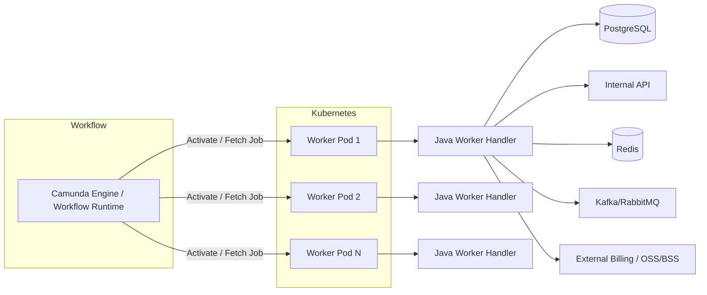
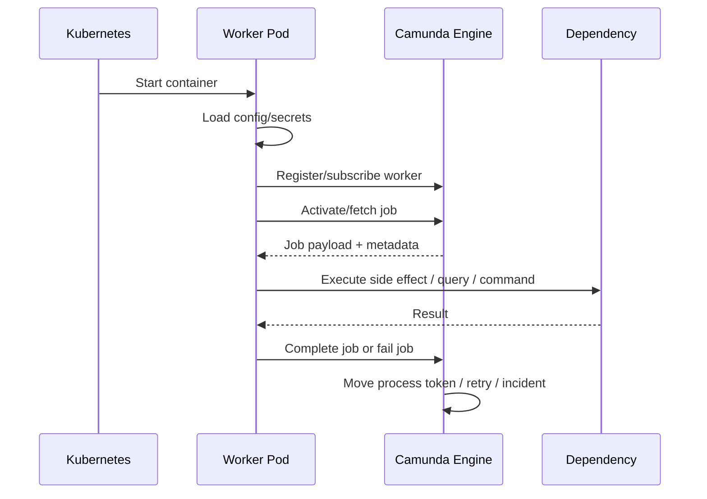
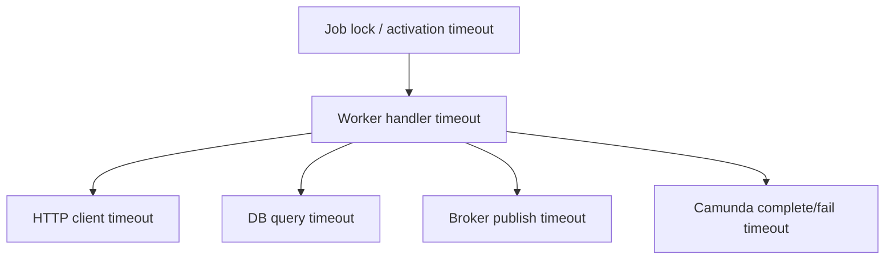
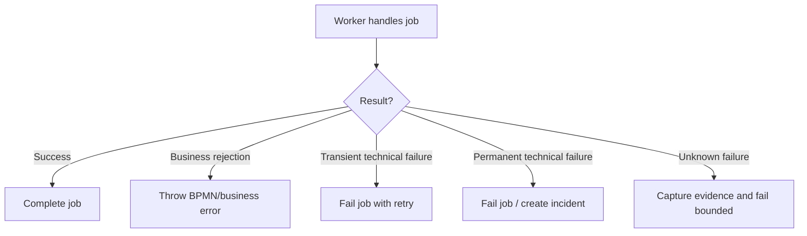
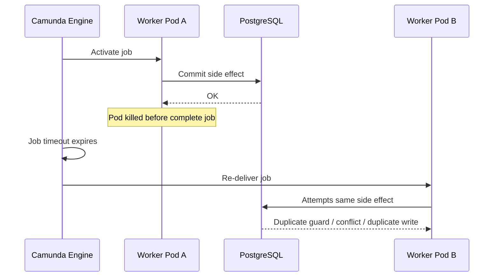
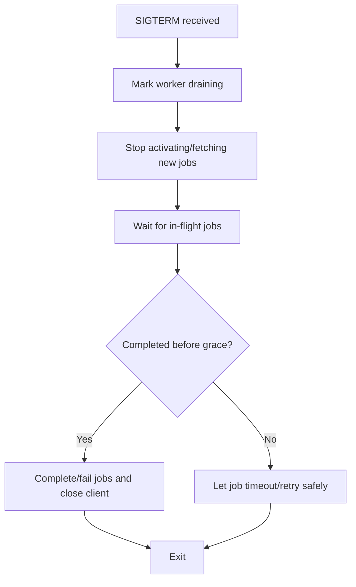
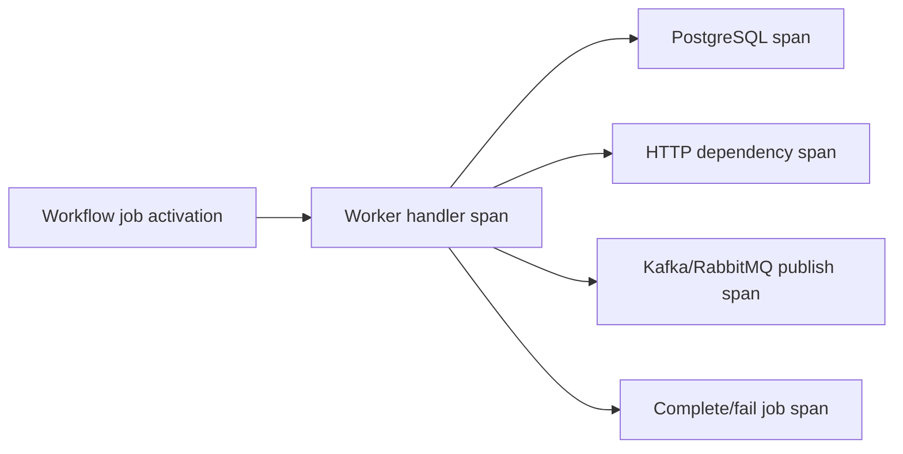
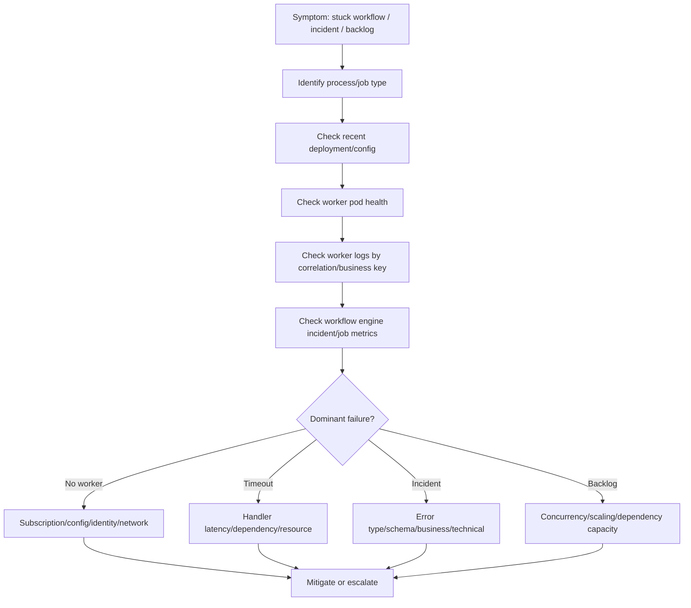

# Part 018 — Camunda Worker Operations

Camunda worker di Kubernetes adalah workload yang menjalankan pekerjaan workflow secara asynchronous. Dalam sistem enterprise seperti CPQ, quote management, order management, billing integration, dan quote-to-cash, worker sering menjadi jembatan antara proses bisnis dan sistem teknis: validasi quote, reservasi resource, order decomposition, orchestration, billing handoff, notification, reconciliation, dan exception handling.

Secara operasional, Camunda worker tidak boleh diperlakukan seperti REST API biasa. Worker tidak selalu menerima inbound HTTP traffic dari user, tetapi memiliki lifecycle processing yang kuat terhadap job activation, lock/timeout, retry, incident, state transition, correlation, dan dependency side effect.

Masalah worker sering terlihat sebagai:

- workflow stuck;
- job backlog naik;
- incident meningkat;
- process instance tidak bergerak;
- external task/job timeout;
- duplicate side effect setelah pod restart;
- worker tidak mengambil job;
- worker mengambil terlalu banyak job;
- retry storm;
- order/quote lifecycle berhenti di step tertentu;
- deployment baru menyebabkan spike incident.

Backend engineer harus mampu membaca worker sebagai bagian dari runtime workflow, bukan hanya pod yang `Running`.

---

## 1. Operational Mental Model Camunda Worker di Kubernetes

Worker beroperasi di antara orchestration engine, Kubernetes runtime, dan dependency backend.



Empat state harus dibaca bersamaan:

| Layer | Operational state |
|---|---|
| Workflow engine | process instance, job, incident, retry, timeout |
| Worker app | activated job, handler latency, success/failure, concurrency |
| Kubernetes | pod lifecycle, restart, rollout, resources, shutdown |
| Dependency | DB/API/broker/cache availability, timeout, idempotency |

Jika hanya melihat pod `Running`, Anda bisa melewatkan workflow yang stuck. Jika hanya melihat Camunda incident, Anda bisa melewatkan penyebab runtime seperti CPU throttling, config drift, atau network policy.

---

## 2. Worker Lifecycle

Worker lifecycle umumnya:



Operational checkpoints:

1. worker boot berhasil;
2. credential/config engine benar;
3. worker dapat connect ke engine;
4. worker subscribe ke job type/topic yang benar;
5. worker mengambil job sesuai concurrency;
6. handler menyelesaikan job dalam timeout;
7. completion/failure dikirim ke engine;
8. process instance bergerak ke step berikutnya;
9. observability mencatat job result dan correlation.

---

## 3. Job Activation / Fetching Semantics

Tergantung versi dan pola Camunda yang digunakan, worker dapat memakai external task fetch-and-lock, job activation, atau client worker abstraction. Secara operasional, konsepnya mirip:

- worker meminta pekerjaan;
- engine memberikan sejumlah job;
- job terkunci/terasosiasi ke worker untuk durasi tertentu;
- worker harus menyelesaikan atau melaporkan failure sebelum timeout;
- jika worker mati atau timeout, job bisa diambil ulang;
- retry bisa habis dan berubah menjadi incident.

Yang harus dipahami backend engineer:

| Konsep | Makna operasional |
|---|---|
| Job type/topic | Jenis pekerjaan yang diambil worker |
| Worker name/id | Identitas worker untuk observability/debugging |
| Max jobs active / fetch size | Jumlah job in-flight |
| Lock duration / job timeout | Waktu maksimal worker memegang job |
| Retry count | Kesempatan ulang sebelum incident |
| Incident | Workflow membutuhkan intervensi atau recovery |
| Variables/payload | Data yang dibutuhkan worker |
| Correlation/business key | Kunci untuk tracing proses bisnis |

Jika worker mengambil terlalu banyak job, workflow engine terlihat aktif tetapi downstream bisa overload. Jika worker mengambil terlalu sedikit job, backlog workflow naik walaupun pod sehat.

---

## 4. Worker Concurrency

Worker concurrency adalah jumlah job yang dapat diproses paralel oleh worker. Di Kubernetes, concurrency total adalah gabungan dari replica count dan concurrency per pod.

```text
total_worker_capacity = pod_replicas * max_active_jobs_per_pod
```

Jika worker juga punya internal thread pool:

```text
effective_parallelism = min(
  pod_replicas * max_active_jobs_per_pod,
  pod_replicas * handler_thread_pool_size,
  downstream_capacity
)
```

Concurrency harus dikontrol karena setiap job mungkin melakukan:

- query/update PostgreSQL;
- HTTP call ke internal service;
- publish Kafka/RabbitMQ event;
- update Redis;
- call billing/OSS/BSS dependency;
- complete/fail job ke Camunda engine.

Concurrency terlalu tinggi dapat menyebabkan:

- DB connection exhaustion;
- row lock contention;
- external API rate limit;
- workflow incident spike;
- duplicate retries;
- CPU/memory pressure;
- long GC pause;
- engine overload.

Concurrency terlalu rendah dapat menyebabkan:

- workflow backlog;
- SLA breach;
- process instance stuck terlalu lama;
- underutilized pods;
- delayed order/quote processing.

---

## 5. Timeout, Lock Duration, and Processing Time

Worker timeout harus disesuaikan dengan real processing time. Timeout yang salah adalah salah satu penyebab incident paling umum.

| Timeout terlalu pendek | Timeout terlalu panjang |
|---|---|
| Job timeout sebelum handler selesai | Stuck job lebih lama terdeteksi |
| Duplicate execution meningkat | Failure recovery lambat |
| Incident false positive | Worker mati tetapi job terkunci lama |
| Side effect bisa terjadi dua kali | Backlog tertahan |

Timeout chain worker:



Prinsip:

- dependency timeout harus lebih kecil dari job timeout;
- handler harus punya deadline internal;
- complete/fail call ke engine harus punya timeout;
- long-running work sebaiknya dipotong, checkpointed, atau dimodelkan sebagai workflow step terpisah;
- jangan membuat job timeout sangat panjang untuk menutupi desain handler yang tidak bounded.

---

## 6. Retry, Failure, and Incident Semantics

Worker harus membedakan failure transient dan permanent.

| Failure | Worker action | Catatan |
|---|---|---|
| DB temporary unavailable | fail with retry | Bounded retry/backoff |
| External API timeout | fail with retry | Perhatikan idempotency |
| Validation error | fail without retry atau BPMN error | Tergantung model process |
| Business rule rejection | BPMN business error | Jangan dianggap technical incident |
| Missing config/secret | fail fast + incident/escalation | Biasanya deployment/config issue |
| Permission denied | incident/escalation | Bisa workload identity/RBAC/cloud IAM |
| Duplicate command | complete idempotently | Jika sudah diproses sebelumnya |

Perbedaan technical failure dan business failure penting. Business failure seharusnya menjadi jalur proses yang valid, bukan incident teknis.



---

## 7. Incident Meaning in Workflow Operations

Incident bukan hanya “error”. Incident berarti workflow tidak dapat melanjutkan secara normal tanpa retry lebih lanjut, koreksi data, koreksi config, atau intervensi.

Incident spike dapat disebabkan oleh:

- deployment baru bug;
- contract berubah;
- missing variable;
- wrong topic/job type;
- timeout terlalu pendek;
- dependency outage;
- identity/access denied;
- message/event tidak idempotent;
- workflow model tidak backward compatible;
- engine/client version mismatch;
- secret/config drift.

Incident triage harus menghubungkan:

1. process definition version;
2. process instance/business key;
3. worker deployment version;
4. job type/topic;
5. error type;
6. dependency state;
7. Kubernetes pod state;
8. recent release/config change.

---

## 8. Process Correlation and Business Key

Dalam quote/order lifecycle, debugging worker tanpa business correlation hampir mustahil. Worker logs dan traces harus bisa dihubungkan ke process instance dan domain entity.

Minimal correlation fields:

```text
processInstanceId
processDefinitionId/processDefinitionKey
jobKey/externalTaskId
jobType/topic
workerName
businessKey
quoteId/orderId/customerId jika aman
correlationId
traceId
deploymentVersion
podName
namespace
attempt/retry
```

Operational goal:

- dari alert incident, bisa menemukan pod/log/trace terkait;
- dari orderId/quoteId, bisa menemukan process instance;
- dari deployment version, bisa melihat apakah incident correlated dengan release;
- dari traceId, bisa melihat downstream latency/error.

Hati-hati privacy: business key boleh berguna, tetapi payload lengkap atau customer-sensitive data tidak boleh sembarang masuk log.

---

## 9. Pod Restart Impact on Workflow Workers

Pod restart dapat menyebabkan:

- job yang sedang diproses tidak complete;
- job timeout dan diambil worker lain;
- side effect duplicate;
- retry count berkurang;
- incident jika retry habis;
- process delay;
- engine/client reconnect storm.



Karena itu, worker harus idempotent. Job completion dan side effect tidak bisa dianggap atomic terhadap satu sama lain.

---

## 10. Graceful Shutdown for Workers

Saat Kubernetes mengirim SIGTERM, worker harus berhenti mengambil job baru, menyelesaikan in-flight job jika masih dalam grace period, lalu close client connection.

Shutdown flow:



Kubernetes concerns:

- `terminationGracePeriodSeconds` harus cukup untuk handler normal;
- `preStop` bisa memberi waktu load balancer/engine awareness, tetapi tidak menggantikan shutdown logic;
- rolling update harus menjaga cukup worker tersedia;
- HPA scale-down dapat membunuh worker saat backlog masih tinggi;
- PDB dapat membantu saat node drain.

Worker app concerns:

- stop polling/activation saat draining;
- jangan ambil job baru setelah SIGTERM;
- complete/fail in-flight job secara bounded;
- jangan block shutdown selamanya;
- emit metric/log saat draining;
- close connection cleanly.

---

## 11. Readiness and Liveness for Camunda Workers

Worker readiness harus disesuaikan dengan peran workload.

Readiness bisa mengecek:

- app initialized;
- worker client ready;
- config/secrets loaded;
- required dependency baseline reachable;
- worker not draining.

Liveness sebaiknya tidak terlalu bergantung pada dependency eksternal. Jika liveness gagal saat Camunda engine atau DB sementara down, Kubernetes akan restart pod berulang dan memperburuk incident.

Probe anti-pattern:

| Anti-pattern | Dampak |
|---|---|
| Liveness mengecek Camunda engine secara ketat | Restart storm saat engine lambat/down |
| Readiness mengecek semua downstream berat | False negative dan probe-induced load |
| Tidak ada startup probe untuk Java app lambat | Liveness membunuh pod sebelum siap |
| Probe endpoint sama dengan business endpoint berat | Probe mengganggu service |

Untuk Java worker, startup probe penting jika boot time lama karena classpath, dependency injection, migration check, certificate loading, atau warmup.

---

## 12. Resource Operations for Workers

Worker dapat CPU-bound, IO-bound, atau dependency-bound. Resource tuning harus berdasarkan workload nyata.

| Resource | Risiko jika salah |
|---|---|
| CPU request rendah | Pod sulit mendapat CPU saat node sibuk |
| CPU limit ketat | Throttling, handler latency naik, timeout job |
| Memory limit rendah | OOMKilled, job redelivery, incident |
| Heap terlalu besar | Native memory/headroom kurang |
| Thread pool besar | Memory naik, DB/API pressure |
| Ephemeral storage kecil | File/temp/log processing gagal |

Gejala resource issue:

- job timeout naik;
- incident transient meningkat;
- pod restart/OOMKilled;
- CPU throttling correlated dengan handler latency;
- GC pause correlated dengan timeout;
- DB pool wait meningkat;
- worker mengambil job tetapi completion lambat.

Safe investigation:

```bash
kubectl get pod -n <namespace> -l app=<worker-app>
kubectl top pod -n <namespace> -l app=<worker-app>
kubectl describe pod <pod> -n <namespace>
kubectl logs <pod> -n <namespace> --tail=300
kubectl logs <pod> -n <namespace> --previous --tail=300
```

---

## 13. Scaling Camunda Workers

Scaling worker tidak selalu berarti mempercepat workflow. Scaling worker meningkatkan parallel job handling, tetapi juga meningkatkan pressure ke dependency dan workflow engine.

Scaling cocok jika:

- backlog job tinggi;
- handler latency stabil;
- dependency punya capacity;
- incident rate rendah;
- worker CPU/memory masih cukup;
- engine mampu melayani activation/completion rate.

Scaling berbahaya jika:

- incident disebabkan bug deployment;
- dependency sudah overload;
- job failure permanent;
- handler tidak idempotent;
- workflow step membutuhkan ordering tertentu;
- external API punya rate limit ketat;
- DB lock contention tinggi.

Checklist autoscaling:

- Metric apa yang dipakai: CPU, job backlog, active jobs, incident rate?
- Apakah max replica aman terhadap DB/API capacity?
- Apakah worker concurrency per pod dikontrol?
- Apakah HPA scale-down aman terhadap in-flight jobs?
- Apakah pod shutdown graceful?
- Apakah retry storm dapat memicu over-scaling?

---

## 14. Workflow Version and Deployment Compatibility

Worker deployment harus kompatibel dengan process definition version yang masih aktif. Dalam enterprise workflow, process instance lama dapat berjalan lama. Deployment baru tidak boleh hanya kompatibel dengan process model terbaru.

Risiko compatibility:

- job type/topic berubah;
- variable name berubah;
- variable schema berubah;
- handler mengharapkan field baru yang tidak ada di process lama;
- worker menghapus support untuk old process version;
- BPMN error code berubah;
- retry semantics berubah;
- side effect contract berubah.

Prinsip safe change:

| Change | Safe approach |
|---|---|
| Tambah variable optional | Gunakan default dan backward compatibility |
| Rename variable | Support old + new selama transisi |
| Ubah job type | Deploy worker support dua topic sementara |
| Ubah side effect | Idempotency dan compatibility check |
| Ubah process model | Pastikan instance lama tetap bisa selesai |
| Ubah error code | Pastikan BPMN boundary event tetap valid |

---

## 15. Camunda Worker Observability

Worker observability harus menggabungkan workflow signal dan Kubernetes signal.

### Workflow metrics

- active jobs per type;
- activated/fetched jobs rate;
- completed jobs rate;
- failed jobs rate;
- incident count/rate;
- retry count distribution;
- job processing latency;
- job timeout count;
- process instance stuck duration;
- process completion latency;
- worker not found/no worker for job type;
- backlog by job type/topic.

### Kubernetes metrics

- pod replicas;
- pod readiness;
- restart count;
- CPU/memory usage;
- CPU throttling;
- OOMKilled;
- rollout revision;
- HPA status;
- node pressure;
- network errors.

### Application logs

Minimal structured log fields:

```text
timestamp
service
pod
namespace
workerName
jobType
processInstanceId
businessKey
correlationId
traceId
attempt
retryRemaining
handler
result
errorType
latencyMs
deploymentVersion
```

### Trace spans

Trace ideal:



---

## 16. Common Failure Modes

### 16.1 Worker Pod Running but No Job Processed

Kemungkinan:

- worker subscribe ke wrong job type/topic;
- config namespace/environment salah;
- engine endpoint salah;
- credential invalid;
- network policy blocking;
- worker disabled by feature flag;
- max active jobs = 0;
- engine has no matching job;
- process definition version mismatch.

Safe investigation:

```bash
kubectl get deploy,pod -n <namespace> -l app=<worker-app>
kubectl describe deploy <worker-deployment> -n <namespace>
kubectl logs -n <namespace> deploy/<worker-deployment> --tail=300
kubectl get events -n <namespace> --sort-by=.lastTimestamp
```

Check internal workflow dashboard:

- active job count by type;
- worker registration/activation logs;
- incidents by type;
- process instances waiting at activity;
- deployment version correlation.

### 16.2 Incident Spike After Deployment

Kemungkinan:

- bug handler baru;
- variable schema mismatch;
- process version incompatibility;
- missing config/secret;
- dependency permission denied;
- timeout changed;
- retry behavior changed;
- container resource regression.

Mitigation reasoning:

| Evidence | Action |
|---|---|
| Incident spike starts exactly after deployment | Consider rollback quickly |
| Only one job type affected | Disable/rollback specific worker if possible |
| Access denied | Check identity/secret/RBAC; escalate security/platform |
| Timeout only | Check dependency latency and timeout config |
| Permanent validation error | Check payload/schema/process version |

### 16.3 Job Timeout and Duplicate Side Effects

Kemungkinan:

- handler runs longer than lock duration;
- dependency timeout too long;
- pod killed before completion;
- CPU throttling/GC pause;
- network timeout;
- completion call failed after side effect committed.

Required controls:

- idempotency key;
- business state transition guard;
- bounded handler timeout;
- job timeout > dependency timeout;
- graceful shutdown;
- duplicate-safe downstream API.

### 16.4 Worker Backlog High but CPU Low

Kemungkinan:

- worker waiting on DB/API;
- max active jobs too low;
- thread pool too low;
- engine activation latency;
- network/DNS issue;
- lock contention;
- external rate limit;
- HPA CPU metric not useful.

Do not blindly add replicas. First identify if the bottleneck is inside worker, engine, or dependency.

---

## 17. Production-Safe Debugging Flow



Safe command set:

```bash
kubectl get deploy,pod,hpa -n <namespace> -l app=<worker-app>
kubectl describe deploy <worker-deployment> -n <namespace>
kubectl describe pod <pod> -n <namespace>
kubectl logs <pod> -n <namespace> --tail=300
kubectl logs <pod> -n <namespace> --previous --tail=300
kubectl top pod -n <namespace> -l app=<worker-app>
kubectl get events -n <namespace> --sort-by=.lastTimestamp
```

Workflow-side evidence to collect:

- process instance ID;
- process definition version;
- job type/topic;
- incident message/error;
- retry count;
- worker name;
- business key;
- timestamp;
- deployment version;
- trace ID/correlation ID.

---

## 18. Rollout Safety for Camunda Workers

Rollout worker harus memperhatikan in-flight jobs dan process compatibility.

Pre-deployment checklist:

- worker supports active process definition versions;
- variable schema backward compatible;
- job type/topic unchanged or dual-supported;
- retry and error semantics reviewed;
- timeout config reviewed;
- idempotency guard present;
- dependency timeout and pool reviewed;
- dashboard/alert ready;
- rollback path understood.

During deployment:

- watch pod readiness and restart;
- watch incident rate;
- watch job completion rate;
- watch job timeout rate;
- watch dependency error/latency;
- watch queue/workflow backlog;
- watch logs for unknown variable/schema errors.

Post-deployment verification:

- new worker version processing jobs;
- no spike in incident;
- process instances continue moving;
- completion latency stable;
- dependency metrics stable;
- no abnormal retries;
- no pod restarts/OOM/throttling.

Rollback caveat:

Rollback may not fix problems if deployment already changed process definition, database schema, variable format, or external side effect. Worker rollback safety depends on compatibility strategy.

---

## 19. Worker PR Review Checklist

Manifest/config review:

- Correct namespace and workload owner.
- Deployment strategy safe for worker lifecycle.
- Replica count appropriate.
- HPA/KEDA metric appropriate.
- Resource requests/limits reviewed.
- JVM heap and memory headroom reviewed.
- Startup/readiness/liveness probes safe.
- Graceful shutdown configured.
- `terminationGracePeriodSeconds` sufficient.
- PDB present for critical workers.
- Secret/config source correct.
- NetworkPolicy allows engine and dependencies.
- ServiceAccount/workload identity correct.
- Observability labels and deployment markers present.

Application review:

- Handler idempotent.
- Job timeout aligned with dependency timeout.
- Business vs technical error separated.
- Retry bounded.
- Incident message useful.
- Correlation IDs propagated.
- Process variables backward compatible.
- Active process versions supported.
- External side effects duplicate-safe.
- Logs do not leak sensitive data.

Workflow review:

- Job type/topic compatibility.
- BPMN error codes stable.
- Boundary events still match.
- Retry configuration appropriate.
- Incident path understood.
- Migration plan for long-running instances.
- Operational runbook updated.

---

## 20. Internal Verification Checklist

Gunakan ini untuk environment internal tanpa mengasumsikan detail cluster atau proses CSG tertentu.

### Workflow engine and model

- Camunda version and deployment model.
- Worker pattern: external task, job worker, embedded client, or platform-specific abstraction.
- Process definition keys and versions.
- Active long-running process versions.
- Job type/topic naming convention.
- Retry/incident policy.
- Business error vs technical incident convention.

### Worker workload

- Namespace and Deployment name.
- Service owner/team.
- Replica count and autoscaling policy.
- Worker concurrency/max active jobs.
- Job timeout/lock duration.
- Handler timeout.
- Resource request/limit.
- JVM config.
- Shutdown behavior.
- PDB.

### Dependencies

- PostgreSQL connection pool.
- Redis usage.
- Kafka/RabbitMQ publish side effects.
- Internal API dependencies.
- Billing/OSS/BSS integration dependencies.
- Timeout and retry config.
- Rate limit and circuit breaker.

### Observability

- Incident dashboard.
- Job backlog dashboard.
- Worker completion/failure dashboard.
- Process latency dashboard.
- Kubernetes pod dashboard.
- JVM dashboard.
- Dependency dashboard.
- Trace correlation.
- Alert rules.
- Runbook links.

### Security and access

- ServiceAccount.
- RBAC.
- Workload identity if cloud service is used.
- Secret source.
- Secret rotation behavior.
- NetworkPolicy.
- TLS/truststore.
- Access policy for inspecting process variables.

### Incident and recovery

- Who owns workflow incident triage.
- Who can retry incidents.
- Who can modify process variables.
- Who can cancel/migrate process instances.
- Approval required for bulk retry.
- Evidence required for RCA.
- Runbook for stuck workflow.

---

## 21. Backend Engineer Responsibility vs Platform/SRE Responsibility

| Area | Backend service owner | Platform/SRE/workflow platform |
|---|---|---|
| Worker handler logic | Own | Support observability/runtime |
| Idempotency | Own | Review/support |
| Job type/topic subscription | Own/verify | Platform convention support |
| Process compatibility | Own with workflow/domain team | Support deployment process |
| Camunda engine health | Observe/escalate | Own or co-own depending org |
| Worker Deployment | Own with standards | Platform guardrails |
| Autoscaling | Co-own | Platform implementation/support |
| Incident retry/cancel policy | Follow/own service-specific | Govern platform process |
| Secret/identity consumption | Own safe usage | Security/platform provision |
| Network connectivity | Verify/escalate | Platform/network owner |

Backend engineers own the semantics of work: what a job means, when it is complete, what failures are retryable, what side effects are safe, and how domain state transitions should behave. Platform/SRE may own the cluster and engine infrastructure, but cannot safely infer business semantics from Kubernetes state alone.

---

## 22. Operational Runbook: Workflow Stuck / Incident Spike

### Trigger

- Process instances stuck at one activity.
- Incident count increases.
- Job backlog by type increases.
- Quote/order lifecycle delay reported.
- Worker deployment just changed.

### Triage sequence

1. Identify affected process and job type.
2. Identify business impact: quote, order, billing, customer, partner, internal operation.
3. Check recent deployment/config/process model changes.
4. Check worker pod health, restart, resource pressure.
5. Check worker logs using process/business correlation.
6. Check incident error classification.
7. Check dependency health and latency.
8. Check timeout/retry behavior.
9. Decide mitigation: rollback, config fix, dependency escalation, retry pause, or controlled replay.
10. Capture evidence.

### Safe mitigations

| Situation | Possible mitigation |
|---|---|
| Bad worker deployment | Rollback worker if compatible |
| Bad config/secret | Fix config through approved pipeline |
| Dependency outage | Stop scaling pressure; escalate dependency owner |
| Permanent validation error | Route to business/error handling path |
| Incident due to schema mismatch | Patch compatibility; avoid mass retry before fix |
| Timeout due to slow dependency | Adjust timeout only after understanding retry/side effects |
| Duplicate side effect risk | Disable/reduce worker concurrency if needed |

### Dangerous actions needing approval

- Bulk retry incidents.
- Manually changing process variables.
- Cancelling process instances.
- Migrating process instances.
- Scaling worker massively.
- Disabling worker in production.
- Replaying jobs after partial side effects.

---

## 23. Key Takeaways

Camunda worker operations require reasoning across workflow state, Kubernetes lifecycle, Java runtime, and dependency side effects. A pod can be healthy while workflow is stuck. A workflow incident can be caused by config drift, bad rollout, timeout mismatch, dependency outage, CPU throttling, or process model incompatibility.

A senior backend engineer should be able to answer:

- Which job type/process activity is affected?
- Which worker version is processing it?
- Are jobs backlogged, failing, timing out, or incidented?
- Is the failure business-valid or technical?
- Are retries safe?
- Is the handler idempotent?
- Will pod restart duplicate side effects?
- Is scaling safe or will it overload dependencies?
- Can rollback actually fix the issue?
- Who owns retry/cancel/migration authority?

The goal is not merely to keep worker pods running. The goal is to keep business workflows progressing safely, observably, and recoverably.
