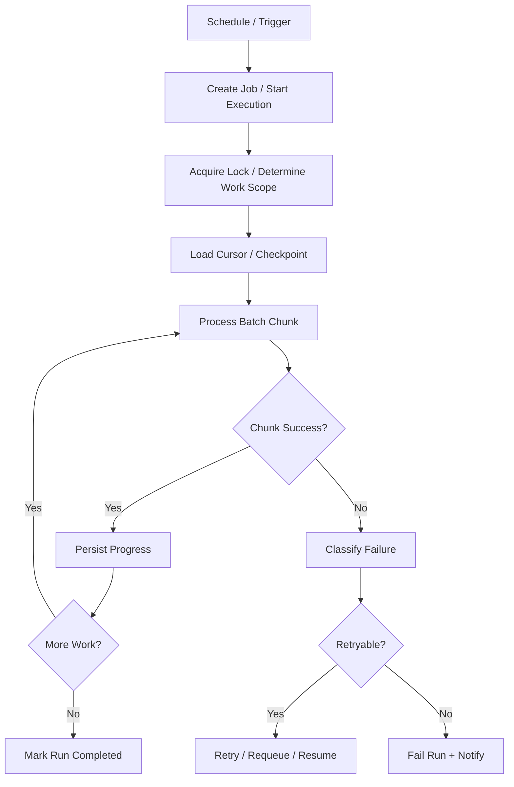
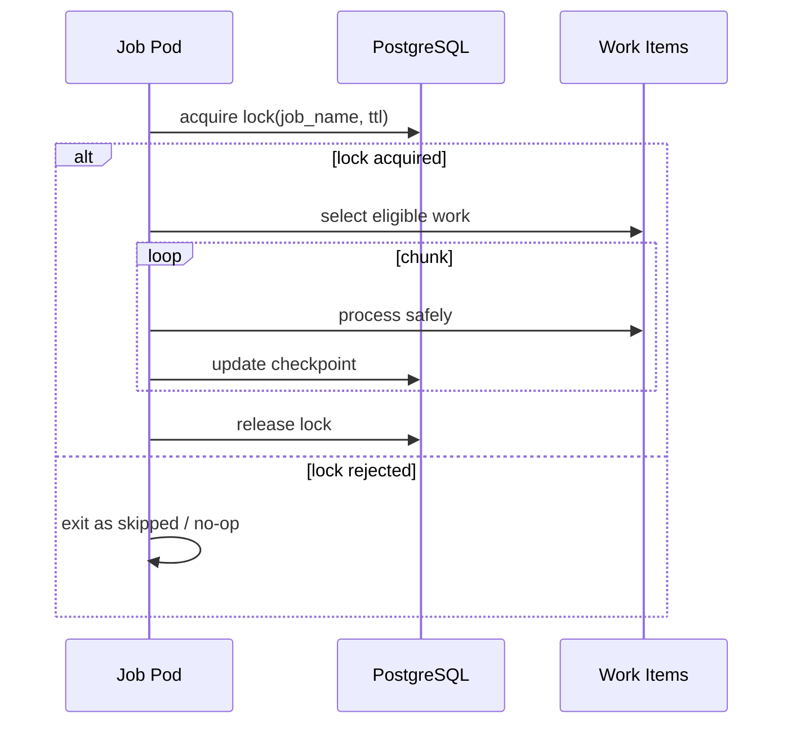
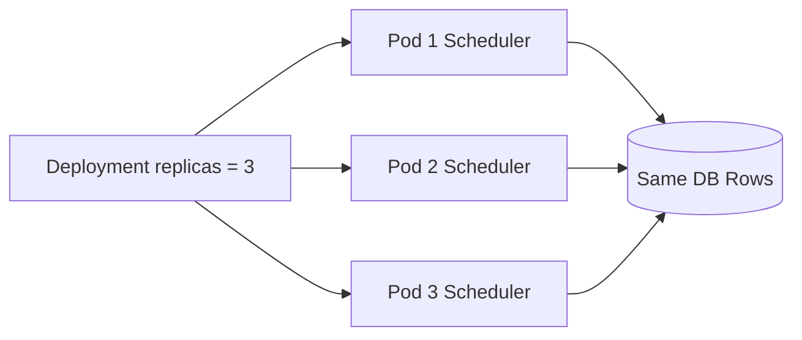
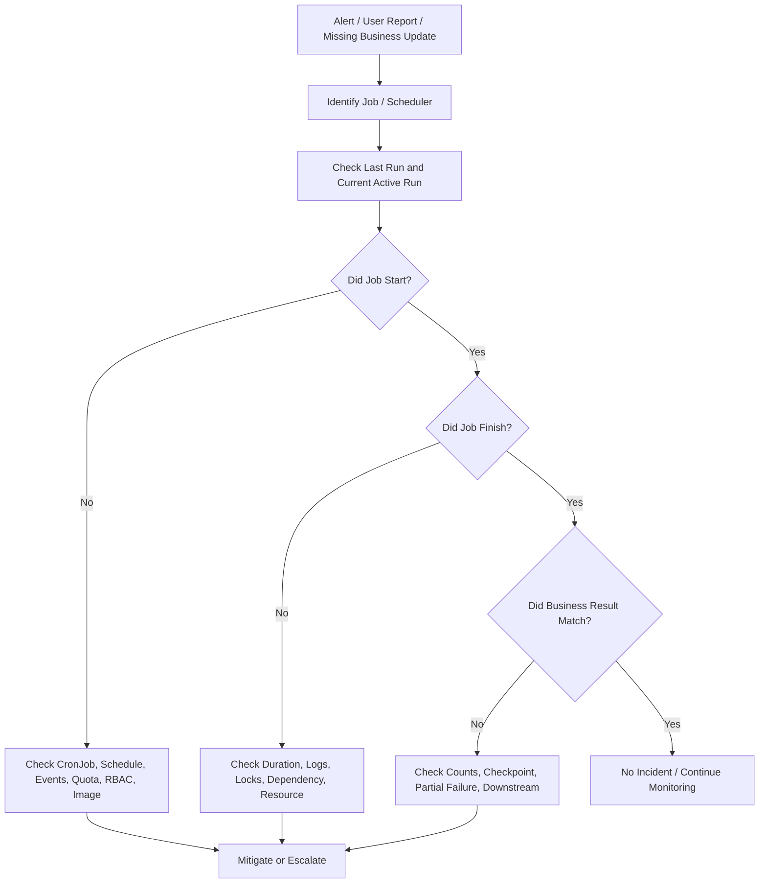

# Part 019 — Batch and Scheduler Workload Operations

Batch dan scheduler workload di Kubernetes adalah bagian yang sering terlihat sederhana, tetapi secara production risk sering lebih berbahaya daripada REST API biasa. REST API biasanya gagal dalam bentuk latency, error rate, atau availability. Batch workload bisa gagal secara diam-diam, double-run, partial complete, mengubah data secara tidak konsisten, men-trigger billing/order action dua kali, atau meninggalkan workflow dalam state yang sulit direkonstruksi.

Dalam konteks enterprise CPQ, quote management, order management, quote-to-cash, billing integration, dan telco BSS/OSS, batch/scheduler workload dapat muncul sebagai:

- scheduled reconciliation order;
- quote expiration job;
- pricing refresh job;
- catalog synchronization;
- billing handoff retry;
- order status polling;
- stuck workflow recovery;
- Kafka/RabbitMQ DLQ replay;
- Redis cache warmup;
- file import/export;
- settlement/reporting job;
- database migration job;
- data correction job;
- SLA breach scanner;
- notification scheduler.

Operationally, batch workload harus dibaca sebagai **state transition engine**, bukan sekadar command yang berjalan periodik.

Jika REST API buruk, user mungkin langsung melihat error. Jika batch buruk, sistem bisa terlihat normal selama beberapa jam, lalu business state rusak di belakang layar.

---

## 1. Core Mental Model

Batch dan scheduler workload memiliki lifecycle yang berbeda dari long-running service.



Operational questions yang selalu harus ditanyakan:

1. Siapa yang men-trigger workload?
2. Apakah workload boleh berjalan paralel?
3. Apa unit of work-nya?
4. Apakah unit of work idempotent?
5. Bagaimana progress dicatat?
6. Apa yang terjadi jika pod mati di tengah proses?
7. Apakah retry aman?
8. Apakah partial completion bisa dideteksi?
9. Apakah failure terlihat oleh alert/dashboard?
10. Apakah run bisa direplay tanpa merusak state?

Batch yang tidak punya jawaban untuk pertanyaan ini adalah operational liability.

---

## 2. Kubernetes Object Choice

Tidak semua background workload harus menjadi `CronJob`.

| Workload pattern | Kubernetes shape | Operational concern |
|---|---|---|
| Periodic schedule | `CronJob` | missed schedule, overlap, timezone, concurrency |
| One-time execution | `Job` | retry, deadline, completion, cleanup |
| Long-running scheduler inside app | `Deployment` | leader election, duplicate scheduler, restart behavior |
| Queue consumer | `Deployment` | backlog, graceful shutdown, scaling |
| Migration | `Job` | ordering, lock, rollback limitation |
| Manual repair | ad-hoc `Job` | audit, approval, blast radius |
| File import/export | `Job` or `CronJob` | storage, timeout, partial file handling |
| Reconciliation loop | `CronJob` or worker | idempotency, checkpoint, data correctness |

Backend engineer harus menghindari pola “taruh semua background process di Deployment utama” jika proses tersebut punya risk, lifecycle, atau observability yang berbeda.

---

## 3. CronJob Semantics That Matter

Beberapa field `CronJob` punya dampak production besar.

```yaml
apiVersion: batch/v1
kind: CronJob
metadata:
  name: quote-expiration-reconciler
spec:
  schedule: "*/15 * * * *"
  concurrencyPolicy: Forbid
  startingDeadlineSeconds: 300
  successfulJobsHistoryLimit: 3
  failedJobsHistoryLimit: 5
  jobTemplate:
    spec:
      backoffLimit: 2
      activeDeadlineSeconds: 900
      template:
        spec:
          restartPolicy: Never
          containers:
            - name: reconciler
              image: registry.example.com/quote-reconciler:1.42.0
```

### `schedule`

Schedule harus dipahami dengan timezone cluster/controller. Jangan asumsikan timezone lokal aplikasi. Untuk job bisnis seperti billing cut-off, invoice, SLA, atau quote expiry, timezone ambiguity bisa menjadi incident data.

### `concurrencyPolicy`

| Value | Meaning | Risk |
|---|---|---|
| `Allow` | run baru boleh overlap dengan run lama | duplicate processing, lock contention |
| `Forbid` | skip run baru jika run lama masih aktif | missed processing, backlog |
| `Replace` | stop run lama dan ganti run baru | partial completion, unsafe interruption |

Default yang paling aman untuk banyak reconciliation job adalah `Forbid`, tetapi ini bukan aturan universal. Jika workload idempotent dan partitioned, parallel run mungkin valid.

### `startingDeadlineSeconds`

Mengontrol apakah missed schedule masih boleh dijalankan setelah delay. Tanpa ini, controller behavior bisa menghasilkan run terlambat yang secara bisnis sudah tidak relevan.

### `successfulJobsHistoryLimit` dan `failedJobsHistoryLimit`

Terlalu kecil membuat evidence hilang. Terlalu besar membuat namespace penuh object historis.

---

## 4. Job Semantics That Matter

Field `Job` yang penting secara operasional:

| Field | Operational meaning |
|---|---|
| `backoffLimit` | berapa kali retry pod gagal sebelum job dianggap failed |
| `activeDeadlineSeconds` | batas waktu total execution |
| `parallelism` | berapa pod boleh berjalan bersamaan |
| `completions` | berapa successful completion yang dibutuhkan |
| `completionMode` | indexed/non-indexed completion |
| `ttlSecondsAfterFinished` | cleanup object setelah selesai |
| `restartPolicy` | biasanya `Never` atau `OnFailure` |

Anti-pattern umum:

```yaml
backoffLimit: 6
activeDeadlineSeconds: null
restartPolicy: OnFailure
```

Pada job yang menulis state eksternal, retry tanpa idempotency bisa menyebabkan duplicate side effect.

---

## 5. Idempotency as the First Safety Requirement

Batch workload harus diasumsikan bisa dieksekusi ulang karena:

- pod restart;
- node eviction;
- Job retry;
- manual rerun;
- GitOps redeploy;
- operator mistake;
- network timeout setelah side effect berhasil;
- database commit berhasil tetapi response gagal;
- broker ack gagal setelah processing berhasil.

Idempotency berarti eksekusi ulang tidak mengubah hasil akhir secara salah.

Contoh pola idempotency:

| Pattern | Example |
|---|---|
| business key uniqueness | `quote_id + action_type + version` |
| idempotency key | generated operation ID per batch item |
| status transition guard | only update `PENDING -> EXPIRED`, not any state |
| outbox/inbox table | deduplicate external event effect |
| processed marker | mark item processed with unique constraint |
| compare-and-swap | update only if expected version matches |
| lock with TTL | avoid permanent stuck lock |

Contoh SQL guard:

```sql
UPDATE quote
SET status = 'EXPIRED', expired_at = now()
WHERE quote_id = :quoteId
  AND status = 'ACTIVE'
  AND valid_until < now();
```

Jika row count = 0, belum tentu error. Bisa berarti item sudah diproses, tidak eligible, atau state sudah berubah.

---

## 6. Locking and Overlapping Run Prevention

Ada dua level overlap:

1. Kubernetes-level overlap: dikontrol `concurrencyPolicy`.
2. Application/data-level overlap: dikontrol lock, cursor, state guard, atau partition assignment.

`concurrencyPolicy: Forbid` tidak cukup jika:

- ada beberapa cluster/environment yang bisa menjalankan job;
- ada manual rerun;
- ada deployment lain dengan scheduler embedded;
- ada blue-green deployment;
- ada duplicated CronJob di namespace berbeda;
- ada retry job manual dari pipeline.

Pola lock yang umum:



Lock harus punya TTL atau fencing token. Lock tanpa expiry dapat membuat job stuck selamanya jika pod mati sebelum release.

---

## 7. Checkpointing and Resume

Batch besar harus punya checkpoint. Tanpa checkpoint, retry akan memulai ulang semuanya.

Checkpoint bisa berupa:

- last processed ID;
- timestamp cursor;
- page token;
- partition offset;
- batch run table;
- item-level status;
- external file offset;
- workflow instance cursor.

Contoh run table:

| Column | Purpose |
|---|---|
| `run_id` | unique execution ID |
| `job_name` | workload identifier |
| `started_at` | start time |
| `completed_at` | completion time |
| `status` | RUNNING/SUCCEEDED/FAILED/PARTIAL/SKIPPED |
| `cursor` | resume position |
| `processed_count` | progress metric |
| `failed_count` | error visibility |
| `error_summary` | failure diagnosis |
| `triggered_by` | schedule/manual/pipeline |

Checkpoint harus transactional dengan unit of work jika memungkinkan.

---

## 8. Partial Completion

Partial completion adalah normal dalam batch. Yang berbahaya adalah partial completion yang tidak terlihat.

Contoh failure:

- 10.000 order harus direkonsiliasi;
- 7.200 berhasil;
- pod OOM;
- job retry dari awal;
- 7.200 order diproses ulang;
- 300 order gagal permanen;
- dashboard hanya menunjukkan job failed tanpa business impact.

Batch operations harus punya metrik:

- items discovered;
- items eligible;
- items processed;
- items succeeded;
- items skipped;
- items failed retryable;
- items failed permanent;
- duration per chunk;
- last successful run;
- lag since last successful run.

---

## 9. Retry Classification

Tidak semua failure boleh di-retry dengan cara sama.

| Failure | Retry? | Notes |
|---|---:|---|
| transient HTTP 503 | yes | use backoff and max attempt |
| DB deadlock | yes | safe if transaction idempotent |
| validation error | no | data/business issue |
| missing config | no | fail fast, alert |
| auth denied | no until fixed | retry creates noise |
| network timeout after side effect | maybe | requires idempotency key |
| duplicate key | often no-op | may mean already processed |
| rate limited | yes with backoff | respect retry-after |
| dependency outage | limited retry | avoid retry storm |

Retry yang buruk memperbesar incident.

---

## 10. Failure Notification

Batch failure harus terlihat tanpa perlu seseorang mengecek pod manual.

Minimal signal:

- Job failed;
- CronJob missed schedule;
- last successful run too old;
- run duration too long;
- processed count unexpectedly low;
- failed item count too high;
- lock acquisition failed repeatedly;
- backlog not decreasing;
- business freshness violated.

Alert yang hanya berbunyi “pod failed” sering tidak cukup. Alert yang baik menjawab: **apa business process yang terdampak?**

---

## 11. Scheduler Inside Deployment: Hidden Danger

Banyak Java service punya scheduler internal menggunakan Quartz, Spring Scheduler, custom timer, atau polling loop. Di Kubernetes, ini berbahaya jika replica > 1.



Failure mode:

- job berjalan tiga kali;
- duplicate billing handoff;
- duplicate notification;
- lock contention;
- out-of-order reconciliation;
- cache invalidation storm;
- hidden leader election bug.

Jika scheduler embedded tetap dipakai, perlu:

- leader election;
- distributed lock;
- one-replica scheduler deployment;
- dedicated scheduler workload;
- strong idempotency;
- visible metrics.

---

## 12. Batch Resource Sizing

Batch workload sering punya resource profile berbeda dari API service.

| Resource | Batch risk |
|---|---|
| CPU | high compute during chunk processing |
| Memory | large result set, file buffer, object graph |
| Ephemeral storage | temp file, export, upload, decompression |
| DB connection | long transaction, connection pinning |
| Network | bulk transfer, dependency saturation |
| Logs | per-item logging explosion |

Batch anti-pattern:

```java
List<Order> allOrders = repository.findAllPendingOrders();
for (Order order : allOrders) {
    process(order);
}
```

Lebih aman:

```java
while (true) {
    List<Order> chunk = repository.findNextChunk(cursor, 500);
    if (chunk.isEmpty()) break;

    for (Order order : chunk) {
        processIdempotently(order);
    }

    checkpoint(cursorFrom(chunk));
}
```

---

## 13. Database Transaction Boundaries

Batch dengan transaksi terlalu besar akan menyebabkan:

- long lock;
- vacuum pressure;
- replication lag;
- deadlock;
- rollback mahal;
- connection pool starvation;
- timeout;
- degraded API traffic.

Guideline:

- process by chunk;
- commit per safe unit;
- avoid holding lock during external call;
- do not combine DB transaction with slow HTTP call;
- use outbox for external side effects;
- track progress durably.

---

## 14. Interaction with PostgreSQL, Kafka, RabbitMQ, Redis, and Camunda

### PostgreSQL

Batch dapat mengganggu API jika melakukan scan besar, lock besar, atau connection spike.

Checklist:

- query uses index;
- chunked reads;
- bounded transaction;
- pool size limited;
- statement timeout set;
- lock monitoring available.

### Kafka

Batch replay atau reconciliation dapat menghasilkan event burst.

Checklist:

- event idempotency;
- outbox ordering;
- topic throughput;
- downstream consumer capacity;
- DLQ strategy.

### RabbitMQ

Batch publish/consume harus memperhatikan queue depth dan unacked messages.

Checklist:

- publish confirm;
- retry/DLQ;
- prefetch;
- backpressure;
- broker memory alarm.

### Redis

Batch cache warmup atau invalidation bisa menyebabkan Redis spike.

Checklist:

- key pattern bounded;
- pipelining controlled;
- TTL strategy;
- memory pressure;
- hot key risk.

### Camunda

Batch dapat mengubah process state atau melakukan recovery workflow.

Checklist:

- process instance correlation;
- incident resolution safety;
- retry semantics;
- worker concurrency;
- auditability.

---

## 15. Production-Safe Investigation Commands

Gunakan read-only commands terlebih dahulu.

```bash
kubectl get cronjob -n <namespace>
kubectl describe cronjob <name> -n <namespace>
kubectl get job -n <namespace> --sort-by=.metadata.creationTimestamp
kubectl describe job <job-name> -n <namespace>
kubectl get pods -n <namespace> -l job-name=<job-name>
kubectl logs -n <namespace> job/<job-name>
kubectl logs -n <namespace> <pod-name> --previous
kubectl get events -n <namespace> --sort-by=.lastTimestamp
```

Untuk melihat status ringkas:

```bash
kubectl get cronjob -n <namespace> \
  -o custom-columns=NAME:.metadata.name,SCHEDULE:.spec.schedule,SUSPEND:.spec.suspend,LAST:.status.lastScheduleTime,ACTIVE:.status.active
```

Untuk melihat job gagal:

```bash
kubectl get job -n <namespace> \
  -o custom-columns=NAME:.metadata.name,SUCCEEDED:.status.succeeded,FAILED:.status.failed,ACTIVE:.status.active,START:.status.startTime,END:.status.completionTime
```

Hindari langsung melakukan:

```bash
kubectl delete job <job>
kubectl create job --from=cronjob/<cronjob> <manual-job>
kubectl patch cronjob <cronjob> -p '{...}'
```

kecuali sudah jelas impact, approval, dan rollback plan.

---

## 16. Common Failure Modes

### 16.1 Job Never Starts

Kemungkinan:

- CronJob suspended;
- schedule salah;
- timezone salah;
- controller delay;
- quota exceeded;
- image pull failure;
- service account denied;
- pending due to resource request;
- node selector/taint mismatch.

Investigasi:

```bash
kubectl describe cronjob <name> -n <namespace>
kubectl get events -n <namespace> --sort-by=.lastTimestamp
kubectl get job -n <namespace>
```

### 16.2 Job Starts but Never Finishes

Kemungkinan:

- no activeDeadlineSeconds;
- dependency timeout terlalu panjang;
- deadlock;
- infinite loop;
- waiting lock forever;
- processing huge result set;
- external API hang.

Mitigasi awal:

- lihat logs dan metrics;
- cek DB locks;
- cek dependency health;
- jangan kill job sebelum memahami idempotency dan partial completion.

### 16.3 Job Fails Repeatedly

Kemungkinan:

- bad config;
- missing secret;
- schema mismatch;
- auth denied;
- dependency outage;
- data validation issue;
- non-idempotent retry causing permanent failure.

### 16.4 Job Succeeds but Business Result Wrong

Ini paling berbahaya.

Kemungkinan:

- success criteria teknis terlalu dangkal;
- processed count tidak dicek;
- query eligibility salah;
- timezone business salah;
- skipped item tidak terlihat;
- downstream event gagal;
- partial failure ditelan.

---

## 17. Runbook: Batch Failure Triage



Triage sequence:

1. identify job name and namespace;
2. check last schedule time and active jobs;
3. check latest Job status;
4. inspect pod status and events;
5. inspect logs with correlation/run ID;
6. check resource usage and OOM/throttling;
7. check dependency status;
8. check run table/checkpoint/business counts;
9. decide mitigation;
10. capture evidence.

---

## 18. Safe Mitigation Patterns

| Symptom | Safer first action |
|---|---|
| job did not run | verify schedule/controller/events before manual trigger |
| job stuck waiting lock | identify lock owner and TTL before deleting lock |
| dependency outage | pause/suspend job if retry storm risk |
| bad config | rollback config through GitOps, restart only if needed |
| non-idempotent partial failure | stop automatic retry and assess data state |
| backlog increasing | scale only after dependency capacity check |
| missed schedule | run manual job only with explicit business approval |
| duplicate processing | suspend scheduler and preserve evidence |

Manual rerun is not harmless. Treat it as production change.

---

## 19. Observability Signals

Minimum dashboard panels:

- last successful run timestamp;
- run duration;
- active run count;
- success/failure count;
- items processed per run;
- failed item count;
- skipped item count;
- retry count;
- lock acquisition failures;
- dependency latency/error during run;
- DB query duration;
- memory/CPU usage;
- pod restart count;
- business freshness lag.

Log requirements:

- `run_id`;
- `job_name`;
- `trigger_type`;
- `chunk_id`;
- `cursor`;
- `business_entity_id` where safe;
- `correlation_id`;
- final summary line.

Example final summary:

```json
{
  "event": "batch_run_completed",
  "job": "quote-expiration-reconciler",
  "runId": "2026-07-11T10:15:00Z",
  "discovered": 1240,
  "processed": 1238,
  "skipped": 2,
  "failed": 0,
  "durationMs": 84231
}
```

---

## 20. GitOps and Pipeline Concerns

Batch/scheduler changes should go through the same rigor as API deployment.

Review:

- schedule change;
- suspend/resume change;
- image version;
- env/config change;
- resource request/limit;
- timeout/deadline;
- retry/backoff;
- concurrency policy;
- service account;
- secret source;
- network policy;
- dashboard/alert update.

Schedule changes can be business-impacting. A “small cron edit” can change billing, expiry, notification, or reconciliation behavior.

---

## 21. Security and Compliance Concerns

Batch often has powerful access because it performs maintenance or correction.

Risks:

- broad database write access;
- secret access;
- bulk export of customer/order data;
- file processing with PII;
- manual rerun without audit;
- ad-hoc repair job with excessive RBAC;
- logs containing sensitive payload.

Controls:

- least-privilege ServiceAccount;
- separate role for repair jobs;
- audit manual trigger;
- avoid secrets in logs;
- encrypt files at rest/in transit;
- limit debug/exec access;
- require approval for data correction jobs.

---

## 22. Cost Concerns

Batch cost is often bursty.

Cost drivers:

- high CPU during scheduled window;
- large memory request for short run;
- ephemeral storage for files;
- NAT egress for external API calls;
- log volume from per-item logs;
- repeated retry during outage;
- overlap creating duplicate work;
- oversized node due to one large batch job.

Cost-aware actions:

- chunk work;
- avoid per-item info logs;
- set resource requests based on observed runs;
- schedule heavy jobs outside peak API traffic;
- cap concurrency;
- use backoff;
- coordinate with dependency capacity.

---

## 23. Internal Verification Checklist

Verify internally before relying on assumptions:

- Which batch/scheduler workloads exist in the namespace?
- Which are `CronJob`, `Job`, embedded scheduler, or external scheduler?
- What is the business purpose of each job?
- What is the owner team?
- What is the schedule and timezone?
- Is overlap allowed?
- Is there distributed lock or leader election?
- Is the job idempotent?
- Is there checkpoint/resume capability?
- Is partial completion visible?
- What are retry rules?
- What is `backoffLimit`?
- What is `activeDeadlineSeconds`?
- What is `concurrencyPolicy`?
- Is manual rerun allowed?
- Who can trigger manual rerun?
- Is manual rerun audited?
- Are run results stored in DB/table/dashboard?
- Is there alert for failed run?
- Is there alert for stale last successful run?
- Are logs structured with `run_id`?
- Are sensitive data protected in logs?
- What dependencies can the job saturate?
- What is the rollback/mitigation path?
- Is there a runbook?

---

## 24. Backend Engineer Responsibility

Backend service owner should own:

- idempotency design;
- business correctness;
- checkpointing;
- retry classification;
- safe transaction boundaries;
- observability signals;
- failure notification;
- runbook;
- PR review for schedule/config changes;
- dependency capacity awareness;
- manual rerun safety.

Platform/SRE typically owns:

- cluster scheduler health;
- CronJob controller health;
- node capacity;
- namespace quota policy;
- cluster-level alerting;
- GitOps/controller health;
- access control platform;
- underlying cloud/on-prem infrastructure.

Security/compliance owns or reviews:

- secret access;
- data export controls;
- audit requirement;
- privileged repair job approval;
- sensitive data handling.

---

## 25. PR Review Checklist

When reviewing batch/scheduler PR:

- Does this workload need `CronJob`, `Job`, or `Deployment`?
- Is schedule correct and timezone understood?
- Is `concurrencyPolicy` explicit?
- Is `activeDeadlineSeconds` set?
- Is `backoffLimit` safe?
- Is processing idempotent?
- Is there locking or leader election if needed?
- Is checkpointing present for large work?
- Are retries classified?
- Is partial completion observable?
- Are resources sized from evidence?
- Could this overload PostgreSQL/Kafka/RabbitMQ/Redis/Camunda?
- Does it have structured logs and final summary?
- Is there alert for failed/stale run?
- Is manual rerun safe and documented?
- Is secret/RBAC access least privilege?
- Is there a rollback/disable path?

---

## 26. Key Takeaways

Batch and scheduler workload operations are not secondary concerns. They often encode critical business state transitions. In enterprise systems, their failure mode is not merely “job failed”; it can be stale order state, duplicate billing handoff, broken reconciliation, silent data drift, or unresolved workflow incidents.

A production-grade batch workload should be:

- explicitly owned;
- idempotent;
- bounded by deadline;
- protected from unsafe overlap;
- checkpointed when large;
- observable by run and business outcome;
- safe to retry or intentionally not retried;
- auditable when manually triggered;
- documented with a runbook;
- reviewed with the same seriousness as API traffic path.
