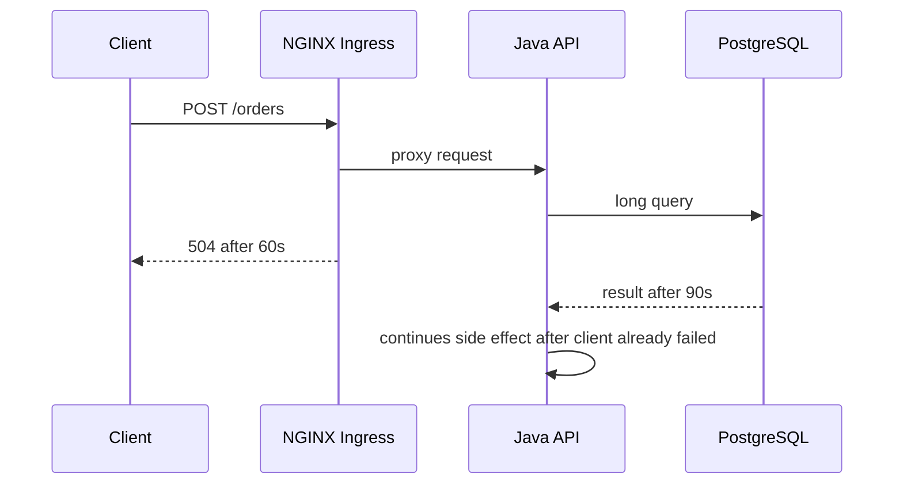
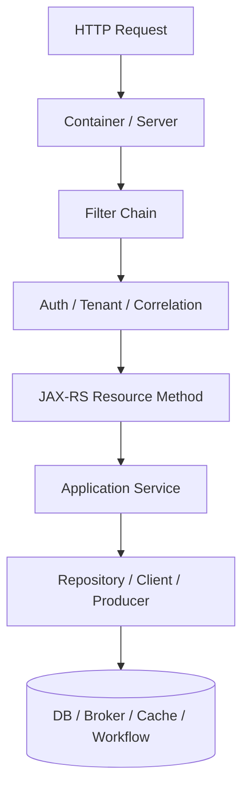
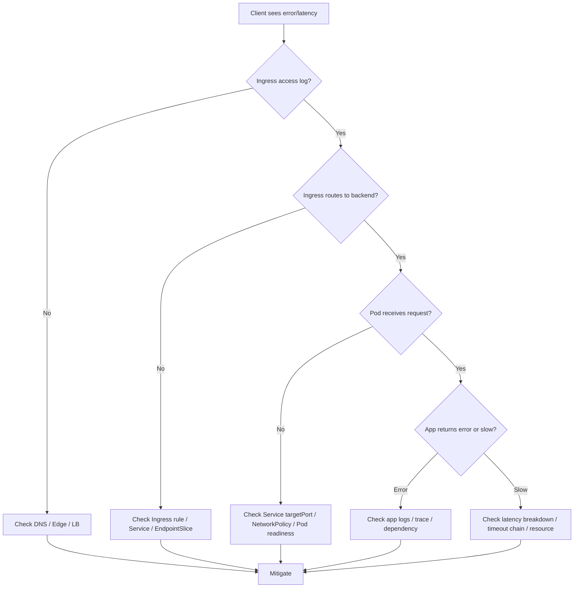
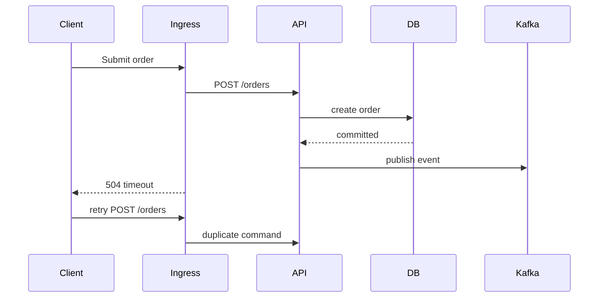

# Part 020 — Request Traffic Flow in Kubernetes

Request traffic flow adalah salah satu mental model paling penting untuk backend engineer yang mengoperasikan service di Kubernetes. Banyak incident production terlihat sebagai error aplikasi, tetapi root cause sebenarnya bisa berada di DNS, load balancer, ingress controller, NGINX annotation, Kubernetes Service, EndpointSlice, readiness, container port, Java thread pool, dependency timeout, atau response path.

Untuk service enterprise seperti CPQ, quote management, order management, billing integration, dan quote-to-cash, request bukan sekadar HTTP call. Request sering membawa transaksi bisnis: create quote, validate product configuration, submit order, reserve resource, calculate price, trigger workflow, atau publish event ke Kafka/RabbitMQ. Traffic path yang salah dapat menyebabkan latency, duplicate retry, timeout chain mismatch, partial side effect, atau order lifecycle stuck.

Target part ini: membangun intuisi **end-to-end traffic flow** dari user/client sampai JAX-RS resource dan kembali lagi.

---

## 1. High-Level Traffic Flow

Traffic flow umum:

```mermaid
flowchart LR
    A[Client / User / Upstream System] --> B[DNS]
    B --> C[CDN / Front Door / WAF if used]
    C --> D[Cloud Load Balancer]
    D --> E[Ingress Controller / API Gateway]
    E --> F[NGINX / Gateway Routing]
    F --> G[Kubernetes Service]
    G --> H[EndpointSlice]
    H --> I[Pod IP]
    I --> J[Container Port]
    J --> K[Java/JAX-RS Runtime]
    K --> L[JAX-RS Resource Method]
    L --> M[Service Logic]
    M --> N[(PostgreSQL / Kafka / RabbitMQ / Redis / Camunda / External API)]
    N --> M --> L --> K --> J --> I --> H --> G --> F --> E --> D --> C --> A
```



Setiap hop punya failure mode, timeout, observability signal, owner, dan escalation path.

Backend engineer tidak harus menjadi cluster/network admin, tetapi harus mampu mengatakan: “request berhenti di hop mana?”

---

## 2. Traffic Flow Is Not One Thing

Ada beberapa jenis traffic:

| Traffic type | Example | Operational focus |
|---|---|---|
| North-south inbound | client → ingress → service | DNS, LB, ingress, TLS, routing, readiness |
| East-west internal | service A → service B | service DNS, NetworkPolicy, timeout, mTLS |
| Egress outbound | pod → external dependency | NAT/proxy/private endpoint, firewall, DNS |
| Async event path | service → Kafka/RabbitMQ | producer timeout, broker routing, retry/DLQ |
| Workflow callback | Camunda/worker/service | correlation, timeout, auth, idempotency |
| Health check path | LB/Ingress/Kubelet → app | probes, management endpoint, readiness |

Jangan menyamakan inbound API request dengan dependency call. Mereka melewati control point yang berbeda.

---

## 3. Ownership Map per Hop

| Hop | Usually owned by | Backend engineer responsibility |
|---|---|---|
| Client/upstream | external/team-specific | understand contract, timeout, retry behavior |
| DNS | platform/network/cloud | know hostname, private/public zone, TTL |
| CDN/WAF/front door | platform/security/network | know headers, auth, body limit, timeout |
| Cloud Load Balancer | platform/cloud | understand target health and LB timeout |
| Ingress controller/API gateway | platform/SRE | review route, annotations, TLS, timeout impact |
| Kubernetes Service | app/platform shared | ensure selector, ports, service name are correct |
| EndpointSlice | Kubernetes/controller | verify endpoints exist and are ready |
| Pod/container | backend owner | readiness, port binding, app health, resource usage |
| Java/JAX-RS runtime | backend owner | request handling, thread pool, timeout, logging |
| Dependencies | backend + dependency owner | timeout, pool, retry, capacity, credentials |

Operational maturity means knowing when to investigate and when to escalate with evidence.

---

## 4. DNS Layer

Before any request reaches Kubernetes, name resolution must work.

Common DNS patterns:

- public DNS record to external load balancer;
- private DNS record to internal load balancer;
- Route 53 private hosted zone in AWS;
- Azure Private DNS Zone;
- corporate DNS forwarding;
- ExternalDNS-managed records;
- split-horizon DNS;
- service mesh/internal DNS.

Failure modes:

- wrong record;
- stale DNS cache;
- private DNS zone not linked;
- public/private resolution mismatch;
- wrong environment hostname;
- TTL causing slow cutover;
- CoreDNS issue for internal calls;
- corporate resolver issue in on-prem/hybrid.

Backend signal:

- client cannot resolve host;
- request never reaches ingress logs;
- error is `UnknownHostException`, `Name or service not known`, or resolver timeout;
- synthetic check fails before TLS handshake.

---

## 5. CDN, WAF, Front Door, or Edge Gateway

Not every environment has this layer, but enterprise systems often do.

Potential functions:

- TLS termination;
- WAF inspection;
- bot/rate protection;
- global routing;
- header injection;
- authentication offload;
- request body limit;
- response compression;
- caching;
- path normalization;
- IP allowlist.

Failure modes:

- blocked request by WAF;
- header stripped;
- body too large;
- edge timeout shorter than backend timeout;
- wrong origin;
- cached stale response;
- auth policy mismatch;
- source IP not forwarded correctly.

Backend engineer should verify whether error appears before or after ingress. If ingress access logs show nothing, suspect DNS/edge/LB path.

---

## 6. Cloud Load Balancer

Ingress controller is often exposed through cloud load balancer.

AWS examples:

- ALB through AWS Load Balancer Controller;
- NLB for TCP/TLS service;
- target groups;
- security groups;
- health checks;
- Route 53 records.

Azure examples:

- Azure Load Balancer;
- Application Gateway;
- Application Gateway Ingress Controller;
- private endpoint/private link;
- NSG/UDR effects.

Failure modes:

- target unhealthy;
- security group/NSG blocks traffic;
- subnet route issue;
- wrong listener;
- TLS policy mismatch;
- health check path wrong;
- LB idle timeout;
- cross-zone issue;
- private endpoint DNS mismatch.

Backend signal:

- ingress controller pod receives no request;
- LB target health is failing;
- client sees connection timeout or TLS failure;
- only one zone affected;
- error happens before app logs.

---

## 7. Ingress Controller / API Gateway

Ingress controller converts external routing rules into actual proxy behavior.

Important objects:

```bash
kubectl get ingress -n <namespace>
kubectl describe ingress <name> -n <namespace>
kubectl get ingressclass
kubectl get svc -n <ingress-namespace>
kubectl get pods -n <ingress-namespace>
```

Ingress concerns:

- host rule;
- path rule;
- path type;
- rewrite target;
- backend service name;
- backend service port;
- TLS secret;
- ingress class;
- annotations;
- timeout;
- body size;
- buffering;
- backend protocol;
- auth integration.

Failure modes:

| Symptom | Possible cause |
|---|---|
| 404 | host/path rule mismatch, wrong ingress class |
| 502 | backend protocol error, pod closed connection, TLS mismatch |
| 503 | no endpoints, backend unavailable |
| 504 | upstream timeout, slow app/dependency |
| 413 | body too large |
| redirect loop | wrong forwarded proto/header |
| wrong service hit | overlapping route or rewrite |

---

## 8. NGINX Routing and Proxy Behavior

If NGINX ingress is used, backend engineer must understand a few operational behaviors.

Key concerns:

- `proxy-connect-timeout`;
- `proxy-read-timeout`;
- `proxy-send-timeout`;
- `proxy-body-size`;
- buffering;
- keepalive;
- upstream selection;
- reload behavior;
- annotation precedence;
- generated NGINX config;
- controller logs.

Timeout mismatch example:



This can trigger client retry while backend continues processing. For command endpoints, this is dangerous unless idempotency exists.

---

## 9. Kubernetes Service Layer

Service is stable virtual access point to dynamic pods.

Example:

```yaml
apiVersion: v1
kind: Service
metadata:
  name: quote-api
spec:
  type: ClusterIP
  selector:
    app.kubernetes.io/name: quote-api
  ports:
    - name: http
      port: 8080
      targetPort: http
```

Critical checks:

- service selector matches pod labels;
- service port maps to correct targetPort;
- named port exists in container spec;
- service exists in correct namespace;
- service type is appropriate;
- service is not accidentally pointing to old pods;
- labels are stable across rollout.

Service itself can exist and look healthy even when it has no endpoints.

---

## 10. EndpointSlice Layer

EndpointSlice tells Kubernetes which pod IPs are backing a Service.

Commands:

```bash
kubectl get endpointslice -n <namespace> -l kubernetes.io/service-name=<service-name>
kubectl describe endpointslice -n <namespace> -l kubernetes.io/service-name=<service-name>
```

If EndpointSlice is empty, traffic has nowhere to go.

Common causes:

- selector mismatch;
- pod not ready;
- readiness probe failing;
- wrong namespace;
- rollout stuck;
- named port mismatch;
- readiness gate not satisfied;
- pod terminating;
- service points to labels removed by Helm/Kustomize change.

EndpointSlice is often the fastest way to explain 503.

---

## 11. Pod IP and Container Port

Once traffic reaches pod IP, the app must actually listen on expected port.

Failure modes:

- app binds to `127.0.0.1` instead of `0.0.0.0`;
- containerPort metadata wrong;
- service targetPort wrong;
- app server starts late;
- readiness marks ready before port is accepting;
- sidecar intercepts traffic unexpectedly;
- NetworkPolicy blocks traffic;
- container CPU throttling makes accept slow.

Java/JAX-RS checks:

- actual server port;
- context path;
- management port vs application port;
- TLS inside pod or plain HTTP;
- servlet/container thread pool;
- connection backlog;
- request max size;
- graceful shutdown state.

---

## 12. JAX-RS Resource Layer

At the application layer, request enters Java runtime.



Operational concerns:

- request thread pool saturation;
- blocking I/O;
- slow DB query;
- connection pool exhaustion;
- downstream timeout;
- missing correlation ID;
- large payload serialization;
- validation failure;
- auth/tenant context failure;
- retry storm;
- GC pause;
- CPU throttling.

A request can reach the pod and still fail before user logic due to filters, auth, JSON parsing, body limit, or context setup.

---

## 13. Dependency Call Path

Most enterprise API requests are not self-contained. They call dependencies.

Dependency path examples:

- Java API → PostgreSQL;
- Java API → Redis;
- Java API → Kafka producer;
- Java API → RabbitMQ publisher;
- Java API → Camunda engine;
- Java API → external billing API;
- Java API → internal catalog/pricing service;
- Java API → cloud service through workload identity.

Each dependency adds:

- DNS lookup;
- connection pool;
- network policy;
- credential/identity;
- timeout;
- retry;
- circuit breaker;
- observability span;
- capacity limit;
- failure mode.

Backend engineer must avoid blaming Kubernetes when dependency latency is the real cause, and avoid blaming dependency when ingress/service routing is broken.

---

## 14. Response Path Matters

Response path can fail too.

Examples:

- upstream client disconnects;
- ingress read timeout expires;
- response body too large;
- serialization slow;
- streaming buffered by proxy;
- gzip/compression issue;
- connection reset while app still processing;
- response header too large;
- LB idle timeout.

For command endpoints, response timeout does not necessarily mean command failed. It may have succeeded after client gave up.

Therefore:

- use idempotency keys for write commands;
- emit business operation ID early;
- trace command execution;
- avoid long synchronous commands when workflow async is better;
- align timeout chain.

---

## 15. Traffic Debugging Methodology

Start from symptom and locate the failing hop.



Core question: **what is the first layer where the request disappears or changes behavior?**

---

## 16. Production-Safe Investigation Commands

### Ingress and route

```bash
kubectl get ingress -n <namespace>
kubectl describe ingress <ingress-name> -n <namespace>
kubectl get ingressclass
```

### Service and endpoints

```bash
kubectl get svc -n <namespace>
kubectl describe svc <service-name> -n <namespace>
kubectl get endpointslice -n <namespace> -l kubernetes.io/service-name=<service-name>
```

### Pods behind service

```bash
kubectl get pods -n <namespace> -l app.kubernetes.io/name=<service-name> -o wide
kubectl describe pod <pod-name> -n <namespace>
kubectl logs <pod-name> -n <namespace> --tail=200
```

### Events

```bash
kubectl get events -n <namespace> --sort-by=.lastTimestamp
```

### Rollout state

```bash
kubectl rollout status deployment/<deployment-name> -n <namespace>
kubectl get deploy <deployment-name> -n <namespace>
kubectl get rs -n <namespace> -l app.kubernetes.io/name=<app-name>
```

### Safe network checks

Depending on internal policy, ephemeral debug pod may or may not be allowed.

```bash
kubectl run tmp-curl -n <namespace> --rm -it --restart=Never \
  --image=curlimages/curl -- sh
```

Use only if allowed by internal policy. In stricter production clusters, prefer approved debug images, read-only observability, or platform-assisted test path.

---

## 17. Observability Signals per Hop

| Hop | Signals |
|---|---|
| DNS | resolver error, DNS latency, NXDOMAIN, timeout |
| Edge/LB | target health, listener logs, WAF logs, TLS handshake |
| Ingress | access logs, 4xx/5xx, upstream latency, controller logs |
| Service | EndpointSlice count, no endpoint, selector mismatch |
| Pod | readiness, restart, CPU/memory, events |
| Java runtime | request latency, thread pool, GC, error logs |
| Dependency | pool usage, dependency latency, error rate, timeout |
| End-to-end | trace span, correlation ID, synthetic probe, SLO burn |

Good trace should show:

- ingress span;
- service span;
- DB/cache/broker spans;
- error tag;
- status code;
- latency per segment;
- correlation/business ID when safe.

---

## 18. Timeout Chain

Timeouts must be ordered intentionally.

Bad pattern:

| Layer | Timeout |
|---|---:|
| Client | 30s |
| Ingress | 60s |
| Java request | 120s |
| DB query | 180s |

Client gives up first while backend keeps processing.

Safer pattern depends on semantics, but usually:

- backend dependency timeout should be shorter than app request timeout;
- app timeout should be shorter than ingress timeout;
- ingress timeout should be compatible with client timeout;
- write operations should be idempotent;
- long-running work should move to async workflow/job.

Timeout chain must be reviewed for create/submit order endpoints carefully.

---

## 19. Retry Chain and Duplicate Side Effects

Traffic path interacts with retry behavior.



Without idempotency, retry can create duplicate order/effect.

Required protections:

- idempotency key;
- business unique constraint;
- command status endpoint;
- outbox pattern;
- safe retry classification;
- correlation ID;
- clear client contract.

---

## 20. Common Failure Patterns

### 20.1 404 from Ingress

Likely:

- host mismatch;
- path mismatch;
- wrong pathType;
- wrong IngressClass;
- route not synced;
- wrong environment URL.

Check:

```bash
kubectl describe ingress <name> -n <namespace>
```

### 20.2 503 Service Unavailable

Likely:

- service has no endpoints;
- pods not ready;
- selector mismatch;
- rollout stuck;
- readiness probe failed;
- backend service name/port wrong.

Check:

```bash
kubectl get endpointslice -n <namespace> -l kubernetes.io/service-name=<service-name>
kubectl get pods -n <namespace> -l <selector>
```

### 20.3 502 Bad Gateway

Likely:

- app closes connection;
- backend protocol mismatch;
- TLS mismatch;
- wrong targetPort;
- container not listening;
- upstream reset;
- sidecar/proxy issue.

### 20.4 504 Gateway Timeout

Likely:

- app too slow;
- dependency timeout;
- thread pool exhausted;
- DB query slow;
- Kafka/RabbitMQ publish blocks;
- Redis slow;
- CPU throttling/GC pause;
- ingress timeout too short.

### 20.5 Intermittent Failure

Likely:

- only some pods bad;
- rolling deployment mixed versions;
- one node/network zone affected;
- connection pool exhaustion;
- HPA scaling instability;
- cache inconsistency;
- DNS cache issue;
- uneven load balancing.

---

## 21. Java/JAX-RS Specific Traffic Concerns

For Java/JAX-RS service, verify:

- server port and context path;
- readiness endpoint separate from business endpoint;
- management endpoint is not publicly exposed unless intended;
- request body size and JSON parsing limits;
- servlet/container worker thread pool;
- DB pool size vs request concurrency;
- outbound HTTP client timeout;
- async processing behavior;
- exception mapping to correct HTTP status;
- correlation ID propagation;
- graceful shutdown stops accepting new traffic before termination.

Common issue:

- readiness endpoint returns OK before DB pool/config is ready;
- liveness endpoint checks dependency and restarts pod during dependency outage;
- ingress timeout shorter than Java dependency timeout;
- app returns 200 with business failure payload, hiding error rate from ingress metrics.

---

## 22. Dependency Impact on Traffic Flow

### PostgreSQL

Symptoms:

- high API latency;
- 504 from ingress;
- connection pool timeout;
- thread pool saturation;
- DB lock wait.

Check:

- DB pool active/idle/waiting;
- query latency;
- lock metrics;
- connection count per pod;
- rollout connection spike.

### Kafka

Symptoms:

- submit endpoint slow because producer waits for ack;
- timeout during metadata fetch;
- event not published;
- downstream process missing.

Check:

- producer error;
- broker connectivity;
- topic availability;
- acks/retries;
- outbox backlog.

### RabbitMQ

Symptoms:

- publish blocks;
- channel closed;
- confirm timeout;
- queue unavailable;
- downstream workflow lag.

### Redis

Symptoms:

- cache lookup latency;
- connection pool exhausted;
- hot key;
- auth denied;
- stale cache response.

### Camunda

Symptoms:

- API submits workflow but process not progressing;
- correlation timeout;
- incident after request;
- engine unavailable.

---

## 23. NetworkPolicy and Egress Effects

Traffic may reach pod but dependency call may fail because egress is blocked.

Signals:

- connection timeout to DB/broker;
- DNS resolution works but TCP fails;
- works in one namespace but not another;
- new deployment labels no longer match policy;
- policy default deny introduced;
- cloud private endpoint inaccessible.

Check:

- pod labels;
- namespace labels;
- NetworkPolicy egress;
- DNS egress rule;
- DB/broker/cloud allowlist;
- firewall/security group/NSG.

---

## 24. Rollout Effects on Traffic Flow

During rolling deployment:

- new pods may not be ready;
- old and new versions may serve simultaneously;
- service endpoints change;
- connection pools spike;
- ingress upstream list changes;
- long-running requests may be terminated;
- readiness may remove pods late;
- preStop/graceful shutdown may be insufficient.

Rollout traffic safety requires:

- readiness reflects ability to serve;
- preStop or graceful drain;
- terminationGracePeriodSeconds sufficient;
- backward-compatible API/schema;
- deployment marker in observability;
- post-deployment smoke test;
- rollback path.

---

## 25. Security and Privacy Concerns

Traffic flow can expose data or bypass controls.

Review:

- TLS termination point;
- internal vs external route;
- public exposure of management endpoint;
- auth enforced at edge or app;
- source IP preservation;
- header trust boundary;
- sensitive headers forwarded;
- PII in access logs;
- mTLS requirement;
- NetworkPolicy isolation;
- rate limit.

Do not trust headers like `X-Forwarded-For` unless you know which proxy inserted them and which layers are trusted.

---

## 26. Cost Concerns

Traffic path affects cost:

- load balancer cost;
- NAT gateway egress cost;
- cross-zone traffic;
- cross-region dependency call;
- ingress log volume;
- trace sampling volume;
- retry storm multiplying traffic;
- oversized replicas due to timeout/backpressure;
- unbounded response payload.

Cost optimization must not break reliability. First identify waste, then evaluate operational risk.

---

## 27. Internal Verification Checklist

Verify internally:

- What is the canonical hostname per environment?
- Is traffic public, private, or hybrid?
- Is there CDN/WAF/front door before Kubernetes?
- What cloud load balancer type is used?
- Which ingress controller or API gateway is used?
- Is NGINX ingress used? Which annotations are allowed?
- What is the IngressClass?
- What is the TLS termination point?
- Are backend pods HTTP or HTTPS?
- What Service points to the workload?
- What labels does the Service selector use?
- Are EndpointSlices populated during normal state?
- Which port is service `port` and which is `targetPort`?
- What is the Java server port/context path?
- What readiness endpoint gates traffic?
- What timeout exists at client, LB, ingress, app, and dependency?
- Are correlation IDs propagated through ingress and service?
- Are access logs available?
- Are traces available from ingress to dependency?
- Are NetworkPolicies applied?
- Is egress controlled through NAT/proxy/private endpoint?
- What is the rollback path if routing breaks?
- Which team owns each hop?

---

## 28. Backend Engineer Responsibility

Backend service owner should own:

- correct service labels and port expectations;
- readiness behavior;
- graceful shutdown;
- JAX-RS endpoint behavior;
- timeout and retry semantics;
- idempotency for write commands;
- correlation/trace propagation;
- dependency client configuration;
- service-level dashboard;
- runbook for common 4xx/5xx/timeout issues.

Platform/SRE typically owns:

- DNS infrastructure;
- ingress controller;
- load balancer;
- cluster networking;
- CNI;
- gateway platform;
- controller health;
- shared certificates;
- cluster-level observability.

Security owns or reviews:

- WAF/auth policy;
- TLS policy;
- mTLS;
- external exposure;
- header trust;
- network segmentation;
- sensitive log policy.

---

## 29. PR Review Checklist

When reviewing traffic-impacting Kubernetes changes:

- Did labels/selectors change?
- Did service port/targetPort change?
- Did container port or app port change?
- Did readiness path/port change?
- Did Ingress host/path/rewrite change?
- Did IngressClass change?
- Did TLS secret/cert change?
- Did NGINX annotations change?
- Did timeout/body size/buffering change?
- Did NetworkPolicy affect ingress/egress?
- Did deployment strategy affect endpoint availability?
- Is post-deployment smoke test updated?
- Are dashboards/alerts still valid?
- Is rollback path clear?
- Are write endpoints protected against retry duplicates?

---

## 30. Key Takeaways

Request traffic flow is the operational spine of Kubernetes backend systems. When production fails, the best engineer does not randomly inspect pods. They locate the request in the path, identify the first broken hop, correlate with recent change, and choose the safest mitigation.

For Java/JAX-RS backend services, traffic correctness depends on more than route existence. It depends on readiness, port mapping, timeout alignment, thread/connection pools, dependency behavior, graceful shutdown, observability, and idempotent command handling.

The core habit: always ask **where did the request last behave correctly?** Then move one hop forward.
