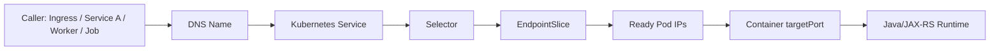
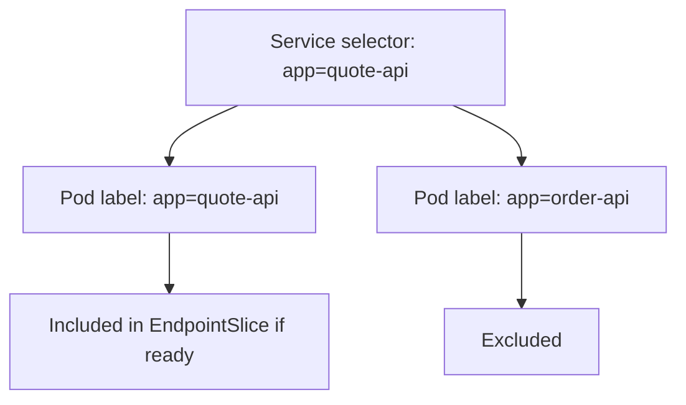
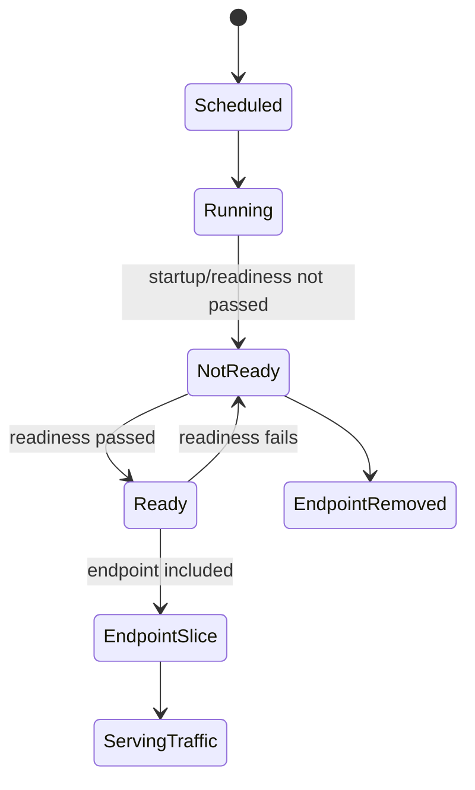
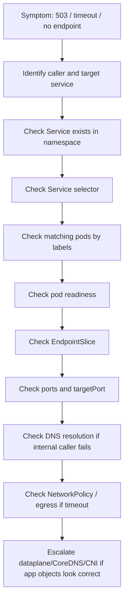
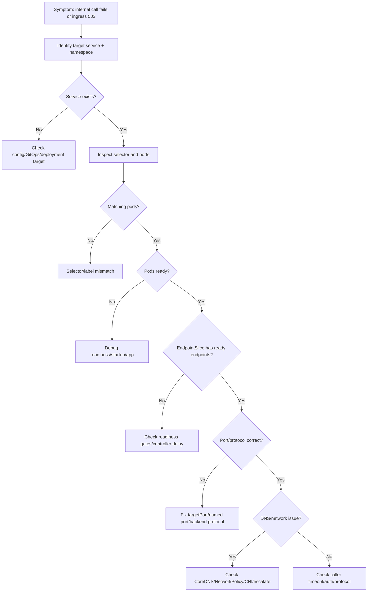

# Part 021 — Service Discovery Operations

Service discovery adalah mekanisme yang membuat workload Kubernetes dapat menemukan backend pod tanpa mengetahui IP pod secara langsung. Untuk backend engineer, ini bukan detail networking kecil. Service discovery adalah penghubung antara **traffic routing**, **readiness**, **rollout**, **dependency call**, dan **production incident**.

Di Kubernetes, pod bersifat ephemeral. Pod bisa mati, restart, pindah node, diganti ReplicaSet baru, atau belum ready saat rollout. Karena itu, aplikasi tidak boleh mengandalkan Pod IP langsung. Aplikasi dan ingress harus mengarah ke **Kubernetes Service**, lalu Service mengarah ke endpoint pod yang eligible melalui **EndpointSlice**.

Untuk sistem enterprise seperti CPQ, quote management, order management, billing integration, dan workflow orchestration, service discovery failure bisa terlihat sebagai:

- ingress `503 service unavailable`;
- NGINX upstream has no available endpoint;
- service A gagal memanggil service B;
- Java `UnknownHostException`;
- Java HTTP client timeout;
- Kafka/RabbitMQ/Redis/Camunda worker gagal connect ke internal service;
- deployment terlihat sukses tetapi traffic tidak pernah masuk ke pod baru;
- canary tidak menerima traffic;
- rollback tidak memulihkan traffic karena selector atau endpoint salah.

Target part ini: membangun kemampuan membaca **Service → EndpointSlice → Pod** secara production-safe.

---

## 1. Service Discovery Mental Model

Kubernetes Service menyediakan nama stabil dan virtual IP untuk sekumpulan pod yang dipilih oleh selector.



Intinya:

- caller memanggil DNS name atau ClusterIP Service;
- Service memilih pod berdasarkan label selector;
- hanya pod yang ready masuk sebagai endpoint normal;
- kube-proxy atau dataplane CNI meneruskan traffic ke endpoint;
- aplikasi harus listen pada port yang cocok dengan `targetPort`.

Jika satu saja bagian mismatch, Service bisa ada tetapi tidak usable.

---

## 2. Why Service Discovery Matters Operationally

Service discovery adalah titik temu antara deployment dan runtime traffic.

Deployment dapat sukses secara Kubernetes object, tetapi gagal secara traffic jika:

- label pod tidak match dengan Service selector;
- readiness probe gagal sehingga endpoint kosong;
- Service mengarah ke port yang salah;
- named port di Service tidak cocok dengan container port;
- pod listen di `localhost` bukan `0.0.0.0`;
- ingress menunjuk Service yang salah;
- namespace DNS salah;
- NetworkPolicy memblokir traffic ke endpoint;
- rollout mengganti labels tanpa update Service;
- GitOps overlay environment menghasilkan selector berbeda.

Bagi backend engineer, service discovery adalah salah satu area paling penting saat debugging `503`, internal call timeout, dan rollout yang tampak sehat tetapi tidak melayani traffic.

---

## 3. Core Objects

| Object | Fungsi | Risiko operational |
|---|---|---|
| `Service` | Stable virtual service name/IP | selector salah, port salah, service salah namespace |
| `EndpointSlice` | Daftar endpoint pod yang dipilih Service | kosong, endpoint not ready, wrong port |
| `Pod` | Backend runtime aktual | not ready, wrong label, wrong container port |
| `Deployment` | Pembuat pod dan label template | template label berubah, selector immutable mismatch |
| `CoreDNS` | Resolusi DNS internal cluster | lookup gagal, timeout, wrong namespace |
| `kube-proxy` / CNI dataplane | Routing Service IP ke endpoint | node/network/dataplane issue |

Backend engineer biasanya tidak mengelola kube-proxy atau CNI, tetapi harus tahu kapan issue sudah melewati boundary aplikasi dan perlu eskalasi ke platform/SRE.

---

## 4. Kubernetes Service Types Relevant to Backend Engineers

### ClusterIP

Default Service type. Dipakai untuk internal traffic antar service atau dari ingress controller ke backend.

```yaml
apiVersion: v1
kind: Service
metadata:
  name: quote-api
spec:
  type: ClusterIP
  selector:
    app.kubernetes.io/name: quote-api
  ports:
    - name: http
      port: 8080
      targetPort: http
```

Operational focus:

- selector benar;
- targetPort benar;
- pod ready;
- endpoint ada;
- DNS internal bekerja.

### Headless Service

Service dengan `clusterIP: None`. Umumnya dipakai untuk StatefulSet atau direct endpoint discovery.

```yaml
spec:
  clusterIP: None
```

Operational focus:

- stable network identity;
- StatefulSet ordinal;
- DNS record per pod;
- tidak sama dengan load-balanced ClusterIP biasa.

### ExternalName

Mengembalikan CNAME ke nama DNS eksternal.

Operational caution:

- tidak membuat proxy;
- tidak membuat endpoint pod;
- bergantung penuh pada DNS eksternal;
- bisa membingungkan timeout dan TLS SNI.

### LoadBalancer / NodePort

Biasanya platform concern, tetapi backend engineer perlu tahu jika service diekspos langsung tanpa ingress.

Operational caution:

- public exposure risk;
- cloud load balancer cost;
- security group/NSG impact;
- source IP behavior;
- ownership boundary lebih dekat ke platform/network.

---

## 5. Service Selector Mechanics

Service selector mencocokkan label pod.

```yaml
spec:
  selector:
    app.kubernetes.io/name: quote-api
    app.kubernetes.io/instance: quote-api-prod
```

Pod harus memiliki label yang sama:

```yaml
metadata:
  labels:
    app.kubernetes.io/name: quote-api
    app.kubernetes.io/instance: quote-api-prod
```

Jika label tidak match, Service tetap ada, DNS tetap resolve, tetapi endpoint kosong.



Common selector failure:

- label berubah saat refactor Helm chart;
- `app` vs `app.kubernetes.io/name` mismatch;
- selector mengandung environment yang salah;
- Kustomize overlay patch mengubah label template tetapi tidak Service selector;
- canary/stable labels tidak konsisten;
- Service selector terlalu luas dan mengambil pod lain;
- Service selector terlalu sempit dan tidak mengambil pod mana pun.

---

## 6. EndpointSlice Mental Model

EndpointSlice adalah representasi endpoint aktual untuk Service. Kubernetes modern menggunakan EndpointSlice untuk scalability menggantikan Endpoints lama.

Command aman:

```bash
kubectl get endpointslice -n <namespace> -l kubernetes.io/service-name=<service-name>
kubectl describe endpointslice -n <namespace> -l kubernetes.io/service-name=<service-name>
```

Yang perlu dilihat:

- address endpoint;
- ready condition;
- serving condition;
- terminating condition;
- targetRef pod;
- port name;
- port number;
- protocol;
- topology/zone hints jika ada.

EndpointSlice menjawab pertanyaan: **Service ini sebenarnya mengarah ke pod mana?**

---

## 7. Readiness and Endpoint Eligibility

Service discovery terkait langsung dengan readiness.

Pod yang running belum tentu masuk endpoint. Pod harus ready.



Operational implication:

- pod `Running` tetapi tidak ready tidak menerima traffic normal dari Service;
- readiness failure dapat menyebabkan Service no endpoint;
- ingress sering memunculkan `503` jika backend Service tidak punya ready endpoint;
- rolling update bisa stuck jika pod baru tidak pernah ready;
- liveness restart loop dapat membuat endpoint flapping.

Untuk Java/JAX-RS service, readiness endpoint harus merepresentasikan kemampuan menerima request, bukan melakukan dependency check berat yang mudah flap.

---

## 8. Named Port and targetPort

Service dapat menggunakan numeric `targetPort` atau named `targetPort`.

```yaml
ports:
  - name: http
    port: 8080
    targetPort: http
```

Pod container harus punya named port:

```yaml
ports:
  - name: http
    containerPort: 8080
```

Failure mode:

- Service `targetPort: http`, tetapi container port tidak bernama `http`;
- Service port `80`, targetPort `8080`, tetapi app listen di `9090`;
- ingress menunjuk service port name yang tidak ada;
- backend app bind ke `127.0.0.1` sehingga tidak reachable dari pod IP;
- multi-container pod punya port name bentrok atau tidak jelas.

Safe check:

```bash
kubectl get svc <service> -n <namespace> -o yaml
kubectl get deploy <deployment> -n <namespace> -o yaml
kubectl get pod <pod> -n <namespace> -o yaml
```

Bandingkan:

- service `spec.ports[].port`;
- service `spec.ports[].targetPort`;
- pod `containerPort`;
- port name;
- application listening port.

---

## 9. DNS Names for Services

Format DNS internal Kubernetes:

```text
<service-name>.<namespace>.svc.cluster.local
```

Bentuk pendek yang sering dipakai:

```text
<service-name>
<service-name>.<namespace>
<service-name>.<namespace>.svc
```

Operational caution:

- dari namespace yang sama, `<service-name>` biasanya cukup;
- dari namespace berbeda, gunakan `<service-name>.<namespace>` atau FQDN;
- nama service yang sama di namespace berbeda dapat menyebabkan wrong dependency call;
- `search domain` dan `ndots` dapat memengaruhi latency lookup;
- DNS failure internal berbeda dari Service selector failure.

Java symptom:

```text
java.net.UnknownHostException: order-api
java.net.SocketTimeoutException: Connect timed out
java.net.ConnectException: Connection refused
```

Interpretasi awal:

| Symptom | Kemungkinan |
|---|---|
| `UnknownHostException` | DNS/service name/namespace/CoreDNS |
| connect timeout | NetworkPolicy/firewall/no route/pod not reachable |
| connection refused | endpoint ada tetapi port tidak listen atau protocol salah |
| HTTP 503 | service no endpoint atau ingress upstream unavailable |
| HTTP 404 | routing/path/host mismatch, bukan selalu service discovery |

---

## 10. Production-Safe Investigation Flow

Gunakan alur investigasi dari caller ke endpoint.



Safe commands:

```bash
kubectl get svc -n <namespace>
kubectl describe svc <service> -n <namespace>
kubectl get endpointslice -n <namespace> -l kubernetes.io/service-name=<service>
kubectl get pods -n <namespace> --show-labels
kubectl get pods -n <namespace> -l '<selector>'
kubectl describe pod <pod> -n <namespace>
kubectl get deploy <deployment> -n <namespace> -o yaml
```

Use `kubectl exec` only if allowed by production policy. Prefer existing observability and read-only commands first.

---

## 11. Debugging Service Has No Endpoint

If Service exists but endpoint is empty:

```bash
kubectl get svc quote-api -n quote-prod
kubectl get endpointslice -n quote-prod -l kubernetes.io/service-name=quote-api
```

Possible causes:

1. No pod label matches selector.
2. Pods match selector but are not ready.
3. Pods are terminating.
4. Deployment rollout is stuck.
5. Service selector points to old label after chart refactor.
6. Namespace mismatch.
7. Readiness gate blocks endpoint inclusion.
8. Controller delay or cluster issue.

Investigation:

```bash
kubectl describe svc quote-api -n quote-prod
kubectl get pods -n quote-prod --show-labels
kubectl get pods -n quote-prod -l app.kubernetes.io/name=quote-api
kubectl describe pod <pod> -n quote-prod
kubectl get deploy quote-api -n quote-prod
kubectl rollout status deploy/quote-api -n quote-prod
```

Decision:

| Evidence | Likely action |
|---|---|
| selector mismatch | fix manifest/Helm/Kustomize and redeploy |
| pods not ready | debug readiness/app startup |
| rollout stuck | rollback or fix bad rollout |
| no pods exist | check Deployment/ReplicaSet/HPA/quota |
| endpoints exist but traffic fails | check port/protocol/network |

---

## 12. Debugging Wrong Selector

Wrong selector is dangerous because it can route traffic to the wrong pods or no pods.

Examples:

```yaml
# Service
selector:
  app: quote-api
```

```yaml
# Pod template
labels:
  app.kubernetes.io/name: quote-api
```

The labels look semantically similar but do not match.

Command pattern:

```bash
kubectl get svc quote-api -n quote-prod -o jsonpath='{.spec.selector}'
kubectl get pods -n quote-prod --show-labels
```

Safer output with YAML:

```bash
kubectl get svc quote-api -n quote-prod -o yaml
kubectl get deploy quote-api -n quote-prod -o yaml
```

Review invariants:

- Service selector must match pod template labels.
- Deployment selector must match pod template labels.
- In most cases, Service selector should not include volatile labels such as version, commit, or pod-template-hash.
- Canary/stable labels must be intentional and documented.
- GitOps rendered manifest must be checked, not only source values.

---

## 13. Debugging Port Mismatch

Port mismatch often looks like endpoint exists but traffic still fails.

Examples:

```yaml
# Service
ports:
  - name: http
    port: 80
    targetPort: 8080
```

```yaml
# Container
ports:
  - name: management
    containerPort: 9090
```

If app actually listens on `8081`, the Service routes to the wrong port.

Symptoms:

- connection refused;
- ingress 502;
- no app logs for incoming request;
- readiness may pass on management port but traffic port fails;
- service-to-service call fails although endpoint exists.

Safe checks:

```bash
kubectl describe svc <service> -n <namespace>
kubectl get endpointslice -n <namespace> -l kubernetes.io/service-name=<service> -o yaml
kubectl get pod <pod> -n <namespace> -o yaml
```

If production policy allows ephemeral debug or exec, platform/SRE may validate port reachability. Backend engineer should first prove manifest-level mismatch.

---

## 14. Headless Service Operations

Headless Service is commonly seen with StatefulSet and some service discovery patterns.

Example DNS for StatefulSet:

```text
postgres-0.postgres-headless.database.svc.cluster.local
postgres-1.postgres-headless.database.svc.cluster.local
```

Operational concerns:

- caller may depend on stable pod identity;
- DNS returns pod IPs directly;
- no ClusterIP load balancing;
- readiness can affect DNS records depending on `publishNotReadyAddresses`;
- useful for stateful quorum systems but risky for normal stateless API service if misunderstood.

Backend engineer should verify whether a dependency endpoint is a normal Service, headless Service, managed cloud endpoint, or external DNS record.

---

## 15. Service Discovery for Internal Backend Calls

Internal call example:

```text
quote-api -> product-catalog-api.product.svc.cluster.local
quote-api -> pricing-api.pricing.svc.cluster.local
quote-api -> order-api.order.svc.cluster.local
```

Operational review:

- is namespace explicit?
- is timeout configured?
- is retry bounded?
- is circuit breaker used?
- is dependency call traced?
- is service name environment-specific or stable?
- is NetworkPolicy allowing egress?
- is TLS/mTLS required?
- is auth propagated?

Do not treat internal DNS name as merely config. It is part of the operational contract.

---

## 16. Impact on Java/JAX-RS Backend

Service discovery affects Java/JAX-RS services in several ways.

### Startup

Bad dependency DNS can slow startup if application eagerly connects to dependencies.

Risk:

- startup probe timeout;
- CrashLoopBackOff;
- readiness never true;
- cascading failure when dependency temporarily unavailable.

Better pattern:

- avoid hard dependency check in startup unless mandatory;
- fail readiness only when service truly cannot serve safe traffic;
- use bounded timeouts;
- emit clear startup logs;
- expose dependency health separately.

### Runtime request handling

Bad service discovery during runtime creates:

- HTTP client timeout;
- thread pool saturation;
- connection pool leak;
- retry storm;
- increased latency;
- partial business transaction failure.

### Graceful shutdown

During pod termination:

- readiness should flip false before shutdown completes;
- endpoint should be removed before process exits;
- in-flight request should drain;
- client retries should not create duplicate side effects.

---

## 17. Impact on PostgreSQL, Kafka, RabbitMQ, Redis, and Camunda

Not all dependencies are discovered through Kubernetes Service, but many internal ones are.

| Dependency | Service discovery concern |
|---|---|
| PostgreSQL | managed endpoint vs in-cluster Service, DNS, TLS, pool exhaustion |
| Kafka | bootstrap DNS, broker advertised listener mismatch, NetworkPolicy |
| RabbitMQ | service name, management vs AMQP port, cluster endpoint behavior |
| Redis | primary/replica endpoint, Sentinel/headless service, TLS/auth |
| Camunda | gateway/API endpoint, worker polling endpoint, DNS and timeout |
| Internal API | Service selector, EndpointSlice, ingress/internal gateway |

Backend engineer should verify whether a dependency endpoint is Kubernetes-native, cloud-managed, on-prem, or routed through private endpoint/proxy.

---

## 18. EKS, AKS, and On-Prem/Hybrid Awareness

### EKS

Service discovery may be affected by:

- CoreDNS add-on health;
- VPC CNI pod IP allocation;
- security groups;
- AWS Load Balancer Controller for ingress-facing services;
- Route 53 private hosted zones;
- VPC endpoints for AWS services.

Backend engineer should escalate if Service/EndpointSlice are correct but traffic fails at VPC/CNI/security group layer.

### AKS

Service discovery may be affected by:

- CoreDNS health;
- Azure CNI/IP allocation;
- NSG/UDR rules;
- Azure Private DNS Zone;
- Application Gateway Ingress Controller;
- Azure Load Balancer.

### On-prem/hybrid

Service discovery may be affected by:

- corporate DNS forwarding;
- internal CA;
- firewall/proxy;
- service mesh or internal gateway;
- air-gapped network constraints;
- split-brain DNS between cloud and datacenter.

Do not assume cloud-native DNS behavior in hybrid systems.

---

## 19. Observability Signals

Useful signals:

| Signal | What it tells you |
|---|---|
| Service object | selector and port contract |
| EndpointSlice | actual ready endpoints |
| Pod readiness | whether pod is eligible for traffic |
| Ingress logs | whether upstream service has endpoint |
| Application logs | whether request reached Java runtime |
| Trace spans | which dependency call failed |
| DNS error logs | name resolution failure |
| Network metrics | timeout/drop patterns |
| Deployment markers | whether issue started after rollout |
| Events | readiness, scheduling, backoff, killing |

A strong debugging posture uses multiple signals. One command output is rarely enough.

---

## 20. Safe Commands Cheat Sheet

```bash
# List services
kubectl get svc -n <namespace>

# Inspect service selector and ports
kubectl describe svc <service> -n <namespace>
kubectl get svc <service> -n <namespace> -o yaml

# Check EndpointSlice
kubectl get endpointslice -n <namespace> -l kubernetes.io/service-name=<service>
kubectl describe endpointslice -n <namespace> -l kubernetes.io/service-name=<service>

# Check pods and labels
kubectl get pods -n <namespace> --show-labels
kubectl get pods -n <namespace> -l '<selector>'

# Check readiness and events
kubectl describe pod <pod> -n <namespace>

# Check deployment labels and template
kubectl get deploy <deployment> -n <namespace> -o yaml

# Check rollout state
kubectl rollout status deploy/<deployment> -n <namespace>
```

Production caution:

- avoid editing Service live unless approved;
- avoid deleting pods as first action;
- avoid broad label changes without rendered diff;
- avoid `kubectl exec` for sensitive inspection unless policy allows;
- prefer GitOps PR for lasting fix.

---

## 21. Failure Mode Matrix

| Failure | Typical symptom | First evidence | Likely owner |
|---|---|---|---|
| Service missing | DNS NXDOMAIN / config wrong | `kubectl get svc` fails | backend/platform |
| Selector mismatch | endpoint empty | Service selector vs pod labels | backend owner |
| Pods not ready | endpoint empty or reduced | pod condition/events | backend owner |
| Wrong targetPort | endpoint exists but connection fails | Service/pod port mismatch | backend owner |
| DNS failure | UnknownHostException | CoreDNS/query evidence | platform/SRE |
| NetworkPolicy blocked | timeout | policy + labels + path | security/platform/backend |
| CNI/dataplane issue | endpoint exists but unreachable | multiple services/nodes affected | platform/SRE |
| Ingress points wrong service | 404/503 | ingress backend config | backend/platform |
| GitOps drift | local object differs from Git | GitOps out-of-sync | backend/platform |

---

## 22. Backend Engineer Responsibility

Backend engineer should own:

- correct Service naming for application contract;
- stable labels and selectors;
- correct container port and targetPort;
- readiness behavior;
- dependency service names in config;
- timeout/retry behavior for internal calls;
- service-level observability;
- PR review for manifest changes;
- escalation with evidence.

Backend engineer should not silently own:

- CoreDNS operations;
- kube-proxy/CNI internals;
- cloud subnet/security group design;
- cluster-wide DNS policy;
- service mesh control plane;
- ingress controller platform configuration;
- organization-wide NetworkPolicy standards.

But backend engineer must be able to identify when those layers are likely involved.

---

## 23. Platform/SRE Responsibility

Platform/SRE commonly owns:

- cluster DNS health;
- CNI/dataplane health;
- kube-proxy/eBPF dataplane;
- ingress controller runtime;
- cluster network policy implementation;
- cloud load balancer integration;
- service mesh if used;
- cluster-level observability;
- node/network incident response.

Good escalation includes:

- affected namespace/service;
- Service selector;
- EndpointSlice status;
- pod readiness;
- ingress/backend error;
- timestamps;
- recent deployment marker;
- whether issue is isolated or widespread.

---

## 24. PR Review Checklist

When reviewing Kubernetes changes that touch service discovery:

- Does Service selector match pod template labels?
- Is selector stable and not tied to version/commit unless intentional?
- Does Deployment selector still match pod labels?
- Does Service `targetPort` match container port?
- Are named ports consistent?
- Does Ingress backend reference the correct Service and port?
- Does NetworkPolicy allow required ingress/egress?
- Is namespace correct?
- Are Helm/Kustomize overlays consistent across environments?
- Does readiness gate endpoint inclusion correctly?
- Is there a smoke test that validates route to pod?
- Is rollback safe if labels or selectors changed?

---

## 25. Internal Verification Checklist

Verify internally:

- canonical label standard for services;
- standard Service naming convention;
- namespace naming and environment boundary;
- whether EndpointSlice or legacy Endpoints are monitored;
- ingress-to-service ownership model;
- internal DNS naming convention;
- whether service mesh modifies discovery/routing;
- NetworkPolicy default deny posture;
- GitOps source of truth for Service objects;
- Helm/Kustomize rendered manifest review process;
- production-safe command policy;
- allowed use of `exec`, `debug`, and temporary test pods;
- dashboard for Service endpoint availability;
- alert for Service no endpoint;
- runbook for ingress 503/no endpoint;
- escalation path for CoreDNS/CNI/dataplane issues.

---

## 26. Production Runbook: Service Discovery Failure

Use this sequence when service discovery is suspected.



Mitigation options:

- rollback recent label/selector/port changes;
- restore previous Service manifest through GitOps;
- fix readiness if pod is incorrectly excluded;
- scale known-good deployment if safe;
- route traffic away from broken service version;
- escalate CoreDNS/CNI issue with evidence.

Avoid:

- editing selectors manually in production without source-of-truth correction;
- deleting random pods without understanding readiness/selector state;
- increasing timeout blindly;
- bypassing Service by calling Pod IP directly;
- exposing internal Service externally as quick fix.

---

## 27. Summary

Service discovery operations answer a simple but critical question:

> When something calls this service name, which pod actually receives traffic, and why?

The operational chain is:

```text
Caller -> DNS -> Service -> Selector -> EndpointSlice -> Ready Pod -> targetPort -> Application
```

For backend engineers, mastery means being able to:

- inspect Service, selector, EndpointSlice, pod readiness, and port mapping;
- detect no endpoint and wrong selector quickly;
- connect ingress 503 and internal timeout to endpoint state;
- understand Java/JAX-RS impact through readiness, bind port, timeout, and dependency calls;
- escalate platform/network issues with clear evidence;
- prevent service discovery breakage during PR review.

Service discovery is not just networking. It is the runtime contract between Kubernetes desired state and production traffic.
