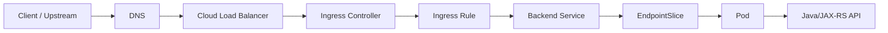
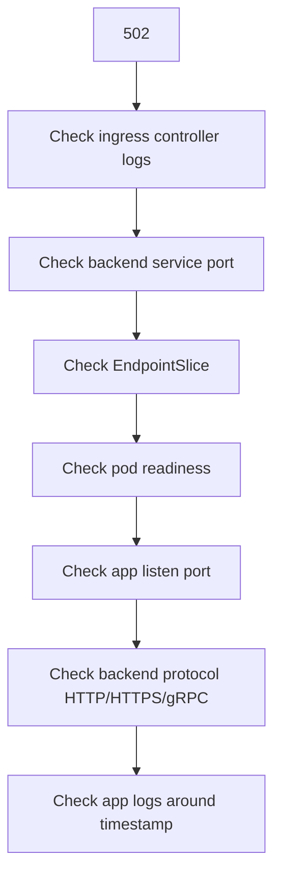
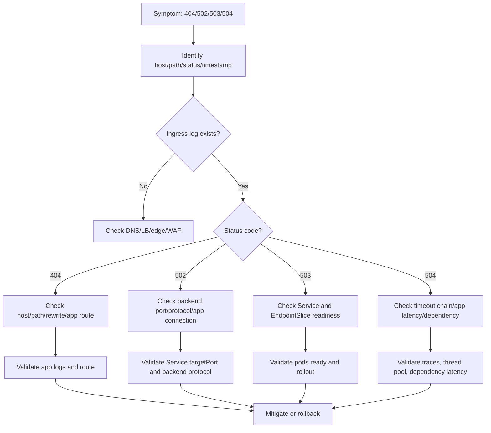

# Part 022 — Ingress Operations

Ingress adalah salah satu titik paling sering menjadi sumber incident untuk backend service di Kubernetes. Banyak outage terlihat sebagai error aplikasi, tetapi request sebenarnya gagal di **host routing**, **path routing**, **TLS termination**, **rewrite rule**, **backend service mapping**, **backend protocol**, **timeout**, atau **readiness endpoint**.

Untuk senior backend engineer, Ingress bukan sekadar YAML untuk expose API. Ingress adalah control point yang menentukan apakah traffic production benar-benar sampai ke Java/JAX-RS runtime dengan path, header, protocol, TLS, timeout, dan body behavior yang benar.

Dalam sistem enterprise seperti CPQ, quote/order lifecycle, billing integration, dan telco BSS/OSS, kesalahan Ingress bisa menyebabkan:

- API tidak reachable;
- endpoint mengarah ke service yang salah;
- path rewrite memotong URL JAX-RS;
- TLS mismatch;
- request body ditolak;
- upload gagal;
- timeout lebih pendek dari proses backend;
- 502/503/504 saat rollout;
- canary traffic salah routing;
- public/internal exposure salah;
- header auth/correlation hilang.

Target part ini: membangun kemampuan membaca dan men-debug Ingress secara production-oriented.

---

## 1. Ingress Mental Model

Ingress mendefinisikan rule HTTP(S) untuk mengarahkan traffic eksternal atau internal ke Service Kubernetes.



Ingress object hanya deklarasi. Yang benar-benar memproses traffic adalah **ingress controller** seperti NGINX Ingress Controller, AWS Load Balancer Controller, Application Gateway Ingress Controller, HAProxy, Traefik, Kong, atau controller lain.

Operational invariant:

```text
DNS/LB must reach controller.
Controller must watch the IngressClass.
Ingress rule must match host/path.
Backend Service must exist.
Service must have ready endpoints.
Backend protocol and port must be correct.
Application must understand the forwarded path/header/protocol.
```

---

## 2. Ingress vs Service

Service discovery menjawab: **service name ini mengarah ke pod mana?**

Ingress menjawab: **HTTP request dengan host/path tertentu harus diarahkan ke Service mana?**

| Layer | Object | Main concern |
|---|---|---|
| External/internal HTTP routing | Ingress | host, path, TLS, rewrite, annotation |
| Stable backend target | Service | selector, port, targetPort |
| Actual pod backend | EndpointSlice | ready pod IP and port |
| Runtime handling | Pod/app | JAX-RS route, thread pool, timeout |

Saat terjadi 503, jangan hanya cek Ingress. Cek Service dan EndpointSlice juga.

---

## 3. IngressClass and Controller Ownership

IngressClass menentukan controller mana yang menangani Ingress.

```yaml
apiVersion: networking.k8s.io/v1
kind: Ingress
metadata:
  name: quote-api
spec:
  ingressClassName: nginx
```

Command aman:

```bash
kubectl get ingressclass
kubectl get ingress -n <namespace>
kubectl describe ingress <name> -n <namespace>
```

Failure modes:

- `ingressClassName` salah;
- cluster punya beberapa controller;
- annotation lama dan `ingressClassName` baru tidak konsisten;
- controller tidak watch namespace tersebut;
- Ingress dibuat tetapi tidak diproses controller;
- controller pod unhealthy;
- platform migrasi dari Ingress ke Gateway/API Gateway.

Backend engineer harus tahu controller mana yang berlaku di environment, tetapi biasanya tidak mengubah controller deployment tanpa platform/SRE.

---

## 4. Basic Ingress Anatomy

Contoh sederhana:

```yaml
apiVersion: networking.k8s.io/v1
kind: Ingress
metadata:
  name: quote-api
  namespace: quote-prod
spec:
  ingressClassName: nginx
  tls:
    - hosts:
        - quote.example.internal
      secretName: quote-api-tls
  rules:
    - host: quote.example.internal
      http:
        paths:
          - path: /quote
            pathType: Prefix
            backend:
              service:
                name: quote-api
                port:
                  name: http
```

Review points:

- host benar;
- path benar;
- pathType sesuai;
- TLS secret ada dan valid;
- backend Service ada;
- backend service port benar;
- Service punya ready endpoint;
- JAX-RS app memahami path yang diterima;
- annotation controller tidak bertentangan.

---

## 5. Host Routing

Host routing memilih backend berdasarkan `Host` header.

```yaml
rules:
  - host: quote.example.internal
```

Failure modes:

- DNS mengarah ke LB yang salah;
- Host header tidak match Ingress rule;
- wildcard host terlalu luas;
- environment hostname tertukar;
- public hostname mengarah ke internal route;
- private DNS zone tidak linked;
- TLS certificate host mismatch;
- multiple Ingress objects saling konflik.

Symptoms:

- 404 dari ingress controller;
- default backend response;
- request tidak muncul di app logs;
- certificate mismatch;
- route bekerja dengan curl manual memakai Host header tetapi gagal dari client nyata.

Safe checks:

```bash
kubectl get ingress -A | grep <host>
kubectl describe ingress <ingress> -n <namespace>
```

Internal verification:

- siapa owner hostname;
- apakah DNS public/private;
- apakah host dipakai oleh environment lain;
- apakah ada wildcard route;
- apakah ingress conflict detection tersedia.

---

## 6. Path Routing

Path routing memilih backend berdasarkan URL path.

```yaml
paths:
  - path: /quote
    pathType: Prefix
```

PathType umum:

| pathType | Meaning | Operational caution |
|---|---|---|
| `Exact` | harus match penuh | aman tapi rigid |
| `Prefix` | match prefix path | hati-hati overlap |
| `ImplementationSpecific` | tergantung controller | hindari jika tidak jelas |

Failure modes:

- `/quote` vs `/quotes` overlap;
- trailing slash mismatch;
- JAX-RS base path tidak cocok;
- rewrite rule mengubah path;
- route order/controller behavior berbeda;
- path lama masih dipakai client;
- API version path tidak konsisten.

JAX-RS impact:

Jika aplikasi expose:

```java
@Path("/api/v1/quotes")
```

Tetapi Ingress route `/quote` dengan rewrite ke `/`, backend bisa menerima path yang tidak sesuai.

---

## 7. Rewrite Operations

Rewrite mengubah path sebelum request diteruskan ke backend.

Contoh NGINX-style annotation dapat berbeda tergantung controller, jadi selalu verifikasi controller internal.

Operational risk:

- backend menerima path berbeda dari yang dilihat client;
- OpenAPI docs tidak sesuai runtime route;
- JAX-RS resource 404;
- auth middleware memakai path sebelum rewrite tetapi app menerima path setelah rewrite;
- tracing/logging membingungkan;
- canary path split salah.

Symptoms:

- ingress access log menunjukkan route match;
- app logs menunjukkan path tidak dikenal;
- 404 berasal dari Java app, bukan ingress;
- health check path berbeda dari traffic path.

Review checklist:

- apakah rewrite diperlukan?
- path client apa?
- path backend apa?
- apakah JAX-RS base path cocok?
- apakah docs/test/smoke test menggunakan path eksternal atau internal?
- apakah correlation log mencatat original path?

---

## 8. TLS Operations

Ingress sering menjadi titik TLS termination.

```yaml
tls:
  - hosts:
      - quote.example.internal
    secretName: quote-api-tls
```

Failure modes:

- TLS secret missing;
- certificate expired;
- certificate CN/SAN tidak match host;
- wrong secret namespace;
- private key mismatch;
- CA chain incomplete;
- SNI mismatch;
- backend membutuhkan HTTPS tetapi ingress mengirim HTTP;
- double TLS termination tidak disadari;
- mTLS policy tidak jelas.

Symptoms:

- client TLS handshake failure;
- browser/curl certificate error;
- ingress controller logs certificate error;
- 502 jika backend protocol TLS mismatch;
- app tidak menerima request.

Backend engineer responsibility:

- tahu apakah app menerima HTTP atau HTTPS dari ingress;
- tahu apakah TLS terminate di edge, LB, ingress, service mesh, atau app;
- tahu truststore/keystore Java jika app melakukan outbound TLS;
- tidak menyalin secret value ke log/chat/ticket.

---

## 9. Backend Service Mapping

Ingress backend harus menunjuk Service dan port yang benar.

```yaml
backend:
  service:
    name: quote-api
    port:
      name: http
```

Failure modes:

- service name salah;
- namespace salah secara konseptual karena Ingress hanya refer Service di namespace yang sama;
- service port name salah;
- service exists but no endpoint;
- service points to wrong pod;
- backend protocol mismatch;
- Service changed but Ingress not updated.

Safe checks:

```bash
kubectl describe ingress <ingress> -n <namespace>
kubectl get svc <service> -n <namespace> -o yaml
kubectl get endpointslice -n <namespace> -l kubernetes.io/service-name=<service>
```

Invariant:

```text
Ingress backend service name + port -> Service port -> targetPort -> ready Pod container port
```

---

## 10. Backend Protocol

Ingress controller perlu tahu apakah backend berbicara HTTP, HTTPS, gRPC, WebSocket, atau protocol lain.

Failure mode umum:

- ingress mengirim HTTP ke backend HTTPS;
- ingress mengirim HTTPS ke backend HTTP;
- gRPC tidak dikonfigurasi sebagai gRPC;
- WebSocket/SSE timeout atau buffering salah;
- HTTP/2 expectation mismatch;
- TLS verify upstream gagal.

Symptoms:

- 502 Bad Gateway;
- upstream prematurely closed connection;
- SSL handshake error;
- gRPC unavailable;
- streaming putus;
- app logs tidak menunjukkan request normal.

Backend engineer perlu memastikan runtime Java/JAX-RS, framework server, dan ingress annotation/protocol compatible.

---

## 11. Common Status Codes

| Status | Likely layer | Meaning |
|---|---|---|
| 404 | ingress or app | host/path not matched, rewrite wrong, JAX-RS route missing |
| 413 | ingress/edge | request body too large |
| 429 | gateway/WAF/API gateway | rate limit |
| 499 | client/NGINX | client closed request before response |
| 502 | ingress/backend protocol | bad gateway, connection refused, TLS/protocol mismatch |
| 503 | ingress/service | no endpoint, backend unavailable, controller cannot route |
| 504 | ingress/backend timeout | upstream timeout, app/dependency too slow |

Do not interpret every 5xx as app bug. Determine which layer generated the response.

---

## 12. Debugging 404

404 can come from ingress controller or backend app.

Question: **Who generated the 404?**

Ingress-side 404:

- host not matched;
- path not matched;
- default backend;
- wrong IngressClass;
- route conflict.

App-side 404:

- request reached Java;
- JAX-RS resource path not found;
- rewrite changed path;
- context path mismatch;
- API version mismatch.

Investigation:

```bash
kubectl describe ingress <ingress> -n <namespace>
kubectl logs -n <ingress-namespace> <ingress-controller-pod>
kubectl logs -n <app-namespace> deploy/<deployment>
```

Evidence distinction:

| Evidence | Interpretation |
|---|---|
| no app log | likely ingress route mismatch |
| app access log has request | likely JAX-RS route/path issue |
| ingress access log default backend | host/path mismatch |
| only specific path fails | path/rewrite/version issue |

---

## 13. Debugging 502

502 usually means ingress reached a backend conceptually but could not successfully proxy.

Common causes:

- backend port not listening;
- Service targetPort wrong;
- backend protocol mismatch;
- TLS handshake to backend failed;
- pod accepted connection then closed;
- app crashed during request;
- NGINX upstream error;
- network reset.

Investigation flow:



Safe commands:

```bash
kubectl describe ingress <ingress> -n <namespace>
kubectl describe svc <service> -n <namespace>
kubectl get endpointslice -n <namespace> -l kubernetes.io/service-name=<service>
kubectl logs deploy/<deployment> -n <namespace> --since=30m
```

---

## 14. Debugging 503

503 often means backend unavailable.

Common causes:

- Service has no endpoint;
- pods not ready;
- rollout in progress with insufficient ready replicas;
- ingress backend service missing;
- controller cannot find service port;
- PDB/rollout interaction reduced availability;
- HPA scaled to zero where not expected;
- namespace/service mismatch;
- NetworkPolicy or controller-specific health issue.

Investigation:

```bash
kubectl get ingress <ingress> -n <namespace>
kubectl describe ingress <ingress> -n <namespace>
kubectl get svc <service> -n <namespace>
kubectl get endpointslice -n <namespace> -l kubernetes.io/service-name=<service>
kubectl get pods -n <namespace> -l '<selector>'
kubectl rollout status deploy/<deployment> -n <namespace>
```

Most important question:

```text
Does the backend Service have ready endpoints?
```

If no, debug Service discovery and readiness before changing ingress.

---

## 15. Debugging 504

504 means gateway timeout. Ingress connected or attempted to connect, but backend did not respond within timeout.

Common causes:

- Java request handling too slow;
- dependency timeout longer than ingress timeout;
- database query slow;
- thread pool saturated;
- connection pool exhausted;
- Kafka/RabbitMQ synchronous wait anti-pattern;
- downstream HTTP call hanging;
- ingress timeout too short;
- client timeout shorter than backend;
- GC pause or CPU throttling.

Timeout chain example:

```text
Client 30s
Cloud LB 60s
Ingress 30s
JAX-RS server 120s
HTTP client dependency 90s
Database query 180s
```

This is unsafe because upstream timeouts expire before backend gives up.

Debugging:

- check ingress timeout config;
- check app latency dashboard;
- check traces;
- check dependency spans;
- check Java thread pool;
- check DB/broker/Redis metrics;
- check CPU throttling/GC.

Mitigation is not always “increase ingress timeout.” Often the better fix is bounded dependency timeout, async processing, query optimization, or backpressure.

---

## 16. Ingress and Java/JAX-RS Path Handling

JAX-RS path is affected by:

- application context path;
- servlet mapping;
- `@ApplicationPath`;
- resource `@Path`;
- ingress path prefix;
- rewrite behavior;
- forwarded headers;
- base URL used for generated links;
- OpenAPI endpoint path.

Example:

```java
@ApplicationPath("/api")
public class RestApplication extends Application {}

@Path("/quotes")
public class QuoteResource {}
```

Effective backend path:

```text
/api/quotes
```

If Ingress exposes `/quote-service` and rewrites to `/`, external path and internal path must be explicitly mapped.

Operational issues:

- health endpoint path wrong;
- OpenAPI docs show internal path;
- auth callback URL wrong;
- reverse proxy strips prefix unexpectedly;
- redirect Location header wrong without forwarded header handling.

---

## 17. Forwarded Headers and Source IP

Ingress often injects or forwards headers:

- `X-Forwarded-For`;
- `X-Forwarded-Proto`;
- `X-Forwarded-Host`;
- `X-Request-ID`;
- `X-Correlation-ID`;
- `traceparent`;
- auth headers;
- client certificate headers if mTLS is terminated upstream.

Operational risks:

- app thinks request is HTTP not HTTPS;
- generated redirect URL is wrong;
- source IP logging inaccurate;
- auth layer trusts spoofed headers;
- correlation ID lost;
- trace propagation broken;
- compliance audit loses client identity.

Backend engineer should verify framework/proxy configuration for forwarded headers and ensure trusted proxy boundary is clear.

---

## 18. Body Size, Buffering, Streaming, and Uploads

Ingress may enforce body size and buffering.

Failure modes:

- large quote import fails with 413;
- file upload times out;
- streaming response buffered and delayed;
- Server-Sent Events break;
- WebSocket upgrade fails;
- request body buffering increases disk/memory usage in controller;
- slow client causes connection exhaustion.

Questions to verify:

- maximum body size;
- request buffering behavior;
- response buffering behavior;
- upload timeout;
- read timeout;
- WebSocket/SSE support;
- whether endpoint should be synchronous at all.

For enterprise backend, large file processing should often be asynchronous: upload, validate, enqueue, process, notify.

---

## 19. Timeout and Retry at Ingress Layer

Ingress timeout must align with backend behavior.

Typical timeout concerns:

- connect timeout to upstream;
- read timeout from upstream;
- send timeout to upstream;
- idle timeout;
- keepalive timeout;
- LB timeout;
- client timeout.

Bad pattern:

```text
Ingress timeout: 30s
Java dependency timeout: 120s
Retry count: 3
```

This creates wasted work and duplicate pressure after ingress gives up.

Better pattern:

- ingress timeout matches external contract;
- backend has shorter dependency timeouts;
- retries are bounded and idempotent;
- long-running operations become async;
- client receives operation status instead of waiting indefinitely.

---

## 20. Ingress During Rollout

Rollout can affect ingress behavior through endpoint changes.

Scenarios:

- old pods terminating before new pods ready;
- maxUnavailable too high;
- readiness probe too optimistic;
- preStop/grace period too short;
- Service endpoint temporarily empty;
- canary/stable routing split wrong;
- new version has path/protocol mismatch;
- ingress caches upstream config briefly during reload.

Rollout safety checks:

```bash
kubectl rollout status deploy/<deployment> -n <namespace>
kubectl get endpointslice -n <namespace> -l kubernetes.io/service-name=<service> -w
kubectl describe ingress <ingress> -n <namespace>
```

Post-deployment verification:

- route returns expected status;
- app access logs show traffic;
- error rate stable;
- latency stable;
- endpoint count expected;
- trace reaches correct version;
- dependency metrics stable.

---

## 21. EKS, AKS, and On-Prem/Hybrid Awareness

### EKS

Ingress may be implemented through:

- AWS Load Balancer Controller;
- ALB Ingress;
- NGINX behind NLB/ALB;
- Route 53 DNS;
- ACM certificates;
- security groups;
- target groups;
- private/public subnets.

Failure modes:

- ALB target group unhealthy;
- subnet tag issue;
- security group block;
- certificate ARN issue;
- Route 53 record wrong;
- ingress annotation interpreted by AWS controller, not NGINX.

### AKS

Ingress may involve:

- NGINX ingress;
- Application Gateway Ingress Controller;
- Azure Load Balancer;
- Azure Application Gateway;
- Azure Private DNS Zone;
- Key Vault certificates;
- NSG/UDR.

Failure modes:

- Application Gateway backend unhealthy;
- private DNS issue;
- NSG blocks traffic;
- certificate/key vault integration issue;
- controller sync delay.

### On-prem/hybrid

Ingress may involve:

- internal load balancer;
- corporate DNS;
- F5/HAProxy/NGINX appliances;
- firewall;
- proxy;
- internal CA;
- split routing between datacenter and cloud.

Always verify actual topology internally. Do not assume a generic cloud ingress path.

---

## 22. Observability Signals

| Signal | What to inspect |
|---|---|
| Ingress object | host/path/TLS/backend mapping |
| Ingress controller logs | route match, upstream errors, reload errors |
| Controller metrics | 4xx/5xx, latency, upstream timeouts |
| Service | backend selector and port |
| EndpointSlice | ready backend pod endpoints |
| Pod logs | whether request reached app |
| App metrics | HTTP status, latency, thread pool, errors |
| Traces | ingress span, service span, dependency span |
| DNS/LB metrics | request reached ingress or not |
| Deployment markers | error started after release |

Critical distinction:

```text
No ingress log -> DNS/LB/edge problem likely.
Ingress log but no app log -> ingress/service/endpoint/protocol problem likely.
App log exists -> app route/logic/dependency problem likely.
```

---

## 23. Production-Safe Command Workflow

Start with read-only object inspection.

```bash
# Find ingress
kubectl get ingress -n <namespace>
kubectl get ingress -A | grep <host-or-service>

# Describe route and backend
kubectl describe ingress <ingress> -n <namespace>

# Verify class
kubectl get ingressclass

# Verify backend service
kubectl get svc <service> -n <namespace>
kubectl describe svc <service> -n <namespace>

# Verify endpoint
kubectl get endpointslice -n <namespace> -l kubernetes.io/service-name=<service>

# Verify pod readiness
kubectl get pods -n <namespace> -l '<selector>'
kubectl describe pod <pod> -n <namespace>

# Verify rollout
kubectl rollout status deploy/<deployment> -n <namespace>
```

Controller logs require knowing controller namespace and access policy:

```bash
kubectl logs -n <ingress-controller-namespace> deploy/<controller-deployment> --since=30m
```

Use only if permitted.

---

## 24. Backend Engineer Responsibility

Backend engineer should own or strongly review:

- route requirements for service API;
- JAX-RS path and context path compatibility;
- readiness endpoint behavior;
- backend service and port mapping;
- timeout expectation;
- idempotency and retry behavior;
- generated URL/forwarded header behavior;
- API versioning path;
- large body or streaming requirements;
- service-level dashboard and logs;
- smoke test path.

Backend engineer should verify, but usually not own:

- ingress controller deployment;
- cloud load balancer provisioning;
- DNS zone management;
- WAF policy;
- global TLS policy;
- edge authentication policy;
- shared controller ConfigMap;
- public/private exposure controls.

---

## 25. Platform/SRE Responsibility

Platform/SRE commonly owns:

- ingress controller lifecycle;
- controller ConfigMap and global annotations policy;
- LB integration;
- DNS automation;
- TLS automation/cert-manager;
- WAF/API gateway policy;
- controller observability;
- ingress capacity;
- controller upgrade;
- multi-tenant route safety;
- escalation for controller bugs.

Good escalation includes:

- host/path affected;
- ingress name/namespace;
- ingress class;
- backend service and endpoint status;
- exact status code;
- timestamp;
- controller log snippet if available;
- recent release/change;
- client impact and blast radius.

---

## 26. PR Review Checklist

When reviewing Ingress-related PRs:

- Is `ingressClassName` correct?
- Is host correct for environment?
- Is path correct and non-overlapping?
- Is `pathType` explicit?
- Is rewrite required and documented?
- Does JAX-RS backend path match final upstream path?
- Does TLS secret/certificate source exist?
- Does backend Service exist in same namespace?
- Does service port name/number match?
- Does backend protocol match app protocol?
- Are timeout annotations aligned with backend timeouts?
- Are body size/buffering settings needed?
- Are WebSocket/SSE/gRPC requirements handled?
- Are auth/correlation/trace headers preserved?
- Does route expose internal API publicly by mistake?
- Does smoke test cover the external route?
- Is rollback safe if route changes?

---

## 27. Internal Verification Checklist

Verify internally:

- ingress controller type per environment;
- supported annotations and banned annotations;
- whether Gateway API/API Gateway/service mesh is used;
- DNS ownership and hostname request process;
- TLS certificate issuance and renewal process;
- WAF/API gateway policy;
- public vs private ingress standard;
- route naming convention;
- timeout default values;
- body size default values;
- controller log access;
- controller dashboard;
- alert for ingress 5xx/latency;
- runbook for 404/502/503/504;
- escalation path to platform/SRE/network/security;
- release checklist for route changes.

---

## 28. Production Runbook: Ingress Failure



Mitigation options:

- rollback recent Ingress/Service/Deployment change;
- restore previous route through GitOps;
- scale known-good backend if endpoints too low;
- pause rollout;
- adjust route/rewrite if clearly wrong;
- temporarily route away from broken canary;
- escalate LB/controller/DNS/WAF issue with evidence.

Avoid:

- blindly increasing timeout;
- changing global controller config for one service;
- exposing private service publicly;
- disabling TLS verification without approval;
- editing production Ingress manually while GitOps will revert it;
- assuming 5xx is always application code failure.

---

## 29. Summary

Ingress operations answer this question:

> Given an external or internal HTTP request, does the routing layer deliver it to the intended backend Service with the correct host, path, TLS, protocol, port, timeout, and headers?

The operational chain is:

```text
DNS -> Load Balancer -> Ingress Controller -> Ingress Rule -> Service -> EndpointSlice -> Pod -> Java/JAX-RS Route
```

Backend engineer mastery means being able to:

- read Ingress rule and backend mapping;
- distinguish 404/502/503/504 by likely layer;
- verify Service and EndpointSlice before blaming ingress;
- reason about rewrite, TLS, timeout, headers, and backend protocol;
- connect ingress behavior to Java/JAX-RS routing and dependency latency;
- escalate platform/SRE issues with precise evidence;
- prevent route changes from becoming production incidents.

Ingress is not just an entry point. It is a production contract between clients, platform routing, Kubernetes services, and backend application semantics.
