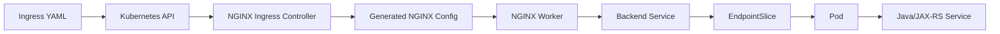
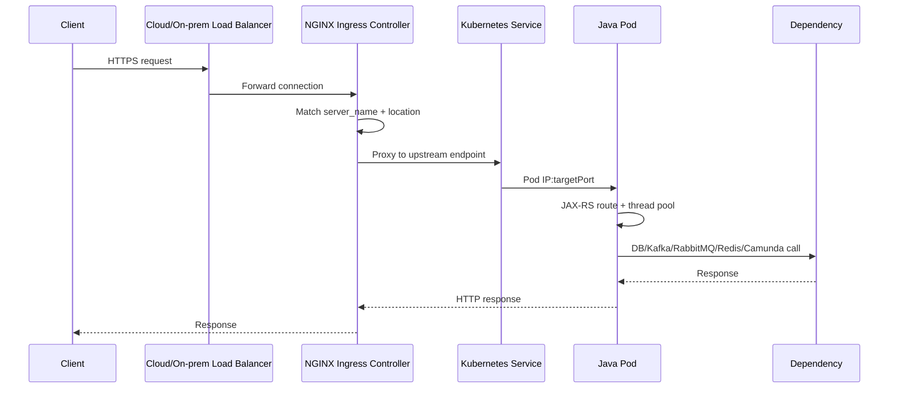
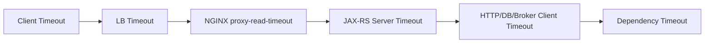
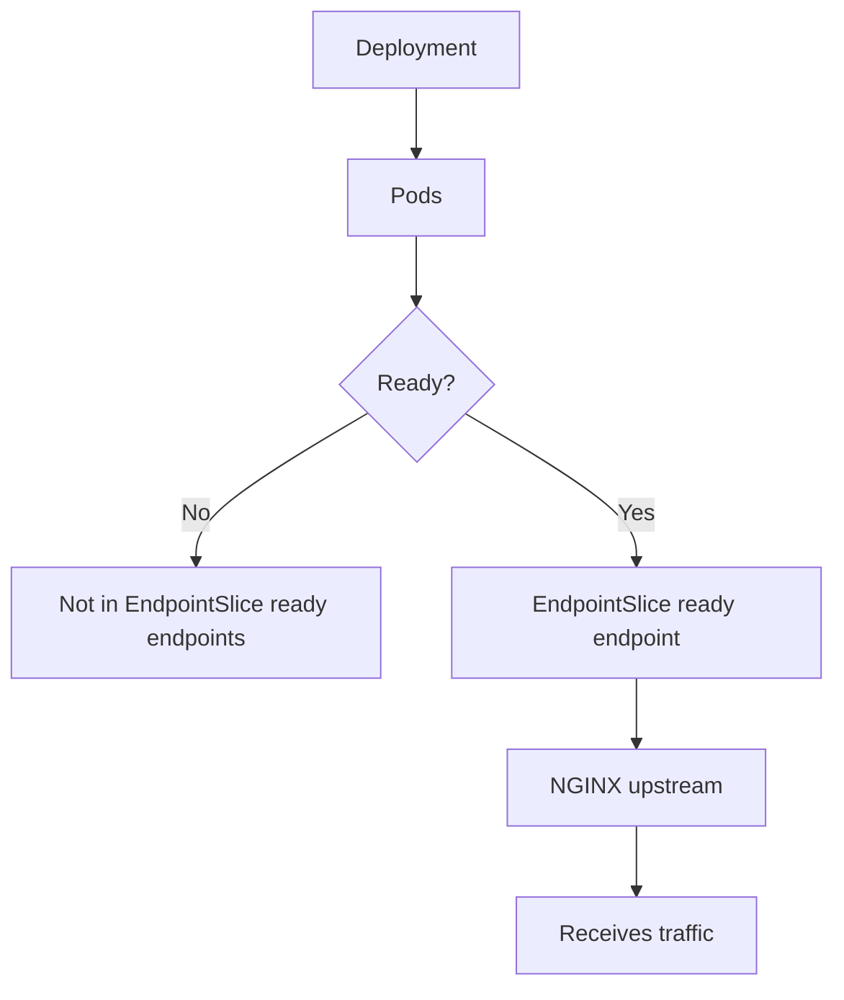
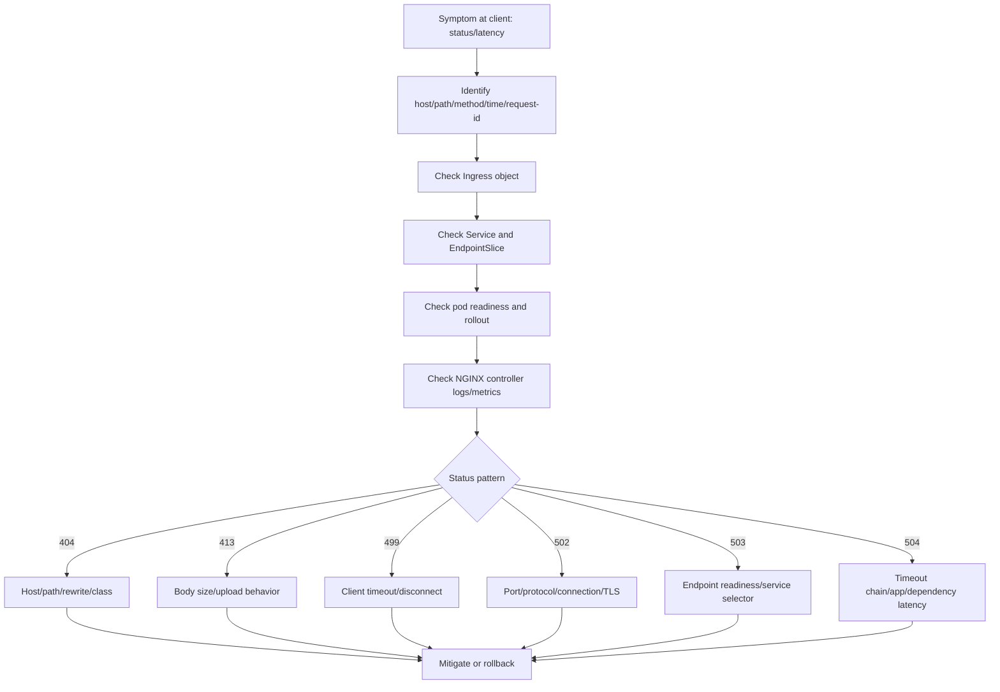

# Part 023 — NGINX/Ingress Controller Operational Concerns

NGINX Ingress Controller sering menjadi lapisan yang terlihat sederhana tetapi sangat menentukan reliability backend service. Banyak incident API bukan murni bug Java/JAX-RS, melainkan akibat **controller config**, **annotation**, **timeout**, **buffering**, **body size**, **TLS/backend protocol mismatch**, **reload behavior**, atau **upstream endpoint state**.

Untuk senior backend engineer, targetnya bukan menjadi platform engineer yang mengelola controller cluster-wide. Targetnya adalah mampu membaca efek NGINX Ingress terhadap service owner responsibility:

- apakah request benar-benar sampai ke pod;
- apakah path/header/body diteruskan sesuai kontrak aplikasi;
- apakah timeout selaras dengan backend dan dependency;
- apakah body upload, streaming, SSE, WebSocket, atau long polling diperlakukan benar;
- apakah perubahan annotation memperbesar blast radius;
- apakah 502/503/504 berasal dari routing layer, service discovery, atau Java runtime;
- kapan harus rollback dan kapan harus eskalasi ke platform/SRE.

Part ini melanjutkan Part 022. Fokusnya bukan hanya object `Ingress`, tetapi **controller behavior**.

---

## 1. Mental Model: Ingress Object vs Ingress Controller

Ingress object adalah deklarasi routing. NGINX Ingress Controller adalah proses yang membaca deklarasi itu dan menghasilkan runtime NGINX configuration.



Operational invariant:

```text
Ingress object correct is not enough.
Controller must watch it.
Controller must render valid NGINX config.
NGINX must reload safely.
Runtime config must route to the intended Service endpoints.
Backend behavior must match timeout/body/protocol/header assumptions.
```

Saat ada 5xx, jangan hanya cek manifest. Cek juga apakah controller sudah memproses manifest, apakah reload berhasil, dan apakah runtime NGINX melihat backend endpoint yang benar.

---

## 2. Backend Engineer Responsibility vs Platform Responsibility

Backend engineer biasanya bertanggung jawab pada:

- Ingress rule untuk service miliknya;
- host/path yang dipakai aplikasi;
- annotation yang service-specific;
- timeout yang dibutuhkan endpoint;
- request body size jika endpoint upload/import;
- header forwarding requirement;
- correlation/trace propagation;
- readiness endpoint dan backend port;
- post-deployment route verification;
- evidence saat eskalasi ke platform/SRE.

Platform/SRE biasanya bertanggung jawab pada:

- deployment controller NGINX;
- controller version;
- controller ConfigMap global;
- admission policy annotation;
- default timeout/body/buffer values;
- controller resource sizing;
- controller autoscaling;
- load balancer integration;
- controller logs/metrics exposure;
- TLS/certificate integration jika centralized;
- security baseline dan WAF/edge integration.

Dangerous actions untuk backend engineer:

- mengubah ConfigMap global controller tanpa review;
- mengubah controller Deployment;
- mengubah ingress class default;
- menambah annotation berisiko cluster-wide;
- bypass TLS/auth;
- membuat route publik untuk service internal;
- menaikkan timeout/body size tanpa memahami cost dan abuse risk.

---

## 3. NGINX Ingress Traffic Path

Untuk satu request API, path umumnya seperti ini:



Failure bisa muncul di beberapa titik:

| Symptom | Likely layer |
|---|---|
| 404 default backend | host/path tidak match |
| 413 payload too large | body size limit |
| 499 client closed request | client timeout lebih pendek dari backend |
| 502 bad gateway | backend connection/protocol/port issue |
| 503 service unavailable | no ready upstream endpoint |
| 504 gateway timeout | upstream terlalu lama atau timeout mismatch |
| intermittent 5xx during rollout | endpoint readiness/termination/keepalive issue |
| streaming putus | buffering/timeout/proxy response setting |

---

## 4. Controller Pod Operations

Controller sendiri adalah workload Kubernetes. Jika controller unhealthy, semua Ingress yang ditangani controller itu terdampak.

Safe commands:

```bash
kubectl get pods -n <ingress-controller-namespace>
kubectl get deploy -n <ingress-controller-namespace>
kubectl describe pod <controller-pod> -n <ingress-controller-namespace>
kubectl logs <controller-pod> -n <ingress-controller-namespace> --tail=200
kubectl top pod -n <ingress-controller-namespace>
```

Hal yang dicek:

- controller pods Ready atau tidak;
- restart count naik;
- CPU throttling;
- memory pressure;
- leader election issue;
- config reload errors;
- admission webhook errors;
- failed sync dengan Kubernetes API;
- endpoint update delay;
- controller version;
- number of watched ingresses.

Backend engineer tidak perlu mengubah controller, tetapi harus mampu menyampaikan bukti:

```text
Host/path affected: <host>/<path>
Ingress object: <namespace>/<name>
Time window: <start-end>
Observed status: 503 spike
Service endpoints: ready
Backend logs: no request received
Controller log evidence: upstream not found / reload error / endpoint sync delay
Escalation: platform/SRE
```

---

## 5. Controller ConfigMap

NGINX Ingress Controller biasanya punya ConfigMap untuk default behavior global.

Contoh area yang sering dikontrol:

- proxy connect/read/send timeout;
- client body size;
- proxy buffering;
- keepalive;
- header forwarding;
- real IP handling;
- log format;
- gzip/compression;
- SSL protocols/ciphers;
- HTTP/2;
- server tokens;
- custom snippets jika diizinkan;
- default backend behavior.

Safe read:

```bash
kubectl get configmap -n <controller-namespace>
kubectl describe configmap <controller-configmap> -n <controller-namespace>
kubectl get configmap <controller-configmap> -n <controller-namespace> -o yaml
```

Operational concerns:

- ConfigMap global memengaruhi banyak service;
- perubahan kecil bisa mengubah timeout semua API;
- beberapa key mungkin deprecated antar versi controller;
- invalid config bisa menyebabkan reload gagal;
- security team mungkin melarang `server-snippet` atau `configuration-snippet`;
- GitOps bisa mengembalikan manual change.

Backend engineer sebaiknya tidak mengubah ConfigMap global sendiri. Ajukan perubahan dengan evidence, blast radius, fallback, dan service-specific alternative.

---

## 6. Annotation as Service-Specific Control

Annotation sering dipakai untuk mengatur behavior per Ingress.

Contoh kategori annotation:

- timeout;
- body size;
- rewrite;
- backend protocol;
- TLS redirect;
- proxy buffering;
- auth;
- rate limit;
- canary;
- whitelist/source range;
- CORS;
- custom snippets.

Contoh konseptual:

```yaml
metadata:
  annotations:
    nginx.ingress.kubernetes.io/proxy-read-timeout: "60"
    nginx.ingress.kubernetes.io/proxy-send-timeout: "60"
    nginx.ingress.kubernetes.io/proxy-body-size: "10m"
```

Operational rule:

```text
Every annotation must have an operational reason.
Every annotation must have a failure mode.
Every annotation must have a rollback path.
```

Bad annotation examples:

- menaikkan timeout sangat tinggi untuk menyembunyikan latency dependency;
- body size terlalu besar tanpa upload scanning/throttling;
- rewrite rule tidak disesuaikan dengan JAX-RS base path;
- backend protocol HTTPS padahal pod menerima HTTP;
- whitelist salah sehingga client production terblokir;
- canary annotation tertinggal setelah release;
- snippet berisi config yang tidak kompatibel dengan controller version.

---

## 7. Timeout Operations

Timeout NGINX harus selaras dengan timeout client, app server, HTTP client, DB, broker, dan upstream gateway.



Common NGINX timeout concerns:

- `proxy-connect-timeout`: waktu untuk connect ke backend;
- `proxy-read-timeout`: waktu menunggu response dari backend;
- `proxy-send-timeout`: waktu mengirim request ke backend;
- keepalive timeout;
- upstream idle timeout;
- load balancer idle timeout di depan NGINX.

Symptoms:

- 504 dari ingress;
- 499 jika client disconnect duluan;
- request sukses di app tetapi client sudah timeout;
- duplicate retry dari upstream client;
- long-running quote/order operation terputus;
- thread pool app penuh karena request terlalu lama dibiarkan hidup.

Backend engineer checklist:

- endpoint mana yang legitimately long-running;
- apakah endpoint seharusnya async;
- apakah dependency timeout lebih pendek dari ingress timeout;
- apakah client timeout lebih pendek dari ingress timeout;
- apakah retry policy memperbesar load;
- apakah trace menunjukkan bottleneck dependency;
- apakah timeout dinaikkan hanya untuk menyembunyikan desain buruk.

---

## 8. Buffering Operations

NGINX dapat melakukan request/response buffering. Ini penting untuk upload, streaming, SSE, dan memory/disk usage controller.

Buffering bisa membantu:

- melindungi backend dari slow client;
- mengurangi waktu koneksi backend terbuka;
- menstabilkan transfer response biasa.

Buffering bisa merusak:

- Server-Sent Events;
- streaming response;
- long polling tertentu;
- progress response;
- WebSocket jika salah konfigurasi;
- large upload jika temp storage controller penuh.

Operational symptoms:

- SSE tidak mengalir real-time;
- client melihat response hanya setelah request selesai;
- upload besar lambat atau gagal;
- controller disk/temp usage meningkat;
- latency terlihat tinggi di ingress tetapi app cepat;
- memory pressure di controller.

Backend engineer harus tahu apakah endpoint-nya:

- response biasa;
- streaming;
- SSE;
- WebSocket;
- file upload;
- file download;
- long polling;
- callback receiver.

Jangan menerapkan annotation buffering secara copy-paste antar service.

---

## 9. Body Size Operations

Body size limit sangat relevan untuk endpoint upload, import, bulk quote, attachment, document processing, atau integration payload besar.

Typical failure:

```text
HTTP 413 Payload Too Large
```

Risk jika limit terlalu kecil:

- legitimate request gagal;
- integration partner tidak bisa submit payload;
- batch import gagal;
- file upload gagal.

Risk jika limit terlalu besar:

- abuse surface meningkat;
- controller memory/disk pressure;
- backend memory pressure;
- longer connection occupancy;
- log volume meningkat jika payload metadata buruk;
- cost meningkat.

Review questions:

- berapa payload normal/p95/p99;
- apakah endpoint benar-benar perlu sync upload;
- apakah object storage lebih tepat;
- apakah request body diproses streaming atau di-buffer penuh;
- apakah Java heap aman;
- apakah timeout cukup;
- apakah rate limiting tersedia;
- apakah virus/malware scanning relevan;
- apakah PII/sensitive data terlibat.

---

## 10. WebSocket and SSE Operations

WebSocket dan SSE bukan request-response HTTP biasa.

WebSocket concerns:

- connection upgrade header;
- idle timeout;
- load balancer timeout;
- sticky session jika stateful;
- graceful pod termination;
- connection draining;
- HPA scale down impact.

SSE concerns:

- response buffering harus sesuai;
- read timeout harus cukup;
- client reconnect behavior;
- correlation ID per stream;
- ingress metrics bisa terlihat sebagai long request;
- app thread model harus aman.

For backend services, prefer verifying:

```text
Does the endpoint require streaming semantics?
Does the ingress preserve upgrade/streaming behavior?
Does rollout terminate connections gracefully?
Does autoscaling consider long-lived connections?
```

Jika CPQ/order UI atau integration channel memakai streaming/progress update, jangan samakan dengan REST CRUD endpoint biasa.

---

## 11. Upstream Health and Endpoint Awareness

NGINX Ingress Controller membangun upstream dari Service/EndpointSlice. Jika pod tidak Ready, endpoint tidak dipakai.



Important checks:

```bash
kubectl get svc <service> -n <namespace>
kubectl get endpointslice -n <namespace> -l kubernetes.io/service-name=<service>
kubectl get pods -n <namespace> -l <selector> -o wide
kubectl describe pod <pod> -n <namespace>
```

Common issues:

- Service selector wrong;
- targetPort wrong;
- pod not Ready;
- readiness probe too strict;
- rollout has no available pod;
- named port mismatch;
- endpoint update delay;
- NGINX still has stale upstream during rapid rollout;
- pod termination closes connection abruptly.

---

## 12. Reload Behavior

Ingress changes often cause NGINX config regeneration and reload. Reload is expected, but frequent reload can become operational noise or risk.

Sources of reload:

- Ingress create/update/delete;
- Service/Endpoint changes;
- Secret/certificate changes;
- ConfigMap changes;
- annotation changes;
- controller upgrade;
- scaling backend pods;
- GitOps sync waves.

Failure modes:

- invalid generated config;
- forbidden annotation rejected;
- reload storm from frequent object changes;
- temporary route inconsistency;
- high CPU during reload;
- controller logs flooded;
- new TLS secret not picked up as expected.

Backend engineer should observe:

- whether issue correlates with deployment time;
- whether route change and app rollout happened together;
- whether multiple Ingress objects changed at once;
- whether GitOps applied objects in risky order;
- whether controller logs show reload errors.

---

## 13. Controller Logs

Controller logs answer questions app logs cannot answer:

- did request reach ingress;
- what status code was returned by ingress;
- upstream response time;
- upstream address;
- host/path matched;
- connection refused vs timeout;
- client disconnected;
- config reload error;
- backend endpoint unavailable.

Safe command:

```bash
kubectl logs -n <controller-namespace> deploy/<controller-deployment> --since=15m | grep '<host-or-request-id>'
```

Depending on logging stack, prefer centralized log query because controller pod logs may rotate or be high volume.

Evidence to capture:

- request ID/correlation ID;
- timestamp with timezone;
- host/path/method;
- status code;
- upstream status;
- upstream response time;
- upstream address;
- ingress name/namespace if present;
- client IP handling if relevant.

Never paste sensitive headers, Authorization tokens, cookies, or payload content into incident chat.

---

## 14. Controller Metrics

Useful metrics categories:

- request rate by ingress/service/status;
- 4xx/5xx rate;
- upstream latency;
- controller reload count;
- reload error count;
- NGINX worker connections;
- CPU/memory usage;
- config last reload success;
- TLS certificate expiry if exported;
- endpoint count;
- admission webhook errors.

Backend service dashboard should ideally include ingress-level panels:

```text
Ingress request rate
Ingress 5xx rate
Ingress p95/p99 latency
Upstream response time
Top status codes
Route-level errors
Deployment markers
```

Without ingress metrics, backend engineer may misattribute route failures to application logic.

---

## 15. Backend Protocol and Port Concerns

NGINX must know whether backend speaks HTTP, HTTPS, gRPC, or another supported protocol. Service port must map to correct targetPort.

Failure examples:

- NGINX speaks HTTP to backend expecting HTTPS;
- NGINX speaks HTTPS to backend expecting HTTP;
- service port points to management port instead of API port;
- named port mismatch;
- gRPC missing protocol annotation;
- TLS verification/trust mismatch for upstream HTTPS;
- JAX-RS app mounted under a different base path.

Symptoms:

- 502;
- SSL handshake errors;
- connection reset;
- no app access log;
- unexpected 404 from app management endpoint;
- health endpoint works but business endpoint fails.

Safe checks:

```bash
kubectl describe ingress <ingress> -n <namespace>
kubectl get svc <service> -n <namespace> -o yaml
kubectl get pod <pod> -n <namespace> -o yaml | grep -A20 ports:
```

---

## 16. Header Operations

Headers carry production semantics:

- `Host`;
- `X-Forwarded-For`;
- `X-Forwarded-Proto`;
- `X-Request-ID`;
- `traceparent`;
- `baggage`;
- auth headers;
- tenant headers;
- locale headers;
- client certificate headers if mTLS is terminated upstream.

Operational risks:

- app generates wrong redirect URL because proto/host missing;
- source IP lost;
- correlation ID not propagated;
- trace broken at ingress;
- auth header stripped or duplicated;
- tenant context missing;
- internal header spoofing if trust boundary unclear.

Backend engineer should know which headers are part of the service contract and which are platform-owned.

---

## 17. Source IP and Real IP Handling

Source IP matters for audit, rate limiting, fraud detection, security logs, and compliance.

But source IP may pass through:

```text
Client -> CDN/WAF -> Load Balancer -> NGINX -> Pod
```

Risks:

- app sees load balancer IP only;
- `X-Forwarded-For` can be spoofed if trust boundary wrong;
- IP allowlist applied at wrong layer;
- private/internal client misidentified;
- audit logs misleading.

Internal verification:

- where real IP is determined;
- whether PROXY protocol is used;
- trusted proxy CIDRs;
- whether app should trust `X-Forwarded-*`;
- whether source IP is needed by business logic;
- whether security team owns source IP policy.

---

## 18. TLS Termination and Backend TLS

TLS may terminate at:

- CDN/front door;
- cloud load balancer;
- NGINX ingress;
- service mesh sidecar;
- backend pod;
- multiple layers.

Backend engineer must know the service's effective model:

```text
Client HTTPS -> LB HTTPS/HTTP -> NGINX HTTPS/HTTP -> Pod HTTP/HTTPS
```

Operational concerns:

- certificate expiry;
- wrong TLS secret;
- SNI mismatch;
- TLS redirect loop;
- backend protocol mismatch;
- mTLS expectation mismatch;
- Java truststore missing internal CA;
- certificate reload delay;
- private key exposure risk.

Do not assume TLS at the edge means encrypted traffic all the way to pod. Verify internal standard.

---

## 19. Rate Limiting and Abuse Controls

Some NGINX ingress setups support rate limiting through annotations or external modules. In enterprise systems, rate limiting may instead live at API Gateway, WAF, service mesh, or app layer.

Operational risks:

- rate limit blocks legitimate integration partner;
- missing rate limit allows request flood;
- per-IP limit ineffective behind NAT;
- per-tenant limit belongs in app/API gateway, not basic ingress;
- retry storm amplifies 429/5xx;
- no dashboard for rejected requests.

Backend engineer should verify:

- where rate limiting is enforced;
- what key is used: IP, user, tenant, client ID, API key;
- whether 429 response is expected by clients;
- whether retry-after header is set;
- whether rate limit events are observable.

---

## 20. Java/JAX-RS Impact

NGINX config affects Java service behavior directly.

| NGINX concern | Java/JAX-RS impact |
|---|---|
| Rewrite | resource path mismatch |
| Timeout | request interrupted or duplicate retry |
| Body size | upload/import rejected before app |
| Buffering | streaming/SSE behavior changes |
| Header forwarding | auth, tenant, trace, redirect errors |
| Backend protocol | SSL/connection failure |
| Keepalive | connection reuse behavior |
| 503 endpoint issue | pod readiness/rollout issue |

Review service code/config for:

- base path;
- context root;
- management port;
- request timeout;
- max request size;
- streaming response;
- graceful shutdown;
- correlation ID filter;
- forwarded header handling;
- TLS truststore if upstream HTTPS.

---

## 21. Dependency Impact

Ingress timeout often exposes dependency behavior:

- PostgreSQL slow query;
- DB connection pool exhaustion;
- Kafka/RabbitMQ publish timeout;
- Redis latency spike;
- Camunda engine/worker delay;
- downstream HTTP timeout;
- external billing integration delay.

Do not fix a 504 by only increasing ingress timeout if traces show dependency latency or pool saturation. Longer ingress timeout can increase concurrent in-flight requests and make the backend collapse slower.

Operational question:

```text
Is NGINX timing out because it is configured too aggressively,
or because the backend/dependency is already unhealthy?
```

---

## 22. EKS-Specific Awareness

In EKS, NGINX Ingress Controller may sit behind AWS Network Load Balancer, Classic Load Balancer, or another AWS-managed component depending on setup.

EKS concerns:

- AWS Load Balancer Controller may coexist with NGINX;
- NLB target health can fail even if NGINX pod is running;
- security groups can block traffic;
- subnet IP exhaustion can affect pods/endpoints;
- Route 53/private hosted zone can point to wrong LB;
- ACM certificate may be used at LB while Kubernetes secret used at NGINX;
- VPC endpoint/private service DNS may affect backend egress;
- IRSA may be needed for controllers that access AWS APIs.

Internal verification checklist:

- which LB fronts NGINX;
- who owns Route 53 records;
- whether TLS terminates at LB or NGINX;
- controller namespace;
- NLB/ALB target health dashboard;
- security group owner;
- AWS logs/metrics available to backend team.

---

## 23. AKS-Specific Awareness

In AKS, NGINX may be exposed through Azure Load Balancer, Application Gateway, or another edge layer.

AKS concerns:

- Application Gateway Ingress Controller may replace or coexist with NGINX;
- Azure Load Balancer health probes;
- NSG/UDR routing issues;
- private cluster/private endpoint DNS;
- Azure Monitor logs/metrics;
- Key Vault CSI for TLS material;
- managed identity for controllers;
- ACR/network restrictions affecting controller images.

Internal verification checklist:

- whether ingress uses NGINX or AGIC;
- Azure LB/App Gateway ownership;
- private DNS zone linkage;
- NSG/UDR path;
- TLS certificate source;
- controller logs in Azure Monitor;
- escalation owner for Azure network/app gateway.

---

## 24. On-Prem and Hybrid Awareness

On-prem/hybrid Kubernetes can make NGINX behavior more dependent on corporate network controls.

Concerns:

- internal load balancer appliance;
- corporate DNS;
- internal CA;
- proxy/NO_PROXY;
- firewall allowlist;
- air-gapped image registry;
- custom certificate chain;
- private network route to cloud dependencies;
- split-horizon DNS.

Operational risks:

- route works inside cluster but fails from corporate network;
- TLS trusted by browser but not by Java client;
- proxy blocks WebSocket/SSE;
- firewall silently drops idle connection;
- DNS answer differs by network location;
- image/controller upgrade blocked by registry mirror.

---

## 25. Common Failure Patterns

### 25.1 404 from NGINX

Likely causes:

- host mismatch;
- path mismatch;
- wrong pathType;
- rewrite issue;
- wrong ingress class;
- request hits default backend;
- route not synced yet.

### 25.2 413 Payload Too Large

Likely causes:

- body size limit too small;
- upload endpoint changed;
- integration payload grew;
- wrong ingress annotation;
- global ConfigMap default too restrictive.

### 25.3 499 Client Closed Request

Likely causes:

- client timeout shorter than backend;
- mobile/browser/network disconnect;
- upstream proxy timeout;
- backend too slow;
- retry behavior.

### 25.4 502 Bad Gateway

Likely causes:

- backend port wrong;
- backend protocol mismatch;
- pod process not accepting connection;
- connection reset;
- TLS handshake failure;
- app crashes during request.

### 25.5 503 Service Unavailable

Likely causes:

- no ready endpoints;
- rollout removed all ready pods;
- readiness probe failing;
- service selector mismatch;
- EndpointSlice empty;
- upstream not available in controller runtime.

### 25.6 504 Gateway Timeout

Likely causes:

- app too slow;
- DB/broker/Redis/Camunda dependency slow;
- thread pool saturated;
- ingress timeout too short;
- client retries causing load amplification.

---

## 26. Production-Safe Investigation Flow



Safe commands:

```bash
kubectl get ingress <ingress> -n <namespace> -o yaml
kubectl describe ingress <ingress> -n <namespace>
kubectl get svc <service> -n <namespace> -o yaml
kubectl get endpointslice -n <namespace> -l kubernetes.io/service-name=<service>
kubectl get pods -n <namespace> -l <selector>
kubectl rollout status deploy/<deployment> -n <namespace>
kubectl logs -n <controller-namespace> deploy/<controller-deployment> --since=15m
```

Use `kubectl exec` or `port-forward` only if allowed internally and necessary.

---

## 27. Mitigation Options

Safe mitigation depends on evidence.

Possible mitigations:

- rollback recent Ingress annotation change;
- rollback Deployment if endpoints became unhealthy;
- revert Service selector/port change;
- pause canary/progressive rollout;
- restore previous timeout/body setting through GitOps;
- scale backend if capacity issue and dependency can handle it;
- temporarily disable route to broken canary;
- escalate controller/LB/DNS issue to platform/SRE.

Avoid:

- editing global ConfigMap during incident without approval;
- increasing timeout blindly;
- increasing body size blindly;
- disabling TLS verification;
- disabling auth/rate limit;
- changing public/private exposure;
- deleting/restarting controller pods as first action;
- manual changes that GitOps will revert unexpectedly.

---

## 28. PR Review Checklist

When reviewing NGINX/Ingress-related PR:

- Does the IngressClass match the intended controller?
- Is the host/path correct for the environment?
- Is rewrite behavior documented and tested?
- Does backend Service port match app port?
- Does backend protocol match app protocol?
- Are timeout annotations justified by endpoint behavior?
- Are timeouts aligned with client/app/dependency timeout?
- Is body size limit appropriate and safe?
- Does endpoint require streaming/SSE/WebSocket behavior?
- Are buffering changes necessary?
- Are source IP/header requirements preserved?
- Are correlation and trace headers preserved?
- Is TLS termination clear?
- Does certificate source exist?
- Does the change affect only this service?
- Are forbidden risky snippets avoided?
- Is smoke test updated?
- Is rollback through GitOps clear?

---

## 29. Internal Verification Checklist

Verify internally:

- controller type and namespace per environment;
- controller version;
- supported and banned annotations;
- global ConfigMap owner;
- default timeout values;
- default body size limit;
- buffering policy;
- WebSocket/SSE standard;
- TLS termination standard;
- source IP handling;
- header forwarding standard;
- controller logs location;
- controller metrics dashboard;
- ingress 4xx/5xx alert;
- certificate renewal process;
- public/private ingress policy;
- WAF/API gateway integration;
- GitOps source of truth;
- escalation path to platform/SRE/security/network team.

For CSG/team context, do not assume any specific controller namespace, annotation policy, LB type, TLS model, or logging stack. Confirm from internal docs, cluster manifests, GitOps repo, dashboards, and platform/SRE discussion.

---

## 30. Operational Readiness Checklist

A backend service using NGINX ingress is operationally ready when:

- host/path ownership is clear;
- route is tested from realistic client path;
- Service has stable ready endpoints;
- readiness probe prevents broken pod from receiving traffic;
- timeout chain is documented;
- body size limit matches endpoint needs;
- streaming behavior is verified if used;
- TLS/certificate path is known;
- app handles forwarded headers correctly;
- ingress logs and metrics are available;
- ingress 5xx/latency panels exist in dashboard;
- alert links to runbook;
- rollback path is GitOps-safe;
- platform/SRE escalation path is known.

---

## 31. Summary

NGINX Ingress Controller is a runtime component, not just a YAML interpreter. It can fail, reload, buffer, timeout, reject, route, terminate TLS, and transform request behavior before Java/JAX-RS code sees anything.

The key operational question is:

```text
Did NGINX receive the request, match the intended route, apply the expected policy,
and proxy it to a ready backend endpoint using the correct protocol, port, timeout,
headers, and body behavior?
```

Senior backend engineer mastery means being able to:

- distinguish Ingress object issues from controller runtime issues;
- read annotation impact;
- reason about timeout, body size, buffering, and protocol;
- connect NGINX symptoms to pod readiness and Java runtime behavior;
- use controller logs/metrics as evidence;
- avoid unsafe global changes;
- escalate platform-owned issues precisely;
- prevent route-layer changes from becoming production incidents.
