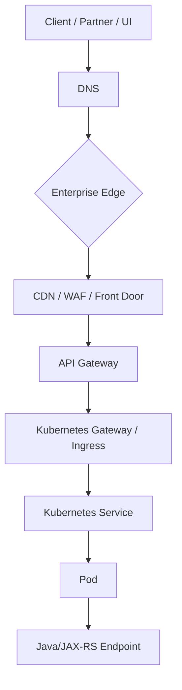
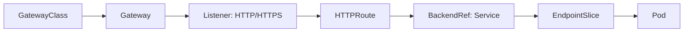
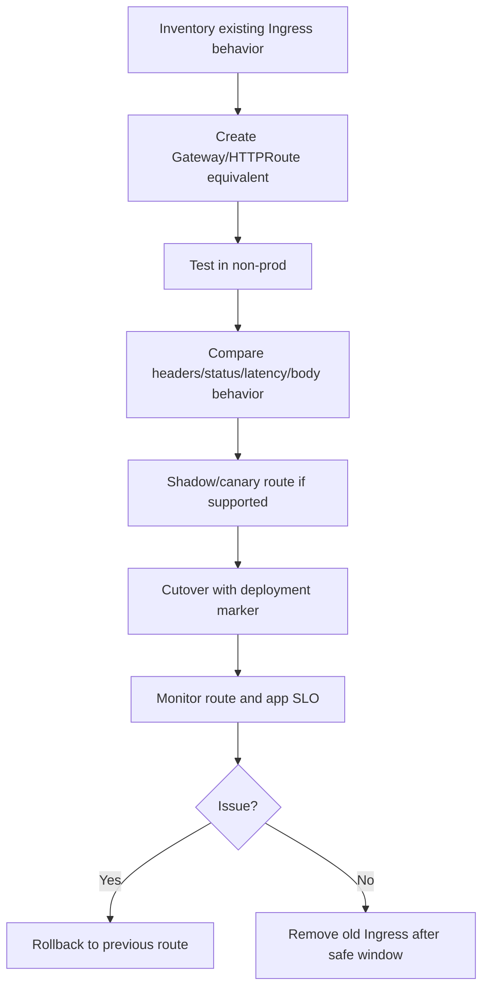
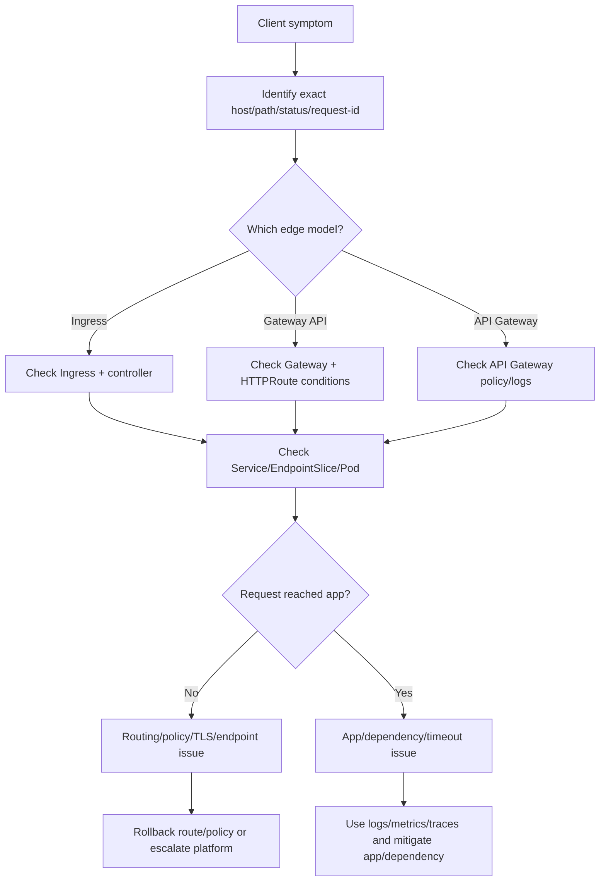

# Part 024 — Gateway API and API Gateway Awareness

Ingress cukup untuk banyak kebutuhan HTTP routing, tetapi enterprise production systems sering membutuhkan model routing yang lebih eksplisit: **route ownership**, **delegation**, **multi-team gateway**, **traffic policy**, **TLS policy**, **cross-namespace routing**, **canary**, **edge authentication**, **rate limiting**, dan integrasi dengan API Gateway atau service mesh.

Part ini bukan tutorial lengkap Gateway API. Fokusnya adalah awareness untuk senior backend engineer: bagaimana membaca layer routing modern, apa yang menjadi tanggung jawab backend service owner, apa yang dimiliki platform/SRE, dan bagaimana menghindari routing change yang menjadi incident.

Dalam konteks backend Java/JAX-RS, CPQ, quote/order lifecycle, billing integration, dan microservices, edge routing bukan detail infrastruktur murni. Routing menentukan:

- endpoint mana yang reachable;
- siapa yang boleh mengakses;
- bagaimana traffic dipisah antar versi;
- bagaimana TLS dan identity diterapkan;
- bagaimana rate limiting bekerja;
- bagaimana route internal vs external dibedakan;
- bagaimana failure terlihat sebagai 404, 403, 429, 502, 503, atau 504.

---

## 1. Why Ingress Is Not Always Enough

Kubernetes Ingress relatif sederhana: host/path ke Service. Dalam enterprise, kebutuhan sering lebih kompleks:

- banyak team berbagi gateway yang sama;
- platform ingin mengelola gateway, app team mengelola route;
- policy route harus standar;
- TLS termination dan certificate policy harus terkontrol;
- cross-namespace route delegation perlu governance;
- canary/progressive routing perlu lebih eksplisit;
- API lifecycle butuh auth, quota, productization, documentation, dan analytics;
- internal/private route berbeda dari external/public route.

Ingress bisa tetap cukup, tetapi seiring kompleksitas, organisasi sering menambahkan:

- Kubernetes Gateway API;
- API Gateway managed service;
- service mesh ingress gateway;
- NGINX/Kong/Traefik/Envoy-based gateway;
- cloud-native gateway like AWS API Gateway, Azure API Management, Application Gateway.

Backend engineer perlu mengenali model yang dipakai, bukan mengasumsikan semua route adalah Ingress biasa.

---

## 2. Routing Layer Taxonomy



Possible layers:

| Layer | Typical owner | Main concern |
|---|---|---|
| DNS | platform/network | hostname to edge/LB |
| CDN/WAF/front door | platform/security | protection, TLS, global routing |
| API Gateway | platform/API/security | auth, quota, API product, analytics |
| Gateway API / Ingress | platform + app | cluster HTTP routing |
| Service | app/platform | stable backend target |
| Pod/app | backend team | business logic and runtime health |

Operational mistake: debugging only pod logs while request is rejected at WAF/API Gateway/Gateway route.

---

## 3. Gateway API Mental Model

Gateway API separates infrastructure ownership from route ownership.

Core objects:

- `GatewayClass`: type/controller of gateway;
- `Gateway`: actual gateway instance/listener managed by infra/platform;
- `HTTPRoute`: route rules usually owned by application team;
- `ReferenceGrant`: controlled permission for cross-namespace references;
- policies: implementation-specific or standard extension points.



Operational invariant:

```text
GatewayClass must be supported by a controller.
Gateway must be accepted and programmed.
Listener must accept the route.
HTTPRoute must be attached.
BackendRef must point to a valid Service.
Service must have ready endpoints.
Policy must allow the request.
```

---

## 4. Ingress vs Gateway API vs API Gateway

| Capability | Ingress | Gateway API | API Gateway |
|---|---|---|---|
| Basic host/path routing | Yes | Yes | Yes |
| Explicit infra/app ownership split | Limited | Stronger | Strong but vendor-specific |
| Route delegation | Limited | Better | Product/policy-based |
| Cross-namespace routing governance | Limited | Better with ReferenceGrant | Vendor/policy dependent |
| API product management | No | No/limited | Yes |
| Auth/quota/rate limit | Controller-specific | Policy/controller-specific | Core capability |
| Traffic split | Controller-specific | More expressive | Often supported |
| Kubernetes-native backend | Yes | Yes | Depends |
| Enterprise API lifecycle | Limited | Limited | Stronger |

The right model depends on enterprise standards. Backend engineer should not choose based only on YAML convenience.

---

## 5. GatewayClass Operations

`GatewayClass` identifies the controller or implementation.

Safe command:

```bash
kubectl get gatewayclass
kubectl describe gatewayclass <name>
```

Failure modes:

- GatewayClass does not exist;
- controller not installed;
- GatewayClass not accepted;
- unsupported parameters;
- platform changed default gateway class;
- multiple gateway classes with unclear usage.

Backend engineer usually only needs read awareness. Platform owns GatewayClass lifecycle.

Internal verification:

- which GatewayClass is approved;
- who owns it;
- what controller implements it;
- what environments use Gateway API;
- what policies are supported.

---

## 6. Gateway Operations

`Gateway` represents an actual gateway instance with listeners.

Example conceptual shape:

```yaml
apiVersion: gateway.networking.k8s.io/v1
kind: Gateway
metadata:
  name: internal-http
  namespace: platform-gateway
spec:
  gatewayClassName: shared-gateway
  listeners:
    - name: https
      protocol: HTTPS
      port: 443
      hostname: "*.example.internal"
```

Safe commands:

```bash
kubectl get gateway -A
kubectl describe gateway <name> -n <namespace>
```

Important conditions:

- Accepted;
- Programmed;
- listener attached routes;
- resolved refs;
- certificate reference valid;
- address assigned.

Backend engineer should verify whether the intended HTTPRoute is actually attached to the expected Gateway.

---

## 7. HTTPRoute Operations

`HTTPRoute` defines route matching and backend references.

Common fields:

- parentRefs;
- hostnames;
- rules;
- matches;
- path match;
- header match;
- filters;
- backendRefs;
- weights;
- timeouts depending on implementation/policy support.

Conceptual example:

```yaml
apiVersion: gateway.networking.k8s.io/v1
kind: HTTPRoute
metadata:
  name: quote-api
  namespace: quote-prod
spec:
  parentRefs:
    - name: internal-http
      namespace: platform-gateway
  hostnames:
    - quote.example.internal
  rules:
    - matches:
        - path:
            type: PathPrefix
            value: /quote
      backendRefs:
        - name: quote-api
          port: 8080
```

Operational checks:

```bash
kubectl get httproute -A
kubectl describe httproute <name> -n <namespace>
kubectl get svc <service> -n <namespace>
kubectl get endpointslice -n <namespace> -l kubernetes.io/service-name=<service>
```

Failure modes:

- route not attached;
- hostname not allowed by listener;
- parentRef wrong;
- backendRef wrong;
- cross-namespace reference not permitted;
- filter unsupported;
- multiple routes conflict;
- backend Service has no endpoints.

---

## 8. Route Attachment and Conditions

Gateway API status conditions are critical. Do not treat object existence as success.

Useful status ideas:

```text
Accepted: controller accepts the object.
Programmed: data plane is configured.
ResolvedRefs: backend/certificate/reference resolved.
AttachedRoutes: listener has attached routes.
```

Operational invariant:

```text
A route existing in Git does not mean traffic is flowing.
A route applied to Kubernetes does not mean it is accepted.
Accepted does not always mean backend is healthy.
Backend healthy does not mean policy allows the request.
```

This is similar to Deployment desired vs actual state, but at the routing layer.

---

## 9. Route Ownership and Delegation

Gateway API is designed to make ownership more explicit.

Typical model:

- platform owns GatewayClass and Gateway;
- app team owns HTTPRoute in application namespace;
- security owns policy constraints;
- network/platform owns DNS/LB;
- API governance owns external API exposure.

Benefits:

- app team can change route without owning LB;
- platform can enforce listener/TLS policy;
- cross-namespace reference requires explicit permission;
- route status can show attachment failure.

Risks:

- app team assumes route is accepted when it is not;
- platform changes listener policy and breaks route;
- namespace delegation missing;
- route conflicts between teams;
- public/internal exposure misunderstood.

Internal verification checklist:

- who owns Gateway;
- who owns HTTPRoute;
- who approves hostname;
- who approves public exposure;
- how conflicts are detected;
- how cross-namespace references are granted.

---

## 10. ReferenceGrant and Cross-Namespace References

Gateway API can use cross-namespace references for things like route attaching to Gateway in another namespace or referencing backend/certificate in another namespace, subject to implementation and policy.

Operational risk:

- route points to backend in another namespace without permission;
- missing ReferenceGrant causes route not accepted/resolved;
- security policy forbids cross-namespace reference;
- wrong namespace in parentRef/backendRef;
- team accidentally routes traffic to another team's service.

Backend engineer should prefer same-namespace backend references unless the platform pattern explicitly allows otherwise.

Safe checks:

```bash
kubectl get referencegrant -A
kubectl describe httproute <route> -n <namespace>
```

Do not create cross-namespace permissions casually. Treat them as security-sensitive.

---

## 11. TLS Policy Awareness

TLS in Gateway API is often more structured than classic Ingress.

Concerns:

- TLS termination at Gateway;
- certificate reference;
- hostname/SNI;
- allowed certificate namespace;
- HTTP to HTTPS redirect;
- backend TLS passthrough depending on implementation;
- mTLS between edge and backend;
- certificate rotation;
- TLS version/cipher policy.

Failure modes:

- certificate not resolved;
- listener not programmed;
- host mismatch;
- SNI mismatch;
- route attached to HTTP listener instead of HTTPS;
- backend expects HTTPS but gateway sends HTTP;
- Java truststore missing internal CA.

Backend engineer should know where TLS terminates and whether pod sees HTTP or HTTPS semantics via forwarded headers.

---

## 12. Filters and Request Transformation

HTTPRoute may support filters such as:

- request header modifier;
- response header modifier;
- request redirect;
- URL rewrite;
- request mirror;
- extension filters depending on implementation.

Operational risks:

- rewrite changes JAX-RS base path;
- redirect loop;
- auth/tenant header removed;
- trace propagation broken;
- request mirroring sends sensitive data to wrong backend;
- extension filter unsupported in environment;
- response header security policy conflicts with app.

Backend engineer must review filters as production behavior, not YAML decoration.

---

## 13. Traffic Splitting and Canary Awareness

Gateway API can express weighted backendRefs in some implementations.

Conceptual example:

```yaml
backendRefs:
  - name: quote-api-stable
    port: 8080
    weight: 90
  - name: quote-api-canary
    port: 8080
    weight: 10
```

Operational concerns:

- canary and stable must be protocol-compatible;
- database schema must be backward-compatible;
- cache keys must be compatible;
- Kafka/RabbitMQ message formats must be compatible;
- sticky sessions may break expected percentage;
- low traffic routes make canary signals unreliable;
- rollback should restore weight quickly through GitOps;
- metrics must distinguish stable vs canary.

Traffic split is not a substitute for application compatibility.

---

## 14. API Gateway Awareness

API Gateway usually sits at enterprise/API management layer. It may be outside Kubernetes.

Common responsibilities:

- authentication;
- authorization;
- OAuth/OIDC validation;
- API key validation;
- tenant/client identification;
- rate limiting/quota;
- request/response transformation;
- WAF/threat protection;
- API analytics;
- developer portal;
- API versioning;
- contract enforcement;
- monetization/partner access in some domains.

Operational symptoms from API Gateway:

- 401/403 before request reaches cluster;
- 429 rate limited;
- 413 payload rejected at gateway;
- 415 media type rejected;
- schema validation rejected;
- timeout at gateway;
- request transformed before app;
- correlation ID inserted or overwritten;
- mTLS/client certificate failure.

Backend engineer must know whether an API is exposed through API Gateway, Ingress/Gateway directly, or both.

---

## 15. Edge Auth and Authorization Boundary

Enterprise routing often has multiple auth layers:

```text
Client auth -> API Gateway auth -> Gateway/Ingress policy -> App authz -> Data-level permission
```

Risk if boundary is unclear:

- app trusts headers that can be spoofed;
- gateway strips required auth context;
- internal route bypasses API Gateway;
- public route exposes endpoint expected to be internal;
- duplicate auth causes latency and inconsistent errors;
- 401/403 source is misdiagnosed.

Backend engineer questions:

- who authenticates caller;
- what identity reaches app;
- which headers are trusted;
- how tenant context is conveyed;
- whether internal calls bypass edge auth;
- whether app still enforces authorization;
- how auth failures appear in logs/metrics/traces.

---

## 16. Rate Limiting and Quota Boundary

Rate limiting can exist at:

- CDN/WAF;
- API Gateway;
- Gateway/Ingress controller;
- service mesh;
- application;
- dependency layer.

Operational rule:

```text
Rate limit belongs at the layer that has the right identity and the right blast-radius control.
```

Examples:

- per-IP limit at WAF;
- per-client ID quota at API Gateway;
- per-tenant limit in app/API Gateway;
- concurrency limit inside app;
- database pool limit as last-resort backpressure.

Failure modes:

- legitimate partner blocked by shared NAT IP;
- retry storm causes self-inflicted 429;
- route-level limit hides dependency capacity problem;
- no dashboard for rejected requests;
- app sees no traffic and team debugs wrong layer.

---

## 17. API Versioning and Route Compatibility

Gateway/API Gateway decisions affect API versioning.

Patterns:

- path versioning: `/v1/quotes`;
- header versioning;
- hostname versioning;
- route to different backend versions;
- gateway transformation between versions;
- blue-green or canary by route.

Operational risks:

- old clients route to new incompatible backend;
- route rewrite hides version from app;
- API Gateway transforms schema but app logs original assumption;
- rollback breaks clients using new contract;
- quote/order workflow spans multiple service versions;
- async messages use incompatible schema.

For CPQ/order flows, route compatibility must be coordinated with database and event compatibility.

---

## 18. Migration from Ingress to Gateway API

Migration is not just object conversion.

Migration concerns:

- host/path parity;
- TLS behavior parity;
- rewrite parity;
- timeout parity;
- body size parity;
- header forwarding parity;
- source IP behavior;
- logging format;
- metrics labels;
- alert routing;
- canary support;
- rollback path;
- DNS/LB cutover;
- client smoke tests.

Safe migration sequence:



Do not migrate routing during unrelated application release unless deliberately coordinated.

---

## 19. Observability for Gateway/API Gateway Layer

Required signals:

- request rate by host/path/route;
- status code by route;
- latency at gateway;
- upstream latency;
- auth failure rate;
- rate limit count;
- policy rejection count;
- TLS/certificate error;
- route attachment/programming status;
- backend endpoint health;
- deployment/release marker;
- trace propagation across gateway.

For incidents, dashboard should answer:

```text
Did the request reach the gateway?
Was it accepted by policy?
Was it routed to backend?
Did backend respond?
Was response changed or rejected on the way out?
```

---

## 20. Safe Investigation Commands

Gateway API commands:

```bash
kubectl get gatewayclass
kubectl get gateway -A
kubectl get httproute -A
kubectl describe gateway <gateway> -n <namespace>
kubectl describe httproute <route> -n <namespace>
kubectl get svc <service> -n <namespace>
kubectl get endpointslice -n <namespace> -l kubernetes.io/service-name=<service>
```

If using classic Ingress:

```bash
kubectl get ingress -A
kubectl describe ingress <ingress> -n <namespace>
```

If using API Gateway outside Kubernetes, Kubernetes commands are not enough. Check:

- API Gateway route config;
- deployment stage/environment;
- auth policy;
- rate limit/quota;
- backend integration target;
- gateway logs;
- gateway metrics;
- DNS and TLS config.

Use internal approved tools for cloud/API Gateway inspection.

---

## 21. Common Failure Patterns

### 21.1 Route Not Attached

Likely causes:

- wrong parentRef;
- Gateway listener does not allow namespace;
- hostname not allowed;
- Gateway not programmed;
- missing ReferenceGrant;
- unsupported route kind.

### 21.2 404 at Gateway

Likely causes:

- host/path mismatch;
- route not attached;
- old DNS points to old gateway;
- route conflict;
- rewrite mismatch.

### 21.3 403 at Edge

Likely causes:

- auth policy rejects request;
- client certificate missing;
- IP allowlist failure;
- WAF/security rule;
- route requires different scope/role.

### 21.4 429 Rate Limited

Likely causes:

- quota exceeded;
- per-IP limit hit;
- retry storm;
- client ID misclassified;
- shared NAT causing false positive.

### 21.5 502/503/504

Likely causes:

- backend Service invalid;
- no ready endpoints;
- backend protocol mismatch;
- upstream timeout;
- app/dependency latency;
- gateway integration target wrong.

---

## 22. Java/JAX-RS Service Impact

Gateway and API Gateway decisions can affect Java runtime through:

- final request path after rewrite;
- forwarded proto/host headers;
- auth context headers;
- tenant/client identity headers;
- request body size limits;
- timeout behavior;
- correlation ID insertion;
- trace propagation;
- response header modification;
- compression behavior;
- schema validation before app.

JAX-RS service owner should verify:

- base path and resource path;
- media types;
- max request size;
- idempotency for retried requests;
- error mapping consistency;
- auth context validation;
- tenant isolation;
- correlation/trace filter;
- timeout and cancellation behavior.

---

## 23. Dependency Impact

Route-layer changes can amplify dependency load:

- canary sends traffic to version with different DB query pattern;
- rate limit removed and DB pool saturates;
- timeout increased and Kafka/RabbitMQ publish waits longer;
- retry policy added upstream causes duplicate order/quote requests;
- API Gateway transformation changes payload size;
- route exposes internal batch endpoint publicly;
- traffic split sends workflow callback to incompatible version.

For quote/order systems, always connect route changes to:

- database compatibility;
- event schema compatibility;
- idempotency;
- cache compatibility;
- workflow state compatibility;
- external integration contract.

---

## 24. EKS Awareness

In AWS, possible edge/routing components:

- AWS API Gateway;
- Application Load Balancer;
- Network Load Balancer;
- AWS Load Balancer Controller;
- NGINX Ingress Controller;
- Gateway API controller implementation;
- CloudFront/WAF;
- Route 53;
- PrivateLink/VPC endpoints.

EKS-specific checks:

- does route use AWS API Gateway before cluster;
- is ALB/NLB target health green;
- are security groups allowing traffic;
- is Route 53 public/private record correct;
- does TLS terminate at CloudFront/ALB/NGINX/pod;
- are WAF/rate limit policies blocking;
- are gateway logs available;
- who owns AWS-side route config.

---

## 25. AKS Awareness

In Azure, possible edge/routing components:

- Azure API Management;
- Azure Front Door;
- Application Gateway;
- Application Gateway Ingress Controller;
- Azure Load Balancer;
- NGINX Ingress Controller;
- Gateway API controller implementation;
- Private DNS Zone;
- Private Endpoint;
- NSG/UDR.

AKS-specific checks:

- whether API goes through APIM or directly to cluster;
- Front Door/App Gateway health;
- private DNS zone linkage;
- NSG/UDR blocking;
- certificate source: Key Vault or Kubernetes Secret;
- managed identity for gateway integration;
- Azure Monitor logs/metrics;
- owner for Azure edge policy.

---

## 26. On-Prem and Hybrid Awareness

In on-prem/hybrid environments, Gateway/API Gateway may integrate with:

- corporate DNS;
- internal PKI;
- hardware/software load balancer;
- enterprise API management;
- corporate proxy;
- firewall;
- private cloud network;
- cloud private endpoint;
- split-horizon DNS.

Common pitfalls:

- route works from cluster but not from office/VPN;
- internal CA trusted by gateway but not Java app;
- proxy strips headers;
- firewall idle timeout shorter than gateway timeout;
- DNS answer differs by network location;
- partner network cannot reach private endpoint.

---

## 27. Production-Safe Debugging Flow



Evidence to capture:

- exact endpoint and environment;
- status code source if known;
- request ID/trace ID;
- timestamp;
- route object name;
- gateway/API Gateway stage;
- backend service and endpoint status;
- recent route/app deployment;
- dashboard screenshot or metric range if allowed;
- whether app logs received request.

---

## 28. Mitigation Strategy

Possible mitigations:

- rollback route change through GitOps;
- detach broken canary route;
- restore previous traffic weight;
- restore previous timeout/body/policy;
- route traffic to stable backend;
- pause API Gateway deployment/stage promotion;
- disable only the broken route if approved;
- scale backend if capacity is clearly the bottleneck and dependency can handle it;
- escalate edge/WAF/API Gateway issue with evidence.

Avoid:

- bypassing API Gateway security controls;
- exposing internal service directly;
- adding broad wildcard host/path during incident;
- disabling auth/rate limiting globally;
- changing TLS policy without security approval;
- mixing route migration with app rollback without understanding state compatibility.

---

## 29. PR Review Checklist

For Gateway/API Gateway-related PR:

- Is this Ingress, Gateway API, API Gateway, or mixed?
- Is ownership clear: platform vs app vs security?
- Is hostname approved for this environment?
- Is route public or private as intended?
- Is parentRef/Gateway correct?
- Is HTTPRoute accepted by listener policy?
- Is backendRef correct?
- Are cross-namespace references justified and approved?
- Is TLS termination clear?
- Are rewrite/header filters safe?
- Is auth boundary clear?
- Is rate limiting/quota impact understood?
- Are timeout/body limits aligned?
- Is canary/traffic split observable?
- Is rollback path defined?
- Are smoke tests covering real edge path?
- Are dashboards and alerts updated?
- Are Java/JAX-RS path/auth/header assumptions valid?

---

## 30. Architecture Decision Checklist

For choosing Ingress vs Gateway API vs API Gateway:

- Is this internal-only or external-facing?
- Does it need API product management?
- Does it need OAuth/OIDC/API key validation at edge?
- Does it need per-client quota/rate limit?
- Does it need route delegation across teams?
- Does it need traffic splitting/canary at routing layer?
- Does it need mTLS/client certificate auth?
- Does platform already standardize one model?
- Does security require WAF/API Gateway?
- Is observability available at chosen layer?
- Is rollback simple?
- Does the route affect critical CPQ/order/billing workflow?
- What is the blast radius of misconfiguration?

Decision should be captured in ADR or architecture review for critical routes.

---

## 31. Internal Verification Checklist

Verify internally:

- whether the team uses Ingress, Gateway API, API Gateway, service mesh, or a mix;
- approved GatewayClass and controller;
- Gateway namespace and owner;
- HTTPRoute ownership model;
- hostname request process;
- public/private route policy;
- TLS/certificate source;
- auth boundary;
- rate limit/quota location;
- WAF/security policy;
- cross-namespace reference policy;
- supported route filters;
- canary/progressive delivery mechanism;
- dashboard/log location for edge layer;
- incident runbook for routing failure;
- route migration process;
- rollback process through GitOps or API Gateway deployment stage.

For CSG/team context, treat all of these as internal verification items. Do not assume the cluster uses Gateway API, API Gateway, NGINX, AGIC, ALB, APIM, or any specific edge topology until verified from internal docs, manifests, dashboards, and platform/SRE/security discussions.

---

## 32. Summary

Gateway API and API Gateway awareness helps backend engineers reason beyond classic Ingress.

The core operational question is:

```text
Which routing and policy layers exist between the client and my Java/JAX-RS service,
and which layer accepted, rejected, transformed, timed out, or routed the request?
```

Senior backend engineer mastery means being able to:

- distinguish Ingress, Gateway API, and API Gateway responsibilities;
- read Gateway/HTTPRoute attachment and status conditions;
- understand route ownership and delegation;
- reason about TLS, auth, rate limit, rewrite, timeout, and traffic split;
- connect route behavior to Java/JAX-RS path/header/auth assumptions;
- avoid unsafe exposure or policy bypass;
- debug edge failures with evidence;
- review route changes before they become production incidents.

Gateway is not only networking. In enterprise systems, gateway is part of the production contract between clients, platform, security, API governance, and backend service owners.
