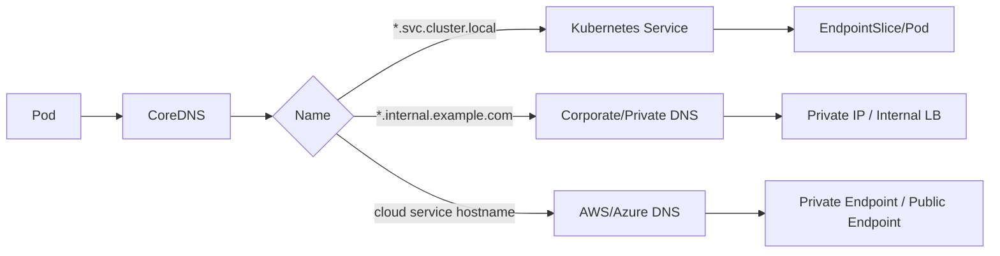
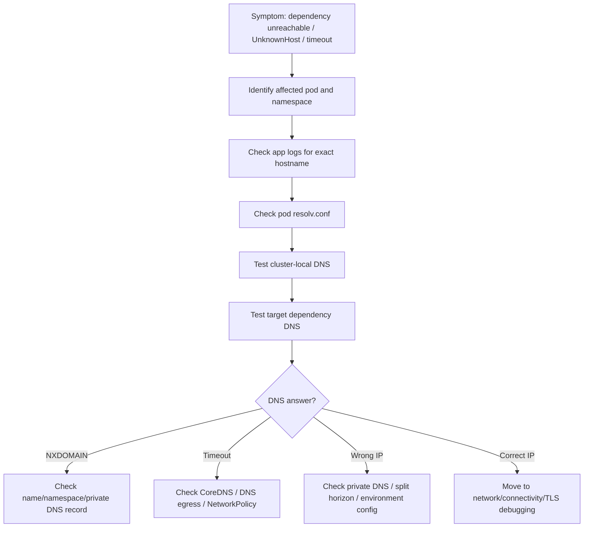

# Part 025 — DNS Operations

DNS adalah salah satu dependency paling kritis di Kubernetes, tetapi sering tidak terlihat sampai production incident terjadi.

Bagi backend engineer, DNS bukan hanya urusan platform. Setiap service Java/JAX-RS yang memanggil PostgreSQL, Kafka, RabbitMQ, Redis, Camunda, service internal, API eksternal, AWS service, Azure service, atau private endpoint pasti bergantung pada name resolution.

DNS failure bisa terlihat seperti:

- request timeout;
- connection timeout;
- broker unreachable;
- database connection failure;
- Redis connection intermittent;
- Kafka bootstrap failure;
- HTTP client `UnknownHostException`;
- TLS failure karena hostname/certificate mismatch;
- ingress route terlihat sehat tetapi backend dependency tidak reachable;
- pod sehat secara Kubernetes tetapi aplikasi gagal melayani request karena dependency tidak bisa di-resolve.

Part ini membahas DNS dari sudut pandang senior backend engineer: bagaimana resolusi nama bekerja di Kubernetes, bagaimana failure-nya muncul, bagaimana men-debug secara production-safe, dan kapan harus eskalasi ke platform/SRE/network team.

---

## 1. Core Mental Model

DNS di Kubernetes menjawab pertanyaan sederhana:

```text
Nama ini harus resolve ke IP apa, dari pod ini, di namespace ini, dengan resolver config ini?
```

Tetapi dalam production, jawaban tersebut dipengaruhi oleh banyak layer:

- nama service internal Kubernetes;
- namespace;
- search domain;
- `ndots`;
- CoreDNS;
- upstream resolver;
- corporate DNS;
- cloud private DNS;
- external DNS;
- DNS cache;
- network policy;
- egress firewall;
- proxy;
- private endpoint;
- split-horizon DNS;
- TLS hostname expectation.

DNS debugging harus selalu menjawab empat pertanyaan:

1. **Dari mana lookup dilakukan?**
2. **Nama apa yang di-resolve?**
3. **Resolver mana yang menjawab?**
4. **Jawabannya benar untuk dependency dan environment tersebut?**

---

## 2. Kubernetes DNS Resolution Flow

```mermaid
flowchart TD
    A[Java/JAX-RS Pod] --> B[/etc/resolv.conf]
    B --> C[Cluster DNS Service]
    C --> D[CoreDNS Pods]
    D --> E{Name Type}
    E -->|service.namespace.svc.cluster.local| F[Kubernetes Service / EndpointSlice]
    E -->|external domain| G[Upstream DNS Resolver]
    G --> H[Corporate DNS / Cloud DNS / Public DNS]
    H --> I[IP Address / CNAME / NXDOMAIN / Timeout]
```

Inside a pod, DNS usually uses `/etc/resolv.conf`. The nameserver typically points to the cluster DNS service IP. CoreDNS then resolves internal Kubernetes service names or forwards external names to upstream resolvers.

Operational invariant:

```text
Pod resolver config must point to working cluster DNS.
CoreDNS must be healthy.
CoreDNS must be allowed to reach upstream DNS when needed.
The queried name must exist in the expected namespace/domain.
The returned IP must be reachable from the pod.
```

---

## 3. Kubernetes Service DNS Names

A Kubernetes Service usually gets DNS names like:

```text
<service>.<namespace>.svc.cluster.local
<service>.<namespace>.svc
<service>.<namespace>
<service>
```

Example:

```text
quote-api.quote.svc.cluster.local
quote-api.quote.svc
quote-api.quote
quote-api
```

The shorter forms depend on namespace and search domain.

For backend services, avoid ambiguous assumptions. In production configs, prefer explicit names when crossing namespace boundaries:

```text
order-service.order.svc.cluster.local
```

Instead of:

```text
order-service
```

Short names are convenient, but they hide namespace dependency and can cause environment-specific bugs.

---

## 4. Pod `/etc/resolv.conf`

A pod typically has resolver config like:

```text
nameserver 10.x.x.x
search quote.svc.cluster.local svc.cluster.local cluster.local example.internal
options ndots:5
```

Important fields:

| Field | Meaning | Operational concern |
|---|---|---|
| `nameserver` | DNS server used by the pod | Usually cluster DNS Service IP |
| `search` | Domains appended to short names | Can create unexpected lookup attempts |
| `ndots` | Dots threshold before absolute lookup | Can affect latency and external lookups |
| `options` | resolver behavior | timeout/retry behavior may matter |

Safe command:

```bash
kubectl exec -n <namespace> <pod> -- cat /etc/resolv.conf
```

Production caution:

- use read-only command;
- avoid dumping environment variables if secrets may appear;
- avoid `exec` if internal policy forbids it;
- prefer ephemeral debug pod if allowed.

---

## 5. `ndots` and Search Domain Behavior

`ndots` controls whether a name is treated as absolute first or search domains are appended first.

With `ndots:5`, a name like:

```text
kafka.internal.example.com
```

may be tried with search suffixes before the final absolute query, depending on resolver behavior.

This can create:

- additional DNS queries;
- unexpected lookup latency;
- noisy CoreDNS metrics;
- unexpected queries to internal domains;
- intermittent delay under DNS pressure.

For Java services with many outbound dependency calls, DNS latency can become visible as application latency, especially when HTTP client or database driver does not cache/respect DNS in the expected way.

Backend engineer concern:

```text
Do not assume DNS lookup is free.
A dependency hostname can introduce latency before a TCP connection even starts.
```

---

## 6. Internal Service DNS vs External DNS

Internal Kubernetes service name:

```text
postgresql.database.svc.cluster.local
```

External/private service name:

```text
orders-db.prod.internal.example.com
```

Cloud service private endpoint:

```text
my-vault.vault.azure.net
my-secret.abc123.us-east-1.amazonaws.com
```

These are different operational paths.



Debugging mistake:

```text
Service DNS works, therefore all DNS works.
```

Not true. CoreDNS may resolve cluster-local names while failing to forward external/private names.

---

## 7. DNS and Java/JAX-RS Runtime

Java workloads add additional DNS considerations:

- JVM DNS cache behavior;
- HTTP client connection pool reusing old IPs;
- database pool not refreshing hostname resolution quickly;
- Kafka bootstrap DNS behavior;
- RabbitMQ connection recovery behavior;
- Redis client topology refresh behavior;
- TLS hostname validation after DNS resolution;
- long-lived connections hiding DNS changes until reconnect.

Operational implication:

```text
A DNS fix may not immediately fix a running Java process if the process cached the old resolution or keeps existing bad connections.
```

Possible mitigations depend on internal process:

- restart affected pod;
- recycle connection pool;
- force client reconnect if supported;
- rollback bad config;
- coordinate DNS/private endpoint fix with platform/network team.

Do not restart production pods blindly. First assess blast radius and replica availability.

---

## 8. DNS and Backend Dependencies

### PostgreSQL

DNS affects:

- host resolution;
- failover endpoint resolution;
- private endpoint resolution;
- read/write endpoint routing;
- TLS hostname validation.

Failure symptoms:

- connection pool startup failure;
- intermittent connection timeout;
- `UnknownHostException`;
- TLS certificate mismatch;
- connection storm after DNS recovery.

### Kafka

DNS affects:

- bootstrap server resolution;
- broker advertised listeners;
- private broker endpoint;
- cross-zone routing;
- client metadata refresh.

Important invariant:

```text
Kafka bootstrap DNS working is not enough.
The broker advertised addresses must also be resolvable and reachable from pods.
```

### RabbitMQ

DNS affects:

- broker endpoint resolution;
- cluster endpoint/load balancer resolution;
- TLS SNI;
- connection recovery.

### Redis

DNS affects:

- standalone Redis endpoint;
- Redis Sentinel names;
- Redis Cluster node addresses;
- managed Redis private endpoint.

### Camunda

DNS affects:

- Zeebe gateway endpoint if using Camunda 8 style workers;
- Camunda REST endpoint if used;
- internal workflow engine dependency;
- private endpoint and TLS.

---

## 9. DNS Failure Modes

Common DNS failure modes:

| Failure | Symptom | Likely owner |
|---|---|---|
| Wrong service name | `NXDOMAIN` | backend/app team |
| Wrong namespace | resolves wrong or not at all | backend/app team |
| Service exists but no endpoint | DNS resolves but connection fails | backend/platform depending cause |
| CoreDNS down | broad DNS failure | platform/SRE |
| CoreDNS overloaded | intermittent timeout | platform/SRE |
| NetworkPolicy blocks DNS | pod-specific timeout | app/platform/security |
| Upstream DNS unreachable | external names fail | platform/network |
| Private DNS missing | private endpoint resolves wrong | platform/cloud/network |
| Split-horizon mismatch | different answer by environment | platform/network |
| Stale Java DNS cache | app keeps old IP | backend/app team |
| DNS returns public IP instead of private IP | egress/security/cost issue | platform/cloud/network |

---

## 10. Production-Safe DNS Investigation Flow



The most important discipline:

```text
Do not stop at "DNS resolved".
Verify whether it resolved to the correct IP class for the environment.
```

For example:

- private endpoint should resolve to private IP;
- internal service should resolve to cluster IP;
- external API may resolve to public IP only if policy allows it;
- database hostname should resolve to approved endpoint.

---

## 11. Safe Commands for DNS Debugging

### Check service DNS object

```bash
kubectl get svc -n <namespace>
kubectl describe svc <service> -n <namespace>
```

### Check EndpointSlice

```bash
kubectl get endpointslice -n <namespace> -l kubernetes.io/service-name=<service>
kubectl describe endpointslice -n <namespace> -l kubernetes.io/service-name=<service>
```

### Check pod DNS config

```bash
kubectl exec -n <namespace> <pod> -- cat /etc/resolv.conf
```

### Test from an existing pod if allowed

```bash
kubectl exec -n <namespace> <pod> -- nslookup <hostname>
kubectl exec -n <namespace> <pod> -- getent hosts <hostname>
```

### Use debug pod if allowed by policy

```bash
kubectl run dns-debug \
  -n <namespace> \
  --rm -it \
  --restart=Never \
  --image=busybox:1.36 \
  -- nslookup <hostname>
```

Production caution:

- confirm debug pod creation is allowed;
- confirm image source is approved;
- remove debug pod after use;
- do not run packet capture without approval;
- do not query sensitive endpoints unnecessarily.

---

## 12. CoreDNS Operations Awareness

CoreDNS is usually owned by platform/SRE, but backend engineers should know what to observe.

Safe commands:

```bash
kubectl get pods -n kube-system -l k8s-app=kube-dns
kubectl get svc -n kube-system kube-dns
kubectl describe deployment -n kube-system coredns
```

Depending on cluster naming, labels may differ.

Useful signals:

- CoreDNS pod readiness;
- restart count;
- CPU/memory usage;
- DNS request rate;
- DNS error rate;
- DNS latency;
- upstream timeout;
- `SERVFAIL`, `NXDOMAIN`, timeout;
- recent CoreDNS config changes;
- node-local DNS cache health if used.

Backend engineer should not edit CoreDNS config directly unless explicitly responsible.

---

## 13. DNS and NetworkPolicy

A common NetworkPolicy mistake is enabling default-deny egress but forgetting DNS egress.

If egress is default-deny, pods may fail to resolve any external or even internal hostname unless DNS traffic is allowed.

Typical DNS traffic:

```text
UDP 53
TCP 53
```

DNS may target:

- kube-dns/CoreDNS service in `kube-system`;
- node-local DNS cache;
- custom resolver;
- cloud resolver;
- corporate DNS.

Operational sign:

```text
Only pods in one namespace fail DNS, while other namespaces are fine.
```

That often points to NetworkPolicy, namespace-specific egress policy, or pod label mismatch.

---

## 14. DNS and Private Endpoint

Private endpoints are a frequent enterprise failure mode.

The intended behavior is usually:

```text
cloud-service.example.com -> private IP reachable inside VNet/VPC/corporate network
```

Failure modes:

- missing private DNS zone link;
- wrong VPC/VNet association;
- public IP returned instead of private IP;
- endpoint exists but firewall denies traffic;
- cross-region/private endpoint mismatch;
- stale DNS cache after private endpoint change;
- split-horizon returns different answers from laptop vs pod.

Debugging principle:

```text
Always test DNS from inside the pod/network path that actually calls the dependency.
Your laptop result is not authoritative for the pod.
```

---

## 15. DNS and TLS

DNS resolution and TLS validation are linked.

A connection can resolve correctly but fail TLS because:

- hostname does not match certificate SAN;
- service uses internal alias not present in certificate;
- SNI is missing or wrong;
- Java truststore lacks internal CA;
- private endpoint uses provider certificate requiring correct hostname;
- ingress/backend protocol mismatch.

Example failure chain:

```text
DNS alias -> private IP -> TLS handshake -> certificate CN/SAN mismatch -> Java SSLHandshakeException
```

Do not treat TLS failure as DNS success without checking whether the hostname used is the correct hostname for certificate validation.

---

## 16. DNS and Caching

Caching can exist at multiple layers:

- application/JVM cache;
- HTTP client connection pool;
- OS resolver cache in some images;
- CoreDNS cache plugin;
- node-local DNS cache;
- upstream resolver cache;
- cloud/private DNS cache.

Operational implication:

```text
DNS record corrected does not always mean all running pods immediately use the new answer.
```

For Java, verify runtime DNS cache settings and connection reuse behavior. In many incidents, the fix requires both DNS correction and safe workload recycling.

Internal verification checklist:

- approved JVM DNS cache settings;
- whether services use long-lived connections;
- whether connection pools refresh endpoints;
- whether pod restart is required after endpoint change;
- whether DNS TTL is aligned with failover expectations.

---

## 17. DNS Observability Signals

Useful signals during incident:

| Signal | Why it matters |
|---|---|
| CoreDNS request rate | Detect query spike |
| CoreDNS error rate | Detect NXDOMAIN/SERVFAIL pattern |
| CoreDNS latency | Detect resolver slowness |
| CoreDNS CPU/memory | Detect overload |
| Pod DNS timeout logs | Identify affected workloads |
| Application `UnknownHostException` | Confirms name resolution failure |
| Dependency connection timeout | DNS may be only first layer |
| NetworkPolicy deny logs if available | Confirms policy block |
| Cloud DNS/private DNS logs if available | Confirms cloud resolver behavior |

Application dashboards should ideally show dependency failure by type:

- DNS resolution error;
- connection refused;
- connection timeout;
- TLS handshake failure;
- authentication failure;
- application-level error.

Without this classification, incidents become guesswork.

---

## 18. DNS Failure Runbook: Internal Service Name Fails

Symptom:

```text
order-service cannot call catalog-service
```

Investigation:

```bash
kubectl get svc -n catalog
kubectl describe svc catalog-service -n catalog
kubectl get endpointslice -n catalog -l kubernetes.io/service-name=catalog-service
kubectl get pods -n catalog --show-labels
```

Check:

- service exists;
- namespace correct;
- service selector matches pod labels;
- pods are ready;
- EndpointSlice has endpoints;
- NetworkPolicy allows traffic;
- client config uses correct hostname.

Likely outcomes:

- wrong namespace in config;
- renamed service;
- selector mismatch;
- pods not ready;
- service has no endpoint;
- network policy blocks traffic after DNS succeeds.

Mitigation:

- fix config if wrong;
- rollback service selector or labels if changed;
- rollback bad deployment if pods not ready;
- escalate to platform/SRE if DNS/CoreDNS broad issue.

---

## 19. DNS Failure Runbook: External Dependency Fails

Symptom:

```text
Java service logs UnknownHostException for payment-api.internal.example.com
```

Investigation:

```bash
kubectl exec -n <namespace> <pod> -- getent hosts payment-api.internal.example.com
kubectl exec -n <namespace> <pod> -- cat /etc/resolv.conf
kubectl get pods -n kube-system -l k8s-app=kube-dns
```

Check:

- exact hostname from logs/config;
- DNS result from affected pod;
- whether other pods/namespaces can resolve;
- whether name should be private/internal;
- CoreDNS health;
- NetworkPolicy egress to DNS;
- upstream/private DNS status.

Possible mitigations:

- rollback wrong hostname config;
- fix internal DNS record via platform/network team;
- allow DNS egress if policy regression;
- restart pods only if DNS cache/connection cache requires it and availability allows.

---

## 20. DNS Failure Runbook: Private Endpoint Resolves Public IP

Symptom:

```text
Pod connects to cloud service over public path or fails due to firewall.
```

Investigation:

```bash
kubectl exec -n <namespace> <pod> -- getent hosts <cloud-service-hostname>
```

Check:

- returned IP class;
- expected private endpoint IP;
- private DNS zone association;
- VPC/VNet link;
- environment-specific DNS zone;
- cloud resolver path;
- egress policy.

Mitigation:

- escalate to platform/cloud networking;
- avoid hardcoding IP as workaround;
- do not disable TLS validation;
- verify after fix from pod, not laptop.

---

## 21. DNS Debugging Decision Table

| Observation | Interpretation | Next step |
|---|---|---|
| `NXDOMAIN` for internal service | wrong service/namespace or missing service | inspect Service/namespace |
| DNS timeout only in one namespace | NetworkPolicy or namespace egress issue | inspect egress policy |
| DNS timeout cluster-wide | CoreDNS/upstream issue | escalate platform/SRE |
| resolves to ClusterIP but connection fails | DNS works; check Service endpoints/network | inspect EndpointSlice/pods |
| resolves to public IP but expected private | private DNS issue | escalate cloud/network |
| Java still connects to old IP | cache/connection reuse | evaluate safe pod recycle |
| TLS fails after DNS succeeds | certificate/SNI/truststore issue | inspect TLS path |

---

## 22. Backend Engineer Responsibility

Backend service owner should own:

- correct dependency hostname in application config;
- explicit namespace/service naming when appropriate;
- safe timeout/retry behavior for DNS/dependency failures;
- clear logs for DNS vs connection vs TLS errors;
- readiness behavior that does not create cascading outage;
- dependency dashboard showing DNS-related failures;
- avoiding hardcoded IPs;
- documenting required DNS/private endpoint dependencies.

Backend service owner should not usually own:

- CoreDNS deployment/config;
- cluster DNS service IP;
- VPC/VNet DNS resolver;
- corporate DNS;
- private DNS zone association;
- cloud endpoint provisioning;
- cluster-wide DNS cache.

But backend engineers must know enough to produce useful evidence for platform/SRE.

---

## 23. Platform/SRE Responsibility

Platform/SRE typically owns:

- CoreDNS availability;
- CoreDNS scaling and resource allocation;
- DNS forwarding configuration;
- node-local DNS cache if used;
- cluster DNS service;
- DNS observability;
- cluster-wide DNS incident response;
- DNS policy for NetworkPolicy/eBPF/CNI integration;
- coordination with cloud/network/DNS teams.

Escalate when:

- CoreDNS is unhealthy;
- many namespaces are affected;
- upstream DNS fails;
- private DNS zone is missing/wrong;
- cluster DNS latency spikes broadly;
- DNS policy is centrally managed.

---

## 24. Security and Privacy Concerns

DNS can leak sensitive operational information:

- internal service names;
- customer/tenant-specific hostnames;
- partner endpoint names;
- private infrastructure domains;
- environment names;
- cloud resource names.

Operational rules:

- do not paste full sensitive hostnames into public channels;
- avoid logging secrets in URLs;
- avoid using public DNS for private endpoints;
- verify DNS logs retention and access;
- avoid broad DNS egress if policy requires restricted egress;
- do not bypass DNS policy with hardcoded IPs.

---

## 25. Reliability Concerns

DNS reliability affects:

- service startup;
- readiness;
- dependency calls;
- autoscaling behavior;
- retry storms;
- failover time;
- traffic routing;
- incident blast radius.

Reliability practices:

- classify dependency error types;
- use sane timeouts;
- avoid infinite retries on DNS errors;
- avoid readiness checks that hard-fail on transient DNS dependency issues unless intentionally designed;
- test DNS behavior during dependency failover;
- maintain runbooks for private DNS/private endpoint issues.

---

## 26. Cost Concerns

DNS mistakes can create cost issues:

- resolving to public IP instead of private endpoint;
- NAT gateway egress for internal cloud service calls;
- repeated DNS retries under `ndots`/search domain behavior;
- excessive CoreDNS scaling due to query spike;
- high log volume from repeated `UnknownHostException`;
- retry storm to external dependency after DNS recovery.

Cost-aware DNS review asks:

```text
Should this dependency resolve privately?
Is traffic leaving the cluster/VPC/VNet unnecessarily?
Are DNS failures generating excessive logs/retries?
```

---

## 27. PR Review Checklist

When reviewing config or manifest changes involving DNS:

- Is the hostname environment-correct?
- Is namespace explicit when calling Kubernetes services across namespaces?
- Does the hostname resolve to private endpoint where required?
- Does TLS certificate match the configured hostname?
- Are timeout and retry settings safe?
- Does NetworkPolicy allow DNS egress?
- Does the service have correct selector/ports/endpoints?
- Does deployment require pod restart to pick up DNS/config change?
- Are logs safe and useful for DNS failures?
- Is rollback possible if hostname/config is wrong?

---

## 28. Operational Readiness Checklist

Before trusting a service in production:

- dependency hostnames are documented;
- internal service names use correct namespace/domain;
- external/private endpoint DNS behavior is verified from pod;
- DNS-related application errors are classified;
- CoreDNS dashboard exists or platform has one;
- NetworkPolicy allows DNS egress intentionally;
- TLS hostname and truststore are aligned;
- DNS cache/reconnect behavior is understood;
- runbook exists for `UnknownHostException`, DNS timeout, wrong IP, and private endpoint failure;
- escalation path to platform/network/cloud team is known.

---

## 29. Internal Verification Checklist

Verify internally:

- cluster DNS domain;
- CoreDNS owner and dashboard;
- CoreDNS resource sizing and alerting;
- whether node-local DNS cache is used;
- approved debug pod/image policy;
- whether `exec` is allowed in production;
- DNS egress policy under NetworkPolicy;
- standard dependency hostname patterns;
- private DNS zone ownership;
- AWS Route 53 / Azure Private DNS usage if applicable;
- private endpoint naming convention;
- Java DNS cache standard;
- expected behavior during database/broker failover;
- incident runbook for DNS and private endpoint failures.

---

## 30. Key Takeaways

DNS in Kubernetes is not just name-to-IP lookup. It is part of the production dependency path.

For backend engineers, the critical habit is to debug DNS from the affected pod, in the affected namespace, using the exact hostname from runtime config or logs.

Do not stop at DNS success. Verify:

- correct namespace;
- correct endpoint;
- correct private/public routing;
- correct TLS hostname;
- correct connectivity after DNS;
- correct ownership boundary.

The safest operational posture:

```text
Use DNS evidence to separate application config bugs, Kubernetes service discovery issues, network policy blocks, CoreDNS incidents, and cloud/private DNS failures.
```
