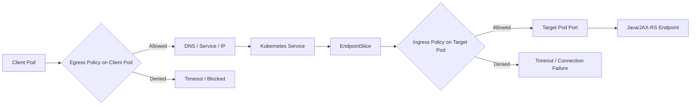
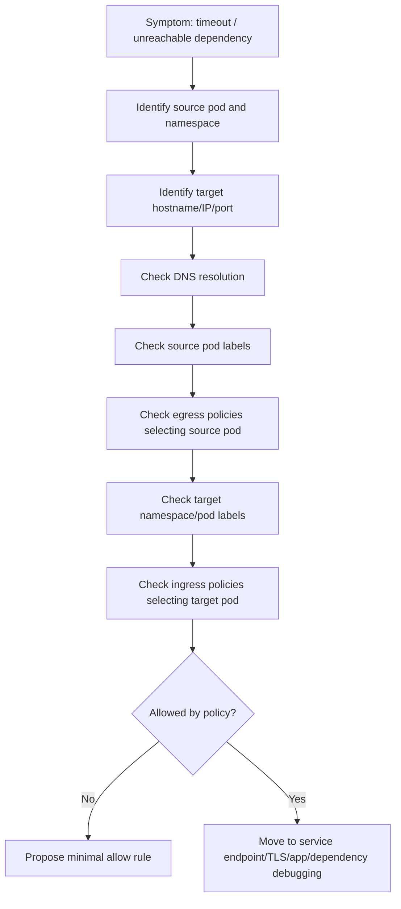

# Part 026 — NetworkPolicy Operations

NetworkPolicy adalah salah satu kontrol keamanan paling penting di Kubernetes, tetapi juga salah satu sumber incident paling membingungkan.

Bagi backend engineer, NetworkPolicy menentukan apakah pod boleh menerima traffic dan boleh keluar ke dependency seperti PostgreSQL, Kafka, RabbitMQ, Redis, Camunda, service internal, DNS, AWS service, Azure service, private endpoint, atau API eksternal.

Ketika policy salah, gejalanya sering terlihat seperti bug aplikasi:

- connection timeout;
- readiness failure;
- ingress 502/503;
- service-to-service call gagal;
- Kafka consumer tidak connect;
- RabbitMQ consumer tidak menerima pesan;
- Redis timeout;
- PostgreSQL connection pool gagal start;
- external secret sync gagal;
- cloud SDK access tampak gagal padahal network path diblokir;
- DNS lookup timeout.

Part ini fokus pada operational mental model, debugging, responsibility boundary, dan PR review untuk NetworkPolicy dalam enterprise Kubernetes environment.

---

## 1. Core Mental Model

NetworkPolicy menjawab pertanyaan:

```text
Pod mana boleh berkomunikasi dengan pod/IP/port mana, dari arah mana?
```

Ada dua arah utama:

- **Ingress policy**: traffic masuk ke pod;
- **Egress policy**: traffic keluar dari pod.

NetworkPolicy bersifat label-driven. Ia tidak memilih Service sebagai target utama, tetapi memilih pod berdasarkan label dan namespace.

Operational invariant:

```text
If a pod is selected by a NetworkPolicy for a direction, traffic in that direction becomes restricted to what the policy allows.
If no policy selects the pod for that direction, traffic in that direction is usually unrestricted by NetworkPolicy.
Actual enforcement depends on the CNI implementation.
```

Backend engineer harus memahami efek policy tanpa harus menjadi CNI expert.

---

## 2. NetworkPolicy Requires CNI Enforcement

Kubernetes NetworkPolicy adalah API. Enforcement dilakukan oleh CNI/network plugin.

Common implementations may include:

- Calico;
- Cilium;
- Antrea;
- Azure CNI policy integration;
- cloud/provider-specific network policy components;
- other enterprise CNI stacks.

Important operational rule:

```text
NetworkPolicy objects existing in the cluster does not automatically mean they are enforced unless the CNI supports and enables enforcement.
```

Internal verification is required:

- which CNI is used;
- whether NetworkPolicy is enforced;
- whether egress policy is supported;
- whether deny logs/flow logs are available;
- whether policy behavior differs by cluster/environment.

Do not assume behavior across EKS, AKS, and on-prem clusters is identical.

---

## 3. Basic NetworkPolicy Shape

Conceptual example:

```yaml
apiVersion: networking.k8s.io/v1
kind: NetworkPolicy
metadata:
  name: allow-ingress-from-nginx
  namespace: quote
spec:
  podSelector:
    matchLabels:
      app.kubernetes.io/name: quote-api
  policyTypes:
    - Ingress
  ingress:
    - from:
        - namespaceSelector:
            matchLabels:
              kubernetes.io/metadata.name: ingress-nginx
      ports:
        - protocol: TCP
          port: 8080
```

This means:

```text
For pods in namespace quote with label app.kubernetes.io/name=quote-api,
allow inbound TCP traffic to port 8080 from pods in namespace ingress-nginx.
```

It does not necessarily mean:

- all traffic is allowed;
- Service traffic is selected directly;
- DNS egress is allowed;
- dependency egress is allowed;
- other ports are allowed.

---

## 4. Default Allow vs Default Deny

By default, without NetworkPolicy selecting a pod, traffic is often allowed.

Default deny is usually implemented with policies like:

```yaml
apiVersion: networking.k8s.io/v1
kind: NetworkPolicy
metadata:
  name: default-deny-all
  namespace: quote
spec:
  podSelector: {}
  policyTypes:
    - Ingress
    - Egress
```

This selects all pods in the namespace and denies all ingress/egress unless another policy allows it.

Operational impact:

```text
A namespace that moves from default-allow to default-deny can break every dependency call unless allow policies are complete.
```

Common missing allows:

- DNS egress;
- ingress controller to app;
- app to PostgreSQL;
- app to Kafka/RabbitMQ/Redis;
- app to Camunda;
- app to external HTTP APIs;
- app to cloud metadata/identity endpoint where applicable;
- app to external secret provider path;
- app to observability collector;
- app to service mesh sidecar/control plane if used.

---

## 5. Label-Driven Policy Risk

NetworkPolicy depends heavily on labels.

A small label change can silently break traffic.

Risk examples:

- deployment label changed but policy selector not updated;
- namespace label missing in new environment;
- Helm chart changed `app` label convention;
- Kustomize overlay patches labels inconsistently;
- selector matches too many pods;
- selector matches no pods;
- default deny selects more pods than intended.

Debugging must always inspect labels:

```bash
kubectl get pods -n <namespace> --show-labels
kubectl get ns --show-labels
kubectl describe networkpolicy -n <namespace> <policy-name>
```

Operational invariant:

```text
If the labels are wrong, the policy logic is wrong even if the YAML looks reasonable.
```

---

## 6. Ingress Policy Operations

Ingress policy controls inbound traffic to selected pods.

For a Java/JAX-RS API service, inbound sources may include:

- ingress controller;
- API gateway/gateway proxy;
- internal service caller;
- batch job;
- scheduler;
- health checker;
- observability scraper;
- service mesh sidecar/proxy path if used.

Typical failure:

```text
Ingress route exists, Service has endpoints, pods are ready, but requests time out or return 502/503.
```

Possible NetworkPolicy cause:

```text
Ingress controller namespace/pod is not allowed to reach application pod port.
```

Safe investigation:

```bash
kubectl get networkpolicy -n <app-namespace>
kubectl describe networkpolicy -n <app-namespace> <policy>
kubectl get pods -n <app-namespace> --show-labels
kubectl get ns --show-labels
kubectl get pods -n <ingress-namespace> --show-labels
```

---

## 7. Egress Policy Operations

Egress policy controls outbound traffic from selected pods.

For backend services, egress is usually more complex than ingress.

A quote/order backend may need egress to:

- CoreDNS;
- PostgreSQL;
- Kafka;
- RabbitMQ;
- Redis;
- Camunda;
- internal microservices;
- external partner API;
- billing integration;
- AWS Secrets Manager/SSM/S3/SQS/SNS/etc;
- Azure Key Vault/Storage/Event Hub/etc;
- observability collector;
- proxy/NAT path.

A default-deny egress policy without complete allowlist can break production even though pod startup succeeds.

Operational invariant:

```text
Every required outbound dependency must have an intentional egress path.
```

---

## 8. DNS Egress Is Mandatory

If egress is restricted, DNS must be allowed intentionally.

Common DNS ports:

```text
UDP 53
TCP 53
```

Target may be:

- CoreDNS pods;
- kube-dns service;
- node-local DNS cache;
- custom internal resolver;
- cloud resolver;
- corporate DNS.

A common policy bug:

```text
Allow egress to database hostname/IP, but forget DNS egress.
```

Result:

```text
Database hostname cannot resolve, so connection never starts.
```

Backend symptom:

```text
java.net.UnknownHostException
or
DNS query timeout
```

This can be misdiagnosed as database outage.

---

## 9. Database Egress

For PostgreSQL, egress policy must consider:

- hostname/IP target;
- port, usually 5432 unless internal standard differs;
- private endpoint IP range;
- failover endpoint;
- read replica endpoint;
- connection pool behavior;
- DNS requirement;
- TLS requirement.

Failure modes:

- connection timeout;
- pool initialization failure;
- readiness failure if readiness checks DB;
- rollout stuck because new pods cannot become ready;
- intermittent failure after DB failover if new endpoint IP is not allowed.

PR review question:

```text
Does policy allow the dependency abstraction, or only one temporary IP that will change during failover?
```

NetworkPolicy alone may not support FQDN-based policy unless the CNI has extensions. Verify internal capability before relying on hostname-based rules.

---

## 10. Kafka Egress

Kafka egress is tricky because clients connect to bootstrap servers and then to broker advertised listeners.

Policy must allow:

- bootstrap endpoint;
- all broker endpoints advertised to clients;
- required broker ports;
- DNS for those names;
- possibly cross-zone broker IPs;
- TLS/SASL path if applicable.

Failure symptoms:

- bootstrap connection timeout;
- metadata fetch failure;
- consumer group cannot join;
- intermittent broker connection failure;
- lag increases;
- rebalance instability;
- pod restart appears to fix temporarily.

Operational invariant:

```text
Allowing only the bootstrap address may not be enough for Kafka.
```

---

## 11. RabbitMQ Egress

RabbitMQ egress concerns:

- broker endpoint;
- management endpoint if app uses it;
- AMQP port;
- TLS port;
- cluster/load balancer target;
- DNS;
- connection recovery;
- channel recovery.

Failure symptoms:

- consumer disconnected;
- queue depth rises;
- unacked messages remain high;
- connection recovery loop;
- application logs repeated connection timeout.

Policy review:

- allow broker endpoint/port;
- allow DNS;
- ensure failover endpoint remains allowed;
- avoid permitting broad egress just to fix one queue consumer.

---

## 12. Redis Egress

Redis egress concerns:

- standalone endpoint;
- Sentinel endpoints;
- cluster node endpoints;
- TLS port;
- private endpoint;
- DNS;
- topology refresh.

Failure modes:

- cache timeout;
- connection pool exhausted;
- Redis cluster redirect to blocked node;
- Sentinel failover endpoint not allowed;
- managed Redis private endpoint resolves but traffic blocked.

Backend review:

```text
If Redis cluster returns node addresses, does policy allow the actual node addresses?
```

---

## 13. Camunda Worker Egress

Camunda worker may need egress to:

- Camunda gateway;
- REST API;
- Zeebe gateway if applicable;
- Operate/Tasklist APIs if integrated;
- identity/auth endpoint;
- database/broker dependencies depending architecture.

Failure symptoms:

- worker activation fails;
- job backlog grows;
- process incidents increase;
- worker appears healthy but does no work;
- retries spike.

Policy must align with actual worker protocol and endpoint.

---

## 14. Observability Egress

Backend pods may need egress to observability components:

- OpenTelemetry Collector;
- log collector/agent path;
- metrics scraper target path;
- tracing backend;
- profiling backend;
- alerting sidecar if any.

If blocked:

- app still works but becomes blind;
- traces disappear;
- metrics missing;
- logs delayed or absent;
- incident debugging becomes harder.

Operational readiness requires observability paths to be intentionally allowed.

---

## 15. Cloud Service Egress

For EKS/AKS workloads, cloud service egress may include:

- AWS STS;
- AWS Secrets Manager;
- AWS SSM Parameter Store;
- AWS KMS;
- S3/SQS/SNS/EventBridge depending app;
- Azure AD token endpoint;
- Azure Key Vault;
- Azure Storage;
- Azure Event Hubs/Service Bus;
- Azure Monitor endpoints.

A cloud SDK error can be caused by:

- IAM/RBAC denied;
- DNS failure;
- network egress blocked;
- proxy missing;
- private endpoint DNS wrong;
- TLS trust issue.

NetworkPolicy debugging should separate network blocked from identity denied.

---

## 16. IPBlock Risk

NetworkPolicy supports `ipBlock`, but IP allowlists are risky in dynamic environments.

Risks:

- managed service IP changes;
- private endpoint recreated;
- failover changes IP;
- NAT/proxy path hides source/destination;
- cloud service uses large changing IP ranges;
- IP range too broad weakens security.

Use IPBlock carefully and verify internal standards.

Questions:

- Is this IP stable?
- Is it private endpoint IP?
- Is there a supported CNI FQDN policy extension?
- Who owns update when IP changes?
- Is there alerting for blocked traffic?

---

## 17. Service vs Pod Selection Confusion

NetworkPolicy generally selects pods, not services.

A Service routes to pods through labels and EndpointSlice. NetworkPolicy then applies at pod traffic level.

Common confusion:

```text
I allowed the Service name, why is traffic blocked?
```

Standard NetworkPolicy does not allow by Service name. Some CNIs provide extensions, but that must be verified internally.

Debugging sequence:

```text
Client pod labels -> egress policy -> DNS -> Service ClusterIP -> EndpointSlice -> target pod labels -> ingress policy -> target port
```

---

## 18. Traffic Flow with NetworkPolicy



Both sides can matter:

- source pod egress policy;
- target pod ingress policy.

When service-to-service traffic fails, inspect both namespaces.

---

## 19. Production-Safe Investigation Flow



Important:

```text
A timeout can be caused by egress deny, ingress deny, firewall deny, route issue, or dependency down.
NetworkPolicy is one layer, not the entire network.
```

---

## 20. Safe Commands for NetworkPolicy Investigation

List policies:

```bash
kubectl get networkpolicy -n <namespace>
```

Describe policy:

```bash
kubectl describe networkpolicy -n <namespace> <policy-name>
```

Inspect pod labels:

```bash
kubectl get pods -n <namespace> --show-labels
```

Inspect namespace labels:

```bash
kubectl get ns --show-labels
```

Inspect service and endpoints:

```bash
kubectl get svc -n <namespace>
kubectl get endpointslice -n <namespace> -l kubernetes.io/service-name=<service>
```

Check events if CNI emits them:

```bash
kubectl get events -n <namespace> --sort-by=.lastTimestamp
```

Check CNI-specific flow logs only if internal tooling allows it.

Avoid:

- deleting policies in production;
- applying broad allow-all as first mitigation;
- running unapproved network scanners;
- using privileged debug pods without approval;
- changing labels to bypass policy without review.

---

## 21. Test Connectivity Safely

Connectivity tests can be useful but must be controlled.

Possible tests if allowed:

```bash
kubectl exec -n <namespace> <pod> -- getent hosts <hostname>
kubectl exec -n <namespace> <pod> -- nc -vz <hostname> <port>
```

Not every container has `nc`, `curl`, or `dig`.

Debug pod approach if approved:

```bash
kubectl run net-debug \
  -n <namespace> \
  --rm -it \
  --restart=Never \
  --image=<approved-debug-image> \
  -- sh
```

Internal policy matters:

- approved images;
- allowed namespaces;
- audit logging;
- no sensitive data testing;
- no broad scans;
- cleanup after test.

---

## 22. Common Failure: DNS Blocked by Egress Policy

Symptom:

```text
Application logs UnknownHostException or DNS timeout.
```

Clue:

```text
Only pods in one namespace fail DNS after NetworkPolicy rollout.
```

Check:

```bash
kubectl get networkpolicy -n <namespace>
kubectl describe networkpolicy -n <namespace> <policy>
kubectl get pods -n kube-system -l k8s-app=kube-dns --show-labels
kubectl get ns kube-system --show-labels
```

Expected fix:

- allow UDP/TCP 53 to cluster DNS target;
- verify target selector matches actual CoreDNS/node-local DNS setup;
- keep scope minimal;
- review with platform/security.

Do not solve by allowing all egress permanently.

---

## 23. Common Failure: Ingress Controller Blocked

Symptom:

```text
Ingress route returns 502/503 or timeout, but pods are ready and service has endpoints.
```

Check:

- ingress controller namespace labels;
- ingress controller pod labels;
- target app pod labels;
- target port;
- app namespace ingress policies.

Investigation:

```bash
kubectl get pods -n <ingress-namespace> --show-labels
kubectl get pods -n <app-namespace> --show-labels
kubectl get networkpolicy -n <app-namespace>
```

Possible cause:

```text
Target pods are selected by default-deny ingress, but no policy allows ingress controller traffic.
```

Mitigation:

- add specific allow from ingress controller namespace/pods to app port;
- verify with platform owner if ingress namespace labels are stable.

---

## 24. Common Failure: Service-to-Service Traffic Blocked

Symptom:

```text
quote-api cannot call order-api.
```

Need inspect both sides:

- source namespace egress policies;
- source pod labels;
- target namespace ingress policies;
- target pod labels;
- target service endpoints;
- port/protocol;
- DNS.

Decision table:

| Check | If failing | Likely action |
|---|---|---|
| DNS | cannot resolve | allow DNS / fix name |
| Source egress | target not allowed | add minimal egress |
| Target ingress | source not allowed | add minimal ingress |
| Service endpoint | empty | fix readiness/selector |
| Port | wrong | fix service/policy/app config |
| TLS | handshake fail | inspect cert/truststore |

---

## 25. Common Failure: Kafka Works in One Env, Fails in Another

Possible causes:

- different namespace labels;
- different broker DNS/IP;
- missing broker advertised listener egress;
- default deny only enabled in one environment;
- private endpoint differs by environment;
- CNI policy implementation differs;
- Kustomize/Helm overlay omitted policy.

Investigation:

- compare rendered policy across environments;
- compare source pod labels;
- compare namespace labels;
- compare broker hostnames and ports;
- verify all advertised brokers are allowed;
- check lag and consumer logs.

Operational lesson:

```text
Policy must be environment-aware without becoming environment-fragile.
```

---

## 26. NetworkPolicy and Rollout Safety

Changing NetworkPolicy can be as dangerous as changing application code.

Rollout safety practices:

- apply in lower environment first;
- test DNS, ingress, service-to-service, DB, broker, cache, secret provider, and observability paths;
- add deployment marker for policy changes;
- monitor error rate, latency, dependency failures, and DNS errors;
- coordinate with platform/security;
- avoid Friday/peak-time policy cutovers;
- keep rollback plan.

Rollback can mean:

- revert policy manifest through GitOps;
- restore previous namespace labels;
- restore previous pod labels;
- restore previous route/port config.

Do not manually delete policy in GitOps-managed clusters unless emergency process allows it.

---

## 27. NetworkPolicy and GitOps Drift

In GitOps environments, manual policy changes may be reverted automatically.

Failure pattern:

```text
Engineer patches NetworkPolicy manually during incident.
Traffic works briefly.
GitOps reconciles old policy.
Traffic breaks again.
```

Operational rule:

```text
If GitOps owns NetworkPolicy, emergency changes must be reconciled with Git as soon as possible.
```

Internal verification:

- which repo owns policies;
- who approves policy changes;
- how emergency changes are handled;
- how policy drift is detected;
- how rollback is performed.

---

## 28. NetworkPolicy and Java/JAX-RS Service Behavior

NetworkPolicy failures often surface in Java as:

- `ConnectTimeoutException`;
- `SocketTimeoutException`;
- `UnknownHostException` if DNS blocked;
- database pool initialization failure;
- Kafka client metadata timeout;
- RabbitMQ connection recovery loop;
- Redis command timeout;
- Camunda worker activation failure;
- readiness endpoint returning unhealthy if dependency check is strict.

Application should log dependency name, error type, and correlation context without exposing secrets.

Bad log:

```text
Dependency error
```

Better log:

```text
Dependency connection timeout: dependency=postgresql-write endpoint=db-prod.internal port=5432 operation=pool-init
```

Do not log passwords, full secret URLs, or tokens.

---

## 29. Observability Signals

Useful signals:

| Signal | Why it matters |
|---|---|
| Dependency connection timeout | Strong signal for network path issue |
| DNS error rate | Detect DNS egress block |
| Ingress 502/503 | May indicate ingress-to-pod block |
| Kafka lag | Consumer cannot reach broker or process messages |
| RabbitMQ queue depth | Consumer disconnected or blocked |
| Redis timeout | Cache/network issue |
| DB pool active/waiting | DB connectivity or pool exhaustion |
| CNI flow logs | Confirms allow/deny if available |
| NetworkPolicy audit/dry-run reports | Confirms policy impact if tool exists |

If CNI provides Hubble/flow logs/policy verdicts or equivalent, they are powerful evidence. Verify internal tooling rather than assuming availability.

---

## 30. Mitigation Strategy

Safe mitigation hierarchy:

1. Identify exact source, target, port, and protocol.
2. Confirm whether DNS works.
3. Confirm source egress policy.
4. Confirm target ingress policy.
5. Propose minimal allow rule.
6. Apply through approved pipeline/GitOps when possible.
7. Monitor dependency recovery.
8. Capture evidence for RCA.

Avoid high-risk mitigations:

- broad allow-all egress;
- deleting default-deny policy permanently;
- using `0.0.0.0/0` as quick fix without approval;
- changing workload labels to escape policy;
- bypassing private endpoint through public internet;
- disabling TLS to test connectivity.

Emergency broadening may be acceptable only under incident command and must be time-bound, documented, and reverted.

---

## 31. When to Rollback

Rollback policy change when:

- policy rollout caused broad service outage;
- multiple dependencies became unreachable;
- ingress path is blocked for customer-facing APIs;
- DNS egress was blocked accidentally;
- GitOps policy change cannot be fixed quickly;
- policy intent is unclear and blast radius is growing.

Do not rollback blindly if:

- policy blocked malicious/unapproved path;
- security team intentionally enforced a control;
- rollback would expose sensitive dependency broadly;
- a minimal allow rule can safely restore service.

Decision requires balancing availability and security.

---

## 32. When to Escalate

Escalate to platform/SRE when:

- CNI behavior is unclear;
- policy appears correct but traffic still blocked;
- cluster-wide policy/controller issue suspected;
- CNI flow logs required;
- NetworkPolicy behavior differs across clusters;
- default-deny baseline changed centrally.

Escalate to security when:

- broad egress is requested;
- sensitive dependency access is involved;
- policy exception is needed;
- production data path changes;
- compliance boundary may be impacted.

Escalate to network/cloud team when:

- traffic leaves cluster to VPC/VNet/firewall/private endpoint;
- NSG/security group/firewall may block traffic;
- private endpoint route is involved;
- NAT/proxy path is involved.

---

## 33. EKS-Specific Awareness

On EKS, NetworkPolicy behavior depends on CNI and add-ons used.

Things to verify internally:

- whether AWS VPC CNI NetworkPolicy support is enabled or another CNI like Calico/Cilium is used;
- whether security groups for pods are used;
- whether pod egress goes through NAT gateway, VPC endpoint, proxy, or security group path;
- whether DNS target is CoreDNS or node-local DNS;
- whether AWS service calls use VPC endpoints;
- whether flow logs are available.

EKS-specific failure examples:

- security group denies traffic even though NetworkPolicy allows it;
- NetworkPolicy denies traffic even though security group allows it;
- VPC endpoint DNS resolves but egress policy blocks endpoint IP;
- STS/Secrets Manager access fails due to network path, not IAM.

---

## 34. AKS-Specific Awareness

On AKS, behavior depends on network plugin and policy engine.

Things to verify internally:

- Azure CNI mode;
- network policy provider;
- NSG/UDR interaction;
- private cluster/private endpoint setup;
- Azure Private DNS Zone linking;
- Key Vault CSI network path;
- Azure Monitor/logging path;
- Application Gateway or Azure Load Balancer path.

AKS-specific failure examples:

- NetworkPolicy allows but NSG blocks;
- NSG allows but NetworkPolicy blocks;
- private endpoint DNS works but UDR/firewall blocks;
- Key Vault access fails due to egress block rather than identity.

---

## 35. On-Prem/Hybrid Awareness

In on-prem/hybrid Kubernetes, policy interacts with:

- corporate firewall;
- proxy;
- internal DNS;
- internal CA;
- air-gapped registry;
- on-prem load balancer;
- private routes to cloud;
- VPN/ExpressRoute/Direct Connect;
- network segmentation.

NetworkPolicy may only control pod-level traffic inside the cluster. Traffic can still be blocked outside the cluster.

Debugging must map:

```text
Pod egress -> CNI policy -> node network -> firewall/proxy -> corporate route -> dependency
```

---

## 36. Security Concerns

NetworkPolicy is part of zero-trust posture.

Security goals:

- reduce lateral movement;
- restrict dependency access;
- isolate namespaces/teams;
- protect database/broker/cache;
- restrict external egress;
- enforce environment boundaries;
- support compliance evidence.

Bad patterns:

- one broad allow-all policy for all apps;
- `0.0.0.0/0` egress by default;
- namespace labels nobody owns;
- policy exceptions not documented;
- app teams changing labels to bypass controls;
- no visibility into blocked traffic;
- no runbook for policy-induced outage.

---

## 37. Reliability Concerns

NetworkPolicy improves security but can hurt reliability if unmanaged.

Reliability risks:

- missing dependency allowlist;
- policy drift between environments;
- label drift;
- rollout breaks ingress;
- Kafka/RabbitMQ broker failover to blocked address;
- private endpoint IP changes;
- DNS egress omitted;
- observability blocked;
- emergency rollback impossible due to GitOps/process.

Reliability practice:

```text
Treat NetworkPolicy changes as production code changes with tests, rollout, observability, and rollback.
```

---

## 38. Cost Concerns

NetworkPolicy can also affect cost indirectly:

- forcing traffic through NAT instead of private endpoint;
- blocking private endpoint and causing public retry path if fallback exists;
- excessive retries/logs during blocked traffic;
- over-scaling consumers because broker access is blocked and lag rises;
- debugging overhead during unclear network incidents.

Cost-aware review:

- is egress path private where expected?
- does policy force traffic through expensive path?
- do blocked retries generate log/metric cost?
- does event scaling react to network-blocked backlog incorrectly?

---

## 39. PR Review Checklist

When reviewing NetworkPolicy changes:

- Which pods are selected?
- Are selectors based on stable labels?
- Does policy introduce default deny?
- Is DNS egress allowed?
- Are ingress controller/API gateway sources allowed?
- Are required service-to-service paths allowed?
- Are PostgreSQL/Kafka/RabbitMQ/Redis/Camunda paths allowed?
- Are cloud secret/identity endpoints reachable if needed?
- Are observability paths preserved?
- Is policy environment-specific or portable?
- Does it rely on unstable IPs?
- Is there a rollback path?
- Is security approval needed?
- Are CNI-specific extensions used intentionally?
- Is rendered Helm/Kustomize output reviewed?

---

## 40. Operational Readiness Checklist

Before enabling or tightening NetworkPolicy for a workload:

- workload dependencies are documented;
- source and target labels are stable;
- namespace labels are standardized;
- DNS egress is allowed;
- ingress path from gateway/ingress controller is allowed;
- database/broker/cache/workflow endpoints are allowed;
- cloud secret/identity paths are allowed;
- observability paths are allowed;
- lower environment test covers all key calls;
- dashboard/alerts can detect policy-induced failure;
- rollback process is known;
- security/platform owners reviewed.

---

## 41. Internal Verification Checklist

Verify internally:

- CNI implementation;
- whether NetworkPolicy is enforced;
- whether egress policy is supported;
- default deny baseline per namespace;
- label standards for pods and namespaces;
- approved policy templates;
- GitOps repo owning policies;
- emergency change process;
- CNI flow log or policy verdict tooling;
- DNS target and DNS egress standard;
- ingress controller namespace labels;
- standard dependency egress patterns;
- EKS/AKS/on-prem differences;
- security exception process;
- policy testing approach in CI/CD;
- runbook for blocked traffic incidents.

---

## 42. Key Takeaways

NetworkPolicy is not just security YAML. It is an operational contract for every network path a backend workload needs.

For senior backend engineers, the key skill is to reason from source pod to target dependency:

```text
source pod labels -> egress policy -> DNS -> route/service -> target ingress policy -> target port -> application/dependency behavior
```

The most common production mistakes are:

- forgetting DNS egress;
- selecting wrong pods due to label drift;
- blocking ingress controller traffic;
- allowing Kafka bootstrap but not broker advertised listeners;
- relying on unstable IPBlock rules;
- treating NetworkPolicy change as low-risk config;
- lacking rollback and observability.

A good NetworkPolicy posture is strict enough to reduce blast radius, but explicit enough that production services remain operable, observable, and recoverable.
