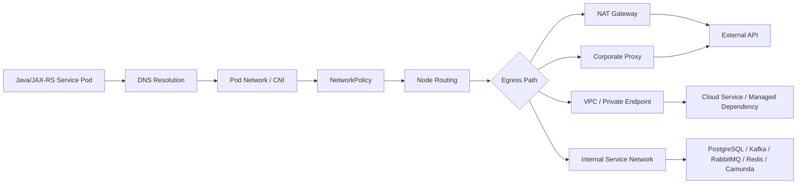
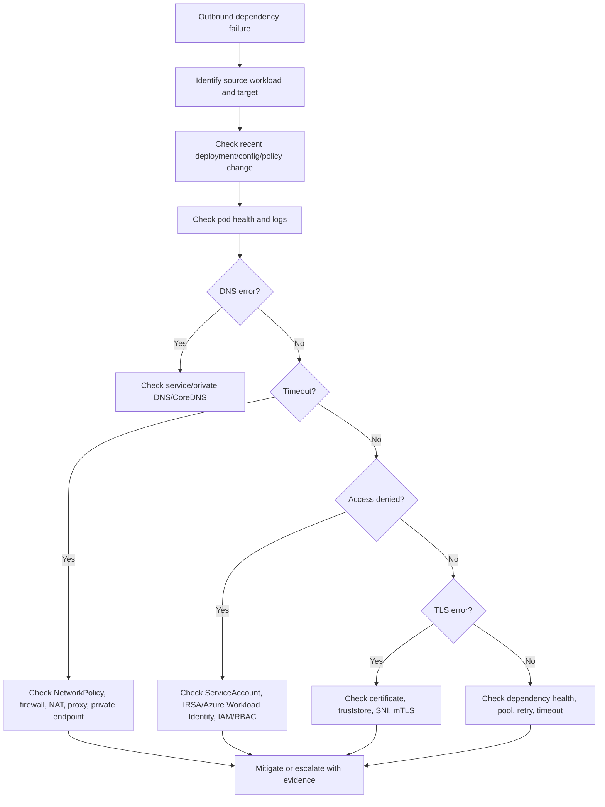

# Part 027 — Egress Operations

Egress adalah jalur keluar dari pod menuju dependency di luar pod tersebut.

Untuk backend engineer, egress bukan sekadar "aplikasi bisa connect atau tidak". Egress menentukan apakah Java/JAX-RS service dapat menjangkau PostgreSQL, Kafka, RabbitMQ, Redis, Camunda, internal HTTP service, cloud API, secret provider, observability collector, payment/billing integration, DNS resolver, dan endpoint enterprise lain.

Dalam incident, egress failure sering terlihat seperti masalah aplikasi:

- connection timeout;
- connection refused;
- DNS lookup timeout;
- TLS handshake failure;
- Kafka consumer tidak join group;
- RabbitMQ consumer tidak consume;
- Redis timeout;
- PostgreSQL pool tidak start;
- external secret tidak sync;
- AWS/Azure SDK access gagal;
- readiness probe gagal karena dependency check;
- retry storm;
- queue lag naik;
- ingress 504 karena downstream call lambat.

Part ini membahas cara berpikir, men-debug, mereview, dan menjaga outbound connectivity workload Kubernetes secara production-safe.

---

## 1. Core Mental Model

Egress menjawab pertanyaan:

```text
Dari pod ini, traffic keluar menuju dependency mana, melalui jalur apa, dikontrol oleh policy apa, dan diamati dengan sinyal apa?
```

Jalur egress biasanya melibatkan beberapa layer:

```text
application client
  -> container network namespace
  -> pod IP
  -> CNI routing
  -> NetworkPolicy / security policy
  -> node routing
  -> NAT / proxy / firewall / private endpoint
  -> DNS / service discovery
  -> target dependency
```

Operational invariant:

```text
Aplikasi yang sama dapat berhasil di satu environment dan gagal di environment lain karena egress path berbeda, meskipun image dan manifest workload terlihat sama.
```

Backend engineer tidak harus menjadi cloud network engineer, tetapi harus mampu membuktikan:

- target apa yang dicoba diakses;
- hostname/IP/port/protocol apa yang digunakan;
- apakah DNS resolve benar;
- apakah traffic diblokir NetworkPolicy/firewall/proxy;
- apakah jalur private/public sesuai ekspektasi;
- apakah failure berasal dari network, identity, TLS, dependency, atau application client.

---

## 2. End-to-End Egress Flow

Diagram sederhana:



Saat debugging, jangan langsung lompat ke aplikasi. Telusuri flow ini dari kiri ke kanan.

---

## 3. Common Egress Targets for Backend Workloads

Dalam sistem enterprise CPQ/quote/order/billing, target egress umum meliputi:

- PostgreSQL;
- Kafka broker;
- RabbitMQ broker;
- Redis cluster;
- Camunda engine / Zeebe gateway / workflow API;
- internal HTTP microservices;
- NGINX/API gateway internal;
- AWS services seperti Secrets Manager, SSM, S3, STS, KMS, CloudWatch;
- Azure services seperti Key Vault, Storage, Service Bus, Event Hubs, Monitor;
- external billing/payment/CRM/provisioning APIs;
- observability collectors;
- corporate proxy;
- DNS resolver;
- identity/token endpoints;
- license server or vendor endpoint if used.

Internal verification is mandatory. Jangan mengarang dependency list.

---

## 4. Backend Engineer Responsibility

Backend service owner bertanggung jawab untuk:

- mendokumentasikan dependency hostname, port, protocol, dan purpose;
- memastikan aplikasi memakai timeout dan retry yang sehat;
- memastikan readiness tidak terlalu bergantung pada dependency optional;
- memahami pool size dan replica impact;
- menyediakan metrics/logs/traces untuk outbound calls;
- memastikan config endpoint tidak hardcoded;
- mereview perubahan manifest yang memengaruhi egress;
- memberi evidence saat eskalasi ke platform/SRE/network/security.

Backend engineer biasanya tidak bertanggung jawab langsung untuk:

- mengubah route table cloud;
- membuat NAT gateway;
- mengubah firewall enterprise;
- membuat private endpoint;
- mengubah CNI config;
- mengubah cluster-wide egress gateway;
- membuka allowlist production tanpa approval.

---

## 5. Platform/SRE/Network/Security Responsibility

Platform/SRE/network/security biasanya memiliki responsibility untuk:

- CNI behavior;
- node routing;
- NAT gateway;
- private endpoint;
- firewall;
- corporate proxy;
- egress gateway;
- DNS resolver;
- cloud networking;
- security group / NSG;
- central NetworkPolicy standards;
- flow logs;
- allowlist approval;
- cluster-level outage response.

Escalation yang baik harus membawa bukti, bukan hanya "service cannot connect".

Useful evidence:

- source namespace/pod;
- target hostname/IP/port;
- timestamp;
- error type;
- DNS result;
- NetworkPolicy involved;
- logs/traces;
- recent deployment/config change;
- affected environment;
- whether other pods/services are affected.

---

## 6. Egress Path Types

### 6.1 Direct Private Network

Pod menjangkau dependency melalui network private:

```text
pod -> node -> VPC/VNet/private subnet -> private dependency
```

Biasanya dipakai untuk:

- managed PostgreSQL private endpoint;
- internal Kafka/RabbitMQ/Redis;
- internal HTTP services;
- on-prem connectivity.

Risk:

- DNS resolve ke public IP;
- route missing;
- firewall deny;
- private endpoint DNS misconfigured;
- subnet/NSG/security group block.

### 6.2 NAT Gateway

Pod keluar ke internet atau public cloud endpoint melalui NAT.

Risk:

- NAT cost tinggi;
- NAT port exhaustion;
- public egress exposure;
- allowlist membutuhkan NAT public IP;
- cross-zone routing cost;
- dependency outage terlihat sebagai timeout.

### 6.3 Corporate Proxy

Pod harus memakai HTTP/HTTPS proxy untuk outbound internet.

Risk:

- `HTTP_PROXY`/`HTTPS_PROXY` tidak diset;
- `NO_PROXY` salah;
- Java runtime tidak membaca env proxy sesuai library;
- proxy melakukan TLS inspection;
- proxy blocked domain;
- proxy auth expired;
- internal calls ikut lewat proxy karena `NO_PROXY` kurang lengkap.

### 6.4 Private Endpoint / VPC Endpoint

Pod menjangkau cloud service melalui private endpoint.

Risk:

- DNS zone salah;
- endpoint policy deny;
- security group/NSG deny;
- SDK region salah;
- fallback ke public endpoint tidak diinginkan;
- private endpoint belum dibuat di environment tertentu.

---

## 7. NAT Gateway Operational Concerns

NAT gateway sering invisible bagi backend engineer, tetapi dampaknya besar.

Operational concerns:

- public IP NAT dipakai untuk allowlist vendor;
- NAT bisa menjadi bottleneck outbound;
- NAT cost bisa tinggi;
- NAT port exhaustion dapat menyebabkan intermittent timeout;
- multi-AZ NAT design memengaruhi availability dan cost;
- route table salah bisa membuat pod tidak bisa keluar.

Symptoms of NAT-related issue:

- outbound HTTP timeout ke banyak external targets;
- intermittent connection reset;
- hanya beberapa node/AZ yang terdampak;
- spike retry/log volume;
- external vendor melihat source IP berubah atau tidak dikenal.

Backend-safe investigation:

```bash
kubectl get pod -n <namespace> -o wide
kubectl logs -n <namespace> <pod> --since=30m
kubectl describe pod -n <namespace> <pod>
```

Then correlate with platform/network team using:

- node name;
- pod IP;
- target host;
- target port;
- timestamp;
- affected AZ/node pool if known.

---

## 8. Proxy and NO_PROXY Operations

Proxy configuration is dangerous because it is often environment-dependent.

Common environment variables:

```text
HTTP_PROXY
HTTPS_PROXY
NO_PROXY
http_proxy
https_proxy
no_proxy
```

`NO_PROXY` must usually include internal destinations such as:

- `localhost`;
- `127.0.0.1`;
- Kubernetes service DNS suffix;
- cluster domain;
- internal service domains;
- private endpoint domains;
- metadata/identity endpoints if applicable;
- observability collector if internal;
- database/broker private domains if not intended through proxy.

Example conceptual config:

```yaml
env:
  - name: HTTPS_PROXY
    valueFrom:
      configMapKeyRef:
        name: quote-api-network-config
        key: httpsProxy
  - name: NO_PROXY
    valueFrom:
      configMapKeyRef:
        name: quote-api-network-config
        key: noProxy
```

Operational risk:

```text
A wrong NO_PROXY value can route internal dependency traffic through corporate proxy, causing timeout, TLS interception issues, or policy denial.
```

For Java apps, also verify whether the HTTP client uses:

- environment variables;
- JVM properties;
- framework-specific proxy config;
- Apache HttpClient config;
- OkHttp config;
- Netty config;
- cloud SDK proxy config.

---

## 9. Firewall and Egress Allowlist

Enterprise environments often restrict outbound traffic with firewall/allowlists.

Allowlist must be precise:

- source environment;
- source namespace/workload if supported;
- NAT public IP or private source range;
- destination hostname/IP/CIDR;
- destination port;
- protocol;
- business justification;
- owner;
- expiry/review date.

Backend engineer should not ask for broad allowlist like:

```text
Allow all outbound from namespace quote to internet.
```

Better request:

```text
Allow quote-api production pods to reach billing-gateway.internal.example on TCP 443 for quote finalization workflow.
```

Internal verification checklist should confirm exact process and approval boundary.

---

## 10. Private Endpoint Operations

Private endpoint is common for managed cloud services.

Examples:

- AWS VPC Endpoint for AWS APIs;
- AWS PrivateLink for vendor/internal service;
- Azure Private Endpoint for Key Vault, Storage, SQL, Event Hubs, etc.;
- private endpoint for managed PostgreSQL, Redis, or messaging service.

Debugging private endpoint requires checking both DNS and network path.

Important questions:

- Does hostname resolve to private IP?
- Is the private DNS zone linked to the right VPC/VNet?
- Is the pod/node subnet allowed?
- Is security group/NSG permitting traffic?
- Is endpoint policy allowing action/resource?
- Is SDK using the intended region/endpoint?
- Is the dependency accepting TLS hostname/SNI?

Common failure:

```text
DNS resolves to public IP in lower environment but private IP in production, causing behavior difference.
```

---

## 11. DNS and Egress Are Coupled

Egress debugging must include DNS.

A timeout may be caused by:

- DNS blocked by NetworkPolicy;
- CoreDNS unhealthy;
- private DNS zone missing;
- wrong search domain;
- external DNS not reachable;
- DNS cache stale;
- service name wrong;
- private endpoint hostname resolving public.

Backend-safe commands may include:

```bash
kubectl get svc -n kube-system
kubectl get pods -n kube-system -l k8s-app=kube-dns
kubectl describe pod -n <namespace> <pod>
```

Interactive DNS checks from a pod require production policy approval. Do not assume `kubectl exec` is allowed.

If allowed:

```bash
kubectl exec -n <namespace> <pod> -- nslookup <target-host>
kubectl exec -n <namespace> <pod> -- getent hosts <target-host>
```

Safer alternative in many enterprises: use approved diagnostic pod/runbook owned by platform/SRE.

---

## 12. NetworkPolicy and Egress

Egress can be blocked by NetworkPolicy before traffic reaches NAT/proxy/private endpoint.

Common missing egress rules:

- DNS TCP/UDP 53;
- PostgreSQL port;
- Kafka broker ports;
- RabbitMQ AMQP/TLS ports;
- Redis port;
- Camunda/Zeebe ports;
- HTTP/HTTPS dependency ports;
- cloud secret provider endpoint;
- identity/token endpoint;
- observability collector;
- proxy endpoint.

Operational invariant:

```text
If default deny egress is enabled, every dependency path must be explicitly allowed.
```

For broker systems, allowlisting only bootstrap endpoint may not be enough. Kafka clients may receive broker addresses via metadata and then connect to multiple broker endpoints.

---

## 13. Egress and Java/JAX-RS Services

Java/JAX-RS service egress depends on application runtime behavior:

- HTTP client connection pool;
- DNS cache TTL;
- JVM proxy settings;
- TLS truststore;
- retry policy;
- circuit breaker;
- dependency timeout;
- thread pool capacity;
- connection pool max size;
- SDK credential chain;
- async client event loop.

A network issue can amplify into application issue:

```text
egress timeout -> blocked threads -> pool exhaustion -> readiness failure -> pod removed from endpoints -> ingress 503/504
```

Production-safe design:

- bounded timeouts;
- bounded retries;
- jittered backoff;
- circuit breaker for optional dependency;
- bulkhead per dependency;
- clear outbound metrics;
- dependency-specific logging with correlation ID;
- avoid dependency checks in liveness probe.

---

## 14. Egress to PostgreSQL

PostgreSQL egress failure symptoms:

- connection pool cannot initialize;
- timeout acquiring connection;
- `Connection refused`;
- TLS certificate error;
- authentication failure;
- readiness failure;
- spike in HTTP 5xx;
- database connection saturation during rollout.

Operational checks:

- hostname and port;
- DNS resolution;
- NetworkPolicy egress;
- firewall/security group/NSG;
- private endpoint;
- TLS mode and truststore;
- DB max connections;
- pool size per pod;
- replica count and surge behavior.

Do not treat all DB connection failures as egress failures. Authentication, TLS, schema, pool exhaustion, and database outage have different mitigations.

---

## 15. Egress to Kafka

Kafka egress is special because clients do not only connect to one endpoint.

Important operational concerns:

- bootstrap server DNS;
- advertised listeners;
- broker ports;
- TLS/SASL config;
- NetworkPolicy allowing all broker endpoints;
- firewall allowing all broker endpoints;
- consumer group rebalance during network instability;
- lag increase;
- duplicate processing risk after reconnect;
- connection storm after outage.

Failure mode:

```text
Bootstrap server is reachable, but advertised broker address is blocked or not resolvable from the pod.
```

Backend checklist:

- confirm bootstrap config;
- confirm observed broker address from logs if available;
- check lag dashboard;
- check rebalance logs;
- check retry/backoff;
- avoid scaling aggressively before verifying network path.

---

## 16. Egress to RabbitMQ

RabbitMQ egress concerns:

- AMQP port / AMQPS port;
- TLS cert trust;
- vhost and credential;
- connection/channel lifecycle;
- heartbeat timeout;
- queue depth;
- unacked messages;
- retry and DLQ behavior;
- broker failover address.

Network instability can produce:

- repeated reconnect;
- redelivery spike;
- unacked messages;
- consumer count drop;
- queue depth growth;
- duplicate processing if idempotency is weak.

---

## 17. Egress to Redis

Redis egress concerns:

- standalone vs cluster mode;
- TLS mode;
- sentinel/cluster discovery;
- primary/replica failover;
- connection pool;
- DNS/private endpoint;
- NetworkPolicy/firewall;
- timeout and retry behavior.

Cluster mode can require access to multiple node endpoints. Do not assume a single hostname/port is enough if the client follows cluster redirects.

---

## 18. Egress to Camunda / Workflow Runtime

Camunda-related egress may include:

- engine REST API;
- Zeebe gateway;
- Operate/Tasklist APIs if used;
- worker polling/activation endpoint;
- authentication endpoint;
- database/broker dependency behind the workflow runtime.

Failure can appear as:

- no jobs activated;
- incident spike;
- worker timeout;
- process stuck;
- correlation failure;
- retry storm.

Backend engineer should correlate:

- worker logs;
- job activation metrics;
- process incident metrics;
- dependency network path;
- recent rollout/config changes.

---

## 19. Egress to Cloud APIs

Cloud SDK access may fail because of:

- network path blocked;
- DNS wrong;
- proxy not configured;
- private endpoint missing;
- identity token unavailable;
- IAM/RBAC permission denied;
- region/endpoint config wrong;
- TLS truststore issue.

Do not conflate:

```text
Network timeout != access denied != credential not found != TLS trust failure
```

Error classification matters.

For AWS:

- STS;
- Secrets Manager;
- SSM Parameter Store;
- S3;
- KMS;
- CloudWatch;
- ECR.

For Azure:

- Key Vault;
- Azure Storage;
- Service Bus/Event Hubs;
- Azure Monitor;
- ACR;
- Managed Identity/Federated token endpoints.

---

## 20. Egress Cost Awareness

Egress path can materially affect cost.

Cost drivers:

- NAT gateway processing cost;
- cross-AZ traffic;
- public internet egress;
- private endpoint hourly/data cost;
- log explosion during retry storm;
- metrics/cardinality growth;
- scaling consumers due to backlog caused by network denial;
- keeping duplicate blue/green environments active.

Cost-aware question:

```text
Is this workload reaching dependency through the intended private and local path, or through a more expensive public/NAT path?
```

Do not optimize cost by bypassing security controls. Cost optimization must respect reliability and compliance.

---

## 21. Egress Failure Taxonomy

Classify egress failure before mitigation.

| Failure Type | Common Symptom | Likely Owner |
|---|---|---|
| DNS failure | unknown host, lookup timeout | app/platform/network |
| NetworkPolicy deny | timeout from selected pod only | app/platform/security |
| Firewall deny | timeout across workloads/env | network/security |
| Proxy misconfig | external HTTP fails, internal path weird | app/platform/network |
| NAT issue | many external calls timeout | platform/network/cloud |
| Private endpoint DNS | resolves public/wrong IP | platform/network/cloud |
| TLS trust issue | certificate path/hostname error | app/platform/security |
| Identity issue | access denied/credential missing | app/platform/security |
| Dependency outage | dependency health degraded | dependency owner |
| Client pool exhaustion | app threads/pools saturated | backend owner |

---

## 22. Safe Investigation Workflow

Start with symptom and scope.

```text
1. What dependency call is failing?
2. Which workload/pod/namespace is affected?
3. Is it all replicas or one pod/node/AZ?
4. Did it start after deployment/config/network policy change?
5. Is DNS resolution correct?
6. Is NetworkPolicy allowing egress?
7. Is proxy/NAT/private endpoint involved?
8. Is TLS/identity involved?
9. Is dependency healthy?
10. What mitigation is safest?
```

Production-safe commands:

```bash
kubectl get pods -n <namespace> -o wide
kubectl describe pod -n <namespace> <pod>
kubectl logs -n <namespace> <pod> --since=30m
kubectl get networkpolicy -n <namespace>
kubectl describe networkpolicy -n <namespace> <policy-name>
kubectl get configmap -n <namespace>
kubectl get secret -n <namespace>
kubectl get events -n <namespace> --sort-by=.lastTimestamp
```

Be careful with:

- `kubectl exec` in production;
- printing env vars containing secrets;
- dumping full config;
- running network scans;
- creating ad-hoc debug pods;
- changing NetworkPolicy manually under GitOps;
- bypassing proxy or firewall.

---

## 23. Debugging Flow



---

## 24. Observability Signals

For egress incidents, useful signals include:

Application:

- outbound request latency by dependency;
- outbound error count by dependency;
- timeout count;
- retry count;
- circuit breaker state;
- connection pool usage;
- thread pool saturation;
- dependency-specific logs;
- trace spans.

Kubernetes:

- pod restarts;
- readiness failures;
- events;
- NetworkPolicy changes;
- config/secret changes;
- node/AZ placement.

Platform/cloud:

- NAT gateway metrics;
- firewall deny logs;
- VPC/VNet flow logs;
- private endpoint health;
- proxy logs;
- DNS resolver logs;
- load balancer target health;
- cloud service audit logs.

---

## 25. Mitigation Patterns

Safe mitigation depends on failure type.

Possible mitigations:

- rollback recent app/config/NetworkPolicy change;
- restore previous ConfigMap/Secret version through GitOps;
- reduce outbound concurrency;
- increase timeout only if justified and bounded;
- disable non-critical integration via feature flag;
- fail fast for optional dependency;
- pause consumer if dependency is down;
- scale down workers to reduce retry storm;
- ask platform/security to restore allowlist;
- switch to known-good private endpoint config;
- route through approved proxy path.

Unsafe mitigations:

- opening `0.0.0.0/0` egress broadly;
- disabling NetworkPolicy wholesale;
- hardcoding IPs without approval;
- bypassing proxy/security controls;
- removing TLS validation;
- increasing retries aggressively;
- scaling consumers while dependency path is blocked.

---

## 26. Rollback Decision

Rollback is appropriate when:

- egress failure started after deployment/config change;
- NetworkPolicy change blocked dependency;
- proxy/NO_PROXY config changed incorrectly;
- endpoint hostname/port changed incorrectly;
- new image introduced SDK/client config issue;
- failure impacts critical workflow and rollback is compatible.

Rollback may not help when:

- NAT gateway is degraded;
- firewall changed outside app repo;
- cloud private endpoint broke;
- dependency is down;
- DNS platform issue affects many services;
- external vendor changed allowlist.

Operational rule:

```text
Rollback application changes when the evidence points to application-owned egress configuration. Escalate platform/network/security when the evidence points outside the workload boundary.
```

---

## 27. EKS-Specific Egress Awareness

In EKS, verify internally:

- VPC CNI behavior;
- pod IP allocation from subnet;
- subnet route table;
- NAT gateway path;
- security group rules;
- security groups for pods if used;
- VPC endpoints;
- AWS PrivateLink;
- Route 53 private hosted zones;
- AWS Load Balancer Controller path;
- IRSA access to AWS APIs;
- CloudWatch/VPC flow logs availability.

Common EKS issues:

- subnet IP exhaustion;
- VPC endpoint DNS disabled;
- security group denies pod/node;
- NAT gateway route missing;
- private hosted zone not associated;
- IRSA error misread as network error.

---

## 28. AKS-Specific Egress Awareness

In AKS, verify internally:

- Azure CNI mode;
- VNet/subnet design;
- NSG rules;
- UDR route table;
- Azure Firewall path;
- NAT Gateway/Outbound type;
- Private Endpoint;
- Private DNS Zone link;
- Application Gateway path if used;
- Azure Workload Identity;
- Azure Monitor/network logs.

Common AKS issues:

- NSG/UDR blocking traffic;
- private DNS zone not linked;
- Azure Firewall deny;
- outbound type mismatch;
- Key Vault private endpoint DNS issue;
- managed identity/access denied misclassified as egress failure.

---

## 29. On-Prem and Hybrid Egress Awareness

On-prem/hybrid egress usually adds:

- corporate DNS;
- internal CA;
- firewall zones;
- proxy requirements;
- air-gapped registry;
- internal load balancer;
- VPN/Direct Connect/ExpressRoute;
- NAT between network zones;
- vendor allowlist;
- packet inspection.

Failure mode:

```text
Service works in cloud-only dev environment but fails in hybrid production due to corporate DNS, proxy, or firewall path.
```

Backend engineer should document actual environment differences instead of assuming uniform Kubernetes behavior.

---

## 30. Security and Privacy Concerns

Egress controls reduce blast radius.

Security concerns:

- broad outbound internet access;
- data exfiltration risk;
- bypassing proxy inspection;
- secrets sent to wrong endpoint;
- TLS validation disabled;
- logs exposing target credentials or payload;
- debug commands revealing environment variables;
- ad-hoc curl to sensitive endpoints;
- unreviewed firewall exceptions.

Privacy concerns:

- PII sent to external dependency;
- logging request payload during failure;
- traces containing sensitive identifiers;
- proxy logs containing URLs with sensitive query strings.

Operational discipline:

```text
Debug connectivity without dumping secrets or sensitive payloads.
```

---

## 31. PR Review Checklist

When reviewing Kubernetes/application changes that affect egress:

- Are new dependencies documented?
- Is hostname/port/protocol explicit?
- Is DNS path known?
- Does NetworkPolicy allow required egress only?
- Does proxy/NO_PROXY config include internal domains?
- Is private endpoint expected?
- Does config differ by environment?
- Are timeout/retry settings bounded?
- Is connection pool sizing safe for replica count?
- Is TLS truststore/keystore impacted?
- Is workload identity needed?
- Are observability metrics/logs/traces available?
- Is rollback path clear?
- Is security/network approval required?
- Is cost impact understood?

---

## 32. Operational Readiness Checklist

Before production release:

- dependency map exists;
- egress target list is reviewed;
- network policy is rendered and reviewed;
- proxy/NO_PROXY config is validated;
- private endpoint DNS is verified;
- timeouts/retries are bounded;
- connection pool sizing accounts for replicas and surge;
- observability includes outbound dependency metrics;
- dashboard shows dependency latency/error;
- alert covers critical dependency failure;
- runbook includes egress debugging flow;
- escalation path to platform/network/security is known.

---

## 33. Internal Verification Checklist

Verify internally:

- approved egress architecture per environment;
- whether outbound internet is allowed;
- NAT gateway design and owner;
- proxy requirement and standard env variables;
- required NO_PROXY baseline;
- firewall/allowlist request process;
- private endpoint/VPC endpoint standards;
- DNS resolver and private DNS ownership;
- NetworkPolicy default deny baseline;
- CNI/network policy implementation;
- EKS-specific egress path;
- AKS-specific egress path;
- on-prem/hybrid egress path;
- flow log availability;
- proxy/firewall log access process;
- cost allocation labels for egress-related resources;
- incident runbook for dependency connectivity failure.

---

## 34. Key Takeaways

Egress is the operational contract between a backend workload and the outside world.

For senior backend engineers, the critical skill is not memorizing network commands. The critical skill is tracing failure through the layers:

```text
application client -> DNS -> pod/CNI -> NetworkPolicy -> proxy/NAT/private endpoint -> firewall -> dependency -> TLS/identity -> application behavior
```

Most egress incidents become long because teams skip classification. Timeout, DNS failure, TLS failure, access denied, connection refused, and dependency outage require different owners and different mitigations.

A production-ready backend service must declare its outbound dependencies, use bounded timeouts/retries, expose dependency observability, and provide enough evidence for safe escalation.
