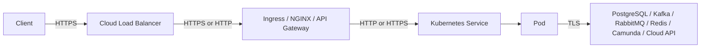
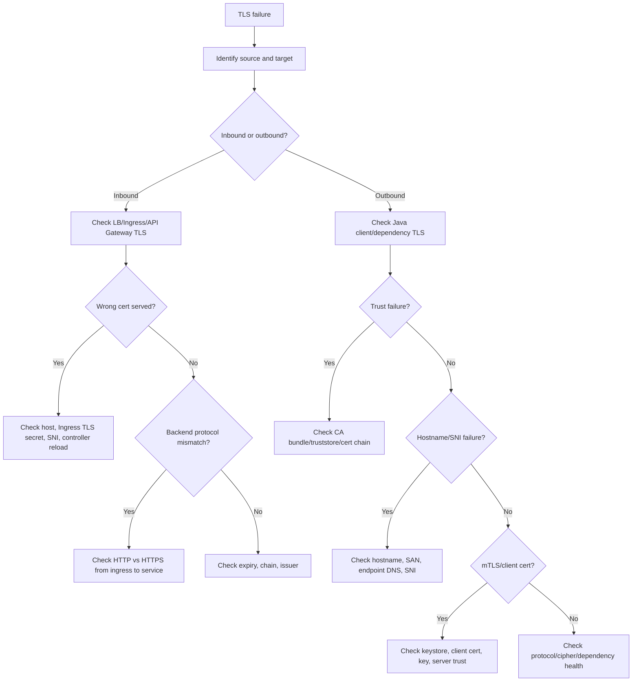

# Part 028 — TLS and Certificate Operations

TLS adalah salah satu area operasi yang sering terlihat sederhana sampai production incident terjadi.

Bagi backend engineer, TLS/certificate operations menentukan apakah traffic antara client, ingress, service, pod, database, broker, Redis, Camunda, cloud service, dan external API dapat dipercaya, terenkripsi, dan diverifikasi dengan benar.

Failure TLS sering muncul sebagai:

- ingress 502/503/504;
- Java `SSLHandshakeException`;
- `PKIX path building failed`;
- hostname verification failed;
- certificate expired;
- unknown CA;
- wrong certificate served;
- SNI mismatch;
- mTLS client cert missing;
- Kafka/RabbitMQ/PostgreSQL TLS connection failure;
- readiness failure karena dependency TLS error;
- cloud SDK error yang terlihat seperti network failure.

Part ini membahas mental model, debugging, ownership boundary, Java-specific concerns, dependency-specific concerns, dan production-safe checklist untuk TLS di Kubernetes.

---

## 1. Core Mental Model

TLS menjawab tiga pertanyaan:

```text
1. Apakah koneksi terenkripsi?
2. Apakah server yang dihubungi benar?
3. Jika mTLS digunakan, apakah client juga terbukti identitasnya?
```

Certificate operations melibatkan:

- certificate;
- private key;
- certificate chain;
- root/intermediate CA;
- truststore;
- keystore;
- hostname/SAN;
- SNI;
- expiry;
- rotation;
- Secret mount;
- application reload/restart;
- ingress/backend protocol alignment.

Operational invariant:

```text
A TLS error is not one error class. It can come from certificate identity, trust chain, hostname, protocol, client certificate, key mismatch, expiry, or runtime reload behavior.
```

---

## 2. TLS Traffic Flow Patterns in Kubernetes

Common patterns:

```text
Client -> Cloud LB -> Ingress Controller -> Service -> Pod
```

TLS may terminate at different points:

1. **At cloud load balancer**
2. **At ingress controller / NGINX**
3. **At API gateway**
4. **At service mesh sidecar**
5. **At application pod**
6. **End-to-end TLS from client/gateway to backend pod**

Diagram:



Key operational question:

```text
Where is TLS terminated, where is it re-encrypted, and which component owns each certificate?
```

---

## 3. Backend Engineer Responsibility

Backend engineer should understand and own:

- application TLS client configuration;
- Java truststore/keystore usage;
- dependency TLS mode;
- hostname verification behavior;
- mTLS client certificate usage if required;
- config source for certificate paths/passwords;
- safe logging of TLS errors;
- readiness behavior when TLS dependency fails;
- certificate reload/restart requirement;
- PR review for application-owned TLS config.

Backend engineer usually does not own directly:

- cluster ingress controller certificate lifecycle;
- cloud load balancer TLS policy;
- enterprise root CA issuance;
- cert-manager cluster issuer;
- service mesh CA;
- private key governance;
- firewall/NAT path;
- external vendor certificate issuance.

But backend engineer must know who owns them.

---

## 4. Platform/SRE/Security Responsibility

Platform/SRE/security commonly own:

- ingress TLS standard;
- certificate issuer integration;
- cert-manager or equivalent;
- Secret distribution policy;
- service mesh mTLS policy;
- internal CA bundle distribution;
- certificate expiry alerts;
- rotation runbook;
- TLS policy/cipher standard;
- audit/compliance evidence;
- emergency certificate replacement process.

Escalation should include:

- source workload;
- target endpoint;
- exact TLS error;
- certificate subject/SAN if safely available;
- expiration timestamp if known;
- truststore/keystore config source;
- timestamp;
- recent cert/config/deployment changes.

---

## 5. Certificate Anatomy

A certificate contains identity and validity information.

Important fields:

- Subject;
- Subject Alternative Name/SAN;
- Issuer;
- Not Before;
- Not After;
- Key Usage;
- Extended Key Usage;
- Public key;
- Signature algorithm;
- chain/intermediate CA.

Modern hostname validation relies on SAN, not merely CN.

Operational invariant:

```text
If the hostname used by the client is not present in the certificate SAN, Java hostname verification should fail.
```

---

## 6. Kubernetes TLS Secret

A typical TLS Secret:

```yaml
apiVersion: v1
kind: Secret
metadata:
  name: quote-api-tls
  namespace: quote
  annotations:
    cert-manager.io/issuer: internal-ca
type: kubernetes.io/tls
data:
  tls.crt: <base64>
  tls.key: <base64>
```

Operational caution:

- do not print decoded private keys;
- do not paste secret data into chat/tickets;
- do not copy TLS secrets across namespaces manually;
- do not edit production secrets by hand if GitOps/external secrets own them;
- do not assume secret update automatically reloads every consuming component.

Safe metadata checks:

```bash
kubectl get secret -n <namespace> <secret-name>
kubectl describe secret -n <namespace> <secret-name>
```

These show metadata and keys, not decoded secret values.

---

## 7. Ingress TLS Operations

Ingress TLS commonly maps hostname to TLS Secret.

Example conceptual Ingress:

```yaml
apiVersion: networking.k8s.io/v1
kind: Ingress
metadata:
  name: quote-api
  namespace: quote
spec:
  tls:
    - hosts:
        - quote-api.example.internal
      secretName: quote-api-tls
  rules:
    - host: quote-api.example.internal
      http:
        paths:
          - path: /
            pathType: Prefix
            backend:
              service:
                name: quote-api
                port:
                  number: 8080
```

Common failure modes:

- TLS secret missing;
- secret in wrong namespace;
- cert SAN does not include host;
- expired certificate;
- wrong IngressClass/controller;
- controller did not reload;
- default certificate served;
- TLS terminates at LB but ingress expects TLS;
- ingress sends HTTP to backend expecting HTTPS, or vice versa.

---

## 8. Backend Protocol Alignment

Ingress/backend protocol mismatch is a classic source of 502.

Examples:

```text
Ingress -> backend over HTTP, but backend port expects HTTPS.
Ingress -> backend over HTTPS, but backend port expects HTTP.
```

NGINX ingress may require annotation or service config depending on implementation.

Operational review:

- What protocol does the backend container port expect?
- What protocol does Service targetPort expose?
- What protocol does ingress/controller use to reach Service?
- Does application terminate TLS itself?
- Does app server require client cert?
- Are health checks using correct scheme?

Backend engineer should ensure application port/protocol is documented.

---

## 9. Java Truststore and Keystore

Java TLS uses truststore and keystore concepts.

Truststore:

```text
Which certificates/CA does this Java process trust?
```

Keystore:

```text
Which certificate/private key does this Java process present as its own identity?
```

Common Java properties:

```text
javax.net.ssl.trustStore
javax.net.ssl.trustStorePassword
javax.net.ssl.trustStoreType
javax.net.ssl.keyStore
javax.net.ssl.keyStorePassword
javax.net.ssl.keyStoreType
```

In modern apps, TLS may also be configured by framework/client libraries rather than only JVM system properties.

Verify:

- app server TLS config;
- HTTP client TLS config;
- Kafka client truststore/keystore;
- RabbitMQ client TLS config;
- PostgreSQL JDBC SSL config;
- Redis client TLS config;
- AWS/Azure SDK trust behavior;
- mounted certificate path;
- password source;
- reload/restart behavior.

---

## 10. `PKIX path building failed`

This Java error usually means the server certificate chain is not trusted by the Java truststore.

Common causes:

- internal CA not imported;
- intermediate CA missing;
- wrong truststore path;
- mounted truststore not readable;
- truststore password wrong;
- application still using default JVM cacerts;
- certificate chain served incomplete;
- proxy TLS inspection certificate not trusted;
- dependency rotated certificate to a new CA.

Operational response:

1. identify target endpoint;
2. verify certificate chain if allowed;
3. verify truststore source;
4. check recent cert rotation;
5. check whether pod restarted after truststore update;
6. escalate to security/platform if CA bundle ownership is external.

Do not disable certificate validation to "fix" this.

---

## 11. Hostname Verification Failure

Hostname verification failure occurs when the certificate identity does not match the hostname used by the client.

Example:

```text
Client connects to db.internal.example
Certificate SAN only contains db.prod.internal.example
```

Common causes:

- using IP address instead of DNS name;
- using Kubernetes service DNS but cert issued for external DNS;
- private endpoint DNS alias mismatch;
- wildcard certificate does not cover requested depth;
- wrong certificate attached to ingress;
- vendor changed certificate hostname.

Mitigation:

- use correct DNS name;
- issue certificate with correct SAN;
- align private endpoint DNS;
- do not disable hostname verification in production.

---

## 12. SNI Operations

SNI allows the client to indicate the hostname during TLS handshake.

Without correct SNI, server/gateway may present the wrong certificate.

Common SNI issues:

- client connects by IP;
- old library does not send SNI;
- proxy strips/misroutes SNI;
- ingress gateway has multiple hosts but wrong default cert;
- private endpoint or service mesh expects specific SNI;
- Kafka/RabbitMQ TLS endpoint requires expected server name.

Operational symptom:

```text
Certificate shown by server is valid but for a different hostname.
```

---

## 13. Certificate Expiry Operations

Expired certificates are preventable incidents.

Required operational controls:

- expiry dashboard;
- alert before expiry;
- owner metadata;
- automated renewal where possible;
- rotation runbook;
- post-renewal verification;
- dependency owner communication;
- rollback/reissue procedure.

Certificate expiry can break:

- ingress public/internal traffic;
- mTLS service-to-service traffic;
- database/broker TLS;
- cloud private endpoint TLS;
- webhook/admission controllers;
- CI/CD image registry access;
- external secret provider.

Backend service owner should know whether any application-owned truststore/keystore has expiry risk.

---

## 14. Certificate Rotation

Secret update does not always mean application reload.

Rotation behavior depends on consumer:

- ingress controller may watch Secret and reload;
- application may need restart;
- JVM may load truststore only at startup;
- some clients can reload dynamically;
- mounted volume updates may not be picked up by app;
- env var based secrets require pod restart;
- external secret sync may lag.

Operational invariant:

```text
Certificate rotation is not complete until the consuming component has actually loaded the new certificate and traffic has been verified.
```

Checklist:

- new cert issued;
- Secret updated;
- consumer reload/restart confirmed;
- old cert no longer served;
- clients trust new chain;
- expiry alert cleared;
- rollback path exists.

---

## 15. cert-manager Awareness

Many clusters use cert-manager or similar automation.

Objects may include:

- Certificate;
- Issuer;
- ClusterIssuer;
- CertificateRequest;
- Secret;
- ACME challenge objects if applicable.

Backend engineer should be able to read status, not necessarily operate issuer internals.

Safe checks:

```bash
kubectl get certificate -n <namespace>
kubectl describe certificate -n <namespace> <certificate-name>
kubectl get certificaterequest -n <namespace>
kubectl describe certificaterequest -n <namespace> <name>
```

Common failure modes:

- issuer unavailable;
- approval missing;
- DNS challenge failed;
- HTTP challenge blocked by ingress;
- Secret not created;
- certificate not ready;
- renewal stuck;
- rate limit.

Internal verification required: whether cert-manager is used and who owns issuers.

---

## 16. Secret-Mounted Certificates

Applications may consume certificates through mounted Secrets.

Example conceptual mount:

```yaml
volumes:
  - name: tls-material
    secret:
      secretName: quote-api-client-cert
containers:
  - name: quote-api
    volumeMounts:
      - name: tls-material
        mountPath: /etc/tls/client
        readOnly: true
```

Operational concerns:

- file path matches app config;
- file permissions;
- non-root user can read files;
- private key protected;
- password stored safely;
- app reload behavior;
- Secret rotation sync delay;
- old pod still using old certificate;
- debug commands must not print key material.

---

## 17. mTLS Operations

mTLS means both server and client authenticate with certificates.

Used for:

- service-to-service identity;
- API gateway to backend;
- backend to broker/database;
- service mesh;
- partner/vendor integration;
- high-security internal APIs.

mTLS adds failure modes:

- client certificate missing;
- client private key mismatch;
- client cert expired;
- client cert not trusted by server;
- wrong client identity/SAN;
- server requires cert but client does not send one;
- server/client disagree on TLS protocol/cipher;
- service mesh policy blocks plaintext traffic.

Operational question:

```text
Is this connection one-way TLS or mutual TLS?
```

Do not assume HTTPS implies mTLS.

---

## 18. Service Mesh TLS Awareness

If service mesh is used, TLS may be transparent to application.

Possible components:

- sidecar proxy;
- control plane;
- workload identity certificate;
- mTLS policy;
- destination rule/traffic policy;
- certificate rotation managed by mesh.

Backend engineer should verify internally:

- whether mesh is present;
- whether mTLS is strict/permissive/disabled;
- whether app sees plaintext locally while sidecar encrypts outbound;
- whether probes bypass sidecar;
- whether dependency traffic goes through mesh;
- who owns mesh policy.

Do not apply non-mesh assumptions to mesh-enabled workloads.

---

## 19. TLS to PostgreSQL

PostgreSQL TLS concerns:

- `sslmode`;
- root CA certificate;
- hostname verification depending on mode;
- client certificate if mTLS/client auth used;
- JDBC driver configuration;
- managed database certificate rotation;
- private endpoint DNS;
- truststore path.

Common symptoms:

- JDBC connection fails at startup;
- pool cannot initialize;
- `PKIX path building failed`;
- hostname mismatch;
- auth failure after TLS success;
- readiness failure.

Do not confuse TLS failure with database credential failure.

---

## 20. TLS to Kafka

Kafka TLS can involve:

- truststore;
- keystore;
- SASL_SSL;
- broker certificate SAN;
- advertised listeners;
- client auth;
- broker CA rotation;
- hostname verification.

Common issue:

```text
Bootstrap endpoint certificate works, but advertised broker endpoint certificate or DNS does not match what the client connects to.
```

Operational checks:

- bootstrap server list;
- advertised broker hostnames;
- truststore/keystore config;
- security protocol;
- SASL config if used;
- consumer logs;
- broker/client compatibility.

---

## 21. TLS to RabbitMQ

RabbitMQ TLS concerns:

- AMQPS port;
- truststore/CA;
- client cert if required;
- hostname verification;
- vhost/auth after TLS;
- heartbeat behavior during TLS/network instability;
- broker certificate rotation.

Symptoms:

- connection handshake failure;
- repeated reconnect;
- consumer count drops;
- queue depth grows;
- redelivery increases.

---

## 22. TLS to Redis

Redis TLS concerns:

- TLS enabled endpoint;
- cluster mode redirects;
- hostname verification;
- managed Redis CA;
- client library TLS config;
- truststore;
- certificate rotation.

Cluster mode may require trusting and connecting to multiple node hostnames.

---

## 23. TLS to Camunda / Workflow Dependencies

Camunda/workflow TLS concerns may include:

- REST API HTTPS;
- Zeebe gateway TLS;
- OAuth/token endpoint TLS;
- worker client truststore;
- mTLS if enforced;
- workflow engine certificate rotation;
- process/task API hostname mismatch.

Failure can surface as worker inactivity or workflow incidents rather than obvious TLS alert.

---

## 24. TLS and Cloud Services

Cloud services rotate certificates and use public or private CA chains.

AWS/Azure SDKs normally use standard trust roots unless configured otherwise. Enterprise proxy/TLS inspection can change that.

Possible failure causes:

- custom JVM truststore missing public CA roots;
- corporate proxy CA missing;
- private endpoint hostname mismatch;
- SDK endpoint override wrong;
- outdated base image CA bundle;
- FIPS/TLS policy mismatch;
- clock skew causing certificate validity failure.

Backend image hygiene matters: base image CA bundle must be maintained.

---

## 25. Time and Clock Skew

TLS certificate validation depends on time.

If node or container sees incorrect time, errors may include:

- certificate not yet valid;
- certificate expired;
- token validation failure;
- mTLS identity failure.

Backend engineer usually escalates node time issues to platform/SRE, but should recognize the symptom.

---

## 26. Safe TLS Investigation Workflow

Start with classification:

```text
1. Which connection fails?
2. Is it inbound or outbound?
3. Is TLS terminated at LB, ingress, mesh, app, or dependency?
4. Is error trust chain, hostname, expiry, SNI, protocol, or client cert?
5. Was there recent certificate/config/deployment change?
6. Does failure affect all pods or subset?
7. Does it affect one environment or many?
8. Is rollback or cert reissue safer?
```

Safe commands:

```bash
kubectl get ingress -n <namespace>
kubectl describe ingress -n <namespace> <ingress-name>
kubectl get secret -n <namespace> <tls-secret>
kubectl describe secret -n <namespace> <tls-secret>
kubectl get events -n <namespace> --sort-by=.lastTimestamp
kubectl logs -n <namespace> <pod> --since=30m
```

If cert-manager is used:

```bash
kubectl get certificate -n <namespace>
kubectl describe certificate -n <namespace> <certificate-name>
```

Be careful with:

- decoding TLS secret data;
- printing private keys;
- exporting keystores;
- sharing truststore passwords;
- disabling validation;
- using ad-hoc debug pods without approval.

---

## 27. TLS Debugging Flow



---

## 28. Observability Signals

TLS issues should be visible through:

Application logs:

- `SSLHandshakeException`;
- `PKIX path building failed`;
- hostname verification errors;
- certificate expired errors;
- client certificate required errors.

Metrics:

- outbound dependency error rate;
- TLS handshake error count if exposed;
- ingress 4xx/5xx;
- upstream connect error;
- dependency connection failure;
- pod readiness failure;
- consumer connection failure.

Traces:

- failed dependency spans;
- missing downstream spans;
- latency before connection error.

Platform:

- ingress controller logs;
- cert-manager Certificate status;
- certificate expiry dashboard;
- service mesh mTLS metrics;
- cloud LB listener/cert status.

---

## 29. Common Failure: Expired Ingress Certificate

Symptoms:

- clients reject HTTPS;
- browser/client certificate warning;
- API clients fail TLS handshake;
- synthetic monitoring fails;
- no application pod errors if traffic never reaches app.

Investigation:

- check ingress host;
- check TLS Secret metadata;
- check cert-manager Certificate status if used;
- check expiry dashboard;
- check ingress controller logs;
- verify whether default cert is being served.

Mitigation:

- renew/reissue cert through approved process;
- verify controller reload;
- verify clients see new cert;
- update incident timeline and expiry alert gap.

---

## 30. Common Failure: Java Truststore Missing Internal CA

Symptoms:

- `PKIX path building failed`;
- dependency TLS handshake fails;
- only Java app affected;
- curl from debug image may succeed if CA bundle differs;
- failure starts after dependency cert rotation.

Investigation:

- identify target endpoint;
- inspect app truststore config;
- verify mounted CA/truststore;
- check recent dependency certificate rotation;
- confirm whether app restarted after truststore update.

Mitigation:

- add approved CA to truststore/base image/config;
- roll pods safely;
- verify dependency calls;
- do not disable TLS validation.

---

## 31. Common Failure: Backend Protocol Mismatch

Symptoms:

- ingress 502;
- upstream connection reset;
- app logs may show invalid HTTP request on TLS port;
- NGINX logs show SSL wrong version or upstream prematurely closed connection.

Common causes:

- backend changed from HTTP to HTTPS;
- service targetPort points to wrong port;
- ingress annotation missing;
- health check scheme wrong;
- sidecar/mesh changed protocol behavior.

Mitigation:

- align ingress backend protocol with application port;
- verify Service targetPort;
- update health checks;
- deploy through GitOps;
- rollback if recent change caused outage.

---

## 32. Common Failure: mTLS Client Certificate Missing

Symptoms:

- server says client certificate required;
- handshake failure;
- 401/403 after TLS depending on gateway behavior;
- dependency rejects client;
- only certain pods fail if Secret mount differs.

Investigation:

- verify mTLS required;
- check client keystore/Secret mount;
- check private key/cert pair ownership without printing key;
- check certificate expiry;
- check client identity/SAN;
- check server trust policy.

Mitigation:

- restore/mount correct client certificate;
- renew client certificate;
- restart/reload consuming pods;
- coordinate with dependency/security owner.

---

## 33. EKS-Specific TLS Awareness

In EKS, TLS may involve:

- AWS Load Balancer Controller;
- ALB listener certificate;
- ACM certificates;
- NLB TLS termination if used;
- Route 53 DNS;
- AWS PrivateLink endpoint TLS;
- EKS service account identity for secret access;
- Secrets Manager/SSM secret distribution;
- cert-manager with Route 53 DNS challenges.

Verify internally:

- where certificates are stored;
- whether ACM or Kubernetes Secret owns ingress cert;
- who owns renewal;
- whether backend re-encryption is used;
- whether private endpoint DNS affects hostname verification.

---

## 34. AKS-Specific TLS Awareness

In AKS, TLS may involve:

- Azure Application Gateway;
- Application Gateway Ingress Controller;
- Azure Load Balancer;
- Azure Key Vault certificates;
- Key Vault CSI driver;
- Azure Private Endpoint;
- Private DNS Zone;
- Azure Workload Identity;
- cert-manager with Azure DNS integration if used.

Verify internally:

- whether ingress cert comes from Key Vault or Kubernetes Secret;
- how rotation reaches ingress/app;
- whether app must restart after Key Vault CSI update;
- whether private endpoint DNS matches certificate hostname;
- who owns certificate expiry alert.

---

## 35. On-Prem and Hybrid TLS Awareness

On-prem/hybrid environments often use:

- internal enterprise CA;
- corporate TLS inspection proxy;
- private DNS;
- internal load balancer certs;
- air-gapped CA bundle distribution;
- manually rotated certificates;
- Java truststore customization;
- stricter firewall/proxy paths.

Common issue:

```text
Container base image trusts public CAs but not enterprise internal CA.
```

Backend workloads must be explicit about trust material and runtime reload behavior.

---

## 36. Security and Privacy Concerns

Never mitigate TLS by weakening trust.

Avoid:

- disabling certificate validation;
- disabling hostname verification;
- accepting all certificates;
- logging private keys;
- storing keystore passwords in plain ConfigMap;
- copying production certificates into local machines;
- sharing decoded Secret data;
- using long-lived client certs without rotation;
- broad RBAC read access to Secrets.

Security posture:

```text
TLS errors are production reliability issues, but TLS bypasses are security incidents waiting to happen.
```

---

## 37. Cost and Reliability Concerns

TLS can affect cost and reliability through:

- repeated handshake failures causing retry storms;
- high CPU from excessive TLS handshakes without connection reuse;
- log volume explosion from handshake errors;
- failed cert renewal causing outage;
- blue/green duplicate cert requirements;
- mTLS sidecar overhead;
- frequent pod restarts for manual cert rotation.

Performance checklist:

- connection reuse enabled;
- TLS handshake rate monitored if relevant;
- retry policy bounded;
- certificate rotation automated;
- expiry alerts tested;
- truststore changes rolled safely.

---

## 38. PR Review Checklist

When reviewing TLS/certificate-related changes:

- Which connection is affected?
- Is TLS inbound, outbound, or both?
- Where is TLS terminated?
- Is backend protocol HTTP or HTTPS?
- Does hostname match certificate SAN?
- Is SNI required?
- Is mTLS required?
- Where is truststore/keystore configured?
- Are Secret mounts correct?
- Are passwords sourced from Secret, not ConfigMap?
- Does app need restart/reload after cert update?
- Are expiry alerts in place?
- Is cert-manager/Key Vault/ACM/Secrets Manager involved?
- Is rollback possible?
- Has security/platform reviewed the change?

---

## 39. Operational Readiness Checklist

Before production release:

- TLS termination points are documented;
- certificate owner is known;
- cert expiry monitoring exists;
- truststore/keystore source is documented;
- mTLS requirement is explicit;
- Java client TLS config is tested;
- dependency TLS mode is verified;
- ingress backend protocol is aligned;
- Secret mount paths are correct;
- rotation behavior is known;
- runbook covers TLS debugging;
- no validation bypass exists;
- dashboards/log queries capture TLS failures.

---

## 40. Internal Verification Checklist

Verify internally:

- ingress TLS standard;
- TLS termination topology;
- cloud LB certificate source;
- cert-manager usage and owner;
- issuer/ClusterIssuer ownership;
- Key Vault/ACM/Secrets Manager integration;
- internal CA distribution process;
- Java truststore standard;
- mTLS policy and service mesh usage;
- certificate expiry dashboard;
- alert lead time before expiry;
- emergency certificate replacement process;
- Secret RBAC policy;
- approved debug procedure for TLS errors;
- EKS-specific cert ownership;
- AKS-specific cert ownership;
- on-prem/hybrid CA/proxy behavior.

---

## 41. Key Takeaways

TLS is not just encryption. It is identity, trust, hostname validation, certificate lifecycle, runtime configuration, and operational ownership.

For backend engineers, the practical skill is to classify TLS failures correctly:

```text
expired cert vs unknown CA vs hostname mismatch vs wrong backend protocol vs missing client cert vs SNI issue vs runtime reload issue
```

A production-ready Java/JAX-RS workload must know where certificates come from, how truststores are built, how rotation is consumed, how TLS dependency failures appear in logs/metrics/traces, and when to escalate to platform/SRE/security.

The worst TLS mitigation is disabling validation. The correct mitigation is fixing trust, identity, hostname, protocol, or rotation through the approved operational path.
