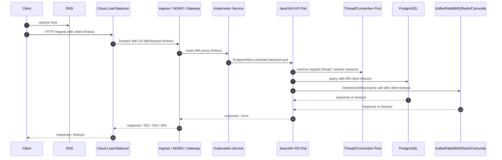
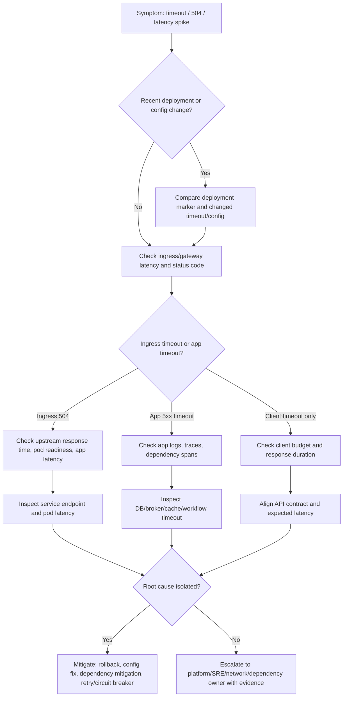

# Part 029 — Timeout Chain Operations

Timeout adalah salah satu penyebab incident yang paling sering disalahpahami.

Di Kubernetes, timeout bukan hanya konfigurasi di aplikasi. Timeout adalah **rantai keputusan waktu** dari client sampai dependency terdalam. Satu request dapat melewati DNS, cloud load balancer, ingress controller, NGINX/API gateway, Kubernetes Service, Pod, servlet/JAX-RS runtime, thread pool, HTTP client, database pool, Kafka/RabbitMQ/Redis client, Camunda engine/client, dan external service.

Jika timeout tidak selaras, gejala yang muncul bisa sangat misleading:

- client melihat 504;
- ingress log mencatat upstream timeout;
- aplikasi mencatat broken pipe;
- service downstream masih memproses request setelah client sudah pergi;
- retry client menambah beban;
- pod terlihat sehat tetapi latency P95/P99 naik;
- thread pool penuh karena request terlalu lama menggantung;
- connection pool habis karena dependency lambat;
- Kafka/RabbitMQ consumer backlog naik karena worker call dependency menggantung;
- database query sebenarnya timeout, tetapi caller melihat 500 generic;
- rollback tidak membantu karena root cause ada di dependency timeout atau network path.

Operational invariant:

```text
Every production request must have a bounded lifetime.
The timeout chain must fail fast enough to protect capacity,
but not so fast that normal dependency latency causes false failure.
```

---

## 1. Core Mental Model

Timeout chain adalah urutan batas waktu yang mengontrol berapa lama sebuah request boleh hidup di tiap hop.

```text
client timeout
  < edge/front door timeout
  < load balancer timeout
  < ingress/proxy timeout
  < application request timeout
  < downstream client timeout
  < dependency timeout
```

Namun aturan ini tidak selalu literal. Yang penting adalah **intent**:

- upstream harus mendapat error yang jelas sebelum semua resource downstream terkunci;
- downstream call tidak boleh lebih lama dari budget request parent;
- retry harus mempertimbangkan remaining time budget;
- long-running operation harus dipisahkan dari synchronous request path;
- timeout harus diobservasi sebagai signal, bukan hanya exception.

Satu timeout yang terlalu panjang dapat menciptakan resource leak operasional. Satu timeout yang terlalu pendek dapat menciptakan false outage.

---

## 2. Timeout Chain Diagram



Jika satu layer memiliki timeout lebih pendek dari layer berikutnya, error akan terlihat di layer tersebut. Jika satu layer memiliki timeout terlalu panjang, resource di bawahnya bisa habis sebelum error muncul.

---

## 3. Why Timeout Matters Operationally

Timeout bukan sekadar UX atau HTTP setting. Timeout melindungi:

- request thread;
- worker thread;
- DB connection pool;
- HTTP client pool;
- Kafka/RabbitMQ processing loop;
- Redis connection pool;
- Camunda job lock/timeout;
- ingress worker capacity;
- load balancer connection table;
- pod memory;
- CPU akibat retry storm;
- downstream dependency capacity;
- user-facing SLO.

Dalam CPQ/quote/order lifecycle, timeout yang buruk bisa berdampak lebih jauh:

- quote calculation menggantung;
- order submission duplicate karena retry tidak idempotent;
- billing integration timeout tetapi side effect sudah terjadi;
- process workflow lanjut sebagian;
- Kafka event ter-publish tetapi caller menganggap gagal;
- rollback aplikasi tidak membatalkan side effect eksternal;
- customer-facing state menjadi ambiguous.

---

## 4. Responsibility Boundary

### Backend service owner responsibility

Backend engineer harus memahami dan mereview:

- application request timeout;
- JAX-RS/server request handling timeout;
- HTTP client connect/read/write timeout;
- DB query timeout;
- transaction timeout;
- connection acquisition timeout;
- Kafka/RabbitMQ/Redis client timeout;
- Camunda worker timeout;
- retry policy;
- circuit breaker policy;
- idempotency behavior;
- fallback behavior;
- metrics dan logs untuk timeout;
- error mapping ke HTTP status atau domain error.

### Platform/SRE responsibility

Platform/SRE biasanya memiliki atau mengelola:

- cloud load balancer timeout;
- ingress controller global config;
- NGINX controller config map;
- Gateway/API gateway policy;
- service mesh timeout jika digunakan;
- cluster DNS behavior;
- node/network capacity;
- dashboard platform-level;
- alerting infra-level.

### Security/network team responsibility

Security/network team bisa terlibat pada:

- firewall timeout;
- proxy idle timeout;
- private endpoint path;
- NAT gateway behavior;
- egress allowlist;
- TLS inspection jika ada;
- corporate network policy.

### Application workload responsibility

Workload sendiri harus:

- tidak menggantung tanpa timeout;
- menghormati cancellation jika memungkinkan;
- tidak melakukan retry tanpa batas;
- tidak mengubah timeout via config tanpa rollout governance;
- memisahkan long-running operation ke async workflow jika perlu.

---

## 5. Timeout Layers to Review

| Layer | Example timeout | Operational risk when too short | Operational risk when too long |
|---|---:|---|---|
| Client/browser/API consumer | 5–60s | User receives premature failure | User waits while backend already failed |
| CDN/front door | varies | Edge returns timeout before backend completes | Edge resources held too long |
| Cloud load balancer | varies | 504 before ingress/app responds | stale connections and unclear failure |
| Ingress/NGINX | proxy connect/read/send timeout | false 504 | upstream worker held too long |
| Service mesh/API gateway | route timeout | route-level false failure | retry storm, resource exhaustion |
| Java/JAX-RS runtime | server request timeout | legitimate slow request killed | request thread starvation |
| HTTP client | connect/read/write timeout | downstream false unavailable | caller thread blocked |
| DB pool acquisition | connectionTimeout | false DB failure | thread waits for connection too long |
| DB query | statement/query timeout | query killed too early | locks and long queries accumulate |
| Kafka producer | delivery/request timeout | false publish failure | producer buffer pressure |
| Kafka consumer processing | poll/processing timeout | rebalance or duplicate risk | lag grows silently |
| RabbitMQ consumer | ack processing budget | redelivery too early | unacked messages pile up |
| Redis client | command timeout | false cache failure | thread blocked by Redis dependency |
| Camunda worker | job timeout/lock duration | job reactivated too early | stuck job and incident delay |

Do not blindly copy timeout values across services. Timeout must reflect criticality, dependency behavior, SLO, and side-effect semantics.

---

## 6. Java/JAX-RS Specific Concerns

For Java/JAX-RS services, timeout issues often show up as:

- request thread pool saturation;
- worker thread starvation;
- async executor saturation;
- connection pool exhaustion;
- blocked threads in thread dump;
- GC pressure due to many pending requests;
- `SocketTimeoutException`;
- `ConnectTimeoutException`;
- `ReadTimeoutException`;
- `SQLTimeoutException`;
- `TimeoutException` from async/future operations;
- ingress 504 while application continues processing;
- broken pipe when app writes response after client closed connection.

Key backend invariant:

```text
A Java service should not allow downstream calls to outlive the parent request budget.
```

Bad pattern:

```text
Ingress timeout: 30s
Application HTTP client read timeout: 120s
DB query timeout: unlimited
Retry: 3 attempts
```

This can create:

- ingress 504 at 30s;
- Java thread still waiting up to 120s;
- DB query still running;
- retry from client starts another request;
- pool pressure increases;
- service appears "healthy" but becomes saturated.

Better pattern:

```text
Client-visible request budget: 30s
Ingress timeout: slightly above expected app response budget if appropriate
App request budget: explicit
Downstream call budget: smaller than remaining request budget
DB query timeout: explicit
Retry: bounded and budget-aware
```

---

## 7. Dependency-Specific Timeout Reasoning

### PostgreSQL

Timeouts to verify:

- connection acquisition timeout;
- socket timeout;
- statement timeout;
- transaction timeout;
- lock timeout;
- idle in transaction timeout;
- migration job timeout.

Failure modes:

- slow query consumes request budget;
- pool acquisition timeout because all connections are busy;
- lock wait creates cascading latency;
- transaction continues after caller has timed out;
- statement timeout is missing in production but present in local.

Signals:

- DB pool active/max/waiting;
- slow query logs;
- lock wait metrics;
- connection count per pod;
- query latency by endpoint;
- trace spans around DB calls.

### Kafka

Timeouts to verify:

- producer request timeout;
- delivery timeout;
- metadata fetch timeout;
- consumer poll interval;
- session timeout;
- heartbeat interval;
- processing time per record/batch;
- graceful shutdown timeout.

Failure modes:

- producer blocks during broker issue;
- consumer processing exceeds poll interval;
- rebalance storm;
- duplicate processing after timeout/restart;
- lag grows because dependency calls inside consumer are slow.

Signals:

- consumer lag;
- rebalance count;
- poll latency;
- processing duration;
- producer error rate;
- broker request latency.

### RabbitMQ

Timeouts and budgets to verify:

- connection timeout;
- heartbeat timeout;
- consumer processing budget;
- ack/nack timing;
- retry delay;
- DLQ routing delay;
- pod shutdown grace period.

Failure modes:

- unacked messages pile up;
- redelivery storm;
- consumer holds messages while dependency is slow;
- shutdown causes duplicate processing;
- queue depth grows while pods appear healthy.

Signals:

- queue depth;
- unacked messages;
- consumer count;
- redelivery rate;
- processing duration;
- DLQ count.

### Redis

Timeouts to verify:

- connect timeout;
- command timeout;
- pool acquisition timeout;
- retry/backoff;
- cache fallback behavior.

Failure modes:

- cache latency blocks API path;
- Redis timeout triggers high DB fallback load;
- pool exhaustion under HPA scale-out;
- retry storm against Redis.

Signals:

- Redis command latency;
- timeout count;
- pool active/waiting;
- fallback rate;
- DB load correlation.

### Camunda

Timeouts to verify:

- job lock duration;
- worker request timeout;
- job execution timeout;
- retry delay;
- external dependency timeout;
- graceful shutdown timeout.

Failure modes:

- job lock expires before worker completes;
- same job reprocessed;
- incident created late;
- worker pod restarts mid-job;
- process instance remains stuck.

Signals:

- activated jobs;
- job completion latency;
- incident count;
- worker retry count;
- process correlation trace.

---

## 8. Timeout Failure Modes

### Failure mode 1 — Ingress timeout is shorter than app processing

Symptoms:

- client receives 504;
- ingress logs upstream timeout;
- app logs eventually show successful processing;
- duplicate user retry occurs;
- side effects may happen twice if operation is not idempotent.

Likely causes:

- long-running synchronous operation;
- timeout mismatch;
- missing idempotency key;
- slow dependency;
- heavy quote/order computation.

Safe mitigation:

- check traces first;
- identify long span;
- avoid immediately raising ingress timeout;
- consider rollback if caused by recent deployment;
- route long operation to async workflow if structural.

### Failure mode 2 — Application timeout is longer than downstream timeout

Symptoms:

- application returns 500/503 quickly;
- dependency logs timeout;
- user sees failure although ingress is healthy.

Likely causes:

- DB statement timeout too low;
- HTTP client timeout too low;
- Redis timeout too aggressive;
- new dependency latency not reflected in config.

Safe mitigation:

- correlate dependency latency;
- verify recent config change;
- adjust only after capacity review;
- avoid raising timeout to hide dependency slowness.

### Failure mode 3 — No explicit timeout

Symptoms:

- thread pool slowly saturates;
- connection pool waiting rises;
- latency climbs before error rate;
- HPA scales but does not fix issue;
- pod memory increases due to pending requests.

Likely causes:

- default client timeout is infinite or too high;
- missing DB query timeout;
- blocking external API;
- retry without budget.

Safe mitigation:

- cap timeouts;
- add circuit breaker;
- protect pool;
- fail fast with clear error;
- create follow-up hardening task.

### Failure mode 4 — Retry storm amplifies timeout

Symptoms:

- dependency latency spikes;
- incoming RPS increases unexpectedly;
- error rate increases after first timeout;
- queue backlog grows;
- CPU and connection pool usage rise.

Likely causes:

- retry at client, gateway, service, and SDK layers;
- no jitter;
- no max attempts;
- no retry budget;
- non-idempotent operations retried.

Safe mitigation:

- disable unsafe retry if possible;
- reduce retry attempts;
- add backoff/jitter;
- protect dependency with circuit breaker;
- coordinate with consumers and upstream clients.

---

## 9. Production-Safe Investigation Commands

Start read-only.

```bash
kubectl get deploy,rs,pod,svc,ingress -n <namespace> -l app=<app>
kubectl describe ingress <ingress-name> -n <namespace>
kubectl describe svc <service-name> -n <namespace>
kubectl get endpointslice -n <namespace> -l kubernetes.io/service-name=<service-name>
kubectl describe pod <pod-name> -n <namespace>
kubectl logs <pod-name> -n <namespace> --since=30m
kubectl logs <pod-name> -n <namespace> --previous
kubectl top pod -n <namespace>
kubectl get events -n <namespace> --sort-by=.lastTimestamp
```

For rollout correlation:

```bash
kubectl rollout history deployment/<deployment-name> -n <namespace>
kubectl rollout status deployment/<deployment-name> -n <namespace>
kubectl describe deployment <deployment-name> -n <namespace>
```

For config source inspection:

```bash
kubectl get configmap -n <namespace>
kubectl describe configmap <configmap-name> -n <namespace>
kubectl get secret -n <namespace>
```

Do not print secret values in shared channels.

If allowed internally, inspect rendered env names without exposing values:

```bash
kubectl describe pod <pod-name> -n <namespace> | sed -n '/Environment:/,/Mounts:/p'
```

For application-level investigation, prefer dashboards/traces over `exec`. Use `exec` only if policy allows and you know the blast radius.

---

## 10. Observability Signals to Check

### Ingress and edge

- request duration;
- upstream response time;
- 502/503/504 rate;
- route/host/path labels;
- upstream connect/read timeout;
- NGINX ingress controller logs;
- load balancer target health;
- request size and response size.

### Application

- request latency P50/P95/P99;
- request timeout count;
- error rate by endpoint;
- active request count;
- server thread pool usage;
- executor queue depth;
- HTTP client latency;
- retry count;
- circuit breaker state;
- JVM CPU/GC/memory;
- correlation ID/trace ID.

### Database

- query latency;
- slow queries;
- lock wait;
- pool active/max/waiting;
- connection acquisition timeout;
- transaction duration;
- statement timeout count.

### Messaging/workflow

- Kafka consumer lag;
- RabbitMQ queue depth and unacked messages;
- Redis latency and timeout count;
- Camunda incidents and job duration;
- worker processing time;
- retry/DLQ count.

---

## 11. Timeout Debugging Flow



---

## 12. Safe Mitigation Patterns

### Good mitigations

- rollback recent bad deployment;
- restore previous timeout config through GitOps;
- reduce unsafe retry attempts;
- temporarily shed traffic if supported;
- disable non-critical downstream call behind feature flag;
- route long operation to async process;
- scale carefully if bottleneck is CPU-bound and dependency can absorb load;
- add circuit breaker/open state to protect dependency;
- coordinate with DB/broker/cache owners before increasing pressure.

### Dangerous mitigations

- blindly increasing ingress timeout;
- blindly increasing DB pool size;
- increasing HPA max replicas without dependency capacity check;
- disabling timeout entirely;
- increasing retry count;
- bypassing GitOps with manual config mutation;
- restarting all pods without evidence;
- running ad-hoc load from inside production pod;
- exposing secret/config values in incident channel.

---

## 13. Rollback Decision

Rollback is usually appropriate when:

- timeout spike correlates strongly with recent deployment;
- config change altered timeout/retry/pool behavior;
- new downstream call was introduced;
- new endpoint path increased latency beyond budget;
- new version causes thread or pool saturation;
- canary metrics fail promotion gate;
- business-critical synchronous flow is impacted.

Rollback may not be sufficient when:

- external dependency is degraded;
- DB lock or migration is still running;
- broker backlog already accumulated;
- network path or DNS issue exists;
- cloud load balancer or ingress config changed outside app repo;
- retry storm is coming from upstream clients;
- data side effects already happened.

---

## 14. EKS, AKS, On-Prem, and Hybrid Considerations

### EKS

Verify internally:

- ALB/NLB timeout behavior;
- AWS Load Balancer Controller annotations;
- target group health;
- VPC endpoint latency;
- NAT gateway pressure;
- security group path;
- CloudWatch metrics/logs;
- Route 53/private hosted zone behavior.

### AKS

Verify internally:

- Azure Load Balancer/Application Gateway timeout;
- AGIC behavior if used;
- private endpoint DNS;
- NSG/UDR path;
- Azure Monitor metrics/logs;
- Key Vault/managed identity call latency.

### On-prem/hybrid

Verify internally:

- corporate proxy timeout;
- firewall idle timeout;
- internal load balancer timeout;
- internal CA/TLS inspection;
- DNS forwarding path;
- hybrid link latency;
- cloud private endpoint path.

---

## 15. PR Review Checklist

When reviewing Kubernetes/application changes, check:

- Did timeout values change?
- Did retry policy change?
- Did connection pool size change?
- Did a new dependency call enter synchronous request path?
- Is the endpoint user-facing or internal?
- Is the operation idempotent?
- Is there a request budget?
- Is downstream timeout shorter than parent budget?
- Are DB query/transaction timeouts explicit?
- Are Kafka/RabbitMQ/Redis/Camunda timeouts aligned with processing semantics?
- Are metrics/logs/traces available per timeout type?
- Is rollback safe if timeout behavior changes?
- Does HPA scale a timeout symptom or hide a dependency bottleneck?
- Does increasing replica count multiply connection pressure?
- Is the change represented in Helm/Kustomize/GitOps values?

---

## 16. Internal Verification Checklist

Verify with backend/platform/SRE/security/network teams:

- canonical timeout policy for API services;
- default ingress timeout;
- NGINX/API gateway timeout config;
- cloud load balancer timeout;
- service mesh timeout if used;
- HTTP client timeout standard;
- DB pool acquisition timeout;
- DB statement/query timeout;
- transaction timeout;
- Kafka producer/consumer timeout defaults;
- RabbitMQ connection/heartbeat/prefetch behavior;
- Redis client timeout;
- Camunda job timeout/lock duration;
- retry/circuit breaker standard;
- idempotency standard for quote/order/billing flows;
- dashboards for timeout and latency;
- alert thresholds for P95/P99 latency;
- runbook for 504/timeout incident;
- GitOps location for timeout config;
- approval process for changing timeout values;
- ownership of ingress/gateway/LB timeout;
- escalation path for network/proxy/private endpoint issues.

---

## 17. Summary

Timeout chain operations require thinking across the whole request path.

For senior backend engineers, the goal is not to memorize every timeout knob. The goal is to reason about bounded work, resource protection, dependency latency, side effects, retry amplification, and production-safe mitigation.

The practical rule:

```text
Timeouts must be explicit, observable, budget-aware, and aligned across layers.
```

A timeout incident should lead to evidence, not guesswork: ingress metrics, application traces, dependency spans, pool metrics, rollout markers, and config history.
