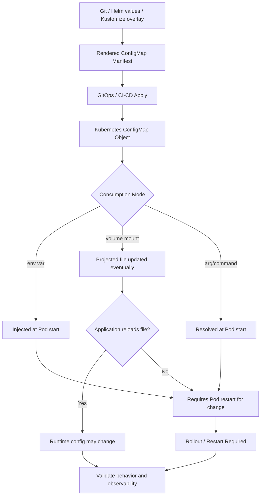
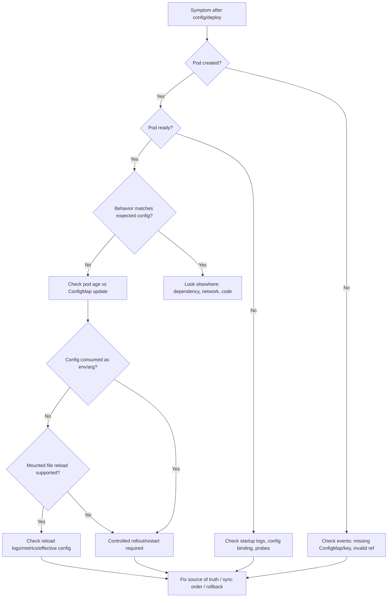

# Part 030 — ConfigMap Operations

ConfigMap terlihat sederhana: key-value configuration yang dapat dipakai oleh pod.

Di production, ConfigMap adalah salah satu sumber incident paling umum karena ia mengontrol perilaku runtime tanpa mengubah image:

- endpoint dependency;
- timeout;
- feature flag;
- pool size;
- log level;
- Kafka topic name;
- RabbitMQ queue/exchange;
- Redis key prefix;
- Camunda worker config;
- external API URL;
- management endpoint;
- environment-specific behavior;
- rollout behavior;
- integration switch.

Operational invariant:

```text
A ConfigMap is not harmless because it is "only configuration".
Configuration changes can alter production behavior as much as code changes.
```

Part ini membahas cara membaca, mereview, men-debug, dan mengoperasikan ConfigMap untuk backend Java/JAX-RS workloads di Kubernetes.

---

## 1. Core Mental Model

ConfigMap memisahkan image dari konfigurasi environment.

```text
container image = application artifact
ConfigMap       = non-secret runtime configuration
Secret          = sensitive runtime configuration
Deployment      = wiring between artifact, config, secret, and runtime
```

ConfigMap bisa digunakan melalui:

- environment variable;
- command argument;
- mounted file;
- mounted directory;
- generated config file;
- framework-specific config binding;
- sidecar/config reloader pattern;
- Helm values rendered into ConfigMap;
- Kustomize configMapGenerator.

Important distinction:

```text
Updating a ConfigMap does not automatically mean the running application has consumed the new value.
```

Whether a pod sees the update depends on how the ConfigMap is consumed and whether the application supports reload.

---

## 2. ConfigMap Runtime Flow



This flow is the reason config-related incidents often happen after teams assume a ConfigMap update has taken effect when it has not.

---

## 3. ConfigMap vs Secret

Use ConfigMap for non-sensitive configuration:

- feature flags that are not sensitive;
- endpoint URLs;
- topic/queue names;
- timeout values;
- log level;
- application mode;
- non-secret integration identifiers.

Use Secret or external secret system for sensitive values:

- passwords;
- API keys;
- private keys;
- tokens;
- client secrets;
- connection strings containing credentials;
- TLS private key material.

Operational warning:

```text
Do not place secrets in ConfigMap because ConfigMap content is easier to expose through describe, logs, dashboards, Git history, rendered manifests, and support artifacts.
```

---

## 4. ConfigMap Consumption Patterns

### Pattern 1 — Environment variables

Example:

```yaml
env:
  - name: APP_TIMEOUT_MS
    valueFrom:
      configMapKeyRef:
        name: quote-service-config
        key: app.timeout.ms
```

Properties:

- value is resolved at pod start;
- running pod does not see updates;
- missing key can block pod start unless optional;
- easy for Java frameworks to bind;
- easy to inspect names, but values may appear in pod spec.

Operational risk:

- config update does nothing until rollout/restart;
- stale pod versions can run different config;
- env var names can drift from app expected names.

### Pattern 2 — Volume-mounted config file

Example:

```yaml
volumeMounts:
  - name: app-config
    mountPath: /etc/app/config
volumes:
  - name: app-config
    configMap:
      name: quote-service-config
```

Properties:

- Kubernetes can update projected files eventually;
- application must reload file to use new values;
- file path and file naming become part of runtime contract;
- useful for larger config blocks.

Operational risk:

- app does not reload file;
- reload happens mid-request without validation;
- partial config reload creates inconsistent behavior;
- mounted file overrides image default unexpectedly.

### Pattern 3 — Generated ConfigMap from Helm/Kustomize

Properties:

- config comes from values/overlay;
- checksum annotation can trigger rollout;
- environment drift is easier to review if rendered output is visible;
- wrong overlay can deploy production with staging config.

Operational risk:

- values hierarchy is hard to follow;
- overlay patch overrides base unexpectedly;
- generated name changes may break references;
- secret-like values leak into chart values.

### Pattern 4 — Immutable ConfigMap

Properties:

- prevents mutation after creation;
- encourages versioned config and rollout discipline;
- reduces accidental drift.

Operational risk:

- emergency change requires new object/version;
- references must be updated correctly;
- GitOps and rollout strategy must support it.

---

## 5. Java/JAX-RS Runtime Impact

A Java/JAX-RS service commonly reads config during startup:

- server port;
- context path;
- management endpoint;
- thread pool size;
- datasource URL;
- pool size;
- HTTP client timeout;
- Kafka/RabbitMQ/Redis connection config;
- feature flags;
- logging level;
- object mapper settings;
- integration endpoint URLs.

Startup-time config means:

```text
ConfigMap update requires pod restart or rollout to affect application behavior.
```

Runtime-reload config requires stronger discipline:

- validate new value before applying;
- expose current effective config safely;
- avoid exposing secrets;
- emit config reload event/metric;
- define rollback behavior;
- avoid changing connection pool or thread pool dynamically unless supported;
- avoid mid-flight semantic changes for order/quote workflows.

For JAX-RS APIs, config changes can affect:

- request timeout;
- downstream timeout;
- route behavior;
- serialization/deserialization;
- validation strictness;
- error mapping;
- auth integration;
- dependency endpoint;
- feature availability.

---

## 6. Backend Dependency Configuration

### PostgreSQL

ConfigMap may contain:

- host/port/database name;
- pool size;
- pool timeout;
- statement timeout;
- schema name;
- migration toggle;
- read/write split flag.

Failure modes:

- wrong host points to wrong environment;
- pool size change overloads DB;
- timeout change creates false failure;
- schema mismatch causes runtime errors;
- migration toggle runs unsafe behavior.

### Kafka

ConfigMap may contain:

- bootstrap server address;
- topic name;
- consumer group prefix;
- concurrency;
- poll settings;
- retry/DLQ topic;
- security protocol reference.

Failure modes:

- wrong topic silently consumes/produces wrong stream;
- wrong consumer group reprocesses old messages;
- concurrency exceeds partition count;
- DLQ routing is disabled or misnamed;
- broker endpoint points to wrong cluster.

### RabbitMQ

ConfigMap may contain:

- host/port/vhost;
- exchange;
- queue;
- routing key;
- prefetch;
- retry/DLQ configuration;
- consumer concurrency.

Failure modes:

- wrong queue causes no consumption;
- prefetch too high increases unacked messages;
- retry queue misconfigured creates message loss or loop;
- vhost mismatch causes access failure.

### Redis

ConfigMap may contain:

- host/port;
- database index;
- key prefix;
- TTL;
- pool size;
- cache enable/disable flag.

Failure modes:

- wrong key prefix mixes environments;
- TTL change creates stale or unstable cache;
- disabling cache overloads DB;
- pool change creates Redis connection pressure.

### Camunda

ConfigMap may contain:

- worker name;
- worker concurrency;
- job type;
- lock duration;
- retry count;
- polling interval;
- endpoint URL.

Failure modes:

- wrong job type means no worker picks up jobs;
- concurrency spike overloads dependency;
- lock duration too short causes duplicate work;
- retry config creates incident storm.

---

## 7. Common ConfigMap Failure Modes

### Failure mode 1 — Missing ConfigMap

Symptoms:

- pod stuck in `CreateContainerConfigError`;
- event says ConfigMap not found;
- rollout never becomes ready.

Typical causes:

- ConfigMap not applied;
- wrong namespace;
- wrong name in Deployment;
- GitOps sync order issue;
- Helm/Kustomize rendered reference mismatch.

Safe response:

- inspect pod events;
- compare Deployment reference to actual ConfigMap;
- verify GitOps sync health;
- avoid manually creating production ConfigMap outside source of truth unless break-glass procedure allows.

### Failure mode 2 — Missing key

Symptoms:

- pod fails to start;
- application startup error;
- env var not populated;
- Java config binding error.

Typical causes:

- key renamed in ConfigMap but not in app;
- app version expects new key;
- overlay does not include key;
- optional key is not handled safely.

Safe response:

- compare app version and config version;
- check rendered manifest;
- restore key or rollback app/config pair;
- add validation and safe default if appropriate.

### Failure mode 3 — Wrong environment config

Symptoms:

- service calls staging/dev dependency from production;
- traffic goes to wrong broker/topic/queue;
- database connection failure;
- business behavior differs by environment.

Typical causes:

- wrong Helm values file;
- wrong Kustomize overlay;
- copy-paste config;
- environment label mismatch;
- pipeline promotion bug.

Safe response:

- stop rollout if still in progress;
- verify effective config;
- rollback config through GitOps;
- audit side effects if wrong dependency received traffic.

### Failure mode 4 — Stale config

Symptoms:

- ConfigMap object shows new value;
- pod behavior still uses old value;
- only some replicas behave differently;
- rollout did not happen.

Typical causes:

- env var consumption requires restart;
- checksum annotation missing;
- pods not restarted;
- app does not reload mounted config;
- GitOps synced ConfigMap but not Deployment.

Safe response:

- verify pod creation timestamp;
- verify rollout history;
- check deployment annotations;
- perform controlled rollout restart if approved;
- add checksum/config version annotation in chart.

### Failure mode 5 — Config drift

Symptoms:

- live ConfigMap differs from Git;
- manual hotfix overwritten by GitOps;
- Argo CD/Flux shows out-of-sync;
- incident reappears after sync.

Typical causes:

- manual kubectl edit;
- emergency patch not backported to Git;
- multiple repos define same config;
- generated config not reviewed.

Safe response:

- identify source of truth;
- reconcile through Git;
- document emergency changes;
- avoid repeated manual mutation.

---

## 8. Production-Safe Investigation Commands

List and inspect objects:

```bash
kubectl get configmap -n <namespace>
kubectl describe configmap <configmap-name> -n <namespace>
kubectl get deploy <deployment-name> -n <namespace> -o yaml
kubectl describe pod <pod-name> -n <namespace>
kubectl get events -n <namespace> --sort-by=.lastTimestamp
```

Find ConfigMap references from a Deployment:

```bash
kubectl get deploy <deployment-name> -n <namespace> -o jsonpath='{.spec.template.spec.containers[*].envFrom}'
kubectl get deploy <deployment-name> -n <namespace> -o jsonpath='{.spec.template.spec.containers[*].env}'
kubectl get deploy <deployment-name> -n <namespace> -o jsonpath='{.spec.template.spec.volumes[*].configMap.name}'
```

Check rollout and pod age:

```bash
kubectl rollout history deployment/<deployment-name> -n <namespace>
kubectl rollout status deployment/<deployment-name> -n <namespace>
kubectl get pod -n <namespace> -l app=<app> -o wide
```

Check if pods were restarted after config change:

```bash
kubectl get pod -n <namespace> -l app=<app> \
  -o custom-columns=NAME:.metadata.name,START:.status.startTime,NODE:.spec.nodeName
```

Caution:

```text
Do not paste full ConfigMap values into public incident channels if they may include endpoint details, internal topology, credentials accidentally placed in config, tenant data, or security-sensitive routing.
```

---

## 9. ConfigMap Debugging Flow



---

## 10. Config Reload Strategy

There are three broad strategies.

### Strategy 1 — Restart on config change

Best for:

- Java services that bind config at startup;
- pool/thread/timeout changes;
- dependency endpoint changes;
- feature flags with major behavioral impact;
- predictable rollout and rollback.

Implementation pattern:

- compute checksum of ConfigMap content;
- place checksum in Deployment pod template annotation;
- any config change changes pod template;
- Deployment rollout occurs.

Example concept:

```yaml
spec:
  template:
    metadata:
      annotations:
        checksum/config: "<hash-of-rendered-config>"
```

### Strategy 2 — Runtime reload

Best for:

- log level changes;
- small dynamic flags;
- non-critical toggles;
- config files explicitly watched by app.

Requirements:

- validation before apply;
- reload success/failure metrics;
- audit event;
- rollback path;
- safe default;
- no partial inconsistent state.

### Strategy 3 — External dynamic config/feature flag system

Best for:

- targeted rollout;
- tenant/user/segment-based flags;
- emergency disable switches;
- progressive exposure.

Risks:

- another dependency in request path;
- governance and audit requirement;
- stale flag cache;
- inconsistent behavior across pods if not designed well.

---

## 11. Helm, Kustomize, and GitOps Concerns

### Helm

Review:

- `values.yaml` hierarchy;
- environment-specific values;
- template rendering;
- checksum annotation;
- secret/config separation;
- default values;
- chart version vs app version;
- accidental production override.

Common issue:

```text
The ConfigMap in cluster is correct according to Helm rendering,
but the values file selected by the pipeline is wrong.
```

### Kustomize

Review:

- base ConfigMap;
- overlay patches;
- configMapGenerator behavior;
- name suffix hash;
- reference updates;
- environment sprawl;
- duplicated keys across overlays.

Common issue:

```text
The base has the correct key, but a production overlay silently overrides it.
```

### GitOps

Review:

- source repo;
- rendered manifest;
- sync status;
- health status;
- drift;
- manual changes;
- sync waves;
- rollback through Git.

Common issue:

```text
Manual kubectl edit fixes production temporarily,
then GitOps reconciles the old value back.
```

---

## 12. Observability for ConfigMap Changes

Good config operations need visibility:

- deployment marker when config changes;
- config version annotation;
- application startup log showing config version, not sensitive values;
- metric for current config version if safe;
- reload success/failure metric;
- alert when config reload fails;
- trace/log correlation after config change;
- dashboard panel for recent deployments/config changes.

Avoid logging:

- passwords;
- tokens;
- connection strings with credentials;
- internal tenant identifiers if sensitive;
- private endpoint details if policy forbids sharing;
- full config dump in production logs.

Better startup log pattern:

```text
Loaded config version=2026-07-12T10:15Z source=configmap:quote-service-config profile=prod
```

Worse pattern:

```text
Loaded config: {all keys and values including sensitive accidentally-misplaced fields}
```

---

## 13. EKS, AKS, On-Prem, and Hybrid Considerations

### EKS

Verify:

- ConfigMap changes delivered via GitOps or Helm;
- AWS-specific endpoint config;
- region/account-specific values;
- VPC endpoint DNS names;
- IRSA-related non-secret config;
- CloudWatch dashboard labels.

### AKS

Verify:

- Azure region/resource group-specific values;
- private endpoint FQDN;
- managed identity client IDs if non-secret references are used;
- Azure Monitor labels;
- Key Vault references separated from ConfigMap.

### On-prem/hybrid

Verify:

- proxy and `NO_PROXY` config;
- corporate DNS names;
- internal CA paths;
- on-prem load balancer URLs;
- air-gapped registry references;
- cloud private endpoint routing values.

Hybrid systems are especially vulnerable to config drift because the same service may need different endpoint, proxy, trust, and routing config across environments.

---

## 14. Safe Mitigation Patterns

Good mitigations:

- rollback config via GitOps;
- revert Helm values/Kustomize overlay;
- perform controlled rollout restart;
- restore last known good ConfigMap version;
- disable unsafe feature flag if designed for runtime change;
- add missing key with safe default through approved path;
- pause rollout if new config breaks readiness;
- validate config in CI before deploy.

Dangerous mitigations:

- manual `kubectl edit configmap` in production without recording change;
- changing config and assuming pods picked it up;
- raising pool size/timeouts without dependency capacity check;
- placing secrets in ConfigMap for speed;
- deleting ConfigMap to force recreation;
- restarting every pod in namespace;
- printing full config values in incident bridge;
- using staging endpoint from production as a temporary workaround.

---

## 15. PR Review Checklist

For ConfigMap-related PRs, review:

- Which keys changed?
- Which workload consumes them?
- Are keys consumed as env var, args, or mounted file?
- Does change require rollout?
- Is checksum annotation present?
- Are defaults safe?
- Are removed keys still required by older app versions?
- Is app version compatible with config version?
- Are environment overlays correct?
- Are secrets accidentally included?
- Are timeout/pool/retry values changed?
- Does change affect PostgreSQL/Kafka/RabbitMQ/Redis/Camunda?
- Does change affect ingress/routing/dependency endpoint?
- Is rollback simply reverting config, or does data side effect exist?
- Are dashboards/alerts aware of the changed behavior?
- Was rendered manifest reviewed, not only template source?

---

## 16. Internal Verification Checklist

Verify internally:

- source of truth for ConfigMap values;
- Helm/Kustomize/GitOps repo path;
- environment overlay structure;
- naming convention;
- ownership metadata;
- checksum/restart strategy;
- runtime reload policy;
- safe default standard;
- config validation in CI;
- secret/config separation policy;
- approval process for production config change;
- emergency config change procedure;
- rollback procedure;
- deployment marker for config-only change;
- dashboard for config changes;
- alert/runbook for `CreateContainerConfigError`;
- policy for logging effective config;
- Java framework config binding behavior;
- dependency endpoint ownership;
- config drift detection;
- Argo CD/Flux sync behavior;
- incident evidence process for config-related outages.

---

## 17. Summary

ConfigMap operations are about runtime behavior control.

A senior backend engineer should treat ConfigMap changes with the same seriousness as code changes because they can alter timeout, routing, dependency, scaling, retry, and business behavior.

The practical rules:

```text
1. Know how the config is consumed.
2. Know whether a restart or reload is required.
3. Know the source of truth.
4. Never mix secrets into ConfigMap.
5. Review rendered manifests, not only templates.
6. Treat config drift as an incident risk.
7. Make config changes observable and rollbackable.
```

Production-safe ConfigMap operations prevent small configuration mistakes from becoming large Kubernetes incidents.
