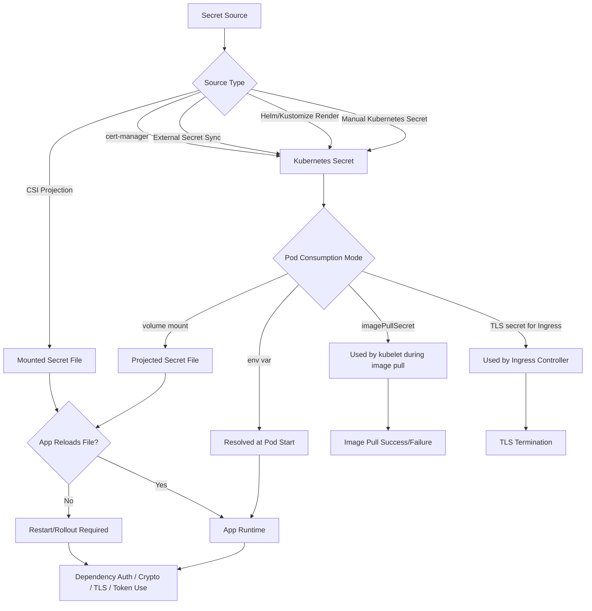
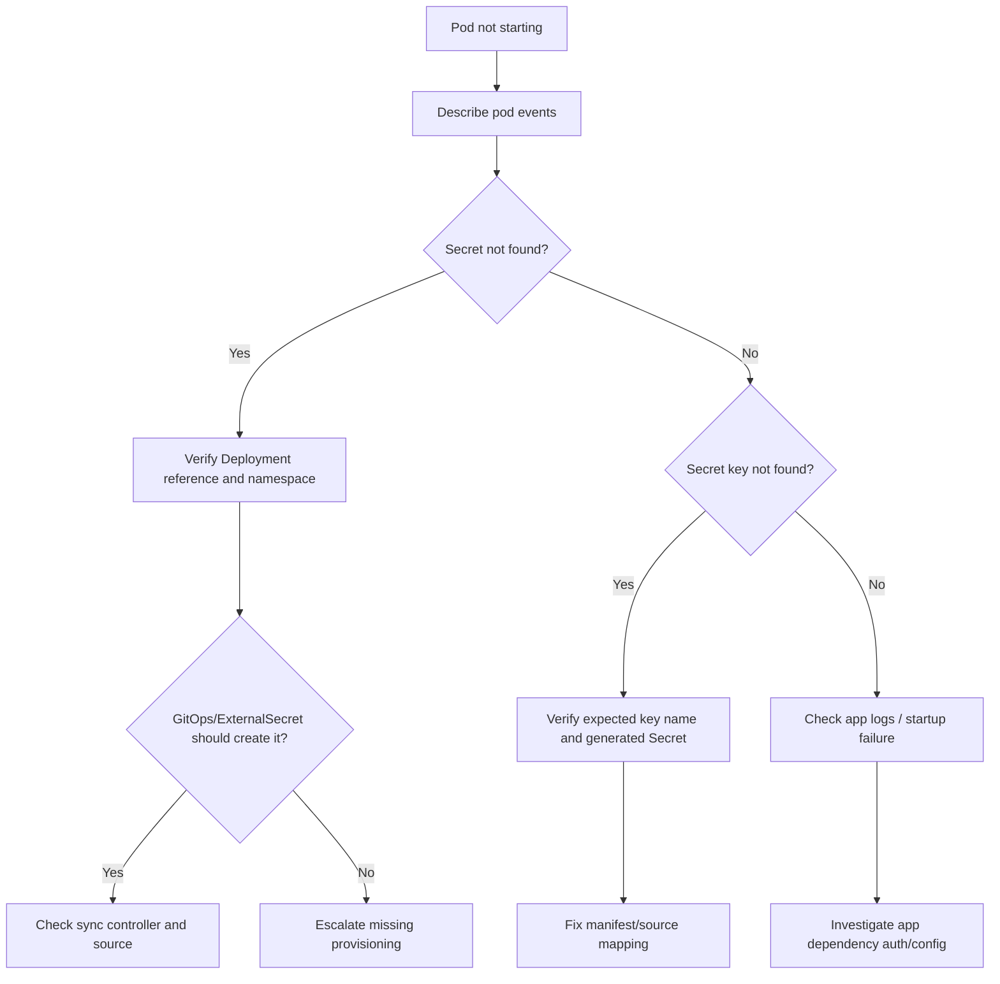
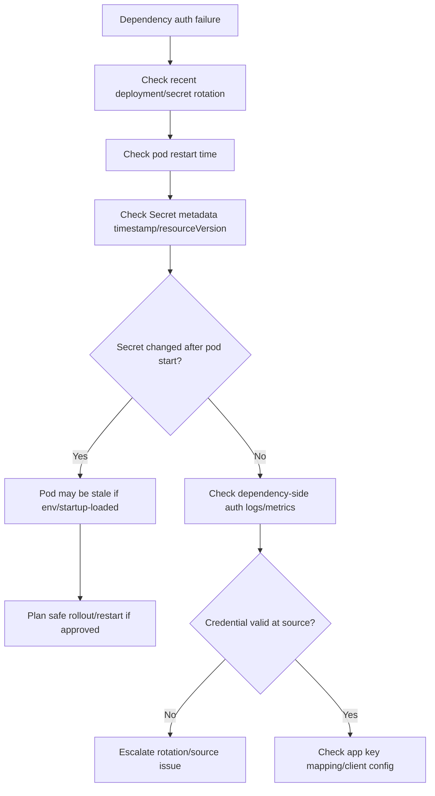
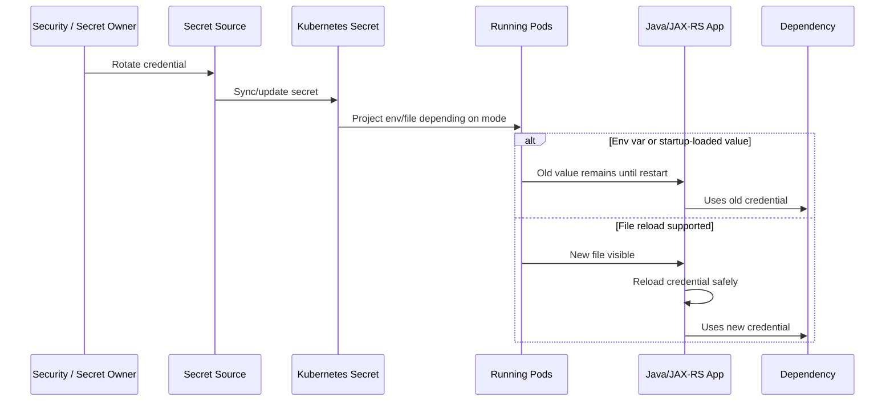
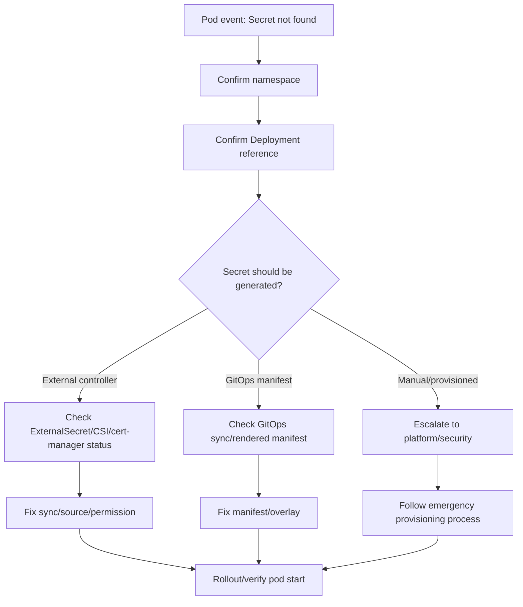
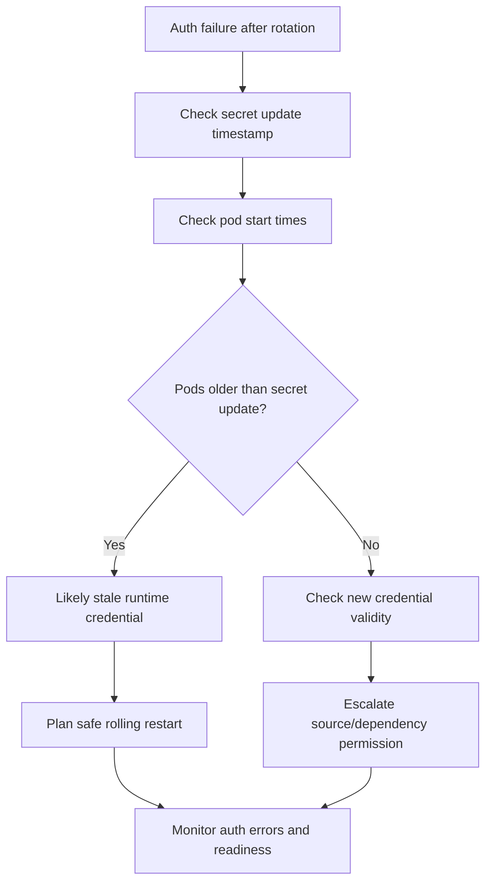
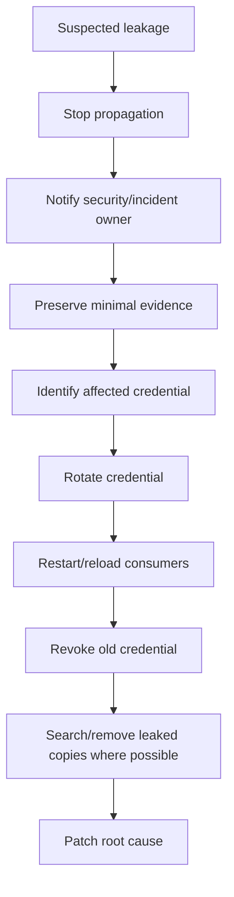

# Part 031 — Secret Operations

Secret adalah salah satu object Kubernetes yang paling sering terlihat sederhana, tetapi paling berbahaya secara operasional.

Secara teknis, Secret menyimpan data sensitif yang dapat dikonsumsi oleh workload. Secara production operations, Secret adalah kontrak runtime antara aplikasi, platform, security, dependency, cloud identity, deployment pipeline, dan incident process.

Contoh data yang biasanya masuk ke Secret:

- database password;
- API key;
- OAuth client secret;
- JWT signing key;
- TLS private key;
- Kafka SASL credential;
- RabbitMQ credential;
- Redis password;
- Camunda credential;
- cloud service token;
- internal integration token;
- certificate bundle;
- keystore/truststore password.

Operational invariant:

```text
A Secret failure is rarely isolated.
It can break startup, readiness, dependency access, rollout, rotation, audit posture, and incident response at the same time.
```

Part ini membahas bagaimana backend engineer membaca, mereview, dan men-debug Secret secara production-safe tanpa membocorkan credential dan tanpa mengambil alih tanggung jawab security/platform yang seharusnya diverifikasi internal.

---

## 1. Core Mental Model

Secret adalah runtime input sensitif.

```text
container image = application artifact
ConfigMap       = non-sensitive runtime configuration
Secret          = sensitive runtime configuration
Deployment      = wiring between artifact, config, secret, identity, and runtime
```

Kubernetes Secret bukan secret manager penuh. Ia adalah Kubernetes object yang berisi sensitive data untuk dipakai workload.

Secret dapat berasal dari beberapa sumber:

- dibuat langsung sebagai Kubernetes Secret;
- dirender dari Helm chart;
- digenerate oleh Kustomize;
- disinkronkan oleh External Secrets Operator;
- diproject oleh Secrets Store CSI Driver;
- dibuat oleh cert-manager untuk TLS;
- dibuat oleh platform pipeline;
- dibuat manual untuk emergency break-glass;
- dibuat oleh operator dependency tertentu.

Backend engineer harus memahami bukan hanya nama Secret, tetapi lifecycle Secret:

```text
source of truth -> sync/render/apply -> Kubernetes Secret -> pod consumption -> app runtime behavior -> rotation/reload/restart -> audit
```

Failure di salah satu titik dapat muncul sebagai:

- `CreateContainerConfigError`;
- `CrashLoopBackOff`;
- readiness failure;
- dependency authentication failure;
- TLS handshake failure;
- 401/403 ke external API;
- database login failure;
- Kafka/RabbitMQ auth failure;
- Redis auth error;
- Camunda worker tidak mengambil job;
- rollout stuck;
- silent fallback ke config default yang salah.

---

## 2. Secret Runtime Flow



Important operational lesson:

```text
Secret update does not guarantee application runtime has consumed the new secret.
```

Consumption mode determines reload behavior.

---

## 3. Secret Is Not Just Base64

Kubernetes Secret values are base64-encoded in manifest representation. Base64 is not encryption.

Operational implication:

```text
Anyone who can read the Secret object can usually recover the original value.
```

This matters for:

- RBAC design;
- GitOps repo hygiene;
- CI/CD logs;
- Helm values handling;
- support bundle generation;
- dashboard redaction;
- incident evidence capture;
- `kubectl describe` / `kubectl get -o yaml` usage;
- Slack/Jira/ticket screenshots;
- terminal recording;
- audit log exposure.

Backend engineer does not need to see the raw secret value in most investigations. Usually the safe questions are:

- does the Secret object exist?
- does it have the expected keys?
- is the pod referencing the expected Secret name?
- did the pod start after the Secret changed?
- does the projected file exist inside the pod?
- does the app log show authentication failure without printing the secret?
- is the ServiceAccount allowed to access the external secret source?
- is rotation expected to require restart?

Avoid this unless explicitly approved:

```bash
kubectl get secret my-secret -o yaml
kubectl get secret my-secret -o jsonpath='{.data.password}' | base64 -d
```

Production-safe alternative:

```bash
kubectl get secret my-secret -n <namespace>
kubectl describe secret my-secret -n <namespace>
kubectl get secret my-secret -n <namespace> -o jsonpath='{.metadata.creationTimestamp}'
kubectl get secret my-secret -n <namespace> -o jsonpath='{.metadata.resourceVersion}'
kubectl get secret my-secret -n <namespace> -o jsonpath='{.metadata.annotations}'
```

Even `describe secret` can show key names and metadata. Treat it as sensitive operational evidence.

---

## 4. Secret Consumption Patterns

### Pattern 1 — Secret as environment variable

Example:

```yaml
env:
  - name: DB_PASSWORD
    valueFrom:
      secretKeyRef:
        name: quote-service-db-secret
        key: password
```

Properties:

- value is injected at pod start;
- running pod does not receive updates automatically;
- missing Secret or missing key can block container creation;
- easy for Java frameworks to bind;
- dangerous if app prints environment variables;
- can leak through diagnostics or crash dumps if not handled carefully.

Operational risk:

- secret rotation requires pod restart/rollout;
- old pods and new pods may run with different credentials during rollout;
- wrong env var name can cause fallback behavior;
- stale pod can keep using old credential after external rotation;
- diagnostic endpoint may expose config if not protected.

Use when:

- application expects env var binding;
- values are simple scalar credentials;
- restart-on-rotation is acceptable;
- operational process clearly restarts workload after secret change.

Avoid when:

- value is large binary material;
- key/cert files are expected;
- live rotation without restart is required;
- app/framework tends to dump environment.

---

### Pattern 2 — Secret as mounted file

Example:

```yaml
volumes:
  - name: db-secret
    secret:
      secretName: quote-service-db-secret
volumeMounts:
  - name: db-secret
    mountPath: /etc/secrets/db
    readOnly: true
```

Properties:

- projected files can update eventually;
- application must reload files to consume updates;
- file permissions and path become runtime contract;
- useful for TLS certs, truststores, keystores, config files, token files;
- safer than env vars for some libraries that expect file references.

Operational risk:

- application does not reload the file;
- application reads file only at startup;
- partial reload creates inconsistent runtime state;
- file path mismatch causes startup failure;
- mounted file may shadow image file;
- rotation may not be atomic from app perspective if app reload logic is weak.

Java/JAX-RS implication:

- JDBC drivers usually read credentials at datasource initialization;
- Kafka/RabbitMQ clients usually read credentials at client initialization;
- TLS truststore/keystore is usually loaded at JVM/app startup unless custom reload exists;
- token file reload must be explicitly supported by the client library.

---

### Pattern 3 — Secret for Ingress TLS

Example:

```yaml
spec:
  tls:
    - hosts:
        - quote.example.internal
      secretName: quote-ingress-tls
```

Properties:

- consumed by ingress controller;
- affects external/client TLS termination;
- rotation behavior depends on ingress controller;
- certificate expiry can create broad outage;
- wrong cert can break SNI/host matching.

Operational risk:

- expired certificate;
- wrong private key;
- wrong host/SAN;
- wrong namespace;
- secret not synced;
- ingress controller not reloading;
- client trust issue if CA bundle changes.

Backend engineer responsibility:

- recognize TLS Secret reference in Ingress;
- verify application is not responsible for edge TLS if termination happens at ingress;
- escalate certificate lifecycle to platform/security where appropriate;
- verify backend protocol expectations if TLS is re-encrypted to pod.

---

### Pattern 4 — imagePullSecret

Example:

```yaml
imagePullSecrets:
  - name: regcred
```

Properties:

- used by kubelet to pull private image;
- not consumed by application container;
- failure appears as `ErrImagePull` or `ImagePullBackOff`;
- managed by platform/pipeline in many organizations.

Operational risk:

- registry token expired;
- wrong registry credential;
- Secret missing in namespace;
- ServiceAccount does not reference imagePullSecret;
- node cannot reach registry;
- ECR/ACR integration broken.

Backend engineer responsibility:

- identify imagePullSecret-related failure;
- verify image path/tag/digest;
- check event message;
- escalate registry credential/pull permission to platform/DevOps.

---

### Pattern 5 — Secret generated by tooling

Secrets can be generated by:

- Helm templates;
- Kustomize `secretGenerator`;
- External Secrets Operator;
- Secrets Store CSI Driver;
- cert-manager;
- sealed-secrets;
- SOPS-based GitOps;
- platform deployment pipeline.

Operational risk:

- generated name changes and Deployment still points to old name;
- GitOps drift;
- missing sync controller;
- values accidentally committed;
- rotation does not restart workload;
- source-of-truth unclear.

Internal verification is mandatory here because every enterprise has different secret management patterns.

---

## 5. Backend Engineer Responsibility

A senior backend engineer should be able to answer:

- which Secret names does this workload reference?
- which keys are required?
- which runtime components consume them?
- are they env vars, files, ingress TLS, imagePullSecret, or cloud identity inputs?
- what happens if the Secret is missing?
- what happens if the Secret is stale?
- what happens during rotation?
- does rotation require pod restart?
- is there a safe fallback?
- does the app fail fast or silently degrade?
- are logs redacted?
- are secrets excluded from error responses and diagnostic endpoints?
- who owns the source of truth?
- who can rotate it?
- who can read it?
- who is paged if it fails?

Backend engineer should not casually decode or distribute secrets.

Backend engineer owns application behavior around secrets:

- fail fast on required secret missing;
- clear non-sensitive error messages;
- no secret leakage in logs;
- no secret leakage in exception messages;
- no secret leakage in actuator/management endpoints;
- safe dependency client initialization;
- graceful handling of credential rotation where supported;
- restart/rollout readiness if reload is not supported;
- redacted configuration dumps;
- tests for missing/invalid secret behavior.

---

## 6. Platform/SRE/Security Responsibility Boundary

Platform/SRE often owns:

- namespace-level secret provisioning mechanism;
- External Secrets controller;
- Secrets Store CSI Driver;
- cert-manager;
- cloud identity integration;
- cluster encryption configuration;
- RBAC baseline;
- GitOps secret workflow;
- audit logging;
- break-glass process;
- secret sync/rotation platform health.

Security often owns:

- credential policy;
- rotation frequency;
- vault/secret-manager policy;
- access review;
- audit evidence;
- encryption requirements;
- exception approval;
- compliance posture;
- incident handling for leakage.

Backend team owns:

- application references to required secrets;
- correct key names;
- safe consumption pattern;
- no secret logging;
- dependency client config;
- readiness behavior;
- restart/reload behavior;
- runbook for application symptom;
- PR review for secret references.

Escalate when:

- cloud secret source is inaccessible;
- controller sync is failing;
- RBAC denies secret access unexpectedly;
- TLS secret/cert lifecycle is broken;
- credential rotation schedule is unclear;
- secret may be leaked;
- production secret needs emergency rotation;
- audit/compliance evidence is required.

---

## 7. Secret Object Review

Safe review starts with metadata and references, not raw values.

```bash
kubectl get secret -n <namespace>
kubectl describe secret <secret-name> -n <namespace>
kubectl get deploy <deploy-name> -n <namespace> -o yaml | grep -A5 -B5 secret
kubectl get pod <pod-name> -n <namespace> -o yaml | grep -A5 -B5 secret
```

Look for:

- Secret exists;
- Secret type is expected;
- expected keys exist;
- creation timestamp makes sense;
- annotations show source controller;
- owner references if generated;
- labels identify owner/team/environment;
- Deployment references the correct name;
- pod was restarted after relevant secret update;
- no unexpected secret reference in unrelated workload.

Common Secret types:

```text
Opaque                         generic key-value secret
kubernetes.io/tls              TLS certificate and private key
kubernetes.io/dockerconfigjson registry pull secret
kubernetes.io/service-account-token legacy service account token pattern
```

Important:

```text
Secret type tells you consumption intent. It does not prove the value is correct.
```

---

## 8. Secret and Pod Startup Failure

Missing Secret can prevent the container from starting.

Typical symptoms:

- pod stuck in `CreateContainerConfigError`;
- pod event says Secret not found;
- pod event says key not found;
- Deployment rollout stuck;
- service has no ready endpoint;
- ingress returns 503 because backend pods are not ready.

Investigation:

```bash
kubectl get pod <pod> -n <namespace>
kubectl describe pod <pod> -n <namespace>
kubectl get secret <secret-name> -n <namespace>
kubectl describe secret <secret-name> -n <namespace>
kubectl rollout status deploy/<deploy> -n <namespace>
```

Decision path:



Production-safe mitigation:

- rollback if bad deployment introduced wrong Secret name/key;
- restore previous Secret reference if source was changed incorrectly;
- restart pods only after confirming Secret is present and correct;
- escalate if Secret source or credential value is managed outside backend team;
- do not create ad-hoc production Secret unless emergency process permits it.

---

## 9. Secret and Application Runtime Failure

Secret exists does not mean credential is valid.

Runtime failure examples:

- PostgreSQL: password authentication failed;
- Kafka: SASL authentication failed;
- RabbitMQ: access refused;
- Redis: NOAUTH or invalid password;
- Camunda: 401/403 to engine/API;
- external API: invalid client secret;
- TLS: bad certificate or truststore password;
- cloud SDK: token/credential chain failure.

Debugging flow:



Key operational distinction:

```text
Secret present = Kubernetes wiring exists.
Credential valid = dependency/security source accepts it.
Application using latest credential = pod runtime has consumed it.
```

These are three different checks.

---

## 10. Secret Rotation Model

Secret rotation must answer five questions:

1. Where is the source of truth?
2. How does the Kubernetes Secret update?
3. How does the pod consume the new value?
4. Does the application reload it or require restart?
5. How is old credential overlap handled?

Rotation flow:



Dangerous assumptions:

- “Secret was updated, so app is using it.”
- “Mounted Secret means live reload.”
- “Credential rotation is safe without overlapping validity.”
- “Restarting all pods at once is harmless.”
- “The application will reconnect automatically.”
- “Old and new credentials cannot coexist.”

Safer rotation model:

```text
prepare -> dual-valid window -> update secret -> rollout/reload -> verify -> revoke old credential -> monitor
```

For Java services, assume restart is required unless reload support is explicitly implemented and tested.

---

## 11. Secret Reload and Restart Strategy

### Env var consumption

Usually requires pod restart.

Safe action:

```bash
kubectl rollout restart deploy/<deploy> -n <namespace>
kubectl rollout status deploy/<deploy> -n <namespace>
```

But in production, do not run restart casually. First verify:

- deployment strategy;
- PDB;
- readiness behavior;
- dependency connection spike risk;
- current incident state;
- replica count;
- HPA state;
- maintenance/change policy.

### Volume-mounted Secret

May update file eventually, but app reload is separate.

Check:

- does app watch file changes?
- does library reload truststore/cert?
- is reload atomic?
- does reload affect existing connections?
- does app log reload success/failure?
- are new connections using new credential?

### Restart-trigger annotations

Many Helm charts use checksum annotations:

```yaml
spec:
  template:
    metadata:
      annotations:
        checksum/secret: "<hash-of-rendered-secret>"
```

This forces Deployment template change when Secret content changes, triggering rollout.

Operational risk:

- checksum does not include externally synced secret;
- checksum is calculated from wrong values;
- Secret changes outside GitOps do not trigger rollout;
- rollout happens unexpectedly after secret sync;
- multiple workloads restart at once after global secret change.

---

## 12. Secret Leakage Risks

Secret leakage is an incident, not a minor bug.

Common leakage paths:

- accidentally committed values in Git;
- Helm values file containing secret;
- CI/CD logs printing environment;
- app logs printing config object;
- exception messages including connection URL with password;
- debug endpoint exposing environment;
- heap dump containing credentials;
- thread dump containing URL/token in thread name or stack data;
- support bundle with pod specs;
- screenshot of decoded secret;
- Slack/Jira paste of raw value;
- metrics label containing sensitive value;
- trace attribute containing token;
- NGINX access logs containing query token;
- shell history from decode command.

Backend mitigation:

- never log raw env/config;
- redact known keys: password, token, secret, key, credential;
- avoid credentials in URL string if possible;
- protect management endpoints;
- scrub exception messages;
- review structured log attributes;
- avoid sensitive values in labels/annotations;
- avoid sensitive values in metric labels;
- avoid sensitive values in trace attributes;
- handle heap dumps as sensitive artifacts.

Production runbook when leakage suspected:

1. Stop further propagation.
2. Preserve evidence without expanding exposure.
3. Notify security/incident channel.
4. Rotate affected credential.
5. Identify consumers.
6. Restart/reload safely.
7. Revoke old credential.
8. Audit access and logs.
9. Patch leakage path.
10. Add prevention control.

---

## 13. Java/JAX-RS Runtime Impact

Secrets usually enter Java/JAX-RS services through:

- environment variable binding;
- properties file;
- MicroProfile Config;
- Spring-style config if used in adjacent services;
- datasource configuration;
- Kafka client properties;
- RabbitMQ connection factory;
- Redis client config;
- OAuth client config;
- TLS keystore/truststore;
- cloud SDK credential provider chain.

Operational concerns:

### Startup

If required secret is missing, fail fast with a clear redacted message.

Good message:

```text
Missing required configuration key: DB_PASSWORD
```

Bad message:

```text
Failed to connect using password super-secret-value
```

### Readiness

Readiness should reflect whether the service can safely receive traffic. But avoid dependency-heavy readiness checks that make every downstream blip remove all pods from service.

Secret-related readiness failure should be explicit and redacted.

### Connection pools

After secret rotation, existing DB connections may still use old credential until reconnected. Rollout can create connection spike.

Consider:

- max pool per pod;
- number of replicas;
- maxSurge;
- database max connections;
- credential overlap window;
- rolling restart pace.

### TLS and truststores

Java truststore/keystore reload is often not automatic. Cert rotation may require app restart unless custom reload exists.

### Management endpoint

Ensure management/config endpoint does not expose:

- env var values;
- system properties with secrets;
- datasource URLs with credentials;
- token values;
- keystore passwords.

---

## 14. Dependency-Specific Secret Operations

### PostgreSQL

Secret usually contains:

- username;
- password;
- JDBC URL if sensitive;
- TLS cert/truststore password;
- client certificate.

Failure modes:

- password authentication failed;
- database role missing;
- expired password;
- wrong database host because config and secret mismatch;
- old pods still using old password;
- pool reconnect storm after rotation;
- connection string leaks password in logs.

Checklist:

- verify Secret name/key mapping;
- verify pod restart after rotation if env/startup-loaded;
- correlate DB auth failures with deployment/rotation;
- check connection pool metrics;
- coordinate credential overlap with DBA/platform.

### Kafka

Secret may contain:

- SASL username/password;
- SCRAM credential;
- client cert/key;
- truststore;
- schema registry credential.

Failure modes:

- SASL authentication failed;
- TLS handshake failure;
- consumer group stops consuming;
- lag grows;
- rolling restart triggers rebalance and auth failures;
- wrong credential for environment/topic cluster.

Checklist:

- correlate auth errors with consumer lag;
- verify broker endpoint and credential source;
- check pod restart timing;
- check secret rotation overlap;
- avoid logging Kafka properties raw.

### RabbitMQ

Secret may contain:

- username/password;
- vhost;
- TLS cert/truststore;
- management API credential.

Failure modes:

- access refused;
- vhost permission denied;
- connection loop;
- unacked messages stall;
- queue depth grows;
- pod restart storm creates connection churn.

Checklist:

- verify vhost and permission mapping;
- check connection/channel metrics;
- check queue depth and consumer count;
- coordinate credential rotation with broker team.

### Redis

Secret may contain:

- password;
- ACL username/password;
- TLS truststore;
- sentinel/cluster credential.

Failure modes:

- NOAUTH;
- invalid password;
- ACL denied;
- cache unavailable;
- rate of reconnection spikes;
- stale pods continue using old credential.

Checklist:

- verify Redis client auth mode;
- check connection pool metrics;
- check error rate and cache fallback;
- ensure fallback does not overload database.

### Camunda

Secret may contain:

- API credential;
- worker auth token;
- OAuth client secret;
- DB credential if embedded/self-managed;
- TLS material.

Failure modes:

- worker cannot activate jobs;
- incidents rise;
- external task lock expires;
- job completion fails;
- workflow backlog grows.

Checklist:

- correlate worker auth errors with process incidents;
- check job activation metrics;
- verify token rotation behavior;
- avoid duplicate processing during restart.

---

## 15. Secret Access Control

RBAC around Secrets must be stricter than normal config.

Questions:

- who can list secrets in namespace?
- who can read specific secrets?
- who can create/update/delete secrets?
- can CI/CD mutate secrets?
- can developers decode production secrets?
- are support tools allowed to collect secret data?
- are ServiceAccounts overprivileged?
- are ClusterRoles granting broad secret access?

Commands:

```bash
kubectl auth can-i get secrets -n <namespace>
kubectl auth can-i list secrets -n <namespace>
kubectl auth can-i update secrets -n <namespace>
kubectl auth can-i get secret/<secret-name> -n <namespace>
```

For workload ServiceAccount investigation:

```bash
kubectl auth can-i get secrets \
  --as=system:serviceaccount:<namespace>:<serviceaccount> \
  -n <namespace>
```

Operational warning:

```text
Most application pods do not need Kubernetes API permission to read Secret objects.
They receive Secret data through pod spec projection.
```

Do not grant `get/list/watch secrets` to application ServiceAccounts unless there is a clear, reviewed reason.

---

## 16. Secret and GitOps

GitOps creates a tension:

```text
Git should describe desired runtime state.
Git should not expose raw secrets.
```

Common patterns:

- encrypted secrets in Git using SOPS;
- SealedSecrets;
- ExternalSecret manifests in Git, raw value in secret manager;
- Helm values reference secret names only;
- pipeline injects secret out-of-band;
- cert-manager creates TLS Secret dynamically.

Backend PR review should check:

- no raw secret values in manifests;
- Secret names are stable and environment-correct;
- ExternalSecret references correct source path/key;
- Deployment references correct Secret keys;
- checksum/restart behavior is defined;
- rollback behavior is understood;
- secret values are not in labels/annotations;
- generated manifest is safe.

GitOps drift concern:

- manual Secret fix may be overwritten;
- manual Secret fix may not be visible in Git;
- external controller may resync old value;
- rollback via Git may not rollback external secret value;
- application rollback may need credential compatibility.

---

## 17. Secret Failure Modes

### Missing Secret

Symptom:

- pod cannot start;
- event says Secret not found.

Likely causes:

- wrong namespace;
- wrong name;
- sync controller failed;
- GitOps app out-of-sync;
- secret deleted manually;
- environment overlay missing.

### Missing key

Symptom:

- pod cannot start;
- event says key not found;
- app fails config binding.

Likely causes:

- renamed key;
- generated Secret schema changed;
- app expects old key;
- Helm/Kustomize overlay mismatch.

### Stale Secret

Symptom:

- dependency auth fails after rotation;
- some pods work, some fail;
- old pods still connected;
- rollout partially fixed issue.

Likely causes:

- env var consumption;
- app loads file once;
- rotation without restart;
- external secret sync lag;
- multiple secret sources.

### Wrong Secret

Symptom:

- credential format valid but wrong environment;
- service connects to staging dependency from prod or vice versa;
- auth denied by dependency;
- data inconsistency risk.

Likely causes:

- wrong overlay;
- copied namespace secret;
- misconfigured secret path;
- manual emergency patch not reverted.

### Secret leakage

Symptom:

- secret found in log/Git/ticket/trace/dashboard;
- security alert;
- suspicious access audit.

Likely causes:

- raw config logging;
- bad exception handling;
- debug endpoint;
- unsafe support bundle;
- accidental commit.

### Rotation mismatch

Symptom:

- app fails only after old credential revoked;
- pods restarted at different times;
- connection pool keeps old sessions;
- dependency denies new credential due to missing permission.

Likely causes:

- no dual-valid window;
- app not restarted;
- new credential lacks grants;
- rollout too slow;
- dependency permission not updated.

---

## 18. Production-Safe Investigation Commands

Use commands that reveal structure and state, not raw secret values.

```bash
# List secret names and types
kubectl get secret -n <namespace>

# Inspect metadata and key names, not values
kubectl describe secret <secret-name> -n <namespace>

# Check Deployment secret references
kubectl get deploy <deploy-name> -n <namespace> -o yaml | grep -A8 -B8 -i secret

# Check Pod secret references and start time
kubectl get pod <pod-name> -n <namespace> -o jsonpath='{.status.startTime}'

# Check pod events for missing Secret/key
kubectl describe pod <pod-name> -n <namespace>

# Check rollout status
kubectl rollout status deploy/<deploy-name> -n <namespace>

# Check ServiceAccount
kubectl get deploy <deploy-name> -n <namespace> -o jsonpath='{.spec.template.spec.serviceAccountName}'

# Check whether you have secret read access
kubectl auth can-i get secrets -n <namespace>
```

Avoid during normal investigation:

```bash
kubectl get secret <secret-name> -o yaml
kubectl get secret <secret-name> -o jsonpath='{.data.*}'
base64 -d
printenv
cat /etc/secrets/*
```

If raw value inspection is absolutely required:

- get explicit approval;
- use secure terminal/session;
- avoid copy/paste into chat/ticket;
- avoid shell history capture;
- record why it was necessary;
- rotate if exposure occurs.

---

## 19. Runbook — Missing Secret



Checklist:

- confirm namespace;
- confirm Secret name;
- confirm source of truth;
- confirm controller sync status;
- confirm GitOps status;
- confirm no typo in manifest;
- avoid creating ad-hoc Secret without approval;
- verify pod starts;
- verify dependency auth;
- update runbook if gap found.

---

## 20. Runbook — Stale Secret After Rotation

Symptoms:

- only old pods fail;
- only new pods work;
- dependency accepts one credential but not another;
- auth failures start after rotation window;
- rollout restart fixes issue.

Flow:



Checklist:

- identify rotation timestamp;
- compare pod start times;
- identify consumption mode;
- verify restart requirement;
- check PDB and rollout strategy;
- check dependency connection capacity;
- restart gradually if needed;
- confirm old credential revocation timing;
- monitor error rate and dependency auth logs.

---

## 21. Runbook — Suspected Secret Leakage

Do not paste the suspected secret into more tools to “confirm”.

Flow:



Evidence should capture:

- where leakage was found;
- timestamp;
- who had access;
- affected environment;
- affected workloads;
- whether credential was production;
- rotation completion time;
- revocation time;
- preventive fix.

Backend fix examples:

- redact config logging;
- remove token from query parameter;
- mask exception message;
- disable unsafe diagnostic endpoint;
- change structured logging filter;
- update support bundle redaction;
- remove sensitive metric label;
- remove sensitive trace attribute.

---

## 22. Mitigation Patterns

### Rollback

Use rollback when bad manifest introduced:

- wrong Secret name;
- wrong key reference;
- wrong environment reference;
- wrong volume path;
- wrong imagePullSecret;
- wrong TLS secret reference.

### Rolling restart

Use when:

- Secret is correct;
- app consumed old value at startup;
- restart is required to consume new credential;
- rollout strategy is safe.

### Secret resync

Use when:

- source value is correct;
- Kubernetes Secret did not update;
- ExternalSecret/CSI/cert-manager sync is failing.

Usually platform/SRE action.

### Credential restore

Use when:

- new credential is invalid;
- dependency permission missing;
- rotation caused outage;
- old credential still valid and safe.

Requires security/dependency owner approval.

### Emergency credential creation

Use only under break-glass process.

Risk:

- drift from source of truth;
- audit gap;
- later overwrite by GitOps/controller;
- unknown revocation plan.

---

## 23. PR Review Checklist

For any PR touching Secret references, ask:

- Does it introduce raw secret value into Git?
- Does it change Secret name?
- Does it change key name?
- Does it change namespace?
- Does it change mount path?
- Does it change env var name?
- Does it change TLS secret reference?
- Does it change imagePullSecret?
- Does it change ServiceAccount or RBAC?
- Does it change ExternalSecret source path/key?
- Does it require pod restart on rotation?
- Is restart trigger configured?
- Is rollback safe?
- Are old and new credentials compatible during rollout?
- Are logs still redacted?
- Are dashboards/alerts sufficient to detect failure?
- Has security/platform reviewed if ownership requires it?

Reject or escalate PR if:

- raw credential appears;
- secret is placed in ConfigMap;
- secret is placed in label/annotation;
- production references non-production secret path;
- workload gets broad `get/list secrets` permission;
- rotation behavior is undefined for critical dependency;
- rollback requires unrecoverable credential change.

---

## 24. Operational Readiness Checklist

A production-ready workload should document:

- required Secrets;
- required keys;
- consumption mode;
- source of truth;
- owner;
- rotation process;
- reload/restart requirement;
- failure behavior;
- readiness behavior;
- redaction policy;
- dashboard panels;
- alert rules;
- runbook;
- escalation path;
- emergency rotation process;
- access control.

For Java/JAX-RS:

- config binding fails fast;
- sensitive properties are masked;
- dependency auth failures are observable;
- startup logs are redacted;
- management endpoints are protected;
- connection pools handle credential rotation/restart;
- TLS material lifecycle is known;
- heap/thread dumps are handled as sensitive.

---

## 25. Internal Verification Checklist

Verify internally:

- which secret management pattern is used: native Secret, External Secrets, CSI, SOPS, SealedSecrets, cert-manager, pipeline-managed;
- whether raw Kubernetes Secret values are allowed in Git;
- who owns production secret creation and rotation;
- who can read production Secrets;
- whether backend engineers have read-only Secret metadata access or value access;
- whether decoding production secret requires approval;
- whether Secret data is encrypted at rest in the cluster;
- whether audit logging captures Secret access;
- whether support bundles redact secrets;
- whether dashboards/logging/tracing redact sensitive values;
- how secret rotation triggers workload restart/reload;
- whether credential overlap window exists;
- whether old credential revocation is coordinated;
- how GitOps handles Secret drift;
- how ExternalSecret/CSI sync failure is alerted;
- how TLS certificate expiry is monitored;
- how imagePullSecret expiration is handled;
- how cloud identity access denied is debugged;
- what the emergency break-glass process is;
- who must approve production secret changes;
- where secret-related runbooks live.

For each workload, verify:

- Secret names;
- key names;
- env var names;
- mount paths;
- ServiceAccount;
- RBAC;
- dependency credential mapping;
- rotation behavior;
- restart requirement;
- alert coverage;
- runbook link;
- owner label/annotation.

---

## 26. Summary

Secret operations are about safe runtime trust.

The backend engineer does not need to own the entire secret platform, but must understand enough to prevent application-level outages and unsafe leakage.

Key invariants:

```text
Secret exists does not mean credential is valid.
Credential valid does not mean application is using it.
Application using it does not mean rotation is safe.
Rotation safe does not mean leakage risk is controlled.
```

For enterprise Kubernetes operations, treat Secret changes with the same seriousness as code changes, schema migrations, routing changes, and identity changes.

