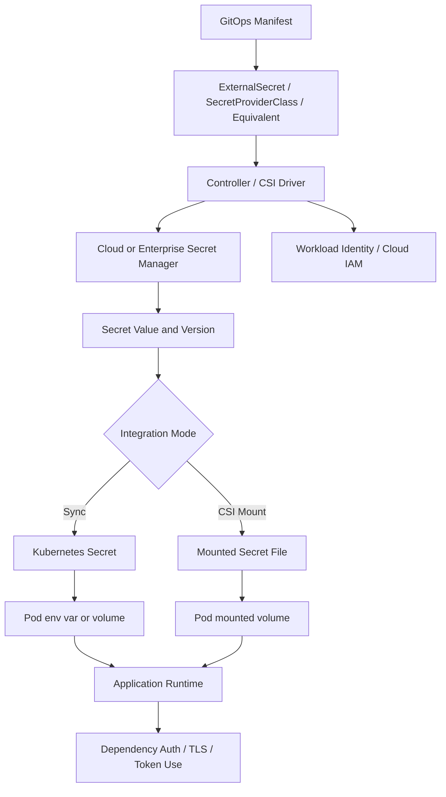
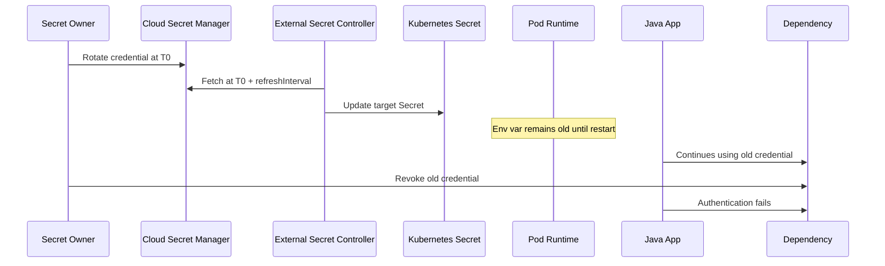
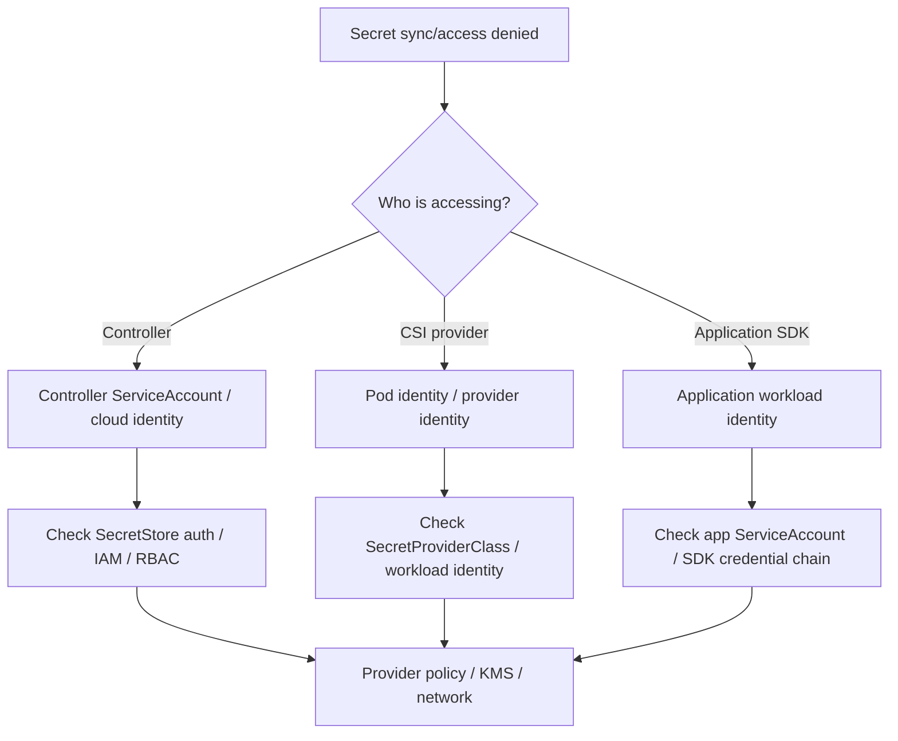
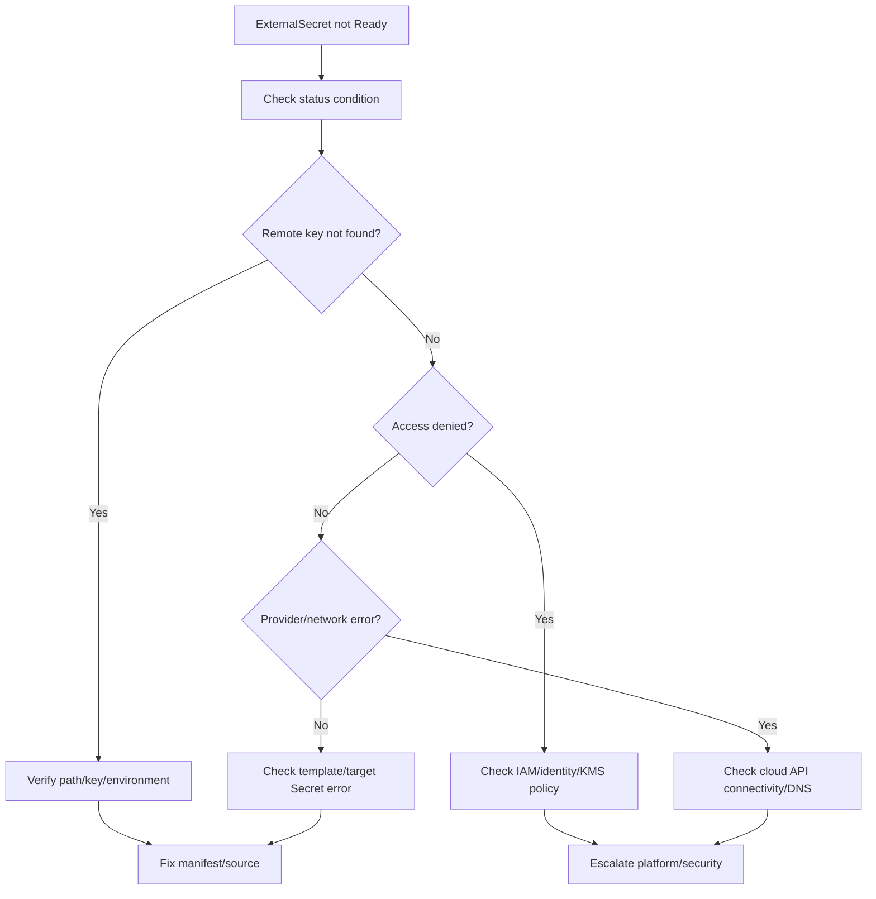
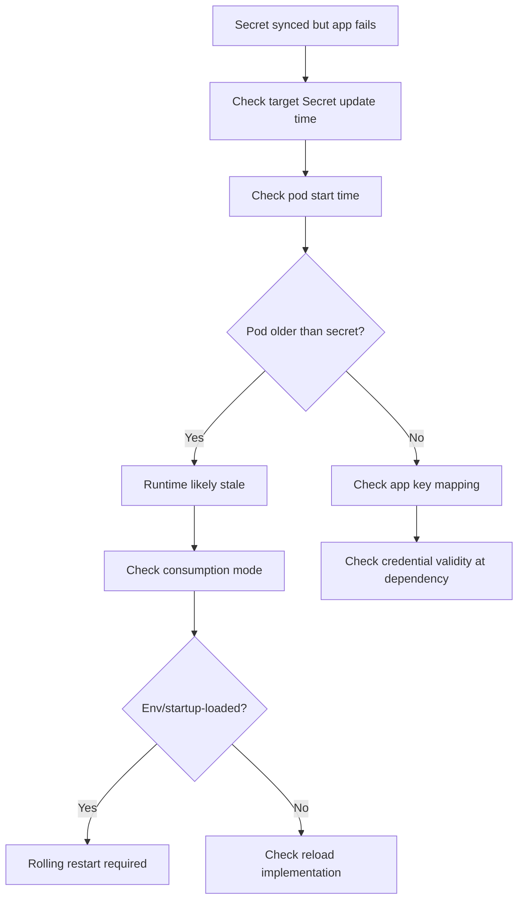
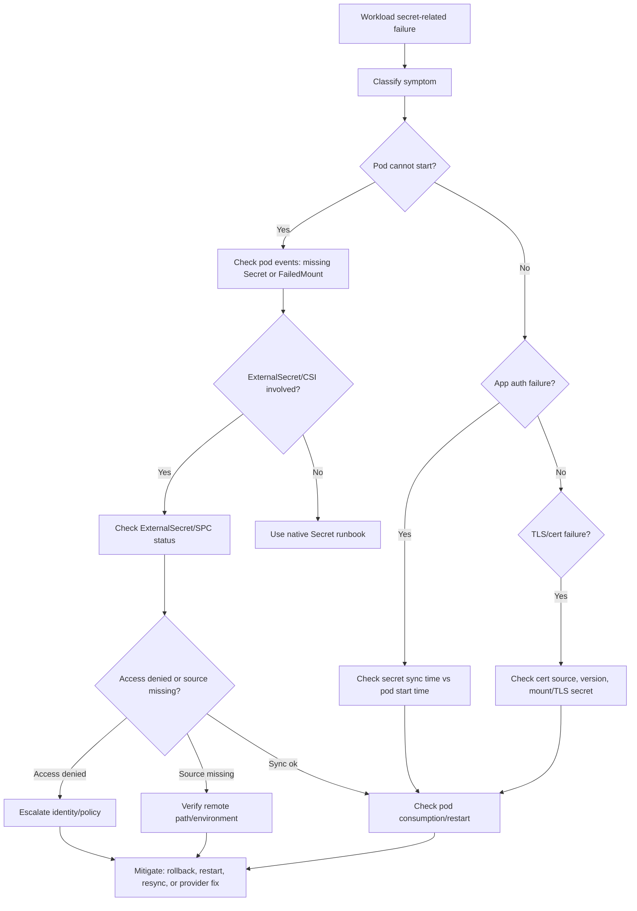

# Part 032 — External Secrets and Cloud Secret Integration

Native Kubernetes Secret is often not the source of truth in enterprise systems.

In production environments, the real source of sensitive values is usually outside the cluster:

- AWS Secrets Manager;
- AWS Systems Manager Parameter Store;
- Azure Key Vault;
- HashiCorp Vault;
- enterprise vault platform;
- corporate PKI;
- certificate automation system;
- centralized credential broker;
- security-owned secret lifecycle service.

Kubernetes then receives or projects those values through an integration layer such as:

- External Secrets Operator;
- Secrets Store CSI Driver;
- cert-manager;
- SealedSecrets;
- SOPS-based GitOps;
- cloud-specific workload identity;
- platform-managed sync controller.

Operational invariant:

```text
When a Kubernetes Secret is externally managed, the Kubernetes Secret is an output, not the source of truth.
```

Part ini membahas cara backend engineer memahami dan men-debug external secret integration tanpa mengarang detail internal cluster. Untuk CSG atau environment enterprise apa pun, detail provider, controller, policy, repo, namespace, dan rotation process harus diverifikasi internal.

---

## 1. Why External Secret Integration Exists

Native Kubernetes Secret has limitations:

- raw value can be exposed by anyone with read access;
- base64 is not encryption;
- GitOps wants manifests in Git but raw secrets should not be in Git;
- rotation needs central control;
- audit may need to happen in enterprise secret manager;
- cloud services often integrate with cloud IAM;
- compliance may require centralized policy and access review;
- multiple clusters/environments need consistent secret distribution.

External secret integration separates:

```text
secret source of truth = enterprise/cloud secret manager
Kubernetes Secret      = runtime projection/sync artifact
Pod                    = consumer
Application            = runtime user of the secret
```

This improves governance, but adds new failure modes:

- controller down;
- sync lag;
- wrong source path;
- access denied;
- workload identity failure;
- secret version mismatch;
- provider throttling;
- cloud network/DNS issue;
- stale Kubernetes Secret;
- pod not restarted after sync;
- GitOps drift between ExternalSecret manifest and provider value.

---

## 2. External Secret Runtime Flow



Key operational question:

```text
Where did the secret fail: source, identity, sync, Kubernetes object, pod projection, application consumption, or dependency auth?
```

That question prevents random debugging.

---

## 3. Integration Pattern: External Secrets Operator

External Secrets Operator style systems usually work like this:

```text
ExternalSecret custom resource -> controller fetches remote secret -> controller writes Kubernetes Secret -> pod consumes Kubernetes Secret
```

Typical manifest shape:

```yaml
apiVersion: external-secrets.io/v1beta1
kind: ExternalSecret
metadata:
  name: quote-service-db-secret
spec:
  refreshInterval: 1h
  secretStoreRef:
    name: team-secret-store
    kind: SecretStore
  target:
    name: quote-service-db-secret
  data:
    - secretKey: password
      remoteRef:
        key: /prod/quote-service/db
        property: password
```

Operational objects to understand:

- `ExternalSecret` describes what to sync;
- `SecretStore` or `ClusterSecretStore` describes where to fetch from;
- target Kubernetes `Secret` is generated or updated;
- controller manages status and conditions;
- cloud identity decides whether fetch is allowed.

Important distinction:

```text
ExternalSecret healthy does not guarantee the running pod has restarted or reloaded the new value.
```

Backend engineer should inspect:

- ExternalSecret status;
- refresh interval;
- target Secret name;
- remote key/path;
- property mapping;
- last sync time;
- error condition;
- target Secret resourceVersion;
- pod start time;
- application runtime behavior.

---

## 4. Integration Pattern: Secrets Store CSI Driver

Secrets Store CSI Driver style systems usually work like this:

```text
SecretProviderClass -> CSI driver fetches remote secret -> mounts secret into pod filesystem
```

Optional sync can also create a Kubernetes Secret.

Typical shape:

```yaml
apiVersion: secrets-store.csi.x-k8s.io/v1
kind: SecretProviderClass
metadata:
  name: quote-service-secrets
spec:
  provider: aws # or azure, vault, etc.
  parameters:
    objects: |
      - objectName: "prod/quote-service/db-password"
        objectType: "secretsmanager"
```

Pod reference:

```yaml
volumes:
  - name: secrets-store
    csi:
      driver: secrets-store.csi.k8s.io
      readOnly: true
      volumeAttributes:
        secretProviderClass: quote-service-secrets
```

Properties:

- secret may not exist as normal Kubernetes Secret unless sync is configured;
- value is mounted as file;
- failure may appear as `FailedMount`;
- rotation behavior depends on driver/provider/config;
- app reload is still separate.

Common symptom:

```text
Pod is Pending or ContainerCreating because secret volume cannot mount.
```

Investigation usually starts with:

```bash
kubectl describe pod <pod-name> -n <namespace>
kubectl get secretproviderclass -n <namespace>
kubectl describe secretproviderclass <name> -n <namespace>
```

Provider-specific details require internal/platform verification.

---

## 5. Integration Pattern: AWS Secrets Manager

AWS Secrets Manager is commonly used for:

- database credentials;
- API keys;
- OAuth client secrets;
- rotated credentials;
- structured secret JSON;
- cross-service integration tokens.

Kubernetes integration usually depends on:

- IRSA on EKS;
- IAM role and trust policy;
- OIDC provider;
- External Secrets Operator provider configuration;
- Secrets Store CSI provider for AWS;
- AWS SDK credential chain if the app fetches secret directly.

Operational failure modes:

- IAM role missing permission;
- wrong trust policy;
- ServiceAccount annotation missing/wrong;
- OIDC provider mismatch;
- secret ARN/path wrong;
- region wrong;
- KMS decrypt denied;
- secret version/stage wrong;
- network path to AWS API blocked;
- VPC endpoint missing or DNS broken;
- provider throttling;
- old secret version still referenced.

Backend engineer usually should not fetch AWS secrets directly from app unless that is the agreed architecture. If app does fetch directly, then application code owns more of the secret lifecycle and error handling.

Questions to verify internally:

- Are secrets synced into Kubernetes or fetched directly by app?
- Is IRSA used?
- Which ServiceAccount maps to which IAM role?
- Is KMS permission required?
- Are VPC endpoints required for private clusters?
- How are secret versions/stages managed?
- Does rotation trigger pod restart?

---

## 6. Integration Pattern: AWS SSM Parameter Store

AWS Systems Manager Parameter Store is often used for:

- configuration parameters;
- secure strings;
- environment-specific values;
- less frequently rotated values;
- hierarchical parameter paths.

Operational concerns:

- parameter path mismatch;
- SecureString decrypt permission;
- KMS denied;
- region mismatch;
- stale cached value;
- throttling/limits;
- inconsistent hierarchy across environments;
- confusion between ConfigMap-like data and Secret-like data.

Backend review question:

```text
Is this value operationally a secret, or just configuration?
```

If it is sensitive, treat it with Secret handling even if the provider calls it a parameter.

---

## 7. Integration Pattern: Azure Key Vault

Azure Key Vault is commonly used for:

- secrets;
- certificates;
- keys;
- TLS material;
- application credentials;
- integration credentials.

AKS integration usually depends on:

- Azure Workload Identity;
- managed identity;
- federated credential;
- Key Vault CSI driver;
- External Secrets provider for Azure;
- Azure RBAC or Key Vault access policy;
- private endpoint and private DNS zone for private access.

Operational failure modes:

- federated credential mismatch;
- ServiceAccount annotation missing/wrong;
- managed identity lacks permission;
- Key Vault firewall blocks access;
- private endpoint DNS wrong;
- secret name/version wrong;
- certificate format mismatch;
- tenant/subscription mismatch;
- token acquisition failure;
- provider pod cannot reach Key Vault.

Questions to verify internally:

- Is Azure Workload Identity used or older identity mechanism?
- Is Key Vault accessed through public endpoint or private endpoint?
- Is permission model Azure RBAC or vault access policy?
- Are secrets mounted via CSI or synced to Kubernetes Secret?
- How is rotation propagated?
- Who owns Key Vault policy changes?

---

## 8. Source of Truth vs Runtime Artifact

External secret systems create multiple objects that can drift:

```text
Remote secret source
ExternalSecret / SecretProviderClass manifest
Kubernetes Secret or mounted file
Pod runtime env/file
Application in-memory credential
Dependency-side accepted credential
```

These can disagree.

Example failure:

```text
AWS Secrets Manager has new password.
ExternalSecret synced Kubernetes Secret.
Pod env var still has old password because it has not restarted.
Database revoked old password.
Application starts failing authentication.
```

Another example:

```text
Azure Key Vault has correct certificate.
SecretProviderClass references wrong secret version.
Pod mounts old certificate.
Ingress/app TLS handshake fails.
```

Operational invariant:

```text
Always locate the stale layer.
Do not assume the layer you checked is the layer the application is using.
```

---

## 9. Status and Conditions

External secret controllers usually expose status conditions.

For an ExternalSecret-style resource, inspect:

```bash
kubectl get externalsecret -n <namespace>
kubectl describe externalsecret <name> -n <namespace>
```

Look for:

- Ready condition;
- last sync time;
- refresh interval;
- error message;
- target Secret name;
- SecretStore reference;
- provider auth failure;
- remote key not found;
- permission denied;
- conversion/template error.

For SecretStore/ClusterSecretStore:

```bash
kubectl get secretstore -n <namespace>
kubectl describe secretstore <name> -n <namespace>
kubectl get clustersecretstore
kubectl describe clustersecretstore <name>
```

Look for:

- provider type;
- auth method;
- namespace scope;
- readiness;
- controller errors;
- ownership boundary.

For CSI:

```bash
kubectl describe pod <pod-name> -n <namespace>
kubectl get secretproviderclass -n <namespace>
kubectl describe secretproviderclass <name> -n <namespace>
```

Look for:

- FailedMount events;
- provider error;
- identity error;
- object not found;
- permission denied;
- rotation/reconcile logs if accessible.

---

## 10. Sync Interval and Rotation Behavior

Sync interval is an operational contract.

Questions:

- How often does controller fetch remote value?
- Is the interval acceptable for rotation policy?
- Is there jitter/backoff?
- Is there manual refresh?
- Does sync update Kubernetes Secret metadata?
- Does update trigger Deployment rollout?
- Does application reload?
- Is old credential kept valid during propagation?

Timeline example:



If the app consumes secrets through env vars, sync interval alone is not enough. Restart/reload must be part of rotation.

---

## 11. Secret Versioning

Cloud secret managers often support versions.

Version concepts may include:

- latest version;
- explicit version ID;
- version stage/label;
- enabled/disabled versions;
- current/previous labels;
- certificate version;
- key version.

Operational risks:

- ExternalSecret references `latest`, causing unexpected update;
- ExternalSecret pins old version, causing stale runtime;
- rotation changes version but not stage;
- old version disabled before pods reload;
- rollback needs old credential but old version revoked;
- certificate version changes but trust chain changes too.

Backend engineer does not need to own version policy, but must ask:

```text
During deployment rollback, are secret versions backward-compatible?
```

This matters for database migrations, API credential rotations, TLS changes, and event consumer credentials.

---

## 12. Access Denied Debugging Model

Access denied can occur at multiple layers.



Do not assume the application identity is used. In many external secret patterns, the controller identity fetches the secret, not the app identity.

Layer questions:

- Is Kubernetes RBAC denying access to Secret object?
- Is cloud IAM denying remote secret access?
- Is KMS/Key Vault key permission denying decrypt?
- Is network blocking cloud secret API?
- Is DNS resolving private endpoint correctly?
- Is token expired or not projected?
- Is ServiceAccount annotation correct?
- Is provider region/tenant/subscription correct?

---

## 13. Direct App Fetch vs Kubernetes Projection

Two patterns exist.

### Pattern A — Kubernetes projection

```text
App reads env/file from pod.
Controller/CSI fetches remote secret.
```

Pros:

- app is simpler;
- cloud SDK not needed for secret retrieval;
- centralized sync policy;
- easier GitOps integration.

Cons:

- app may require restart;
- Kubernetes Secret may contain secret value;
- controller becomes dependency;
- sync lag matters.

### Pattern B — application fetches directly

```text
App uses cloud SDK or vault client to fetch secret at runtime.
```

Pros:

- app can implement reload/caching;
- Kubernetes Secret may not store value;
- can fetch dynamic credentials.

Cons:

- app owns more security logic;
- cloud identity must be correct;
- startup depends on cloud secret manager;
- network/DNS failure impacts app startup;
- caching/refresh bugs become app bugs;
- more complex testing.

Backend architecture review should decide consciously, not accidentally.

---

## 14. Java/JAX-RS Impact

External secrets affect Java services through three main paths:

1. secret is injected as env var;
2. secret is mounted as file;
3. app fetches secret through SDK/client.

### Env var injection

Most common and simplest.

Risk:

- no live update;
- restart required;
- config dump leakage;
- old pods using old value.

### File mount

Useful for:

- TLS certificates;
- truststores;
- keystores;
- token files;
- structured config.

Risk:

- Java often loads truststore/keystore at startup;
- mounted file updates but app keeps old SSL context;
- reload code must be tested.

### Direct SDK fetch

Useful for dynamic secrets but operationally heavier.

Risk:

- SDK credential chain misconfigured;
- startup fails if cloud secret API unavailable;
- retries may delay readiness;
- secret fetch latency affects cold start;
- missing cache causes provider throttling;
- secret value may accidentally be logged in exception path.

Recommended operational posture:

```text
For most backend services, prefer platform-managed projection unless dynamic retrieval is a deliberate architecture decision.
```

---

## 15. Dependency-Specific External Secret Concerns

### PostgreSQL

External source may rotate DB password.

Risks:

- DB password changed but pods not restarted;
- new credential lacks grants;
- old credential revoked too early;
- connection pool keeps old sessions;
- migration job uses different secret than app;
- read/write service uses wrong credential.

Checklist:

- source path per environment;
- target Secret name;
- key mapping;
- rotation overlap;
- rollout/restart trigger;
- DB grants;
- migration job credential alignment.

### Kafka

External secret may contain SASL/SCRAM credentials or cert material.

Risks:

- consumer cannot authenticate;
- lag grows;
- rolling restart causes rebalance plus auth failures;
- producer failures increase API latency;
- schema registry credential out of sync.

Checklist:

- broker credential source;
- topic/environment mapping;
- cert/truststore rotation;
- consumer lag alert;
- rollout pace;
- old credential revocation timing.

### RabbitMQ

Risks:

- queue consumer reconnect loop;
- vhost permission mismatch;
- old credential revoked before pods reconnect;
- DLQ spike due to auth/retry failure;
- management API credential mismatch.

Checklist:

- vhost permissions;
- connection metrics;
- queue depth;
- prefetch/concurrency;
- credential overlap.

### Redis

Risks:

- cache auth failure;
- fallback to DB overload;
- old pool connections kept;
- ACL username/password mismatch;
- TLS cert mismatch.

Checklist:

- ACL user;
- password version;
- cache fallback behavior;
- DB impact if Redis unavailable;
- connection pool reconnection.

### Camunda

Risks:

- worker API token invalid;
- job activation stops;
- incidents grow;
- workflow completion latency increases;
- old worker pods continue with old token.

Checklist:

- worker credential source;
- token expiry;
- concurrency impact during restart;
- incident dashboard;
- process correlation.

---

## 16. Common Failure: ExternalSecret Not Ready

Symptoms:

- ExternalSecret status not Ready;
- target Kubernetes Secret missing;
- pod cannot start;
- controller logs show provider error;
- GitOps app healthy but workload fails.

Safe investigation:

```bash
kubectl get externalsecret -n <namespace>
kubectl describe externalsecret <name> -n <namespace>
kubectl get secretstore -n <namespace>
kubectl describe secretstore <name> -n <namespace>
kubectl get secret <target-secret> -n <namespace>
kubectl describe pod <pod-name> -n <namespace>
```

Decision flow:



Mitigation:

- rollback manifest if bad path/key introduced;
- restore prior ExternalSecret reference;
- escalate IAM/provider issue;
- avoid manual Secret patch unless break-glass approved;
- verify target Secret and pod restart behavior after fix.

---

## 17. Common Failure: CSI Secret Mount Failed

Symptoms:

- pod stuck in `ContainerCreating`;
- pod event `FailedMount`;
- volume mount error mentions provider;
- SecretProviderClass not found;
- identity/access denied error.

Safe investigation:

```bash
kubectl describe pod <pod-name> -n <namespace>
kubectl get secretproviderclass -n <namespace>
kubectl describe secretproviderclass <name> -n <namespace>
kubectl get events -n <namespace> --sort-by=.lastTimestamp
```

Look for:

- SecretProviderClass name mismatch;
- provider object path mismatch;
- permission denied;
- Key Vault/Secrets Manager not reachable;
- private DNS issue;
- node/CSI driver issue;
- provider daemonset health issue.

Backend action:

- confirm pod spec reference;
- confirm namespace;
- confirm recent manifest change;
- collect event evidence;
- escalate CSI/provider/identity issues to platform/SRE;
- avoid changing unrelated app code.

---

## 18. Common Failure: Secret Synced but App Still Fails

This is common after rotation.

Symptoms:

- ExternalSecret Ready;
- target Secret updated;
- app still gets auth failure;
- only pods older than update fail;
- rollout restart fixes problem;
- dependency shows old username/password/token usage.

Flow:



Mitigation:

- perform controlled rolling restart if approved;
- verify dependency capacity for reconnect spike;
- check rollback path;
- coordinate revocation window;
- add restart trigger/checksum if missing.

---

## 19. Common Failure: Access Denied to Cloud Secret

Symptoms:

- ExternalSecret condition shows access denied;
- CSI mount fails with permission denied;
- app logs show cloud SDK access denied;
- KMS decrypt denied;
- Key Vault forbidden;
- AWS STS assume role failure;
- Azure token/federated credential failure.

Layered checklist:

### Kubernetes layer

- correct namespace;
- correct ServiceAccount;
- correct annotation;
- correct SecretStore reference;
- correct SecretProviderClass;
- correct RBAC if controller requires it.

### Cloud identity layer

- EKS IRSA trust policy;
- EKS OIDC provider;
- AWS IAM role permission;
- Azure federated credential;
- Azure managed identity;
- Azure RBAC / Key Vault access policy;
- token audience/issuer/subject.

### Cloud secret layer

- secret exists;
- path/name correct;
- version/stage correct;
- KMS/key permission correct;
- network/firewall allows access;
- region/tenant/subscription correct.

Escalate quickly if identity/policy is owned by platform/security.

---

## 20. Common Failure: Wrong Environment Secret

This is high-risk.

Symptoms:

- production app connects to staging dependency;
- staging app connects to production dependency;
- auth works but data is wrong;
- integration behavior is inconsistent;
- audit/compliance incident risk.

Causes:

- wrong Helm values;
- wrong Kustomize overlay;
- wrong ExternalSecret remote key;
- copied namespace Secret;
- shared SecretStore without environment guardrails;
- GitOps app points to wrong branch/path;
- manual emergency patch.

Detection:

- compare remote path/environment;
- check rendered manifest;
- check dependency endpoint config;
- check application startup metadata;
- check deployment annotations;
- check source-of-truth owner.

Mitigation:

- stop traffic if data contamination risk exists;
- notify incident/security if cross-environment data exposure possible;
- rollback config;
- rotate exposed credentials if needed;
- audit access and data impact;
- add environment guardrails.

---

## 21. Production-Safe Commands

Use these for structure/status investigation:

```bash
# External Secrets Operator style
kubectl get externalsecret -n <namespace>
kubectl describe externalsecret <name> -n <namespace>
kubectl get secretstore -n <namespace>
kubectl describe secretstore <name> -n <namespace>
kubectl get clustersecretstore
kubectl describe clustersecretstore <name>

# Target secret metadata only
kubectl get secret <target-secret> -n <namespace>
kubectl describe secret <target-secret> -n <namespace>

# Pod and event evidence
kubectl describe pod <pod-name> -n <namespace>
kubectl get events -n <namespace> --sort-by=.lastTimestamp

# CSI style
kubectl get secretproviderclass -n <namespace>
kubectl describe secretproviderclass <name> -n <namespace>

# Rollout relationship
kubectl rollout status deploy/<deploy-name> -n <namespace>
kubectl get pod -n <namespace> -l app.kubernetes.io/name=<app> -o wide
```

Avoid normalizing unsafe habits:

```bash
kubectl get secret <name> -o yaml
kubectl get secret <name> -o jsonpath='{.data.password}' | base64 -d
cat /mnt/secrets-store/password
printenv | grep PASSWORD
```

If a file exists check is needed, prefer non-value inspection:

```bash
kubectl exec <pod> -n <namespace> -- ls -l /mnt/secrets-store
```

Even file names can be sensitive in some organizations; follow internal policy.

---

## 22. Observability Signals

External secret integration needs observability at multiple layers.

### Controller/platform signals

- sync success/failure count;
- sync latency;
- last sync timestamp;
- provider error rate;
- access denied count;
- remote key not found count;
- controller pod health;
- CSI mount failure events;
- provider API throttling;
- cloud API latency.

### Kubernetes signals

- ExternalSecret Ready condition;
- SecretStore Ready condition;
- target Secret update time;
- pod FailedMount events;
- CreateContainerConfigError;
- rollout stuck;
- pod restart count;
- readiness failures.

### Application signals

- dependency auth failures;
- TLS handshake failures;
- startup config errors;
- connection pool failures;
- Kafka/RabbitMQ consumer disconnected;
- Redis auth errors;
- Camunda worker activation errors;
- error rate and latency spike.

### Dependency signals

- database authentication failures;
- broker authentication failures;
- Key Vault/Secrets Manager audit events;
- KMS decrypt failures;
- cloud identity denied events;
- external API unauthorized responses.

---

## 23. Alert Design

Useful alerts:

- ExternalSecret not Ready for critical service;
- SecretStore/ClusterSecretStore not Ready;
- CSI mount failure for critical pod;
- target Secret not updated within expected interval;
- certificate near expiry;
- access denied to secret provider;
- sudden spike in dependency auth failures;
- rollout stuck due to missing Secret;
- pods running older than last critical secret rotation;
- cloud secret provider API errors.

Avoid noisy alerts:

- every minor sync retry without customer impact;
- non-critical dev namespace sync delay;
- raw secret value mismatch checks;
- alerts without owner/runbook;
- provider-level alerts routed to backend team when platform owns them.

Good alert contains:

- affected namespace;
- ExternalSecret/SecretProviderClass name;
- target Secret name if allowed;
- affected workload;
- last sync time;
- error category;
- dashboard link;
- runbook link;
- escalation owner.

---

## 24. GitOps Review Checklist

For ExternalSecret manifests:

- correct namespace;
- correct SecretStore/ClusterSecretStore;
- correct target Secret name;
- correct remote key/path;
- correct property mapping;
- refresh interval reasonable;
- target template safe;
- no raw secret values;
- labels/annotations include owner/environment;
- rollback behavior understood;
- environment overlay correct;
- controller ownership clear.

For SecretProviderClass:

- correct provider;
- correct object name/path;
- correct object type;
- correct version if pinned;
- correct mount path in Deployment;
- correct ServiceAccount/workload identity;
- rotation behavior known;
- optional sync-to-Secret behavior known;
- failure mode documented.

For Deployment:

- references target Secret correctly;
- env var names match app config;
- mount path matches app config;
- restart trigger exists if required;
- readiness handles missing/invalid credential safely;
- no broad secret RBAC granted to app;
- logs and config dumps redact values.

---

## 25. Rollback Considerations

Rollback is not always enough for secret changes.

Cases where rollback works:

- manifest points to wrong Secret name;
- wrong key mapping introduced;
- wrong mount path introduced;
- wrong ExternalSecret remote path introduced and previous path still valid;
- wrong SecretProviderClass introduced.

Cases where rollback may not work:

- old credential revoked;
- DB password changed without overlap;
- token version disabled;
- certificate replaced and old cert expired;
- cloud IAM policy changed;
- source secret overwritten;
- provider-side rotation is irreversible;
- app rollback expects old secret schema.

Release safety question:

```text
Can we roll back application version independently from secret version?
```

For critical workloads, secret rotation and application rollout should be coordinated like database migrations.

---

## 26. EKS-Specific Verification

For EKS, verify internally:

- whether IRSA is used;
- ServiceAccount annotation for IAM role;
- IAM trust policy subject matches namespace/serviceaccount;
- OIDC provider exists and matches cluster;
- IAM role policy permits `secretsmanager:GetSecretValue` or `ssm:GetParameter` as needed;
- KMS decrypt permission exists if required;
- region is correct;
- AWS Secrets Manager vs SSM usage;
- VPC endpoint required for private clusters;
- DNS resolution to AWS endpoints;
- CloudTrail access denied evidence;
- External Secrets controller identity vs workload identity.

Backend engineer should collect evidence, not rewrite IAM during incident unless explicitly authorized.

---

## 27. AKS-Specific Verification

For AKS, verify internally:

- whether Azure Workload Identity is used;
- ServiceAccount annotation/client ID;
- federated credential issuer/subject/audience;
- managed identity assignment;
- Key Vault permission model: Azure RBAC or access policy;
- Key Vault firewall/private endpoint;
- private DNS zone linkage;
- tenant/subscription/resource group;
- Key Vault CSI driver usage;
- secret version/certificate format;
- Azure Monitor or audit evidence;
- controller identity vs workload identity.

Backend engineer should know how to identify access denied and escalate with precise evidence.

---

## 28. On-Prem and Hybrid Verification

For on-prem/hybrid Kubernetes, verify internally:

- enterprise vault provider;
- corporate DNS;
- internal CA;
- proxy settings;
- NO_PROXY for vault/cloud endpoints;
- firewall allowlist;
- air-gapped secret sync pattern;
- outbound connectivity from nodes/pods;
- certificate trust chain;
- vault auth method;
- token renewal behavior;
- rotation process;
- DR process for vault/secret manager.

Hybrid failure often appears as:

- DNS timeout;
- TLS trust failure;
- proxy auth failure;
- firewall timeout;
- expired vault token;
- internal CA mismatch;
- cloud private endpoint unreachable.

---

## 29. Security and Privacy Concerns

External secret integration reduces some risks but introduces others.

Security concerns:

- controller identity too broad;
- ClusterSecretStore exposes secrets across namespaces;
- multiple teams can reference shared store;
- remote paths not environment-scoped;
- secret value synced into Kubernetes when CSI-only would suffice;
- logs expose provider error with sensitive path;
- raw values in GitOps templates;
- lack of access audit;
- stale credentials after rotation;
- provider policy not least privilege.

Privacy/compliance concerns:

- secrets may unlock regulated data;
- cross-environment secret mix can expose customer data;
- incident evidence may contain sensitive metadata;
- audit records must identify who accessed/rotated secret;
- data residency may matter for cloud secret provider;
- support bundles must redact mounted secret paths/values.

Backend engineer action:

- do not expand access during debugging;
- do not decode secrets casually;
- use metadata/status first;
- escalate policy changes;
- document secret dependency in readiness/runbook.

---

## 30. Production Runbook: External Secret Failure



Evidence to collect:

- workload name;
- namespace;
- pod event;
- ExternalSecret/SecretProviderClass name;
- target Secret name;
- last sync time;
- pod start time;
- recent deployment/change;
- sanitized error message;
- dependency auth/TLS signal;
- owner/escalation group.

---

## 31. Internal Verification Checklist

Verify for your environment:

- which external secret integration is used;
- External Secrets Operator version and owner;
- Secrets Store CSI Driver usage and owner;
- cert-manager usage and owner;
- AWS Secrets Manager usage;
- AWS SSM Parameter Store usage;
- Azure Key Vault usage;
- HashiCorp Vault or enterprise vault usage;
- SecretStore vs ClusterSecretStore policy;
- namespace isolation policy;
- remote secret naming convention;
- environment path convention;
- refresh interval standard;
- rotation process;
- restart/reload process;
- old credential overlap window;
- alerting for sync failure;
- alerting for access denied;
- alerting for cert expiry;
- GitOps source of ExternalSecret manifests;
- PR review owner;
- break-glass manual Secret policy;
- audit log location;
- support bundle redaction;
- who can decode production secrets;
- cloud IAM owner;
- KMS/Key Vault key owner;
- private endpoint/DNS owner;
- incident escalation path.

For each workload, verify:

- required external secret references;
- target Kubernetes Secret names;
- mounted file paths;
- env var names;
- ServiceAccount identity;
- remote key/path;
- version behavior;
- rotation behavior;
- restart trigger;
- dependency credential mapping;
- dashboard and alert coverage;
- runbook link.

---

## 32. Summary

External secret integration moves secret ownership outside Kubernetes, but it does not remove operational complexity.

It creates a chain:

```text
cloud/enterprise secret source
-> identity and policy
-> sync/projection controller
-> Kubernetes Secret or mounted file
-> pod runtime
-> Java application
-> dependency authentication
```

The most important debugging skill is locating the failed or stale layer.

Key invariants:

```text
External source updated does not mean Kubernetes Secret updated.
Kubernetes Secret updated does not mean pod runtime updated.
Pod runtime updated does not mean Java client reloaded.
Java client reloaded does not mean dependency accepts the credential.
```

For senior backend engineers, the goal is not to become the vault administrator. The goal is to understand enough of the chain to prevent bad PRs, debug incidents cleanly, and escalate to platform/SRE/security with precise evidence.

