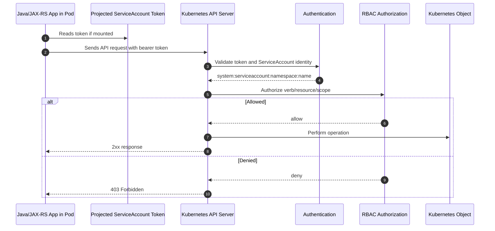
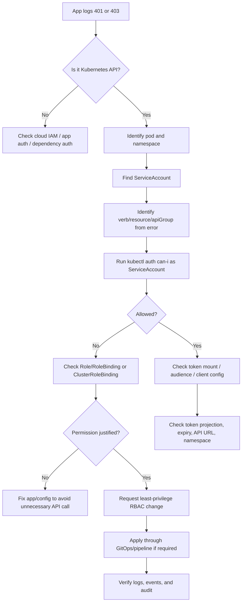

# Part 033 — ServiceAccount and RBAC Operations

In Kubernetes, not every pod should be treated as the same actor.

Every backend workload that talks to the Kubernetes API, consumes projected tokens, integrates with cloud identity, reads mounted secrets, or is governed by policy needs a clear identity boundary.

The core operational invariant:

```text
A Pod runs as a ServiceAccount.
A ServiceAccount receives permissions through RBAC.
RBAC determines what Kubernetes API actions that workload can perform.
```

This sounds simple, but production failures around ServiceAccount and RBAC are often misdiagnosed as:

- application bugs;
- missing config;
- bad Secret;
- cloud IAM problem;
- network failure;
- GitOps drift;
- platform outage.

Part ini membahas ServiceAccount dan RBAC dari sudut pandang senior backend engineer: apa yang harus dipahami, apa yang aman diinvestigasi, bagaimana membaca permission failure, dan kapan harus eskalasi ke platform/SRE/security.

Untuk CSG atau environment enterprise apa pun, detail namespace, ServiceAccount naming, RoleBinding pattern, admission policy, workload identity convention, break-glass policy, dan audit mechanism harus diverifikasi internal.

---

## 1. Why ServiceAccount and RBAC Matter Operationally

ServiceAccount and RBAC matter because they control what a workload can do inside Kubernetes.

For backend engineers, this becomes important when a service:

- reads Kubernetes API objects;
- discovers pods/services dynamically;
- runs leader election through ConfigMap or Lease objects;
- creates Jobs or CronJobs;
- reads Secrets or ConfigMaps;
- watches custom resources;
- integrates with service mesh sidecars;
- uses external secrets controllers;
- uses workload identity mapping;
- is blocked by admission/security policy;
- runs operational automation inside the cluster.

Most Java/JAX-RS backend services should not need broad Kubernetes API access.

A typical REST API service should usually only need:

```text
ServiceAccount identity for pod runtime
+ cloud workload identity if it accesses cloud services
+ no direct Kubernetes API permissions unless explicitly required
```

A service that requires broad Kubernetes permissions should trigger architectural review.

---

## 2. The Core Objects

ServiceAccount and RBAC are composed from a small set of Kubernetes objects.

| Object | Scope | Purpose | Backend engineer concern |
|---|---:|---|---|
| `ServiceAccount` | Namespace | Identity used by pods | Which identity does my workload run as? |
| `Role` | Namespace | Namespaced permission set | What can this workload do inside one namespace? |
| `ClusterRole` | Cluster | Cluster-scoped or reusable permission set | Is this too broad? |
| `RoleBinding` | Namespace | Grants Role/ClusterRole to subject in a namespace | Who receives permissions? |
| `ClusterRoleBinding` | Cluster | Grants ClusterRole cluster-wide | High-risk; usually platform/security-owned |
| Token projection | Pod | Provides token to workload | Is token mounted? Is it needed? |
| `automountServiceAccountToken` | Pod/SA | Controls token auto-mounting | Should this workload receive a token at all? |

Operational shorthand:

```text
ServiceAccount = identity
Role/ClusterRole = permission definition
RoleBinding/ClusterRoleBinding = permission assignment
```

---

## 3. Mental Model: Pod Identity to API Authorization

When a pod calls the Kubernetes API, the request flows through authentication and authorization.



Important distinction:

```text
401 Unauthorized = identity/authentication problem
403 Forbidden    = identity authenticated, but not authorized
```

A backend engineer should avoid treating every 403 as "Kubernetes is down".

Most 403 errors mean:

```text
the workload identity exists, but does not have permission for that action
```

---

## 4. Backend Engineer Responsibility

Backend engineers usually own:

- understanding which ServiceAccount the workload uses;
- knowing whether the application actually needs Kubernetes API access;
- ensuring the app does not require unnecessary broad permissions;
- reviewing Helm/Kustomize manifests for ServiceAccount usage;
- validating that RBAC aligns with runtime behavior;
- checking permission errors in application logs;
- providing clear evidence when asking platform/security for permission changes;
- ensuring code handles authorization failures explicitly;
- avoiding direct reads of Kubernetes Secrets from application code unless intentionally designed;
- ensuring cloud identity integration uses the correct workload identity mapping.

A backend engineer should be able to answer:

```text
What identity does my workload run as?
What Kubernetes API permissions does it need?
Why does it need those permissions?
What breaks if those permissions are removed?
What is the smallest permission set that works?
```

---

## 5. Platform/SRE Responsibility

Platform/SRE usually owns:

- cluster-wide RBAC conventions;
- namespace bootstrap policies;
- service account provisioning patterns;
- admission control policies;
- GitOps reconciliation of RBAC objects;
- break-glass access mechanism;
- audit log integration;
- cluster role templates;
- controller/operator permissions;
- default ServiceAccount hardening;
- cluster upgrade impact on RBAC APIs;
- platform documentation for safe access.

Backend engineers should not invent their own cluster-wide permission model in isolation.

If a service needs a `ClusterRoleBinding`, that should be treated as a serious platform/security discussion.

---

## 6. Security Team Responsibility

Security usually owns or co-owns:

- least privilege standard;
- production access review;
- privileged workload approval;
- secret access policy;
- audit evidence policy;
- break-glass procedure;
- exception process;
- compliance mapping;
- sensitive namespace restrictions;
- service account token policies;
- cloud IAM mapping standards;
- workload identity trust boundaries.

Operational rule:

```text
Permission expansion is a security change, not just a deployment fix.
```

During incidents, permission changes may be required, but they should still be traceable, time-bounded, and reviewed after mitigation.

---

## 7. Application Workload Responsibility

The workload itself should:

- fail with clear error messages when permission is denied;
- avoid logging raw tokens;
- avoid dumping environment variables that may include credentials;
- use official client libraries responsibly;
- retry authorization failures carefully, not infinitely;
- expose health endpoints that do not require Kubernetes API access unless intended;
- not depend on broad Kubernetes list/watch permissions for core request handling unless justified;
- not use admin kubeconfig inside containers;
- avoid embedding cluster credentials in ConfigMaps or Secrets.

A Java/JAX-RS service should not require cluster-admin-like access to serve normal HTTP requests.

---

## 8. ServiceAccount Operations

A pod uses a ServiceAccount through the pod spec:

```yaml
spec:
  serviceAccountName: quote-order-api
```

If omitted, Kubernetes uses the namespace default ServiceAccount.

That is often dangerous because it makes workload identity implicit.

Production preference:

```text
Each production workload should use an explicit ServiceAccount.
```

Good pattern:

```yaml
apiVersion: v1
kind: ServiceAccount
metadata:
  name: quote-order-api
  namespace: quote-prod
  labels:
    app.kubernetes.io/name: quote-order-api
    app.kubernetes.io/part-of: quote-order
    app.kubernetes.io/managed-by: gitops
```

Risky pattern:

```yaml
spec:
  # no serviceAccountName
```

Why risky:

- identity is implicit;
- audit becomes unclear;
- future default ServiceAccount changes may affect the app;
- workload identity mapping may not work;
- RBAC review becomes ambiguous.

---

## 9. Default ServiceAccount Risk

Every namespace has a `default` ServiceAccount.

For production backend services, relying on it is usually a smell.

The default ServiceAccount may have no permission, or it may accidentally inherit permission through old bindings.

Common failure modes:

| Failure | Symptom | Likely cause |
|---|---|---|
| App cannot access Kubernetes API | 403 Forbidden | Default SA has no RoleBinding |
| App unexpectedly can read objects | Security concern | Default SA has broad binding |
| Cloud SDK cannot assume role | Access denied | Workload identity annotation missing |
| Secret integration fails | Mounted secret unavailable | External controller uses different SA |
| Audit unclear | Hard to trace | Multiple workloads use same default SA |

Operational recommendation:

```text
Use one explicit ServiceAccount per deployable workload, unless there is an approved shared pattern.
```

---

## 10. automountServiceAccountToken

By default, Kubernetes may mount a ServiceAccount token into pods.

For workloads that do not call the Kubernetes API and do not need projected token-based identity, consider disabling token auto-mounting.

Example:

```yaml
apiVersion: v1
kind: ServiceAccount
metadata:
  name: quote-order-api
  namespace: quote-prod
automountServiceAccountToken: false
```

Or at pod level:

```yaml
spec:
  serviceAccountName: quote-order-api
  automountServiceAccountToken: false
```

Operational trade-off:

| Setting | Benefit | Risk |
|---|---|---|
| Token mounted | Enables Kubernetes API access and some identity integrations | Token exposure if pod compromised |
| Token not mounted | Reduces attack surface | Breaks workloads needing API/cloud token projection |

Backend engineer checklist:

```text
Does the application actually call Kubernetes API?
Does the application need workload identity token projection?
Does any sidecar require the token?
Does external secret / service mesh / platform injection depend on it?
```

Do not disable token mounting blindly. Validate sidecar and workload identity behavior first.

---

## 11. Token Projection Awareness

Modern Kubernetes uses projected, bounded ServiceAccount tokens.

Important properties:

- token can have expiration;
- token can have audience;
- token can be projected into pod volume;
- cloud identity systems can trust projected token;
- application/client library should handle refresh if needed;
- token should not be copied or logged.

Example projected token volume pattern:

```yaml
volumes:
  - name: kube-api-token
    projected:
      sources:
        - serviceAccountToken:
            path: token
            expirationSeconds: 3600
            audience: api
```

Backend concern:

```text
If the app or SDK reads a projected token, it must tolerate token rotation/refresh.
```

Failure mode:

| Failure | Symptom | Explanation |
|---|---|---|
| Token expired | 401 or cloud access denied | App cached old token |
| Wrong audience | Token rejected | Token minted for different audience |
| Missing projection | Credential not found | Volume not mounted or token disabled |
| Permission denied reading file | App startup failure | File path/user permission mismatch |

---

## 12. Role vs ClusterRole

A `Role` is namespace-scoped.

A `ClusterRole` is cluster-scoped or reusable across namespaces.

Use `Role` when permission is only needed inside one namespace.

Example Role:

```yaml
apiVersion: rbac.authorization.k8s.io/v1
kind: Role
metadata:
  name: quote-order-api-reader
  namespace: quote-prod
rules:
  - apiGroups: [""]
    resources: ["configmaps"]
    verbs: ["get", "list", "watch"]
```

A `ClusterRole` can grant access to cluster-scoped resources or be reused in multiple namespaces.

Example ClusterRole:

```yaml
apiVersion: rbac.authorization.k8s.io/v1
kind: ClusterRole
metadata:
  name: namespace-pod-reader
rules:
  - apiGroups: [""]
    resources: ["pods"]
    verbs: ["get", "list", "watch"]
```

Operational caution:

```text
ClusterRole is not automatically dangerous.
ClusterRoleBinding is where cluster-wide assignment usually becomes dangerous.
```

A `ClusterRole` bound with a namespaced `RoleBinding` grants permission only in that namespace.

---

## 13. RoleBinding vs ClusterRoleBinding

A `RoleBinding` grants permissions within a namespace.

A `ClusterRoleBinding` grants permissions cluster-wide.

Example RoleBinding to a Role:

```yaml
apiVersion: rbac.authorization.k8s.io/v1
kind: RoleBinding
metadata:
  name: quote-order-api-reader
  namespace: quote-prod
subjects:
  - kind: ServiceAccount
    name: quote-order-api
    namespace: quote-prod
roleRef:
  apiGroup: rbac.authorization.k8s.io
  kind: Role
  name: quote-order-api-reader
```

Example RoleBinding to a ClusterRole, still namespaced:

```yaml
apiVersion: rbac.authorization.k8s.io/v1
kind: RoleBinding
metadata:
  name: quote-order-api-pod-reader
  namespace: quote-prod
subjects:
  - kind: ServiceAccount
    name: quote-order-api
    namespace: quote-prod
roleRef:
  apiGroup: rbac.authorization.k8s.io
  kind: ClusterRole
  name: namespace-pod-reader
```

ClusterRoleBinding example:

```yaml
apiVersion: rbac.authorization.k8s.io/v1
kind: ClusterRoleBinding
metadata:
  name: quote-order-api-cluster-reader
subjects:
  - kind: ServiceAccount
    name: quote-order-api
    namespace: quote-prod
roleRef:
  apiGroup: rbac.authorization.k8s.io
  kind: ClusterRole
  name: cluster-reader
```

For backend services, ClusterRoleBinding should be rare and explicitly justified.

---

## 14. Verbs and Resources

RBAC grants actions through verbs.

Common verbs:

| Verb | Meaning | Risk |
|---|---|---|
| `get` | Read one object | Low to medium, depends on object |
| `list` | Read many objects | Medium, can expose broad data |
| `watch` | Subscribe to changes | Medium, long-running access |
| `create` | Create objects | Medium to high |
| `update` | Replace object | High |
| `patch` | Partial update | High |
| `delete` | Delete object | High |
| `deletecollection` | Delete many objects | Very high |
| `impersonate` | Act as another user/service | Very high |
| `escalate` | Create roles beyond own permission | Very high |
| `bind` | Bind roles to subjects | Very high |

Backend service workloads should usually not have:

```text
*
update on secrets
patch on deployments
delete on pods
create rolebindings
impersonate
escalate
bind
cluster-admin
```

If they do, require architecture/security review.

---

## 15. Least Privilege Model

Least privilege does not mean "give no permissions".

It means:

```text
Grant only the verbs, resources, namespaces, and API groups required for the workload's legitimate runtime behavior.
```

A practical least privilege review asks:

1. What exact Kubernetes API call does the app make?
2. What resource does it target?
3. Does it need namespace scope or cluster scope?
4. Does it need list/watch or only get?
5. Does it need write permission?
6. Is this runtime behavior or deployment-time behavior?
7. Could this be moved to CI/CD, operator, or platform automation?
8. What happens if the permission is abused?
9. How is access audited?
10. How is permission revoked?

Operational smell:

```text
Permission added because "the app failed" but no one can explain which API call requires it.
```

---

## 16. Backend Workload Patterns

Different backend workloads have different identity needs.

### JAX-RS API service

Usually needs:

- explicit ServiceAccount;
- no Kubernetes API write permission;
- possibly cloud workload identity;
- secret/config consumption;
- observability sidecar compatibility.

Usually should not need:

- list all pods;
- patch deployments;
- read all secrets;
- create jobs;
- cluster-wide permissions.

### Kafka consumer service

Usually needs:

- explicit ServiceAccount;
- cloud identity if broker uses IAM/cloud auth;
- secret/config consumption;
- no Kubernetes API permissions unless using leader election or dynamic discovery.

### RabbitMQ consumer service

Usually needs:

- explicit ServiceAccount;
- broker credential access through secret mechanism;
- no Kubernetes API permission for normal consumption.

### Camunda worker

Usually needs:

- explicit ServiceAccount;
- Camunda endpoint credentials;
- optional cloud identity;
- no Kubernetes API permission unless orchestrating jobs.

### Migration job

May need:

- explicit ServiceAccount;
- DB credential access;
- possibly no Kubernetes API permission;
- strict TTL and audit.

### Operator/controller

May need:

- list/watch/update custom resources;
- create/update child resources;
- leader election permission;
- carefully scoped Role/ClusterRole.

Operators are different from normal backend services.

---

## 17. Leader Election RBAC

Some Java services, schedulers, or workers use Kubernetes leader election to ensure only one active instance runs a task.

Leader election often uses:

- `Lease` objects in `coordination.k8s.io`;
- ConfigMaps in older patterns;
- Endpoints in older patterns.

Example Role for Lease-based leader election:

```yaml
rules:
  - apiGroups: ["coordination.k8s.io"]
    resources: ["leases"]
    verbs: ["get", "list", "watch", "create", "update", "patch"]
```

Operational concern:

```text
Leader election permission is a write permission. It should be scoped to the namespace and preferably to a known resource name where possible.
```

Failure symptoms:

- scheduler does not start;
- multiple instances think they are not leader;
- logs show 403 on Lease update;
- task never runs;
- duplicate task execution if fallback logic is wrong.

---

## 18. Secret Access Through Kubernetes API

Reading Secrets through Kubernetes API is highly sensitive.

A workload that can `get/list/watch secrets` in a namespace can potentially access credentials for other services in that namespace.

Dangerous rule:

```yaml
rules:
  - apiGroups: [""]
    resources: ["secrets"]
    verbs: ["get", "list", "watch"]
```

Better patterns:

- mount only the specific Secret the pod needs;
- use external secret projection;
- use cloud workload identity instead of static credentials;
- avoid app-level Secret API reads;
- separate sensitive workloads into namespaces where needed;
- limit who can read Secret objects.

Backend engineer rule:

```text
Do not request secret read RBAC unless the application genuinely acts as a secret controller or operator.
```

---

## 19. Kubernetes API Access from Java

Java services may access the Kubernetes API using clients such as:

- Fabric8 Kubernetes Client;
- official Kubernetes Java client;
- Spring Cloud Kubernetes;
- custom HTTP client using in-cluster token;
- platform SDKs or operators.

Operational checklist:

```text
Which client library is used?
What API objects does it access?
Does it list/watch objects continuously?
Does it handle 401/403/429/5xx properly?
Does it reconnect safely?
Does it cache stale results?
Does it log too much object data?
Does it require token refresh support?
```

Failure modes:

| Symptom | Possible cause |
|---|---|
| Startup fails with 403 | Missing RoleBinding |
| App hangs during startup | Kubernetes API call timeout |
| CPU/memory high | Large list/watch cache |
| Stale routing/config | Watch disconnected silently |
| Excess API requests | Bad polling loop |
| API throttling | Too many replicas list/watch same objects |

---

## 20. Safe Investigation Commands

Before checking permissions, confirm context and namespace.

```bash
kubectl config current-context
kubectl config view --minify --output 'jsonpath={..namespace}'
```

Find pod ServiceAccount:

```bash
kubectl -n <namespace> get pod <pod-name> \
  -o jsonpath='{.spec.serviceAccountName}{"\n"}'
```

Find Deployment ServiceAccount:

```bash
kubectl -n <namespace> get deploy <deployment-name> \
  -o jsonpath='{.spec.template.spec.serviceAccountName}{"\n"}'
```

List ServiceAccounts:

```bash
kubectl -n <namespace> get serviceaccounts
```

Describe ServiceAccount:

```bash
kubectl -n <namespace> describe serviceaccount <serviceaccount-name>
```

Check RoleBindings:

```bash
kubectl -n <namespace> get rolebinding
kubectl -n <namespace> describe rolebinding <rolebinding-name>
```

Check Roles:

```bash
kubectl -n <namespace> get role
kubectl -n <namespace> describe role <role-name>
```

Check if a ServiceAccount can perform an action:

```bash
kubectl auth can-i get configmaps \
  --as=system:serviceaccount:<namespace>:<serviceaccount-name> \
  -n <namespace>
```

Check cluster-scoped permission carefully:

```bash
kubectl auth can-i list nodes \
  --as=system:serviceaccount:<namespace>:<serviceaccount-name>
```

Production safety:

```text
Use auth can-i before changing RBAC.
Use describe/get before patch/apply.
Do not create emergency broad bindings without approval.
```

---

## 21. RBAC Denied Debugging Flow

Use this flow when an application logs Kubernetes API permission denied.



Do not start with "add cluster-admin".

Start with the exact denied action.

---

## 22. Reading the Error Message

Kubernetes authorization errors are usually explicit.

Example:

```text
configmaps is forbidden: User "system:serviceaccount:quote-prod:quote-order-api" cannot list resource "configmaps" in API group "" in the namespace "quote-prod"
```

Extract:

```text
subject     = system:serviceaccount:quote-prod:quote-order-api
verb        = list
resource    = configmaps
apiGroup    = core API group ""
namespace   = quote-prod
```

This maps directly to an RBAC rule:

```yaml
rules:
  - apiGroups: [""]
    resources: ["configmaps"]
    verbs: ["list"]
```

But before adding the rule, ask:

```text
Why does this service need to list ConfigMaps?
Can it get one named ConfigMap instead?
Is this startup-time behavior or request-time behavior?
Could this be provided as mounted config instead?
```

---

## 23. 401 vs 403 vs Connection Failure

RBAC only explains some failures.

| Symptom | Meaning | Likely area |
|---|---|---|
| `401 Unauthorized` | Identity not accepted | token, audience, expiry, API endpoint |
| `403 Forbidden` | Identity accepted, action denied | RBAC |
| `connection refused` | API endpoint or network problem | cluster/network |
| `timeout` | network/API server/proxy issue | platform/network |
| `x509` error | trust/certificate issue | TLS/CA/truststore |
| `no such file` token | token not mounted | pod spec/SA token config |

Backend debugging should classify the failure before proposing fixes.

---

## 24. Common RBAC Failure Modes

| Failure mode | Symptom | Debug signal | Safe mitigation |
|---|---|---|---|
| Missing RoleBinding | 403 | `auth can-i` = no | Add minimal RoleBinding through approved path |
| Wrong ServiceAccount | 403 or cloud denied | Pod SA differs from expected | Fix `serviceAccountName` |
| Default SA used accidentally | Unclear audit / denied | Pod spec lacks SA | Add explicit SA |
| Wrong namespace | 403 or not found | Binding exists in another namespace | Bind in correct namespace or fix app namespace |
| Missing API group | 403 | Rule uses wrong apiGroup | Correct API group |
| Missing verb | 403 | Rule has get but app lists | Add exact required verb if justified |
| ClusterRoleBinding too broad | Security finding | Broad subject access | Replace with RoleBinding where possible |
| Token not mounted | Credential file missing | Pod spec disables automount | Re-enable only if needed |
| Token audience mismatch | 401 | Token rejected | Fix projected token audience |
| GitOps overwrites manual fix | Permission disappears | Argo/Flux sync | Update source repo |

---

## 25. Dangerous Permissions to Review Carefully

Certain permissions are high risk.

### Secrets

```text
get/list/watch secrets
```

Risk:

- credential exposure;
- cross-service compromise;
- compliance violation.

### Pods exec/attach/portforward

```text
create pods/exec
create pods/attach
create pods/portforward
```

Risk:

- interactive access to runtime;
- data exfiltration;
- bypassing deployment controls.

### Workload mutation

```text
patch/update deployments
patch/update statefulsets
create/delete pods
```

Risk:

- workload disruption;
- unauthorized deployment change;
- GitOps conflict.

### RBAC mutation

```text
create/update rolebindings
bind
escalate
impersonate
```

Risk:

- privilege escalation;
- audit/control bypass.

### Cluster-scoped reads

```text
list nodes
list namespaces
list all pods
```

Risk:

- inventory exposure;
- broader blast radius.

---

## 26. RBAC and GitOps

In GitOps-managed environments, RBAC changes should usually come from Git.

Manual RBAC change risk:

```text
kubectl apply emergency RoleBinding
→ incident mitigated temporarily
→ GitOps reconciliation removes it
→ failure returns
```

Operational rule:

```text
If RBAC is GitOps-managed, fix the source of truth, not only the live object.
```

Check:

```bash
kubectl -n <namespace> get rolebinding <name> -o yaml
```

Look for labels/annotations such as:

```yaml
app.kubernetes.io/managed-by: argocd
argocd.argoproj.io/instance: quote-order
```

Do not assume exact internal labels. Verify internal GitOps conventions.

---

## 27. RBAC and Helm/Kustomize

RBAC may be generated by Helm or Kustomize.

Helm concerns:

- `serviceAccount.create` true/false;
- `serviceAccount.name` override;
- chart creates broad Role;
- chart creates ClusterRole by default;
- environment-specific values change permissions;
- release upgrade changes identity.

Kustomize concerns:

- overlay changes ServiceAccount name;
- patch adds RoleBinding in only one environment;
- generated names break binding references;
- base and overlay drift;
- namespace transformer affects subjects.

Review rendered output, not only templates.

```bash
helm template ...
kustomize build ...
```

Then compare against live objects and GitOps source.

---

## 28. RBAC and Admission Policy

Admission controllers may reject RBAC changes or pod specs.

Examples:

- deny automount ServiceAccount token;
- deny use of default ServiceAccount;
- deny ClusterRoleBinding from app namespace;
- deny access to Secrets;
- require labels/annotations;
- require approved ServiceAccount name;
- block privileged permissions.

Symptoms:

```text
Error from server (Forbidden): admission webhook denied the request
```

This is not always RBAC authorization. It may be policy admission.

Debug path:

1. Read the admission error message.
2. Identify policy name if available.
3. Check GitOps/pipeline logs.
4. Ask platform/security for policy documentation.
5. Adjust manifest according to standard.
6. Use exception process only when justified.

---

## 29. Observability and Audit Signals

RBAC issues should leave evidence.

Useful signals:

- application logs with 401/403;
- Kubernetes API server audit logs;
- admission webhook logs;
- GitOps sync logs;
- controller/operator logs;
- deployment events;
- security dashboard;
- cloud audit logs if workload identity is involved;
- incident timeline.

Backend engineer should capture:

```text
timestamp
namespace
pod
ServiceAccount
operation attempted
resource/apiGroup/verb
error text
recent deployment/config changes
expected behavior
impact
```

Do not capture raw tokens or secret values.

---

## 30. Production-Safe Mitigation Options

When RBAC blocks production behavior, possible mitigations include:

### Option 1: Rollback

Use when:

- new deployment introduced unnecessary API call;
- wrong ServiceAccount was deployed;
- Helm/Kustomize rendered incorrect binding;
- permission change is not approved during incident.

### Option 2: Fix ServiceAccount reference

Use when:

- RoleBinding exists for correct SA;
- pod is using default or wrong SA;
- rollout mistake changed `serviceAccountName`.

### Option 3: Add minimal RBAC through approved path

Use when:

- permission is genuinely required;
- action is known precisely;
- owner approves;
- security/platform accepts scope;
- change is applied through GitOps/pipeline where required.

### Option 4: Disable unnecessary Kubernetes API integration

Use when:

- app library auto-discovers Kubernetes features not needed;
- framework tries to read ConfigMaps/Secrets dynamically;
- feature flag can avoid API access.

### Option 5: Escalate

Use when:

- ClusterRoleBinding needed;
- admission policy involved;
- cloud IAM/workload identity involved;
- audit/break-glass required;
- security exception needed.

---

## 31. Java/JAX-RS Specific Concerns

Java frameworks sometimes add Kubernetes behavior indirectly.

Examples:

- config reload through Kubernetes ConfigMap watch;
- service discovery through Kubernetes API;
- leader election;
- actuator/management integration;
- cloud SDK token reading;
- service mesh sidecar injection;
- OpenTelemetry auto-instrumentation sidecar/init container.

Operational risk:

```text
The application team may not realize a library introduced Kubernetes API access.
```

Review dependencies and config flags.

Questions:

```text
Does the app fail if Kubernetes API is unavailable?
Does request handling call Kubernetes API?
Can startup proceed without ConfigMap watch?
Does the app need list/watch or only mounted config?
```

Request path should not depend on Kubernetes API unless explicitly designed.

---

## 32. Dependency Impact

RBAC problems can indirectly break dependency access.

| Dependency | RBAC linkage |
|---|---|
| PostgreSQL | Secret/config access may fail; migration Job may use wrong SA |
| Kafka | Credentials may not mount; IAM auth may require workload identity |
| RabbitMQ | Secret/config access may fail; consumer startup blocked |
| Redis | Secret/config access may fail; TLS cert secret unavailable |
| Camunda | Worker credentials/config may fail; job worker cannot start |
| NGINX/Ingress | Controller permissions are platform-owned; app should not mutate ingress at runtime |
| External Secrets | Controller RBAC or workload SA mapping may affect secret sync |

Do not conclude "database is down" before checking whether the workload can even read its credential/config.

---

## 33. EKS/AKS/On-Prem/Hybrid Awareness

### EKS

ServiceAccount may be tied to AWS IAM through IRSA.

RBAC controls Kubernetes API access.
AWS IAM controls AWS API access.

These are separate authorization planes.

### AKS

ServiceAccount may be tied to Azure Workload Identity.

RBAC controls Kubernetes API access.
Azure RBAC/Entra ID controls Azure API/resource access.

### On-prem/hybrid

ServiceAccount may integrate with:

- internal identity platform;
- service mesh identity;
- corporate PKI;
- private registry auth;
- custom admission policies.

Internal verification is mandatory.

---

## 34. PR Review Checklist

When reviewing Kubernetes RBAC changes, check:

- [ ] Is the ServiceAccount explicit?
- [ ] Is default ServiceAccount avoided?
- [ ] Is `automountServiceAccountToken` intentionally set?
- [ ] Does the workload need Kubernetes API access?
- [ ] Are verbs minimal?
- [ ] Are resources minimal?
- [ ] Is namespace scope sufficient?
- [ ] Is ClusterRoleBinding avoided unless justified?
- [ ] Is Secret read permission avoided?
- [ ] Is `list/watch` justified?
- [ ] Are `bind`, `escalate`, and `impersonate` absent?
- [ ] Is the RBAC generated correctly by Helm/Kustomize?
- [ ] Is GitOps source updated?
- [ ] Is security/platform approval required?
- [ ] Is audit trail preserved?
- [ ] Is rollback path clear?

---

## 35. Incident Checklist

During incident, capture:

- [ ] Impacted service/workload.
- [ ] Namespace.
- [ ] Pod name.
- [ ] ServiceAccount name.
- [ ] Exact error message.
- [ ] Verb/resource/apiGroup/namespace.
- [ ] `kubectl auth can-i` result.
- [ ] Relevant Role/RoleBinding.
- [ ] Recent deployment/config/RBAC change.
- [ ] GitOps sync status.
- [ ] Whether cloud IAM is involved.
- [ ] Whether rollback is safer than permission expansion.
- [ ] Escalation owner.
- [ ] Evidence captured without tokens/secrets.

---

## 36. Internal Verification Checklist

For CSG/team-specific validation, verify:

- [ ] ServiceAccount naming convention.
- [ ] Whether every workload has explicit ServiceAccount.
- [ ] Whether default ServiceAccount usage is allowed.
- [ ] `automountServiceAccountToken` standard.
- [ ] RBAC templates for backend services.
- [ ] RBAC templates for Jobs/CronJobs.
- [ ] RBAC templates for operators/controllers.
- [ ] Whether RBAC is managed by Helm, Kustomize, or GitOps.
- [ ] How to request RBAC changes.
- [ ] Who approves RoleBinding changes.
- [ ] Who approves ClusterRoleBinding changes.
- [ ] Whether Secret read RBAC is forbidden or exception-based.
- [ ] Whether admission policies enforce ServiceAccount/RBAC standards.
- [ ] How API server audit logs are accessed.
- [ ] How to inspect RBAC safely in production.
- [ ] Whether `kubectl exec` / `port-forward` / `debug` are allowed.
- [ ] Whether workload identity depends on ServiceAccount annotation.
- [ ] Whether break-glass RBAC exists and how it is audited.
- [ ] Incident escalation path for RBAC denied.
- [ ] Security review process for permission expansion.

---

## 37. Practical Review Questions

Ask these before approving a ServiceAccount/RBAC change:

1. What is the exact runtime use case?
2. Which code path triggers the Kubernetes API call?
3. Is this request-time or startup-time behavior?
4. Can mounted config/secret replace API access?
5. Can permission be namespaced?
6. Can permission be narrowed to `get` instead of `list/watch`?
7. Is write permission genuinely required?
8. What is the blast radius if this pod is compromised?
9. What audit evidence will exist?
10. How do we rollback safely?

---

## 38. Senior Engineer Mental Model

A senior backend engineer should not think:

```text
The app needs permission, add RBAC.
```

They should think:

```text
The app attempted verb X on resource Y as ServiceAccount Z.
Is that behavior necessary?
Is the permission scoped minimally?
Is the change owned by app, platform, or security?
Will GitOps preserve it?
What is the incident-safe mitigation?
```

RBAC is not just YAML.

It is a production safety boundary.

---

## 39. Key Takeaways

- ServiceAccount is the pod's Kubernetes identity.
- RBAC controls Kubernetes API authorization, not cloud API authorization.
- Explicit ServiceAccount is preferable for production workloads.
- Default ServiceAccount usage should be questioned.
- `automountServiceAccountToken` should be intentional.
- Least privilege requires knowing exact verbs/resources/API groups.
- Secret read RBAC is high-risk.
- ClusterRoleBinding is usually platform/security-sensitive.
- GitOps-managed RBAC must be fixed in source control.
- Authorization debugging starts with the exact error message.
- Permission expansion is a security change, not just an operational tweak.

Next part: **Workload Identity Operations on EKS and AKS**.
