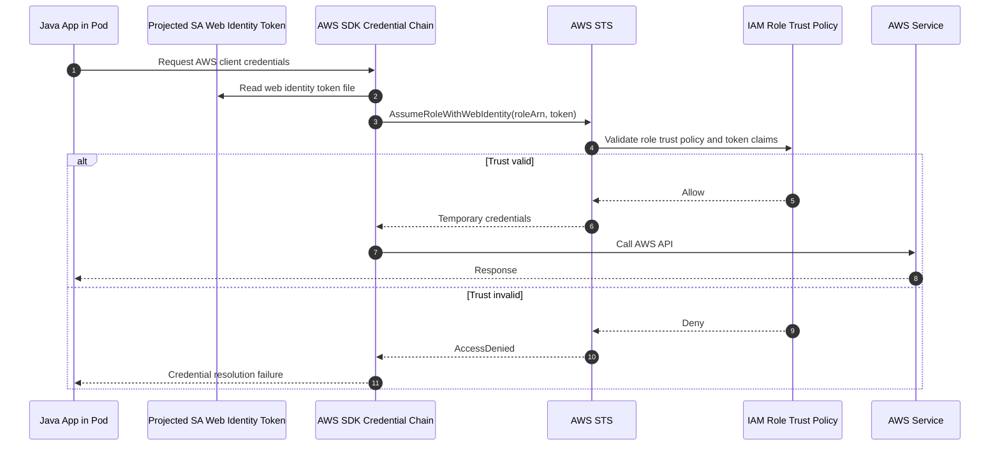
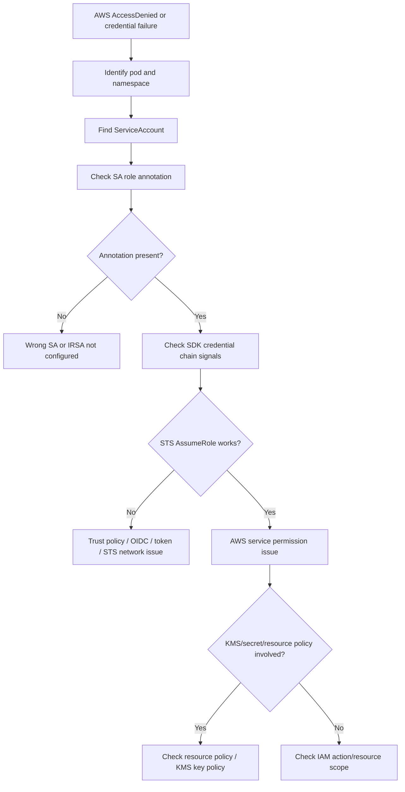
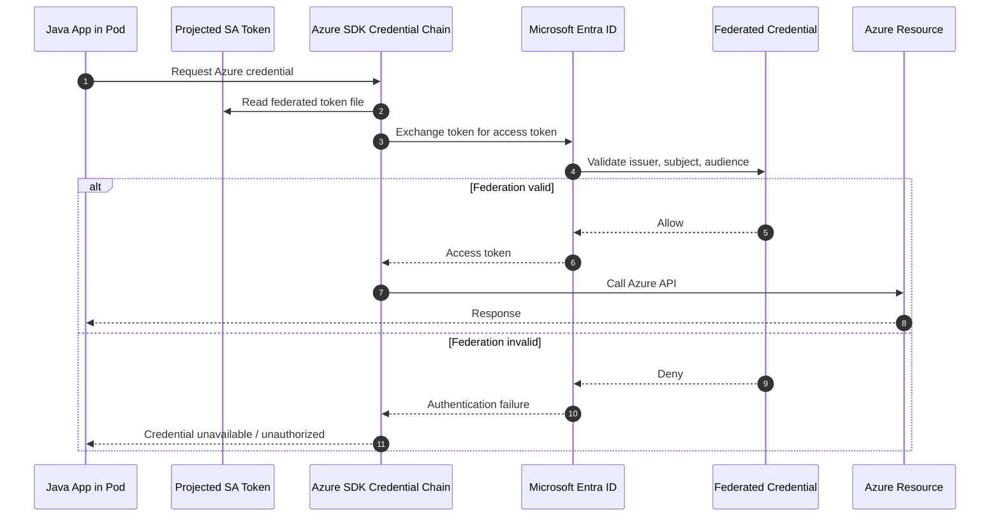
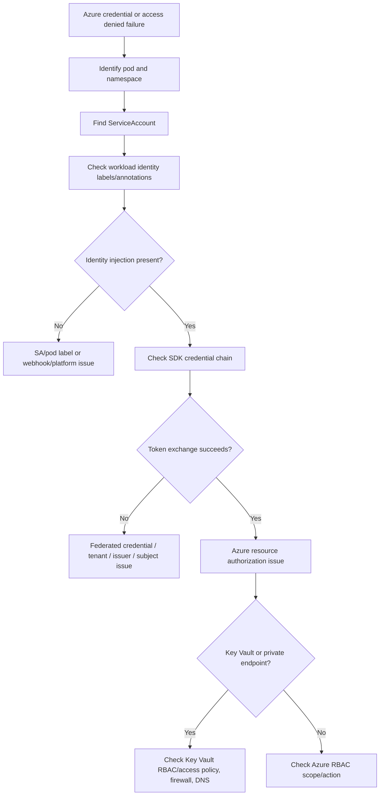

# Part 034 — Workload Identity Operations on EKS and AKS

Kubernetes ServiceAccount identity and cloud IAM identity are related, but they are not the same thing.

This distinction is critical in production debugging.

A pod may be allowed by Kubernetes RBAC but denied by AWS IAM or Azure RBAC. A pod may also have the correct cloud role but no Kubernetes API permission.

Operational invariant:

```text
Kubernetes RBAC authorizes Kubernetes API actions.
Cloud IAM authorizes cloud provider API actions.
Workload identity connects a Kubernetes workload identity to a cloud identity.
```

This part focuses on EKS and AKS because enterprise backend services commonly need cloud access for:

- AWS Secrets Manager;
- AWS SSM Parameter Store;
- AWS S3;
- AWS KMS;
- AWS MSK/IAM authentication;
- Azure Key Vault;
- Azure Storage;
- Azure Service Bus/Event Hubs;
- Azure SQL or PostgreSQL integrations;
- cloud private endpoints;
- observability exporters;
- managed identity-based service access.

For CSG or any enterprise environment, do not assume exact identity provider, annotation, role naming, namespace convention, cloud account/subscription, or secret integration. Verify with internal platform/SRE/security documentation.

---

## 1. The Authorization Planes

There are at least three different authorization planes in a Kubernetes workload:

| Plane | Identity | Authorizes | Example failure |
|---|---|---|---|
| Kubernetes authentication | ServiceAccount token | Who the pod is to Kubernetes API | 401 from Kubernetes API |
| Kubernetes RBAC | Role/RoleBinding | What pod can do inside Kubernetes | 403 from Kubernetes API |
| Cloud IAM | AWS IAM / Azure identity | What pod can do in cloud provider | AccessDenied from AWS/Azure SDK |

Do not mix these up.

Example:

```text
Application cannot read AWS Secrets Manager.
```

This is usually not fixed by adding Kubernetes RBAC.

It is usually about:

- ServiceAccount annotation;
- trust policy/federated credential;
- cloud IAM permission;
- token projection;
- SDK credential chain;
- region/tenant/subscription/account mismatch;
- network/private endpoint/DNS path;
- KMS/Key Vault policy.

---

## 2. Why Workload Identity Exists

Without workload identity, pods often rely on static credentials:

- access keys in Kubernetes Secret;
- client secret in environment variable;
- mounted service principal credential;
- manually rotated password;
- long-lived token.

Those patterns are operationally risky:

- secrets can leak;
- rotation is hard;
- audit attribution is weak;
- credentials may be copied across environments;
- blast radius is larger;
- emergency revocation is painful;
- developers may accidentally log credentials.

Workload identity improves this by letting the platform establish:

```text
Kubernetes ServiceAccount + namespace + cluster trust
→ cloud identity
→ short-lived credentials
→ cloud API access
```

The pod does not need long-lived cloud secrets.

---

## 3. Backend Engineer Responsibility

Backend engineers usually own:

- knowing which cloud services the workload accesses;
- ensuring the application uses the correct SDK credential chain;
- avoiding hard-coded credentials;
- documenting required cloud permissions;
- ensuring identity assumptions are environment-specific;
- validating access-denied errors with evidence;
- coordinating with platform/security for IAM changes;
- ensuring retry behavior is safe during temporary token/identity failures;
- ensuring startup does not hide credential failures;
- ensuring logs do not expose tokens or secret values.

A backend engineer should be able to answer:

```text
Which cloud resources does this workload need?
Which ServiceAccount does it run as?
Which cloud identity should it map to?
Which SDK credential chain is expected to resolve credentials?
What exact action/resource is denied?
```

---

## 4. Platform/SRE Responsibility

Platform/SRE usually owns:

- cluster OIDC/federation setup;
- workload identity admission/injection;
- ServiceAccount annotation conventions;
- namespace-to-cloud-account/subscription mapping;
- cloud controller add-ons;
- External Secrets / CSI driver integration;
- node identity configuration;
- private endpoint/DNS/network path;
- operational dashboards for identity integration;
- upgrade and compatibility of identity components.

Backend engineer should not manually modify cluster OIDC provider or federation plumbing.

---

## 5. Security/IAM Responsibility

Security/IAM team usually owns or co-owns:

- IAM role design;
- trust policy;
- federated credential configuration;
- permission policy;
- Key Vault/Secrets Manager/KMS policy;
- least privilege review;
- audit log review;
- identity exception approval;
- production access and emergency permission process;
- separation of duties;
- cross-account/cross-subscription access standards.

Cloud IAM change is a security-sensitive change.

Operational rule:

```text
Do not fix cloud access denied by broadening permissions blindly.
First identify the exact denied action and resource.
```

---

## 6. EKS IRSA Mental Model

On EKS, IAM Roles for Service Accounts, commonly called IRSA, maps a Kubernetes ServiceAccount to an AWS IAM role.

High-level flow:

```text
Pod runs as Kubernetes ServiceAccount
→ ServiceAccount has IAM role annotation
→ EKS OIDC provider trusts ServiceAccount identity
→ AWS SDK reads web identity token
→ AWS STS AssumeRoleWithWebIdentity
→ SDK receives temporary credentials
→ Application calls AWS service
```



Important:

```text
IRSA is not Kubernetes RBAC.
IRSA is AWS IAM federation using Kubernetes ServiceAccount identity.
```

---

## 7. EKS IRSA ServiceAccount Shape

A typical ServiceAccount using IRSA has an annotation like:

```yaml
apiVersion: v1
kind: ServiceAccount
metadata:
  name: quote-order-api
  namespace: quote-prod
  annotations:
    eks.amazonaws.com/role-arn: arn:aws:iam::<account-id>:role/<role-name>
```

Do not assume this exact annotation exists in all environments. Some platforms wrap or generate it through Helm/Kustomize/GitOps.

Backend engineer should verify:

```bash
kubectl -n <namespace> get serviceaccount <name> -o yaml
```

Then check:

- does the pod use this ServiceAccount?
- does the ServiceAccount have expected role annotation?
- does the IAM role trust this namespace/name?
- does the IAM role policy allow the requested action?
- does the AWS SDK use web identity provider?

---

## 8. EKS Trust Policy Concept

The AWS IAM role trust policy must trust the EKS OIDC provider and specific ServiceAccount identity.

Conceptual trust condition:

```json
{
  "Condition": {
    "StringEquals": {
      "<oidc-provider>:sub": "system:serviceaccount:quote-prod:quote-order-api"
    }
  }
}
```

The important claim is usually:

```text
system:serviceaccount:<namespace>:<serviceaccount-name>
```

Common trust policy failure:

| Failure | Symptom |
|---|---|
| Wrong namespace in trust condition | STS AccessDenied |
| Wrong ServiceAccount name | STS AccessDenied |
| Wrong OIDC provider | STS AccessDenied |
| Missing audience condition | Token rejected depending on config |
| Role ARN annotation typo | SDK cannot assume intended role |
| Role exists in different AWS account | Access denied or not found |

Backend engineer may not have permission to inspect full IAM policy, but should provide the namespace/SA evidence to platform/security.

---

## 9. AWS SDK Credential Chain in Pods

Java services usually use AWS SDK credential provider chain.

In an IRSA-enabled pod, expected inputs often include:

- `AWS_ROLE_ARN`;
- `AWS_WEB_IDENTITY_TOKEN_FILE`;
- `AWS_REGION` or region config;
- projected token file;
- SDK support for web identity credentials.

Common operational issues:

| Issue | Symptom |
|---|---|
| Old SDK version | SDK ignores web identity token |
| Region missing/wrong | AWS service call fails or hits wrong region |
| Token file missing | Credential resolution failure |
| Role ARN env missing | SDK falls back to other provider |
| Node role accidentally used | Works in dev, dangerous in prod |
| Proxy blocks STS | Timeout calling STS |
| KMS permission missing | Secret read succeeds but decrypt fails |

Java service checklist:

```text
Which AWS SDK version is used?
Does it support web identity provider?
Is credential chain explicitly overridden?
Is region configured correctly?
Does startup validate required AWS access?
Are AccessDenied errors logged with action/resource but without secrets?
```

---

## 10. EKS Access Denied Debugging

When AWS access fails from a pod, classify the failure.



Evidence to capture:

```text
namespace
pod
ServiceAccount
ServiceAccount annotations
AWS service called
AWS action denied
AWS resource ARN if available
error code
request ID
region
recent deployment/config changes
```

Do not capture access keys, tokens, secret values, or full credential dumps.

---

## 11. EKS Common Failure Modes

| Failure mode | Symptom | Likely owner |
|---|---|---|
| Pod uses wrong ServiceAccount | SDK assumes no/wrong role | Backend/GitOps |
| Missing role annotation | Credential resolution failure | Platform/backend depending on convention |
| Wrong IAM trust policy | STS AccessDenied | Security/IAM |
| IAM policy missing action | AWS AccessDenied | Security/IAM |
| KMS key policy missing | Decrypt failure | Security/IAM |
| Wrong region | Resource not found/access denied | Backend/platform |
| STS endpoint blocked | Timeout | Network/platform |
| SDK too old | Credential provider not used | Backend |
| Node role fallback | Unexpected access | Platform/security |
| Token expired/cached | Intermittent credential failures | Backend/SDK/platform |

---

## 12. AKS Workload Identity Mental Model

AKS modern workload identity commonly uses Azure Workload Identity.

High-level flow:

```text
Pod runs as Kubernetes ServiceAccount
→ ServiceAccount is labeled/annotated for Azure Workload Identity
→ Federated credential links ServiceAccount subject to Azure identity
→ Azure SDK reads projected token
→ Azure AD / Entra ID exchanges token
→ SDK receives access token
→ Application calls Azure service
```



Important:

```text
Azure Workload Identity is not Kubernetes RBAC.
It is federation from Kubernetes ServiceAccount identity to Azure identity.
```

---

## 13. AKS ServiceAccount Shape

A typical Azure Workload Identity ServiceAccount may look like:

```yaml
apiVersion: v1
kind: ServiceAccount
metadata:
  name: quote-order-api
  namespace: quote-prod
  annotations:
    azure.workload.identity/client-id: <managed-identity-client-id>
  labels:
    azure.workload.identity/use: "true"
```

Exact labels/annotations can depend on platform version and internal conventions.

Verify internal AKS configuration before assuming.

Backend engineer should check:

```bash
kubectl -n <namespace> get serviceaccount <name> -o yaml
kubectl -n <namespace> get pod <pod-name> -o yaml
```

Look for:

- ServiceAccount name;
- workload identity labels/annotations;
- projected token volume;
- environment variables injected for Azure SDK;
- pod labels required by webhook;
- namespace constraints.

---

## 14. Azure Federated Credential Concept

Azure federated credential links a Kubernetes subject to an Azure identity.

Conceptual subject:

```text
system:serviceaccount:<namespace>:<serviceaccount-name>
```

Common federation fields:

- issuer;
- subject;
- audience;
- managed identity/client application;
- tenant;
- subscription/resource scope.

Common failure modes:

| Failure | Symptom |
|---|---|
| Wrong subject | Azure credential failure |
| Wrong issuer | Token exchange fails |
| Wrong client ID | SDK uses wrong identity |
| Missing label/annotation | Webhook does not inject identity settings |
| Wrong tenant | Authentication fails |
| RBAC missing on resource | Auth succeeds, resource access denied |
| Key Vault access policy/RBAC missing | Secret access denied |

---

## 15. Azure SDK Credential Chain in Pods

Java services often use `DefaultAzureCredential` or a configured credential chain.

In AKS workload identity scenarios, expected inputs may include:

- `AZURE_CLIENT_ID`;
- `AZURE_TENANT_ID`;
- `AZURE_FEDERATED_TOKEN_FILE`;
- projected token volume;
- SDK version supporting workload identity;
- correct Key Vault / resource endpoint;
- private endpoint DNS if applicable.

Common issues:

| Issue | Symptom |
|---|---|
| Old Azure SDK | Workload identity not supported |
| Missing client ID | CredentialUnavailableException |
| Wrong tenant | Authentication failure |
| Token file missing | Credential chain failure |
| Resource RBAC missing | 403 from Azure resource |
| Key Vault firewall/private endpoint issue | Timeout or DNS failure |
| SDK falls back to dev credential locally | Works local, fails in pod |

Java checklist:

```text
Is DefaultAzureCredential used intentionally?
Is workload identity supported by SDK version?
Are tenant/client/token file values injected?
Is credential chain overridden?
Is Key Vault/resource endpoint correct?
Are private endpoint DNS and network path valid?
```

---

## 16. AKS Access Denied Debugging

Use this flow when a pod fails to access Azure resource.



Evidence to capture:

```text
namespace
pod
ServiceAccount
client ID reference
Azure resource name/type
operation denied
error code
correlation/request ID
tenant/subscription if available
region
recent deployment/config changes
```

Do not capture tokens, client secrets, secret values, or full credential dumps.

---

## 17. AKS Common Failure Modes

| Failure mode | Symptom | Likely owner |
|---|---|---|
| Missing workload identity label | Env/token not injected | Backend/platform |
| Wrong ServiceAccount | Wrong/no identity | Backend/GitOps |
| Wrong client ID | Auth fails or wrong identity | Backend/platform/security |
| Federated credential subject mismatch | Token exchange fails | Security/IAM/platform |
| Azure RBAC missing | 403 from resource | Security/IAM |
| Key Vault policy missing | Secret access denied | Security/IAM |
| Private endpoint DNS wrong | Timeout/name resolution failure | Network/platform |
| SDK version too old | Credential unavailable | Backend |
| Tenant mismatch | Authentication failure | Security/platform |
| Token refresh issue | Intermittent failures | Backend/SDK/platform |

---

## 18. Workload Identity vs Kubernetes Secret

Cloud access can be provided through:

1. static credential stored in Kubernetes Secret;
2. external secret synced from cloud secret manager;
3. workload identity with short-lived token;
4. node identity fallback;
5. sidecar credential broker.

Production preference often moves toward workload identity because it reduces long-lived secret exposure.

But workload identity is not magic.

It still requires:

- correct ServiceAccount;
- correct federation/trust policy;
- correct cloud IAM permission;
- correct SDK behavior;
- network access to token exchange endpoint/cloud API;
- correct resource policy;
- observability for failures.

---

## 19. Workload Identity and External Secrets

External Secrets and CSI secret integrations may use their own identity.

There are two distinct patterns:

### Pattern A: Controller identity reads cloud secret

```text
External Secrets controller SA
→ cloud identity
→ reads secret manager
→ syncs Kubernetes Secret
→ app pod consumes Kubernetes Secret
```

In this pattern, app pod may not need cloud secret manager permission.

### Pattern B: App workload identity reads cloud secret directly

```text
App pod SA
→ cloud identity
→ app SDK reads secret manager/key vault
```

In this pattern, app pod needs cloud permission.

### Pattern C: CSI driver projects secret into pod

```text
Pod + SecretProviderClass
→ CSI driver/cloud provider
→ mounted secret material
→ app reads file
```

Operational debugging depends on which pattern is used.

Do not assume the application ServiceAccount is the one reading the external secret.

---

## 20. Identity and Secret Rotation

Workload identity does not eliminate rotation concerns.

It changes what rotates:

- projected Kubernetes token rotates;
- STS/Azure access token expires and refreshes;
- underlying secret value may rotate;
- KMS/Key Vault policy may change;
- cloud IAM role/policy may change;
- federated credential may change;
- certificate/trust configuration may rotate.

Failure symptoms:

- intermittent access denied;
- works after pod restart;
- fails only after token expiry interval;
- one replica fails while others work;
- old SDK caches credential incorrectly;
- secret value rotates but app does not reload.

Backend engineer should verify whether the Java SDK and app lifecycle handle credential refresh.

---

## 21. Network Dependencies of Workload Identity

Identity failures may actually be network failures.

EKS may need access to:

- STS endpoint;
- AWS service endpoint;
- VPC endpoints;
- DNS for AWS APIs;
- proxy/NAT path;
- KMS endpoint.

AKS may need access to:

- Microsoft Entra ID token endpoint;
- Azure resource endpoint;
- Key Vault endpoint;
- private DNS zone;
- firewall/proxy path;
- managed identity/workload identity endpoints.

Symptoms:

| Symptom | Possible cause |
|---|---|
| Credential request timeout | STS/Entra endpoint blocked |
| DNS resolution failure | Private DNS/proxy issue |
| TLS error | corporate CA/truststore issue |
| Resource timeout | private endpoint/firewall/NSG issue |
| Access denied with valid token | IAM/RBAC/resource policy issue |

Classify before changing IAM.

---

## 22. Observability Signals

Useful signals for workload identity debugging:

- application credential error logs;
- SDK debug logs, carefully enabled;
- cloud request ID/correlation ID;
- Kubernetes pod spec/env/volumes;
- ServiceAccount annotations/labels;
- projected token volume presence;
- External Secrets/CSI driver logs;
- cloud audit logs;
- STS/Entra sign-in or token exchange logs;
- Key Vault/Secrets Manager access logs;
- network/DNS metrics;
- recent GitOps deployment marker.

Be careful with SDK debug logs. They may reveal sensitive headers or metadata.

---

## 23. Safe Investigation Commands

Find pod ServiceAccount:

```bash
kubectl -n <namespace> get pod <pod-name> \
  -o jsonpath='{.spec.serviceAccountName}{"\n"}'
```

Inspect ServiceAccount metadata:

```bash
kubectl -n <namespace> get serviceaccount <serviceaccount-name> -o yaml
```

Inspect pod volumes and env, without printing secret values:

```bash
kubectl -n <namespace> get pod <pod-name> -o yaml
```

Look for projected token volumes:

```bash
kubectl -n <namespace> get pod <pod-name> \
  -o jsonpath='{.spec.volumes[*].projected}{"\n"}'
```

Check events:

```bash
kubectl -n <namespace> describe pod <pod-name>
```

Check ExternalSecret if used:

```bash
kubectl -n <namespace> get externalsecret
kubectl -n <namespace> describe externalsecret <name>
```

Check SecretProviderClass if CSI driver is used:

```bash
kubectl -n <namespace> get secretproviderclass
kubectl -n <namespace> describe secretproviderclass <name>
```

Do not run commands that print raw tokens or secret values in shared channels.

---

## 24. What Not to Do During Incident

Avoid these unsafe mitigations:

- adding broad IAM policy such as `*:*`;
- adding cluster-admin RBAC for cloud access failure;
- copying cloud access keys into Kubernetes Secret as a shortcut;
- logging all environment variables;
- catting token files into incident chat;
- disabling Key Vault/Secrets Manager/KMS policy;
- bypassing private endpoint/firewall with public access without approval;
- manually patching ServiceAccount in live cluster when GitOps will revert it;
- restarting repeatedly without identifying identity/token failure.

Safe behavior:

```text
Collect evidence, classify failure, choose smallest reversible mitigation, and involve platform/security when trust or IAM policy is involved.
```

---

## 25. Java/JAX-RS Application Concerns

For Java/JAX-RS services, cloud identity failures often appear during:

- application startup;
- dependency client initialization;
- lazy first request;
- scheduled background task;
- secret/config refresh;
- token refresh window;
- high concurrency load;
- rollout to new replicas.

Design implications:

- fail fast if required cloud access is mandatory;
- expose clear readiness behavior;
- avoid blocking readiness on optional dependencies;
- surface credential failure as actionable logs;
- include cloud request/correlation IDs when safe;
- avoid infinite retry loops on authorization failures;
- configure SDK timeouts;
- ensure token refresh works in long-running pods.

Bad pattern:

```text
Read cloud secret lazily on first production request with long SDK default timeout and vague 500 error.
```

Better pattern:

```text
Validate required identity-dependent dependencies during controlled startup/readiness phase, with bounded timeout and clear log evidence.
```

---

## 26. Dependency-Specific Impact

### PostgreSQL

Cloud identity may affect:

- fetching DB password from secret manager;
- Azure AD/IAM-based DB authentication;
- KMS decrypt;
- private endpoint access.

### Kafka

Cloud identity may affect:

- AWS MSK IAM auth;
- fetching SASL credentials;
- private endpoint/network path;
- certificate retrieval.

### RabbitMQ

Cloud identity may affect:

- fetching broker credentials;
- TLS material retrieval;
- cloud-hosted RabbitMQ provider access.

### Redis

Cloud identity may affect:

- fetching Redis auth token;
- TLS/certificate retrieval;
- managed Redis private endpoint access.

### Camunda

Cloud identity may affect:

- worker credential retrieval;
- OAuth client secret retrieval;
- external connector credentials.

### Observability

Cloud identity may affect:

- exporting logs/metrics/traces;
- writing to cloud monitoring;
- reading telemetry config.

---

## 27. EKS vs AKS Operational Differences

| Area | EKS | AKS |
|---|---|---|
| Federation mechanism | EKS OIDC provider + IRSA | Azure Workload Identity + federated credential |
| Cloud token exchange | AWS STS | Microsoft Entra ID |
| SA metadata | `eks.amazonaws.com/role-arn` commonly | `azure.workload.identity/client-id` and label commonly |
| SDK chain | AWS web identity provider | Azure workload identity credential / DefaultAzureCredential |
| Common secret store | Secrets Manager, SSM | Azure Key Vault |
| Common encryption dependency | KMS | Key Vault / managed keys |
| Network dependency | STS, AWS APIs, VPC endpoints | Entra ID, Azure APIs, Private Endpoint DNS |
| Audit source | CloudTrail, service logs | Azure Activity Logs, Entra sign-in logs, resource logs |

Operational skill is not memorizing annotation names.

Operational skill is knowing where identity is resolved and where authorization is enforced.

---

## 28. Workload Identity PR Review Checklist

Review these before approving workload identity changes:

- [ ] Is the ServiceAccount explicit?
- [ ] Does the pod use the intended ServiceAccount?
- [ ] Is the identity annotation/label correct for the platform?
- [ ] Is the cloud identity environment-specific?
- [ ] Is the IAM/RBAC permission least privilege?
- [ ] Is trust/federated credential scoped to namespace and ServiceAccount?
- [ ] Is the SDK credential chain compatible?
- [ ] Is region/tenant/subscription/account correct?
- [ ] Are private endpoint/DNS requirements documented?
- [ ] Are required cloud resources listed?
- [ ] Are secret/KMS/Key Vault policies included?
- [ ] Are permissions applied through approved path?
- [ ] Is GitOps source updated?
- [ ] Is rollback behavior understood?
- [ ] Are logs safe and actionable?

---

## 29. Incident Checklist

During incident, capture:

- [ ] Affected workload.
- [ ] Namespace.
- [ ] Pod name.
- [ ] ServiceAccount name.
- [ ] Cloud provider and resource type.
- [ ] Error code and exact denied action if available.
- [ ] Request/correlation ID from cloud error.
- [ ] ServiceAccount annotations/labels.
- [ ] Whether token/env injection is present.
- [ ] Whether SDK version supports workload identity.
- [ ] Whether network/DNS to token endpoint works.
- [ ] Whether resource policy/KMS/Key Vault policy is involved.
- [ ] Recent deployment/config/identity changes.
- [ ] Whether rollback is safer than permission change.
- [ ] Platform/security escalation owner.

---

## 30. Internal Verification Checklist

For CSG/team-specific validation, verify:

- [ ] Whether workloads run on EKS, AKS, on-prem, or hybrid clusters.
- [ ] Whether EKS uses IRSA, Pod Identity, node role fallback, or another pattern.
- [ ] Whether AKS uses Azure Workload Identity, managed identity, or another pattern.
- [ ] ServiceAccount naming convention.
- [ ] Required annotations/labels for identity injection.
- [ ] Whether default ServiceAccount is allowed.
- [ ] Whether `automountServiceAccountToken` is required for identity.
- [ ] How IAM roles or managed identities are provisioned.
- [ ] How trust policies/federated credentials are approved.
- [ ] How cloud permissions are requested.
- [ ] Who owns AWS IAM / Azure RBAC changes.
- [ ] How Secrets Manager / SSM / Key Vault access is audited.
- [ ] How KMS / Key Vault key permissions are managed.
- [ ] Whether External Secrets or CSI driver uses controller identity or app identity.
- [ ] Whether private endpoints are required for cloud APIs.
- [ ] Required proxy/NO_PROXY settings.
- [ ] SDK version standards for Java services.
- [ ] How to access cloud audit logs during incident.
- [ ] GitOps source for ServiceAccount and identity metadata.
- [ ] Break-glass process for cloud permission issues.

---

## 31. Common Misdiagnoses

### Misdiagnosis 1: "Kubernetes RBAC is missing"

Actual issue:

```text
AWS IAM policy does not allow secretsmanager:GetSecretValue.
```

### Misdiagnosis 2: "Secret is missing"

Actual issue:

```text
External Secrets controller cannot assume cloud identity.
```

### Misdiagnosis 3: "Network is down"

Actual issue:

```text
Token exchange succeeds, but Key Vault RBAC denies access.
```

### Misdiagnosis 4: "App bug"

Actual issue:

```text
Pod uses default ServiceAccount after Helm values changed.
```

### Misdiagnosis 5: "IAM is wrong"

Actual issue:

```text
SDK is too old or explicitly configured to use static credentials that do not exist.
```

Senior debugging starts by separating these planes.

---

## 32. Reliability Concerns

Workload identity affects reliability because identity failure can become service failure.

Reliability risks:

- startup blocked by credential lookup;
- all replicas fail after token refresh issue;
- new rollout fails because new ServiceAccount lacks trust;
- one environment works but another has missing federation;
- secret rotation works in cloud but app does not reload;
- STS/Entra endpoint latency affects startup;
- cloud provider partial outage affects dependency access.

Mitigations:

- startup validation with bounded timeout;
- clear readiness semantics;
- retry with backoff for transient network failures;
- no infinite retry for authorization denied;
- deployment smoke test for cloud access;
- dashboard/alert for secret sync and credential errors;
- rollback path if identity mapping changed.

---

## 33. Security and Privacy Concerns

Security risks:

- overly broad IAM role;
- trust policy wildcarding namespace or ServiceAccount;
- shared identity across unrelated workloads;
- node role fallback grants too much access;
- secret values logged during debugging;
- projected token exposed through shell/debug session;
- cloud resource policy allows unintended principals;
- cross-environment role reuse;
- long-lived static credentials retained after migration to workload identity.

Security review should ask:

```text
Can a compromised pod use this identity to access unrelated resources?
Can dev/staging identity reach production resources?
Can another ServiceAccount assume the same role?
Is access observable and revocable?
```

---

## 34. Cost Concerns

Workload identity can indirectly affect cost.

Examples:

- misconfigured identity causes repeated failed calls and retry storms;
- secret polling too frequent increases API calls;
- logs explode due to credential errors;
- fallback to public endpoints causes NAT/egress cost;
- failed pods restart repeatedly and waste compute;
- over-broad permission allows accidental expensive resource access;
- missing cache causes excessive secret manager/key vault reads.

Cost-aware review:

```text
How often does the app fetch secrets/tokens?
Does it cache safely?
Does it retry authorization failures?
Does traffic go through NAT or private endpoint?
Are identity failure logs rate-limited?
```

---

## 35. Production Readiness Checklist

Before a workload using cloud identity goes production:

- [ ] ServiceAccount is explicit.
- [ ] Identity metadata is present and environment-specific.
- [ ] Trust/federation is scoped to namespace and ServiceAccount.
- [ ] Cloud IAM permission is least privilege.
- [ ] SDK version supports workload identity.
- [ ] Region/tenant/subscription/account config is validated.
- [ ] Required token file/env injection is present.
- [ ] Private endpoint/DNS/proxy path is tested.
- [ ] Secret/KMS/Key Vault policy is tested.
- [ ] Startup/readiness behavior is understood.
- [ ] Failure logs are actionable and safe.
- [ ] Smoke test validates cloud access.
- [ ] Dashboard/alert exists for identity/secret sync failure.
- [ ] Rollback path is documented.
- [ ] Platform/security owner is known.

---

## 36. Senior Engineer Mental Model

Do not think:

```text
Pod cannot access cloud service, add secret or give admin permission.
```

Think:

```text
Which identity is the pod supposed to use?
How is Kubernetes ServiceAccount federated to cloud IAM?
Did credential resolution fail, or did authorization fail?
Is this a trust policy issue, IAM policy issue, resource policy issue, SDK issue, or network issue?
What is the smallest safe mitigation?
```

This is the difference between tactical access fixing and production-grade identity operations.

---

## 37. Key Takeaways

- Kubernetes RBAC and cloud IAM are separate authorization planes.
- Workload identity maps Kubernetes ServiceAccount identity to cloud identity.
- EKS commonly uses IRSA with OIDC and STS AssumeRoleWithWebIdentity.
- AKS commonly uses Azure Workload Identity with federated credentials.
- Java SDK credential chain must support the intended identity mechanism.
- Access denied can mean trust failure, permission failure, resource policy failure, SDK failure, or network failure.
- External Secrets/CSI may use controller identity, app identity, or both depending on architecture.
- Do not log tokens, client secrets, or secret values during debugging.
- Cloud permission expansion requires security/platform review.
- Production readiness requires smoke tests, observability, rollback path, and clear ownership.

Next part: **Resource Requests and Limits Operations**.
