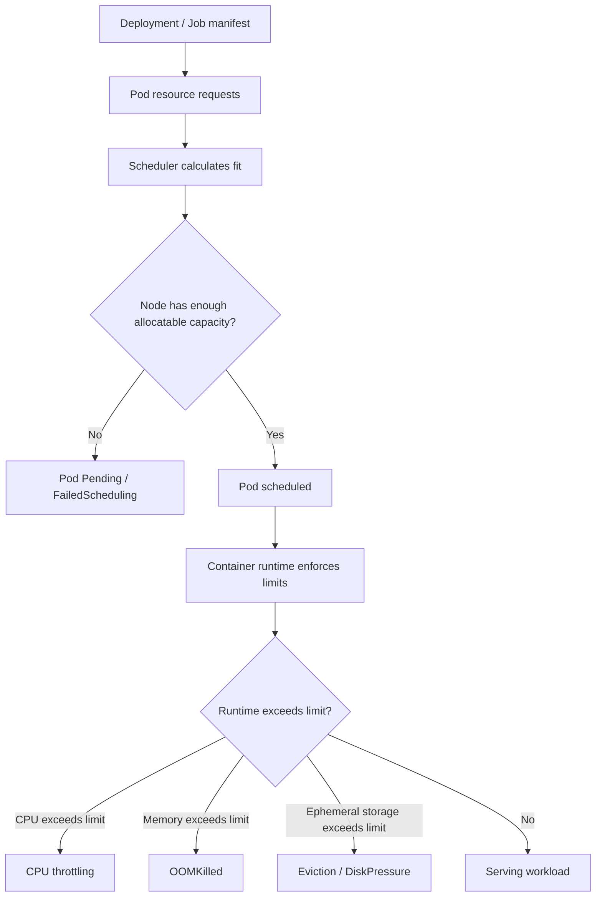
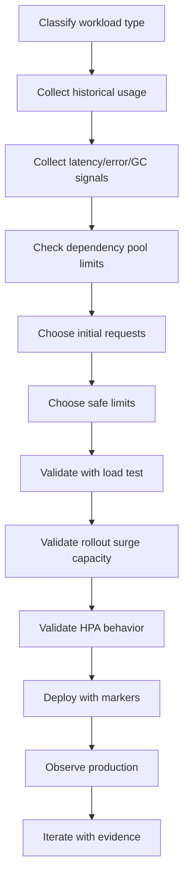

# Part 035 — Resource Requests and Limits Operations

A Kubernetes resource specification is not only a deployment detail.

For backend engineers, it is a production contract between the application and the cluster.

```text
resources.requests = what the workload needs to be scheduled and treated as capacity demand.
resources.limits   = what the workload is not allowed to exceed at runtime.
```

If this contract is wrong, the failure may appear as:

- slow JAX-RS API responses;
- random pod eviction;
- `OOMKilled`;
- CPU throttling;
- stuck rollout;
- pod pending;
- noisy node pressure;
- unstable HPA behavior;
- PostgreSQL connection spikes;
- Kafka/RabbitMQ consumer lag;
- Redis timeout;
- Camunda worker starvation;
- expensive but underutilized node pools;
- production incidents during traffic peaks or deployments.

The core operational invariant:

```text
Kubernetes schedules by request.
Kubernetes enforces by limit.
The application fails according to runtime behavior under those constraints.
```

For Java services, the most dangerous mistake is assuming that container memory equals JVM heap.

It does not.

A Java process uses memory for heap, metaspace, thread stacks, direct buffers, code cache, GC structures, native libraries, TLS buffers, Netty/HTTP client buffers, database driver buffers, and observability agents.

This part focuses on Kubernetes-level resource operations. The next part focuses specifically on JVM tuning.

---

## 1. Operational Mental Model

A Kubernetes workload has three related but different resource views:

| View | Main question | Owner concern |
|---|---|---|
| Application view | How much CPU/memory does the service need to meet latency and throughput? | Backend service owner |
| Kubernetes scheduler view | Where can this pod fit? | Scheduler/platform |
| Runtime enforcement view | What happens when the container exceeds runtime boundaries? | Backend + platform |

The scheduler does not know your JAX-RS thread pool, Kafka lag, PostgreSQL connection pool, or GC behavior.

It only sees resource requests, limits, constraints, taints, topology rules, quotas, and available node capacity.



Operationally, resource configuration answers these questions:

1. Can the pod be scheduled?
2. Can the pod survive normal traffic?
3. Can the pod survive peak traffic?
4. Can the pod survive rollout surge?
5. Can the dependency survive the replica count?
6. Can the node pool absorb the workload?
7. Can the organization afford the capacity?
8. Can HPA make stable decisions?

---

## 2. Backend Engineer Responsibility

Backend engineers usually own or co-own:

- declaring realistic CPU and memory needs for the service;
- understanding JVM memory behavior inside container limits;
- sizing thread pools and connection pools relative to pod replicas;
- ensuring resource settings support startup time and steady-state traffic;
- ensuring resource settings support rolling deployment behavior;
- validating resource usage under load test and production traffic;
- reviewing resource changes in Helm/Kustomize/GitOps PRs;
- correlating latency, error rate, GC, CPU throttling, and memory pressure;
- defining safe minimum replica and autoscaling boundaries;
- documenting known workload profiles: API, consumer, worker, batch, scheduler.

Backend engineers should not treat `resources` as platform-only configuration.

The platform team cannot safely infer application behavior from outside.

A platform engineer can provide node pools and policy. They cannot know whether your service starts 300 threads, opens 60 DB connections per pod, allocates large direct buffers, or performs CPU-heavy quote calculation.

---

## 3. Platform/SRE Responsibility

Platform/SRE usually owns:

- node pool sizing;
- cluster capacity;
- default `LimitRange`;
- namespace `ResourceQuota`;
- cluster autoscaler / Karpenter / AKS node pool autoscaler;
- resource policy guardrails;
- metrics pipeline;
- node pressure monitoring;
- eviction thresholds;
- cost allocation dashboards;
- platform-level capacity planning;
- recommended resource baselines;
- admission policy for missing requests/limits.

Backend and platform must collaborate.

A production-grade resource setting is not simply copied from another service.

It should be validated against workload behavior.

---

## 4. The Four Main Resource Fields

A standard workload resource block looks like this:

```yaml
resources:
  requests:
    cpu: "500m"
    memory: "1Gi"
    ephemeral-storage: "1Gi"
  limits:
    cpu: "2"
    memory: "2Gi"
    ephemeral-storage: "4Gi"
```

### 4.1 CPU request

CPU request is used for scheduling and capacity reservation.

```text
cpu request = how much CPU capacity the pod asks the scheduler to reserve.
```

If request is too low:

- the pod may be packed onto crowded nodes;
- latency can degrade under contention;
- HPA CPU percentage may become misleading;
- the workload may be treated as cheaper than it really is;
- capacity planning becomes inaccurate.

If request is too high:

- pod may remain Pending;
- cluster needs more nodes;
- cost increases;
- bin packing becomes inefficient;
- deployment may block during rollout surge.

### 4.2 CPU limit

CPU limit caps CPU usage through Linux CFS quota.

```text
cpu limit = maximum CPU time the container may consume per scheduling period.
```

If the app tries to use more CPU than its limit, it is throttled.

CPU throttling does not kill the container. It slows it down.

For Java APIs, throttling can look like:

- p95/p99 latency spike;
- thread pool backlog;
- longer GC pauses;
- request timeout;
- readiness timeout;
- Kafka consumer lag;
- RabbitMQ unacked growth;
- Camunda job timeout;
- misleading low CPU usage average.

CPU limits are useful for noisy-neighbor control, but dangerous when set too low.

Many platform teams choose one of these policies:

| Policy | Operational effect |
|---|---|
| CPU request only, no CPU limit | Allows burst, reduces throttling risk, needs strong capacity control |
| CPU request and high CPU limit | Allows some burst, retains upper bound |
| CPU request equals CPU limit | Guaranteed CPU shape, less flexible, can throttle bursty workloads |
| Very low CPU limit | High incident risk for Java services |

The correct policy depends on internal platform standards. Verify it.

### 4.3 Memory request

Memory request is used for scheduling and capacity planning.

```text
memory request = how much memory the pod asks the scheduler to reserve.
```

If request is too low:

- node may be overpacked;
- workload may be more vulnerable to eviction;
- capacity dashboards understate demand;
- performance can degrade under node pressure.

If request is too high:

- pod may remain Pending;
- node utilization decreases;
- cost increases;
- rollouts become harder;
- namespace quota may block deployments.

### 4.4 Memory limit

Memory limit is enforced by the container runtime/cgroup.

```text
memory limit = maximum memory the container may use before it can be killed.
```

If a process exceeds the memory limit, the container can be terminated with `OOMKilled`.

For Java, memory limit must include more than heap.

Bad example:

```text
container memory limit = 1024Mi
JVM heap max          = 1024Mi
```

This leaves no space for metaspace, thread stacks, direct memory, code cache, native memory, agent overhead, TLS buffers, and runtime overhead.

Better thinking:

```text
container memory limit = JVM heap + non-heap + native + buffers + safety margin
```

---

## 5. Ephemeral Storage Request and Limit

Ephemeral storage is often ignored until production breaks.

It covers writable container layer and temporary files, including:

- `/tmp` files;
- generated reports;
- file upload buffers;
- decompressed files;
- local cache;
- application logs written to disk;
- batch intermediate files;
- `emptyDir` volumes;
- crash dumps or heap dumps if written locally.

A Kubernetes workload that processes quote/order documents, export files, reconciliation output, batch payloads, or integration files can fail from disk pressure even when CPU and memory look normal.

Operational symptoms:

- pod eviction;
- node `DiskPressure`;
- application cannot write temp file;
- batch job stuck;
- file processing silently fails;
- logs stop shipping;
- local cache corrupts;
- heap dump fills node disk.

Safe baseline:

```yaml
resources:
  requests:
    ephemeral-storage: "512Mi"
  limits:
    ephemeral-storage: "2Gi"
```

The correct values depend on workload behavior.

For file-heavy batch jobs, explicit storage sizing is mandatory.

---

## 6. QoS Classes

Kubernetes assigns a pod Quality of Service class based on resource requests and limits.

| QoS class | Condition | Operational meaning |
|---|---|---|
| `Guaranteed` | Every container has CPU and memory request equal to limit | Strongest eviction protection, least flexible |
| `Burstable` | At least one request set, but request and limit not equal | Common for backend workloads |
| `BestEffort` | No CPU/memory request or limit | First to be evicted under pressure |

For enterprise backend services, `BestEffort` is usually unacceptable.

For Java/JAX-RS service, `Burstable` is common.

For critical low-latency workloads, `Guaranteed` may be considered, but it increases capacity rigidity and cost.

Operational check:

```bash
kubectl get pod <pod-name> -n <namespace> -o jsonpath='{.status.qosClass}'
```

Do not optimize QoS class without understanding node pressure, eviction policy, and cost.

---

## 7. Resource Settings by Workload Type

Different backend workload types need different resource thinking.

### 7.1 JAX-RS API service

Resource pressure usually appears as:

- p95/p99 latency spike;
- request timeout;
- thread pool saturation;
- DB pool exhaustion;
- GC pressure;
- CPU throttling;
- readiness failure;
- 502/503/504 through ingress.

Resource settings should support:

- startup time;
- steady traffic;
- traffic bursts;
- graceful shutdown;
- readiness probe stability;
- HPA behavior;
- dependency pool sizing.

### 7.2 Kafka consumer service

Resource pressure usually appears as:

- consumer lag;
- rebalance duration;
- slow processing;
- duplicate processing;
- offset commit delay;
- retry/DLQ growth.

CPU and memory should be sized with:

- partitions per pod;
- processing cost per message;
- deserialization cost;
- batch size;
- retry behavior;
- downstream DB/API call cost.

### 7.3 RabbitMQ consumer service

Resource pressure usually appears as:

- queue depth growth;
- unacked message growth;
- redelivery storm;
- connection/channel churn;
- prefetch too high;
- slow ack.

Memory must account for in-flight messages.

### 7.4 Camunda worker

Resource pressure usually appears as:

- activated jobs not completed before timeout;
- worker concurrency saturation;
- incident growth;
- process latency;
- external task timeout;
- expensive payload processing.

Resource sizing must align worker concurrency with CPU, memory, and dependency capacity.

### 7.5 Batch job

Resource pressure usually appears as:

- long execution time;
- job deadline exceeded;
- temp file growth;
- memory spike;
- DB lock contention;
- partial completion;
- retry amplification.

Batch jobs may need higher limits but strict deadline and idempotency controls.

---

## 8. How Requests Affect Scheduling

The scheduler places pods based on requested resources, not current usage.

Example:

```yaml
resources:
  requests:
    cpu: "2"
    memory: "4Gi"
```

A pod with this request cannot be scheduled unless a node has at least that much allocatable CPU and memory available after considering already scheduled pods.

A pod can be Pending even if cluster-wide average CPU usage is low.

Reasons:

- no single node has enough free allocatable capacity;
- node selector restricts placement;
- zone affinity restricts placement;
- taint/toleration mismatch;
- namespace quota exceeded;
- PVC binding issue;
- topology spread constraint;
- autoscaler cannot provision matching node type;
- cloud quota or zone capacity issue.

Safe investigation:

```bash
kubectl describe pod <pod-name> -n <namespace>
kubectl get events -n <namespace> --sort-by='.lastTimestamp'
kubectl get resourcequota -n <namespace>
kubectl get limitrange -n <namespace>
kubectl top nodes
```

Look for events like:

```text
FailedScheduling
0/12 nodes are available: insufficient cpu
0/12 nodes are available: insufficient memory
node(s) didn't match Pod's node affinity/selector
node(s) had untolerated taint
```

---

## 9. How Limits Affect Runtime

Limits are enforced after scheduling.

### CPU limit exceeded

The pod continues running, but receives less CPU time.

Symptoms:

- high latency;
- low throughput;
- long GC cycles;
- slow startup;
- probe timeouts;
- consumer lag;
- timeout cascade.

### Memory limit exceeded

The pod can be killed.

Symptoms:

- `OOMKilled`;
- exit code `137`;
- restart count increases;
- previous logs end abruptly;
- heap dump may not exist;
- Java `OutOfMemoryError` may or may not appear.

Important distinction:

| Failure | Who detects it | What you may see |
|---|---|---|
| Java heap `OutOfMemoryError` | JVM | Java exception/logs, process may continue or crash |
| Container `OOMKilled` | Kernel/cgroup | Pod terminated, exit code 137, maybe no Java stack trace |
| Node memory pressure eviction | kubelet | Evicted pod, node pressure events |

---

## 10. ResourceQuota and LimitRange

Enterprise clusters often define namespace-level policy.

### ResourceQuota

A `ResourceQuota` limits total namespace consumption.

It can restrict:

- total CPU requests;
- total CPU limits;
- total memory requests;
- total memory limits;
- number of pods;
- number of services;
- number of secrets;
- storage requests.

Operational failure:

```text
Forbidden: exceeded quota
```

Safe checks:

```bash
kubectl get resourcequota -n <namespace>
kubectl describe resourcequota -n <namespace>
```

### LimitRange

A `LimitRange` can apply defaults or min/max constraints.

It can define:

- default request;
- default limit;
- minimum request;
- maximum limit;
- limit/request ratio.

Operational risk:

- your manifest omits resources;
- LimitRange injects defaults;
- Java process inherits a memory limit you did not explicitly reason about;
- HPA behavior becomes misleading;
- production behavior differs from local/testing assumptions.

Safe checks:

```bash
kubectl get limitrange -n <namespace>
kubectl describe limitrange -n <namespace>
```

---

## 11. HPA Dependency on Requests

CPU-based HPA uses CPU utilization relative to CPU request.

```text
CPU utilization % = current CPU usage / requested CPU
```

This means CPU request directly affects autoscaling behavior.

Example:

| CPU usage | CPU request | HPA utilization |
|---:|---:|---:|
| 500m | 500m | 100% |
| 500m | 1000m | 50% |
| 500m | 250m | 200% |

Bad CPU request can cause bad scaling.

If request is too high:

- HPA may not scale when needed.

If request is too low:

- HPA may scale too aggressively.

Memory-based HPA is even trickier for Java because heap usage may not fall quickly after traffic drops.

For Java API services, CPU, request rate, latency, or custom metrics often make better scaling signals than raw memory.

Verify internal scaling policy before assuming.

---

## 12. Rollout Surge and Resource Capacity

Rolling updates temporarily increase resource demand.

Example:

```yaml
strategy:
  type: RollingUpdate
  rollingUpdate:
    maxSurge: 25%
    maxUnavailable: 25%
```

For a deployment with 20 replicas and `maxSurge: 25%`, rollout may temporarily run 25 pods.

If each pod requests:

```text
cpu:    1
memory: 2Gi
```

Surge capacity may require an additional:

```text
5 CPU and 10Gi memory
```

If capacity is unavailable:

- new pods remain Pending;
- rollout stalls;
- old pods may still serve traffic;
- deployment may hit progress deadline;
- incident may be misdiagnosed as bad image/config;
- cluster autoscaler may need time to provision nodes.

Rollout safety requires resource capacity planning.

---

## 13. Dependency Capacity Impact

Resource changes affect dependencies indirectly.

Increasing replicas may increase:

- PostgreSQL connections;
- Kafka consumers;
- RabbitMQ consumers/channels;
- Redis connections;
- Camunda worker job activation;
- outbound HTTP connections;
- cloud API request rate;
- log volume;
- metric cardinality;
- trace volume.

Resource review must include dependency capacity.

Example:

```text
DB pool max per pod = 30
HPA max replicas    = 20
Potential DB conns  = 600
```

If PostgreSQL allows 300 application connections, this deployment is unsafe even if Kubernetes resources look fine.

---

## 14. Observability Signals to Check

For resource operations, check at least four layers.

### Kubernetes workload layer

- pod CPU usage;
- pod memory usage;
- pod CPU throttling;
- restart count;
- OOMKilled events;
- eviction events;
- pod pending events;
- deployment availability;
- HPA status;
- node pressure.

### JVM layer

- heap used/committed/max;
- non-heap memory;
- direct buffer memory;
- thread count;
- GC pause duration;
- GC frequency;
- allocation rate;
- class loading;
- native memory if available.

### Application layer

- request rate;
- p95/p99 latency;
- error rate;
- timeout rate;
- active requests;
- queue size;
- worker concurrency;
- retry count;
- DLQ count.

### Dependency layer

- DB active/idle/waiting connections;
- DB CPU/memory/lock wait;
- Kafka lag/rebalance;
- RabbitMQ queue depth/unacked;
- Redis latency/connection count;
- Camunda incident/job backlog;
- downstream HTTP latency.

---

## 15. Safe Investigation Commands

Use read-only commands first.

```bash
kubectl get deploy <deployment> -n <namespace> -o wide
kubectl describe deploy <deployment> -n <namespace>
kubectl get pod -n <namespace> -l app=<app> -o wide
kubectl describe pod <pod> -n <namespace>
kubectl get events -n <namespace> --sort-by='.lastTimestamp'
kubectl top pod -n <namespace>
kubectl top pod -n <namespace> --containers
kubectl top nodes
kubectl get hpa -n <namespace>
kubectl describe hpa <hpa-name> -n <namespace>
kubectl get resourcequota -n <namespace>
kubectl get limitrange -n <namespace>
```

Inspect resource settings:

```bash
kubectl get deploy <deployment> -n <namespace> \
  -o jsonpath='{range .spec.template.spec.containers[*]}{.name}{"\n"}{.resources}{"\n\n"}{end}'
```

Check pod QoS:

```bash
kubectl get pod <pod> -n <namespace> -o jsonpath='{.status.qosClass}'
```

Check termination reason:

```bash
kubectl get pod <pod> -n <namespace> \
  -o jsonpath='{range .status.containerStatuses[*]}{.name}{"\n"}{.lastState.terminated.reason}{"\n"}{.lastState.terminated.exitCode}{"\n"}{end}'
```

Production safety rule:

```text
Do not change resource limits during an incident without understanding blast radius.
Changing resources can trigger rollout, scheduling failure, node scale-up, or dependency pressure.
```

---

## 16. Common Failure Modes

### 16.1 Missing requests

Symptoms:

- unpredictable scheduling;
- poor capacity planning;
- `BestEffort` or weak `Burstable` behavior;
- HPA CPU percentage unusable;
- platform policy rejection.

Mitigation:

- add explicit CPU/memory requests;
- validate with historical usage;
- check namespace policy;
- review HPA impact.

### 16.2 CPU request too low

Symptoms:

- HPA scales too aggressively;
- node overpacking;
- latency under contention;
- high throttling if limit also low.

Mitigation:

- compare request with steady-state and peak CPU;
- adjust request;
- review HPA target;
- validate node capacity.

### 16.3 CPU limit too low

Symptoms:

- p99 latency spike;
- probe timeout;
- slow startup;
- GC pauses worsen;
- consumer lag grows;
- no obvious crash.

Mitigation:

- check throttling metrics;
- consider raising limit or removing limit if platform policy allows;
- tune thread pools;
- adjust HPA and capacity.

### 16.4 Memory limit too low

Symptoms:

- OOMKilled;
- exit code 137;
- restart loop;
- abrupt logs;
- readiness never achieved;
- heap dump missing.

Mitigation:

- reduce heap or increase limit;
- account for non-heap/native memory;
- review direct buffers/thread stacks;
- check memory leak;
- validate under load.

### 16.5 Request too high

Symptoms:

- pod Pending;
- rollout stuck;
- quota exceeded;
- cluster autoscaler scale-up;
- cost increase.

Mitigation:

- verify historical usage;
- reduce request if safe;
- request more quota/capacity;
- adjust rollout surge;
- coordinate with platform.

### 16.6 Ephemeral storage not specified

Symptoms:

- node DiskPressure;
- pod eviction;
- batch failure;
- temp file failure;
- noisy node.

Mitigation:

- add request/limit;
- clean temp files;
- stream large files instead of buffering;
- use object storage or PVC where appropriate;
- avoid writing large logs to local disk.

---

## 17. Resource Sizing Workflow

Use a measured workflow instead of guessing.



Minimum data to collect:

- baseline CPU usage;
- peak CPU usage;
- baseline memory usage;
- peak memory usage;
- GC behavior;
- startup memory;
- request latency under load;
- throughput;
- dependency connection usage;
- restart history;
- node pressure events;
- HPA scaling history;
- cost impact.

---

## 18. Practical Resource Review Heuristics

These are heuristics, not universal rules.

### For JAX-RS API service

Check:

- CPU request supports normal request rate;
- CPU limit does not throttle latency-critical operations;
- memory limit leaves JVM non-heap margin;
- startup probe allows Java startup;
- readiness remains stable under GC;
- HPA target aligns with CPU request;
- max replicas do not exceed DB pool capacity.

### For Kafka/RabbitMQ consumers

Check:

- CPU supports message processing cost;
- memory supports batch/in-flight messages;
- replica max aligns with partition/queue behavior;
- shutdown timeout allows ack/commit;
- scaling does not overload downstream DB/API;
- lag metric reflects real backlog.

### For Camunda workers

Check:

- concurrency aligns with CPU and memory;
- job timeout exceeds worst-case processing time;
- resource pressure does not create incidents;
- worker shutdown does not abandon jobs incorrectly;
- dependency timeout and retry do not amplify incidents.

### For batch jobs

Check:

- memory supports peak batch size;
- ephemeral storage supports temp files;
- activeDeadlineSeconds is realistic;
- retry does not duplicate side effects;
- DB locks and transactions are bounded;
- partial completion is recoverable.

---

## 19. Example Manifest Review

Example for a Java/JAX-RS API service:

```yaml
apiVersion: apps/v1
kind: Deployment
metadata:
  name: quote-api
spec:
  replicas: 4
  strategy:
    type: RollingUpdate
    rollingUpdate:
      maxSurge: 1
      maxUnavailable: 0
  template:
    spec:
      containers:
        - name: quote-api
          image: registry.example.com/quote-api:2026.07.12
          resources:
            requests:
              cpu: "750m"
              memory: "1536Mi"
              ephemeral-storage: "512Mi"
            limits:
              cpu: "2"
              memory: "3Gi"
              ephemeral-storage: "2Gi"
```

Review questions:

- Is `750m` enough for steady-state latency?
- Is `2 CPU` enough to avoid throttling under burst?
- Does `3Gi` include heap plus non-heap/native margin?
- Does `maxSurge: 1` fit node capacity?
- Does HPA use CPU relative to `750m`?
- Does DB pool per pod multiplied by replicas remain safe?
- Does ephemeral storage fit logs/temp/upload behavior?
- Is this consistent across Helm/Kustomize overlays?

---

## 20. EKS, AKS, and On-Prem Differences

### EKS considerations

Verify:

- managed node group or Karpenter provisioning behavior;
- instance family CPU/memory shape;
- subnet IP exhaustion with VPC CNI;
- spot node interruption risk;
- EBS CSI storage behavior;
- CloudWatch/container metrics availability;
- namespace quota and cost allocation labels.

### AKS considerations

Verify:

- system vs user node pool separation;
- VMSS capacity;
- Azure CNI subnet capacity;
- node pool autoscaler settings;
- Azure Monitor metrics;
- ACR/image pull dependencies;
- Azure Policy resource constraints.

### On-prem/hybrid considerations

Verify:

- static node capacity;
- slower capacity expansion;
- local storage constraints;
- corporate virtualization limits;
- proxy/firewall impact on image pull and telemetry;
- internal cost allocation model;
- operational escalation path.

Do not assume cloud autoscaling exists in on-prem clusters.

---

## 21. Production Mitigation Patterns

When resource pressure causes incident, choose mitigation based on evidence.

| Symptom | Possible safe mitigation | Caution |
|---|---|---|
| CPU throttling | Increase CPU limit/request or reduce concurrency | May trigger rollout and scheduling pressure |
| OOMKilled | Lower heap or increase memory limit | Raising limit may cause Pending pods |
| Pod Pending | Reduce request, reduce surge, add capacity | Do not starve service to force scheduling |
| HPA not scaling | Fix metric/request/HPA config | Scaling may overload dependencies |
| DB pool exhaustion | Reduce replicas or pool size | May reduce throughput |
| Consumer lag | Increase replicas/concurrency | May cause rebalance/downstream overload |
| DiskPressure | Clean temp files, add storage limit, move to object storage | Do not delete unknown files blindly |

Incident rule:

```text
Mitigate symptom first.
Preserve evidence.
Avoid broad resource changes that create a second incident.
```

---

## 22. Anti-Patterns

Avoid these patterns:

- no CPU/memory requests for production workloads;
- memory limit equal to JVM heap max;
- blindly copying resource values from another service;
- CPU limit too low for Java API;
- HPA with missing or unrealistic CPU request;
- max replicas not checked against DB pool capacity;
- no ephemeral storage limit for file/batch workload;
- resource changes merged without load or production metric review;
- changing resource values directly with `kubectl edit` in GitOps-managed clusters;
- treating pod Pending as an application bug;
- treating OOMKilled as always a memory leak;
- treating throttling as normal because the pod is still Running.

---

## 23. PR Review Checklist

When reviewing Kubernetes resource changes, check:

- Are CPU and memory requests explicitly set?
- Are CPU and memory limits set according to platform policy?
- Is memory limit compatible with JVM heap and non-heap usage?
- Is CPU limit high enough for burst and latency?
- Is ephemeral storage specified when workload writes temp files?
- Does HPA depend on CPU request?
- Does max replica count multiply dependency connection pools safely?
- Does rolling update surge fit available capacity?
- Does namespace quota allow the change?
- Does LimitRange mutate default values?
- Are resource values consistent across environments?
- Is there evidence from load test or production metrics?
- Is cost impact understood?
- Is rollback path clear?

---

## 24. Internal Verification Checklist

For CSG or any internal enterprise environment, verify instead of assuming:

- namespace `ResourceQuota`;
- namespace `LimitRange`;
- default resource policy;
- CPU limit policy;
- memory limit policy;
- ephemeral storage policy;
- node pool size and instance family;
- EKS managed node group / Karpenter usage;
- AKS node pool autoscaler usage;
- on-prem capacity expansion process;
- HPA configuration and metric source;
- VPA usage or prohibition;
- PDB and rollout strategy;
- current CPU/memory usage dashboard;
- CPU throttling dashboard;
- JVM memory dashboard;
- OOMKilled/restart alert;
- node pressure alert;
- cost allocation labels;
- DB/Kafka/RabbitMQ/Redis/Camunda dependency capacity;
- GitOps repository source of truth;
- Helm/Kustomize values per environment;
- internal production readiness standard;
- platform/SRE escalation path.

---

## 25. Summary

Resource requests and limits are operational contracts.

For backend engineers, they connect application behavior with cluster capacity, reliability, cost, autoscaling, and dependency safety.

Key invariants:

```text
Requests drive scheduling and HPA percentage.
Limits drive runtime enforcement.
CPU limit failure usually appears as latency.
Memory limit failure usually appears as OOMKilled.
Ephemeral storage failure usually appears as eviction or disk pressure.
Java memory is larger than heap.
Replica count multiplies dependency pressure.
```

A senior backend engineer should be able to review a workload resource block and explain:

- why the request values are justified;
- why the limit values are safe;
- how HPA will react;
- how rollout surge affects capacity;
- how dependency pools scale with replicas;
- how JVM memory fits into container memory;
- what alerts and dashboards prove the setting works;
- what rollback or mitigation exists if the resource model is wrong.
