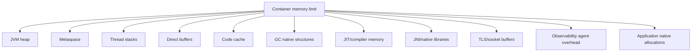
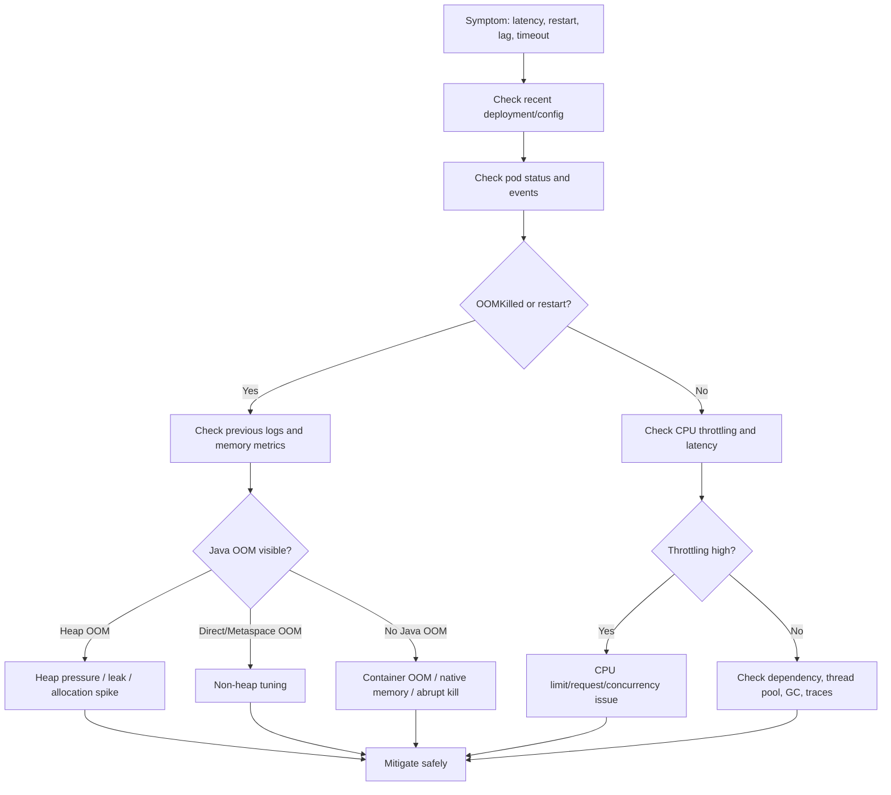

# Part 036 — JVM Resource Tuning in Kubernetes

A Java service running in Kubernetes is controlled by two resource managers at the same time:

```text
Kubernetes/cgroup controls the container boundary.
The JVM controls Java runtime behavior inside that boundary.
```

When these two are misaligned, production symptoms become confusing:

- pod is `Running` but API latency is high;
- CPU average looks normal but p99 latency spikes;
- JVM throws `OutOfMemoryError` even though pod memory looks below limit;
- pod is `OOMKilled` with no Java stack trace;
- readiness probe fails during startup;
- Kafka consumer lag increases after scaling;
- RabbitMQ unacked messages grow;
- Camunda worker jobs time out;
- GC pauses look suspicious but root cause is CPU throttling;
- memory leak investigation chases heap while native memory is growing.

The operational invariant:

```text
Container memory limit must contain the entire JVM process, not just Java heap.
Container CPU limit controls how much CPU time the JVM can actually receive.
```

For Java 17+ / JAX-RS / Jakarta RESTful services, JVM tuning is not optional production trivia. It is part of Kubernetes workload ownership.

---

## 1. JVM Memory Is Not Only Heap

A Java process uses multiple memory regions.



If the container memory limit is `2Gi`, the JVM heap cannot safely be `2Gi`.

Bad mental model:

```text
memory limit = heap
```

Correct mental model:

```text
memory limit = heap + non-heap + native + threads + buffers + agents + safety margin
```

---

## 2. Main JVM Memory Areas

| Area | What it contains | Operational risk |
|---|---|---|
| Heap | Java objects | `OutOfMemoryError: Java heap space`, long GC |
| Metaspace | Class metadata | class loading leaks, framework overhead |
| Thread stacks | per-thread native stack memory | too many threads can consume large native memory |
| Direct memory | off-heap buffers, NIO, Netty, drivers | native memory growth, container OOM |
| Code cache | JIT-compiled code | rare, but can affect performance |
| GC/native | GC structures and JVM internals | grows with heap/runtime behavior |
| Agents | APM/tracing/profiling agents | memory and CPU overhead |
| OS/native | libc, TLS, DNS, sockets, malloc | container OOM without heap signal |

For backend services, thread stacks and direct buffers are often underestimated.

A service with many request threads, DB pool threads, Kafka consumer threads, RabbitMQ channels, Redis clients, scheduler pools, HTTP client pools, and observability agent threads can consume significant native memory.

---

## 3. Container-Aware JVM Behavior

Modern JVMs are container-aware. They detect cgroup CPU and memory boundaries and use them for ergonomics.

However, container-aware does not mean production-safe by default.

Default ergonomics may not match your workload.

Key JVM options:

```text
-XX:MaxRAMPercentage=<percent>
-XX:InitialRAMPercentage=<percent>
-XX:MinRAMPercentage=<percent>
-Xmx<size>
-Xms<size>
-XX:MaxDirectMemorySize=<size>
-XX:ActiveProcessorCount=<count>
-Xss<size>
```

Common strategy choices:

| Strategy | Example | Operational effect |
|---|---|---|
| Percentage-based heap | `-XX:MaxRAMPercentage=65` | Adapts to container limit |
| Fixed heap | `-Xmx1536m` | Predictable, but must match manifest |
| Fixed direct memory | `-XX:MaxDirectMemorySize=256m` | Controls off-heap buffers |
| Active processor override | `-XX:ActiveProcessorCount=2` | Controls JVM CPU/thread ergonomics |
| Stack size tuning | `-Xss512k` | Reduces per-thread memory, must be tested |

Do not tune blindly.

JVM settings must be validated with application behavior and production metrics.

---

## 4. Heap Sizing in Kubernetes

Heap sizing should leave memory for non-heap/native areas.

Example container limit:

```yaml
resources:
  limits:
    memory: "3Gi"
```

Reasonable starting mental budget:

```text
Container limit:        3072Mi
Heap max:               1800-2100Mi
Metaspace/code/native:   300-500Mi
Direct buffers:          128-512Mi
Thread stacks:           depends on thread count
Agent overhead:          depends on instrumentation
Safety margin:           300-600Mi
```

Do not apply this as universal math. Use it as a review frame.

### Percentage-based heap example

```yaml
env:
  - name: JAVA_TOOL_OPTIONS
    value: >-
      -XX:MaxRAMPercentage=65
      -XX:InitialRAMPercentage=25
      -XX:+ExitOnOutOfMemoryError
```

If memory limit is `3Gi`, `MaxRAMPercentage=65` gives a heap around 2Gi, leaving space for other memory areas.

### Fixed heap example

```yaml
env:
  - name: JAVA_TOOL_OPTIONS
    value: >-
      -Xms1024m
      -Xmx2048m
      -XX:+ExitOnOutOfMemoryError
```

Fixed heap is predictable, but dangerous if the manifest changes and JVM options do not.

Operational rule:

```text
If memory limit changes, JVM heap strategy must be reviewed in the same PR.
```

---

## 5. Initial Heap and Startup Behavior

Java services often have heavy startup:

- dependency injection;
- classpath scanning;
- JAX-RS resource initialization;
- JSON serializers/deserializers;
- database pool initialization;
- Kafka/RabbitMQ clients;
- Camunda clients/workers;
- Redis clients;
- schema validation;
- cache warmup;
- observability agent initialization.

`InitialRAMPercentage` or `-Xms` affects startup allocation.

Too low initial heap can cause frequent early GC during startup.

Too high initial heap can increase memory footprint and scheduling/cost pressure.

Startup resource issues often appear as:

- slow startup;
- startup probe failure;
- readiness never becomes true;
- early `OOMKilled`;
- CrashLoopBackOff;
- high CPU during deployment;
- rollout stuck.

Review startup probe and JVM startup together.

---

## 6. Direct Memory

Direct memory is off-heap memory used by NIO buffers and many network-heavy libraries.

It can be used by:

- HTTP clients;
- TLS buffers;
- Netty-based frameworks;
- Kafka clients;
- database drivers;
- Redis clients;
- serialization libraries;
- compression/decompression;
- file processing.

If direct memory grows, heap metrics may look fine while container memory approaches limit.

Possible setting:

```text
-XX:MaxDirectMemorySize=256m
```

Be careful: setting it too low can cause direct buffer allocation failures.

Operational symptoms of direct memory pressure:

- `OutOfMemoryError: Direct buffer memory`;
- network client instability;
- high container memory with normal heap;
- sudden OOMKilled;
- file/batch workload failure.

---

## 7. Metaspace

Metaspace stores class metadata.

Enterprise Java services may load many classes due to:

- frameworks;
- dependency injection;
- proxies;
- JSON/XML binding;
- database drivers;
- JAX-RS providers;
- APM agents;
- workflow clients;
- dynamically generated classes.

A metaspace leak is less common than heap pressure but possible.

Possible setting:

```text
-XX:MaxMetaspaceSize=256m
```

Do not cap metaspace aggressively without measurement.

If too low, the app may fail with:

```text
java.lang.OutOfMemoryError: Metaspace
```

For Kubernetes, metaspace must be part of memory budget even when uncapped.

---

## 8. Thread Stack Memory

Each Java thread has a native stack.

The size is controlled by `-Xss`.

Example:

```text
-Xss1m
```

If a service has 500 threads and stack size is 1MiB, thread stacks alone can reserve a large amount of native memory.

Thread sources:

- request worker pool;
- async executor;
- scheduled executor;
- DB pool housekeeping;
- Kafka consumer threads;
- RabbitMQ client threads;
- Redis client threads;
- HTTP client event loops;
- Camunda worker threads;
- observability agent threads;
- JVM GC/compiler threads.

Operational checks:

- thread count metric;
- thread dump during incident if safe;
- executor queue depth;
- blocked thread count;
- native memory growth;
- pool sizing per pod.

Do not reduce `-Xss` without testing deep call stacks and framework behavior.

---

## 9. CPU Limits and JVM Behavior

CPU limit can affect the JVM in subtle ways.

When CPU is throttled:

- request threads make less progress;
- GC gets less CPU;
- JIT/compiler threads get less CPU;
- Kafka/RabbitMQ consumers process slower;
- probe handlers may time out;
- scheduler/executor delays increase;
- timeouts can cascade;
- latency appears worse than CPU usage average suggests.

CPU throttling is covered deeply in Part 037, but JVM tuning must account for it.

Operational signals:

- container CPU throttling seconds;
- CPU usage vs CPU limit;
- p95/p99 latency;
- GC pause duration;
- GC CPU overhead;
- thread pool queue;
- request timeout;
- consumer lag;
- readiness/liveness probe failures.

Potential JVM option:

```text
-XX:ActiveProcessorCount=2
```

This can be useful when JVM ergonomics overestimate/underestimate available CPU or when you need predictable framework thread counts.

Do not use it as a substitute for fixing bad resource limits.

---

## 10. JVM OOM vs Container OOMKilled

These are different failures.

### JVM `OutOfMemoryError`

The JVM detects inability to allocate memory.

You may see logs like:

```text
java.lang.OutOfMemoryError: Java heap space
java.lang.OutOfMemoryError: Metaspace
java.lang.OutOfMemoryError: Direct buffer memory
```

The process may or may not exit depending on configuration.

Recommended safety option for many backend services:

```text
-XX:+ExitOnOutOfMemoryError
```

This avoids limping in a corrupted or unhealthy state.

### Kubernetes `OOMKilled`

The kernel/cgroup kills the process for exceeding container memory limit.

You may see:

```text
Reason: OOMKilled
Exit Code: 137
```

There may be no Java stack trace.

Safe check:

```bash
kubectl describe pod <pod> -n <namespace>
kubectl logs <pod> -n <namespace> --previous
kubectl get pod <pod> -n <namespace> \
  -o jsonpath='{range .status.containerStatuses[*]}{.name}{"\n"}{.lastState.terminated.reason}{"\n"}{.lastState.terminated.exitCode}{"\n"}{end}'
```

Do not conclude “memory leak” before checking:

- heap usage;
- non-heap usage;
- direct memory;
- thread count;
- recent traffic spike;
- batch payload size;
- file processing behavior;
- APM/agent overhead;
- container memory limit;
- node eviction events.

---

## 11. Heap Dump Safety

Heap dumps can be useful and dangerous.

They may contain:

- customer data;
- quote/order payloads;
- tokens;
- credentials;
- PII;
- request/response bodies;
- cached secrets;
- internal business data.

Do not enable automatic heap dumps in production without internal policy.

Example option:

```text
-XX:+HeapDumpOnOutOfMemoryError
-XX:HeapDumpPath=/dumps
```

Operational concerns:

- dump may fill ephemeral storage;
- dump may contain sensitive data;
- dump upload path must be secured;
- retention must be controlled;
- access must be audited;
- dump generation can extend incident impact.

Internal verification is mandatory before enabling heap dump behavior.

---

## 12. GC Tuning and Observability

For most services, start by observing before tuning GC.

Key GC signals:

- GC pause duration;
- GC frequency;
- allocation rate;
- old generation occupancy;
- heap after GC;
- promotion rate;
- CPU spent in GC;
- full GC count;
- memory pool usage;
- application latency correlation.

Operational anti-pattern:

```text
Changing GC algorithm during incident without evidence.
```

GC symptoms may be secondary effects of:

- CPU throttling;
- too-small heap;
- memory leak;
- allocation-heavy request path;
- large JSON payload;
- excessive object mapping;
- batch size too high;
- consumer prefetch/batch too high;
- APM overhead;
- dependency timeout causing request pile-up.

Recommended baseline:

- export JVM metrics;
- include GC metrics on service dashboard;
- correlate GC pauses with latency;
- include deployment markers;
- keep GC logs if internal log volume policy allows.

Example Java unified logging option:

```text
-Xlog:gc*:stdout:time,level,tags
```

Verify log volume before enabling verbose logs in production.

---

## 13. Resource Tuning by Backend Workload Type

### 13.1 JAX-RS API service

Risk profile:

- latency sensitive;
- request burst;
- DB/HTTP dependency fan-out;
- JSON serialization;
- thread pool saturation;
- GC-visible latency.

Tuning focus:

- heap ratio below container limit;
- enough CPU headroom;
- stable readiness endpoint;
- bounded request/thread pools;
- DB pool aligned with replicas;
- low GC pause and allocation pressure;
- timeout chain alignment.

### 13.2 Kafka consumer

Risk profile:

- lag sensitivity;
- rebalance impact;
- batch processing memory;
- deserialization overhead;
- downstream write pressure.

Tuning focus:

- CPU per partition workload;
- heap for batch/message objects;
- direct memory for client buffers;
- graceful shutdown time;
- offset commit safety;
- max replicas vs partition count.

### 13.3 RabbitMQ consumer

Risk profile:

- unacked message memory;
- prefetch too high;
- redelivery storm;
- connection/channel overhead.

Tuning focus:

- memory per in-flight message;
- prefetch aligned with heap;
- CPU per message handler;
- shutdown/ack behavior;
- channel lifecycle.

### 13.4 Camunda worker

Risk profile:

- worker concurrency;
- job timeout;
- payload size;
- incident generation;
- external dependency calls.

Tuning focus:

- worker concurrency aligned with CPU/heap;
- timeout > worst-case processing;
- bounded executor queues;
- safe shutdown;
- trace correlation by process/job.

### 13.5 Batch and migration jobs

Risk profile:

- large memory spikes;
- file/temp storage;
- long transactions;
- data lock contention;
- partial failure;
- one-off high resource demand.

Tuning focus:

- explicit memory and ephemeral storage;
- chunk size;
- checkpointing;
- active deadline;
- lock timeout;
- rollback limitation.

---

## 14. Example Kubernetes + JVM Configuration

Example for a Java 17+ service:

```yaml
apiVersion: apps/v1
kind: Deployment
metadata:
  name: quote-api
spec:
  template:
    spec:
      containers:
        - name: quote-api
          image: registry.example.com/quote-api:2026.07.12
          env:
            - name: JAVA_TOOL_OPTIONS
              value: >-
                -XX:MaxRAMPercentage=65
                -XX:InitialRAMPercentage=25
                -XX:MaxDirectMemorySize=256m
                -XX:+ExitOnOutOfMemoryError
                -Xlog:gc*:stdout:time,level,tags
          resources:
            requests:
              cpu: "750m"
              memory: "1536Mi"
            limits:
              cpu: "2"
              memory: "3Gi"
```

Review questions:

- Does `MaxRAMPercentage=65` leave enough non-heap/native margin?
- Is `MaxDirectMemorySize=256m` compatible with HTTP/Kafka/Redis/client buffers?
- Does `InitialRAMPercentage=25` support startup without wasting memory?
- Is CPU limit high enough to avoid throttling?
- Are GC logs acceptable under log volume policy?
- Does the readiness probe tolerate startup and GC behavior?
- Does HPA use CPU request correctly?
- Does this differ per environment overlay?

---

## 15. Diagnostics: What to Check First

Start with Kubernetes evidence.

```bash
kubectl describe pod <pod> -n <namespace>
kubectl logs <pod> -n <namespace> --previous
kubectl top pod <pod> -n <namespace> --containers
kubectl get events -n <namespace> --sort-by='.lastTimestamp'
```

Then correlate with observability:

- container memory usage vs limit;
- heap usage vs max heap;
- non-heap usage;
- direct buffer usage if available;
- thread count;
- GC pauses;
- CPU throttling;
- request latency;
- error rate;
- dependency latency;
- restart count;
- deployment marker.

If safe and allowed, use application diagnostic endpoints or JVM tools.

Be careful with `kubectl exec` in production.

Potential commands only when permitted:

```bash
kubectl exec -n <namespace> <pod> -- jcmd 1 VM.flags
kubectl exec -n <namespace> <pod> -- jcmd 1 VM.native_memory summary
kubectl exec -n <namespace> <pod> -- jcmd 1 Thread.print
kubectl exec -n <namespace> <pod> -- jcmd 1 GC.heap_info
```

Cautions:

- container image may not include `jcmd`;
- production `exec` may be prohibited;
- thread dumps can contain sensitive request information;
- native memory tracking may not be enabled;
- diagnostics can add overhead;
- evidence handling must follow internal policy.

---

## 16. Native Memory Tracking

Native Memory Tracking, or NMT, can help diagnose non-heap memory.

It usually requires enabling JVM option:

```text
-XX:NativeMemoryTracking=summary
```

Then inspect:

```bash
jcmd <pid> VM.native_memory summary
```

NMT has overhead and may not be enabled by default.

Use it for targeted diagnosis, not as a universal default unless approved by platform/performance standards.

Native memory suspects:

- thread stacks;
- direct buffers;
- class metadata;
- JIT/code cache;
- TLS buffers;
- native libraries;
- compression;
- observability agent;
- memory allocator fragmentation.

---

## 17. Readiness/Liveness Interaction

JVM resource pressure often shows up through probes.

Examples:

- CPU throttling slows readiness endpoint;
- GC pause exceeds probe timeout;
- startup takes longer than startup probe budget;
- memory pressure makes app stop responding;
- dependency checks in readiness cause traffic removal;
- liveness probe restarts a slow but recoverable process.

Probe review must include JVM behavior.

Bad pattern:

```text
liveness probe timeout = 1s
Java service under GC or CPU throttling sometimes pauses > 1s
→ kubelet restarts service
→ CrashLoopBackOff-like behavior
```

Safer pattern:

- startup probe covers slow startup;
- readiness checks local serving ability;
- liveness checks process deadlock/unrecoverable state;
- dependency health is visible but not always part of liveness;
- probe timeout reflects real JVM pause and startup behavior.

---

## 18. JVM Tuning and Autoscaling

HPA and JVM tuning interact.

If CPU request is too low:

- HPA may scale aggressively;
- more pods increase DB connections;
- Kafka/RabbitMQ rebalances may increase;
- cost rises.

If CPU request is too high:

- HPA may not scale fast enough;
- existing pods become overloaded;
- latency rises;
- GC pressure increases.

If heap is too large:

- memory per pod increases;
- fewer pods fit per node;
- scale-out becomes slower/more expensive;
- GC pauses may increase depending on workload and collector behavior.

If heap is too small:

- frequent GC;
- allocation pressure;
- `OutOfMemoryError`;
- reduced throughput.

Autoscaling is not a replacement for JVM sizing.

---

## 19. Incident Debugging Flow

Use this flow for resource-related Java incidents.



Mitigation examples:

- rollback recent deployment;
- reduce traffic or consumer concurrency;
- increase memory limit if capacity allows;
- reduce heap percentage if non-heap is starving;
- increase CPU limit/request if throttling is proven;
- scale out if dependency capacity allows;
- reduce batch size or prefetch;
- disable problematic feature flag;
- escalate to platform if node/cgroup/metrics issue.

---

## 20. EKS, AKS, and Hybrid Notes

### EKS

Verify:

- node instance CPU/memory shape;
- managed node group or Karpenter behavior;
- CloudWatch/container insights availability;
- pod memory metrics source;
- CNI/subnet pressure if scaling out;
- IRSA/Secrets Manager agent overhead if used;
- EBS/ephemeral storage behavior for dumps or temp files.

### AKS

Verify:

- VMSS/node pool SKU;
- Azure Monitor metrics;
- Azure CNI subnet capacity;
- Key Vault CSI overhead if used;
- node pool autoscaler;
- Azure Policy resource constraints.

### On-prem/hybrid

Verify:

- static node capacity;
- slower capacity expansion;
- internal registry/proxy impact;
- observability agent overhead;
- internal CA/TLS overhead;
- limited node diversity;
- operational approval for resource increases.

---

## 21. PR Review Checklist

When reviewing JVM/resource-related changes, check:

- Did memory limit change?
- Did JVM heap configuration change with it?
- Is heap percentage/fixed heap leaving non-heap margin?
- Is direct memory bounded or observed?
- Is thread count expected and bounded?
- Is CPU limit compatible with latency and GC?
- Is CPU request compatible with HPA target?
- Are startup/readiness probes compatible with Java startup?
- Are GC logs/metrics available?
- Could new library/agent increase memory?
- Could new endpoint allocate large objects?
- Could new consumer batch/prefetch increase heap?
- Could new worker concurrency increase CPU/memory?
- Does rollback revert JVM and manifest config together?
- Are sensitive diagnostics like heap dump controlled?

---

## 22. Internal Verification Checklist

For CSG or any enterprise environment, verify internally:

- standard Java base image;
- default JVM options injected by platform;
- allowed use of `JAVA_TOOL_OPTIONS`;
- memory limit policy;
- CPU limit policy;
- recommended heap percentage;
- APM/tracing agent overhead;
- GC logging policy;
- heap dump policy;
- thread dump policy;
- `kubectl exec` policy;
- availability of `jcmd` or debug image;
- JVM dashboard availability;
- GC metrics dashboard;
- container memory dashboard;
- CPU throttling dashboard;
- OOMKilled alerts;
- startup/readiness probe standard;
- HPA metric standards;
- load testing process;
- production incident evidence policy;
- security rules for dumps/logs containing business data.

Do not assume internal CSG runtime flags, namespace policy, observability agent, or debug access. Verify with backend/platform/SRE/security teams.

---

## 23. Common Anti-Patterns

Avoid these:

- heap max equals container memory limit;
- no explicit JVM memory strategy;
- relying only on default JVM ergonomics for critical services;
- ignoring direct memory;
- ignoring thread stack memory;
- enabling heap dump to ephemeral storage without size/security plan;
- CPU limit too low for Java latency-sensitive API;
- liveness probe too aggressive for JVM pause behavior;
- scaling replicas without checking DB/broker pool pressure;
- tuning GC before checking CPU throttling;
- treating every OOMKilled as heap leak;
- treating every heap OOM as memory limit problem;
- using production `exec`/thread dump without policy;
- changing JVM flags and resource limits in separate PRs.

---

## 24. Practical Baseline Template

A practical baseline discussion for a Java/JAX-RS service should include:

```text
Workload type:              JAX-RS API / consumer / worker / batch
Memory limit:               <value>
Heap strategy:              percentage or fixed
Max heap:                   <expected value>
Non-heap margin:            <expected value>
Direct memory expectation:  <value or observed range>
Thread count expectation:   <range>
CPU request:                <value>
CPU limit policy:           <value or no limit>
HPA metric:                 <metric>
Startup time:               <range>
Readiness behavior:         <local/dependency behavior>
GC target:                  <observed pause/throughput>
Dependency pool impact:     <per pod x max replicas>
Observability proof:        <dashboard/alert links>
Rollback plan:              <how to revert safely>
```

This template is more valuable than a copied YAML snippet.

---

## 25. Summary

JVM resource tuning in Kubernetes is about aligning three things:

```text
Application behavior
+ JVM runtime model
+ Kubernetes container boundary
```

Key invariants:

```text
Heap is only one part of container memory.
OOMKilled may happen without Java OutOfMemoryError.
CPU throttling can look like application latency.
Thread pools and connection pools consume memory and CPU.
HPA behavior depends on CPU request.
Probe stability depends on JVM startup and pause behavior.
Heap dumps and thread dumps are sensitive operational artifacts.
```

A senior backend engineer should be able to explain:

- how the JVM heap is sized relative to memory limit;
- where non-heap/native memory goes;
- how CPU limit affects latency and GC;
- why a pod was OOMKilled without Java logs;
- why a Java service became slow without crashing;
- how resource settings interact with HPA and rollout;
- how workload type changes the tuning approach;
- which diagnostics are safe in production;
- when to rollback, tune, scale, or escalate.
