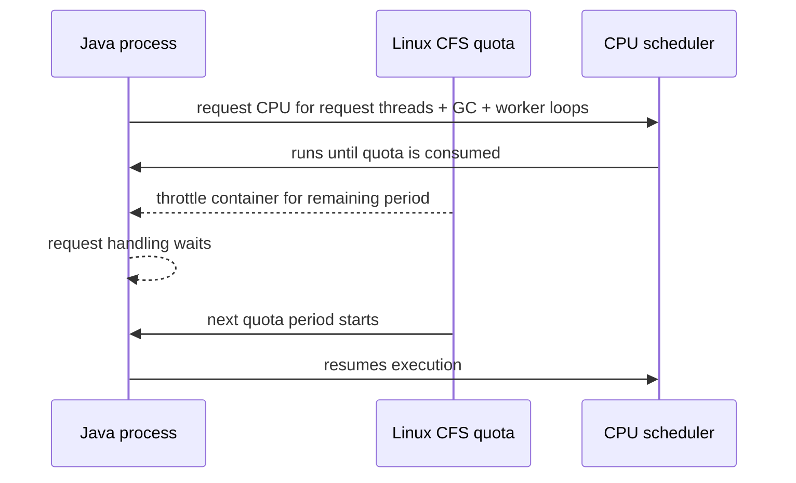
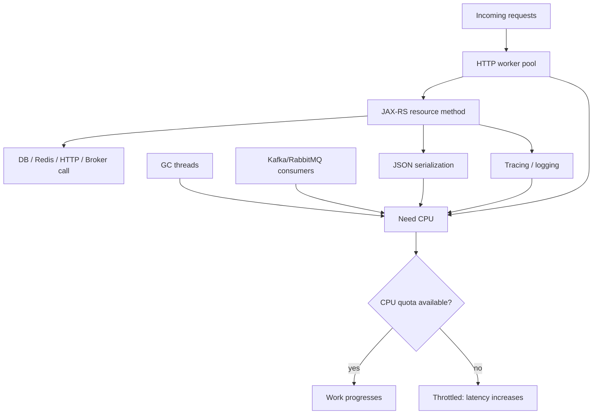
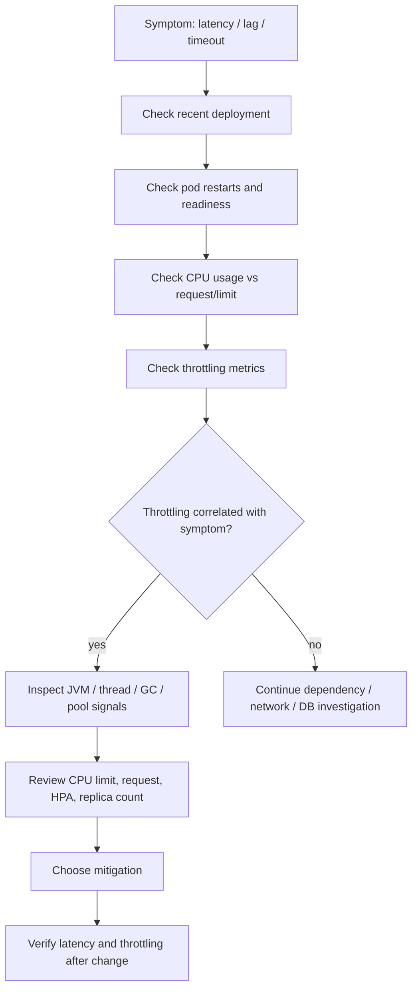
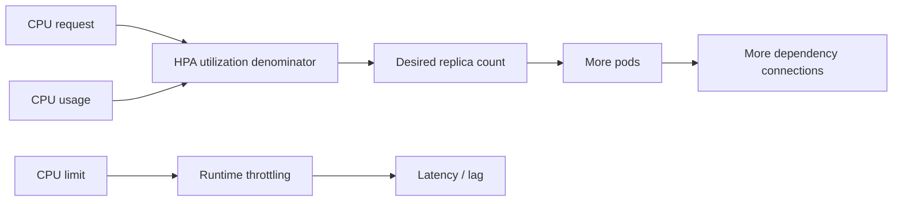
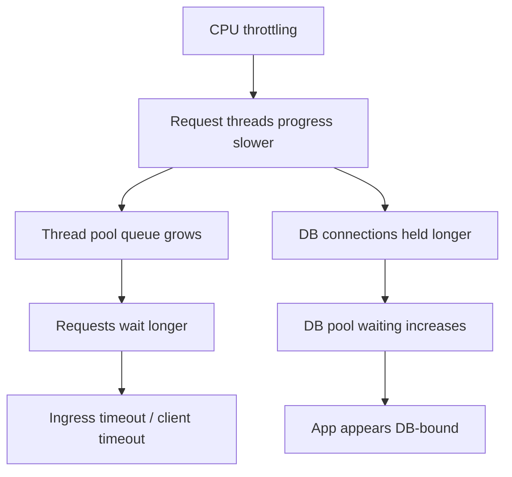

# Part 037 — CPU Throttling Operations

CPU throttling is one of the most misleading Kubernetes production issues.

A service can look healthy at the Deployment level:

```text
Deployment Available=True
Pods Running
Readiness passing
CPU average below limit
No restarts
No obvious error logs
```

Yet users see:

- high p95/p99 latency;
- intermittent request timeout;
- slow JAX-RS endpoint response;
- Kafka consumer lag growth;
- RabbitMQ queue depth growth;
- Camunda worker timeout;
- GC pauses that look worse than expected;
- thread pools backing up;
- readiness probe flapping under load;
- rollout verification failing only during peak traffic.

The hidden cause may be CPU throttling.

The key invariant:

```text
CPU limit is not just a scheduling hint.
It can become a hard runtime ceiling that delays execution even when the node still has idle CPU.
```

For Java backend services, CPU throttling is especially dangerous because the JVM uses CPU for many internal activities at the same time as application request handling:

- request threads;
- async executor threads;
- database pool workers;
- HTTP client callbacks;
- Kafka poll and processing loops;
- RabbitMQ consumer callbacks;
- Redis client event loops;
- Camunda worker polling and completion;
- GC threads;
- JIT compilation;
- TLS encryption/decryption;
- JSON serialization/deserialization;
- observability agent instrumentation.

When throttled, all of these compete for a limited CPU time budget.

---

## 1. What CPU Throttling Means Operationally

In Kubernetes, CPU request and CPU limit have different meanings.

| Field | Primary operational meaning |
|---|---|
| `resources.requests.cpu` | CPU reserved for scheduling and capacity planning |
| `resources.limits.cpu` | maximum CPU the container can consume before throttling |

If a pod has this configuration:

```yaml
resources:
  requests:
    cpu: "500m"
  limits:
    cpu: "1"
```

It means:

```text
Scheduler treats the container as needing 0.5 CPU.
Runtime prevents the container from using more than 1 CPU worth of CPU time.
```

That runtime prevention is throttling.

A container can be throttled even if:

- the node has spare CPU;
- the pod's average CPU graph looks below the limit;
- the application has no error logs;
- the JVM heap and memory look normal.

Why? Because throttling is based on CPU quota periods, not only on long-window average CPU.

---

## 2. The Mental Model: CPU Time Budget

Think of CPU limit as a budget per scheduling window.

```text
CPU limit = how much CPU time the container can spend per period.
```

Simplified example:

```text
Limit: 1 CPU
Period: 100 ms
Budget: 100 ms of CPU time per period
```

If the container burns the budget early in the period, it waits until the next period.



This can create latency spikes even if average CPU over one minute is not high.

Operationally:

```text
Average CPU is a weak signal.
Throttling ratio and latency correlation are stronger signals.
```

---

## 3. Why Java Services Are Sensitive to Throttling

Java services are not simple single-threaded processes.

A typical JAX-RS service may have:

```text
HTTP server worker threads
JAX-RS request handling threads
DB connection pool housekeeper thread
HTTP client event loops
Kafka consumer threads
RabbitMQ connection/channel threads
Redis client threads
Scheduler threads
GC threads
JIT/compiler threads
Tracing/metrics agent threads
```

The JVM also sizes some internal behavior based on available CPU.

When Kubernetes CPU limit is low, the JVM may behave differently:

- fewer perceived processors;
- constrained GC parallelism;
- slower JIT compilation;
- slower class loading/startup;
- slower request processing;
- slower async callback execution;
- slower consumer polling and acknowledgment;
- slower TLS and JSON work.

If CPU is throttled, Java threads are not just slower individually. They queue behind each other.



A request may be waiting not because the database is slow, but because the application cannot get CPU to process the response.

---

## 4. Common Production Symptoms

CPU throttling often appears as second-order symptoms.

| Symptom | Why throttling can cause it |
|---|---|
| API latency spike | request threads wait for CPU budget |
| 504 from ingress | backend cannot respond before timeout |
| Kafka lag grows | consumers cannot process fast enough |
| RabbitMQ unacked grows | consumer callback/ack is delayed |
| Camunda job timeout | worker cannot complete/extend in time |
| GC pause appears high | GC threads are CPU-constrained |
| Readiness flaps | health endpoint times out under load |
| Thread pool queue grows | active threads cannot drain work |
| DB pool appears saturated | threads hold connections longer |
| CPU graph below limit | averaging hides quota-period throttling |

Bad conclusion:

```text
CPU is only 70%, so CPU is fine.
```

Better conclusion:

```text
Check throttling ratio, latency, GC, thread pool, and request volume together.
```

---

## 5. CPU Request vs CPU Limit

### CPU request

CPU request affects scheduling.

```yaml
resources:
  requests:
    cpu: "500m"
```

This tells the scheduler:

```text
Place this pod only where 0.5 CPU requested capacity is available.
```

Requests influence:

- pod scheduling;
- node bin-packing;
- HPA CPU utilization calculation;
- cluster autoscaler behavior;
- cost allocation;
- capacity guarantees under contention.

### CPU limit

CPU limit affects runtime execution.

```yaml
resources:
  limits:
    cpu: "1"
```

This tells the runtime:

```text
Do not let this container consume more than 1 CPU worth of CPU time.
```

Limits influence:

- CPU throttling;
- burst capacity;
- latency under load;
- JVM perceived processors;
- GC throughput;
- worker throughput.

---

## 6. Why CPU Throttling Is Not Always Visible in `kubectl top`

`kubectl top pod` is useful but insufficient.

Example:

```bash
kubectl top pod -n quote-order quote-api-7c88df6b9f-k29ds
```

Possible output:

```text
NAME                         CPU(cores)   MEMORY(bytes)
quote-api-7c88df6b9f-k29ds   650m         1320Mi
```

If the limit is `1 CPU`, this looks fine.

But the pod could still have frequent short bursts above the quota, causing throttling.

You need metrics such as:

```text
container_cpu_cfs_throttled_periods_total
container_cpu_cfs_periods_total
container_cpu_cfs_throttled_seconds_total
container_cpu_usage_seconds_total
```

Useful derived signals:

```text
throttled period ratio = throttled_periods / total_periods
throttled seconds rate = rate(throttled_seconds_total)
usage vs limit = cpu_usage / cpu_limit
```

Operational rule:

```text
Do not clear CPU as a suspect using kubectl top alone.
```

---

## 7. Investigation Flow

Use a structured flow.



Start from the user-visible symptom. Do not start by changing resources blindly.

---

## 8. Production-Safe Commands

### Identify resource settings

```bash
kubectl get deploy -n <namespace> <deployment> -o jsonpath='{.spec.template.spec.containers[*].resources}'
```

Readable version:

```bash
kubectl get deploy -n <namespace> <deployment> -o yaml | sed -n '/resources:/,/env:/p'
```

### Check pod resource usage

```bash
kubectl top pod -n <namespace> -l app.kubernetes.io/name=<app>
```

### Check node-level pressure

```bash
kubectl top node
kubectl describe node <node-name>
```

### Check pod events

```bash
kubectl describe pod -n <namespace> <pod-name>
```

### Check deployment rollout context

```bash
kubectl rollout status deploy/<deployment> -n <namespace>
kubectl rollout history deploy/<deployment> -n <namespace>
```

### Check HPA behavior

```bash
kubectl describe hpa -n <namespace> <hpa-name>
```

### Check if you are allowed to inspect

```bash
kubectl auth can-i get pods -n <namespace>
kubectl auth can-i get hpa -n <namespace>
kubectl auth can-i get events -n <namespace>
```

Avoid unsafe first moves:

```text
Do not immediately exec into production pods.
Do not delete pods as a first response.
Do not remove CPU limits without understanding policy.
Do not scale replicas without checking dependency capacity.
```

---

## 9. Metrics to Check

### Kubernetes/container metrics

| Signal | Why it matters |
|---|---|
| CPU usage | baseline and peak consumption |
| CPU request | scheduling and HPA denominator |
| CPU limit | throttling boundary |
| throttled periods | frequency of throttling |
| throttled seconds | severity of lost CPU time |
| restart count | secondary failure evidence |
| pod readiness | traffic serving state |
| HPA desired replicas | autoscaling response |
| node CPU saturation | node-level contention |

### Java/JVM metrics

| Signal | Why it matters |
|---|---|
| GC pause time | may increase under CPU constraints |
| GC CPU usage | competes with app threads |
| thread count | more runnable threads increase contention |
| request executor queue | indicates CPU cannot drain work |
| active request threads | saturation signal |
| DB pool active/waiting | connection held longer during CPU delay |
| HTTP client pending requests | outbound bottleneck or app CPU backlog |
| Kafka consumer lag | processing throughput issue |
| RabbitMQ unacked | consumer slow or ack delayed |
| Camunda job timeout/retry | worker unable to complete in time |

### Application signals

| Signal | Why it matters |
|---|---|
| p95/p99 latency | user-visible impact |
| request rate | load correlation |
| error rate | timeout/failure impact |
| endpoint-level latency | specific hot path |
| serialization time | CPU-heavy response processing |
| authentication/authorization latency | CPU-heavy token validation or crypto |
| trace spans | identify whether time is inside app or dependency |

---

## 10. PromQL Examples

Exact metric names can differ depending on metrics stack. Treat these as patterns to adapt.

### Throttling ratio by pod

```promql
sum by (namespace, pod, container) (
  rate(container_cpu_cfs_throttled_periods_total{namespace="$namespace", container!=""}[5m])
)
/
sum by (namespace, pod, container) (
  rate(container_cpu_cfs_periods_total{namespace="$namespace", container!=""}[5m])
)
```

### Throttled seconds

```promql
sum by (namespace, pod, container) (
  rate(container_cpu_cfs_throttled_seconds_total{namespace="$namespace", container!=""}[5m])
)
```

### CPU usage vs limit

```promql
sum by (namespace, pod, container) (
  rate(container_cpu_usage_seconds_total{namespace="$namespace", container!=""}[5m])
)
/
sum by (namespace, pod, container) (
  kube_pod_container_resource_limits{namespace="$namespace", resource="cpu"}
)
```

### CPU usage vs request

```promql
sum by (namespace, pod, container) (
  rate(container_cpu_usage_seconds_total{namespace="$namespace", container!=""}[5m])
)
/
sum by (namespace, pod, container) (
  kube_pod_container_resource_requests{namespace="$namespace", resource="cpu"}
)
```

### Correlate throttling with latency

Look at:

```text
throttling ratio
p99 latency
request rate
error rate
HPA desired replicas
pod count
recent deployment marker
```

The question is not merely:

```text
Is throttling present?
```

The real question is:

```text
Is throttling materially correlated with user-visible or workload-visible impact?
```

---

## 11. Interpreting Throttling Metrics

There is no universal threshold that is always bad.

Interpret throttling with context:

| Situation | Interpretation |
|---|---|
| low throttling, no latency impact | probably acceptable |
| throttling spikes during peak, latency spikes too | strong suspect |
| high throttling on background worker, no SLA impact | investigate but may not page |
| throttling during startup only | may affect rollout/readiness |
| throttling during GC | can amplify pause/latency |
| throttling after deployment | likely resource or behavior regression |
| throttling only on one pod | skewed traffic, noisy node, or bad pod state |

Bad practice:

```text
Any throttling means incident.
```

Better practice:

```text
Throttle impact must be judged against latency, throughput, error rate, and workload role.
```

---

## 12. CPU Limit Debate: Remove or Keep?

Many platform teams debate whether CPU limits should be used for latency-sensitive services.

### Keeping CPU limits

Advantages:

- hard cap protects node from runaway workloads;
- predictable upper bound per container;
- useful for multi-tenant fairness;
- may be required by policy;
- prevents noisy workload from consuming too much CPU.

Risks:

- throttling can hurt latency;
- bursty workloads suffer;
- Java GC and JIT can be constrained;
- request latency may spike below average utilization;
- HPA may not react fast enough.

### Removing CPU limits

Advantages:

- allows CPU burst if node has spare CPU;
- often improves latency-sensitive services;
- reduces CFS quota throttling;
- lets JVM use available CPU during short bursts.

Risks:

- noisy-neighbor risk;
- potential node contention;
- harder cost predictability;
- may violate cluster policy;
- may require stronger requests and node capacity discipline.

Operational position for backend engineers:

```text
Do not unilaterally remove CPU limits in production.
Bring evidence: throttling, latency correlation, node utilization, workload criticality, and platform policy.
```

---

## 13. CPU Request Sizing

CPU request should represent the CPU needed for stable operation under expected load.

Too low:

- pod is packed onto nodes too aggressively;
- HPA CPU utilization denominator becomes misleading;
- node contention increases;
- performance becomes unstable during peak;
- cluster autoscaler may not provision enough capacity.

Too high:

- pod may remain Pending;
- node utilization drops;
- cost increases;
- fewer replicas fit per node;
- rollout may be blocked by capacity.

Review frame:

```text
Request should be near sustained baseline or conservative operating requirement.
Limit, if used, should allow safe burst without excessive throttling.
```

Example review table:

| Metric | Current | Observation | Action |
|---|---:|---|---|
| CPU request | 500m | avg usage 800m at peak | request likely too low |
| CPU limit | 1000m | throttling during p99 spike | limit may be too tight |
| HPA target | 70% | scales late due to metric lag | review target/window |
| max replicas | 4 | saturation remains at max | increase only after dependency check |

---

## 14. HPA Interaction

HPA often uses CPU utilization:

```text
CPU utilization = CPU usage / CPU request
```

If request is too low, utilization looks high and HPA scales too aggressively.

If request is too high, utilization looks low and HPA scales too slowly.

If CPU limit is too low, throttling may occur before HPA scales enough.



Scaling replicas is not free.

For backend services, increasing replicas also increases:

- DB connection pool total;
- Kafka consumers and rebalances;
- RabbitMQ consumers/channels;
- Redis connections;
- Camunda workers;
- cache pressure;
- log volume;
- metrics cardinality;
- downstream request concurrency.

Before increasing HPA max replicas, check dependency capacity.

---

## 15. CPU Throttling and Request Latency

The most useful correlation is:

```text
throttling ↑ + p99 latency ↑ + request rate ↑ = strong CPU pressure signal
```

But also inspect:

- endpoint-specific latency;
- JSON-heavy endpoints;
- authentication-heavy endpoints;
- endpoints with large response payloads;
- endpoints doing synchronous fan-out calls;
- endpoints doing expensive mapping/transformation;
- report/search/export endpoints;
- quote calculation endpoints;
- order validation endpoints;
- CPQ pricing/configuration endpoints.

A CPQ/quote/order system may have CPU-heavy application code:

- pricing rule evaluation;
- catalog compatibility validation;
- eligibility checks;
- quote calculation;
- order decomposition;
- payload transformation;
- JSON/XML serialization;
- validation pipelines;
- workflow correlation logic.

Kubernetes CPU throttling can turn these into intermittent production latency issues.

---

## 16. CPU Throttling and GC

GC needs CPU.

If the JVM is CPU-constrained:

- GC may take longer;
- allocation pressure may increase;
- application threads may wait longer;
- pause impact may become more visible;
- throughput may drop;
- latency may spike.

Do not immediately tune GC when you see GC pause spikes.

Check:

```text
Was CPU throttling happening at the same time?
Was request rate higher?
Was memory allocation rate higher?
Was the pod at CPU limit?
Was HPA slow to scale?
```

Bad response:

```text
Change GC algorithm first.
```

Better response:

```text
Check CPU quota, GC CPU needs, heap pressure, request load, and throttling correlation first.
```

---

## 17. CPU Throttling and Thread Pools

Thread pool saturation can be caused by CPU throttling.

Example chain:



This creates a trap:

```text
DB pool is saturated, so the database must be slow.
```

Maybe not.

The application may be holding DB connections longer because CPU throttling delays processing.

Check:

- DB query duration;
- DB pool wait time;
- request CPU time;
- throttling ratio;
- thread pool queue;
- trace spans around DB call and response processing.

---

## 18. CPU Throttling and Kafka Consumers

Kafka consumers are sensitive to CPU in multiple places:

- polling;
- deserialization;
- business processing;
- database writes;
- offset commit;
- rebalance handling;
- retry/DLQ publishing;
- logging/tracing.

Symptoms:

- consumer lag grows;
- rebalance frequency increases;
- processing time per message increases;
- `max.poll.interval.ms` risk increases;
- duplicate processing increases after restart;
- DLQ grows because processing times out.

Review:

```text
Does lag grow at the same time as throttling?
Are replicas at HPA max?
Is partition count limiting scaling?
Does increasing replicas cause rebalance storm?
Is processing CPU-heavy or dependency-bound?
```

Mitigation is not always "add replicas".

Possible actions:

- raise CPU request/limit;
- reduce CPU-heavy transformation;
- tune consumer concurrency;
- increase partitions if architecture allows;
- tune batch size/poll settings;
- scale replicas carefully;
- improve dependency latency;
- reduce log verbosity during peak.

---

## 19. CPU Throttling and RabbitMQ Consumers

RabbitMQ consumers can show:

- queue depth growth;
- unacked growth;
- delayed ack;
- redelivery increase;
- consumer timeout;
- retry/DLQ growth.

CPU throttling may delay the consumer callback after delivery.

Check:

```text
queue depth
unacked count
consumer count
prefetch
processing latency
ack latency
pod throttling
thread pool saturation
```

If prefetch is high and CPU is constrained, each pod may hold too many unacked messages while processing slowly.

Possible mitigations:

- tune CPU resources;
- adjust prefetch;
- scale consumers carefully;
- reduce per-message CPU work;
- move heavy work to batch/offline path;
- validate DLQ/retry behavior.

---

## 20. CPU Throttling and Camunda Workers

Camunda workers can fail operationally when CPU throttling delays:

- job activation;
- job processing;
- completion command;
- lock extension;
- incident handling;
- retry scheduling;
- external API calls.

Symptoms:

- activated jobs time out;
- incidents increase;
- worker throughput drops;
- process instances appear stuck;
- retries increase;
- job completion latency rises.

Check:

```text
worker concurrency
job timeout
processing time
CPU throttling
pod restarts
Camunda incident metrics
external dependency latency
```

Do not only increase worker concurrency. Higher concurrency under CPU throttling can worsen contention.

---

## 21. Safe Mitigation Options

Possible mitigations, from least invasive to more structural:

### 1. Reduce immediate load

Useful during active incident:

- disable non-critical traffic path if feature flag exists;
- pause non-critical batch/cron workload;
- reduce consumer concurrency temporarily;
- reduce expensive optional processing;
- lower log verbosity if safe and approved.

### 2. Scale replicas

Can help if workload is horizontally scalable.

But check:

- HPA max replicas;
- DB connection capacity;
- Kafka partition count;
- RabbitMQ broker capacity;
- Redis connection capacity;
- Camunda worker concurrency;
- downstream rate limits;
- node capacity.

### 3. Increase CPU request

Helps scheduling and HPA denominator.

Useful when:

- pods are under-requested;
- node contention exists;
- HPA behavior is distorted;
- cluster capacity allows.

### 4. Increase CPU limit

Helps reduce throttling if policy allows.

Useful when:

- throttling correlates with latency;
- service is bursty;
- node has spare CPU;
- dependency capacity is not the bottleneck.

### 5. Remove CPU limit

Potentially useful for latency-sensitive services, but must be reviewed with platform/SRE.

Requires:

- strong CPU request discipline;
- node capacity monitoring;
- noisy-neighbor risk acceptance;
- policy approval.

### 6. Optimize application CPU

Structural fix:

- reduce expensive mapping;
- reduce serialization overhead;
- avoid repeated catalog/rule calculation;
- cache safe immutable data;
- optimize validation logic;
- avoid synchronous fan-out when possible;
- improve batching;
- reduce excessive logging/tracing overhead.

---

## 22. Unsafe Mitigations

Avoid these as first response:

```text
Delete random pods to "refresh" them.
Remove CPU limits without approval.
Increase replicas without checking dependency capacity.
Increase worker concurrency under CPU throttling.
Disable readiness/liveness probes to keep pods "healthy".
Ignore throttling because average CPU looks fine.
Tune GC before checking CPU quota.
Blame the database because DB pool wait time increased.
```

Production operations must preserve evidence and avoid increasing blast radius.

---

## 23. Rollout Safety Concerns

CPU throttling can make rollout look like an application bug.

During rollout:

- new pods start;
- class loading/JIT happens;
- caches warm up;
- readiness probes run;
- old and new pods overlap because of maxSurge;
- traffic shifts to new pods;
- observability agent starts;
- migration or config checks may run.

If CPU limit is tight, startup and readiness may be slow.

Review deployment settings:

```yaml
strategy:
  type: RollingUpdate
  rollingUpdate:
    maxSurge: 1
    maxUnavailable: 0
```

Potential issue:

```text
maxSurge increases temporary CPU demand on nodes.
New pods are throttled during startup.
Readiness takes longer.
Rollout appears stuck.
```

Check:

- startup CPU usage;
- readiness duration;
- throttling during startup;
- node CPU pressure;
- rollout event timeline;
- progressDeadlineSeconds.

---

## 24. Cost Trade-Off

More CPU is not free.

Increasing CPU request may:

- reduce pods per node;
- increase node count;
- increase cost;
- trigger cluster autoscaler;
- reduce bin-packing efficiency.

Increasing CPU limit may:

- improve latency;
- increase burst usage;
- risk noisy-neighbor impact;
- affect node contention.

Removing CPU limit may:

- improve p99 latency;
- reduce throttling;
- make cost and fairness harder;
- require better request sizing.

Cost-aware reasoning:

```text
Pay for CPU where it buys reliability or latency.
Do not pay for idle CPU caused by oversized requests without evidence.
```

---

## 25. Backend Engineer Responsibility

Backend service owner should own:

- application CPU profile;
- request/limit recommendation;
- JVM CPU behavior awareness;
- thread pool sizing;
- consumer concurrency;
- connection pool impact;
- endpoint latency analysis;
- code-level CPU hotspots;
- rollout verification;
- evidence for resource changes;
- PR review of resource settings.

Backend service owner should not unilaterally own:

- node-level CPU policy;
- cluster-wide limit policy;
- CFS/runtime configuration;
- autoscaler implementation;
- node pool shape;
- quota policy;
- multi-tenant fairness rules.

---

## 26. Platform/SRE Responsibility

Platform/SRE typically owns:

- cluster resource policy;
- node pool sizing;
- quota/LimitRange defaults;
- CPU limit governance;
- metrics availability;
- HPA/metrics server platform integration;
- cluster autoscaler/Karpenter behavior;
- noisy-neighbor controls;
- node pressure alerts;
- platform-level dashboards;
- upgrade/runtime configuration.

Escalate when:

- throttling appears cluster-wide;
- node CPU pressure is high;
- metrics are missing or unreliable;
- policy prevents required mitigation;
- cluster autoscaler is not provisioning;
- quotas block safe rollout;
- runtime behavior differs across node pools.

---

## 27. PR Review Checklist

When reviewing Kubernetes manifests, check:

- [ ] Does the workload have CPU request?
- [ ] Does the workload have CPU limit?
- [ ] Is the limit/request ratio reasonable?
- [ ] Does HPA use CPU utilization based on request?
- [ ] Does CPU request reflect observed baseline/peak?
- [ ] Is CPU limit likely to throttle bursty JAX-RS traffic?
- [ ] Are Java thread pools/concurrency aligned with CPU?
- [ ] Are Kafka/RabbitMQ/Camunda worker concurrency settings aligned with CPU?
- [ ] Does maxSurge temporarily increase CPU load during rollout?
- [ ] Does scaling replicas increase dependency connections safely?
- [ ] Is there a dashboard for throttling?
- [ ] Is there an alert or SLO symptom tied to latency/lag?
- [ ] Is the change cost-aware?
- [ ] Is platform/SRE approval needed for limit removal or high request?

---

## 28. Runbook: CPU Throttling Investigation

### Trigger

Use this runbook when:

- p99 latency spikes;
- ingress 504 increases;
- Kafka lag grows;
- RabbitMQ queue depth grows;
- Camunda job timeout increases;
- readiness flaps under load;
- CPU average seems normal but service is slow.

### Step 1 — Confirm impact

Check:

- affected endpoint/service;
- time window;
- error rate;
- latency percentile;
- queue lag/depth;
- workflow incident count;
- customer/business impact.

### Step 2 — Check recent change

Check:

- deployment marker;
- image version;
- config/secret change;
- resource change;
- HPA change;
- traffic routing change;
- dependency change.

### Step 3 — Check pod health

```bash
kubectl get pods -n <namespace> -l app.kubernetes.io/name=<app>
kubectl describe pod -n <namespace> <pod>
kubectl top pod -n <namespace> -l app.kubernetes.io/name=<app>
```

### Step 4 — Check throttling metrics

Look at:

- throttled period ratio;
- throttled seconds rate;
- CPU usage vs limit;
- latency correlation;
- per-pod skew.

### Step 5 — Check JVM and app signals

Check:

- GC pause/time;
- thread pool queue;
- active request threads;
- DB pool wait;
- HTTP client pending;
- Kafka lag;
- RabbitMQ unacked;
- Camunda job duration;
- endpoint-level latency.

### Step 6 — Choose mitigation

Options:

- temporarily scale replicas;
- increase CPU limit;
- increase CPU request;
- reduce non-critical workload;
- pause batch job;
- reduce consumer concurrency;
- rollback recent CPU-heavy code/config;
- escalate to platform/SRE for cluster capacity/policy.

### Step 7 — Verify

After mitigation, verify:

- p99 latency improves;
- throttling decreases;
- error rate decreases;
- lag/depth drains;
- readiness stabilizes;
- dependency saturation does not worsen;
- cost/capacity impact is acceptable.

---

## 29. Internal Verification Checklist

Verify internally:

- [ ] CPU request/limit standard for backend services.
- [ ] Whether CPU limits are required, optional, or discouraged for latency-sensitive services.
- [ ] Default LimitRange behavior per namespace.
- [ ] ResourceQuota behavior per environment.
- [ ] Dashboard for CPU usage vs request/limit.
- [ ] Dashboard for CPU throttling ratio.
- [ ] Alert policy for CPU throttling or only latency symptoms.
- [ ] HPA CPU target convention.
- [ ] HPA stabilization policy convention.
- [ ] Cluster autoscaler/Karpenter behavior.
- [ ] Node pool instance shape for Java services.
- [ ] Whether pods run on shared or dedicated node pools.
- [ ] Policy for removing CPU limits.
- [ ] Required approval for resource increases.
- [ ] Cost allocation labels for resource usage.
- [ ] Historical throttling incidents.
- [ ] Known CPU-heavy endpoints or workloads.
- [ ] JVM `ActiveProcessorCount` usage, if any.
- [ ] GC/thread pool dashboards.
- [ ] Dependency capacity impact when scaling replicas.

---

## 30. Compact Mental Model

```text
CPU request decides where the pod can be scheduled.
CPU limit decides when the container is throttled.
HPA CPU utilization depends on CPU request.
Java latency depends on available CPU time, not just average CPU usage.
Throttling can make application, database, broker, and GC symptoms look worse.
Mitigation must consider dependency capacity, node capacity, policy, and cost.
```

Operational conclusion:

```text
For Java/JAX-RS services in Kubernetes, CPU throttling is a reliability signal, not just a resource metric.
```
