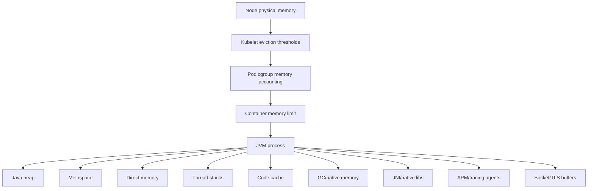
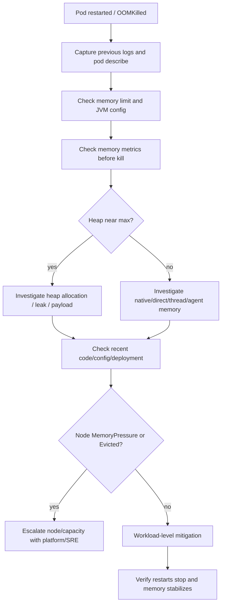

# Part 038 — Memory Pressure and OOMKilled Operations

Memory failures in Kubernetes are often misunderstood because there are multiple memory boundaries involved.

A Java service can fail due to:

- Java heap exhaustion;
- JVM native memory growth;
- direct buffer growth;
- thread stack growth;
- metaspace growth;
- observability agent overhead;
- container memory limit breach;
- node memory pressure;
- kubelet eviction;
- temporary file and page cache behavior;
- sidecar memory usage;
- batch workload spikes;
- connection pool and message buffering.

The most important operational distinction:

```text
Java OutOfMemoryError is not the same thing as Kubernetes OOMKilled.
```

A Java process can throw `OutOfMemoryError` while the pod is not killed.

A pod can be `OOMKilled` with no Java stack trace at all.

---

## 1. The Memory Boundary Stack

A Java process in Kubernetes sits inside several boundaries.



If the container exceeds its memory limit, the kernel can kill the process.

Kubernetes then reports something like:

```text
Reason: OOMKilled
Exit Code: 137
```

This is a container-level kill, not necessarily a Java-level exception.

---

## 2. Key Terms

| Term | Meaning | Operational signal |
|---|---|---|
| Java heap OOM | JVM cannot allocate heap object | Java stack trace, `OutOfMemoryError: Java heap space` |
| Metaspace OOM | JVM class metadata exceeds available space | `OutOfMemoryError: Metaspace` |
| Direct buffer OOM | off-heap direct memory exhausted | `OutOfMemoryError: Direct buffer memory` |
| Container OOMKilled | process exceeds cgroup memory limit | pod restart, exit code 137 |
| Node memory pressure | node memory is low | node condition `MemoryPressure` |
| Eviction | kubelet removes pod due to resource pressure | pod reason `Evicted` |
| QoS class | eviction priority category | Guaranteed/Burstable/BestEffort |

Operational rule:

```text
Always identify which memory boundary failed before choosing mitigation.
```

---

## 3. OOMKilled vs Java OutOfMemoryError

### Java OutOfMemoryError

Example log:

```text
java.lang.OutOfMemoryError: Java heap space
```

This means the JVM observed allocation failure.

The process may:

- keep running in degraded state;
- crash if configured to exit;
- write heap dump if configured;
- trigger application-level failures;
- eventually be killed by Kubernetes if memory keeps growing.

### Kubernetes OOMKilled

Example pod status:

```text
Last State:     Terminated
Reason:         OOMKilled
Exit Code:      137
```

This means the OS killed the process because the container crossed its memory limit.

There may be:

- no Java exception;
- no final application log line;
- incomplete traces;
- no graceful shutdown;
- lost in-flight requests;
- duplicate message processing risk;
- incomplete Camunda job handling;
- database transaction rollback.

---

## 4. Production Symptoms

Memory pressure can show up as:

- pod restarts;
- `OOMKilled` reason;
- exit code 137;
- readiness flapping;
- liveness restart loop;
- increasing GC pause;
- heap usage near max;
- native memory growth;
- direct buffer failures;
- thread creation failure;
- Kafka/RabbitMQ consumer duplicate processing;
- long request latency before restart;
- batch job partial completion;
- node eviction;
- pod `Evicted`;
- CrashLoopBackOff after repeated OOM.

For Java/JAX-RS APIs, users may see:

- 5xx during restart;
- ingress 502/503 while endpoint disappears;
- 504 when GC or memory pressure slows app;
- intermittent failures under high payload size;
- only some endpoints affected.

---

## 5. First Response: Preserve Evidence

Do not immediately delete pods or restart deployments.

First collect evidence.

Production-safe commands:

```bash
kubectl get pod -n <namespace> <pod-name> -o wide
kubectl describe pod -n <namespace> <pod-name>
kubectl logs -n <namespace> <pod-name> --previous
kubectl get events -n <namespace> --sort-by='.lastTimestamp'
kubectl top pod -n <namespace> <pod-name>
kubectl top node
```

For all pods of a service:

```bash
kubectl get pods -n <namespace> -l app.kubernetes.io/name=<app>
kubectl top pod -n <namespace> -l app.kubernetes.io/name=<app>
```

Check deployment context:

```bash
kubectl rollout history deploy/<deployment> -n <namespace>
kubectl rollout status deploy/<deployment> -n <namespace>
```

Evidence to capture:

- affected pod name;
- node name;
- restart count;
- last termination reason;
- exit code;
- previous logs;
- events;
- memory usage before restart;
- deployment version;
- config/secret version;
- traffic rate;
- request/response payload pattern;
- dependency state;
- node pressure condition.

---

## 6. Reading Pod Status

Use:

```bash
kubectl describe pod -n <namespace> <pod-name>
```

Look for:

```text
State:          Running
Last State:     Terminated
  Reason:       OOMKilled
  Exit Code:    137
Restart Count:  3
```

Interpretation:

```text
The current container is running, but the previous instance was killed for memory.
```

If you only check current state, you may miss the failure.

Also check:

- `Started At`;
- `Finished At`;
- restart count;
- readiness state;
- events around kill time;
- node where it happened.

---

## 7. OOMKilled Investigation Flow



---

## 8. Container Memory vs JVM Heap

Bad configuration:

```yaml
resources:
  limits:
    memory: "2Gi"
env:
  - name: JAVA_TOOL_OPTIONS
    value: "-Xmx2g"
```

Why this is dangerous:

```text
Heap alone can consume nearly the entire container limit.
No room remains for metaspace, threads, direct buffers, GC, JIT, agents, sockets, TLS, or native memory.
```

Safer model:

```text
Container limit = heap + non-heap + native + buffers + thread stacks + agents + safety margin
```

Example:

```yaml
resources:
  requests:
    memory: "2Gi"
  limits:
    memory: "3Gi"
env:
  - name: JAVA_TOOL_OPTIONS
    value: >-
      -XX:MaxRAMPercentage=60
      -XX:InitialRAMPercentage=25
      -XX:+ExitOnOutOfMemoryError
```

This allows a heap around 60% of the container memory limit, leaving headroom.

Still validate with real metrics.

---

## 9. JVM Memory Areas to Inspect

### Heap

Signals:

- heap usage after GC;
- allocation rate;
- GC frequency;
- full GC count;
- heap dump analysis;
- endpoint or message type correlation.

Possible causes:

- memory leak;
- large request/response payload;
- unbounded cache;
- large collection accumulation;
- missing pagination;
- batch job loading too much data;
- message buffering;
- object mapping explosion;
- retaining quote/order aggregate graph too long.

### Metaspace

Signals:

- metaspace usage grows continuously;
- dynamic class generation;
- classloader leak;
- hot reload tooling accidentally present;
- excessive proxy generation.

### Direct memory

Signals:

- `OutOfMemoryError: Direct buffer memory`;
- high off-heap memory;
- Netty/NIO buffer usage;
- large HTTP/Kafka/Redis buffers;
- TLS/native buffer overhead.

### Thread stacks

Signals:

- high thread count;
- thread creation failure;
- native memory growth;
- many executor pools;
- high concurrency settings.

Example rough reasoning:

```text
1000 threads × 1Mi stack = ~1000Mi native memory potential
```

Actual stack commitment differs, but thread count still matters.

---

## 10. Memory Metrics to Check

### Kubernetes/container metrics

| Signal | Why it matters |
|---|---|
| container memory working set | primary runtime memory signal |
| memory limit | kill boundary |
| memory request | scheduling and QoS influence |
| restart count | symptom severity |
| OOMKilled count | direct failure signal |
| node memory pressure | node-level pressure |
| pod eviction | kubelet resource pressure action |
| ephemeral storage | sometimes confused with memory symptoms |

### JVM metrics

| Signal | Why it matters |
|---|---|
| heap used/max | Java object pressure |
| heap after GC | leak indicator |
| allocation rate | pressure source |
| GC pause/count | memory pressure symptom |
| metaspace used | class metadata growth |
| direct buffer memory | off-heap pressure |
| thread count | native stack pressure |
| loaded class count | metaspace/classloader signal |
| process RSS | total process memory |

### Application metrics

| Signal | Why it matters |
|---|---|
| request payload size | large object allocation |
| response payload size | serialization memory |
| endpoint latency | memory/GC impact |
| queue lag/depth | consumer backlog memory pressure |
| batch item count | bulk loading risk |
| cache size | unbounded cache risk |
| DB result size | missing pagination/fetch size |

---

## 11. PromQL Patterns

Metric names vary by stack. Adapt to internal observability.

### Container memory usage vs limit

```promql
sum by (namespace, pod, container) (
  container_memory_working_set_bytes{namespace="$namespace", container!=""}
)
/
sum by (namespace, pod, container) (
  kube_pod_container_resource_limits{namespace="$namespace", resource="memory"}
)
```

### Restart count

```promql
sum by (namespace, pod, container) (
  increase(kube_pod_container_status_restarts_total{namespace="$namespace"}[15m])
)
```

### Last termination reason OOMKilled

```promql
kube_pod_container_status_last_terminated_reason{
  namespace="$namespace",
  reason="OOMKilled"
}
```

### JVM heap usage

Common Micrometer-style pattern:

```promql
sum by (application, pod) (
  jvm_memory_used_bytes{area="heap"}
)
/
sum by (application, pod) (
  jvm_memory_max_bytes{area="heap"}
)
```

### JVM non-heap usage

```promql
sum by (application, pod) (
  jvm_memory_used_bytes{area="nonheap"}
)
```

### Thread count

```promql
jvm_threads_live_threads{application="$app"}
```

### GC pause

```promql
rate(jvm_gc_pause_seconds_sum{application="$app"}[5m])
```

---

## 12. Memory Leak vs Legitimate Memory Growth

Not all memory growth is a leak.

| Pattern | Possible interpretation |
|---|---|
| grows then stabilizes | warmup, cache fill, steady state |
| grows per request and never drops | leak suspect |
| grows during batch then drops | workload spike |
| grows after deployment only | regression/config change |
| grows with traffic but not after GC | allocation pressure, not leak |
| heap stable but container memory grows | native/direct/thread/agent suspect |
| only one pod grows | skewed traffic, stuck request, bad pod state |
| all pods grow similarly | code/config/systemic pattern |

Useful question:

```text
Does memory after GC return to a stable baseline?
```

If not, heap leak becomes more likely.

If heap is stable but container memory grows, investigate native memory.

---

## 13. Common Backend Causes

### Large payload handling

JAX-RS APIs may allocate large memory during:

- JSON serialization;
- JSON deserialization;
- request validation;
- response mapping;
- DTO conversion;
- error response construction;
- audit logging;
- large quote/order payload processing.

Risky patterns:

```text
Load entire result set into memory.
Serialize huge graph at once.
Build large intermediate collections.
Log full request/response payload.
Keep request objects in static/cache structures.
```

### Database result loading

PostgreSQL/MyBatis/JPA/JDBC risks:

- missing pagination;
- unbounded query result;
- large fetch into list;
- ORM eager loading;
- N+1 query causing object explosion;
- loading entire order/quote history;
- streaming not used for export/report;
- transaction holding references too long.

### Messaging consumers

Kafka/RabbitMQ risks:

- batch size too large;
- consumer buffers too many messages;
- retry stores payload in memory;
- DLQ handling duplicates payload;
- high concurrency multiplies memory;
- deserialization of large messages;
- unacked RabbitMQ messages held too long.

### Redis-backed services

Risks:

- large values pulled into memory;
- unbounded local cache;
- cache stampede causing object surge;
- poor TTL strategy;
- holding serialized and deserialized forms simultaneously.

### Camunda workers

Risks:

- large process variables;
- worker fetches too many jobs;
- variables loaded unnecessarily;
- retries retain large context;
- incident payloads are large;
- workflow correlation maps accumulate.

---

## 14. Node Memory Pressure vs Container OOM

Container OOM:

```text
One container crosses its memory limit.
Kernel kills the process.
Pod shows OOMKilled / exit code 137.
```

Node memory pressure:

```text
Node runs low on memory.
Kubelet may evict pods based on QoS and usage.
Pod may show Evicted.
```

Check node condition:

```bash
kubectl describe node <node-name>
```

Look for:

```text
MemoryPressure=True
```

Also check events:

```bash
kubectl get events -A --sort-by='.lastTimestamp'
```

If multiple pods across workloads are affected on the same node, suspect node pressure or node issue.

Escalate to platform/SRE when:

- multiple workloads are evicted;
- node memory pressure persists;
- node-level system components are affected;
- eviction threshold or kubelet behavior is involved;
- capacity/node pool decisions are needed.

---

## 15. QoS Class and Eviction Risk

Kubernetes assigns QoS class based on requests/limits.

| QoS class | Condition | Eviction implication |
|---|---|---|
| Guaranteed | CPU and memory request equals limit for all containers | strongest protection from eviction |
| Burstable | at least one request set, request may differ from limit | middle |
| BestEffort | no requests/limits | easiest to evict |

Check QoS:

```bash
kubectl get pod -n <namespace> <pod-name> -o jsonpath='{.status.qosClass}'
```

Operational rule:

```text
Production backend services should not be BestEffort.
```

For Java services, `Burstable` is common, but requests must be realistic.

---

## 16. Heap Dump Safety

Heap dumps are useful and dangerous.

They may contain:

- customer data;
- quote/order payloads;
- tokens;
- credentials accidentally loaded in memory;
- PII;
- pricing or billing data;
- internal identifiers;
- business-sensitive workflow state.

Do not casually generate or download heap dumps from production.

Before heap dump:

- confirm approval;
- confirm storage location;
- confirm encryption;
- confirm access control;
- confirm retention/deletion policy;
- confirm impact on disk/memory;
- confirm whether generating heap dump may pause or destabilize the process;
- confirm incident severity justifies it.

Safer first evidence:

- JVM metrics;
- GC logs if enabled;
- allocation profiling from approved tooling;
- thread count;
- endpoint/payload correlation;
- previous logs;
- restart/termination reason;
- deployment diff.

---

## 17. JVM Flags for OOM Behavior

Common options:

```text
-XX:+ExitOnOutOfMemoryError
-XX:+HeapDumpOnOutOfMemoryError
-XX:HeapDumpPath=/path
-XX:MaxRAMPercentage=<percent>
-XX:MaxDirectMemorySize=<size>
-XX:NativeMemoryTracking=summary
```

Operational notes:

| Option | Benefit | Risk |
|---|---|---|
| `ExitOnOutOfMemoryError` | fail fast so Kubernetes restarts | restart loop if root cause persists |
| `HeapDumpOnOutOfMemoryError` | useful heap evidence | dump may expose sensitive data and consume disk |
| `HeapDumpPath` | controls dump location | path must have storage capacity and access control |
| `MaxDirectMemorySize` | bounds direct memory | too low can break high-throughput IO |
| `NativeMemoryTracking` | native memory insight | overhead; must be approved/tested |

Do not enable heavy diagnostics in production without approval.

---

## 18. Memory Pressure During Rollout

Rollout can increase memory pressure.

Why:

- old and new pods overlap due to maxSurge;
- new JVMs warm up;
- caches initialize;
- class loading/metaspace grows;
- agents initialize;
- readiness checks run;
- both versions may hold DB/broker/cache connections;
- migrations or validation may load data.

Example rollout risk:

```yaml
strategy:
  rollingUpdate:
    maxSurge: 2
    maxUnavailable: 0
```

If nodes are already memory-tight, surge pods may trigger:

- Pending pods;
- node memory pressure;
- eviction;
- OOMKilled during startup;
- rollout stuck;
- readiness failure.

Review:

- memory request/limit;
- startup memory peak;
- maxSurge;
- node free memory;
- HPA replica count;
- cache warmup behavior;
- dependency connection capacity.

---

## 19. Memory and Probes

Memory pressure can affect probes in two ways.

### Readiness failure

If GC or memory pressure slows the app, readiness endpoint may time out.

Result:

```text
Pod remains running but is removed from Service endpoints.
```

### Liveness failure

If liveness probe times out, Kubernetes restarts the container.

This may hide the real memory problem.

Bad probe design:

```text
Liveness checks deep dependencies and fails during temporary slowness.
```

Better design:

```text
Liveness checks process viability.
Readiness checks ability to serve traffic.
Startup probe protects slow Java startup.
```

During OOM investigation, check whether restarts are from:

- OOMKilled;
- liveness failure;
- application exit;
- node eviction.

---

## 20. Memory and Message Processing

### Kafka

Memory risks:

- large `max.poll.records`;
- large message payload;
- batch processing list accumulation;
- deserialization overhead;
- retry buffers;
- DLQ payload duplication;
- high concurrency.

Check:

```text
message size
records per poll
processing batch size
consumer concurrency
lag growth
OOM timing
```

### RabbitMQ

Memory risks:

- high prefetch;
- many unacked messages;
- large payloads;
- per-message transformation;
- retry buffering;
- redelivery storm.

Check:

```text
prefetch
unacked count
payload size
consumer concurrency
ack latency
```

### Camunda workers

Memory risks:

- fetching too many jobs;
- large variables;
- large local context;
- high worker concurrency;
- long-running processing retaining objects.

Check:

```text
max jobs active
worker concurrency
variable size
job timeout
incident correlation
```

---

## 21. Memory and Connection Pools

Connection pools consume memory.

Each connection may require:

- socket buffers;
- TLS buffers;
- driver objects;
- protocol buffers;
- prepared statement caches;
- thread/event-loop references;
- metrics/tracing wrappers.

When replicas scale up, total connection memory increases.

```text
Total DB pool capacity = pod replicas × maxPoolSize
```

Memory impact is not only inside the application. It also affects dependency capacity.

Review:

- DB pool size;
- HTTP client pool size;
- Redis pool size;
- RabbitMQ connection/channel count;
- Kafka client buffers;
- per-pod vs total capacity;
- HPA max replicas.

---

## 22. Mitigation Options

### Immediate mitigations

Use during incident:

- rollback recent memory-heavy deployment;
- reduce traffic if route/feature flag supports it;
- pause non-critical batch jobs;
- reduce consumer concurrency;
- reduce batch size or poll records;
- scale replicas if memory issue is per-pod load and dependency capacity allows;
- increase memory limit if evidence supports and capacity/policy allows;
- restart only when needed and after evidence capture.

### Medium-term fixes

- adjust JVM heap percentage;
- set direct memory cap;
- tune thread pools;
- tune consumer batch/prefetch;
- add pagination/streaming;
- bound caches;
- reduce payload size;
- improve DTO mapping;
- introduce backpressure;
- improve dashboards and alerts.

### Structural fixes

- redesign large payload flows;
- split batch processing;
- use streaming APIs;
- decouple CPU/memory-heavy processing;
- separate API and worker workloads;
- use dedicated node pool for memory-heavy jobs;
- define workload-specific resource classes.

---

## 23. Unsafe Mitigations

Avoid:

```text
Deleting pods before capturing previous logs.
Increasing memory limit without checking JVM heap sizing.
Increasing heap to equal container limit.
Scaling replicas without checking dependency connection limits.
Generating heap dump without data/security approval.
Disabling probes to hide restarts.
Ignoring node MemoryPressure.
Assuming all OOMKilled cases are heap leaks.
Assuming all heap growth is a leak.
```

---

## 24. When to Rollback

Rollback is appropriate when:

- OOMKilled started after a deployment;
- memory slope changed after a version/config change;
- one endpoint or workload path became memory-heavy;
- rollout introduced larger payload retention;
- config increased batch size/concurrency/prefetch;
- JVM flags changed unsafely;
- dependency client version changed memory behavior;
- no safe resource mitigation is available quickly.

Rollback may not help when:

- traffic volume has structurally increased;
- data size has grown;
- node memory pressure is cluster-wide;
- dependency behavior changed externally;
- secret/config drift affects all versions;
- memory leak existed before but only now crossed threshold.

---

## 25. When to Escalate

Escalate to platform/SRE when:

- pods are evicted due to node pressure;
- multiple services on same node are affected;
- node MemoryPressure persists;
- cluster capacity is insufficient;
- quota prevents safe mitigation;
- memory metrics are missing/unreliable;
- node/kernel/container runtime issue is suspected;
- dedicated node pool or capacity change is needed.

Escalate to security/compliance when:

- heap dump is needed;
- memory may contain sensitive data;
- credential leakage is suspected;
- secret material appears in logs/dumps;
- production diagnostic artifact must be stored.

Escalate to DBA/platform dependency owner when:

- connection scaling affects PostgreSQL;
- Kafka/RabbitMQ/Redis capacity is involved;
- Camunda process engine health is involved;
- dependency client buffers or payloads require joint tuning.

---

## 26. PR Review Checklist

Check:

- [ ] Memory request is present.
- [ ] Memory limit is present or consciously omitted per policy.
- [ ] JVM heap does not equal container memory limit.
- [ ] `MaxRAMPercentage` or `-Xmx` is aligned with manifest.
- [ ] Direct memory is considered for IO-heavy services.
- [ ] Thread pool/concurrency settings are aligned with memory.
- [ ] Batch size/prefetch/poll records are bounded.
- [ ] Cache size is bounded and observable.
- [ ] Large payload endpoints use pagination/streaming where needed.
- [ ] Heap dump settings are safe and approved.
- [ ] Probes do not hide memory failure mode.
- [ ] HPA max replicas do not multiply dependency memory/connection pressure unsafely.
- [ ] maxSurge does not create startup memory pressure.
- [ ] Dashboards show container, heap, non-heap, GC, and restart signals.
- [ ] Runbook explains OOMKilled evidence capture.

---

## 27. Runbook: OOMKilled Investigation

### Trigger

Use this runbook when:

- pod restart count increases;
- pod last termination reason is `OOMKilled`;
- exit code is 137;
- CrashLoopBackOff follows memory growth;
- Java service becomes slow before restart;
- node reports memory pressure or pods are evicted.

### Step 1 — Confirm failure mode

```bash
kubectl describe pod -n <namespace> <pod>
kubectl logs -n <namespace> <pod> --previous
kubectl get pod -n <namespace> <pod> -o jsonpath='{.status.containerStatuses[*].lastState}'
```

Classify:

```text
Java OOME?
Container OOMKilled?
Liveness restart?
Node eviction?
Application exit?
```

### Step 2 — Capture time window

Record:

- start time;
- kill time;
- deployment version;
- node name;
- request rate;
- memory graph;
- logs before kill;
- events;
- recent config/deployment change.

### Step 3 — Compare memory signals

Check:

- container memory usage vs limit;
- heap used/max;
- non-heap usage;
- direct buffer usage if available;
- thread count;
- GC pause/count;
- node MemoryPressure;
- pod QoS class.

### Step 4 — Determine likely source

Use this quick mapping:

| Evidence | Likely area |
|---|---|
| heap after GC keeps rising | heap leak or retained objects |
| heap high but container not near limit | Java heap pressure |
| heap stable but container grows | native/direct/thread/agent memory |
| thread count grows | thread leak or excessive pools |
| direct buffer error | off-heap/direct memory |
| OOM during startup | heap/native startup peak or config |
| OOM during batch | batch size/result loading |
| OOM during traffic spike | payload/load/concurrency |
| evicted with node pressure | node capacity/platform issue |

### Step 5 — Mitigate safely

Choose one or more:

- rollback recent change;
- reduce traffic or disable feature;
- reduce batch/concurrency/prefetch;
- scale replicas if safe;
- increase memory limit/request with approval;
- tune JVM heap percentage;
- cap direct memory;
- pause non-critical workload;
- escalate platform/SRE for node pressure.

### Step 6 — Verify

Verify:

- restart count stops increasing;
- memory stabilizes;
- heap after GC stabilizes;
- latency/error rate improves;
- queue lag/depth drains;
- no new node pressure;
- dependency capacity remains safe;
- evidence is attached to incident/RCA.

---

## 28. Internal Verification Checklist

Verify internally:

- [ ] Memory request/limit standard for Java services.
- [ ] JVM heap sizing convention.
- [ ] Whether `MaxRAMPercentage` or fixed `-Xmx` is preferred.
- [ ] Policy for `ExitOnOutOfMemoryError`.
- [ ] Policy for heap dump generation in production.
- [ ] Approved heap dump storage location.
- [ ] Sensitive data handling for heap dumps.
- [ ] Dashboard for container memory vs limit.
- [ ] Dashboard for JVM heap/non-heap/direct/thread/GC.
- [ ] Alert for OOMKilled/restart count.
- [ ] Alert for node MemoryPressure/evictions.
- [ ] Namespace LimitRange and ResourceQuota memory defaults.
- [ ] QoS expectations for production workloads.
- [ ] Known memory-heavy endpoints or jobs.
- [ ] Batch size and consumer concurrency standards.
- [ ] Kafka/RabbitMQ/Camunda memory-related runbooks.
- [ ] Node pool memory capacity model.
- [ ] Escalation path for node pressure.
- [ ] RCA template for OOM incidents.
- [ ] PR checklist for JVM/resource changes.

---

## 29. Compact Mental Model

```text
OOMKilled means the container crossed its memory boundary.
Java OutOfMemoryError means the JVM crossed one of its internal memory boundaries.
Heap is only part of container memory.
Native memory, direct buffers, threads, agents, sockets, and GC structures matter.
Node memory pressure and pod eviction are different from container OOM.
Heap dumps are evidence, but they are also sensitive production artifacts.
```

Operational conclusion:

```text
Memory debugging in Kubernetes is boundary debugging: JVM boundary, container boundary, pod QoS boundary, and node capacity boundary.
```
