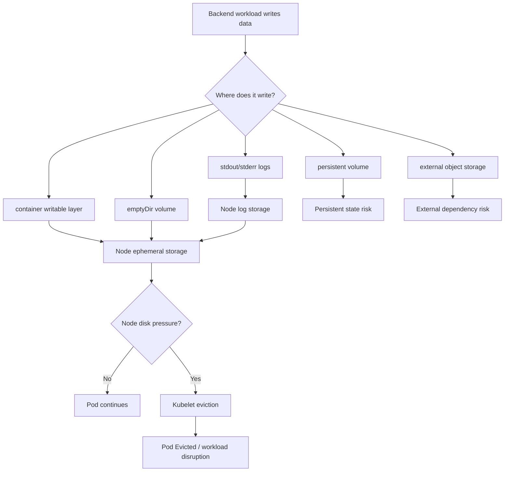
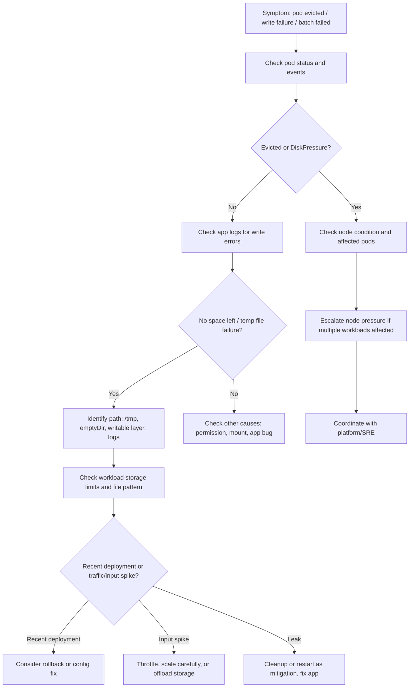

# Part 039 — Ephemeral Storage Operations

Ephemeral storage is one of the easiest Kubernetes resources to ignore until it becomes an incident.

Backend engineers often think in terms of CPU, memory, database connections, Kafka lag, RabbitMQ queue depth, and HTTP latency. But a Java service can also fail because it writes too much temporary data into the container filesystem or `emptyDir`.

Common examples:

- application logs written to local files instead of stdout;
- file uploads buffered to disk before streaming to object storage;
- CSV, PDF, invoice, contract, or report generation;
- batch jobs producing temporary artifacts;
- decompression of archives;
- large request body buffering;
- failed cleanup of temp directories;
- heap dumps, thread dumps, GC logs, or diagnostic artifacts;
- sidecar logs or proxy buffers;
- Camunda worker temporary payload handling;
- integration adapters writing intermediate files;
- writable container layer growth.

Operational rule:

```text
Memory pressure kills processes.
Disk pressure evicts pods.
Both can look like random workload instability unless you check events.
```

---

## 1. What Ephemeral Storage Means in Kubernetes

Ephemeral storage is storage that exists only for the lifetime of a pod or node-local container state.

It commonly includes:

| Storage source | Typical location | Lifetime | Operational risk |
|---|---|---|---|
| Container writable layer | Container filesystem | Until container removed | Hidden growth, image-layer assumptions |
| `emptyDir` | Mounted volume | Until pod deleted | Temp file growth, batch spillover |
| Container logs | Node log path | Until log rotation/retention | Node disk pressure |
| App temp files | `/tmp`, custom temp dir | Until app cleanup/pod delete | Slow leak across long-running pod |
| Heap/thread dumps | Configured diagnostic path | Until cleanup | Can rapidly fill disk |
| Sidecar buffers | Sidecar volume/path | Until pod delete | Proxy/logging sidecar disk pressure |

Ephemeral storage is not durable state. Do not use it for data that must survive pod restart, node drain, or rescheduling.

---

## 2. Mental Model



The key operational question:

```text
Is this data temporary, diagnostic, operational log data, or business data?
```

Each category has a different safe storage strategy.

---

## 3. Why Backend Engineers Must Care

Ephemeral storage is not only a platform concern. Application behavior determines how fast disk usage grows.

Backend service owner responsibilities:

- know whether the service writes temporary files;
- know where upload buffers are stored;
- know whether logs are stdout-only or file-based;
- know whether batch jobs generate temporary artifacts;
- define cleanup behavior;
- avoid storing business-critical data in ephemeral paths;
- set sane ephemeral storage requests/limits when supported by the platform;
- expose observability for file-processing workload size and failure;
- design retry/idempotency around file processing;
- coordinate with platform/SRE for node disk pressure and eviction incidents.

Platform/SRE responsibilities usually include:

- node disk sizing;
- kubelet eviction thresholds;
- container runtime storage configuration;
- log rotation;
- node monitoring;
- CSI/storage class design;
- admission policies for ephemeral storage limits;
- cluster-level disk pressure incident response.

Do not assume your platform team can fix disk pressure if the application continuously writes unbounded temp files.

---

## 4. Kubernetes Objects and Fields to Know

### Container resources

Some clusters support ephemeral storage requests and limits:

```yaml
resources:
  requests:
    cpu: "500m"
    memory: "1Gi"
    ephemeral-storage: "1Gi"
  limits:
    memory: "2Gi"
    ephemeral-storage: "4Gi"
```

Operational interpretation:

- request helps scheduling account for expected local disk usage;
- limit caps container ephemeral storage usage;
- too low a limit can cause eviction or write failure;
- too high a limit can hide leaks until node pressure;
- missing limits can allow noisy-neighbor disk consumption.

### `emptyDir`

Example:

```yaml
volumes:
  - name: workdir
    emptyDir:
      sizeLimit: 5Gi
containers:
  - name: app
    volumeMounts:
      - name: workdir
        mountPath: /work
```

Operational interpretation:

- `emptyDir` is created when the pod is assigned to a node;
- data is removed when the pod is deleted;
- data may survive container restart inside the same pod;
- data does not survive pod rescheduling;
- `sizeLimit` reduces blast radius if supported/enforced in your environment.

### Memory-backed `emptyDir`

```yaml
emptyDir:
  medium: Memory
  sizeLimit: 512Mi
```

This uses memory, not disk. It can increase memory pressure and contribute to OOM risk.

Use it only when you understand the memory trade-off.

---

## 5. Common Backend Patterns That Use Ephemeral Storage

### JAX-RS API service

Typical ephemeral storage usage:

- request body buffering;
- multipart file upload temp files;
- generated response files;
- local caches;
- access logs if misconfigured;
- heap dumps after OOM.

Risk:

```text
A single API endpoint that accepts large uploads can exhaust local disk if buffering is unbounded.
```

### Kafka consumer service

Typical ephemeral storage usage:

- payload staging;
- retry artifact files;
- decompression temp files;
- local offset/debug files if custom logic exists.

Risk:

```text
Scaling consumers increases concurrent temporary file writers.
```

### RabbitMQ consumer service

Typical ephemeral storage usage:

- message attachment staging;
- PDF/document transformation;
- redelivery debug artifacts;
- local retry state if poorly designed.

Risk:

```text
High prefetch plus disk-heavy processing can create local disk pressure before queue depth drops.
```

### Camunda worker

Typical ephemeral storage usage:

- external task payload transformation;
- document generation;
- integration request/response staging;
- temporary process artifacts.

Risk:

```text
Worker retries can repeatedly regenerate large temp files if cleanup is not idempotent.
```

### Batch/CronJob

Typical ephemeral storage usage:

- input export files;
- report generation;
- reconciliation snapshots;
- migration scratch files;
- temporary sort/join files.

Risk:

```text
A batch job may pass in test but fail in production due to larger input cardinality.
```

---

## 6. Failure Modes

| Failure mode | Typical symptom | Likely cause | First evidence |
|---|---|---|---|
| Pod evicted | Pod status `Evicted` | Node disk pressure or local storage limit | Pod events |
| Write failure | App logs `No space left on device` | Container/volume/node full | App logs, events |
| Batch partial failure | Job fails after processing some records | Temp workspace full | Job logs, exit code |
| Upload failure | 500/413/timeout during upload | Disk buffering/body limit | Ingress/app logs |
| Slow service | Latency spike | disk IO contention/log storm | metrics/log volume |
| Node-wide incident | Many pods evicted on same node | disk pressure | node condition/events |
| Restart loop after diagnostics | CrashLoopBackOff after heap dump | dump fills filesystem | previous logs/events |
| Sidecar issue | app healthy but pod degraded | sidecar disk usage | sidecar logs/metrics |

---

## 7. Production Symptoms to Watch

Kubernetes symptoms:

- pod reason `Evicted`;
- event message mentioning `DiskPressure`;
- node condition `DiskPressure=True`;
- container restart after write failure;
- pod stuck because init container cannot write;
- CronJob failures on larger production input;
- logs showing file write failures;
- node-level disk usage saturation;
- eviction of unrelated pods on same node.

Application symptoms:

- `java.io.IOException: No space left on device`;
- failed multipart upload;
- failed report generation;
- failed file transformation;
- temp cleanup warnings;
- degraded latency from disk IO;
- incomplete artifact generation;
- duplicate processing after retry;
- missing output file after pod rescheduling.

---

## 8. Safe Investigation Commands

Start with status and events.

```bash
kubectl get pod <pod> -n <namespace> -o wide
kubectl describe pod <pod> -n <namespace>
kubectl get events -n <namespace> --sort-by=.lastTimestamp
```

Check node condition if pod was evicted.

```bash
kubectl get node <node>
kubectl describe node <node>
```

Check resource configuration.

```bash
kubectl get pod <pod> -n <namespace> -o yaml | grep -A20 "resources:"
kubectl get deploy <deploy> -n <namespace> -o yaml | grep -A40 "ephemeral-storage"
```

Check logs safely.

```bash
kubectl logs <pod> -n <namespace> --all-containers --tail=200
kubectl logs <pod> -n <namespace> --previous --tail=200
```

If `exec` is allowed and production policy permits, inspect high-level paths only. Avoid dumping sensitive data.

```bash
kubectl exec -n <namespace> <pod> -- df -h
kubectl exec -n <namespace> <pod> -- du -sh /tmp /work 2>/dev/null
```

Be careful with commands like recursive `du` over huge directories in a production pod. It can add IO load during an incident.

---

## 9. Observability Signals

Minimum useful signals:

- pod eviction count;
- node disk pressure;
- filesystem usage by node;
- container writable layer usage if available;
- `emptyDir` volume usage if available;
- log ingestion volume by pod/service;
- file-processing count and size;
- batch workspace usage;
- upload size distribution;
- heap dump/thread dump count;
- error logs for `No space left on device`;
- job failure reason;
- pod restart count.

Operationally useful dashboard panels:

| Panel | Why it matters |
|---|---|
| Node disk usage | Detect node-level pressure before eviction |
| Pod eviction events | Confirm disruption cause |
| Log volume by workload | Detect log storms and cost impact |
| Batch temp workspace usage | Detect scaling input size risk |
| Upload request size | Detect endpoint abuse or unexpected traffic |
| File processing latency | Detect disk IO bottleneck |
| Cleanup failure count | Detect slow storage leak |

---

## 10. Debugging Flow



---

## 11. Mitigation Options

### Safe short-term mitigations

- reduce traffic to affected endpoint;
- stop or suspend disk-heavy CronJob;
- scale down batch workers if they amplify disk pressure;
- restart affected pod only if temp files are safe to lose;
- rollback recent deployment if it introduced file growth;
- increase ephemeral storage limit only after understanding node capacity;
- move temporary workspace to bounded `emptyDir`;
- clean up known safe temp directory if policy permits;
- coordinate node remediation with platform/SRE.

### Dangerous mitigations

- deleting unknown files in production pod;
- deleting node-level files without platform approval;
- increasing limits blindly;
- scaling out disk-heavy consumers during node disk pressure;
- disabling log collection without incident agreement;
- storing business data in ephemeral storage to avoid database/object storage work;
- using `emptyDir.medium: Memory` to hide disk pressure while causing OOM.

---

## 12. Design Guidelines

### For API upload endpoints

Prefer streaming directly to durable storage when possible.

Avoid:

```text
client -> ingress -> app buffers full upload to /tmp -> app uploads to object storage
```

Safer pattern:

```text
client -> controlled upload flow -> bounded streaming -> object storage / service boundary
```

Checklist:

- maximum request body size;
- ingress body size limit;
- app multipart limit;
- temp directory size;
- timeout chain;
- retry behavior;
- partial upload cleanup;
- malware/security scanning if applicable;
- object storage failure handling.

### For batch workloads

Batch jobs must assume production input is larger than test input.

Checklist:

- input cardinality estimate;
- temp size per record/batch;
- cleanup after partial failure;
- idempotency;
- checkpointing;
- retry behavior;
- workspace size limit;
- failure notification;
- output durability.

### For diagnostic artifacts

Heap dumps and thread dumps are useful but risky.

Checklist:

- where dumps are written;
- max dump size;
- sensitive data policy;
- retention;
- upload/export process;
- cleanup process;
- whether dump path can fill pod/node storage.

---

## 13. PR Review Checklist

When reviewing a Kubernetes or backend PR, check:

- Does the workload write to `/tmp`, `/var/tmp`, `/work`, or local filesystem?
- Is an `emptyDir` introduced?
- Is `emptyDir.sizeLimit` set where appropriate?
- Are ephemeral storage requests/limits defined according to platform policy?
- Does the app write logs to files or stdout/stderr?
- Are heap dumps enabled? Where are they written?
- Does the service accept uploads or generate large files?
- Does the batch job cleanup temporary files on success and failure?
- Is retry behavior safe for file-producing logic?
- Does autoscaling increase concurrent disk usage?
- Is file data business-critical or safe to lose?
- Is there a runbook for disk pressure or file-processing failure?
- Are sensitive files protected from log/dump leakage?

---

## 14. Java/JAX-RS Specific Concerns

For Java/JAX-RS services, verify:

- multipart configuration;
- max request size;
- temp upload directory;
- response streaming vs full buffering;
- exception handling for IO failures;
- cleanup in `finally` blocks or managed lifecycle;
- async request timeout;
- server connector body buffering;
- GC log path;
- heap dump path;
- APM agent local buffering;
- container shutdown cleanup.

Example failure pattern:

```text
Large quote document generation -> writes PDF to /tmp -> exception before cleanup -> pod keeps serving -> disk gradually fills -> write failure -> readiness fails -> rollout stuck.
```

Better pattern:

```text
Generate bounded artifact -> stream/upload to durable store -> cleanup immediately -> emit metric for artifact size and generation time.
```

---

## 15. Dependency-Specific Concerns

### PostgreSQL

Disk-heavy app behavior can indirectly harm database operations:

- failed export jobs may leave inconsistent audit records;
- retries may repeat expensive queries;
- file generation may hold transactions too long;
- local buffering failure may happen after DB commit.

### Kafka

Ephemeral storage failure can cause:

- message processing failure;
- offset not committed;
- duplicate processing;
- retry/DLQ growth;
- lag spike.

### RabbitMQ

Disk failure can cause:

- messages remain unacked;
- redelivery loop;
- DLQ growth;
- consumer restart storm.

### Redis

Local cache/temp data confusion can cause:

- stale local state;
- unexpected cache rebuild storms;
- temp file fallback when Redis unavailable.

### Camunda

Worker temp failures can cause:

- job incident;
- repeated retries;
- incomplete artifact generation;
- process variable mismatch if writes are not atomic.

---

## 16. EKS, AKS, On-Prem, and Hybrid Notes

### EKS

Verify internally:

- node instance storage characteristics;
- EBS-backed root volume size;
- log rotation configuration;
- EKS managed node group disk size;
- Fargate ephemeral storage behavior if used;
- CloudWatch log ingestion volume and cost;
- EBS CSI if persistent storage is used instead.

### AKS

Verify internally:

- VMSS/node OS disk size;
- ephemeral OS disk usage if enabled;
- Azure Monitor log volume and cost;
- node image behavior;
- Azure Disk CSI if persistent storage is used;
- policy around emptyDir and ephemeral storage limits.

### On-prem/hybrid

Verify internally:

- node disk sizing;
- container runtime storage path;
- corporate log collector behavior;
- air-gapped diagnostic export process;
- filesystem monitoring;
- storage escalation owner.

---

## 17. Internal Verification Checklist

Use this checklist before trusting a disk-heavy workload in production.

### Workload manifest

- `resources.requests.ephemeral-storage` defined if required by policy;
- `resources.limits.ephemeral-storage` defined if appropriate;
- `emptyDir.sizeLimit` configured for bounded workspaces;
- memory-backed `emptyDir` reviewed for OOM risk;
- no business-critical data stored in ephemeral paths;
- temp path explicit and documented.

### Application behavior

- upload size limits configured;
- batch temp size estimated;
- cleanup on success and failure;
- retry behavior idempotent;
- local file writes observable;
- diagnostic dump path controlled;
- sensitive files not logged or exported unsafely.

### Platform/SRE alignment

- node disk pressure dashboard exists;
- eviction alert exists;
- log rotation policy known;
- log ingestion cost visible;
- platform escalation path known;
- node disk remediation runbook exists.

### CSG/team verification

- verify actual cluster policy for ephemeral storage requests/limits;
- verify whether `emptyDir.sizeLimit` is enforced;
- verify log aggregation path and retention;
- verify upload/file-processing patterns in Quote & Order services;
- verify batch/CronJob workspace assumptions;
- verify whether heap dumps are enabled in production;
- verify who owns node disk pressure incidents;
- verify whether GitOps/Helm/Kustomize templates standardize ephemeral storage.

---

## 18. Operational Readiness Questions

Ask these before production release:

1. What is the maximum temporary disk usage per pod under peak load?
2. What happens if the pod is deleted mid-processing?
3. Is temporary data safe to lose?
4. Is cleanup guaranteed after failure?
5. Does retry duplicate file generation?
6. Does HPA multiply disk usage beyond node capacity?
7. Are logs bounded and structured?
8. Are diagnostic artifacts controlled?
9. Is node disk pressure visible in dashboards?
10. Is there a safe mitigation path during incident?

---

## 19. Summary

Ephemeral storage is a production resource, not an implementation detail.

For backend engineers, the important operational model is:

```text
local writes + retries + autoscaling + log volume + node disk limit = possible eviction incident
```

A production-ready Kubernetes workload should make temporary storage explicit, bounded, observable, and safe to lose.

If a workload needs durable data, use durable storage or an external service. If it needs temporary data, bound it, clean it, monitor it, and document the failure mode.
