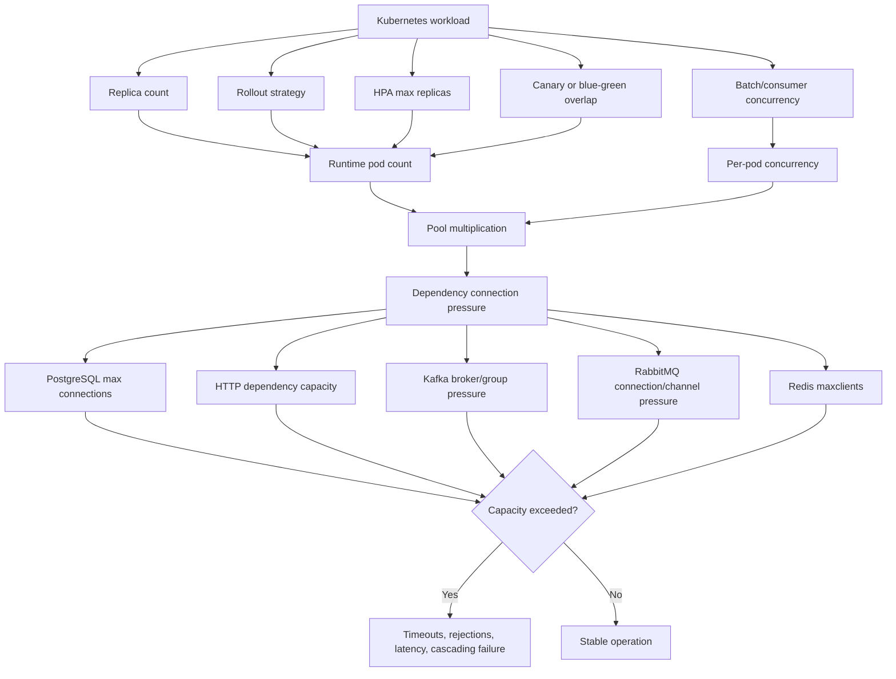
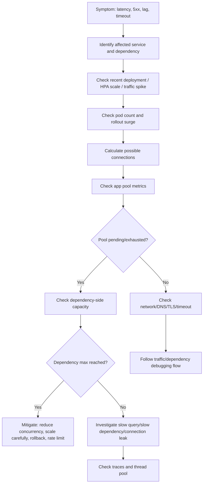

# Part 040 — Connection Pool Operations

Connection pools are one of the most important places where application design, Kubernetes scaling, and dependency capacity collide.

A pool setting that looks safe inside one local JVM can become dangerous when multiplied by:

- replica count;
- max surge during rolling deployment;
- HPA max replicas;
- canary/blue-green parallel deployments;
- consumer concurrency;
- batch parallelism;
- multiple pools per service;
- sidecar/proxy connections;
- readiness checks and management clients;
- retry storms during dependency degradation.

Operational rule:

```text
In Kubernetes, connection pool size is not a per-service number.
It is a per-pod number multiplied by runtime topology.
```

---

## 1. The Multiplication Problem

A common production mistake:

```text
DB max pool size = 50
```

This sounds reasonable until the workload runs as:

```text
6 replicas x 50 connections = 300 possible DB connections
```

During rolling deployment:

```text
6 old pods + 2 surge pods = 8 pods
8 x 50 = 400 possible DB connections
```

With HPA max replicas:

```text
20 max replicas x 50 = 1000 possible DB connections
```

If PostgreSQL allows 500 total connections and multiple services share it, this configuration is an incident waiting to happen.

---

## 2. Pool Capacity Formula

Use this as the first-order estimate:

```text
maximum dependency connections = max runtime pods x pool size per pod x pools per pod
```

Where:

```text
max runtime pods = max replicas + rollout surge + canary/blue-green overlap + batch overlap
```

For a JAX-RS service:

```text
max DB connections = (HPA max replicas + maxSurge pods) x Hikari maximumPoolSize
```

For HTTP client pools:

```text
max outbound connections = pods x max connections per route/service
```

For RabbitMQ:

```text
max channels = pods x channels per connection x concurrency
```

For Kafka:

```text
max active consumers is constrained by partitions, but clients still create broker connections and group coordination load.
```

---

## 3. Mental Model



---

## 4. Why Backend Engineers Must Own This

Platform/SRE can provide node capacity and autoscaling mechanisms, but application teams own pool behavior.

Backend service owner responsibilities:

- know every outbound dependency pool;
- know pool size per pod;
- know HPA max replica impact;
- know rollout surge impact;
- know canary/blue-green overlap impact;
- coordinate with DB/platform teams on max connection budgets;
- tune acquisition timeout, idle timeout, max lifetime, and validation behavior;
- expose pool metrics;
- prevent unbounded client creation;
- prevent connection leaks;
- design backpressure when dependency capacity is exhausted;
- include pool sizing in PR review and production readiness.

Platform/SRE responsibilities usually include:

- cluster scaling behavior;
- service mesh/proxy behavior if present;
- shared dependency capacity visibility;
- platform dashboards;
- network policies and connectivity;
- managed database/broker sizing coordination;
- incident escalation for dependency infrastructure.

Database/broker teams may own:

- PostgreSQL max connections;
- PgBouncer/proxy policy;
- Kafka broker capacity;
- RabbitMQ connection/channel limits;
- Redis `maxclients` and memory policy.

---

## 5. PostgreSQL Connection Pool Operations

Java services commonly use HikariCP, Agroal, app server pools, or framework-managed pools.

Key settings:

| Setting | Operational meaning |
|---|---|
| `maximumPoolSize` | Max DB connections per pod |
| `minimumIdle` | Idle connections held even without traffic |
| `connectionTimeout` | How long request waits for pool acquisition |
| `idleTimeout` | How long idle connections remain open |
| `maxLifetime` | When connections are recycled |
| `validationTimeout` | Health check/validation wait |
| leak detection threshold | Signal for connection not returned |

Failure modes:

- pool exhausted inside pod;
- PostgreSQL max connections exhausted globally;
- slow queries hold connections too long;
- transaction leak;
- connection leak;
- rolling deploy connection spike;
- HPA scale-out overwhelms DB;
- readiness endpoint checks DB too aggressively;
- retry storm creates extra DB pressure;
- migration job competes with API traffic.

Important distinction:

```text
Pool exhausted in app != PostgreSQL max connections exhausted.
```

You need both application pool metrics and database-side connection metrics.

---

## 6. HTTP Client Pool Operations

Java services often call internal APIs, external APIs, API gateways, billing systems, catalog services, order services, authentication services, or cloud endpoints.

Key dimensions:

- max total connections;
- max connections per route/host;
- connection acquisition timeout;
- connect timeout;
- read/request timeout;
- keep-alive strategy;
- idle connection eviction;
- DNS refresh behavior;
- TLS handshake cost;
- proxy behavior;
- retry policy;
- circuit breaker/backpressure.

Failure modes:

- outbound pool exhausted;
- stale connections after backend rotation;
- DNS change not picked up;
- too many keep-alive connections;
- no idle eviction;
- retry storm;
- dependency 5xx amplified;
- thread pool blocked waiting for connection;
- NAT/proxy connection exhaustion;
- ephemeral port exhaustion under high outbound churn.

Operational rule:

```text
Every outbound call needs both timeout policy and pool policy.
```

---

## 7. Kafka Connection and Consumer Capacity Operations

Kafka consumers are not traditional connection pools in the same sense as JDBC, but they still create broker connections and operational pressure.

Key dimensions:

- consumer group;
- partition count;
- replica count;
- concurrency per pod;
- max poll records;
- poll interval;
- session timeout;
- heartbeat interval;
- producer connections if service also publishes;
- admin client usage;
- retry/DLQ producer behavior.

Failure modes:

- replicas exceed partitions and sit idle;
- too many consumers cause rebalance overhead;
- rolling deployment triggers rebalance storm;
- slow processing causes max poll interval breach;
- offset commit failure;
- DLQ producer pressure;
- broker connection pressure;
- consumer lag grows despite scale-out due to partition limit;
- dependency DB pool bottleneck prevents Kafka throughput.

Operational rule:

```text
Kafka consumer scale is bounded by partitions and downstream capacity, not only Kubernetes replicas.
```

---

## 8. RabbitMQ Connection and Channel Operations

RabbitMQ has separate concepts of TCP connection, AMQP channel, consumer, prefetch, ack/nack, and unacked messages.

Key dimensions:

- connections per pod;
- channels per connection;
- consumers per channel;
- prefetch count;
- concurrent message handlers;
- ack/nack behavior;
- retry/DLQ topology;
- connection recovery;
- heartbeat;
- broker connection/channel limits.

Failure modes:

- too many TCP connections;
- too many channels;
- high unacked messages;
- prefetch too high for processing time;
- rolling deploy causes redelivery spike;
- pod shutdown loses in-flight work;
- retry loop amplifies broker pressure;
- DLQ grows silently;
- channel leak.

Operational rule:

```text
RabbitMQ capacity is controlled by consumer count, prefetch, processing time, and ack behavior together.
```

---

## 9. Redis Connection Pool Operations

Redis is often used for cache, distributed locks, rate limiting, session-like data, idempotency keys, or short-lived coordination.

Key dimensions:

- max connections per pod;
- min idle connections;
- command timeout;
- connection acquisition timeout;
- pipeline/batch behavior;
- cluster topology refresh;
- TLS overhead;
- reconnect behavior;
- maxclients;
- memory pressure and eviction policy.

Failure modes:

- Redis `maxclients` exceeded;
- connection pool exhausted;
- blocked commands;
- slow commands hold connections;
- reconnect storm after Redis failover;
- TLS handshake spike;
- cache stampede creates connection pressure;
- distributed lock client leak;
- HPA scale-out overwhelms Redis.

Operational rule:

```text
Redis is fast until every pod creates too many connections or retries too aggressively.
```

---

## 10. Rolling Deployment Connection Spike

During rolling deployment, old and new pods can run together.

Example Deployment strategy:

```yaml
strategy:
  type: RollingUpdate
  rollingUpdate:
    maxSurge: 25%
    maxUnavailable: 25%
```

If replicas are 8, Kubernetes may create extra pods during rollout.

Connection impact:

```text
old pods still hold pools
new pods start and open pools
readiness may perform dependency checks
traffic shifts gradually
for a period, total connections exceed steady-state
```

Risk becomes worse when:

- app opens full pool at startup;
- `minimumIdle` equals `maximumPoolSize`;
- readiness warms dependency connections;
- rollout is slow because readiness is slow;
- HPA is also scaling;
- canary/blue-green overlap exists;
- migration job runs at same time.

---

## 11. Autoscaling and Pool Instability

HPA can stabilize application CPU while destabilizing dependencies.

Example:

```text
CPU high -> HPA scales from 4 to 16 pods
Each pod has DB pool 30
Possible DB connections jump from 120 to 480
DB saturates -> request latency rises
CPU stays high -> HPA keeps pods high
Incident worsens
```

Autoscaling must be checked against:

- DB max connections;
- Kafka partitions;
- RabbitMQ broker capacity;
- Redis `maxclients`;
- downstream API rate limits;
- NAT/proxy connection limits;
- license limits if enterprise dependency has them;
- cost impact.

Operational rule:

```text
HPA max replicas must be validated against downstream dependency capacity.
```

---

## 12. Pool Exhaustion Symptoms

Application symptoms:

- request latency spike;
- timeout waiting for connection from pool;
- increased 5xx;
- thread pool saturation;
- blocked worker threads;
- queue backlog;
- retry storm;
- readiness flapping;
- deadlock-like behavior;
- slow shutdown.

Database symptoms:

- PostgreSQL `too many connections`;
- high active connection count;
- many idle-in-transaction connections;
- lock waits;
- slow queries;
- connection churn.

Broker/cache symptoms:

- Kafka lag grows;
- RabbitMQ unacked messages grow;
- Redis maxclients errors;
- reconnect spikes;
- DLQ growth;
- downstream saturation.

Kubernetes symptoms:

- pods healthy but service degraded;
- HPA scales out but latency worsens;
- rollout stuck due to readiness checks;
- CrashLoop if startup fails on dependency connection;
- pod termination slow because in-flight work waits.

---

## 13. Observability Signals

Minimum application pool metrics:

### DB pool

- active connections;
- idle connections;
- pending threads waiting for connection;
- max pool size;
- connection acquisition latency;
- timeout count;
- leak detection count;
- connection lifetime/recycle count.

### HTTP client pool

- leased/active connections;
- available/idle connections;
- pending connection requests;
- connect timeout count;
- read timeout count;
- response status by dependency;
- retry count;
- circuit breaker state.

### Kafka

- consumer lag;
- rebalance count;
- commit latency/error;
- poll latency;
- processing time;
- DLQ publish count;
- partition assignment per pod.

### RabbitMQ

- queue depth;
- unacked messages;
- consumer count;
- connection count;
- channel count;
- redelivery count;
- ack/nack rate;
- DLQ rate.

### Redis

- connected clients;
- blocked clients;
- command latency;
- pool active/idle/pending;
- timeout count;
- reconnect count;
- cache hit ratio;
- evictions.

---

## 14. Safe Investigation Commands

### Kubernetes view

```bash
kubectl get deploy <deploy> -n <namespace> -o wide
kubectl get hpa -n <namespace>
kubectl describe hpa <hpa> -n <namespace>
kubectl rollout status deploy/<deploy> -n <namespace>
kubectl get pods -n <namespace> -l app=<app> -o wide
```

### Manifest view

```bash
kubectl get deploy <deploy> -n <namespace> -o yaml
kubectl get configmap -n <namespace>
kubectl get secret -n <namespace>
```

Do not print secret values. Only verify references, names, keys, and mount/env wiring according to internal policy.

### Logs

```bash
kubectl logs -n <namespace> deploy/<deploy> --tail=300
kubectl logs -n <namespace> <pod> --previous --tail=200
```

Search for patterns:

```text
connection timeout
pool exhausted
too many connections
could not obtain connection
timeout waiting for idle object
RedisConnectionFailureException
AMQP connection/channel error
Kafka rebalance
max.poll.interval.ms
```

### Runtime inspection

Use application metrics and dashboards first. Use `exec` only if permitted.

```bash
kubectl exec -n <namespace> <pod> -- printenv | grep -E 'POOL|DATASOURCE|KAFKA|RABBIT|REDIS'
```

Be careful: environment variables may contain sensitive data. Prefer config metadata and dashboards over direct inspection in production.

---

## 15. Debugging Flow



---

## 16. Mitigation Options

### Safe short-term mitigations

- rollback deployment that changed pool settings;
- reduce HPA max replicas temporarily if scale-out overwhelms dependency;
- reduce consumer concurrency;
- lower RabbitMQ prefetch;
- pause/suspend batch job competing for connections;
- apply rate limiting at ingress/API gateway if available;
- shed non-critical traffic;
- increase dependency capacity only with owner approval;
- restart pod only if connection leak is confirmed and restart is safe;
- disable aggressive retry through config if supported and approved.

### Risky mitigations

- increasing pool size without dependency capacity validation;
- scaling out API pods to solve DB bottleneck;
- scaling Kafka consumers beyond partition/downstream capacity;
- increasing RabbitMQ prefetch during slow processing;
- increasing Redis clients during Redis latency issue;
- killing all pods at once;
- changing production secrets/config manually outside GitOps;
- bypassing circuit breakers to “restore traffic”.

---

## 17. Pool Sizing Guidelines

### Start from dependency capacity, not application wish

Bad reasoning:

```text
Each pod should have 50 DB connections because traffic is high.
```

Better reasoning:

```text
The database can safely allocate 240 connections to this service.
HPA max is 12 pods.
Rollout surge can add 2 pods.
Safe max pool per pod should be <= 240 / 14 = 17.
Use 15 and validate under load.
```

### Account for multiple services

Dependency capacity is shared.

```text
PostgreSQL max connections
- admin/reserved connections
- migration jobs
- reporting jobs
- service A pool budget
- service B pool budget
- service C pool budget
- emergency/debug capacity
```

### Tune timeouts deliberately

Pool timeout should be shorter than user-facing timeout where possible.

Reason:

```text
If a request cannot acquire a dependency connection quickly, failing fast may be safer than holding threads until ingress timeout.
```

But too aggressive a timeout can create false failures during small spikes. Validate with load testing.

---

## 18. Java/JAX-RS Specific Concerns

For Java REST services, connection pool health interacts with:

- request worker threads;
- async executor threads;
- transaction boundaries;
- JPA/MyBatis/JDBC usage;
- HTTP client usage;
- exception mapping;
- timeout propagation;
- retry logic;
- health checks;
- graceful shutdown.

Dangerous pattern:

```text
JAX-RS request thread waits for DB connection
DB pool exhausted
request threads pile up
CPU may not be high
HPA does not scale
Ingress times out
users see 504
```

Another dangerous pattern:

```text
HPA scales out because CPU is high
new pods open more DB pools
DB becomes slower
requests hold connections longer
pool exhaustion worsens
```

Production-ready services expose pool metrics and include pool saturation in dashboards.

---

## 19. Rollout Review Checklist

Before deploying a change that touches pools, ask:

- Did `maximumPoolSize` change?
- Did `minimumIdle` change?
- Did HPA min/max replicas change?
- Did `maxSurge` change?
- Is a canary/blue-green overlap expected?
- Is a migration job running during rollout?
- Did retry policy change?
- Did timeout policy change?
- Did consumer concurrency or prefetch change?
- Did a new dependency client get introduced?
- Does the dependency owner approve the new capacity budget?
- Are pool dashboards available during rollout?
- Is rollback safe if schema/config changed?

---

## 20. PR Review Checklist

For Kubernetes, Helm, Kustomize, or app config PRs, verify:

### Kubernetes configuration

- replica count;
- HPA min/max replicas;
- rollout maxSurge/maxUnavailable;
- canary/blue-green overlap;
- batch/CronJob concurrency;
- resource requests that affect HPA;
- readiness dependency behavior.

### Application pool configuration

- DB pool max/min;
- HTTP client max total/per route;
- Redis pool max/min;
- Kafka consumer concurrency;
- RabbitMQ prefetch/concurrency;
- timeout values;
- retry policy;
- circuit breaker policy;
- leak detection;
- metric exposure.

### Dependency capacity

- PostgreSQL max connection budget;
- Redis maxclients;
- RabbitMQ connection/channel limits;
- Kafka partitions and broker capacity;
- downstream API rate limits;
- cloud service quotas;
- NAT/proxy connection limits.

---

## 21. Incident Runbook: Suspected Pool Exhaustion

1. Confirm symptom.

```text
latency spike, 5xx, timeout, lag, queue depth, readiness failure
```

2. Check recent changes.

```bash
kubectl rollout history deploy/<deploy> -n <namespace>
kubectl rollout status deploy/<deploy> -n <namespace>
```

3. Check runtime pod count.

```bash
kubectl get pods -n <namespace> -l app=<app>
kubectl get hpa -n <namespace>
```

4. Calculate possible connections.

```text
runtime pods x pool size per pod
```

5. Check pool metrics.

```text
active, idle, pending, timeout, acquisition latency
```

6. Check dependency-side metrics.

```text
DB connections, Redis clients, RabbitMQ connections/channels, Kafka lag/rebalance
```

7. Decide mitigation.

```text
rollback, reduce concurrency, pause batch, rate limit, tune config, escalate dependency capacity
```

8. Capture evidence.

```text
timeline, deployment version, pod count, pool metrics, dependency metrics, mitigation taken
```

---

## 22. EKS, AKS, On-Prem, and Hybrid Notes

### EKS

Verify internally:

- RDS/Aurora max connection budget if PostgreSQL is managed;
- PgBouncer/proxy usage;
- ElastiCache Redis maxclients and failover behavior if used;
- MSK/self-managed Kafka broker capacity;
- Amazon MQ/RabbitMQ capacity if used;
- NAT gateway connection/egress path;
- security group and NetworkPolicy effects;
- CloudWatch dashboards for dependency and pod metrics.

### AKS

Verify internally:

- Azure Database for PostgreSQL connection limits;
- PgBouncer/proxy usage;
- Azure Cache for Redis client limits;
- Event Hubs/Kafka-compatible or Kafka deployment behavior if relevant;
- RabbitMQ hosting model;
- Azure NAT Gateway/firewall/proxy limits;
- Azure Monitor dashboards.

### On-prem/hybrid

Verify internally:

- database connection caps;
- broker connection/channel caps;
- corporate proxy limits;
- firewall idle timeout;
- DNS/load balancer behavior;
- cross-network latency;
- dependency ownership boundaries.

---

## 23. Internal Verification Checklist

### Workload and Kubernetes runtime

- current replica count;
- HPA min/max replicas;
- rollout maxSurge/maxUnavailable;
- canary/blue-green overlap policy;
- batch/CronJob concurrency;
- consumer concurrency;
- pod readiness behavior;
- termination grace period;
- graceful shutdown implementation.

### Pool configuration

- DB pool max/min/timeout/lifetime;
- HTTP client pool max/per-route/timeout;
- Redis pool max/min/timeout;
- RabbitMQ connections/channels/prefetch;
- Kafka concurrency and partition mapping;
- retry/circuit breaker policy;
- pool metrics enabled;
- leak detection enabled where appropriate.

### Dependency capacity

- PostgreSQL max connection budget;
- connection proxy policy;
- Kafka partition count and broker capacity;
- RabbitMQ connection/channel limit;
- Redis maxclients;
- downstream API quota/rate limit;
- cloud service quota;
- NAT/proxy/firewall connection limits.

### CSG/team verification

- verify actual dependency ownership for Quote & Order services;
- verify internal connection budget per service;
- verify whether PgBouncer/proxy is used;
- verify standard Java pool library/config pattern;
- verify HPA max replica policy;
- verify rollout surge policy;
- verify consumer concurrency standards;
- verify dashboard panels for pool saturation;
- verify incident escalation for DB/broker/cache saturation;
- verify PR checklist includes pool multiplication math.

---

## 24. Summary

Connection pools are operational contracts, not just performance knobs.

The safe mental model:

```text
pool size per pod x maximum pod count x rollout overlap <= dependency capacity budget
```

For senior backend engineers, the goal is not to maximize pool size. The goal is to keep throughput, latency, dependency protection, autoscaling, rollout safety, and failure recovery in balance.

A production-ready Kubernetes backend service must make pool behavior visible, bounded, and reviewed as part of every scaling and deployment decision.
