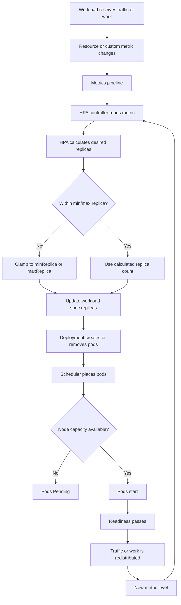
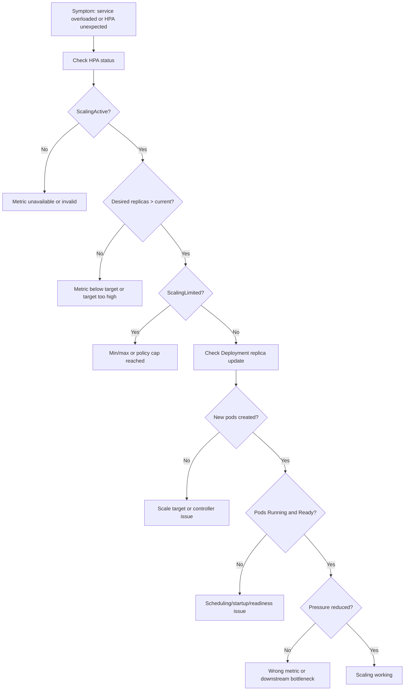

# Part 041 — HPA Operations

Horizontal Pod Autoscaler is not a magic reliability feature.

It is a feedback controller that changes replica count based on observed metrics. That means it has all the risks of any feedback loop:

- delayed signal;
- noisy signal;
- wrong metric;
- missing metric;
- unstable control policy;
- insufficient cluster capacity;
- dependency bottleneck outside Kubernetes;
- scaling that improves one symptom while worsening another.

For backend engineers, the main question is not:

```text
Do we have HPA?
```

The better question is:

```text
Does HPA scale the correct workload using a signal that represents real pressure,
without overloading downstream dependencies or creating instability?
```

---

## 1. What HPA Does

HPA watches a target workload and adjusts `spec.replicas`.

Typical targets:

- Deployment;
- StatefulSet, less common and riskier;
- custom scalable resource;
- consumer deployment;
- API service deployment.

Typical signals:

- CPU utilization;
- memory utilization;
- pod-level custom metrics;
- object metrics;
- external metrics;
- request rate;
- queue depth;
- consumer lag;
- business workload backlog.

HPA does not create nodes by itself. It only asks for more pods.

If there is no node capacity, new pods remain Pending. Cluster Autoscaler, Karpenter, or AKS node pool autoscaling may then provision nodes if configured correctly.

```text
HPA scales pods.
Cluster autoscaling scales nodes.
Dependency teams scale databases, brokers, caches, and external systems.
```

---

## 2. HPA Control Loop Mental Model



Operationally, this loop has latency.

Every step has delay:

- metric collection delay;
- metrics adapter delay;
- HPA sync period;
- pod scheduling delay;
- image pull delay;
- JVM startup delay;
- readiness delay;
- warm-up delay;
- load balancer or consumer rebalance delay;
- node provisioning delay.

For Java/JAX-RS services, startup and warm-up time matter. A service that takes 90 seconds to become ready cannot rescue a latency spike that saturates in 10 seconds.

---

## 3. The Most Important HPA Invariant

```text
HPA is safe only when scaling the workload actually reduces the pressure being measured.
```

Examples where scaling helps:

- stateless JAX-RS API has CPU-bound request handling and enough downstream capacity;
- Kafka consumer group has more partitions than current consumers and lag is growing;
- RabbitMQ queue has enough independent messages and downstream systems can absorb more writes;
- batch worker has independent work units and idempotent execution.

Examples where scaling may not help:

- database is the bottleneck;
- all requests contend on the same lock;
- Kafka topic has fewer partitions than replicas;
- RabbitMQ prefetch is misconfigured;
- Redis is saturated;
- external API has rate limit;
- pod startup is slower than traffic spike duration;
- CPU metric is low because threads are blocked on DB;
- memory metric scales pods even though memory is mostly heap baseline.

---

## 4. Backend Engineer Responsibility

Backend service owners should understand and review:

- whether HPA is enabled;
- min replica count;
- max replica count;
- metric target;
- scaling policy;
- stabilization window;
- workload startup time;
- readiness behavior;
- graceful shutdown;
- downstream capacity;
- connection pool multiplication;
- consumer concurrency;
- retry behavior;
- cost implications;
- alert coverage.

Backend engineers usually should not directly own cluster-wide autoscaler policy, node pool sizing, metrics adapter installation, or cloud provider autoscaling integration unless the team explicitly owns platform responsibilities.

---

## 5. Platform/SRE Responsibility

Platform/SRE usually owns:

- metrics server availability;
- custom metrics adapter;
- external metrics adapter;
- cluster autoscaler/Karpenter/node pool autoscaler;
- node capacity model;
- quota and LimitRange;
- global autoscaling guardrails;
- common dashboards;
- autoscaling policy standards;
- admission policies;
- cost visibility;
- incident support for scheduling and capacity failures.

Backend service owners provide the service-specific scaling semantics.

---

## 6. HPA Object Anatomy

Representative example:

```yaml
apiVersion: autoscaling/v2
kind: HorizontalPodAutoscaler
metadata:
  name: quote-api
  namespace: quote-order-prod
spec:
  scaleTargetRef:
    apiVersion: apps/v1
    kind: Deployment
    name: quote-api
  minReplicas: 4
  maxReplicas: 20
  metrics:
    - type: Resource
      resource:
        name: cpu
        target:
          type: Utilization
          averageUtilization: 65
  behavior:
    scaleUp:
      stabilizationWindowSeconds: 60
      policies:
        - type: Percent
          value: 100
          periodSeconds: 60
        - type: Pods
          value: 4
          periodSeconds: 60
      selectPolicy: Max
    scaleDown:
      stabilizationWindowSeconds: 300
      policies:
        - type: Percent
          value: 25
          periodSeconds: 60
      selectPolicy: Min
```

Fields that matter operationally:

| Field | Operational meaning |
|---|---|
| `scaleTargetRef` | Workload being scaled |
| `minReplicas` | Availability and idle capacity floor |
| `maxReplicas` | Blast radius and cost ceiling |
| `metrics` | Signal used to infer pressure |
| `averageUtilization` | Target relative to request, not limit |
| `averageValue` | Absolute target value |
| `behavior.scaleUp` | How aggressively replicas are added |
| `behavior.scaleDown` | How conservatively replicas are removed |
| `stabilizationWindowSeconds` | Dampening to avoid thrash |

---

## 7. CPU-Based HPA

CPU-based HPA is common for stateless APIs.

It works best when:

- CPU usage correlates with request load;
- requests are CPU-bound or moderately CPU-bound;
- resource requests are realistic;
- latency increases as CPU saturates;
- downstream dependencies have capacity;
- pod startup is reasonably fast.

It works poorly when:

- threads are blocked on DB or broker calls;
- CPU limit throttling distorts the signal;
- CPU request is too low or too high;
- service has high baseline CPU at idle;
- workload is memory-bound or IO-bound;
- load is bursty and short-lived;
- pod warm-up is slow.

Important rule:

```text
CPU utilization target is calculated against CPU request, not CPU limit.
```

If CPU request is wrong, HPA behavior is wrong.

Example:

```text
request = 500m
actual usage = 400m
reported utilization = 80%
```

If request should have been 1000m, the same usage would be 40%.

A bad CPU request can cause premature scaling, late scaling, or unnecessary cost.

---

## 8. Memory-Based HPA

Memory-based HPA is harder to use safely for Java workloads.

Why:

- JVM heap often does not shrink quickly;
- memory usage may represent baseline, not traffic pressure;
- GC behavior can create sawtooth patterns;
- cache-heavy services may hold memory intentionally;
- scaling out may increase total memory cost without reducing per-pod memory;
- memory leaks are not fixed by scaling.

Memory-based HPA may make sense when:

- memory usage correlates with active work units;
- workload processes large independent payloads;
- per-pod memory drops when work is distributed;
- max replica is tightly bounded;
- memory leak has been ruled out.

For Java/JAX-RS services, memory HPA should be reviewed carefully.

Operational warning:

```text
Do not use memory HPA as a substitute for JVM memory tuning or leak investigation.
```

---

## 9. Custom Metrics HPA

Custom metrics can be better than CPU/memory because they represent service pressure directly.

Examples:

- request rate per pod;
- in-flight requests;
- request queue length;
- thread pool utilization;
- connection pool utilization;
- active worker count;
- domain backlog;
- workflow task backlog.

Good custom metrics have these properties:

- strongly correlated with load;
- available reliably;
- low cardinality;
- stable under failures;
- understandable by service owners;
- tied to a runbook;
- bounded by downstream capacity.

Bad custom metrics:

- too noisy;
- too delayed;
- dependent on the failing service itself;
- high cardinality;
- not emitted during startup failure;
- not meaningful during partial outage;
- disconnected from business impact.

---

## 10. External Metrics HPA

External metrics are commonly used for backlog-based scaling.

Examples:

- Kafka consumer lag;
- RabbitMQ queue depth;
- Redis stream pending entries;
- cloud queue depth;
- scheduled work backlog;
- external rate limit capacity.

External metrics introduce additional failure points:

- metric adapter unavailable;
- metric query wrong;
- metric stale;
- metric delayed;
- permissions missing;
- wrong namespace/selector;
- metric cardinality explosion;
- external monitoring outage.

Part 042 goes deeper into queue/event-based autoscaling.

---

## 11. HPA Conditions

HPA status contains important conditions.

Common conditions:

| Condition | Meaning |
|---|---|
| `AbleToScale` | HPA can fetch scale target and update replicas |
| `ScalingActive` | HPA has valid metrics and can calculate desired replicas |
| `ScalingLimited` | Desired replicas were capped by min/max or policy |

Operational interpretation:

```text
AbleToScale false     -> target or permission problem
ScalingActive false   -> metric problem
ScalingLimited true   -> min/max/policy limiting desired scaling
```

Do not debug HPA only from current replica count. Read conditions and events.

---

## 12. Production-Safe Investigation Commands

Start broad:

```bash
kubectl get hpa -n <namespace>
```

Inspect one HPA:

```bash
kubectl describe hpa <hpa-name> -n <namespace>
```

Read status in YAML:

```bash
kubectl get hpa <hpa-name> -n <namespace> -o yaml
```

Check target Deployment:

```bash
kubectl get deploy <deployment-name> -n <namespace>
kubectl describe deploy <deployment-name> -n <namespace>
```

Check pods:

```bash
kubectl get pods -n <namespace> -l app.kubernetes.io/name=<app-name> -o wide
```

Check resource usage:

```bash
kubectl top pods -n <namespace>
kubectl top deploy <deployment-name> -n <namespace>
```

Check events:

```bash
kubectl get events -n <namespace> --sort-by=.lastTimestamp
```

Check if pods are pending after scale-out:

```bash
kubectl get pods -n <namespace> --field-selector=status.phase=Pending
```

Check scheduling reason:

```bash
kubectl describe pod <pending-pod> -n <namespace>
```

Check resource requests:

```bash
kubectl get deploy <deployment-name> -n <namespace> -o jsonpath='{.spec.template.spec.containers[*].resources}'
```

Do not patch HPA in production unless your team process explicitly allows it.

---

## 13. HPA Debugging Flow



---

## 14. Failure Mode: HPA Has No Metrics

Symptoms:

- `ScalingActive=False`;
- `<unknown>` in HPA output;
- no current metric value;
- no scale-out during load;
- events mention failed metric retrieval.

Possible causes:

- metrics server unavailable;
- resource requests missing;
- custom metrics adapter down;
- wrong metric name;
- wrong label selector;
- Prometheus query returns no data;
- external metrics permission issue;
- metric not emitted by application;
- metric cardinality changed.

Safe investigation:

```bash
kubectl describe hpa <hpa-name> -n <namespace>
kubectl top pods -n <namespace>
kubectl get deploy <deployment-name> -n <namespace> -o yaml
```

Escalate to platform/SRE when:

- metrics server is unavailable cluster-wide;
- custom/external metrics adapter is failing;
- adapter RBAC or cloud permission is broken;
- multiple services lose autoscaling metrics.

---

## 15. Failure Mode: HPA Does Not Scale Up

Possible causes:

- metric below threshold;
- target too high;
- resource request too high;
- min/max replica already reached;
- scale-up policy too conservative;
- stabilization window delaying action;
- metrics stale;
- pod is blocked on IO but CPU is low;
- application bottleneck is not measured;
- HPA target references wrong deployment.

Questions to ask:

```text
Is the chosen metric actually high?
Is the HPA reading that metric?
Is desiredReplicas higher than currentReplicas?
Is maxReplicas reached?
Would adding pods reduce the bottleneck?
```

---

## 16. Failure Mode: HPA Scales Up but Service Does Not Recover

This is common in backend systems.

Possible causes:

- database saturation;
- connection pool exhaustion;
- Kafka/RabbitMQ partition/concurrency limit;
- Redis saturation;
- external API rate limit;
- downstream timeout;
- retry storm;
- pods not becoming ready fast enough;
- new pods cold-start slowly;
- cache warm-up required;
- CPU throttling continues because limits are too low;
- traffic is sticky and not redistributed evenly.

Operational response:

1. Confirm pods became Ready.
2. Confirm traffic/work is distributed to new pods.
3. Check dependency latency/error rate.
4. Check connection pool metrics.
5. Check ingress or consumer balancing behavior.
6. Check retry volume.
7. Decide whether mitigation should be scale-out, rollback, rate limiting, traffic shaping, or dependency escalation.

---

## 17. Failure Mode: Scaling Thrash

Scaling thrash means replicas repeatedly increase and decrease.

Symptoms:

- frequent replica changes;
- pod churn;
- repeated readiness transitions;
- latency instability;
- consumer rebalances;
- connection churn;
- noisy deployment/service metrics;
- increased cost.

Possible causes:

- noisy metric;
- scale-down window too short;
- aggressive scale-up/down policy;
- low traffic with bursty metric;
- CPU request mis-sized;
- metric delay;
- HPA and application internal concurrency fighting each other;
- multiple autoscalers managing same workload.

Mitigation options:

- increase scale-down stabilization window;
- use less noisy metric;
- increase min replicas;
- reduce scale-down rate;
- add queue/backpressure;
- tune resource requests;
- coordinate with KEDA or other autoscaler if used.

---

## 18. Java/JAX-RS Specific Considerations

Autoscaling Java APIs has hidden costs.

Key factors:

- JVM startup time;
- class loading;
- dependency initialization;
- connection pool warm-up;
- JIT warm-up;
- TLS truststore loading;
- readiness endpoint behavior;
- HTTP server thread pool;
- worker pool size;
- DB pool per pod;
- memory baseline per pod;
- GC behavior under burst load.

A new replica is not useful until it is Ready and warm enough to serve traffic.

Operational pattern:

```text
Scale-out time = scheduling + image pull + JVM startup + readiness + warm-up + traffic redistribution
```

If this total time is long, HPA should not be the only protection against traffic spikes.

Complementary controls:

- sufficient min replicas;
- traffic shaping;
- queueing;
- backpressure;
- rate limiting;
- fast rollback;
- dependency circuit breakers;
- careful timeout budgets.

---

## 19. Dependency Impact

Scaling pods multiplies dependency pressure.

### PostgreSQL

More pods mean more DB pool capacity.

Risk:

```text
HPA scale-out -> more pods -> more DB connections -> DB max connections exhausted -> more latency -> more scale-out
```

### Kafka

More consumer pods may help only up to partition count.

Risk:

```text
HPA scale-out beyond useful partition parallelism -> more rebalances -> worse lag
```

### RabbitMQ

More consumers can drain queue faster, but may overload downstream processing.

Risk:

```text
More consumers + high prefetch -> more unacked messages -> slower recovery or duplicate pressure
```

### Redis

More pods mean more client connections and more cache load.

Risk:

```text
More pods -> more Redis connections -> maxclients/memory/network saturation
```

### Camunda

More workers increase job activation and processing concurrency.

Risk:

```text
More workers -> more job locks -> more incidents if downstream dependency is failing
```

---

## 20. EKS Considerations

For EKS, verify:

- metrics server availability;
- custom/external metrics adapter if used;
- Cluster Autoscaler or Karpenter behavior;
- managed node group capacity;
- subnet IP availability with VPC CNI;
- pod scheduling across AZs;
- node provisioning delay;
- spot interruption risk;
- IAM permission for external metrics if AWS services are queried.

Common EKS-specific scaling blockers:

- subnet IP exhaustion;
- insufficient EC2 capacity in AZ;
- node group max size;
- Karpenter provisioner constraints;
- pod security group or ENI limits;
- quota limits;
- image pull delay from ECR;
- ALB target registration delay.

---

## 21. AKS Considerations

For AKS, verify:

- metrics server availability;
- Azure Monitor/custom metrics integration if used;
- node pool autoscaling;
- node pool min/max count;
- VMSS provisioning delay;
- subnet IP capacity with Azure CNI;
- private cluster networking;
- ACR pull performance and permission;
- Azure Load Balancer/Application Gateway target health.

Common AKS-specific scaling blockers:

- node pool max size;
- subnet IP exhaustion;
- VM SKU capacity issue;
- Azure quota limit;
- image pull issue from ACR;
- NSG/UDR route issue;
- private endpoint/DNS dependency failure.

---

## 22. On-Prem and Hybrid Considerations

In on-prem/hybrid Kubernetes, HPA may be limited by:

- fixed node capacity;
- slower provisioning;
- no cluster autoscaler;
- local registry throughput;
- corporate proxy;
- internal DNS;
- firewall approval;
- static load balancer capacity;
- strict quota;
- manual node operations.

For hybrid systems, scaling more pods in one cluster may increase traffic across private links, VPN, Direct Connect, or ExpressRoute.

Cost and latency trade-offs must be reviewed.

---

## 23. Observability Signals

Minimum dashboard panels for HPA-operated services:

- current replicas;
- desired replicas;
- available replicas;
- HPA target metric;
- HPA current metric;
- scale events;
- CPU usage vs request;
- memory usage vs request/limit;
- pod readiness;
- pod startup duration;
- request rate;
- p95/p99 latency;
- error rate;
- dependency latency;
- DB pool usage;
- queue lag/depth if applicable;
- pending pods;
- node capacity;
- cost per service if available.

Alert candidates:

- HPA metric unavailable;
- HPA at max replicas with high latency/error rate;
- desired replicas greater than current but pods Pending;
- scale thrash;
- min replicas below production standard;
- resource requests missing;
- HPA max replica exceeds dependency budget.

---

## 24. Safe Mitigation Options

Depending on incident type:

| Symptom | Possible safe mitigation |
|---|---|
| HPA maxed and latency high | Check downstream capacity before increasing max replicas |
| HPA no metrics | Escalate metrics adapter/metrics server; consider manual scale only if approved |
| Pods Pending after scale-out | Escalate platform/SRE for capacity/scheduling |
| Scale thrash | Increase stabilization window or min replicas through normal change path |
| DB overloaded after scale-out | Reduce concurrency, rollback, apply rate limit, or coordinate DB mitigation |
| Consumer lag high | Check partition/prefetch/downstream bottleneck before increasing replicas |
| Memory high | Investigate JVM/leak before memory-based scaling |

Manual scale in production is risky under GitOps because reconciliation may revert it.

If manual scale is allowed, record:

- who approved;
- exact command;
- time;
- reason;
- expected impact;
- rollback/revert path;
- GitOps reconciliation impact.

---

## 25. HPA PR Review Checklist

Review every HPA change for:

- correct target workload;
- correct namespace;
- min replicas appropriate for production availability;
- max replicas within dependency capacity;
- CPU request realistic if using CPU utilization;
- memory HPA justified if used;
- custom/external metric availability;
- scale-up policy not too aggressive;
- scale-down policy not too aggressive;
- stabilization windows present;
- alert when max replicas reached;
- alert when metrics unavailable;
- interaction with PDB;
- interaction with rollout maxSurge;
- interaction with connection pools;
- impact on PostgreSQL/Kafka/RabbitMQ/Redis/Camunda;
- EKS/AKS/node pool capacity;
- cost impact;
- rollback path.

---

## 26. Internal Verification Checklist

Verify internally:

- Which workloads have HPA enabled?
- Which workloads intentionally do not use HPA?
- What is the standard min replica count for production APIs?
- What is the approved HPA API version?
- Are CPU requests mandatory?
- Are memory-based HPAs allowed?
- Are custom metrics supported?
- Are external metrics supported?
- Is KEDA used?
- Who owns the metrics adapter?
- Who owns Cluster Autoscaler/Karpenter/AKS node pool autoscaling?
- What dashboards show current vs desired replicas?
- What alert fires when HPA reaches max replicas?
- What alert fires when metrics are unavailable?
- Are HPA max replicas reviewed against DB/broker/cache capacity?
- Are HPA changes reviewed by platform/SRE?
- Are manual scale actions allowed in production?
- How does GitOps handle manual scaling?
- Are HPA decisions documented in ADR or production readiness review?

---

## 27. Key Takeaways

HPA is useful, but only when its signal, policy, and dependency model are correct.

For backend engineers, HPA operations require understanding:

- what pressure the metric represents;
- whether scaling pods reduces that pressure;
- how long scale-out takes;
- whether new pods become Ready quickly;
- whether downstream systems can absorb more concurrency;
- whether max replicas are safe;
- whether scaling behavior is observable;
- whether failure modes are covered by runbooks.

The dangerous assumption is:

```text
More pods always means more reliability.
```

The production-grade view is:

```text
More pods are helpful only when they add useful capacity without creating a new bottleneck.
```
