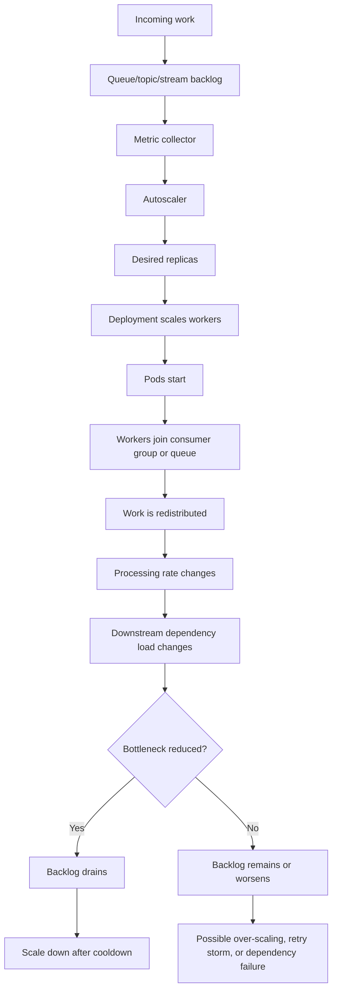
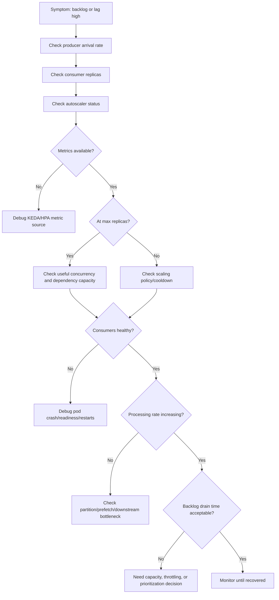

# Part 042 — Queue-Based and Event-Based Autoscaling

Queue-based autoscaling looks simple:

```text
backlog goes up -> add consumers
backlog goes down -> remove consumers
```

In production, it is more subtle.

Backlog is not just a scaling signal. It is a symptom of the relationship between:

- message arrival rate;
- processing rate;
- consumer concurrency;
- partition or queue topology;
- downstream dependency capacity;
- retry behavior;
- poison messages;
- DLQ policy;
- broker health;
- pod startup time;
- shutdown safety;
- idempotency;
- ordering constraints.

For backend engineers, the central question is:

```text
Will adding more pods actually increase safe throughput,
or will it amplify rebalances, contention, retries, and dependency overload?
```

---

## 1. Queue-Based Autoscaling Mental Model



The autoscaler observes backlog, but backlog does not explain why the system is behind.

Backlog can mean:

- not enough consumers;
- consumers are crashing;
- consumers are too slow;
- downstream dependency is slow;
- poison messages are blocking progress;
- broker is unhealthy;
- partition assignment is inefficient;
- offset commits are failing;
- messages are arriving faster than designed capacity;
- HPA/KEDA cannot see metrics;
- autoscaler is capped by max replicas;
- pods are Pending due to cluster capacity.

---

## 2. What Event-Based Autoscaling Is Good For

Event-based autoscaling is useful when:

- work items are independent;
- processing can be parallelized safely;
- consumers are stateless or state is externalized;
- idempotency is handled;
- downstream dependencies can absorb more concurrency;
- ordering constraints are understood;
- backlog metric is reliable;
- scale-out time is acceptable;
- graceful shutdown prevents duplicate or lost work.

It is risky when:

- strict ordering is required;
- processing is not idempotent;
- downstream system is already saturated;
- consumer startup is slow;
- partitions are fewer than desired replicas;
- prefetch is too high;
- retry loops inflate backlog;
- poison messages dominate lag;
- each pod opens large DB/Redis/broker pools;
- scale-down interrupts in-flight work.

---

## 3. Backend Engineer Responsibility

Backend service owners must understand:

- what backlog metric means;
- whether backlog is per topic, partition, queue, stream, or consumer group;
- whether messages are independent;
- maximum useful concurrency;
- idempotency guarantees;
- retry and DLQ behavior;
- graceful shutdown behavior;
- offset commit or ack timing;
- downstream capacity;
- per-pod connection pool size;
- max replica safety;
- observability and alert coverage;
- whether scale-down can interrupt work.

Platform/SRE usually owns:

- KEDA installation if used;
- external metrics adapter;
- metrics authentication;
- cluster autoscaling;
- node capacity;
- shared autoscaling standards;
- broker/platform-level dashboards;
- incident escalation for metrics or capacity failures.

---

## 4. KEDA Awareness

KEDA is commonly used to autoscale workloads based on external event sources.

Common objects:

- `ScaledObject`;
- `TriggerAuthentication`;
- `ClusterTriggerAuthentication`;
- generated HPA;
- scaler-specific metadata.

Representative structure:

```yaml
apiVersion: keda.sh/v1alpha1
kind: ScaledObject
metadata:
  name: quote-event-consumer
  namespace: quote-order-prod
spec:
  scaleTargetRef:
    name: quote-event-consumer
  minReplicaCount: 2
  maxReplicaCount: 20
  pollingInterval: 30
  cooldownPeriod: 300
  triggers:
    - type: kafka
      metadata:
        bootstrapServers: kafka-bootstrap.kafka.svc:9092
        consumerGroup: quote-event-consumer
        topic: quote-events
        lagThreshold: "100"
```

Operationally important fields:

| Field | Meaning |
|---|---|
| `scaleTargetRef` | Workload being scaled |
| `minReplicaCount` | Baseline availability/processing capacity |
| `maxReplicaCount` | Safety and cost ceiling |
| `pollingInterval` | How often KEDA checks the source |
| `cooldownPeriod` | How long before scaling down |
| `triggers` | Event source and metric configuration |
| `TriggerAuthentication` | Secret/identity used to read source metrics |

KEDA eventually influences an HPA, so both KEDA status and HPA status matter.

---

## 5. KEDA Debugging Commands

Check ScaledObjects:

```bash
kubectl get scaledobject -n <namespace>
```

Inspect one ScaledObject:

```bash
kubectl describe scaledobject <name> -n <namespace>
```

View rendered status:

```bash
kubectl get scaledobject <name> -n <namespace> -o yaml
```

Find generated HPA:

```bash
kubectl get hpa -n <namespace>
```

Inspect generated HPA:

```bash
kubectl describe hpa <generated-hpa-name> -n <namespace>
```

Check KEDA operator if allowed:

```bash
kubectl get pods -n keda
kubectl logs -n keda deploy/keda-operator
```

Only inspect platform namespaces if your access policy allows it. Otherwise escalate to platform/SRE.

---

## 6. Kafka Lag Scaling

Kafka lag scaling is one of the most common event-based patterns.

Core terms:

- topic;
- partition;
- consumer group;
- current offset;
- end offset;
- lag;
- partition assignment;
- rebalance;
- commit;
- retry topic;
- DLQ.

Kafka lag is usually:

```text
end offset - committed consumer offset
```

Scaling consumers can help only when there are enough partitions and processing can run in parallel.

Hard limit:

```text
Maximum useful active consumers for one consumer group is bounded by partition count.
```

If a topic has 6 partitions, scaling one consumer group to 20 pods does not create 20-way useful consumption. Fourteen pods may be idle or cause extra group coordination overhead.

---

## 7. Kafka Scaling Formula

A practical estimate:

```text
useful consumer replicas <= partition count
```

But that is not enough.

Also check:

```text
messages per second per partition
processing time per message
consumer concurrency per pod
DB/API calls per message
retry rate
commit interval
rebalance duration
```

Throughput approximation:

```text
processing capacity = active consumers x concurrency per consumer x messages per second per worker
```

Backlog drain time:

```text
drain time = backlog / (processing capacity - arrival rate)
```

If processing capacity is lower than arrival rate, backlog will grow no matter how long you wait.

---

## 8. Kafka Failure Modes Under Autoscaling

### 8.1 Scaling Beyond Partition Count

Symptoms:

- replicas increase but lag does not improve;
- some pods idle;
- frequent rebalances;
- CPU/network overhead rises;
- throughput flatlines.

Mitigation:

- cap max replicas to partition count or useful concurrency;
- increase partitions only if ordering and partition key design allow it;
- increase per-pod concurrency carefully;
- optimize processing path.

### 8.2 Rebalance Storm

Symptoms:

- repeated consumer group rebalances;
- consumption pauses;
- lag grows during scale events;
- pod churn;
- deployment rollout worsens lag.

Possible causes:

- aggressive scale up/down;
- short cooldown period;
- frequent restarts;
- liveness probe killing consumers;
- long processing blocking poll loop;
- bad session timeout/heartbeat config.

Mitigation:

- increase cooldown/stabilization;
- improve graceful shutdown;
- tune consumer heartbeat/session settings;
- avoid unnecessary rollouts during lag incidents;
- check cooperative rebalancing support if applicable.

### 8.3 Downstream Bottleneck

Symptoms:

- lag high;
- consumers running;
- DB latency high;
- external API errors;
- retry/DLQ increasing;
- adding pods worsens dependency pressure.

Mitigation:

- stop increasing replicas blindly;
- apply backpressure;
- reduce concurrency;
- protect dependency;
- escalate dependency owner;
- consider temporarily pausing or rate-limiting consumers if approved.

---

## 9. Kafka Operational Checklist

Verify:

- topic name;
- consumer group;
- partition count;
- current lag per partition;
- replica count;
- maxReplicaCount;
- consumer concurrency per pod;
- assignment strategy;
- rebalance frequency;
- offset commit mode;
- retry/DLQ topics;
- poison message handling;
- shutdown hook;
- max poll interval;
- processing timeout;
- DB/API dependency capacity;
- dashboard and alerts.

---

## 10. RabbitMQ Queue Depth Scaling

RabbitMQ scaling is usually based on queue depth or message rate.

Core terms:

- queue depth;
- ready messages;
- unacked messages;
- consumer count;
- prefetch;
- ack/nack;
- redelivery;
- dead-letter exchange;
- DLQ;
- connection;
- channel.

Queue depth alone is not enough.

You need to know:

```text
ready messages + unacked messages + redelivery rate + processing rate
```

---

## 11. RabbitMQ Prefetch and Scaling

Prefetch controls how many unacked messages a consumer can hold.

If prefetch is high:

```text
scale-out -> many consumers x high prefetch -> many messages in-flight
```

Risks:

- uneven work distribution;
- slow recovery after pod crash;
- high duplicate/redelivery pressure;
- memory pressure in consumers;
- downstream overload;
- messages stuck as unacked.

Example:

```text
20 pods x prefetch 100 = 2000 possible unacked messages
```

That may be fine for tiny idempotent messages. It may be dangerous for order mutations, billing events, or external side effects.

---

## 12. RabbitMQ Scaling Failure Modes

### 12.1 Queue Depth High, Consumers Present

Possible causes:

- each message is slow;
- downstream dependency slow;
- prefetch too low for safe throughput;
- consumer concurrency too low;
- DB/API bottleneck;
- poison message retry loop;
- broker flow control;
- consumer errors.

### 12.2 Unacked Messages High

Possible causes:

- processing slow;
- prefetch too high;
- consumer crash/restart;
- stuck worker threads;
- ack not executed;
- network issue;
- downstream call hanging.

### 12.3 Redelivery High

Possible causes:

- messages fail repeatedly;
- nack/requeue loop;
- pod restarts during processing;
- missing idempotency;
- bad DLQ policy;
- poison messages.

---

## 13. RabbitMQ Operational Checklist

Verify:

- queue name;
- ready message count;
- unacked message count;
- redelivery count;
- consumer count;
- prefetch;
- ack/nack behavior;
- DLQ routing;
- retry policy;
- maxReplicaCount;
- consumer concurrency per pod;
- downstream capacity;
- graceful shutdown;
- connection/channel count;
- broker health;
- queue dashboard;
- alert thresholds.

---

## 14. Redis Streams and Pending Work Scaling

Redis Streams scaling may use:

- stream length;
- consumer group pending entries;
- idle pending entries;
- per-consumer pending count;
- processing rate.

Core concepts:

- stream;
- consumer group;
- consumer name;
- pending entries list;
- acknowledgment;
- claim/reclaim;
- idle timeout;
- consumer liveness;
- trimming.

Failure modes:

- pending entries grow;
- messages never acknowledged;
- stale consumers hold pending work;
- duplicate processing after claim;
- stream memory grows;
- slow downstream dependency;
- consumer identity changes on every pod restart;
- trimming removes data too aggressively.

Scaling consumers can help if work is independent and pending/claim semantics are correct.

---

## 15. Redis Streams Operational Checklist

Verify:

- stream name;
- consumer group;
- pending count;
- idle pending entries;
- consumer identity strategy;
- ack behavior;
- claim/reclaim policy;
- maxReplicaCount;
- stream trimming policy;
- Redis memory pressure;
- processing idempotency;
- failure notification;
- dashboard and alert.

---

## 16. Scale-to-Zero Considerations

Event-based autoscaling often supports scale-to-zero.

Scale-to-zero can reduce cost but introduces risks:

- cold start latency;
- first message waits for pod startup;
- JVM startup delay;
- image pull delay;
- connection pool initialization delay;
- missing readiness warm-up;
- consumer group join delay;
- TLS/secret initialization delay;
- no live pod to emit certain app metrics;
- operational surprise during incident.

For production enterprise backend workloads, scale-to-zero should be reviewed carefully.

Suitable cases:

- low criticality async workers;
- non-latency-sensitive batch work;
- idempotent jobs;
- development or test environments.

Risky cases:

- customer-facing quote/order events;
- near-real-time order orchestration;
- SLA-bound workflow workers;
- incident-sensitive reconciliation;
- workloads requiring warm caches or stable connections.

---

## 17. Scale-Down Safety

Scale-down is often more dangerous than scale-up for consumers.

During scale-down, Kubernetes sends SIGTERM to pods. The application must:

- stop accepting new work;
- finish in-flight messages if possible;
- commit offset or ack only after successful processing;
- release locks;
- close broker connections cleanly;
- avoid duplicate side effects;
- exit before grace period expires.

If termination is unsafe, scale-down can cause:

- duplicate processing;
- lost work;
- redelivery storm;
- stuck locks;
- workflow incidents;
- partial writes;
- inconsistent order state.

Review:

```yaml
terminationGracePeriodSeconds: 60
lifecycle:
  preStop:
    exec:
      command: ["/bin/sh", "-c", "sleep 10"]
```

A `preStop` sleep is not a substitute for application-level graceful shutdown. It only gives time for traffic or work assignment to drain if the app cooperates.

---

## 18. Backpressure and Over-Scaling

Adding consumers is not always the right mitigation.

Over-scaling can create:

- DB overload;
- Redis overload;
- broker connection pressure;
- external API rate-limit violation;
- retry storm;
- more duplicate work;
- more lock contention;
- higher cost;
- more noisy alerts;
- longer recovery.

Backpressure options:

- cap max replicas;
- reduce per-pod concurrency;
- reduce RabbitMQ prefetch;
- pause non-critical consumers;
- apply rate limit;
- increase retry delay;
- route poison messages to DLQ;
- shed low-priority work;
- protect downstream dependency.

Operational principle:

```text
Autoscaling should increase useful throughput, not just concurrency.
```

---

## 19. Interaction with Connection Pools

Every scaled pod may create:

- DB pool;
- Redis pool;
- HTTP client pool;
- Kafka connections;
- RabbitMQ connections/channels;
- TLS sessions;
- observability exporter connections.

Formula:

```text
max dependency pressure = max replicas x per-pod concurrency x per-work dependency calls
```

Before increasing `maxReplicaCount`, review:

- PostgreSQL max connections;
- PgBouncer capacity if used;
- Redis maxclients;
- RabbitMQ connection/channel limits;
- Kafka broker capacity;
- external API rate limits;
- Camunda job activation limits;
- cloud service quotas.

---

## 20. Interaction with Rollouts

Rolling deployments can temporarily increase consumer count.

If Deployment has:

```yaml
replicas: 10
strategy:
  rollingUpdate:
    maxSurge: 25%
```

Then runtime pods can temporarily exceed 10.

With autoscaling:

```text
runtime pods = HPA/KEDA desired replicas + rollout surge
```

During rollout, risks include:

- Kafka rebalance;
- RabbitMQ consumer churn;
- duplicate processing;
- DB connection spike;
- slow shutdown;
- readiness delay;
- mixed-version processing;
- schema/event compatibility issue.

For event consumers, rollout safety must be reviewed with autoscaling behavior.

---

## 21. Observability Signals

Minimum signals for queue/event autoscaling:

### Autoscaler

- desired replicas;
- current replicas;
- min/max replicas;
- scaling events;
- scaler errors;
- metric freshness;
- cooldown/stabilization state.

### Workload

- ready replicas;
- restart count;
- pod startup time;
- shutdown duration;
- CPU/memory usage;
- connection pool usage;
- processing rate;
- processing latency;
- error rate.

### Kafka

- lag per consumer group;
- lag per partition;
- rebalance count/duration;
- commit failure;
- processing latency;
- retry topic rate;
- DLQ rate.

### RabbitMQ

- ready messages;
- unacked messages;
- redelivery rate;
- consumer count;
- prefetch;
- ack/nack rate;
- DLQ depth;
- broker connection/channel count.

### Redis Streams

- stream length;
- pending entries;
- idle pending entries;
- per-consumer pending;
- ack rate;
- claim rate;
- Redis memory.

### Dependencies

- PostgreSQL latency;
- DB connection usage;
- Redis latency;
- external API latency/error;
- Camunda incident count;
- broker health.

---

## 22. Alert Design

Useful alerts:

- backlog growing for sustained period;
- backlog drain time exceeds SLO;
- autoscaler at max replicas and backlog still growing;
- metric unavailable;
- generated HPA has unknown metric;
- pods Pending after scale-out;
- consumer restart spike;
- Kafka rebalance storm;
- RabbitMQ unacked spike;
- DLQ rate above threshold;
- redelivery loop;
- dependency saturation during scale-out;
- scale thrash.

Avoid alerts that only say:

```text
queue depth > N
```

without considering arrival rate, processing rate, severity, and runbook.

A better alert is:

```text
backlog drain time > SLO and autoscaler cannot reduce it
```

---

## 23. Incident Debugging Flow



---

## 24. Safe Investigation Commands

Check KEDA/HPA:

```bash
kubectl get scaledobject,hpa -n <namespace>
kubectl describe scaledobject <name> -n <namespace>
kubectl describe hpa <name> -n <namespace>
```

Check target workload:

```bash
kubectl get deploy <deployment-name> -n <namespace>
kubectl describe deploy <deployment-name> -n <namespace>
kubectl get pods -n <namespace> -l app.kubernetes.io/name=<app-name> -o wide
```

Check pod health:

```bash
kubectl get pods -n <namespace>
kubectl logs <pod-name> -n <namespace> --tail=200
kubectl logs <pod-name> -n <namespace> --previous --tail=200
kubectl get events -n <namespace> --sort-by=.lastTimestamp
```

Check pending pods:

```bash
kubectl get pods -n <namespace> --field-selector=status.phase=Pending
kubectl describe pod <pending-pod> -n <namespace>
```

Check resources:

```bash
kubectl top pods -n <namespace>
kubectl top deploy <deployment-name> -n <namespace>
```

Broker-specific commands depend on internal tooling and access. Prefer approved dashboards and read-only tools unless your team has explicit production access policy.

---

## 25. Mitigation Patterns

### If backlog is high but dependencies are healthy

Potential mitigation:

- increase replicas within approved max;
- increase maxReplicaCount through emergency change if approved;
- reduce pod startup delay;
- increase per-pod concurrency carefully;
- add partitions if Kafka design allows;
- add queue consumers if RabbitMQ design allows.

### If backlog is high because dependency is unhealthy

Potential mitigation:

- do not blindly scale out;
- reduce concurrency;
- increase retry delay;
- pause non-critical consumers;
- protect database/broker/external service;
- route poison messages to DLQ;
- escalate dependency owner.

### If autoscaler metric is missing

Potential mitigation:

- escalate metrics/KEDA/platform owner;
- manually scale only if approved;
- record evidence;
- check GitOps reconciliation;
- create follow-up corrective action.

### If scale-down causes duplicate work

Potential mitigation:

- increase termination grace period;
- implement better graceful shutdown;
- reduce aggressive scale-down;
- increase cooldown period;
- improve idempotency;
- review ack/commit timing.

---

## 26. PR Review Checklist

For Kafka/KEDA autoscaling changes, review:

- correct topic;
- correct consumer group;
- partition count vs maxReplicaCount;
- lag threshold;
- polling interval;
- cooldown period;
- authentication/secret reference;
- retry/DLQ behavior;
- graceful shutdown;
- dependency capacity;
- dashboards and alerts.

For RabbitMQ/KEDA autoscaling changes, review:

- correct queue;
- queue depth metric semantics;
- ready vs unacked distinction;
- prefetch;
- consumer concurrency;
- maxReplicaCount;
- redelivery/DLQ policy;
- ack/nack behavior;
- downstream capacity;
- broker connection/channel limits.

For Redis Stream autoscaling changes, review:

- stream/group name;
- pending metric semantics;
- consumer identity;
- ack behavior;
- claim/reclaim policy;
- stream trimming;
- maxReplicaCount;
- Redis memory/client limits;
- idempotency.

Common review items:

- minReplicaCount appropriate for environment;
- maxReplicaCount bounded by useful throughput;
- scale-to-zero explicitly justified;
- cooldown/stabilization safe;
- resource requests/limits present;
- connection pools reviewed;
- PDB compatible;
- rollout maxSurge considered;
- observability present;
- runbook linked;
- platform/SRE review completed if required.

---

## 27. Internal Verification Checklist

Verify internally:

- Is KEDA used, or plain HPA external metrics?
- Who owns KEDA installation and upgrades?
- Which event sources are supported?
- How are scaler credentials managed?
- Are TriggerAuthentication objects allowed per namespace?
- What is the standard min/max replica policy for consumers?
- Are scale-to-zero workloads allowed in production?
- What is the approved cooldown period pattern?
- Where are Kafka lag dashboards?
- Where are RabbitMQ queue dashboards?
- Where are Redis Stream dashboards?
- Where are DLQ dashboards?
- Are backlog SLOs defined?
- Are poison message runbooks defined?
- Is consumer graceful shutdown tested?
- Are max replicas reviewed against partition count/prefetch/downstream capacity?
- Does GitOps own ScaledObject/HPA manifests?
- Are emergency manual scaling actions allowed?
- Who approves increasing maxReplicaCount during incident?
- Which team owns broker capacity?
- Which team owns dependency capacity?
- Which incidents should be studied for autoscaling lessons?

---

## 28. Key Takeaways

Queue-based autoscaling is powerful because it scales based on work, not just CPU.

But backlog is not always solved by more pods.

The production-grade reasoning is:

```text
Backlog is a symptom.
Autoscaling is a control action.
Throughput is constrained by the slowest safe part of the system.
```

For Kafka, useful scaling is bounded by partitioning and rebalance behavior.

For RabbitMQ, useful scaling is bounded by prefetch, ack behavior, downstream capacity, and redelivery control.

For Redis Streams, useful scaling depends on pending/ack/claim semantics and consumer identity stability.

For all event-driven workloads, backend engineers must own:

- idempotency;
- graceful shutdown;
- retry/DLQ behavior;
- dependency capacity awareness;
- observability;
- safe max replica limits;
- runbooks.

The unsafe assumption is:

```text
High backlog means we should add more consumers.
```

The safer production question is:

```text
What is the actual bottleneck, and will more consumers reduce it without creating a worse failure?
```
