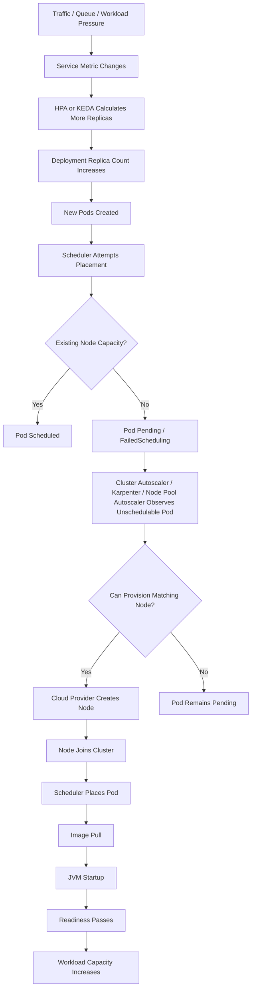
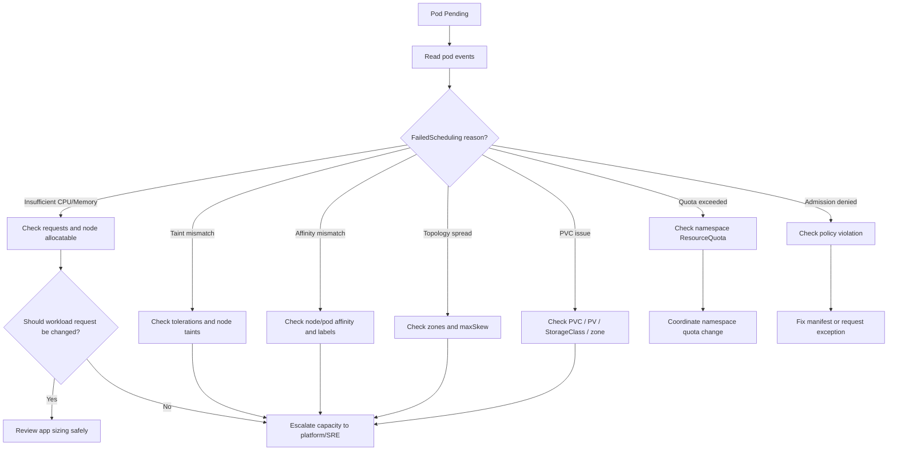
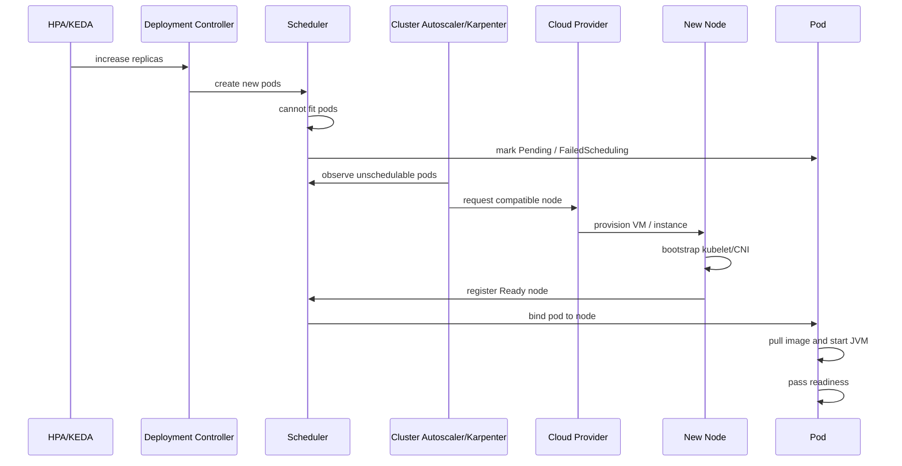

# Part 043 — Cluster Autoscaling and Node Capacity

Horizontal Pod Autoscaler changes pod replica count.

Cluster autoscaling changes node capacity.

Those are related, but they are not the same control loop.

For backend engineers, the most important operational question is not:

```text
Why did Kubernetes not scale?
```

The better question is:

```text
Did the workload ask for more pods, did the scheduler fail to place them,
and did the cluster autoscaler have a valid reason and ability to add nodes?
```

Cluster autoscaling is a production reliability and cost mechanism. It helps absorb workload growth, rollout surge, queue backlog, batch bursts, and node failures. It can also introduce latency, fragmentation, unexpected cost, spot interruption risk, and failure modes that look like application outages.

A senior backend engineer does not need to own the cluster autoscaler, Karpenter, AKS node pool autoscaler, or cloud node provisioning. But they must understand enough to diagnose when a workload is not running because the cluster cannot place it.

---

## 1. Core Concept

Cluster autoscaling is the process of adjusting the number or shape of Kubernetes worker nodes based on schedulability and capacity needs.

The scheduler decides whether a pod can fit on an existing node.

Cluster autoscaling reacts when pods cannot be scheduled due to capacity shortage or when nodes are underutilized enough to remove safely.

A simplified model:

```text
Workload wants pods.
Scheduler tries to place pods.
If pods cannot fit, they remain Pending.
Cluster autoscaler may add nodes.
New nodes join cluster.
Scheduler places pending pods.
Pods start, become ready, and serve work.
```

This means cluster autoscaling is usually triggered by unschedulable pods, not directly by CPU usage.

If your service has high CPU but HPA does not create more pods, cluster autoscaling will not help.

If HPA creates more pods but the scheduler can place them on existing nodes, cluster autoscaling may not add nodes.

If HPA creates more pods and those pods become Pending due to insufficient resources, cluster autoscaling may add capacity.

---

## 2. Backend Engineer Mental Model

Think in layers.



Important consequence:

```text
Scaling from overloaded service to ready capacity is not instantaneous.
```

The total reaction time can include:

- metric collection delay;
- HPA/KEDA sync delay;
- Deployment controller delay;
- scheduler delay;
- autoscaler detection delay;
- cloud node provisioning delay;
- node bootstrap delay;
- CNI initialization delay;
- image pull delay;
- JVM startup delay;
- readiness delay;
- traffic rebalancing delay;
- Kafka rebalance or RabbitMQ consumer registration delay;
- warm-up delay in Java code, connection pools, caches, or JIT.

For Java/JAX-RS services, autoscaling latency is often dominated by node provisioning plus JVM readiness.

---

## 3. What Cluster Autoscaling Does Not Do

Cluster autoscaling does not:

- fix bad HPA metrics;
- scale a database;
- increase Kafka partition count;
- increase RabbitMQ broker capacity;
- reduce Java startup time;
- fix oversized CPU/memory requests;
- ignore taints, selectors, affinity, or topology constraints;
- bypass cloud quota;
- bypass subnet IP exhaustion;
- bypass security policy;
- guarantee cheap capacity;
- guarantee zone availability;
- make a single-replica service highly available.

A common false assumption:

```text
If the cluster has autoscaling, Pending pods should always be temporary.
```

Reality:

```text
Pending pods are temporary only when the autoscaler can provision a compatible node
and the cloud/provider constraints allow it.
```

---

## 4. Responsibility Boundary

### Backend service owner responsibility

Backend engineers should own or actively review:

- CPU request;
- memory request;
- ephemeral storage request;
- CPU and memory limits;
- replica count;
- HPA min/max replicas;
- rollout maxSurge and maxUnavailable;
- pod anti-affinity or topology spread constraints requested by the service;
- workload priority if service is critical;
- connection pool impact when replicas increase;
- Java startup time;
- readiness behavior;
- dependency capacity assumptions;
- whether scale-out actually helps the workload.

### Platform/SRE responsibility

Platform/SRE usually owns:

- Cluster Autoscaler installation and configuration;
- Karpenter installation and Provisioner/NodePool policy;
- AKS cluster autoscaler settings;
- node pool definitions;
- instance type families;
- VM sizes;
- zone placement;
- cloud quota;
- subnet capacity;
- CNI behavior;
- node bootstrap;
- node image version;
- spot/preemptible policy;
- autoscaler logs and global tuning;
- cluster-wide cost and utilization policy.

### Security/network responsibility

Security or network teams may own:

- node subnet policy;
- firewall and NSG/security group policy;
- private endpoint routing;
- egress control;
- instance profile or managed identity used by nodes;
- admission policy around node selectors, tolerations, or privileged workloads.

### Escalation principle

A backend engineer can prove:

```text
My pod is Pending because no compatible node capacity exists.
```

The platform/SRE team usually resolves:

```text
Why compatible node capacity cannot be provisioned.
```

---

## 5. Node Capacity Is Multi-Dimensional

A node is not just CPU and memory.

A pod may be unschedulable because of:

- insufficient CPU;
- insufficient memory;
- insufficient ephemeral storage;
- insufficient hugepages;
- too many pods on a node;
- unavailable GPU or special device;
- node selector mismatch;
- node affinity mismatch;
- pod affinity mismatch;
- pod anti-affinity conflict;
- topology spread constraint conflict;
- taint without toleration;
- PVC zone constraint;
- node pool not eligible;
- namespace quota exceeded;
- LimitRange default or max violation;
- PodSecurity or admission rejection;
- cluster autoscaler max node limit;
- cloud quota exhausted;
- subnet IP exhaustion;
- instance type unavailable;
- spot capacity unavailable;
- zone capacity unavailable.

The scheduler error is the first evidence layer.

Never start with cloud console guessing. Start with the pod event.

---

## 6. Pending Pod Debugging Flow



Production-safe rule:

```text
Do not reduce resource requests during an incident just to make the pod schedule
unless you have evidence the workload can safely run at that lower request.
```

A pod that schedules but immediately throttles, OOMs, or corrupts batch execution is not a real fix.

---

## 7. Safe Investigation Commands

Use read-only commands first.

```bash
kubectl get pods -n <namespace> -o wide
kubectl describe pod <pod> -n <namespace>
kubectl get events -n <namespace> --sort-by='.lastTimestamp'
kubectl get deploy <deployment> -n <namespace> -o yaml
kubectl get hpa -n <namespace>
kubectl describe hpa <hpa> -n <namespace>
kubectl get rs -n <namespace>
kubectl get quota -n <namespace>
kubectl describe quota -n <namespace>
kubectl get limitrange -n <namespace>
kubectl get pdb -n <namespace>
kubectl get nodes
kubectl describe node <node>
kubectl top pods -n <namespace>
kubectl top nodes
```

For scheduling details:

```bash
kubectl describe pod <pending-pod> -n <namespace> | sed -n '/Events:/,$p'
```

For node allocatable and labels:

```bash
kubectl get nodes -o custom-columns=NAME:.metadata.name,CPU:.status.allocatable.cpu,MEMORY:.status.allocatable.memory,PODS:.status.allocatable.pods
kubectl get nodes --show-labels
kubectl describe node <node-name>
```

For topology and zones:

```bash
kubectl get nodes -L topology.kubernetes.io/zone
kubectl get pods -n <namespace> -o wide
```

For HPA-created demand:

```bash
kubectl describe hpa <hpa-name> -n <namespace>
kubectl get deploy <deployment> -n <namespace> -o jsonpath='{.spec.replicas}{"\n"}'
kubectl get deploy <deployment> -n <namespace> -o jsonpath='{.status.replicas}{" "}{.status.readyReplicas}{" "}{.status.unavailableReplicas}{"\n"}'
```

Avoid unsafe production shortcuts:

```bash
# Dangerous without explicit approval:
kubectl scale deploy <deployment> --replicas=<large-number> -n <namespace>
kubectl patch deploy <deployment> -n <namespace> ...
kubectl delete pod <pod> -n <namespace>
kubectl cordon <node>
kubectl drain <node>
kubectl taint nodes ...
```

Those are operational changes, not investigation.

---

## 8. Interpreting FailedScheduling Events

Typical scheduler event:

```text
0/8 nodes are available: 4 Insufficient cpu, 3 Insufficient memory, 1 node(s) had untolerated taint.
preemption: 0/8 nodes are available: 8 Preemption is not helpful for scheduling.
```

How to read it:

| Signal | Meaning | Backend action |
|---|---|---|
| `Insufficient cpu` | Requested CPU cannot fit on current nodes | Check requests, HPA replica count, rollout surge; escalate capacity if request is justified |
| `Insufficient memory` | Requested memory cannot fit | Check JVM sizing and memory request; escalate if justified |
| `untolerated taint` | Pod is not allowed on tainted node | Verify tolerations; do not add toleration casually |
| `node affinity/selector mismatch` | Pod requires labels unavailable on nodes | Check whether selector is intentional |
| `pod anti-affinity rules` | Placement rules are too strict | Check if HA rule is over-constrained |
| `max volume count exceeded` | Node cannot attach more volumes | Escalate storage/node capacity |
| `PVC not bound` | Storage is not ready | Debug PVC, StorageClass, zone |
| `quota exceeded` | Namespace quota prevents pod creation or scheduling | Coordinate quota/request sizing |

The key distinction:

```text
Insufficient cluster capacity is not always platform failure.
Sometimes it is caused by unrealistic workload requests or surge behavior.
```

---

## 9. Requests Drive Scheduling

Kubernetes schedules based on requests, not actual usage.

A Java pod with:

```yaml
resources:
  requests:
    cpu: "4"
    memory: "8Gi"
```

requires a node with enough unallocated requested CPU and memory.

If actual usage is only 500m CPU and 1.5Gi memory, the scheduler still reserves based on 4 CPU and 8Gi.

That is why oversized requests cause:

- poor bin packing;
- fewer pods per node;
- more nodes;
- higher cost;
- Pending pods during rollout;
- autoscaler scale-up when existing nodes look mostly idle by actual usage.

Undersized requests cause a different problem:

- too many pods packed into nodes;
- CPU contention;
- memory pressure;
- eviction risk;
- unreliable HPA CPU utilization;
- noisy neighbors.

Operational invariant:

```text
Requests are a capacity contract.
Limits are a runtime enforcement mechanism.
Actual usage is evidence for tuning, not the scheduler contract.
```

---

## 10. Rollout Surge Can Trigger Capacity Problems

A deployment may have stable steady-state capacity but fail during rollout.

Example:

```yaml
replicas: 20
strategy:
  rollingUpdate:
    maxSurge: 25%
    maxUnavailable: 0
```

During rollout, Kubernetes may temporarily need 25 pods.

If each pod requests 2 CPU and 4Gi memory, the rollout may need an extra 10 CPU and 20Gi memory.

If the cluster does not have spare capacity, new pods become Pending.

This is a common production surprise:

```text
The service has enough capacity to run.
It does not have enough capacity to roll out safely with the configured surge.
```

For backend services, review rollout strategy together with:

- request/limit sizing;
- HPA min/max replicas;
- PDB;
- node pool capacity;
- image pull time;
- JVM startup time;
- readiness time;
- dependency connection spike.

---

## 11. Node Provisioning Delay

Node scale-up is slower than pod scale-up.

Typical phases:



Operationally, this can take minutes.

That matters when:

- traffic spikes quickly;
- Kafka lag grows faster than consumers can start;
- RabbitMQ redelivery storms occur;
- Java startup is slow;
- image is large;
- container registry is slow;
- node bootstrap is slow;
- private image pull needs registry auth;
- CNI initialization is slow;
- zone capacity is constrained.

Mitigation options may include:

- higher HPA minReplicas;
- scheduled scaling before known batch windows;
- smaller image size;
- faster Java startup;
- warm spare nodes;
- Karpenter/NodePool tuning;
- more appropriate instance types;
- better requests;
- reducing rollout surge;
- improving readiness and warm-up behavior.

Backend engineers usually influence the workload-side items: image size, startup time, readiness, resource request, HPA minReplicas, and rollout strategy.

---

## 12. Cluster Autoscaler Awareness

Cluster Autoscaler traditionally works by observing pods that cannot be scheduled and increasing node group size when a matching node group can fit them.

It also scales down underutilized nodes when safe.

Backend engineers should understand these operational implications:

- it depends on node groups already defined by platform;
- it cannot create arbitrary node shapes unless the cloud/node group supports them;
- it may not scale up if pod constraints do not match any node group;
- it may not scale down nodes with pods that cannot be moved;
- PDBs can block scale-down;
- local storage and special constraints can block scale-down;
- priority and preemption can change scheduling behavior;
- cloud quota and subnet capacity can block scale-up;
- scale-down can evict pods if protected incorrectly.

Signals to ask platform/SRE about:

- autoscaler status;
- node group min/max size;
- scale-up failures;
- scale-down blockers;
- recent node provisioning errors;
- cloud quota;
- subnet IP usage;
- spot/on-demand policy.

---

## 13. Karpenter Awareness

Karpenter is commonly used in EKS environments to provision right-sized nodes based on pending pod requirements.

From a backend engineer perspective, think of it as a more flexible node provisioning engine than fixed node group scaling.

Karpenter can consider:

- pod resource requests;
- node selectors;
- affinity;
- topology;
- instance families;
- zones;
- capacity type such as spot or on-demand;
- consolidation opportunities;
- disruption budgets or policies depending on setup.

Potential operational benefits:

- faster or more flexible scale-up;
- better bin packing;
- fewer idle nodes;
- support for diverse instance types;
- cost optimization through consolidation.

Potential operational risks:

- unexpected node replacement during consolidation;
- spot interruption exposure;
- incompatible constraints causing Pending pods;
- unfamiliar node labels/taints;
- capacity type mismatch;
- too much flexibility causing workload placement surprises;
- insufficient PDB or graceful shutdown behavior during disruption.

Backend engineer checklist:

- know whether your namespace/workload can run on Karpenter-managed nodes;
- know whether spot/preemptible capacity is allowed;
- check pod disruption tolerance;
- check graceful shutdown;
- check PDB;
- check topology spread;
- check whether workload requires stable node features;
- check whether Java startup time makes frequent node churn risky.

---

## 14. AKS Node Pool Autoscaling Awareness

In AKS, autoscaling is commonly tied to node pools backed by VM Scale Sets.

Important concepts:

- system node pool;
- user node pool;
- node pool min/max count;
- VM size;
- availability zones;
- Azure CNI subnet capacity;
- cluster autoscaler profile;
- spot node pool if used;
- node taints and labels;
- max pods per node;
- Azure quota;
- NSG/UDR/private cluster constraints.

Backend engineer concerns:

- is the workload scheduled only to a specific user node pool?
- does the node pool have enough max capacity?
- does the VM size fit the pod request?
- are there enough subnet IPs?
- do topology spread constraints require zones the pool does not cover?
- are spot node pools acceptable for this workload?
- does PDB protect workload during node pool upgrades?

When a pod is Pending in AKS, do not stop at `Insufficient cpu`. Also ask whether the node pool can actually scale.

---

## 15. Instance Type and VM Size Fit

Autoscaling fails when no allowed node type can fit the pod.

Example:

```yaml
resources:
  requests:
    cpu: "12"
    memory: "64Gi"
```

If the largest allowed node type in the node pool has insufficient allocatable memory after kube/system reservations, the pod cannot be scheduled even after scale-up.

The scheduler cares about allocatable capacity, not marketing size.

A VM advertised as 64Gi memory will not provide 64Gi allocatable memory to pods.

Review:

- pod CPU request;
- pod memory request;
- pod ephemeral storage request;
- node allocatable CPU;
- node allocatable memory;
- max pods per node;
- system daemon overhead;
- sidecar overhead;
- service mesh overhead if any;
- init container request behavior;
- topology constraints.

Important nuance:

```text
For scheduling, init container requests can affect effective pod request.
```

If an init container has very large memory or CPU requests, it can make the pod harder to schedule even though the main app container is smaller.

---

## 16. Zone Capacity and Topology

High availability usually needs zone spreading.

But zone spreading also creates constraints.

A workload may require pods across zones:

```yaml
topologySpreadConstraints:
  - maxSkew: 1
    topologyKey: topology.kubernetes.io/zone
    whenUnsatisfiable: DoNotSchedule
```

If one zone cannot provision nodes, pods may remain Pending even if other zones have capacity.

Operational trade-off:

| Choice | Benefit | Risk |
|---|---|---|
| Strict zone spread | Better availability during zone failure | Pending pods if one zone lacks capacity |
| Soft spread | Easier scheduling | Possible concentration in one zone |
| Single-zone node pool | Simpler/cost lower | Higher availability risk |
| Multi-zone node pool | Better resilience | More complex capacity and storage constraints |

For PostgreSQL, Kafka, RabbitMQ, Redis, and Camunda dependencies, zone placement matters because network latency, zone failure, and storage attachment behavior can affect workload recovery.

---

## 17. Spot and Preemptible Node Operations

Spot/preemptible nodes reduce cost but increase disruption risk.

Workloads suitable for spot/preemptible nodes:

- stateless API with enough replicas and PDB;
- idempotent batch jobs;
- queue consumers with graceful shutdown and safe retry;
- non-critical async workers;
- horizontally scalable jobs with checkpointing.

Workloads risky on spot/preemptible nodes:

- single-replica critical API;
- migration jobs;
- long-running non-idempotent batch;
- stateful workloads without strong recovery;
- latency-critical services with slow startup;
- Camunda workers that do not handle shutdown safely;
- consumers with unsafe offset/ack behavior.

Backend checklist before accepting spot/preemptible placement:

- graceful shutdown is implemented;
- termination grace period is sufficient;
- readiness drops before shutdown;
- Kafka offsets commit safely;
- RabbitMQ messages ack/nack safely;
- Camunda jobs can be retried safely;
- batch is idempotent or checkpointed;
- PDB exists;
- min replicas preserve availability;
- alerts distinguish node interruption from app failure.

---

## 18. Bin Packing and Fragmentation

A cluster may have enough total CPU/memory but not enough contiguous capacity on any node.

Example:

```text
Cluster free total: 8 CPU, 16Gi memory
Each node free:     1 CPU, 2Gi memory
Pod request:        4 CPU, 8Gi memory
```

Total free capacity looks sufficient, but no individual node can fit the pod.

This is fragmentation.

Causes:

- uneven pod placement;
- oversized pods;
- many node pools with narrow shapes;
- strict affinity/anti-affinity;
- topology spread constraints;
- daemonset overhead;
- sidecars;
- high maxSurge during rollout;
- mixed workload types on shared pools.

Backend engineers can reduce fragmentation pressure by:

- right-sizing requests;
- avoiding unnecessary huge pod shapes;
- reviewing maxSurge;
- avoiding overly strict placement rules;
- separating truly special workloads from normal services;
- keeping sidecars justified;
- coordinating with platform on node pool shape.

---

## 19. Java/JAX-RS Impact

Cluster autoscaling interacts with Java services in specific ways.

### Startup time

A Java service may take time to:

- load classes;
- initialize framework;
- warm JIT;
- connect to database;
- initialize connection pools;
- load caches;
- initialize Kafka/RabbitMQ clients;
- register health endpoints;
- become ready.

Long startup makes node scale-up less useful for fast incidents.

### Memory request

Java pods often request significant memory because heap is not the only memory consumer:

- heap;
- metaspace;
- direct buffers;
- thread stacks;
- native memory;
- code cache;
- TLS/native libraries;
- observability agents;
- sidecars.

Oversized memory requests can force extra nodes. Undersized requests can create node pressure or OOM risk.

### CPU request

CPU request affects scheduling and HPA utilization.

A too-low CPU request can make HPA overreact because utilization percentage becomes high quickly.

A too-high CPU request can hide real pressure and increase scheduling cost.

### Connection pools

When nodes are added and pods start, new replicas may create more connections to:

- PostgreSQL;
- Redis;
- Kafka;
- RabbitMQ;
- Camunda;
- downstream HTTP APIs.

Cluster autoscaling solves compute capacity, not dependency capacity.

---

## 20. Dependency Impact

More pods can mean more pressure downstream.

### PostgreSQL

Risk:

```text
replicas × maxPoolSize > database connection budget
```

During rollout surge, the temporary connection count may exceed steady-state design.

### Kafka

More consumer pods help only up to partition count and processing parallelism.

Too many pods can increase rebalance cost without increasing throughput.

### RabbitMQ

More consumers can increase throughput, but may also increase:

- unacked messages;
- downstream writes;
- redelivery risk;
- memory pressure on broker;
- lock contention in application.

### Redis

More pods can increase connection count and command rate. A Redis-backed service may scale CPU while Redis becomes the bottleneck.

### Camunda

More workers can increase activated jobs and downstream load. Worker concurrency and retry semantics matter more than replica count alone.

Operational invariant:

```text
Before increasing max replicas or enabling aggressive autoscaling,
prove downstream systems can absorb the resulting fan-out.
```

---

## 21. Cost Trade-Offs

Cluster autoscaling has cost effects.

Cost increases when:

- requests are oversized;
- rollout surge is high;
- min replicas are too high;
- node pools use large VM sizes;
- workloads require dedicated nodes;
- topology constraints force underutilized nodes;
- PDB blocks scale-down;
- local storage blocks scale-down;
- spot is not allowed for tolerant workloads;
- logs/metrics scale with replica count.

Cost decreases when:

- requests reflect real demand;
- workloads bin-pack well;
- scale-down works;
- idle replicas are reduced safely;
- batch windows are scheduled intentionally;
- node pools match workload shapes;
- spot/preemptible is used for suitable workloads;
- Karpenter/consolidation is tuned safely.

Do not optimize cost by removing safety from critical workloads. Optimize by removing waste that does not buy reliability.

---

## 22. Reliability Trade-Offs

Cluster autoscaling can improve reliability by adding capacity.

It can reduce reliability when:

- scale-up is slower than traffic spike;
- scale-down evicts pods without adequate PDB;
- spot interruption affects too many replicas;
- topology constraints are wrong;
- pods start before dependency is ready;
- many replicas create dependency overload;
- node churn triggers Kafka rebalance storms;
- Java warm-up causes newly ready pods to serve too much traffic too soon;
- autoscaler cannot provision due to quota/subnet/capacity issues.

Reliability is not maximized by infinite scale-out. It is maximized by stable capacity, predictable failure handling, and correct bottleneck identification.

---

## 23. Common Failure Modes

### Failure mode 1: HPA scales but pods remain Pending

Likely causes:

- insufficient node capacity;
- node pool max reached;
- cloud quota exhausted;
- subnet IP exhausted;
- strict affinity;
- taint/toleration mismatch;
- oversized requests.

Check:

```bash
kubectl describe pod <pending-pod> -n <namespace>
kubectl describe hpa <hpa> -n <namespace>
kubectl get nodes
kubectl get quota -n <namespace>
```

### Failure mode 2: Cluster scales but pods are still not ready

Likely causes:

- slow image pull;
- large image;
- startup probe failure;
- Java startup slow;
- dependency connectivity failure;
- secret/config problem;
- readiness endpoint failing.

Check:

```bash
kubectl describe pod <pod> -n <namespace>
kubectl logs <pod> -n <namespace>
kubectl get events -n <namespace> --sort-by='.lastTimestamp'
```

### Failure mode 3: Nodes provision but service still overloaded

Likely causes:

- dependency bottleneck;
- DB pool exhaustion;
- Kafka partition limit;
- RabbitMQ prefetch/backpressure;
- Redis saturation;
- CPU request/HPA metric mismatch;
- new pods not receiving traffic;
- ingress/load balancer delay.

Check dashboards:

- service latency;
- pod readiness;
- request rate per pod;
- DB pool usage;
- Kafka lag and rebalance;
- RabbitMQ queue/unacked;
- Redis latency;
- ingress upstream metrics.

### Failure mode 4: Scale-down causes disruption

Likely causes:

- missing PDB;
- termination grace too short;
- graceful shutdown missing;
- readiness does not drop before termination;
- consumer shutdown unsafe;
- batch not checkpointed;
- node consolidation too aggressive.

Check:

```bash
kubectl get pdb -n <namespace>
kubectl describe pod <terminated-pod> -n <namespace>
kubectl get events -n <namespace> --sort-by='.lastTimestamp'
```

### Failure mode 5: Autoscaler cannot provision matching node

Likely causes:

- no node group matches selector/taint;
- no allowed instance type can fit pod;
- cloud capacity unavailable;
- spot capacity unavailable;
- zone constraint impossible;
- quota exhausted;
- subnet IP exhaustion.

Escalate to platform/SRE with pod events and manifest evidence.

---

## 24. Production Runbook: Pod Pending During Scale-Out

### Step 1 — Confirm symptom

```bash
kubectl get pods -n <namespace> -o wide
kubectl get deploy <deployment> -n <namespace>
kubectl get hpa -n <namespace>
```

Look for:

- desired replicas higher than ready replicas;
- pods in Pending;
- rollout in progress;
- HPA desired replicas increased.

### Step 2 — Read Pending pod events

```bash
kubectl describe pod <pending-pod> -n <namespace>
```

Capture:

- FailedScheduling message;
- number of nodes evaluated;
- resource insufficiency;
- taints;
- affinity;
- topology;
- PVC;
- quota.

### Step 3 — Check recent change

```bash
kubectl rollout history deploy <deployment> -n <namespace>
kubectl describe deploy <deployment> -n <namespace>
```

Ask:

- did resource requests change?
- did maxSurge change?
- did affinity/toleration change?
- did HPA maxReplicas change?
- did nodeSelector change?
- did image include a larger sidecar?

### Step 4 — Check namespace quota

```bash
kubectl describe quota -n <namespace>
kubectl get limitrange -n <namespace>
```

Quota failure can look like capacity shortage from the application side.

### Step 5 — Check node capacity shape

```bash
kubectl get nodes
kubectl top nodes
kubectl describe node <node>
```

Do not rely only on `kubectl top`. Scheduling is based on requests and allocatable capacity.

### Step 6 — Decide mitigation

Possible safe mitigations:

- rollback the deployment if new resource/placement config caused the issue;
- reduce rollout surge through reviewed manifest change;
- temporarily pause rollout;
- increase HPA max only if nodes/dependencies can absorb it;
- coordinate capacity increase with platform/SRE;
- defer non-critical batch workload;
- adjust request only with evidence and approval.

Do not blindly:

- delete random pods;
- remove affinity/anti-affinity;
- remove resource requests;
- add broad tolerations;
- scale replicas aggressively;
- bypass GitOps.

### Step 7 — Escalate with evidence

Provide platform/SRE:

```text
Namespace:
Workload:
Pod:
FailedScheduling message:
Resource requests:
Replica/HPA state:
Rollout state:
Node selector / affinity / toleration:
Quota state:
Business impact:
Mitigation attempted:
```

---

## 25. Production Runbook: Scale-Up Too Slow

Symptoms:

- HPA increases desired replicas;
- Pending pods eventually schedule;
- service remains degraded for several minutes;
- new pods take too long to become ready.

Investigate timeline:

```text
T0 alert fired
T1 HPA desired replicas changed
T2 new pods created
T3 pods Pending
T4 nodes provisioned
T5 pods scheduled
T6 image pulled
T7 container started
T8 startup probe passed
T9 readiness passed
T10 traffic redistributed
```

Evidence commands:

```bash
kubectl describe hpa <hpa> -n <namespace>
kubectl get events -n <namespace> --sort-by='.lastTimestamp'
kubectl describe pod <pod> -n <namespace>
kubectl logs <pod> -n <namespace>
```

Backend mitigations:

- increase minReplicas for critical services;
- reduce Java startup time;
- optimize image size;
- avoid dependency-heavy readiness checks;
- pre-warm caches safely;
- use scheduled scaling before known traffic windows;
- tune connection pool initialization;
- review CPU/memory requests;
- coordinate warm node capacity with platform.

---

## 26. Production Runbook: Scale-Down Disruption

Symptoms:

- pods terminated during node scale-down or consolidation;
- brief 5xx spike;
- Kafka rebalance spike;
- RabbitMQ redelivery spike;
- Camunda job incidents;
- batch partial failure;
- deployment availability drops.

Check:

```bash
kubectl get events -n <namespace> --sort-by='.lastTimestamp'
kubectl get pdb -n <namespace>
kubectl describe pod <terminated-pod> -n <namespace>
kubectl get deploy <deployment> -n <namespace>
```

Review:

- terminationGracePeriodSeconds;
- preStop hook;
- readiness shutdown behavior;
- PDB;
- replica count;
- consumer shutdown logic;
- offset/ack behavior;
- node interruption handling;
- Karpenter consolidation policy if used;
- cluster autoscaler scale-down behavior.

Mitigation:

- add or fix PDB;
- improve graceful shutdown;
- increase replicas;
- tune termination grace;
- pause consolidation/scale-down through platform if incident ongoing;
- move unsafe workload off spot/preemptible node pool;
- fix consumer/batch idempotency.

---

## 27. Review Checklist for Backend PRs

When reviewing Kubernetes changes, ask:

### Resource and scheduling

- Did CPU or memory request change?
- Does the pod still fit existing node shapes?
- Did ephemeral storage request change?
- Did sidecar/init container resource usage change?
- Did nodeSelector, affinity, anti-affinity, toleration, or topology spread change?
- Could the rollout require more temporary capacity?

### Autoscaling

- Did HPA min/max change?
- Can dependencies handle max replicas?
- Does HPA metric reflect real pressure?
- Could HPA create pods faster than nodes can provision?
- Is minReplicas sufficient for scale-up latency?

### Rollout

- Did maxSurge/maxUnavailable change?
- Could rollout surge exceed node capacity?
- Are readiness and startup probes aligned with Java startup?
- Is rollback safe if schema/config changed?

### Availability

- Does PDB still allow maintenance?
- Does PDB protect enough replicas?
- Does topology spread improve availability or over-constrain scheduling?
- Are replicas spread across zones?

### Cost

- Did requests increase materially?
- Does the workload require dedicated nodes?
- Does it force larger instance types?
- Does it prevent scale-down?
- Does it create idle capacity?

---

## 28. Internal Verification Checklist

Verify internally before making assumptions:

### Cluster autoscaling model

- Is Cluster Autoscaler used?
- Is Karpenter used?
- Is AKS node pool autoscaling used?
- Are autoscaling mechanisms mixed?
- Who owns autoscaler configuration?
- Where are autoscaler logs and dashboards?

### Node pools

- What node pools/node groups exist?
- Which workloads map to which node pools?
- What labels and taints are used?
- What instance types or VM sizes are allowed?
- What are min/max sizes?
- Are spot/preemptible nodes used?
- Are system and user pools separated?

### Capacity

- What is current requested CPU/memory by namespace?
- What is actual CPU/memory usage?
- What is node allocatable capacity?
- Are there known quota or subnet limits?
- Are there zone capacity constraints?
- Are there cloud provider quotas near limit?

### Workload

- What are service requests/limits?
- What are HPA min/max replicas?
- What is rollout maxSurge?
- What is Java startup time?
- What is readiness delay?
- What is image pull time?
- What is connection pool per pod?

### Reliability

- Is there a PDB?
- Is graceful shutdown tested?
- Are pods spread across zones?
- Does dependency capacity support max replicas?
- Is there a runbook for Pending pods?
- Is there a runbook for slow scale-up?

### Cost

- Are resource requests rightsized?
- Are idle replicas justified?
- Is node utilization acceptable?
- Are load balancer/NAT/log/metric costs visible?
- Is there a FinOps dashboard or report?

---

## 29. Anti-Patterns

### Anti-pattern: Treating Pending as random Kubernetes flakiness

Pending is a scheduler state. It has reasons. Read events.

### Anti-pattern: Reducing requests to force scheduling

This can hide real capacity requirements and cause throttling, OOM, or noisy-neighbor incidents.

### Anti-pattern: Increasing HPA max without dependency review

More pods can overload PostgreSQL, Redis, Kafka, RabbitMQ, Camunda, or external APIs.

### Anti-pattern: Strict topology without capacity planning

Strong zone rules are good only if every zone can actually supply capacity.

### Anti-pattern: Spot/preemptible for unsafe workloads

Cost savings disappear if disruptions create incidents, reprocessing storms, or data inconsistency.

### Anti-pattern: No PDB because autoscaling exists

Autoscaling does not protect against voluntary disruption. PDB does.

### Anti-pattern: Ignoring rollout surge capacity

A service can run normally but fail every deployment because rollout requires temporary extra capacity.

---

## 30. Practical Mental Shortcuts

Use these when debugging:

```text
HPA changed replicas, but pods are Pending -> scheduling/capacity problem.
```

```text
Pods scheduled, but not Ready -> startup/readiness/application/dependency problem.
```

```text
Nodes added, but service still slow -> dependency, traffic distribution, or app bottleneck problem.
```

```text
Cluster has free total capacity, but pod cannot schedule -> fragmentation or constraints problem.
```

```text
Autoscaler did nothing -> no unschedulable pod, no matching node group, or autoscaler/provider constraint.
```

```text
Scale-down caused errors -> PDB/graceful shutdown/consumer semantics problem.
```

---

## 31. What Good Looks Like

A production-ready backend workload should have:

- right-sized CPU/memory/ephemeral storage requests;
- clear HPA min/max and metric rationale;
- known Java startup and readiness timing;
- rollout surge that fits capacity plan;
- PDB aligned with availability target;
- topology spread that is useful but not impossible;
- graceful shutdown tested;
- dependency capacity validated against max replicas;
- connection pool sized per replica and max scale;
- dashboards for Pending pods, readiness, restart, CPU, memory, throttling, and HPA;
- runbook for Pending pods and slow scale-up;
- documented node pool assumptions;
- platform/SRE escalation path.

---

## 32. Closing Model

Cluster autoscaling is not a guarantee that capacity will appear instantly.

It is a negotiation among:

- workload requests;
- scheduler constraints;
- node pool shape;
- autoscaler policy;
- cloud capacity;
- network/IP capacity;
- cost policy;
- disruption policy;
- application startup behavior;
- dependency capacity.

For a senior backend engineer, the key skill is to separate these questions:

```text
Did my workload ask for reasonable capacity?
Did Kubernetes try to place it?
Why could it not be placed?
Can the platform provision compatible capacity?
Will extra pods actually improve the business symptom?
What dependency or cost risk appears when scale succeeds?
```

That is the difference between treating Kubernetes as a black box and operating backend services as production systems.
