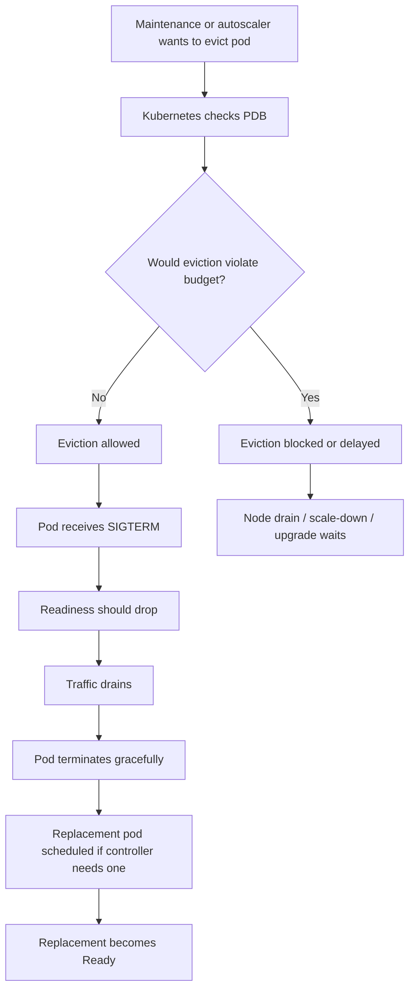
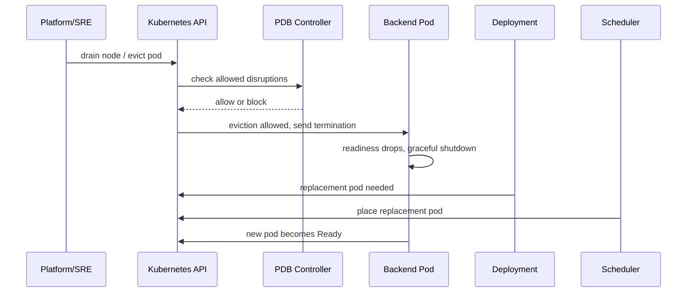
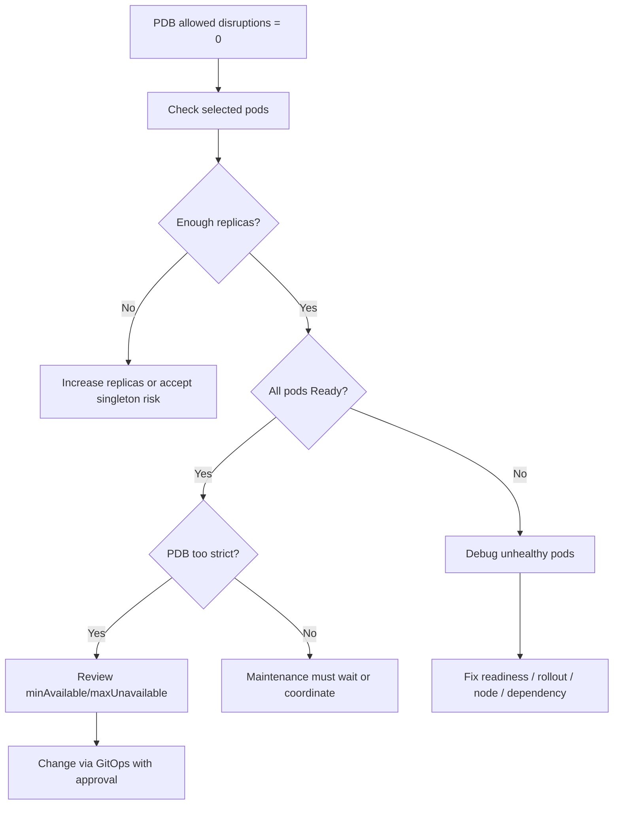
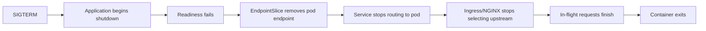

# Part 044 — PodDisruptionBudget and Availability Operations

A PodDisruptionBudget is not a high availability feature by itself.

It is a disruption control mechanism.

It tells Kubernetes and cluster operators:

```text
Do not voluntarily remove too many healthy pods from this workload at the same time.
```

For backend engineers, PDB matters because many production outages do not start from application bugs. They start from safe-looking maintenance events:

- node drain;
- node pool upgrade;
- cluster upgrade;
- autoscaler scale-down;
- Karpenter consolidation;
- spot/preemptible interruption handling;
- infrastructure patching;
- AZ/node replacement;
- manual platform maintenance.

Without a correct PDB, a workload may lose too many replicas during maintenance.

With a wrong PDB, maintenance may be blocked or the workload may still be underprotected.

A senior backend engineer should be able to review both sides:

```text
Does this PDB protect the service from voluntary disruption?
Does this PDB still allow the platform to operate the cluster?
```

---

## 1. Core Concept

A PodDisruptionBudget specifies how many pods of an application must remain available during voluntary disruptions.

It applies to pods selected by labels.

Two main forms:

```yaml
spec:
  minAvailable: 2
```

or:

```yaml
spec:
  maxUnavailable: 1
```

Use one, not both.

A PDB does not prevent involuntary disruptions.

### Voluntary disruption examples

- `kubectl drain`;
- cluster autoscaler scale-down;
- Karpenter consolidation;
- node pool upgrade;
- planned node maintenance;
- platform-initiated eviction through the eviction API.

### Involuntary disruption examples

- node crash;
- kernel panic;
- cloud VM failure;
- power/network failure;
- OOMKilled;
- container crash;
- pod deleted directly without respecting eviction semantics;
- sudden zone outage.

PDB helps with the first group. It does not magically solve the second group.

---

## 2. PDB Mental Model



Important:

```text
PDB protects available pods, not merely existing pods.
```

If pods are running but not Ready, they may not count as available.

A bad readiness probe can indirectly break PDB behavior.

---

## 3. Why Backend Engineers Must Care

Backend service owners care because PDB affects:

- API availability during node drain;
- rollout safety;
- cluster upgrade safety;
- autoscaler scale-down behavior;
- Karpenter disruption/consolidation behavior;
- Kafka/RabbitMQ consumer continuity;
- Camunda worker availability;
- batch/scheduler safety;
- dependency connection churn;
- incident blast radius;
- platform maintenance windows.

A PDB is where application availability expectations meet platform maintenance needs.

If the service owner does not define availability requirements, the platform may operate using defaults that are unsafe for the service.

---

## 4. Responsibility Boundary

### Backend service owner responsibility

Backend engineers should own or review:

- replica count;
- PDB existence;
- PDB selector correctness;
- `minAvailable` or `maxUnavailable` choice;
- readiness probe correctness;
- graceful shutdown;
- termination grace period;
- workload criticality;
- single-replica risk;
- consumer shutdown behavior;
- business impact of reduced replicas;
- whether dependency capacity supports replacement pods;
- whether rollout and PDB interact safely.

### Platform/SRE responsibility

Platform/SRE usually owns:

- node drain process;
- cluster upgrade process;
- node pool upgrade process;
- autoscaler/Karpenter disruption policy;
- eviction tooling;
- maintenance windows;
- platform-level alerting;
- escalation when PDB blocks maintenance;
- cluster-wide disruption policy.

### Joint responsibility

Both service and platform teams must agree on:

- whether workload can tolerate disruption;
- whether service has enough replicas;
- whether PDB blocks critical maintenance;
- whether replica count and PDB are realistic;
- what to do during emergency drain;
- who can override or change PDB.

---

## 5. PDB Is Not a Substitute for Replicas

A PDB cannot protect a workload with insufficient replicas.

Example:

```yaml
replicas: 1
pdb:
  minAvailable: 1
```

This protects the only pod from voluntary eviction.

But it also means:

- node drain may be blocked;
- cluster upgrade may be blocked;
- autoscaler cannot remove the node;
- if the pod crashes, there is still downtime;
- if the node dies, PDB does not help.

For critical API services, a single replica is usually an availability smell.

Better pattern:

```yaml
replicas: 3
pdb:
  maxUnavailable: 1
```

This permits one pod to be voluntarily disrupted while keeping two available.

---

## 6. `minAvailable` vs `maxUnavailable`

### `minAvailable`

Useful when you want to state the minimum number or percentage of pods that must remain available.

Example:

```yaml
apiVersion: policy/v1
kind: PodDisruptionBudget
metadata:
  name: quote-api-pdb
spec:
  minAvailable: 2
  selector:
    matchLabels:
      app.kubernetes.io/name: quote-api
```

Interpretation:

```text
At least 2 matching pods must remain available.
```

Works well when minimum serving capacity is known.

### `maxUnavailable`

Useful when you want to limit concurrent voluntary loss.

Example:

```yaml
apiVersion: policy/v1
kind: PodDisruptionBudget
metadata:
  name: quote-api-pdb
spec:
  maxUnavailable: 1
  selector:
    matchLabels:
      app.kubernetes.io/name: quote-api
```

Interpretation:

```text
At most 1 matching pod may be unavailable due to voluntary disruption.
```

Works well for horizontally replicated stateless services.

### Practical guidance

For stateless API services:

```text
replicas >= 3, maxUnavailable: 1
```

is often operationally easier than absolute `minAvailable`, but this depends on service criticality and traffic capacity.

For fixed-capacity services:

```text
minAvailable: N
```

may better express business capacity.

For single replica workloads:

```text
A PDB may protect maintenance but cannot create high availability.
```

---

## 7. PDB Selector Correctness

A PDB is only as good as its selector.

Bad selector patterns:

```yaml
selector:
  matchLabels:
    app: quote
```

when pods actually use:

```yaml
app.kubernetes.io/name: quote-api
```

or when selector accidentally matches multiple workloads.

Failure modes:

- PDB selects zero pods;
- PDB selects wrong pods;
- PDB selects old and new workloads unexpectedly;
- PDB does not match after label migration;
- PDB protects canary and stable together incorrectly;
- PDB blocks unrelated workload drain.

Safe check:

```bash
kubectl get pdb -n <namespace>
kubectl describe pdb <pdb> -n <namespace>
kubectl get pods -n <namespace> --selector='<selector>'
```

Review selectors with the same seriousness as Service selectors. Both are operational routing/control-plane contracts.

---

## 8. Availability Calculation

PDB counts pods as available when they are Ready and have been Ready long enough according to controller semantics.

Operationally, look at:

```bash
kubectl get pdb -n <namespace>
```

Example output:

```text
NAME            MIN AVAILABLE   MAX UNAVAILABLE   ALLOWED DISRUPTIONS   AGE
quote-api-pdb   N/A             1                 1                     20d
```

`ALLOWED DISRUPTIONS` is the critical operational number.

If it is `0`, voluntary eviction may be blocked.

`0` may be correct during reduced availability, but it may also indicate:

- not enough replicas;
- pods not Ready;
- selector mismatch;
- rollout in progress;
- PDB too strict;
- HPA scaled down too far;
- readiness probe broken;
- deployment unavailable;
- node issue affecting replicas.

---

## 9. PDB and Rolling Update

A rolling update is controlled primarily by Deployment strategy:

```yaml
strategy:
  type: RollingUpdate
  rollingUpdate:
    maxSurge: 1
    maxUnavailable: 0
```

PDB influences voluntary disruption, but Deployment rollout has its own availability rules.

Interactions to review:

- `replicas`;
- Deployment `maxUnavailable`;
- Deployment `maxSurge`;
- PDB `minAvailable` or `maxUnavailable`;
- readiness probe;
- startup time;
- progress deadline;
- HPA minReplicas;
- node capacity.

Problem example:

```yaml
replicas: 2
strategy:
  rollingUpdate:
    maxSurge: 1
    maxUnavailable: 0
pdb:
  minAvailable: 2
```

This may be safe for rollout if extra capacity exists. But if the new pod cannot schedule or become ready, rollout stalls.

Another problem:

```yaml
replicas: 2
pdb:
  maxUnavailable: 0
```

This can block maintenance and may not provide meaningful additional safety if the app cannot tolerate any pod loss but has only two replicas.

---

## 10. PDB and HPA

PDB must be reviewed with HPA.

Example:

```yaml
hpa:
  minReplicas: 1
  maxReplicas: 10
pdb:
  minAvailable: 1
```

At low traffic, HPA may scale to 1 replica. PDB then blocks voluntary disruption of that single pod, but cannot prevent downtime from node failure or pod crash.

For critical services, HPA minReplicas should reflect availability, not only traffic.

Better:

```yaml
hpa:
  minReplicas: 3
pdb:
  maxUnavailable: 1
```

This allows maintenance while preserving at least two replicas.

Operational invariant:

```text
HPA minReplicas is part of availability design.
```

If minReplicas is too low, PDB cannot compensate.

---

## 11. PDB and Node Drain

Node drain attempts to evict pods from a node safely.

Typical platform operation:

```bash
kubectl drain <node> --ignore-daemonsets --delete-emptydir-data
```

Backend engineers usually should not run this in production unless explicitly authorized.

But they should understand what happens:



If PDB blocks drain, platform may need to:

- wait for more replicas to become available;
- coordinate with service owner;
- increase replicas temporarily;
- fix unhealthy pods;
- override only through emergency process.

---

## 12. PDB and Cluster Upgrade

During cluster upgrades, nodes may be drained and replaced.

PDB helps ensure upgrades do not remove too many replicas at once.

But strict PDBs can block upgrades.

Backend readiness for upgrade includes:

- enough replicas;
- correct PDB;
- working readiness probe;
- graceful shutdown;
- PDB allowed disruptions > 0 during healthy state;
- replacement pods can schedule;
- node pool has capacity;
- no hard single-node affinity;
- no PVC zone trap;
- no unsafe local storage dependency.

If your service blocks upgrade due to PDB, the answer is not always "delete the PDB".

The better sequence is:

1. check why allowed disruptions is 0;
2. fix unhealthy pods;
3. increase replicas if appropriate;
4. adjust PDB if it is logically wrong;
5. coordinate maintenance window;
6. document risk if emergency override is required.

---

## 13. Single Replica Risk

A PDB on a single replica workload is often misunderstood.

```text
PDB protects against voluntary eviction.
It does not provide redundancy.
```

Single replica workloads may be acceptable for:

- low-criticality internal tools;
- dev/test environments;
- singleton scheduler with external locking;
- migration job;
- certain batch coordinator patterns.

Single replica is risky for:

- customer-facing API;
- quote creation path;
- order submission path;
- billing integration callback;
- Kafka/RabbitMQ consumer with strict processing latency;
- Camunda worker for critical process step;
- service with no fast restart.

If single replica is intentional, document:

- why singleton is required;
- what happens during node drain;
- whether downtime is acceptable;
- how failover works;
- whether leader election or locking exists;
- whether PDB should block voluntary disruption;
- escalation owner.

---

## 14. Quorum Workload Risk

Some workloads require quorum or minimum members.

Examples:

- ZooKeeper-like systems;
- etcd-like systems;
- consensus systems;
- some database clusters;
- some broker clusters;
- distributed caches with replication;
- self-managed Kafka/RabbitMQ/Redis variants.

For quorum workloads, PDB must be aligned with quorum math.

Example:

```text
3 members -> tolerate 1 unavailable
5 members -> tolerate 2 unavailable
```

But backend engineers should be careful: owning a Java/JAX-RS service does not mean owning quorum math for platform-managed dependencies.

If PostgreSQL, Kafka, RabbitMQ, Redis, or Camunda infrastructure is managed by platform or another team, do not change their PDB without owner involvement.

For application-side consumers/workers, quorum is usually not the right model. Availability and processing capacity are the right models.

---

## 15. Java/JAX-RS Availability Impact

For Java/JAX-RS API services, PDB interacts with:

- request concurrency;
- thread pool capacity;
- connection pool capacity;
- readiness endpoint;
- graceful shutdown;
- HTTP keep-alive;
- in-flight requests;
- NGINX/Ingress upstream behavior;
- load balancer health;
- tracing and logs;
- dependency timeout/retry.

A good shutdown path:

```text
SIGTERM received
service stops accepting new work or readiness fails
Ingress/Service stops routing new traffic
in-flight requests complete or time out safely
background tasks stop
connection pools close
offsets/acks are committed safely
process exits before grace period expires
```

Bad shutdown patterns:

- readiness remains true during shutdown;
- pod exits immediately on SIGTERM;
- request threads are killed mid-transaction;
- DB transactions are abandoned;
- Kafka offsets are committed before processing completes;
- RabbitMQ messages are acked too early;
- Camunda job completion is not coordinated;
- grace period is shorter than request timeout;
- preStop sleeps blindly without evidence.

PDB reduces how often pods are disrupted concurrently. It does not fix unsafe shutdown logic.

---

## 16. Kafka Consumer PDB Considerations

For Kafka consumers, availability means processing capacity and group stability.

PDB can reduce simultaneous consumer loss during node drain.

Review:

- consumer replicas;
- topic partition count;
- max unavailable consumers;
- rebalance behavior;
- shutdown hook;
- offset commit strategy;
- max.poll.interval;
- session timeout;
- processing latency;
- DLQ/retry behavior;
- lag SLO.

Example:

```yaml
replicas: 6
pdb:
  maxUnavailable: 1
```

This may preserve most consumer capacity during maintenance.

But if topic has only 3 partitions, 6 replicas may not increase processing. PDB cannot fix partition-level parallelism.

---

## 17. RabbitMQ Consumer PDB Considerations

For RabbitMQ consumers, PDB can reduce sudden consumer loss and redelivery storms.

Review:

- consumer replicas;
- queue depth;
- prefetch;
- ack/nack behavior;
- unacked messages;
- shutdown hook;
- requeue behavior;
- DLQ policy;
- downstream dependency capacity;
- duplicate processing tolerance.

If pods are evicted without graceful shutdown, unacked messages may be redelivered. That may be correct, but the application must be idempotent.

PDB limits the number of consumers disrupted voluntarily, reducing redelivery spike size.

---

## 18. Camunda Worker PDB Considerations

For Camunda workers, PDB protects worker availability during maintenance.

Review:

- worker replicas;
- worker concurrency;
- job timeout;
- activated jobs;
- shutdown behavior;
- retry policy;
- incident rate;
- process criticality;
- correlation IDs;
- worker dashboard.

Risk:

```text
Too many workers terminated together -> activated jobs time out -> retries/incidents spike.
```

PDB helps, but worker shutdown must stop fetching new jobs and allow active jobs to complete or fail safely.

---

## 19. Batch and Scheduler PDB Considerations

PDB is less common for short-lived Jobs because Jobs are not usually long-running replicated serving workloads.

But PDB may matter for:

- long-running batch workers;
- scheduler deployments;
- singleton coordinators;
- reconciliation services;
- file processing workers;
- distributed batch processing controllers.

For CronJob/Job, think more about:

- idempotency;
- checkpointing;
- activeDeadlineSeconds;
- backoffLimit;
- restartPolicy;
- concurrencyPolicy;
- external lock;
- graceful termination;
- retry safety.

For scheduler Deployment, if singleton:

```text
PDB can block voluntary eviction, but leader election or external locking is the stronger design.
```

---

## 20. PDB Blocking Issue

A PDB blocking maintenance is not always a bad thing. It may be correctly protecting an unhealthy service.

But it becomes an operational issue when:

- maintenance cannot proceed;
- node is unhealthy and must be drained;
- cluster upgrade is blocked;
- autoscaler cannot scale down;
- Karpenter cannot consolidate;
- node pool replacement stalls;
- cost remains high due to unremovable nodes.

Debug flow:



---

## 21. Safe Investigation Commands

Read PDBs:

```bash
kubectl get pdb -n <namespace>
kubectl describe pdb <pdb> -n <namespace>
```

Check selected pods:

```bash
kubectl get pods -n <namespace> --show-labels
kubectl get pods -n <namespace> -l app.kubernetes.io/name=<service-name>
```

Check deployment availability:

```bash
kubectl get deploy <deployment> -n <namespace>
kubectl describe deploy <deployment> -n <namespace>
```

Check rollout state:

```bash
kubectl rollout status deploy <deployment> -n <namespace>
kubectl get rs -n <namespace>
```

Check events:

```bash
kubectl get events -n <namespace> --sort-by='.lastTimestamp'
```

Check HPA interaction:

```bash
kubectl get hpa -n <namespace>
kubectl describe hpa <hpa> -n <namespace>
```

Avoid changing or deleting PDB directly in production unless explicitly approved:

```bash
# Dangerous without approval:
kubectl delete pdb <pdb> -n <namespace>
kubectl patch pdb <pdb> -n <namespace> ...
```

PDB changes should usually go through GitOps/CI/CD review.

---

## 22. PDB Review Patterns

### Pattern A: Stateless API service

```yaml
replicas: 3
pdb:
  maxUnavailable: 1
```

Good when:

- service can run with two replicas temporarily;
- load is within capacity;
- readiness is accurate;
- graceful shutdown works;
- HPA minReplicas does not drop below 3.

### Pattern B: Critical API service

```yaml
replicas: 4
pdb:
  minAvailable: 3
```

Good when:

- capacity model requires at least three pods;
- maintenance can disrupt one pod at a time;
- rollout capacity exists.

### Pattern C: Single replica non-critical service

```yaml
replicas: 1
pdb:
  minAvailable: 1
```

Acceptable only when:

- downtime during node failure is acceptable;
- maintenance blocking is understood;
- service owner and platform agree;
- runbook documents override process.

### Pattern D: Queue consumer

```yaml
replicas: 5
pdb:
  maxUnavailable: 1
```

Good when:

- one consumer loss does not violate lag SLO;
- shutdown is safe;
- message processing is idempotent;
- broker and downstream systems tolerate remaining capacity.

### Pattern E: Overly strict PDB

```yaml
replicas: 3
pdb:
  minAvailable: 3
```

Risk:

- blocks voluntary disruption whenever all three are needed;
- may block node drain;
- may block upgrade;
- may not allow safe maintenance.

Only use if losing one pod is unacceptable and there is a documented operational process.

---

## 23. PDB and Topology Spread

PDB controls how many pods may be disrupted. It does not ensure where pods run.

You can have:

```yaml
replicas: 3
pdb:
  maxUnavailable: 1
```

but all pods are on the same node or same zone if scheduling constraints allow it.

That means a node or zone failure can still remove all replicas involuntarily.

Availability requires both:

- disruption budget;
- placement strategy.

Review together:

- pod anti-affinity;
- topology spread constraints;
- zone labels;
- node pool zones;
- replicas;
- PDB;
- cluster autoscaler zone behavior.

---

## 24. PDB and Readiness

PDB depends on pods being considered available.

If readiness is too strict, PDB may block maintenance unnecessarily.

If readiness is too loose, PDB may think pods are available even when they cannot serve correctly.

Bad readiness examples:

- readiness checks optional dependency that frequently flakes;
- readiness checks deep database query under load;
- readiness remains true while app is shutting down;
- readiness returns true before app has initialized critical routes;
- readiness ignores thread pool exhaustion entirely;
- readiness requires Kafka broker to be up for an HTTP-only API path.

Better readiness:

- confirms app can accept traffic;
- confirms local server is initialized;
- avoids expensive dependency checks;
- has clear startup/readiness/liveness separation;
- drops before shutdown;
- is observable in logs and metrics.

---

## 25. PDB and Graceful Shutdown

PDB limits concurrent voluntary disruption. Graceful shutdown makes each disruption safe.

Checklist for Java/JAX-RS service:

- SIGTERM handler works;
- server stops accepting new requests;
- readiness fails quickly on shutdown;
- in-flight requests get bounded time to finish;
- request timeout is less than termination grace;
- DB transactions finish or rollback safely;
- HTTP clients stop new outbound work;
- Kafka consumers pause and commit safely;
- RabbitMQ consumers stop consuming and handle unacked messages safely;
- Camunda workers stop activating new jobs;
- logs record shutdown cause and duration.

Termination settings to review:

```yaml
terminationGracePeriodSeconds: 60
lifecycle:
  preStop:
    exec:
      command: ["/bin/sh", "-c", "sleep 10"]
```

A blind sleep can be useful only if it matches ingress/service endpoint propagation behavior. It is not a substitute for application shutdown logic.

---

## 26. PDB and Ingress/Service Traffic

When a pod is evicted, it should stop receiving new traffic before it exits.

Path:



Failure modes:

- readiness does not fail on shutdown;
- endpoint propagation is slower than termination;
- termination grace is too short;
- ingress keeps stale upstream briefly;
- load balancer has connection draining behavior not aligned with app;
- keep-alive connections continue sending requests;
- app exits before in-flight requests complete.

PDB reduces concurrent occurrences but does not fix endpoint draining.

---

## 27. PDB and Cluster Autoscaler Scale-Down

Cluster autoscaler scale-down may attempt to remove underutilized nodes.

PDB can block pod eviction and therefore block node removal.

This is good when service availability would be harmed.

It is bad when PDB is misconfigured and causes permanent idle nodes.

Cost/reliability trade-off:

| PDB behavior | Reliability effect | Cost/platform effect |
|---|---|---|
| Too loose | Easier scale-down | Higher disruption risk |
| Balanced | Controlled disruption | Healthy maintenance and cost |
| Too strict | Strong voluntary protection | Blocks drain/upgrade/scale-down |
| Missing | Maintenance easier | Service can be disrupted too much |

Backend engineers should avoid both extremes.

---

## 28. PDB and Karpenter Consolidation

If Karpenter is used, consolidation may replace or remove nodes to improve utilization or cost.

PDB should limit disruption to workloads during consolidation.

Review:

- workload PDB;
- Karpenter NodePool/Provisioner disruption settings;
- spot/on-demand capacity;
- node expiration policy;
- consolidation policy;
- graceful shutdown;
- PDB allowed disruptions;
- service SLO.

Backend engineer concern:

```text
If consolidation can evict my pods, can my service tolerate that eviction safely?
```

If not, fix PDB, replicas, placement, or shutdown behavior. Do not rely on platform not touching nodes forever.

---

## 29. Production Runbook: PDB Blocking Node Drain

### Step 1 — Identify the blocking PDB

Platform/SRE may report:

```text
Cannot drain node because eviction would violate PodDisruptionBudget.
```

Check:

```bash
kubectl get pdb -A
kubectl describe pdb <pdb> -n <namespace>
```

### Step 2 — Check selected pods

```bash
kubectl get pods -n <namespace> -l <selector> -o wide
kubectl get deploy <deployment> -n <namespace>
```

Ask:

- how many replicas exist?
- how many are Ready?
- are pods spread across nodes/zones?
- is rollout in progress?
- is HPA scaled down?

### Step 3 — Determine why allowed disruptions is 0

Common causes:

- replicas too low;
- pods unhealthy;
- readiness failing;
- PDB too strict;
- HPA minReplicas too low;
- selector matches wrong pods;
- deployment stuck;
- node already lost another pod.

### Step 4 — Choose mitigation

Possible mitigations:

- wait for unhealthy pod to become Ready;
- fix readiness/config issue;
- temporarily scale up replicas via approved path;
- adjust HPA minReplicas via GitOps;
- adjust PDB if logically wrong;
- coordinate service maintenance window;
- approve emergency override only with documented risk.

### Step 5 — Capture evidence

Record:

```text
PDB name:
Selector:
Current healthy pods:
Desired replicas:
Allowed disruptions:
Blocking node:
Reason allowed disruptions is zero:
Business impact:
Chosen mitigation:
Approval:
```

---

## 30. Production Runbook: Unexpected 5xx During Node Maintenance

Symptoms:

- 5xx spike during node drain;
- ingress 502/503;
- latency spike;
- pod termination events;
- Kafka/RabbitMQ/Camunda processing interruption.

Investigate:

```bash
kubectl get events -n <namespace> --sort-by='.lastTimestamp'
kubectl get pods -n <namespace> -o wide
kubectl get pdb -n <namespace>
kubectl describe pod <terminated-pod> -n <namespace>
kubectl logs <pod> -n <namespace> --previous
```

Check observability:

- ingress upstream errors;
- service 5xx;
- pod termination timeline;
- readiness transition;
- request duration;
- in-flight request count;
- JVM shutdown logs;
- DB transaction errors;
- Kafka rebalance;
- RabbitMQ redelivery;
- Camunda incidents.

Likely causes:

- no PDB;
- PDB too loose;
- readiness did not drop;
- termination grace too short;
- app shutdown unsafe;
- too few replicas;
- all replicas on same node/zone;
- dependency reconnect storm;
- load balancer draining mismatch.

Mitigation:

- stop or slow maintenance if incident ongoing;
- rollback recent readiness/shutdown change if related;
- scale up service if safe;
- add/fix PDB through approved path;
- fix graceful shutdown;
- review placement and topology;
- coordinate with platform on drain/consolidation behavior.

---

## 31. Production Runbook: PDB Selects Wrong Pods

Symptoms:

- PDB shows unexpected healthy/unhealthy count;
- allowed disruptions does not match deployment replicas;
- node drain blocked by unrelated service;
- service unprotected despite PDB existing.

Check:

```bash
kubectl describe pdb <pdb> -n <namespace>
kubectl get pods -n <namespace> --show-labels
kubectl get pods -n <namespace> -l '<selector-from-pdb>'
```

Look for:

- old label convention;
- missing `app.kubernetes.io/name`;
- selector too broad;
- selector too narrow;
- canary/stable label mismatch;
- Helm chart label changes;
- Kustomize overlay drift;
- multiple workloads sharing `app` label.

Mitigation:

- fix labels/selectors via GitOps;
- verify Service selectors are not similarly wrong;
- review dashboards/alerts using same labels;
- add PR checklist for metadata consistency.

---

## 32. Production Runbook: PDB Too Strict for Upgrade

Symptoms:

- cluster upgrade stalls;
- node pool upgrade cannot drain nodes;
- platform asks service team to relax PDB;
- allowed disruptions remains 0 even when service looks healthy.

Evaluate:

- Is the service truly unable to lose one pod?
- If yes, why are replicas not higher?
- Is HPA minReplicas too low?
- Is traffic capacity model documented?
- Does readiness incorrectly mark pods unavailable?
- Is PDB absolute when percentage would be better?
- Does PDB selector include pods not owned by this workload?

Safer response than deleting PDB:

1. temporarily increase replicas if dependency capacity allows;
2. wait for all pods Ready;
3. confirm allowed disruptions > 0;
4. proceed with maintenance;
5. later fix PDB/HPA design permanently.

If PDB must be changed:

- change through GitOps;
- record approval;
- define rollback;
- monitor service SLO;
- restore intended protection after maintenance if temporary.

---

## 33. PR Review Checklist

When reviewing a PDB or related workload change, ask:

### Selector

- Does PDB selector match exactly the intended pods?
- Does it use stable labels?
- Does it accidentally include canary, migration, or worker pods?
- Does it match Service/Deployment label conventions?

### Availability

- How many replicas exist at minimum?
- Does HPA minReplicas support the PDB?
- What is the minimum capacity required during peak?
- Is single replica intentional?
- Is allowed disruptions > 0 in healthy state?

### Rollout

- Does Deployment maxUnavailable conflict with PDB?
- Does maxSurge require extra capacity?
- Could rollout stall because PDB/readiness is strict?
- Is progressDeadlineSeconds reasonable?

### Shutdown

- Does the app handle SIGTERM?
- Does readiness fail before exit?
- Is terminationGracePeriodSeconds long enough?
- Are in-flight requests handled?
- Are consumer offsets/acks safe?

### Platform maintenance

- Will node drain be possible?
- Will cluster upgrade be possible?
- Could autoscaler scale down underutilized nodes?
- Does this PDB require platform exception?

### Observability

- Are PDB metrics visible?
- Are eviction/termination events visible?
- Are 5xx spikes during maintenance detectable?
- Is there a runbook link?

---

## 34. Internal Verification Checklist

Verify internally before making assumptions:

### PDB standards

- Is PDB required for production services?
- Is there a standard pattern for API services?
- Is there a standard pattern for consumers/workers?
- Are singleton workloads allowed?
- Who approves PDB exceptions?

### Workload inventory

- Which workloads have PDBs?
- Which production workloads lack PDBs?
- Which PDBs have allowed disruptions = 0 during normal health?
- Which PDBs select zero pods?
- Which PDBs use old/broad labels?

### Maintenance process

- How does platform drain nodes?
- How are cluster upgrades scheduled?
- How are blocked drains escalated?
- What is emergency override policy?
- Are service owners notified before maintenance?

### Autoscaling and disruption

- Is Cluster Autoscaler used?
- Is Karpenter consolidation used?
- Is AKS node pool autoscaling used?
- Are spot/preemptible nodes used?
- Does PDB interact correctly with scale-down?

### Application behavior

- Is graceful shutdown tested?
- Does readiness drop on shutdown?
- Is termination grace aligned with request timeout?
- Are Kafka/RabbitMQ/Camunda workers shutdown-safe?
- Are batch workloads idempotent/checkpointed?

### Observability

- Is PDB allowed disruptions metric available?
- Are eviction events visible?
- Are node drain windows annotated?
- Are deployment and maintenance events correlated with 5xx/latency?
- Are runbooks linked from alerts?

---

## 35. Anti-Patterns

### Anti-pattern: No PDB for production API

This allows maintenance to evict too many pods concurrently.

### Anti-pattern: PDB on single replica marketed as HA

It blocks voluntary eviction but does not provide redundancy.

### Anti-pattern: `minAvailable: 100%` without operational plan

This can block all voluntary disruption and cluster maintenance.

### Anti-pattern: PDB selector copied from old labels

A PDB that selects zero pods protects nothing.

### Anti-pattern: PDB too broad

One PDB should not accidentally govern multiple unrelated workloads.

### Anti-pattern: Fixing blocked drain by deleting PDB

That removes the safety mechanism instead of addressing the availability reason.

### Anti-pattern: Ignoring readiness quality

PDB relies on availability. Readiness determines availability.

### Anti-pattern: Graceful shutdown not tested

PDB limits how many pods stop. It does not ensure each pod stops safely.

---

## 36. Practical Decision Table

| Workload | Suggested PDB thinking | Key risk |
|---|---|---|
| Stateless JAX-RS API | `replicas >= 3`, often `maxUnavailable: 1` | 5xx during drain if shutdown/readiness bad |
| Critical API | `minAvailable` based on capacity model | Blocking maintenance if under-replicated |
| Kafka consumer | Limit concurrent consumer loss | Rebalance and lag spike |
| RabbitMQ consumer | Limit concurrent redelivery spike | Unacked/redelivery storm |
| Camunda worker | Preserve worker capacity | Job timeout/incidents |
| Singleton scheduler | PDB may block eviction, but leader election/locking matters | Maintenance blocked or downtime |
| Migration job | PDB usually not the main tool | Partial migration, rollback limits |
| Stateful dependency | Owner-specific quorum math required | Data availability/corruption risk |

---

## 37. What Good Looks Like

A healthy production PDB setup has:

- PDB for production services where voluntary disruption matters;
- selector matches exactly intended pods;
- HPA minReplicas supports PDB;
- replicas are enough for availability target;
- allowed disruptions > 0 in normal healthy state for maintainable services;
- readiness accurately reflects ability to serve;
- graceful shutdown tested;
- termination grace aligned with request and consumer semantics;
- topology spread or anti-affinity for real redundancy;
- dashboard visibility for PDB and pod availability;
- runbook for blocked drain;
- documented exception process;
- platform/SRE agreement.

---

## 38. Closing Model

A PDB is a contract between application availability and platform operations.

It should answer:

```text
During planned disruption, how many healthy pods must remain available?
```

But it must be supported by:

- enough replicas;
- correct labels;
- accurate readiness;
- safe shutdown;
- realistic capacity;
- compatible HPA minReplicas;
- good placement;
- clear maintenance process;
- observability;
- runbooks.

For senior backend engineers, the mature position is balanced:

```text
Do not run critical services without disruption protection.
Do not make disruption protection so strict that the platform cannot safely operate the cluster.
```

Reliable Kubernetes operations requires both service safety and cluster maintainability.
