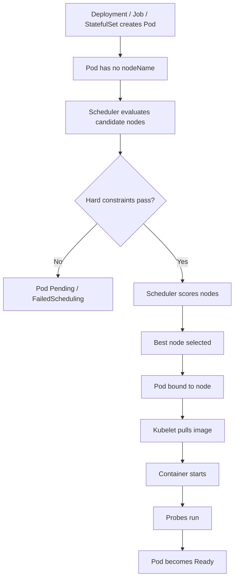
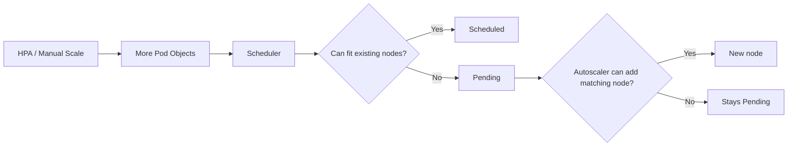
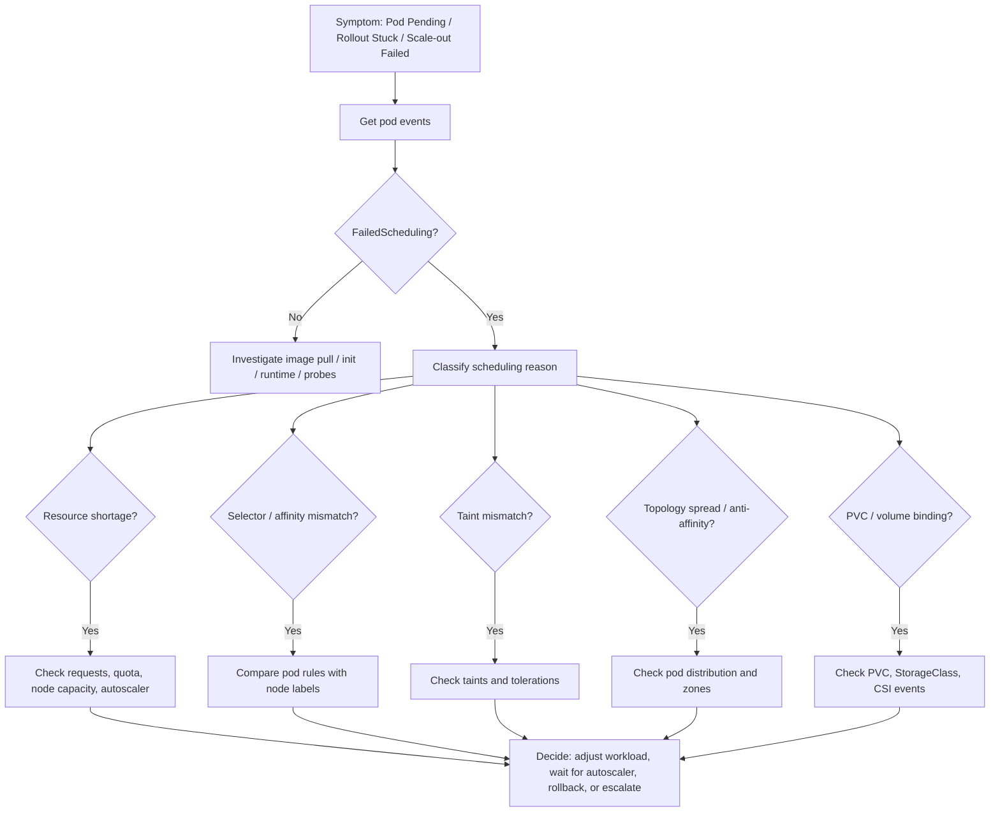

# Part 045 — Scheduling and Placement Operations

Scheduling is where Kubernetes decides **which node should run a pod**.

Placement is the set of constraints, preferences, topology rules, taints, tolerations, priorities, and resource contracts that influence that decision.

For a backend engineer, scheduling only becomes visible when something fails:

```text
0/12 nodes are available: 5 Insufficient cpu, 3 node(s) had untolerated taint,
2 node(s) didn't match Pod's node affinity/selector, 2 node(s) didn't satisfy topology spread constraint.
```

At that moment, the problem often looks like an application rollout failure, but the root cause is actually placement.

A Java/JAX-RS service can be perfectly healthy as a container image and still fail to start because Kubernetes cannot place the pod. A Kafka consumer can be ready to scale but remain Pending because its requested CPU does not fit. A Camunda worker can be blocked because it has a toleration mismatch. A critical quote/order API can become under-replicated because all new pods are forced into a saturated zone.

Scheduling is not just a cluster-admin topic. Backend engineers need enough placement literacy to design workloads that are schedulable, resilient, cost-aware, and safe during rollout, autoscaling, and node maintenance.

---

## 1. Core Concept

The scheduler assigns unscheduled pods to nodes.

It evaluates:

- resource requests;
- node readiness;
- node labels;
- node selectors;
- node affinity;
- pod affinity;
- pod anti-affinity;
- topology spread constraints;
- taints and tolerations;
- volume binding constraints;
- host ports;
- node conditions;
- PriorityClass and preemption;
- admission policies;
- cloud-provider and CNI-specific constraints.

A pod is not scheduled because Kubernetes likes the image or because the application is important. It is scheduled because the pod fits a node according to hard constraints and scoring rules.

A simplified flow:



Important operational point:

```text
A pod can be created successfully but still not run.
```

Creation is an API operation.

Scheduling is a placement decision.

Readiness is an application/runtime condition.

Do not collapse those into one mental model.

---

## 2. Why Scheduling Matters for Backend Engineers

Scheduling affects:

- rollout success;
- HPA scale-out success;
- queue drain speed;
- batch execution start time;
- zone-level resilience;
- node pool cost;
- latency due to cross-zone dependency calls;
- dependency connection distribution;
- node drain behavior;
- cluster upgrade safety;
- resilience against noisy neighbors;
- production incident blast radius.

A backend service owner might not create node pools, but they often define or review workload-level placement rules.

Examples:

```yaml
nodeSelector:
  workload-tier: backend
```

```yaml
affinity:
  podAntiAffinity:
    preferredDuringSchedulingIgnoredDuringExecution:
      - weight: 100
        podAffinityTerm:
          labelSelector:
            matchLabels:
              app.kubernetes.io/name: quote-api
          topologyKey: kubernetes.io/hostname
```

```yaml
topologySpreadConstraints:
  - maxSkew: 1
    topologyKey: topology.kubernetes.io/zone
    whenUnsatisfiable: DoNotSchedule
    labelSelector:
      matchLabels:
        app.kubernetes.io/name: quote-api
```

These rules can improve resilience.

They can also make pods impossible to schedule.

---

## 3. Scheduling Is Not Autoscaling

A common confusion:

```text
The service scaled, so Kubernetes should run the new pod.
```

Not necessarily.

HPA, KEDA, or a manual scale operation changes desired replica count.

The scheduler decides whether the resulting pods can fit.

Cluster Autoscaler or Karpenter may add nodes only if the unschedulable pods can be satisfied by a known node shape and cloud constraints allow provisioning.



A service can have:

- healthy HPA;
- healthy Deployment;
- valid image;
- valid probes;
- enough traffic demand;
- but still no extra capacity because placement constraints are unsatisfiable.

---

## 4. Backend Engineer Responsibility

Backend engineers should understand and review:

- resource requests that affect scheduling;
- whether pods can fit common node sizes;
- replica count and max surge during rollout;
- topology spread constraints requested by the service;
- pod anti-affinity for high-availability services;
- whether strict anti-affinity is too restrictive;
- node selectors requested for specialized workloads;
- tolerations required by dedicated node pools;
- PriorityClass used by critical services;
- PDB interaction with placement;
- HPA max replica interaction with node capacity;
- connection pool impact when scheduling across zones or replicas;
- whether workload placement assumptions are documented.

Backend engineers usually should not independently change:

- node taints;
- node labels used by platform policy;
- node pool configuration;
- cluster autoscaler configuration;
- Karpenter provisioners or node pools;
- cloud VM/instance type families;
- zone topology policy;
- system workload placement;
- global admission policy.

Those usually belong to platform/SRE/cluster admin.

---

## 5. Platform/SRE Responsibility

Platform/SRE usually owns:

- node pool design;
- node label taxonomy;
- taint/toleration policy;
- cluster autoscaling;
- Karpenter/AKS autoscaler policy;
- allowed instance/VM sizes;
- zone distribution;
- system vs user node pool separation;
- spot/preemptible node policy;
- GPU or specialized node pools;
- node image and runtime versions;
- scheduling admission policies;
- tenant isolation standards;
- troubleshooting scheduler and autoscaler logs.

Backend engineers should bring evidence to platform/SRE, not vague claims.

Good escalation:

```text
quote-api rollout has 3 Pending pods in prod namespace.
Events show FailedScheduling due to nodeSelector workload-tier=backend and Insufficient memory.
Requests are 2 CPU / 4Gi per pod, maxSurge=2, HPA max=12.
Backend node pool currently has no nodes with >3.5Gi allocatable free memory.
Could you confirm node pool capacity/autoscaler behavior?
```

Bad escalation:

```text
Kubernetes is broken, pods won't start.
```

---

## 6. Node Selector

`nodeSelector` is the simplest hard placement rule.

Example:

```yaml
spec:
  template:
    spec:
      nodeSelector:
        workload-tier: backend
```

This means the pod can only run on nodes with label:

```text
workload-tier=backend
```

If no ready node has that label, the pod remains Pending.

### Operational use cases

Node selectors are often used for:

- separating system workloads from application workloads;
- routing backend services to backend node pools;
- isolating high-memory workloads;
- placing workloads on Linux vs Windows nodes;
- selecting architecture such as amd64 or arm64;
- separating regulated workloads;
- steering workloads to on-demand rather than spot nodes.

### Failure modes

Node selector failure usually appears as:

```text
node(s) didn't match Pod's node affinity/selector
```

Common causes:

- label typo;
- node pool label changed;
- manifest copied from another environment;
- environment overlay mismatch;
- node pool removed;
- no nodes currently ready in that pool;
- strict selector incompatible with autoscaler policy;
- wrong architecture label.

### Backend review rule

Use `nodeSelector` only when there is a clear operational reason.

Avoid hard-coding node labels casually.

A backend service should not say:

```yaml
nodeSelector:
  kubernetes.io/hostname: ip-10-1-2-3
```

unless there is an exceptional and approved reason.

That pins a workload to a specific node and destroys Kubernetes scheduling flexibility.

---

## 7. Node Affinity

Node affinity is a more expressive placement mechanism than `nodeSelector`.

It supports hard and soft rules.

Hard rule:

```yaml
affinity:
  nodeAffinity:
    requiredDuringSchedulingIgnoredDuringExecution:
      nodeSelectorTerms:
        - matchExpressions:
            - key: workload-tier
              operator: In
              values:
                - backend
```

Soft preference:

```yaml
affinity:
  nodeAffinity:
    preferredDuringSchedulingIgnoredDuringExecution:
      - weight: 80
        preference:
          matchExpressions:
            - key: capacity-type
              operator: In
              values:
                - on-demand
```

### Operational interpretation

`requiredDuringSchedulingIgnoredDuringExecution` means:

```text
Do not schedule this pod unless the node matches.
```

`preferredDuringSchedulingIgnoredDuringExecution` means:

```text
Prefer matching nodes, but allow other nodes if necessary.
```

The phrase `IgnoredDuringExecution` means if the node label changes after scheduling, the pod is not automatically evicted just because the rule no longer matches.

### Backend use cases

Node affinity can be used to prefer:

- on-demand nodes for critical APIs;
- memory-optimized nodes for JVM-heavy services;
- specific node pools for batch workloads;
- same cloud region/zone family;
- nodes with local compliance attributes.

### Failure modes

Hard affinity can make a pod unschedulable.

Soft affinity can be ignored under pressure.

A subtle production failure:

```text
The service usually runs on on-demand nodes, but after a rollout it landed on spot/preemptible nodes because the rule was only preferred, not required.
```

Another subtle failure:

```text
The service requires high-memory nodes, but HPA max replicas assumes general-purpose node capacity.
Scale-out fails during traffic spike.
```

---

## 8. Pod Affinity

Pod affinity places pods near other pods.

Example:

```yaml
affinity:
  podAffinity:
    requiredDuringSchedulingIgnoredDuringExecution:
      - labelSelector:
          matchLabels:
            app.kubernetes.io/name: quote-cache-sidecar
        topologyKey: kubernetes.io/hostname
```

This means:

```text
Schedule this pod only on nodes that already run matching pods.
```

### Operational use cases

Pod affinity may be used when workloads benefit from locality:

- sidecar-like colocated companion workloads;
- cache-local patterns;
- data-local processing;
- specialized node-local agent dependency.

### Backend caution

Most stateless Java/JAX-RS services do not need hard pod affinity.

Hard pod affinity can create scheduling deadlocks.

Example:

```text
Pod A requires Pod B on the same node.
Pod B requires Pod A on the same node.
Neither can schedule first.
```

Prefer avoiding hard pod affinity unless the platform/team has a clear pattern.

---

## 9. Pod Anti-Affinity

Pod anti-affinity spreads pods away from matching pods.

Common use case:

```text
Do not place all replicas of quote-api on the same node.
```

Soft anti-affinity example:

```yaml
affinity:
  podAntiAffinity:
    preferredDuringSchedulingIgnoredDuringExecution:
      - weight: 100
        podAffinityTerm:
          labelSelector:
            matchLabels:
              app.kubernetes.io/name: quote-api
          topologyKey: kubernetes.io/hostname
```

Hard anti-affinity example:

```yaml
affinity:
  podAntiAffinity:
    requiredDuringSchedulingIgnoredDuringExecution:
      - labelSelector:
          matchLabels:
            app.kubernetes.io/name: quote-api
        topologyKey: kubernetes.io/hostname
```

### Operational trade-off

Soft anti-affinity improves placement but allows scheduling during constrained capacity.

Hard anti-affinity guarantees separation but can make replicas Pending.

For critical backend APIs, hard anti-affinity by hostname may be reasonable if replica count is low and node count is sufficient.

For high-scale consumers, hard anti-affinity can be dangerous because it may require one node per pod.

### Failure example

A Kafka consumer has 30 desired replicas and hard anti-affinity on hostname.

The cluster has 20 eligible nodes.

Result:

```text
10 pods stay Pending even though the cluster has spare CPU/memory.
```

The bottleneck is the placement rule, not raw capacity.

---

## 10. Topology Spread Constraints

Topology spread constraints control how pods are distributed across topology domains such as nodes or zones.

Example:

```yaml
topologySpreadConstraints:
  - maxSkew: 1
    topologyKey: topology.kubernetes.io/zone
    whenUnsatisfiable: DoNotSchedule
    labelSelector:
      matchLabels:
        app.kubernetes.io/name: quote-api
```

This means Kubernetes should keep matching pods evenly spread across zones with at most one pod difference.

### Important fields

`topologyKey` defines the domain:

- `kubernetes.io/hostname` for node-level spread;
- `topology.kubernetes.io/zone` for zone-level spread.

`maxSkew` defines tolerated imbalance.

`whenUnsatisfiable` controls behavior:

- `DoNotSchedule`: hard rule;
- `ScheduleAnyway`: soft preference.

### Backend operational value

Topology spread is often better than pod anti-affinity for high availability.

It supports:

- zone spreading;
- node spreading;
- better resilience during node loss;
- better behavior during rolling updates;
- predictable availability for JAX-RS API services;
- reduced blast radius for quote/order critical workloads.

### Failure mode

A hard zone spread constraint can block scheduling if one zone lacks capacity.

Example:

```text
3 zones exist.
One zone has no eligible nodes due to outage or capacity exhaustion.
Topology spread requires balanced placement across all zones.
New pods stay Pending.
```

This can be correct for strict HA.

It can also block emergency scale-out.

The decision is architectural, not purely technical.

---

## 11. Taints and Tolerations

A taint repels pods from a node.

A toleration allows a pod to be scheduled onto a tainted node.

Node taint example:

```text
workload-tier=batch:NoSchedule
```

Pod toleration example:

```yaml
tolerations:
  - key: workload-tier
    operator: Equal
    value: batch
    effect: NoSchedule
```

### Effects

Common taint effects:

- `NoSchedule`: do not schedule pods unless they tolerate the taint;
- `PreferNoSchedule`: try to avoid scheduling pods;
- `NoExecute`: evict running pods that do not tolerate the taint.

### Operational use cases

Taints and tolerations are used for:

- dedicated node pools;
- system node pools;
- batch node pools;
- GPU/special hardware nodes;
- spot/preemptible nodes;
- isolated regulated workloads;
- noisy workload isolation;
- emergency node quarantine.

### Backend caution

Toleration does not force placement onto a node.

It only allows placement.

If you need both allow and prefer/require, combine toleration with node selector or node affinity.

Example:

```yaml
nodeSelector:
  workload-tier: batch
tolerations:
  - key: workload-tier
    operator: Equal
    value: batch
    effect: NoSchedule
```

### Failure mode

If a pod lacks a required toleration, it remains Pending:

```text
node(s) had untolerated taint {workload-tier: batch}
```

If a pod tolerates too much, it may land on nodes it should not use.

Example:

```text
A critical quote API accidentally tolerates spot-node taints and runs on preemptible capacity.
```

---

## 12. PriorityClass and Preemption

PriorityClass tells Kubernetes which pods are more important during scheduling and preemption.

Example:

```yaml
priorityClassName: critical-backend
```

If high-priority pods cannot schedule, Kubernetes may preempt lower-priority pods if preemption is enabled and useful.

### Operational value

Priority can protect:

- critical APIs;
- ingress/controller workloads;
- core platform components;
- high-priority order processing workloads;
- incident mitigation workloads.

### Backend caution

Priority is not a substitute for capacity planning.

Preemption means other pods may be evicted.

That can create a secondary incident if low-priority pods are still business-relevant.

Do not request high priority because a service is emotionally important.

Request it only when there is a documented business and operational reason.

### Failure mode

A high-priority workload can cause lower-priority batch or consumer pods to be evicted.

This may be acceptable during severe traffic pressure.

It may be unacceptable if the evicted workload performs billing, reconciliation, or compliance processing.

---

## 13. Zone Spreading for Backend Services

Zone spreading matters because a zone failure should not remove all replicas of a service.

For a critical JAX-RS API, the target posture is usually:

```text
At least one ready replica remains available if a single node fails.
Preferably enough ready replicas remain if a zone has degraded capacity.
```

For message consumers, zone spreading also matters, but the semantics differ.

A Kafka consumer group can survive losing pods if partitions are reassigned.

A RabbitMQ consumer group can survive losing consumers if queue depth grows temporarily.

A Camunda worker pool can survive losing workers if job timeout/retry behavior is correct.

But each of those has different recovery cost:

- Kafka rebalance delay;
- RabbitMQ unacked redelivery;
- Camunda job timeout or incident creation;
- Redis connection reconnect storm;
- PostgreSQL connection churn.

Placement is therefore connected to dependency behavior.

---

## 14. Scheduling and Rollout Interaction

Rolling update creates temporary capacity pressure.

Example:

```yaml
strategy:
  rollingUpdate:
    maxSurge: 2
    maxUnavailable: 0
```

This allows two extra pods during rollout.

If each Java pod requests:

```text
CPU: 2 cores
Memory: 4Gi
```

Then rollout may temporarily require:

```text
4 CPU and 8Gi extra schedulable capacity
```

If the cluster cannot provide that, rollout can stall.

The symptom:

```text
New ReplicaSet has Pending pods.
Old ReplicaSet remains serving.
Deployment does not complete.
```

This may be safer than outage, but still operationally important.

### Review rule

When reviewing rollout strategy, consider:

- resource requests per pod;
- current replica count;
- maxSurge;
- maxUnavailable;
- PDB;
- topology constraints;
- HPA max;
- node pool spare capacity;
- cluster autoscaler delay;
- dependency connection surge.

---

## 15. Scheduling and HPA Interaction

HPA can request more replicas than the cluster can schedule.

Example:

```text
HPA maxReplicas: 20
Current node pool can fit: 12 pods
Cluster autoscaler cannot add nodes due to quota
Result: 8 Pending pods
```

From the service perspective, capacity does not increase as expected.

From the HPA perspective, desired replicas increased correctly.

From the scheduler perspective, there is no place to put pods.

From the user perspective, latency remains high.

This is why HPA tuning must be reviewed with scheduling and node capacity.

---

## 16. Scheduling and Connection Pool Interaction

Placement affects connection distribution.

If all replicas of a service land in one zone, but PostgreSQL primary is in another zone, latency and cross-zone traffic can increase.

If HPA scales from 4 to 20 pods, each pod may open its own pools:

```text
20 pods × 30 DB connections = 600 DB connections
```

If a rollout uses maxSurge, temporary connection count can be even higher.

Placement and replica count are therefore dependency capacity concerns.

For Kafka/RabbitMQ/Redis, scaling across zones can also affect:

- broker connection count;
- network latency;
- rebalance behavior;
- queue drain rate;
- cross-zone data transfer cost;
- failure isolation.

---

## 17. Safe Investigation Commands

Start with the pod:

```bash
kubectl get pod -n <namespace> <pod-name> -o wide
```

Check events:

```bash
kubectl describe pod -n <namespace> <pod-name>
```

Look for:

```text
Events:
  Warning  FailedScheduling  ...
```

List Pending pods:

```bash
kubectl get pods -n <namespace> --field-selector=status.phase=Pending -o wide
```

Inspect scheduling-related fields:

```bash
kubectl get pod -n <namespace> <pod-name> -o yaml
```

Focus on:

- `spec.nodeSelector`;
- `spec.affinity`;
- `spec.tolerations`;
- `spec.topologySpreadConstraints`;
- `spec.priorityClassName`;
- `spec.containers[].resources.requests`;
- `spec.volumes`;
- `status.conditions`;
- `status.nominatedNodeName`.

Inspect eligible nodes:

```bash
kubectl get nodes --show-labels
```

Check taints:

```bash
kubectl describe node <node-name> | grep -A5 -i taints
```

Check allocatable resources:

```bash
kubectl describe node <node-name> | grep -A8 -i allocatable
```

Check pod distribution:

```bash
kubectl get pods -n <namespace> -l app.kubernetes.io/name=<service-name> -o wide
```

Check topology labels:

```bash
kubectl get nodes -L topology.kubernetes.io/zone,kubernetes.io/hostname
```

Check quota:

```bash
kubectl describe resourcequota -n <namespace>
```

Check LimitRange:

```bash
kubectl describe limitrange -n <namespace>
```

Check whether you are allowed to inspect nodes:

```bash
kubectl auth can-i get nodes
kubectl auth can-i describe nodes
```

Do not mutate node labels, taints, or workload placement in production without the approved process.

---

## 18. FailedScheduling Message Interpretation

### Insufficient CPU

```text
0/8 nodes are available: 8 Insufficient cpu.
```

Interpretation:

```text
No eligible node has enough unallocated CPU request capacity for the pod.
```

Investigate:

- pod CPU request;
- node allocatable CPU;
- existing pod requests;
- maxSurge;
- HPA scale-out;
- namespace quota;
- autoscaler behavior.

### Insufficient memory

```text
0/8 nodes are available: 8 Insufficient memory.
```

Interpretation:

```text
No eligible node has enough unallocated memory request capacity.
```

For Java services, this often means memory request is large due to heap/native memory sizing.

### Untolerated taint

```text
node(s) had untolerated taint {workload-tier: batch}
```

Interpretation:

```text
The pod is not allowed on nodes with that taint.
```

Investigate:

- whether workload should tolerate that taint;
- whether node pool is correct;
- whether manifest lost toleration in overlay;
- whether taint was recently added by platform.

### Node affinity/selector mismatch

```text
node(s) didn't match Pod's node affinity/selector
```

Interpretation:

```text
The pod has hard placement rules that candidate nodes do not satisfy.
```

Investigate:

- selector keys/values;
- node labels;
- environment overlay;
- node pool availability;
- typo or stale label.

### Topology spread constraint failure

```text
node(s) didn't satisfy existing pods anti-affinity rules
```

or:

```text
node(s) didn't match pod topology spread constraints
```

Interpretation:

```text
The pod cannot be placed without violating spread rules.
```

Investigate:

- current pod distribution;
- zones/nodes available;
- maxSkew;
- hard vs soft rule;
- missing labels;
- surge behavior.

### PVC binding issue

```text
pod has unbound immediate PersistentVolumeClaims
```

Interpretation:

```text
Scheduling is blocked by storage availability or binding mode.
```

Escalate to storage/platform owner if backend team does not own storage.

---

## 19. Production Debugging Flow



Do not start by changing the manifest.

Start by proving the scheduling predicate that failed.

---

## 20. Java/JAX-RS Service Placement Concerns

For Java/JAX-RS services, placement interacts with runtime behavior.

### Large memory request

A Java pod with large memory request may not fit on general-purpose nodes.

Example:

```yaml
resources:
  requests:
    cpu: "2"
    memory: "6Gi"
```

If node allocatable memory is fragmented, new pods may stay Pending even though total cluster free memory appears sufficient.

Scheduling uses per-node fit, not total cluster sum.

### Slow startup

If node provisioning plus image pull plus JVM startup takes several minutes, autoscaling may be too slow for sudden request spikes.

Mitigations may include:

- higher min replicas;
- faster startup path;
- smaller images;
- warm pools or pre-provisioned nodes;
- queue buffering;
- better traffic shedding;
- realistic SLO expectations.

### Cross-zone dependency latency

If pod placement changes zones, latency to PostgreSQL, Redis, Kafka, RabbitMQ, or Camunda dependencies may change.

This can appear as application latency regression after rollout even when code did not change.

---

## 21. Kafka Consumer Placement Concerns

Kafka consumers care about:

- partition count;
- consumer group rebalance;
- network path to brokers;
- pod restart frequency;
- zone distribution;
- graceful shutdown;
- HPA/KEDA scaling delay.

Placement failure examples:

```text
Consumer pods scale from 6 to 18, but 8 remain Pending due to hard anti-affinity.
Lag continues to grow.
```

```text
Consumers land on spot nodes. Spot interruption triggers frequent rebalance.
Latency and duplicate processing increase.
```

```text
Consumers are spread across zones, but Kafka brokers are zone-local and cross-zone traffic cost rises.
```

Backend review should include:

- whether consumer placement is intentionally spread;
- whether spot/preemptible nodes are acceptable;
- whether max replicas exceed partition count;
- whether dependency capacity supports replica growth;
- whether KEDA scale-out can be scheduled.

---

## 22. RabbitMQ Consumer Placement Concerns

RabbitMQ consumers care about:

- queue depth;
- connection count;
- channel count;
- prefetch;
- unacked messages;
- redelivery behavior;
- broker network path;
- shutdown behavior.

Placement failures can cause:

- queue backlog not draining;
- consumers concentrated in one zone;
- bursty reconnects after node drain;
- broker connection spikes during rollout;
- redelivery storm after eviction.

Hard anti-affinity can protect availability but may limit scale-out.

Dedicated node pools can isolate heavy consumers but can also create Pending pods if the pool is small.

---

## 23. Redis-Backed Service Placement Concerns

Redis-backed services care about:

- connection count;
- cross-zone latency;
- cache locality assumptions;
- retry behavior;
- command timeout;
- node interruption causing reconnect storm.

If Redis is zonal or private endpoint routing differs by zone, pod placement can affect latency.

Do not assume Redis latency is purely application code.

Check whether pods moved nodes or zones during the same time window.

---

## 24. Camunda Worker Placement Concerns

Camunda workers care about:

- job activation;
- worker concurrency;
- job timeout;
- retry and incident behavior;
- graceful shutdown;
- network path to Camunda engine/gateway.

If workers are evicted or rescheduled frequently, job activation and completion patterns can become unstable.

If placement prevents new workers from scheduling, incidents may rise because jobs time out or backlog accumulates.

For critical workflow processing, placement should be reviewed with:

- worker replica minimum;
- zone spreading;
- graceful shutdown;
- PDB;
- node drain behavior;
- dependency capacity.

---

## 25. EKS-Specific Placement Awareness

In EKS, placement may be affected by:

- managed node groups;
- self-managed node groups;
- Karpenter NodePools/Provisioners;
- VPC CNI IP availability;
- subnet IP exhaustion;
- availability zone capacity;
- instance type availability;
- spot capacity interruption;
- node security groups;
- security groups for pods if used;
- EBS volume zone binding;
- Fargate profile selectors.

A pod may be unschedulable not because CPU is unavailable globally, but because:

```text
No allowed instance type in the required zone can satisfy the pod.
```

or:

```text
Subnet IPs are exhausted, so new pods cannot receive IPs.
```

or:

```text
PVC is bound to a volume in zone A, but eligible nodes are in zone B.
```

Backend engineers should capture pod events and workload constraints, then escalate EKS node/subnet/Karpenter-specific issues to platform/SRE.

---

## 26. AKS-Specific Placement Awareness

In AKS, placement may be affected by:

- system node pool vs user node pool;
- node pool autoscaling;
- VMSS capacity;
- Azure CNI IP allocation;
- subnet capacity;
- availability zones;
- VM SKU availability;
- spot node pools;
- node taints;
- Azure Disk zone binding;
- private cluster networking;
- Azure policy admission.

A pod may stay Pending because:

```text
The user node pool has no capacity and autoscaling is capped.
```

or:

```text
The pod only tolerates a taint used by a different workload class.
```

or:

```text
The selected VM SKU is unavailable in the zone.
```

Backend engineers should not try to fix node pools directly unless explicitly authorized.

---

## 27. On-Prem and Hybrid Placement Awareness

On-prem/hybrid clusters may have less elastic capacity than cloud clusters.

Placement constraints are often stricter because of:

- fixed hardware;
- limited node pools;
- firewall zones;
- corporate DNS routing;
- storage locality;
- internal load balancer constraints;
- proxy requirements;
- air-gapped registry access;
- maintenance windows;
- manual capacity procurement.

In on-prem environments, Pending pods may not self-resolve.

A cloud engineer might expect autoscaling to add nodes.

An on-prem cluster may require manual capacity planning.

Backend readiness must account for that difference.

---

## 28. Scheduling Review Checklist for PRs

When reviewing a Kubernetes manifest change, ask:

### Resources

- Did CPU request increase?
- Did memory request increase?
- Did ephemeral storage request increase?
- Can the pod still fit common node sizes?
- Does maxSurge create temporary capacity pressure?

### Selectors and affinity

- Was `nodeSelector` added or changed?
- Was hard node affinity added?
- Was hard pod anti-affinity added?
- Is soft preference sufficient?
- Are label keys standardized?
- Are environment overlays consistent?

### Topology

- Is zone spreading required?
- Is `whenUnsatisfiable` too strict?
- What happens during zone capacity shortage?
- Does the topology rule match the correct pod labels?

### Taints and tolerations

- Was a toleration added?
- Does it allow the pod onto spot/preemptible nodes?
- Does the pod need node affinity too?
- Is the toleration approved by platform/security?

### Priority

- Was `priorityClassName` added?
- Is preemption acceptable?
- Which workloads could be displaced?
- Is there approval for critical priority?

### Availability

- Do PDB and placement rules conflict?
- Can rolling update complete?
- Can cluster upgrade drain nodes?
- Can HPA max replicas be scheduled?

### Cost

- Does placement force expensive node types?
- Does topology spread require idle capacity in multiple zones?
- Does hard anti-affinity reduce bin packing efficiency?

---

## 29. Common Anti-Patterns

### Anti-pattern 1: Hard anti-affinity everywhere

Hard anti-affinity sounds safe.

It can make high-replica workloads unschedulable.

Prefer topology spread or soft anti-affinity unless strict separation is required.

### Anti-pattern 2: Node selector copied across environments

A selector valid in dev may not exist in production.

A selector valid in EKS may not exist in AKS.

A selector valid in cloud may not exist on-prem.

### Anti-pattern 3: Tolerating all taints

Broad tolerations can place workloads on inappropriate nodes.

Example:

```yaml
operator: Exists
```

This can accidentally allow scheduling onto system, spot, GPU, or maintenance nodes.

### Anti-pattern 4: Priority without ownership

High priority without governance causes accidental preemption and hidden incidents.

### Anti-pattern 5: Placement rule without runbook

If a service requires special placement, the runbook should explain why.

Otherwise future responders may remove the rule during an incident and create a larger risk.

---

## 30. Operational Readiness Checklist

A backend workload is placement-ready when:

- resource requests are realistic;
- pods can fit expected node sizes;
- HPA max replicas can be scheduled or capacity gap is documented;
- rollout surge can be scheduled;
- node selector/affinity rules are justified;
- anti-affinity/topology spread rules match availability goals;
- tolerations are minimal and approved;
- PriorityClass is justified and approved;
- PDB does not conflict with placement;
- zone spreading is validated;
- dependency capacity impact is understood;
- platform/SRE has confirmed node pool assumptions;
- dashboards expose Pending pods and scheduling failures;
- runbook includes FailedScheduling triage.

---

## 31. Internal Verification Checklist

Verify internally:

- Which node pools exist for backend workloads?
- Which node labels are stable platform contract?
- Which labels are implementation details and should not be used by app teams?
- What taints exist on system, backend, batch, spot, and specialized nodes?
- Are backend teams allowed to set tolerations?
- Are backend teams allowed to request PriorityClass?
- What topology spread standard is recommended for critical APIs?
- Is hard pod anti-affinity allowed?
- How does the platform handle EKS node groups, Karpenter, or AKS node pool autoscaling?
- What is the escalation path for Pending pods?
- Are scheduler/autoscaler events visible to backend engineers?
- Are node labels consistent across dev, test, staging, and production?
- Are GitOps overlays aligned across environments?
- Are placement rules reviewed in PRs?
- Is there a dashboard for Pending pods by namespace/service?
- Is there an alert for long-running Pending pods?
- Are node drain and cluster upgrade windows communicated to backend teams?
- Are spot/preemptible nodes used for any backend workloads?
- Which workloads are allowed to run on spot/preemptible capacity?
- Are zone distribution and cross-zone cost visible?

---

## 32. Safe Mitigation Options

Depending on evidence, safe mitigations may include:

- rollback a manifest that introduced bad placement rules;
- reduce `maxSurge` temporarily if rollout capacity is insufficient;
- scale down non-critical workload if approved;
- temporarily lower replicas of non-critical batch consumers if approved;
- adjust resource requests only after validating usage and policy;
- switch hard spread to soft only through approved release process;
- request platform to add node capacity;
- request platform to fix node labels/taints if they drifted;
- request platform to review autoscaler/Karpenter/node pool behavior;
- pause rollout while preserving existing healthy replicas;
- escalate storage binding issues to platform/storage owner.

Unsafe mitigations:

- manually editing node labels in production;
- removing taints from nodes without approval;
- adding broad tolerations to production workloads quickly;
- deleting Pending pods repeatedly without fixing root cause;
- disabling PDB blindly;
- removing topology spread from critical service without understanding HA impact;
- reducing memory requests below JVM reality;
- raising priority without approval;
- forcing pods onto system nodes.

---

## 33. Runbook: Pod Pending Due to Scheduling

Use this sequence.

```bash
kubectl get pod -n <namespace> <pod-name> -o wide
kubectl describe pod -n <namespace> <pod-name>
```

Classify the event message.

If resource shortage:

```bash
kubectl get pod -n <namespace> <pod-name> -o jsonpath='{.spec.containers[*].resources.requests}'
kubectl describe resourcequota -n <namespace>
kubectl get nodes
kubectl describe node <candidate-node>
```

If selector/affinity mismatch:

```bash
kubectl get pod -n <namespace> <pod-name> -o yaml | grep -A80 -E 'nodeSelector|affinity'
kubectl get nodes --show-labels
```

If taint/toleration mismatch:

```bash
kubectl get pod -n <namespace> <pod-name> -o yaml | grep -A40 tolerations
kubectl describe node <node-name> | grep -A5 -i taints
```

If topology issue:

```bash
kubectl get pod -n <namespace> -l app.kubernetes.io/name=<service> -o wide
kubectl get nodes -L topology.kubernetes.io/zone,kubernetes.io/hostname
kubectl get pod -n <namespace> <pod-name> -o yaml | grep -A60 topologySpreadConstraints
```

Then decide:

```text
Is this a workload manifest issue, a capacity issue, a platform policy issue, or a storage/network/cloud constraint?
```

Document evidence before mitigation.

---

## 34. Key Takeaways

Scheduling is the bridge between desired workload state and actual node capacity.

For backend engineers, the main skill is not memorizing every scheduler rule. The main skill is reading Pending pods and FailedScheduling events as structured evidence.

The core model:

```text
Replica desired != pod scheduled != container started != pod ready != service capacity increased.
```

Placement rules can improve reliability, but every hard rule reduces scheduling flexibility.

The senior-engineer posture is:

- know which placement rules your service uses;
- understand why they exist;
- verify they work under rollout and autoscaling;
- treat Pending pods as operational evidence;
- avoid unsafe production changes;
- escalate node pool and autoscaler issues with precise facts.
