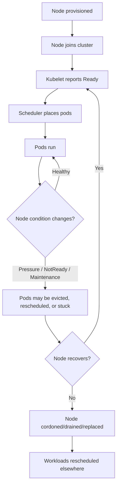
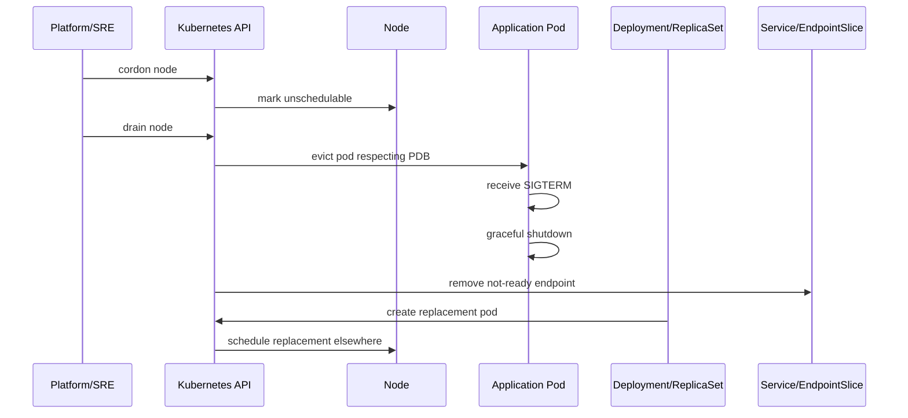
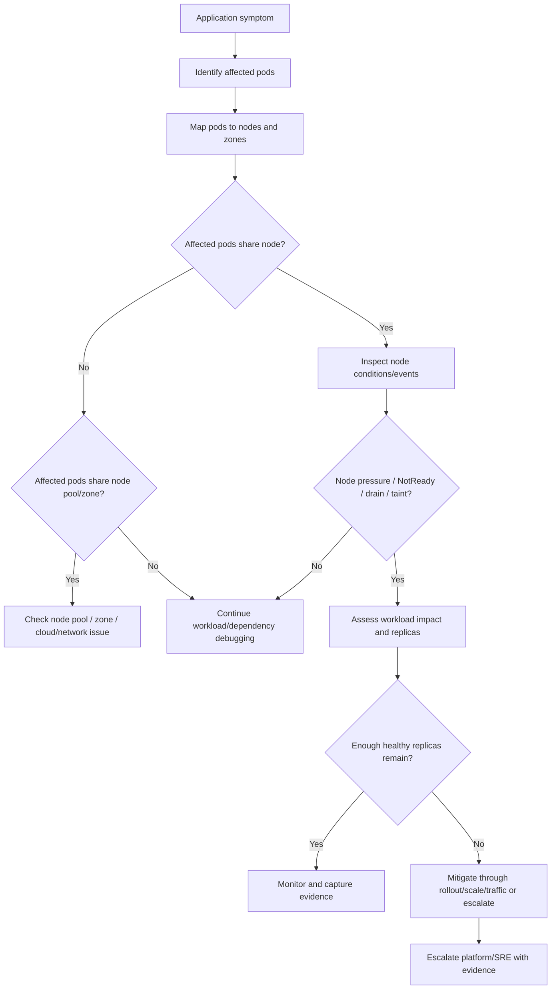

# Part 046 — Node Operations for Backend Engineers

Backend engineers usually do not own Kubernetes nodes.

But backend workloads run on nodes.

When a node becomes NotReady, memory pressured, disk pressured, drained, tainted, preempted, upgraded, or misconfigured, application symptoms appear quickly:

- pod restarts;
- pod evictions;
- rollout stalls;
- request latency spikes;
- ingress 502/503;
- Kafka rebalance;
- RabbitMQ redelivery;
- Redis reconnect storm;
- PostgreSQL connection churn;
- Camunda job timeout;
- HPA scale-out failing;
- logs disappearing with terminated containers;
- traffic imbalance across remaining replicas.

A senior backend engineer does not need to administer nodes, patch kernels, tune kubelet, or manage cloud node pools. But they must be able to identify when an application incident is actually a node-level or node-pool-level issue and escalate with useful evidence.

This part is about reading node health from a backend service owner perspective.

---

## 1. Core Concept

A Kubernetes node is a worker machine that runs pods.

It may be:

- a VM in AWS EKS;
- a VMSS instance in Azure AKS;
- a bare-metal server on-prem;
- a virtual machine in a private cloud;
- a managed Fargate-like runtime, depending on platform model.

A node typically runs:

- kubelet;
- container runtime;
- kube-proxy or eBPF dataplane components;
- CNI plugin components;
- CSI plugin components;
- logging/metrics agents;
- security agents;
- application pods.

From a backend workload point of view, node health determines whether pods can:

- be scheduled;
- pull images;
- start containers;
- access network;
- mount volumes;
- write temporary files;
- emit logs/metrics;
- remain running during maintenance;
- terminate gracefully.

---

## 2. Node Lifecycle Mental Model

A simplified lifecycle:



Important separation:

```text
Pod health is not always application health.
Node health is not always cluster health.
Cluster health is not always workload health.
```

A single node issue can look like many application issues if multiple pods of the same service are concentrated on that node.

---

## 3. Backend Engineer Responsibility

Backend engineers should be able to:

- identify which node a pod runs on;
- detect whether affected pods share the same node;
- detect whether affected pods share the same node pool or zone;
- read basic node conditions if permitted;
- recognize node pressure events;
- understand pod eviction evidence;
- understand node drain impact;
- connect node maintenance to rollout/readiness behavior;
- validate whether enough replicas remain after node loss;
- verify PDB and graceful shutdown behavior;
- escalate node issues with evidence.

Backend engineers usually should not independently:

- cordon production nodes;
- drain production nodes;
- delete nodes;
- patch kubelet/container runtime;
- change node taints;
- change node labels;
- modify node pool autoscaling;
- restart system agents;
- SSH into nodes;
- change CNI/CSI components;
- alter cloud VM scale sets or node groups.

Unless your team explicitly grants that responsibility, those actions belong to platform/SRE/cluster admin.

---

## 4. Platform/SRE Responsibility

Platform/SRE usually owns:

- node provisioning;
- node pool design;
- node image and OS patching;
- kubelet configuration;
- container runtime configuration;
- CNI and CSI operations;
- node labels and taints;
- node drain process;
- cluster upgrade process;
- node autoscaling;
- spot/preemptible interruption handling;
- system DaemonSets;
- node-level security agents;
- node capacity and bin packing policy;
- node-level incident response.

A backend engineer's job is to identify workload impact and provide accurate evidence.

---

## 5. Node Readiness

A node condition of `Ready=True` means the node is healthy enough to accept pods.

Check nodes:

```bash
kubectl get nodes
```

Example:

```text
NAME             STATUS     ROLES    AGE   VERSION
node-a           Ready      <none>   20d   v1.29.x
node-b           NotReady   <none>   20d   v1.29.x
node-c           Ready      <none>   20d   v1.29.x
```

A `NotReady` node can cause:

- pods stuck terminating;
- pods unavailable until rescheduled;
- EndpointSlice updates;
- reduced service capacity;
- Kafka/RabbitMQ consumer disruption;
- HPA reacting to reduced ready pods;
- PDB preventing voluntary disruptions elsewhere.

### Safe investigation

Find pods on the node:

```bash
kubectl get pods -A -o wide --field-selector spec.nodeName=<node-name>
```

Find your service pods and their nodes:

```bash
kubectl get pods -n <namespace> -l app.kubernetes.io/name=<service-name> -o wide
```

Describe node if permitted:

```bash
kubectl describe node <node-name>
```

Look for:

- `Ready` condition;
- `MemoryPressure`;
- `DiskPressure`;
- `PIDPressure`;
- `NetworkUnavailable`;
- taints;
- allocated resources;
- recent events;
- kubelet messages.

---

## 6. Node Conditions

Common node conditions:

| Condition | Meaning | Backend impact |
|---|---|---|
| `Ready` | kubelet is healthy and node can run pods | NotReady can reduce capacity or trigger rescheduling |
| `MemoryPressure` | node memory is low | pods may be evicted; JVM pods may be killed or degraded |
| `DiskPressure` | node disk is low | pods using logs/temp files may be evicted |
| `PIDPressure` | process ID capacity is low | new processes/threads may fail; Java services can degrade |
| `NetworkUnavailable` | node network is not correctly configured | pods may fail to communicate |

Node pressure does not always mean the node is down.

It means the node is under a resource condition where kubelet may take protective action.

---

## 7. Node Pressure

Node pressure is a major production signal.

### MemoryPressure

Possible causes:

- too many pods on a node;
- pods using more memory than requested;
- JVM native memory growth;
- large direct buffers;
- thread explosion;
- node-level daemon memory usage;
- memory leak in one or more pods;
- under-sized node pool.

Impact:

- pod eviction;
- degraded performance;
- OOMKilled containers;
- reduced scheduling capacity;
- cascading restart loops.

### DiskPressure

Possible causes:

- container logs too large;
- application temp files;
- file upload buffering;
- batch intermediate files;
- image layer accumulation;
- node log retention issue;
- emptyDir usage growth;
- CSI/container runtime disk issue.

Impact:

- pod eviction;
- failed image pulls;
- write failures;
- lost local temporary state;
- batch failure;
- degraded node reliability.

### PIDPressure

Possible causes:

- too many processes;
- thread explosion in Java;
- fork-heavy workload;
- runaway sidecar;
- node-level daemon issue.

Impact:

- JVM unable to create new threads;
- request handling failure;
- liveness/readiness failure;
- pod instability.

---

## 8. Pod Eviction

Eviction means kubelet terminates pods to protect node health or enforce resource pressure policies.

Check pod status:

```bash
kubectl get pods -n <namespace>
```

Example:

```text
quote-api-abc123   0/1   Evicted   0   3m
```

Describe the pod:

```bash
kubectl describe pod -n <namespace> <pod-name>
```

Common eviction reasons:

```text
The node was low on resource: memory.
```

```text
The node had condition: DiskPressure.
```

```text
The node was low on resource: ephemeral-storage.
```

### Backend interpretation

Eviction is not the same as application crash.

If a Java service is evicted due to node pressure, application logs may not show a clean exception.

You need Kubernetes events and node conditions.

### Eviction risk by workload type

| Workload type | Eviction impact |
|---|---|
| JAX-RS API | capacity loss, in-flight request termination, 5xx/timeout risk |
| Kafka consumer | rebalance, duplicate processing risk, lag growth |
| RabbitMQ consumer | unacked message redelivery, connection churn |
| Redis-backed service | cache reconnect storm, latency spike |
| Camunda worker | job timeout, retry, incident risk |
| Batch job | partial work, retry/idempotency risk |
| Migration job | dangerous if migration is not idempotent or resumable |

---

## 9. Node Drain

Draining a node safely evicts pods so the node can be maintained, upgraded, or removed.

Platform/SRE usually runs:

```bash
kubectl drain <node-name> --ignore-daemonsets --delete-emptydir-data
```

Backend engineers should understand the effect, not necessarily run it.

Drain flow:



### Backend concerns during drain

- Does the app handle SIGTERM?
- Is `terminationGracePeriodSeconds` long enough?
- Does readiness turn false before shutdown finishes?
- Are in-flight HTTP requests allowed to complete?
- Do Kafka consumers commit offsets safely?
- Do RabbitMQ consumers stop consuming and ack/nack correctly?
- Do Camunda workers stop activating new jobs?
- Does PDB protect minimum availability?
- Can replacement pods schedule elsewhere?

---

## 10. Cordon

Cordoning marks a node unschedulable.

Platform/SRE may run:

```bash
kubectl cordon <node-name>
```

Existing pods continue running.

New pods are not scheduled there.

Backend implication:

```text
If many nodes are cordoned, rollout or HPA scale-out may fail even though existing pods look healthy.
```

Check:

```bash
kubectl get nodes
```

A cordoned node often appears with scheduling disabled:

```text
Ready,SchedulingDisabled
```

Backend engineers should not uncordon nodes unless explicitly authorized.

---

## 11. Node Taints

Taints on nodes influence scheduling and sometimes eviction.

Check taints:

```bash
kubectl describe node <node-name> | grep -A5 -i taints
```

Common taints:

```text
node.kubernetes.io/not-ready:NoSchedule
node.kubernetes.io/unreachable:NoExecute
node.kubernetes.io/memory-pressure:NoSchedule
node.kubernetes.io/disk-pressure:NoSchedule
node.kubernetes.io/unschedulable:NoSchedule
```

Platform-specific taints may include:

```text
workload-tier=batch:NoSchedule
capacity-type=spot:NoSchedule
node-role.kubernetes.io/system:NoSchedule
```

Backend impact:

- pods may not schedule;
- pods may be evicted under `NoExecute`;
- workloads may accidentally land on inappropriate nodes if tolerations are too broad;
- rollouts may stall if only tainted nodes have free capacity.

---

## 12. Node Pool and Node Group Awareness

A node pool/node group is a set of nodes with similar configuration.

In EKS, you may see:

- managed node groups;
- self-managed node groups;
- Karpenter-managed nodes;
- Fargate profiles.

In AKS, you may see:

- system node pool;
- user node pool;
- VMSS-backed node pool;
- spot node pool.

On-prem, you may see manually managed groups such as:

- backend nodes;
- platform nodes;
- stateful nodes;
- batch nodes;
- GPU/special hardware nodes.

Backend engineers should know which pool their workloads normally use.

Check node labels:

```bash
kubectl get nodes --show-labels
```

Common useful labels:

```text
kubernetes.io/hostname
kubernetes.io/os
topology.kubernetes.io/zone
node.kubernetes.io/instance-type
```

Cloud/platform-specific labels vary and must be verified internally.

---

## 13. Runtime Issue Awareness

Sometimes pods fail because the node runtime layer is unhealthy.

Potential node/runtime issues:

- container runtime unavailable;
- kubelet unhealthy;
- CNI plugin issue;
- CSI mount issue;
- node DNS/resolver issue;
- image pull failures only on specific nodes;
- logging agent failure;
- time synchronization issue;
- kernel/network issue;
- node disk corruption or full disk;
- system DaemonSet crash.

Backend symptom examples:

```text
Only pods on node-a cannot reach Redis.
```

```text
Only pods on node-b fail to mount secrets volume.
```

```text
Only pods on node-c have DNS timeouts.
```

```text
Only pods on one node report clock skew token errors.
```

The application may be innocent.

The clue is node correlation.

---

## 14. Correlating Application Symptoms by Node

During incident triage, ask:

```text
Are all affected pods on the same node, same node pool, or same zone?
```

Command:

```bash
kubectl get pods -n <namespace> -l app.kubernetes.io/name=<service-name> -o wide
```

Example:

```text
NAME                       READY   STATUS    NODE
quote-api-111              1/1     Running   node-a
quote-api-222              0/1     Running   node-a
quote-api-333              1/1     Running   node-b
quote-api-444              1/1     Running   node-c
```

If the failing pod is on `node-a`, check whether other pods on `node-a` are also unhealthy.

```bash
kubectl get pods -A -o wide --field-selector spec.nodeName=node-a
```

Look for patterns:

- many restarts on same node;
- many readiness failures on same node;
- image pull failures on same node;
- DNS failures on same node;
- volume mount failures on same node;
- evictions from same node.

Node correlation is one of the fastest ways to avoid misdiagnosing an application bug.

---

## 15. Node Issues and Java/JAX-RS Services

Node problems can surface as Java service symptoms.

### Memory pressure

A Java process may be stable in heap metrics but still killed or evicted because the node is under memory pressure.

Check:

- container memory usage;
- JVM heap;
- native memory;
- node MemoryPressure;
- eviction events;
- pod QoS class.

### CPU contention

If a node is overloaded, Java request latency and GC behavior can degrade.

Even without CPU throttling, noisy neighbors can affect latency if requests are too low or node pressure is high.

Check:

- pod CPU usage;
- CPU throttling;
- node CPU saturation;
- thread pool saturation;
- GC pause time;
- latency percentiles.

### Disk pressure

Java services that write temporary files, request bodies, reports, exports, or batch artifacts can trigger or suffer from DiskPressure.

Check:

- `/tmp` usage;
- EmptyDir usage;
- container writable layer;
- log volume;
- file upload buffering;
- eviction events.

### Node drain

If a node is drained and Java shutdown is not graceful:

- in-flight requests may fail;
- readiness may remain true too long;
- connection pools may close abruptly;
- downstream retries may spike;
- users may see 502/503/504.

---

## 16. Node Issues and Kafka Consumers

Node disruption causes Kafka consumer effects:

- consumer leaves group;
- rebalance starts;
- partitions are reassigned;
- lag may grow temporarily;
- duplicate processing may happen if offset commit is unsafe;
- processing may pause during rebalance;
- rolling node maintenance can create repeated rebalances.

If multiple consumer pods are on the same node and that node fails, impact is larger.

Placement and anti-affinity matter.

Check:

```bash
kubectl get pods -n <namespace> -l app.kubernetes.io/name=<consumer-service> -o wide
```

Then correlate with:

- consumer lag;
- rebalance count;
- pod restarts;
- node events;
- deployment rollout;
- node drain window.

---

## 17. Node Issues and RabbitMQ Consumers

Node disruption can cause:

- connection close;
- channel close;
- unacked message redelivery;
- queue depth growth;
- duplicate processing risk;
- broker reconnect spike;
- DLQ increase if retry policy is aggressive.

A node drain can be safe if consumers stop consuming and ack/nack correctly during SIGTERM.

It can be unsafe if the process is killed before it completes message handling.

Check:

- pod termination logs;
- RabbitMQ unacked count;
- redelivery rate;
- queue depth;
- connection count;
- node drain timing;
- graceful shutdown implementation.

---

## 18. Node Issues and Redis-Backed Services

Node disruption can cause many pods to reconnect to Redis at once.

Symptoms:

- Redis connection spike;
- timeout spike;
- latency increase;
- cache miss increase;
- circuit breaker opens;
- application thread pool saturation.

If all pods of a Redis-heavy service are concentrated on one node, node failure can cause a concentrated reconnect storm.

Check pod distribution and node events.

---

## 19. Node Issues and Camunda Workers

Node failure or drain can affect Camunda workers by:

- stopping job activation;
- killing active job processing;
- triggering timeout/retry;
- increasing incidents;
- delaying quote/order workflow steps;
- increasing duplicate external side-effect risk if job handlers are not idempotent.

Check:

- worker pod node distribution;
- job activation rate;
- incident count;
- job timeout config;
- retry pattern;
- worker shutdown logs;
- node events.

---

## 20. EKS Node Operations Awareness

In EKS, node issues may involve:

- managed node group health;
- Karpenter node lifecycle;
- EC2 instance status;
- Auto Scaling Group behavior;
- spot interruption;
- VPC CNI IP exhaustion;
- subnet routing;
- security group changes;
- EBS CSI volume attach/mount;
- AMI/node image changes;
- AWS Load Balancer target health.

Backend evidence to collect before escalation:

- affected pod names;
- node names;
- node group if visible;
- zone;
- pod events;
- node conditions;
- recent rollout marker;
- dependency symptoms;
- whether issue is node-specific or service-wide.

Do not assume EKS node failure means application code is wrong.

---

## 21. AKS Node Operations Awareness

In AKS, node issues may involve:

- VMSS instance health;
- system vs user node pool;
- node image upgrade;
- Azure CNI IP exhaustion;
- subnet/NSG/UDR changes;
- spot eviction;
- Azure Disk attach/mount issue;
- managed identity/token issue on node;
- Azure Monitor agent issue;
- Application Gateway or Azure Load Balancer health.

Backend evidence to collect:

- affected pods and nodes;
- node pool name if visible;
- zone;
- node conditions;
- pod events;
- readiness failures;
- ingress/load balancer symptoms;
- dependency connectivity evidence.

---

## 22. On-Prem and Hybrid Node Operations Awareness

On-prem/hybrid node issues may involve:

- hardware failure;
- hypervisor issue;
- corporate network outage;
- firewall changes;
- internal DNS failure;
- proxy failure;
- internal CA rotation;
- storage appliance issue;
- manual maintenance;
- limited spare capacity.

Unlike cloud clusters, replacement capacity may not appear automatically.

Backend readiness must consider:

- minimum replicas;
- PDB;
- graceful shutdown;
- whether critical services can survive node loss;
- whether batch jobs can resume;
- whether stateful dependencies are managed outside the cluster;
- whether manual escalation is required for hardware/network.

---

## 23. Safe Investigation Commands

### Find node for a pod

```bash
kubectl get pod -n <namespace> <pod-name> -o wide
```

### List pods by node

```bash
kubectl get pods -A -o wide --field-selector spec.nodeName=<node-name>
```

### View node summary

```bash
kubectl get node <node-name> -o wide
```

### Describe node

```bash
kubectl describe node <node-name>
```

### Show node labels

```bash
kubectl get node <node-name> --show-labels
```

### Show zone and instance type labels

```bash
kubectl get nodes -L topology.kubernetes.io/zone,node.kubernetes.io/instance-type
```

### Check current service distribution

```bash
kubectl get pods -n <namespace> -l app.kubernetes.io/name=<service-name> -o wide
```

### Check evicted pods

```bash
kubectl get pods -n <namespace> --field-selector=status.phase=Failed
```

### Check events in namespace

```bash
kubectl get events -n <namespace> --sort-by=.lastTimestamp
```

### Check whether you can inspect nodes

```bash
kubectl auth can-i get nodes
kubectl auth can-i describe nodes
```

Avoid unsafe commands unless authorized:

```bash
kubectl cordon <node>
kubectl uncordon <node>
kubectl drain <node>
kubectl delete node <node>
```

---

## 24. Node Issue Debugging Flow



This flow prevents premature application rollback when the problem is node-local.

It also prevents ignoring a node issue that is reducing service capacity.

---

## 25. Node Drain Readiness Review

Before assuming a service is production-ready, verify drain behavior.

### HTTP/JAX-RS API

- Does readiness become false before shutdown?
- Does the app stop accepting new requests?
- Are in-flight requests allowed to complete?
- Is `terminationGracePeriodSeconds` long enough?
- Does NGINX/Ingress stop routing to terminating pods quickly enough?
- Are client retries safe?

### Kafka consumer

- Does the consumer stop polling on SIGTERM?
- Are offsets committed safely?
- Is processing idempotent?
- Is rebalance delay acceptable?
- Does lag alert account for maintenance windows?

### RabbitMQ consumer

- Does the consumer stop consuming new messages?
- Are in-flight messages acked/nacked safely?
- Is prefetch reasonable?
- Does redelivery create duplicate side effects?

### Camunda worker

- Does the worker stop activating new jobs?
- Are active jobs completed or allowed to timeout safely?
- Are job handlers idempotent?
- Are incidents monitored?

### Batch/migration job

- Is work checkpointed?
- Is retry safe?
- Is partial completion recoverable?
- Is eviction acceptable during migration?

---

## 26. Node Issue Evidence Template

Use a structured escalation note.

```text
Service: <service-name>
Namespace: <namespace>
Environment: <env>
Symptom: <latency/error/restarts/evictions/pending>
Start time: <timestamp>
Affected pods: <pod list>
Affected node(s): <node list>
Affected zone/node pool: <if known>
Recent deployment: <yes/no, version, timestamp>
Node condition evidence: <Ready/MemoryPressure/DiskPressure/etc>
Pod event evidence: <eviction, failed scheduling, killing, etc>
Workload impact: <replicas unavailable, SLO impact, lag, queue depth>
Initial mitigation: <rollback/scale/pause/none>
Requested platform action: <investigate node/node pool/CNI/CSI/autoscaler/etc>
```

This is far more useful than saying:

```text
Pods are unstable.
```

---

## 27. Common Node-Related Failure Patterns

### Pattern 1: One bad node causes one bad pod

Symptom:

```text
Only one pod has readiness failures.
```

Check:

- node conditions;
- other pods on same node;
- node DNS/network;
- CPU/memory/disk pressure.

Mitigation:

- allow Deployment to replace pod if safe;
- escalate node if repeated;
- avoid application rollback unless evidence points to code/config.

### Pattern 2: Node drain causes consumer rebalance storm

Symptom:

```text
Kafka lag spikes during maintenance.
```

Check:

- node drain events;
- consumer pod termination;
- rebalance metrics;
- PDB;
- shutdown logs.

Mitigation:

- tune graceful shutdown;
- coordinate maintenance windows;
- adjust PDB/min replicas;
- review consumer group stability.

### Pattern 3: DiskPressure evicts file-processing pods

Symptom:

```text
Batch/file-processing pods are evicted.
```

Check:

- ephemeral storage usage;
- temp directory;
- EmptyDir;
- logs;
- node DiskPressure;
- eviction reason.

Mitigation:

- set ephemeral storage requests/limits;
- clean up temp files;
- use persistent/object storage if needed;
- reduce local buffering.

### Pattern 4: Node pool capacity blocks rollout

Symptom:

```text
Old pods healthy, new pods Pending, rollout stuck.
```

Check:

- resource requests;
- maxSurge;
- node pool free capacity;
- taints/tolerations;
- node selectors;
- autoscaler behavior.

Mitigation:

- pause rollout;
- reduce maxSurge if appropriate;
- request capacity;
- rollback if release window risk is high.

### Pattern 5: Spot/preemptible interruption disrupts consumers

Symptom:

```text
Consumers restart frequently and lag oscillates.
```

Check:

- nodes capacity type;
- pod placement;
- interruption events;
- consumer rebalance metrics;
- retry/DLQ behavior.

Mitigation:

- move critical consumers to on-demand nodes;
- improve graceful shutdown;
- adjust min replicas;
- validate business tolerance for spot.

---

## 28. Node and PDB Interaction

PDB can block node drain if evicting pods would violate availability rules.

This is usually good.

It can also block cluster maintenance if the PDB is unrealistic.

Example:

```yaml
minAvailable: 2
```

But the Deployment has only two replicas.

During node drain, eviction of one pod would violate the PDB.

Result:

```text
Drain blocked.
```

Backend engineers should review:

- replica count;
- PDB minAvailable/maxUnavailable;
- placement distribution;
- node drain behavior;
- HPA min replicas;
- topology spread.

PDB without enough replicas is a false sense of safety.

---

## 29. Node and QoS Interaction

Pod QoS class affects eviction priority under resource pressure.

QoS classes:

- `Guaranteed`;
- `Burstable`;
- `BestEffort`.

A pod with no requests/limits is `BestEffort` and easiest to evict.

A Java service with realistic requests and limits is usually `Burstable` or `Guaranteed` depending on equality of request and limit.

Backend implication:

```text
Resource requests are not only scheduling inputs; they also affect eviction behavior.
```

A critical API without requests is operationally weak.

---

## 30. Node and Observability

Node-related dashboards should help answer:

- Which nodes are NotReady?
- Which nodes have MemoryPressure/DiskPressure/PIDPressure?
- Which workloads are affected?
- Which pods were evicted?
- Which nodes have high CPU/memory/disk usage?
- Which node pools are saturated?
- Which zones are losing capacity?
- Which services are concentrated on unhealthy nodes?
- Are node drains/upgrades happening now?
- Are spot/preemptible interruptions occurring?

Backend service dashboards should include or link to:

- pod distribution by node/zone;
- pod restarts by node;
- pod evictions;
- Pending pod count;
- node pressure correlation;
- deployment markers;
- dependency metrics.

---

## 31. Production-Safe Mitigation Options

Depending on evidence, safe actions may include:

- wait if node drain is expected and enough replicas remain;
- pause rollout if new pods cannot schedule;
- rollback if rollout plus node issue threatens availability;
- scale up replicas if capacity exists and workload can handle it;
- reduce non-critical batch load if approved;
- temporarily stop a noisy batch job if approved;
- request platform to cordon/drain a bad node;
- request platform to add node capacity;
- request platform to investigate node runtime/CNI/CSI;
- adjust application graceful shutdown in a normal release;
- tune resource requests after evidence review.

Unsafe actions:

- deleting random pods repeatedly;
- draining nodes without authority;
- uncordoning nodes under investigation;
- removing taints;
- editing node labels;
- reducing memory request below JVM needs;
- bypassing PDB without understanding impact;
- ignoring eviction events and blaming application code;
- increasing replicas without checking dependency capacity.

---

## 32. PR Review Checklist for Node Impact

When reviewing workload changes, ask:

### Resource and placement

- Did CPU/memory/ephemeral storage requests change?
- Can pods still fit the target node pool?
- Does maxSurge require extra temporary nodes?
- Does HPA max exceed realistic node capacity?

### Drain and shutdown

- Is graceful shutdown implemented?
- Is termination grace period appropriate?
- Does readiness fail before shutdown completes?
- Are message consumers safe on SIGTERM?

### Availability

- Are replicas spread across nodes/zones?
- Does PDB align with replica count?
- Can cluster upgrade drain nodes?
- Are single-replica services documented as risk?

### Node pool

- Does the workload require dedicated nodes?
- Are tolerations minimal?
- Is spot/preemptible placement acceptable?
- Are node selectors stable internal platform contracts?

### Observability

- Are evictions visible?
- Are Pending pods visible?
- Are node pressure correlations visible?
- Are drain/maintenance windows communicated?

---

## 33. Internal Verification Checklist

Verify internally:

- What node pools/node groups exist?
- Which workloads run on each node pool?
- Which nodes are system vs application nodes?
- Are spot/preemptible nodes used?
- Which backend workloads are allowed on spot/preemptible nodes?
- Who owns node labels and taints?
- Are backend engineers allowed to inspect nodes?
- Are backend engineers allowed to cordon/drain nodes?
- What is the node drain process?
- How are cluster upgrades communicated?
- How are node image upgrades communicated?
- Is there a maintenance calendar?
- Are node pressure alerts exposed to backend teams?
- Are pod eviction alerts configured?
- Are node pool capacity dashboards available?
- Are node-level logs/events available?
- How are EKS node groups, Karpenter, or AKS node pools managed?
- How are on-prem nodes replaced or repaired?
- What is the escalation path for node NotReady?
- What is the escalation path for CNI/CSI issues?
- What evidence is required before escalating node issues?

---

## 34. Runbook: Suspected Node-Level Issue

Use this sequence.

### Step 1: Identify affected pods

```bash
kubectl get pods -n <namespace> -l app.kubernetes.io/name=<service-name> -o wide
```

### Step 2: Look for node correlation

```bash
kubectl get pods -A -o wide --field-selector spec.nodeName=<node-name>
```

### Step 3: Check pod events

```bash
kubectl describe pod -n <namespace> <pod-name>
```

### Step 4: Check node status if permitted

```bash
kubectl get node <node-name> -o wide
kubectl describe node <node-name>
```

### Step 5: Classify the issue

```text
NotReady?
MemoryPressure?
DiskPressure?
PIDPressure?
Drain/cordon?
Taint?
Runtime/CNI/CSI?
Spot/preemptible interruption?
Capacity issue?
```

### Step 6: Assess service impact

```text
How many replicas are affected?
Are endpoints reduced?
Is HPA scaling?
Is queue lag growing?
Are errors/latency increasing?
Are dependencies seeing reconnect spikes?
```

### Step 7: Decide action

```text
Monitor, pause rollout, rollback, scale, reduce batch load, or escalate platform/SRE.
```

### Step 8: Capture evidence

```text
Pod list, node list, events, dashboard screenshots if allowed, timestamps, rollout markers, dependency symptoms.
```

---

## 35. Key Takeaways

Nodes are platform-owned infrastructure, but node behavior directly shapes application reliability.

For backend engineers, the goal is not to become a node administrator. The goal is to recognize node-caused application symptoms quickly.

The core model:

```text
Application symptom -> pod correlation -> node correlation -> node condition/event -> workload impact -> safe mitigation or escalation.
```

A strong backend engineer can say:

```text
This does not look like a code regression. The failing pods are concentrated on node pool X, node Y has DiskPressure, and pod events show eviction due to ephemeral storage. The service lost 2 of 4 replicas during a rollout. We paused rollout and need platform to investigate the node while we review temp file usage.
```

That is production-grade operational reasoning.
