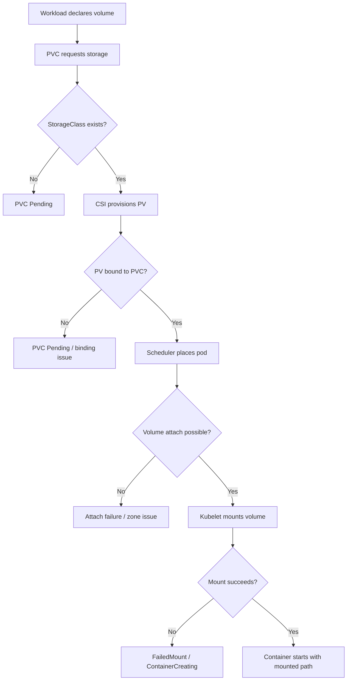
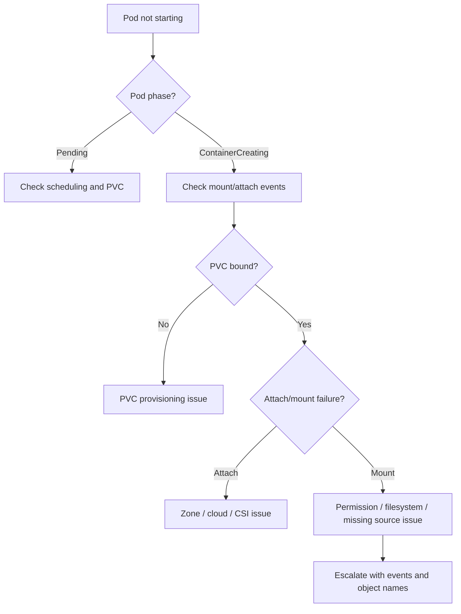
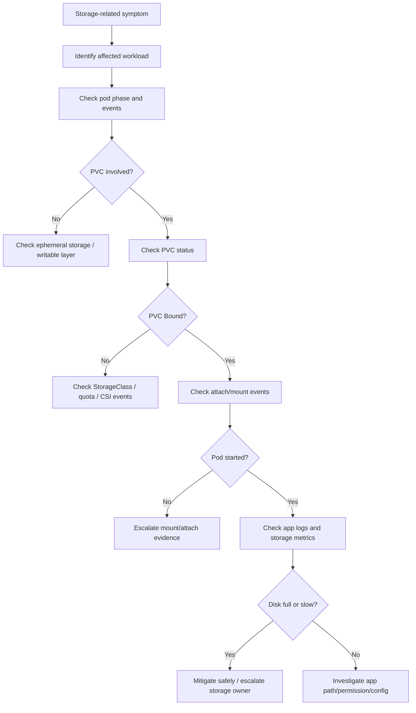

# Part 047 — Storage Operations

Most stateless Java/JAX-RS backend services should not depend on writable persistent disks for normal request processing.

But real enterprise systems still encounter storage through many paths:

- batch jobs writing temporary or persistent files;
- file import/export workflows;
- report generation;
- migration jobs;
- self-managed PostgreSQL, Kafka, RabbitMQ, Redis, or Camunda components;
- operator-managed stateful dependencies;
- log buffers or sidecar collectors;
- certificate or secret CSI mounts;
- shared volumes used by legacy integration flows;
- on-prem or hybrid deployments where managed cloud services are not always available.

Storage incidents are dangerous because they often look like application bugs:

- pod stuck in `ContainerCreating`;
- pod stuck in `Pending`;
- `FailedMount` events;
- app starts but cannot read/write files;
- database dependency becomes unavailable;
- Kafka/RabbitMQ/Redis stateful pods fail to restart;
- batch job silently fails halfway;
- disk fills up and pod is evicted;
- rollout hangs because a new pod cannot attach a volume;
- multi-AZ failover fails because volume attachment is zone-bound.

A senior backend engineer does not need to administer the CSI driver or storage backend, but they must understand the storage control plane enough to know when the workload is blocked by a volume problem, when the manifest is wrong, and when escalation to platform/SRE/storage team is required.

---

## 1. Core Concept

Kubernetes storage separates storage intent from storage implementation.

The main objects are:

- `PersistentVolumeClaim` — what the workload asks for;
- `PersistentVolume` — the actual provisioned storage resource;
- `StorageClass` — how dynamic storage is provisioned;
- `CSI driver` — the integration between Kubernetes and the storage provider;
- `volumeMount` — where the container sees the storage;
- `accessModes` — how the volume may be mounted;
- `reclaimPolicy` — what happens to the volume after claim deletion.

The operational chain looks like this:



For backend engineers, the important question is not only "does the PVC exist?"

The better question is:

```text
Can this pod safely access the storage it needs, in the zone where it was scheduled, with the expected permissions, capacity, performance, and lifecycle behavior?
```

---

## 2. Backend Engineer Responsibility

Backend engineers should understand:

- whether their workload should use persistent storage at all;
- which pods mount which PVCs;
- whether the workload expects read/write or read-only access;
- whether the data is temporary, durable, replayable, or critical;
- whether the workload can tolerate pod rescheduling;
- whether storage is single-zone or multi-zone;
- whether files can grow without bound;
- whether application logs are written to stdout or disk;
- whether batch/file-processing jobs clean up intermediate files;
- whether disk full can corrupt business state;
- whether storage incidents affect quote/order/billing lifecycle processing.

Backend engineers should normally not independently:

- change StorageClass parameters;
- modify CSI driver components;
- delete PVs/PVCs in production;
- force detach volumes;
- change reclaim policy;
- resize critical volumes without approval;
- manually edit operator-managed volumes;
- repair storage backend infrastructure;
- run destructive filesystem commands against production data.

Those actions typically belong to platform/SRE/storage/database teams.

---

## 3. Platform/SRE Responsibility

Platform/SRE/storage teams usually own:

- CSI driver installation and upgrade;
- StorageClass design;
- dynamic provisioning policy;
- default StorageClass policy;
- volume encryption;
- backup integration;
- volume snapshot configuration;
- reclaim policy standard;
- zone-aware volume behavior;
- storage performance class;
- storage quota;
- mount option standards;
- storage monitoring;
- cloud disk or on-prem storage backend operations.

Backend teams own the workload contract:

- why storage is needed;
- how much storage is requested;
- what data is stored;
- what happens if the volume is unavailable;
- whether the workload has a safe retry/recovery path;
- whether business processing remains consistent after failure.

---

## 4. PersistentVolumeClaim Mental Model

A PVC is a request for storage.

Example:

```yaml
apiVersion: v1
kind: PersistentVolumeClaim
metadata:
  name: report-export-workdir
spec:
  accessModes:
    - ReadWriteOnce
  storageClassName: standard
  resources:
    requests:
      storage: 20Gi
```

Operationally, a PVC can be:

- `Pending` — not yet bound to a PV;
- `Bound` — storage has been provisioned and bound;
- `Lost` — bound PV is unavailable or missing.

Useful commands:

```bash
kubectl get pvc -n <namespace>
kubectl describe pvc <pvc-name> -n <namespace>
kubectl get pv
kubectl describe pv <pv-name>
```

Production-safe interpretation:

```text
PVC Pending means the application may be innocent.
The storage contract could not be satisfied.
```

Common reasons:

- StorageClass does not exist;
- no default StorageClass exists;
- quota exceeded;
- requested access mode unsupported;
- requested size invalid;
- CSI driver unavailable;
- dynamic provisioning failure;
- zone binding issue;
- cloud provider permission issue;
- storage backend capacity issue.

---

## 5. StorageClass Operations

`StorageClass` defines how storage is provisioned.

It may encode:

- provisioner/CSI driver;
- disk type;
- performance tier;
- encryption settings;
- reclaim policy;
- volume binding mode;
- expansion support;
- topology constraints;
- mount options.

Example investigation:

```bash
kubectl get storageclass
kubectl describe storageclass <storage-class-name>
```

Fields to understand:

```yaml
provisioner: ebs.csi.aws.com
reclaimPolicy: Delete
volumeBindingMode: WaitForFirstConsumer
allowVolumeExpansion: true
```

Important operational meaning:

| Field | Why it matters |
|---|---|
| `provisioner` | Determines which CSI driver provisions storage. |
| `reclaimPolicy` | Determines whether underlying storage survives claim deletion. |
| `volumeBindingMode` | Determines when volume is created and which zone it belongs to. |
| `allowVolumeExpansion` | Determines whether PVC can be resized. |
| topology settings | Determines zone/node compatibility. |

Backend engineers should not assume that all StorageClasses are equivalent.

A workload that is fine on `gp3` may behave badly on a slow network filesystem. A workload that needs multi-reader access may not work on a single-writer block volume. A workload that requires multi-zone availability may not be safe on a zone-bound disk.

---

## 6. Access Mode Operations

Common access modes:

- `ReadWriteOnce` — one node can mount the volume read-write;
- `ReadOnlyMany` — many nodes can mount read-only;
- `ReadWriteMany` — many nodes can mount read-write;
- `ReadWriteOncePod` — only one pod can mount read-write.

Backend operational implications:

| Access mode | Typical fit | Risk |
|---|---|---|
| `ReadWriteOnce` | single pod stateful workload | rescheduling and multi-attach issues |
| `ReadWriteMany` | shared file processing, legacy shared dirs | consistency and locking risk |
| `ReadOnlyMany` | shared static content/config | stale content risk |
| `ReadWriteOncePod` | strict single-writer workloads | rollout/HA constraints |

For Java backend services, shared writable filesystem state is often a smell unless the business process explicitly requires it.

Better alternatives may include:

- object storage;
- database state;
- event log;
- durable queue;
- managed file service;
- explicit job artifact store;
- idempotent retry with external checkpoint.

---

## 7. Volume Binding and Zone Awareness

Cloud block volumes are often zone-bound.

This matters because a pod may only run on nodes in the same zone as its volume.

A healthy-looking Deployment can become stuck if:

- the PVC is bound to zone A;
- node capacity exists only in zone B;
- pod anti-affinity prevents scheduling in zone A;
- node pool for that zone is unavailable;
- cluster autoscaler cannot provision matching nodes.

Common events:

```text
0/12 nodes are available: 4 node(s) had volume node affinity conflict
```

or:

```text
Multi-Attach error for volume ... Volume is already used by pod(s) ...
```

Safe investigation:

```bash
kubectl describe pod <pod> -n <namespace>
kubectl describe pvc <pvc> -n <namespace>
kubectl describe pv <pv>
kubectl get nodes -L topology.kubernetes.io/zone
```

Escalate when:

- volume attachment is stuck;
- zone capacity is unavailable;
- multi-attach error persists;
- platform topology policy is unclear;
- the workload requires HA but storage is single-zone.

---

## 8. Mount Failure Debugging

A pod stuck in `ContainerCreating` often indicates a mount problem.

Look for events:

```bash
kubectl describe pod <pod> -n <namespace>
```

Common messages:

```text
Warning  FailedMount  MountVolume.SetUp failed
Warning  FailedAttachVolume  AttachVolume.Attach failed
Warning  FailedMount  timed out waiting for the condition
Warning  FailedMount  secret not found
Warning  FailedMount  configmap not found
```

Do not jump directly to application logs.

If the container has not started, application logs may not exist.

Debugging flow:



Backend-specific causes:

- app expects a path that is not mounted;
- app writes to read-only path;
- container runs non-root but volume ownership does not match;
- init container did not initialize directory;
- Secret/ConfigMap CSI source is missing;
- mounted certificate path differs from Java config;
- file-processing directory is too small.

---

## 9. Disk Full and Volume Capacity

Persistent volume full incidents can cause:

- application write failures;
- corrupted intermediate files;
- batch job partial completion;
- database outage;
- Kafka broker failure;
- RabbitMQ node alarm;
- Redis persistence failure;
- Camunda history/database pressure if dependency is local/self-managed;
- pod restart loops;
- readiness failure.

Application symptoms may be generic:

```text
No space left on device
java.io.IOException: No space left on device
org.postgresql.util.PSQLException: could not write to file
```

Safe checks:

```bash
kubectl describe pvc <pvc> -n <namespace>
kubectl top pod <pod> -n <namespace> --containers
kubectl logs <pod> -n <namespace> --previous
```

If allowed and safe:

```bash
kubectl exec -n <namespace> <pod> -- df -h
kubectl exec -n <namespace> <pod> -- du -sh /path/*
```

Be careful with `exec` in production. It can expose sensitive data, trigger heavy filesystem scans, or affect a hot pod.

Safer alternatives:

- use storage metrics dashboard;
- use application-level disk usage metrics;
- inspect PVC metrics;
- use node/storage exporter metrics;
- ask platform/SRE to inspect volume backend.

---

## 10. Volume Expansion Operations

Some StorageClasses support PVC expansion.

Check:

```bash
kubectl get storageclass <name> -o yaml
```

Look for:

```yaml
allowVolumeExpansion: true
```

Expansion is not just changing a number.

Operational questions:

- Is expansion online or does pod need restart?
- Does the filesystem expand automatically?
- Is the underlying storage quota available?
- Does the app need to detect new space?
- Is the increase temporary mitigation or long-term sizing correction?
- Is backup/snapshot required before expansion?
- Who approves cost increase?

Backend engineers may propose expansion as mitigation, but platform/storage owner usually executes or approves it.

Emergency rule:

```text
If data durability is involved, do not delete/recreate PVCs as a shortcut.
```

---

## 11. Reclaim Policy and Deletion Risk

`reclaimPolicy` controls what happens to the actual volume when the PVC is deleted.

Common values:

- `Delete` — underlying storage is deleted;
- `Retain` — underlying storage remains;
- `Recycle` — obsolete pattern, generally not used.

Operational danger:

```text
Deleting a PVC is not equivalent to deleting a pod.
```

A backend engineer should treat PVC deletion as a potentially destructive production action.

Before any PVC deletion or recreation, verify:

- data classification;
- backup existence;
- restore procedure;
- owner approval;
- operator behavior;
- reclaim policy;
- GitOps reconciliation behavior;
- whether a StatefulSet will recreate claims;
- whether the application can rebuild the data.

For stateful dependencies, deletion can mean data loss.

---

## 12. Storage Performance and Backend Latency

Storage issues are not only binary availability issues.

They may appear as latency:

- slow report generation;
- slow batch processing;
- slow database writes;
- Kafka broker under-replication;
- RabbitMQ disk alarms;
- Redis persistence stalls;
- Java thread pool saturation while waiting on file I/O;
- readiness timeout during startup due to slow mounted dependencies.

Signals to check:

- volume IOPS;
- throughput;
- queue depth;
- filesystem latency;
- pod read/write latency;
- application file I/O metrics;
- batch duration;
- dependency-specific disk metrics;
- node disk pressure;
- CSI errors.

Do not treat all storage classes as interchangeable.

For enterprise backend systems, storage class is part of the runtime contract.

---

## 13. Java/JAX-RS Impact

Most Java REST APIs should be horizontally scalable and stateless.

Storage coupling can violate that assumption.

Risk patterns:

- storing session-like state on local disk;
- writing upload files to container writable layer;
- writing large temp files without cleanup;
- assuming one pod handles all lifecycle steps;
- depending on local cache correctness;
- storing generated quote/order artifacts only inside pod filesystem;
- writing logs to disk instead of stdout;
- using disk as an implicit queue.

Safer patterns:

- externalize durable state to PostgreSQL or object storage;
- make file processing idempotent;
- use explicit artifact metadata;
- stream large payloads where possible;
- clean temp files deterministically;
- expose disk usage metrics if disk is part of the workload;
- use readiness failure only when storage loss makes the pod unable to serve correctly.

For JAX-RS endpoints that process uploads/downloads, verify:

- request body size limit;
- ingress buffering behavior;
- temp directory location;
- file size limit;
- timeout chain;
- disk cleanup;
- failure response behavior;
- retry semantics from clients.

---

## 14. PostgreSQL/Kafka/RabbitMQ/Redis/Camunda Impact

Storage is critical for stateful dependencies.

Backend engineers should understand the risk but respect ownership boundaries.

### PostgreSQL

Storage incidents can cause:

- write failures;
- WAL growth;
- slow checkpoints;
- crash recovery delays;
- backup failure;
- replica lag.

Escalate to database/platform owner with symptoms and timeline.

### Kafka

Storage incidents can cause:

- broker disk full;
- partition under-replication;
- leader election instability;
- retention misbehavior;
- producer errors;
- consumer lag.

### RabbitMQ

Storage incidents can cause:

- disk alarms;
- publisher blocking;
- message persistence failure;
- queue growth instability;
- node restart risk.

### Redis

Storage incidents matter if persistence is enabled:

- RDB/AOF failure;
- restart recovery issue;
- latency spikes during fsync;
- disk full.

### Camunda

Camunda itself is typically backed by database state. Storage incidents usually manifest through its database, logs, exporter, or self-managed runtime components.

Operational rule:

```text
If the dependency is stateful, storage failure is rarely a pure application issue.
Treat it as a dependency/platform incident until proven otherwise.
```

---

## 15. EKS, AKS, On-Prem, and Hybrid Differences

### EKS awareness

Storage may involve:

- Amazon EBS CSI Driver;
- EFS CSI Driver;
- EBS volume zone binding;
- EBS volume expansion;
- EBS snapshot;
- IAM permissions for CSI driver;
- encrypted volumes and KMS policy.

Common issues:

- volume node affinity conflict;
- CSI driver IAM permission denied;
- EBS attach limit per node;
- subnet/AZ placement mismatch;
- KMS access denied.

### AKS awareness

Storage may involve:

- Azure Disk CSI;
- Azure Files CSI;
- managed disk zone behavior;
- storage account/network restriction;
- Azure Key Vault CSI for secrets;
- managed identity permissions.

Common issues:

- disk attach limit;
- node pool zone mismatch;
- storage account firewall;
- managed identity access denied;
- private endpoint DNS issue.

### On-prem/hybrid awareness

Storage may involve:

- SAN/NAS;
- vSphere CSI;
- Ceph/Rook;
- NFS;
- corporate backup tools;
- internal storage quotas;
- firewall/proxy boundaries;
- air-gapped constraints.

Common issues:

- stale NFS mount;
- permission mismatch;
- storage backend outage;
- certificate trust issue;
- slow network storage;
- backup lock contention.

---

## 16. Failure Modes

Common storage failure modes:

| Failure mode | Typical symptom | First signal |
|---|---|---|
| PVC Pending | pod cannot schedule/start | PVC events |
| PV not bound | claim unresolved | PVC/PV status |
| FailedMount | pod stuck ContainerCreating | pod events |
| FailedAttachVolume | volume cannot attach to node | pod/node events |
| Multi-Attach error | pod cannot move/start | attach event |
| Volume node affinity conflict | scheduling failure | FailedScheduling event |
| Disk full | app write error / dependency failure | app logs + volume metrics |
| Slow disk | latency spike | storage metrics + traces |
| Permission mismatch | app cannot read/write path | app logs |
| Read-only filesystem issue | write failure | app logs |
| CSI outage | multiple mounts/provisions fail | platform alerts |
| Reclaim mistake | data loss risk | PV/PVC history |

---

## 17. Production-Safe Debugging Flow

Use this order:



Safe commands:

```bash
kubectl get pod -n <namespace> -o wide
kubectl describe pod <pod> -n <namespace>
kubectl get pvc -n <namespace>
kubectl describe pvc <pvc> -n <namespace>
kubectl get storageclass
kubectl get events -n <namespace> --sort-by='.lastTimestamp'
```

Use `exec` only when allowed:

```bash
kubectl exec -n <namespace> <pod> -- df -h
kubectl exec -n <namespace> <pod> -- ls -la /expected/path
```

Avoid unsafe commands:

```bash
rm -rf /data/*
mkfs.*
fsck
chown -R /large/path
find / -type f
kubectl delete pvc ...
```

unless explicitly approved and owned by the right team.

---

## 18. Mitigation Patterns

Possible mitigations:

- scale down non-critical writer workload;
- stop batch job producing excessive files;
- disable upload path temporarily;
- increase PVC size with approval;
- clean known safe temp files;
- restart pod only if mount/path state is transient and data-safe;
- rollback a deployment that changed mount path or file behavior;
- restore from backup if data is corrupted;
- move workload to correct zone/node pool through platform action;
- open platform/storage incident for CSI/backend failure.

Do not use restart as the default solution.

A restart may:

- hide evidence;
- trigger replay;
- cause duplicate processing;
- detach/attach volumes;
- worsen dependency load;
- corrupt partially written files;
- trigger Kafka/RabbitMQ consumer rebalance.

---

## 19. PR Review Checklist

When reviewing Kubernetes storage changes, check:

- Is persistent storage truly needed?
- Is the data durable, temporary, replayable, or business-critical?
- Is PVC size justified?
- Is StorageClass appropriate?
- Is access mode correct?
- Is the volume zone behavior understood?
- Is reclaim policy safe?
- Is expansion supported?
- Is backup/restore required?
- Is the mount path correct?
- Does the container user have permission?
- Is read-only mount used where possible?
- Is temp file cleanup implemented?
- Is disk usage observable?
- Is there an alert for disk fullness?
- Is the runbook linked?
- Is the storage owned by app, platform, or database team?

---

## 20. Internal Verification Checklist

Verify internally:

- approved StorageClasses;
- default StorageClass;
- CSI drivers in use;
- EKS/AKS/on-prem storage provider;
- volume encryption standard;
- backup/snapshot policy;
- restore test process;
- reclaim policy standard;
- PVC expansion process;
- storage quota per namespace;
- read/write access mode support;
- multi-zone behavior;
- node volume attach limits;
- stateful workload ownership;
- storage dashboards;
- disk usage alerts;
- CSI driver alerts;
- runbooks for PVC Pending, FailedMount, disk full, and attach failure;
- approval process for destructive storage actions.

Use this label in notes when details depend on your actual environment:

```text
Internal verification checklist: confirm with platform/SRE/storage/database team before assuming storage behavior.
```

---

## 21. Key Takeaways

- Storage is part of the workload runtime contract, not an implementation detail.
- PVC `Bound` does not mean the app can safely use the storage.
- Pod `ContainerCreating` with `FailedMount` is often a storage/platform issue, not an app bug.
- Stateful dependency storage failure has business and data integrity implications.
- Do not delete PVCs casually in production.
- For Java/JAX-RS backend services, persistent writable disk should be intentional and observable.
- Escalate storage backend, CSI, zone, attach, and reclaim issues with precise Kubernetes evidence.
