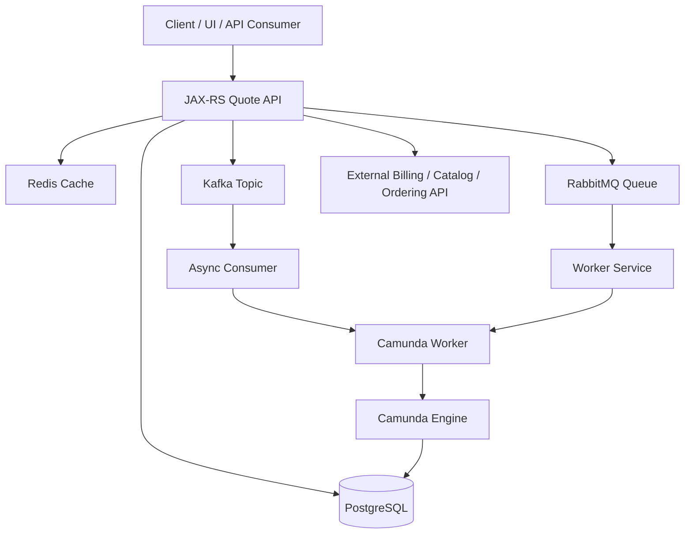
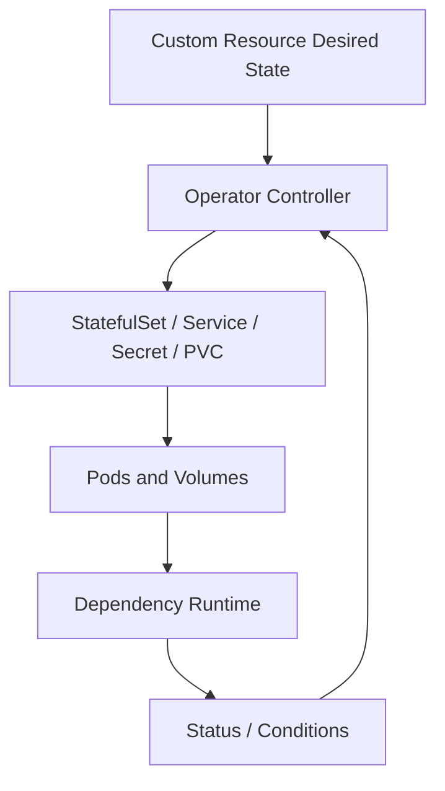
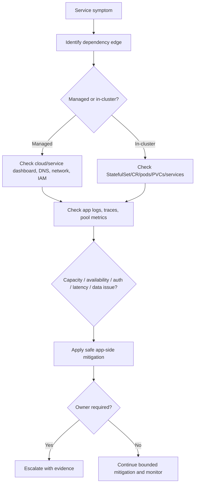

# Part 048 — Stateful Dependency Operations Awareness

Backend engineers often own application code, not the databases and brokers that application code depends on.

But in production, application reliability is inseparable from dependency reliability.

A Java/JAX-RS quote/order service may look stateless from the Kubernetes side, but its real runtime state is distributed across:

- PostgreSQL;
- Kafka;
- RabbitMQ;
- Redis;
- Camunda;
- cloud services;
- external APIs;
- workflow engines;
- caches;
- search/indexing systems;
- object/file storage.

When those dependencies run in Kubernetes, they often use StatefulSets, operators, persistent volumes, quorum protocols, broker clusters, leader election, replication, backup, restore, and strict ordering rules.

A senior backend engineer does not need to become the database admin, Kafka admin, or cluster operator. But they must be able to reason about dependency failure modes, understand blast radius, avoid unsafe actions, and escalate with evidence.

This part is not a tutorial for running PostgreSQL or Kafka on Kubernetes.

It is an operational awareness guide for backend service owners.

---

## 1. Core Concept

A stateful dependency is any runtime component where correctness depends on durable state, ordering, identity, replication, quorum, or recovery.

In Kubernetes, such dependencies may be represented by:

- `StatefulSet`;
- `PersistentVolumeClaim`;
- headless `Service`;
- operator-managed custom resources;
- PodDisruptionBudget;
- topology spread constraints;
- anti-affinity rules;
- backup/snapshot resources;
- secrets and certificates;
- cluster membership metadata.

The central operational rule:

```text
A stateful dependency is not just a pod that can be restarted.
It is a consistency boundary.
```

For backend engineers, the goal is to understand:

- what dependency is affected;
- which application flows depend on it;
- whether the failure is read, write, latency, connection, consistency, or capacity related;
- whether retry helps or makes it worse;
- whether failover is automatic;
- who owns mitigation;
- what evidence is needed for escalation.

---

## 2. Backend Engineer Responsibility

Backend engineers should know:

- which services depend on which stateful systems;
- connection strings and logical endpoints, without exposing secrets;
- whether dependencies are managed services or self-managed in Kubernetes;
- dependency owner and escalation path;
- read/write paths affected by each dependency;
- timeout and retry behavior;
- connection pool size per pod;
- circuit breaker behavior;
- backpressure behavior;
- idempotency and duplicate processing risk;
- business impact of dependency unavailability;
- SLO or criticality of dependency-backed flows.

Backend engineers should usually not:

- delete dependency pods manually;
- delete PVCs;
- force leader election;
- scale brokers/databases without owner approval;
- change replication or quorum config;
- run repair commands;
- modify operator custom resources casually;
- restore backups independently;
- bypass network/security policy;
- disable persistence to recover quickly.

Those actions can turn an outage into data loss.

---

## 3. Platform/SRE/DBA Responsibility

Depending on organization, ownership may be split.

Platform/SRE may own:

- Kubernetes runtime;
- operator installation;
- node pools;
- storage classes;
- backup platform;
- monitoring and alerting;
- cluster upgrades;
- network and ingress/egress;
- secret and certificate integration.

DBA/data platform may own:

- PostgreSQL configuration;
- backup/restore;
- replication;
- query performance;
- schema migration governance;
- connection limits;
- maintenance windows;
- data recovery.

Messaging/platform team may own:

- Kafka brokers;
- RabbitMQ clusters;
- topic/queue policies;
- retention;
- partitioning;
- DLQ infrastructure;
- broker capacity;
- consumer lag tooling.

Workflow/platform team may own:

- Camunda cluster/runtime;
- process engine configuration;
- worker integration standards;
- incident handling;
- history retention;
- exporter/operate tooling;
- process observability.

Backend service owners must know the boundary instead of guessing.

---

## 4. Dependency Topology Mental Model

A backend service rarely depends on a single system.

Example quote/order flow:



A dependency incident can manifest as:

- API latency;
- HTTP 5xx;
- connection pool exhaustion;
- consumer lag;
- queue depth growth;
- workflow incident;
- stale cache;
- duplicate processing;
- partial order creation;
- inconsistent quote state;
- delayed billing integration.

Operational debugging must map symptoms to dependency edges.

---

## 5. Managed Service vs Self-Managed in Kubernetes

The operational model changes dramatically depending on where the dependency runs.

| Model | Backend engineer concern | Platform concern |
|---|---|---|
| Managed cloud service | endpoint, credentials, limits, latency, IAM, private endpoint | service provisioning, network, IAM, monitoring |
| Self-managed in Kubernetes | pod health, StatefulSet, PVC, quorum, operator, backup | cluster/runtime/storage/operator ownership |
| On-prem service | DNS, firewall, proxy, CA, latency, support boundary | network/storage/platform/vendor ownership |
| Hybrid dependency | private routing, DNS split-horizon, identity, failover | connectivity, routing, compliance, DR |

Do not apply the same runbook to all models.

For example:

```text
Restarting a stateless Java pod is often low risk.
Restarting a Kafka broker, RabbitMQ node, or PostgreSQL primary is not low risk.
```

---

## 6. StatefulSet Awareness

When a dependency runs in Kubernetes, it often uses StatefulSet.

StatefulSet provides:

- stable pod identity;
- stable network identity;
- ordered startup;
- ordered termination;
- stable PVC association;
- ordinal-based membership.

Example pod names:

```text
postgres-0
kafka-0
kafka-1
kafka-2
rabbitmq-0
redis-0
```

Important operational implication:

```text
Deleting kafka-1 is not equivalent to deleting a stateless API pod.
```

The pod identity may matter to:

- replication membership;
- broker ID;
- leader election;
- volume binding;
- cluster metadata;
- quorum health;
- client routing;
- operator reconciliation.

Safe investigation:

```bash
kubectl get statefulset -n <namespace>
kubectl describe statefulset <name> -n <namespace>
kubectl get pods -n <namespace> -l app=<dependency> -o wide
kubectl get pvc -n <namespace>
kubectl get events -n <namespace> --sort-by='.lastTimestamp'
```

Avoid direct mutation unless explicitly owned.

---

## 7. Operator-Managed Dependencies

Many production dependencies are managed by Kubernetes operators.

Examples:

- PostgreSQL operators;
- Strimzi for Kafka;
- RabbitMQ Cluster Operator;
- Redis operators;
- Camunda platform operators;
- cert-manager;
- External Secrets Operator;
- CSI drivers.

Operators introduce another reconciliation layer:



Operationally, this means:

- changing the generated StatefulSet directly may be overwritten;
- the source of truth may be a custom resource;
- status conditions may exist on the custom resource;
- backup/restore may be custom-resource-driven;
- scaling may require operator-specific fields;
- upgrade may follow operator-specific rules.

Backend engineers must verify the operator owner and runbook.

Safe commands:

```bash
kubectl get crd | grep -i <technology>
kubectl get <custom-resource-kind> -n <namespace>
kubectl describe <custom-resource-kind> <name> -n <namespace>
```

Use only if you know the CRD names and have read permissions.

---

## 8. PostgreSQL Operations Awareness

For backend engineers, PostgreSQL dependency issues usually appear as:

- connection refused;
- connection timeout;
- authentication failure;
- SSL/TLS failure;
- too many connections;
- slow queries;
- lock waits;
- deadlocks;
- replica lag;
- disk full;
- failed migration;
- transaction timeout;
- connection pool exhaustion.

Application signals:

```text
org.postgresql.util.PSQLException
HikariPool connection timeout
deadlock detected
could not serialize access
remaining connection slots are reserved
SSLHandshakeException
```

Kubernetes-aware checks:

- Is PostgreSQL managed or in-cluster?
- If in-cluster, are StatefulSet pods ready?
- Are PVCs bound and healthy?
- Is the service endpoint populated?
- Are NetworkPolicies allowing access?
- Is DNS resolving correctly?
- Did a rollout increase connection count?
- Did HPA scale app pods and overload max connections?
- Did migration run recently?

Safe backend actions:

- reduce app concurrency if causing overload;
- pause non-critical batch writers;
- rollback app release if query/migration caused issue;
- coordinate with DBA/platform for DB-side mitigation;
- capture query/error evidence without exposing sensitive data.

Unsafe actions:

- deleting DB pods;
- deleting PVCs;
- running manual schema repair without approval;
- increasing app replicas when DB is already saturated;
- increasing connection pool blindly.

---

## 9. Kafka Operations Awareness

Kafka dependency issues usually appear as:

- producer send timeout;
- broker unavailable;
- metadata fetch failure;
- consumer lag growth;
- rebalance storm;
- under-replicated partitions;
- leader unavailable;
- authorization failure;
- TLS/SASL failure;
- disk pressure on broker;
- partition count/capacity mismatch.

Application signals:

```text
TimeoutException: Topic not present in metadata
NotLeaderOrFollowerException
CommitFailedException
RebalanceInProgressException
SaslAuthenticationException
SSLHandshakeException
```

Kubernetes-aware checks:

- Is Kafka managed or in-cluster?
- Are broker pods ready?
- Are broker PVCs healthy?
- Is there broker disk pressure?
- Are services/headless services correct?
- Is DNS resolving broker names?
- Did a deployment restart many consumers at once?
- Did replica count exceed useful partition parallelism?
- Is NetworkPolicy blocking broker ports?
- Did cert/secret rotation break clients?

Safe backend actions:

- pause rollout causing rebalance storm;
- reduce consumer replicas if thrashing;
- tune graceful shutdown;
- reduce producer rate if downstream broker is degraded;
- inspect lag and error metrics;
- coordinate with Kafka/platform owner.

Unsafe actions:

- deleting broker pods randomly;
- changing retention during incident without owner;
- changing partition count casually;
- resetting offsets without business approval;
- scaling consumers beyond partition/dependency capacity.

---

## 10. RabbitMQ Operations Awareness

RabbitMQ dependency issues usually appear as:

- queue depth growth;
- unacked messages growth;
- redelivery storm;
- consumer disconnects;
- publisher confirms timeout;
- channel closed;
- precondition failed;
- disk alarm;
- memory alarm;
- TLS/auth failure;
- cluster partition.

Application signals:

```text
AlreadyClosedException
ShutdownSignalException
PRECONDITION_FAILED
ACCESS_REFUSED
connection reset
publisher confirm timeout
```

Kubernetes-aware checks:

- Is RabbitMQ managed or in-cluster?
- Are RabbitMQ pods ready?
- Are PVCs healthy?
- Are queues mirrored/quorum/classic?
- Are disk/memory alarms active?
- Is the management UI/API available?
- Did consumer pods restart and cause redelivery?
- Is prefetch too high?
- Is the workload acking too late?
- Did NetworkPolicy block broker access?

Safe backend actions:

- stop broken consumers that are nacking/requeueing endlessly;
- reduce concurrency if downstream is overloaded;
- inspect DLQ and redelivery counts;
- pause rollout if shutdown behavior is unsafe;
- coordinate with messaging/platform owner.

Unsafe actions:

- purging queues without business approval;
- deleting RabbitMQ PVCs;
- deleting broker pods during partition without owner;
- changing queue type/policy during incident;
- increasing consumers blindly when downstream is slow.

---

## 11. Redis Operations Awareness

Redis may be used as:

- cache;
- session store;
- distributed lock store;
- rate limit backend;
- transient workflow state;
- Redis Streams broker;
- idempotency key store.

The operational risk depends on usage.

If Redis is only cache, failure may degrade performance.

If Redis holds locks, idempotency keys, rate limits, or stream pending state, failure can affect correctness.

Common symptoms:

- connection timeout;
- MOVED/ASK cluster redirection issue;
- maxmemory eviction;
- stale cache;
- lock not released;
- duplicate processing;
- stream pending entries growing;
- TLS/auth failure;
- persistence failure.

Application signals:

```text
RedisConnectionFailureException
JedisConnectionException
Read timed out
NOAUTH Authentication required
OOM command not allowed
MOVED
```

Kubernetes-aware checks:

- managed or in-cluster?
- standalone, Sentinel, or cluster mode?
- PVC/persistence enabled?
- memory limit and maxmemory policy?
- connection pool size per pod?
- network policy and DNS?
- secret rotation?
- failover behavior?

Safe backend actions:

- bypass cache if designed;
- reduce cache stampede risk;
- disable non-critical cache-heavy flow if needed;
- reduce app concurrency if Redis is saturated;
- coordinate with platform owner for failover/restart.

Unsafe actions:

- flushing Redis in production;
- deleting Redis PVCs;
- changing eviction policy without review;
- treating Redis lock loss as harmless;
- restarting Redis without understanding persistence/failover.

---

## 12. Camunda Operations Awareness

Camunda-related systems can fail through:

- process engine unavailability;
- database issues;
- job acquisition issues;
- worker connectivity issues;
- incident spikes;
- external task/job timeout;
- worker concurrency overload;
- message correlation failure;
- history/exporter pressure;
- version/deployment mismatch.

For Kubernetes backend engineers, distinguish:

- Camunda platform/runtime health;
- worker service health;
- business process model issue;
- dependency issue behind a worker;
- database or broker issue;
- deployment/version compatibility issue.

Common symptoms:

- jobs not being picked up;
- activated jobs timing out;
- incidents increasing;
- process instances stuck;
- duplicate worker execution;
- correlation failures;
- API calls to Camunda timing out.

Kubernetes-aware checks:

- Are worker pods healthy?
- Are Camunda runtime pods healthy if in-cluster?
- Is worker concurrency too high?
- Did a rollout restart workers mid-job?
- Is graceful shutdown implemented?
- Are job timeout and pod termination grace aligned?
- Is the Camunda DB healthy?
- Are incidents tied to one worker version?

Safe backend actions:

- pause faulty worker rollout;
- reduce worker concurrency;
- rollback worker version if incidents correlate;
- inspect process incident distribution;
- coordinate with workflow/platform owner.

Unsafe actions:

- manually modifying process state without approval;
- mass retrying incidents without root-cause analysis;
- deleting worker pods to clear symptoms;
- changing job timeout blindly;
- deploying incompatible worker/model versions.

---

## 13. Backup, Restore, and Recovery Awareness

For stateful dependencies, backup and restore are not optional documentation.

They define recoverability.

Backend engineers should verify:

- what is backed up;
- how often;
- where backups are stored;
- whether restore is tested;
- expected RPO;
- expected RTO;
- who can trigger restore;
- whether restore is full, point-in-time, or snapshot-based;
- how application consistency is validated after restore;
- whether dependent services need replay/reconciliation.

Important distinction:

```text
Backup existence does not prove restore capability.
Restore testing proves restore capability.
```

For quote/order systems, recovery may need:

- database restore;
- event replay;
- queue reconciliation;
- workflow incident retry;
- cache rebuild;
- external system reconciliation;
- audit trail validation.

---

## 14. Quorum and Replication Awareness

Many stateful systems require quorum or replication health.

Examples:

- Kafka replication factor and ISR;
- RabbitMQ quorum queues;
- PostgreSQL primary/replica topology;
- Redis Sentinel/cluster;
- etcd-like systems;
- operator control planes.

Backend engineers do not need to administer quorum, but must understand the consequence:

```text
Losing one pod may be fine.
Losing the wrong combination of pods, zones, or volumes may stop writes or risk data loss.
```

Signals:

- under-replicated partitions;
- quorum queue unavailable;
- replica lag;
- primary unavailable;
- failover in progress;
- split-brain protection;
- degraded cluster condition;
- PDB blocking drain;
- topology imbalance.

Escalate with:

- affected dependency;
- business flows affected;
- error rates;
- lag/backlog;
- recent deployment or node event;
- pod/zone distribution;
- dependency dashboard screenshot/reference;
- logs/traces from clients.

---

## 15. Timeout, Retry, and Backpressure Around Dependencies

Dependency failure becomes worse when application behavior is unsafe.

Bad patterns:

- infinite retries;
- synchronized retries from many pods;
- no timeout;
- timeout longer than ingress/client timeout;
- connection pool larger than dependency capacity;
- consumer retries without DLQ;
- retrying non-idempotent operations;
- no circuit breaker;
- no backpressure;
- scaling consumers while downstream is failing.

Safer patterns:

- bounded timeout;
- bounded retry with jitter;
- circuit breaker;
- bulkhead per dependency;
- idempotency key;
- DLQ for poison messages;
- backpressure when dependency is degraded;
- graceful degradation where business allows;
- clear error classification.

Operational rule:

```text
During dependency degradation, the backend service must reduce pressure, not amplify it.
```

---

## 16. Incident Triage Flow for Stateful Dependencies

Use this triage sequence:



First questions:

- What user/business flow is affected?
- Which dependency is on the critical path?
- Is the failure read, write, latency, auth, network, or capacity?
- Did a recent app deployment change traffic, schema, credentials, or pool size?
- Did a recent platform event affect node/storage/network?
- Is the dependency managed or in-cluster?
- Is there a known maintenance window?
- Is retry/backpressure helping or hurting?

---

## 17. Production-Safe Commands

General dependency checks:

```bash
kubectl get pods -n <namespace> -o wide
kubectl get svc -n <namespace>
kubectl get endpointslice -n <namespace>
kubectl get events -n <namespace> --sort-by='.lastTimestamp'
```

For in-cluster stateful workloads:

```bash
kubectl get statefulset -n <namespace>
kubectl describe statefulset <name> -n <namespace>
kubectl get pvc -n <namespace>
kubectl describe pvc <pvc> -n <namespace>
```

For operator-managed dependencies:

```bash
kubectl get crd | grep -i <dependency>
kubectl get <custom-resource-kind> -n <namespace>
kubectl describe <custom-resource-kind> <name> -n <namespace>
```

For app-side evidence:

```bash
kubectl logs <app-pod> -n <namespace> --since=30m
kubectl logs <app-pod> -n <namespace> --previous
kubectl describe deployment <app-deployment> -n <namespace>
```

Avoid commands that mutate state unless approved:

```bash
kubectl delete pod <dependency-pod>
kubectl scale statefulset <dependency> --replicas=...
kubectl delete pvc ...
kubectl patch <operator-cr> ...
```

---

## 18. Observability Signals

Backend service owner should track:

### App-side signals

- request rate;
- error rate;
- latency;
- dependency call latency;
- timeout count;
- retry count;
- circuit breaker state;
- connection pool usage;
- thread pool saturation;
- queue consumer lag;
- DLQ count;
- workflow incident count.

### Kubernetes-side signals

- dependency pod readiness;
- StatefulSet ready replicas;
- PVC status;
- pod restarts;
- node pressure;
- events;
- service endpoints;
- NetworkPolicy changes;
- secret/config rotations;
- rollout markers.

### Dependency-side signals

- PostgreSQL active connections, locks, replication lag, disk;
- Kafka broker health, ISR, lag, produce/fetch latency;
- RabbitMQ queue depth, unacked, redelivery, alarms;
- Redis memory, evictions, latency, hit rate, connected clients;
- Camunda incidents, job backlog, worker failures, DB health.

---

## 19. PR Review Checklist

When a change affects stateful dependencies, review:

- Does it add a new dependency?
- Does it change connection endpoint?
- Does it change credentials or identity?
- Does it change connection pool size?
- Does it change timeout/retry behavior?
- Does it change consumer concurrency?
- Does it change Kafka topic/partition assumptions?
- Does it change RabbitMQ queue/prefetch/DLQ behavior?
- Does it change Redis usage from cache to correctness-critical state?
- Does it change Camunda worker concurrency or job timeout?
- Does it introduce a migration?
- Does it require ordering between app and dependency rollout?
- Does it require backup/restore validation?
- Does it affect RPO/RTO?
- Does it have a rollback path?
- Does observability cover the new dependency behavior?

---

## 20. Internal Verification Checklist

Verify internally:

- which dependencies are managed services;
- which dependencies run inside Kubernetes;
- dependency owners;
- platform/SRE/database/messaging/workflow escalation paths;
- StatefulSet namespaces;
- operator CRDs and owners;
- backup schedule;
- restore test evidence;
- RPO/RTO per dependency;
- dependency dashboards;
- alert ownership;
- runbooks for PostgreSQL, Kafka, RabbitMQ, Redis, Camunda;
- connection limits;
- pool sizing standards;
- Kafka topic ownership and partition counts;
- RabbitMQ queue ownership and DLQ policy;
- Redis usage classification;
- Camunda incident process;
- DR process;
- maintenance windows;
- change approval process for dependency-impacting changes.

Use this label when something is environment-specific:

```text
Internal verification checklist: confirm dependency ownership, topology, runbook, and recovery process with the relevant CSG/team owners.
```

---

## 21. Key Takeaways

- Stateful dependencies are consistency boundaries, not just pods.
- Backend engineers must understand dependency impact even when they do not own the dependency platform.
- Managed service and in-cluster dependency runbooks are different.
- StatefulSet identity, PVCs, operators, backup, restore, and quorum matter during incidents.
- Do not restart, delete, scale, or repair stateful systems casually.
- App-side retry, timeout, pool, and concurrency behavior can amplify dependency incidents.
- Good escalation includes business impact, app evidence, Kubernetes evidence, dependency signals, and recent changes.
