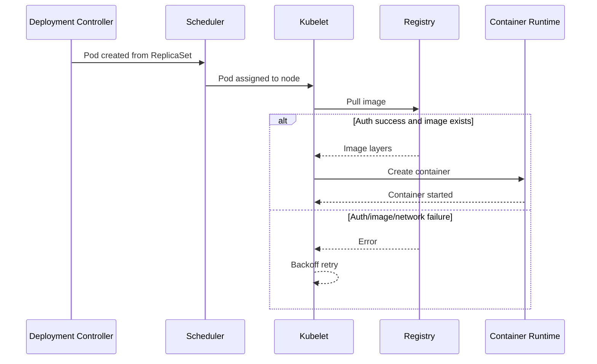
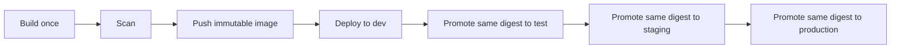
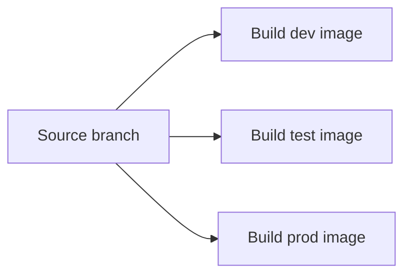
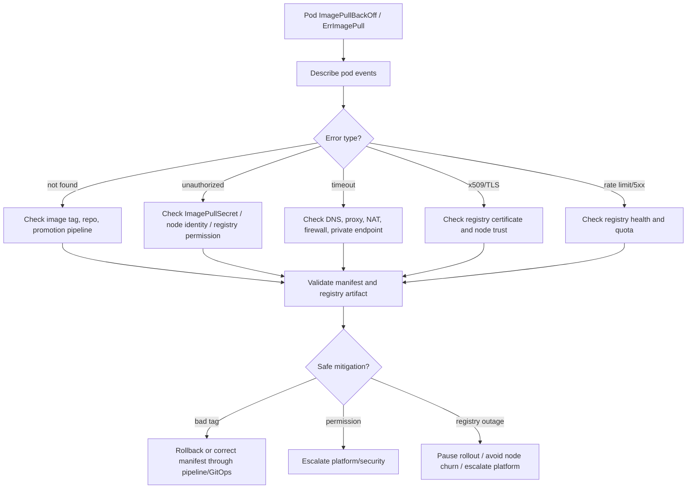

# Part 049 — Image and Registry Operations

## Tujuan

Di Kubernetes, container image adalah artifact executable yang menghubungkan source code, build pipeline, security scanning, image registry, deployment manifest, node runtime, dan workload produksi.

Untuk backend engineer, image operation bukan sekadar memastikan `docker build` berhasil. Di production, image yang salah bisa menyebabkan:

- pod tidak pernah start karena `ImagePullBackOff`
- service rollback ke versi lama tetapi image tag sudah berubah
- image yang belum dipromosikan masuk ke environment production
- pod berjalan dengan image berbeda dari yang diasumsikan tim
- vulnerability scan dilewati
- registry outage menyebabkan node replacement gagal menarik image
- image secret salah sehingga rollout stuck
- debugging incident sulit karena image tag tidak immutable

Part ini membahas cara membaca, mereview, dan men-debug image/registry flow secara production-safe.

---

## 1. Mental Model: Image sebagai Runtime Contract

Image adalah kontrak antara pipeline dan runtime Kubernetes.

```mermaid
flowchart LR
  A[Source Code] --> B[Build Pipeline]
  B --> C[Container Image]
  C --> D[Vulnerability Scan]
  D --> E[Registry: ECR / ACR / Internal]
  E --> F[Manifest / Helm / Kustomize]
  F --> G[GitOps / Deployment Pipeline]
  G --> H[Kubernetes Deployment]
  H --> I[Node Pulls Image]
  I --> J[Container Runtime]
  J --> K[Running Pod]
```



Operationally, jangan hanya bertanya:

> Image tag apa yang dipakai?

Pertanyaan yang lebih kuat:

> Image digest apa yang benar-benar dijalankan oleh pod, dari registry mana, dipromosikan melalui pipeline apa, discan kapan, dan apakah manifest production mereferensikan artifact yang immutable?

---

## 2. Image Tag vs Image Digest

### Image tag

Image tag adalah label manusiawi seperti:

```text
quote-service:1.42.0
quote-service:release-2026-07-12
quote-service:main-abc1234
quote-service:latest
```

Tag mudah dibaca tetapi bisa berbahaya jika mutable.

### Image digest

Digest adalah identitas content-addressed:

```text
quote-service@sha256:7f2c...abc
```

Digest mengikat deployment ke image content tertentu.

### Operational implication

| Referensi image | Risiko | Catatan |
|---|---:|---|
| `latest` | sangat tinggi | Hindari untuk production |
| branch tag | tinggi | Bisa berubah ketika branch rebuild |
| semantic version tag immutable | sedang | Aman jika registry enforce immutability |
| git SHA tag | rendah | Baik untuk traceability |
| digest pinning | paling rendah | Paling kuat untuk reproducibility |

### Backend engineer responsibility

Backend engineer tidak selalu menentukan registry policy, tetapi wajib bisa mereview:

- apakah image yang dideploy bisa dilacak ke commit
- apakah tag mutable digunakan di production
- apakah image tag sesuai release note
- apakah image digest yang running sesuai deployment intent
- apakah rollback masih bisa menarik image lama

---

## 3. Image Pull Lifecycle di Kubernetes

Ketika pod dibuat, kubelet di node akan melakukan pull image sesuai `image` dan `imagePullPolicy`.



Image pull bisa gagal sebelum aplikasi Java pernah start. Karena itu, `ImagePullBackOff` bukan bug JAX-RS, bukan issue readiness, dan bukan issue JVM.

---

## 4. `imagePullPolicy`

Umum ditemukan:

```yaml
containers:
  - name: quote-service
    image: registry.example.com/csg/quote-service:1.42.0
    imagePullPolicy: IfNotPresent
```

### Mode penting

| Policy | Makna | Operational concern |
|---|---|---|
| `Always` | selalu cek registry sebelum start | bergantung pada registry availability |
| `IfNotPresent` | pull jika belum ada di node | bisa menjalankan cached image jika tag mutable |
| `Never` | tidak pull image | jarang cocok untuk production umum |

### Review rule

Untuk production:

- immutable tag + `IfNotPresent` bisa diterima pada banyak setup
- mutable tag + `IfNotPresent` berbahaya
- `latest` + `IfNotPresent` sangat berbahaya
- digest pinning membuat perilaku lebih deterministik

Internal environment bisa berbeda; validasi dengan platform/SRE.

---

## 5. Common Failure: `ImagePullBackOff` dan `ErrImagePull`

### Arti singkat

- `ErrImagePull`: kubelet gagal menarik image pada percobaan pull.
- `ImagePullBackOff`: Kubernetes masuk retry backoff karena pull gagal berulang.

### Root cause umum

| Failure | Indikasi | Kemungkinan root cause |
|---|---|---|
| Image not found | `not found`, `manifest unknown` | tag salah, image belum dipush, repo salah |
| Unauthorized | `unauthorized`, `403`, `denied` | ImagePullSecret salah, IAM/ACR permission salah |
| TLS error | `x509`, certificate error | internal CA tidak dipercaya, registry cert issue |
| Network timeout | timeout saat pull | egress/proxy/firewall/DNS issue |
| Rate limit | rate limit message | external registry throttling |
| Registry unavailable | connection refused/5xx | registry outage |

---

## 6. Safe Investigation Commands

> Prinsip: mulai dari read-only evidence. Jangan patch image langsung di production kecuali prosedur internal mengizinkan.

### Lihat status pod

```bash
kubectl get pod -n <namespace> -l app=<app-name>
```

### Describe pod untuk event pull image

```bash
kubectl describe pod <pod-name> -n <namespace>
```

Cari bagian:

```text
Events:
  Pulling image ...
  Failed to pull image ...
  Error: ErrImagePull
  Back-off pulling image ...
```

### Lihat image yang direferensikan manifest

```bash
kubectl get deploy <deployment> -n <namespace> \
  -o jsonpath='{range .spec.template.spec.containers[*]}{.name}{"\t"}{.image}{"\n"}{end}'
```

### Lihat imageID yang benar-benar running

```bash
kubectl get pod <pod-name> -n <namespace> \
  -o jsonpath='{range .status.containerStatuses[*]}{.name}{"\t"}{.image}{"\t"}{.imageID}{"\n"}{end}'
```

### Lihat ImagePullSecret

```bash
kubectl get pod <pod-name> -n <namespace> \
  -o jsonpath='{.spec.imagePullSecrets}'
```

### Lihat ServiceAccount yang dipakai

```bash
kubectl get pod <pod-name> -n <namespace> \
  -o jsonpath='{.spec.serviceAccountName}'
```

---

## 7. ImagePullSecret Operations

Private registry biasanya membutuhkan credential pull.

```yaml
spec:
  imagePullSecrets:
    - name: registry-credentials
```

Atau image pull secret diikat melalui ServiceAccount:

```yaml
apiVersion: v1
kind: ServiceAccount
metadata:
  name: quote-service
imagePullSecrets:
  - name: registry-credentials
```

### Failure mode

- secret tidak ada di namespace yang sama
- secret expired
- secret salah type
- ServiceAccount tidak punya imagePullSecret
- GitOps overlay lupa menyertakan imagePullSecret di environment tertentu
- registry credential di-rotate tetapi pod/node masih gagal pull

### Production-safe validation

```bash
kubectl get secret <image-pull-secret> -n <namespace>
```

Jangan dump secret content sembarangan:

```bash
# Hindari di production kecuali benar-benar authorized:
kubectl get secret <secret> -o yaml
```

Secret inspection bisa membocorkan credential melalui terminal history, screen recording, logs, atau incident document.

---

## 8. ECR Operations Awareness

Pada EKS, image bisa berasal dari Amazon ECR.

### Hal yang perlu dipahami backend engineer

- repository ECR mana yang dipakai
- apakah tag immutable diaktifkan
- apakah vulnerability scanning aktif
- apakah node role atau credential provider punya permission pull
- apakah cross-account ECR dipakai
- apakah image promotion antar environment terjadi melalui copy/tagging
- apakah private subnet punya egress atau VPC endpoint ke ECR/S3

### Failure mode ECR

| Symptom | Kemungkinan penyebab |
|---|---|
| `403 Forbidden` | IAM permission kurang |
| timeout pull image | NAT/VPC endpoint/DNS issue |
| image not found | tag belum dipush/promote |
| works in dev, fails in prod | cross-account permission atau repo berbeda |
| intermittent pull failure | subnet/NAT/endpoint/registry rate issue |

### Internal verification checklist ECR

- ECR repository name
- tag immutability policy
- image scan policy
- lifecycle retention policy
- cross-account permission
- node IAM permission
- VPC endpoint usage
- promotion pipeline
- rollback image retention

---

## 9. ACR Operations Awareness

Pada AKS, image bisa berasal dari Azure Container Registry.

### Hal yang perlu dipahami backend engineer

- ACR mana yang dipakai
- apakah AKS attach ke ACR
- apakah workload menggunakan managed identity atau imagePullSecret
- apakah private endpoint ACR dipakai
- apakah private DNS zone benar
- apakah vulnerability scanning/policy gate aktif
- apakah image retention cukup untuk rollback

### Failure mode ACR

| Symptom | Kemungkinan penyebab |
|---|---|
| unauthorized | AKS belum attach ke ACR atau identity salah |
| DNS failure | private endpoint/private DNS zone salah |
| timeout | NSG/UDR/firewall/private endpoint issue |
| image not found | tag belum dipush/promote |
| only one node pool fails | node pool identity/network berbeda |

### Internal verification checklist ACR

- ACR name/region
- AKS to ACR integration
- private endpoint usage
- private DNS zone
- managed identity permission
- image retention
- scan policy
- promotion pipeline

---

## 10. Image Promotion Model

Production image sebaiknya bukan hasil rebuild sembarangan dari source branch.

Model yang lebih aman:



### Anti-pattern



Jika tiap environment rebuild sendiri, maka artifact production belum tentu sama dengan artifact yang sudah diuji.

### Backend review questions

- Apakah image production adalah digest yang sama dengan staging?
- Apakah image dipromosikan atau direbuild?
- Apakah release note mencantumkan image tag/digest?
- Apakah image lama masih tersedia untuk rollback?
- Apakah GitOps manifest menyimpan image version yang eksplisit?

---

## 11. Vulnerability Scan dan Policy Gate

Image production idealnya melewati scanning.

Yang perlu dicek:

- base image vulnerability
- OS package vulnerability
- application dependency vulnerability
- JDK/JRE version
- critical/high severity threshold
- exception process
- expiry dari exception
- provenance/SBOM jika tersedia

### Operational trade-off

| Pilihan | Dampak |
|---|---|
| Block semua high severity | security kuat, release bisa sering tertahan |
| Allow dengan exception | lebih realistis, perlu governance ketat |
| Scan hanya advisory | cepat, tetapi risk acceptance kabur |
| Tidak scan | tidak layak untuk enterprise production |

Backend engineer perlu tahu apakah failure pipeline adalah policy failure, bukan build failure.

---

## 12. Base Image Operations untuk Java

Untuk Java 17+ backend service, base image memengaruhi:

- JVM behavior
- timezone data
- CA certificates
- glibc vs musl compatibility
- debugging tools availability
- image size
- vulnerability exposure
- startup time

### Common production concern

| Concern | Dampak |
|---|---|
| CA bundle tidak lengkap | TLS ke PostgreSQL/Kafka/HTTP dependency gagal |
| timezone data missing | schedule/batch salah waktu |
| shell/debug tools missing | debugging lebih sulit, tetapi image lebih kecil |
| distroless image | security lebih kuat, operational debugging perlu mekanisme lain |
| JDK vs JRE/runtime image | ukuran dan attack surface berbeda |

### Review checklist Java image

- Java version sesuai runtime target
- base image approved
- CA cert strategy jelas
- timezone behavior jelas
- non-root user tersedia
- writable paths eksplisit
- heap/container awareness aktif
- startup command jelas

---

## 13. Registry Outage and Node Replacement Risk

Registry outage tidak selalu langsung menjatuhkan pod yang sudah running.

Tetapi outage registry bisa berdampak saat:

- rollout baru
- pod restart di node baru
- node drain/upgrade
- cluster autoscaling menambah node
- eviction membuat pod dijadwalkan ulang
- disaster recovery/rebuild

### Operational implication

Workload yang terlihat sehat bisa menjadi tidak recoverable jika image lama tidak bisa dipull.

### Checklist

- apakah image critical dipin dan retained?
- apakah registry highly available?
- apakah node image cache dianggap sebagai dependency tidak resmi?
- apakah rollback image masih ada?
- apakah production deployment tergantung registry publik?

---

## 14. Debugging Flow: Image Pull Failure



---

## 15. Mitigation Patterns

### Bad image tag

Safe options:

- rollback to previous known-good revision
- correct image reference through GitOps/pipeline
- pause rollout while validating artifact

Unsafe options:

- manually patch production deployment without traceability
- use `latest` as emergency fix
- rebuild image with same tag without audit trail

### Registry auth failure

Safe options:

- verify ImagePullSecret exists
- escalate credential/identity issue to platform/SRE/security
- validate whether issue is namespace-specific or cluster-wide

Unsafe options:

- copying registry secrets across namespaces without approval
- decoding and sharing credentials in chat/ticket

### Registry outage

Safe options:

- stop non-critical rollouts
- avoid unnecessary pod restarts/node drains
- keep currently running pods stable
- escalate to platform/vendor owner

Unsafe options:

- forcing rollout restart while registry unavailable
- scaling down healthy pods without ensuring pull availability

---

## 16. Observability Signals

Image/registry issues appear mostly in Kubernetes layer, not application logs.

Check:

- pod status: `ImagePullBackOff`, `ErrImagePull`
- pod events: failed pull reason
- deployment available replicas
- ReplicaSet new pods unavailable
- registry availability dashboard
- CI/CD artifact push status
- GitOps sync status
- cloud IAM/ACR/ECR audit logs
- node network/proxy/DNS errors

Application metrics may be absent because container never started.

---

## 17. PR Review Checklist

Saat mereview manifest/Helm/Kustomize change:

- [ ] Image tag eksplisit dan bukan `latest`
- [ ] Image bisa dilacak ke commit/release
- [ ] Digest tersedia atau tag immutable
- [ ] Image registry benar untuk environment
- [ ] ImagePullPolicy sesuai policy internal
- [ ] ImagePullSecret/ServiceAccount benar
- [ ] Security scan sudah lewat atau punya exception
- [ ] Base image approved
- [ ] Non-root/security context kompatibel dengan image
- [ ] Rollback image masih tersedia
- [ ] Promotion path jelas dari lower environment ke production
- [ ] GitOps rendered manifest sesuai intended image

---

## 18. Internal Verification Checklist

Gunakan checklist ini di environment internal:

- [ ] Registry yang digunakan: ECR, ACR, internal registry, atau lainnya
- [ ] Naming convention repository image
- [ ] Tagging convention image
- [ ] Digest pinning policy
- [ ] Tag immutability policy
- [ ] Image retention policy untuk rollback
- [ ] Vulnerability scan tool dan severity threshold
- [ ] Exception process untuk vulnerability
- [ ] Image promotion process antar environment
- [ ] Apakah image direbuild atau dipromosikan
- [ ] ImagePullSecret strategy
- [ ] ServiceAccount image pull strategy
- [ ] EKS ECR permission model jika memakai AWS
- [ ] AKS ACR permission model jika memakai Azure
- [ ] Private endpoint/VPC endpoint untuk registry
- [ ] Registry outage runbook
- [ ] Deployment manifest source of truth
- [ ] GitOps sync behavior untuk image update
- [ ] Siapa owner registry, pipeline, dan security scan

---

## 19. Backend Engineer Responsibility

Backend engineer bertanggung jawab untuk:

- memastikan image merepresentasikan release yang benar
- memastikan image version bisa dilacak ke commit dan release note
- mereview image reference di manifest/Helm/Kustomize
- memahami failure mode ImagePullBackOff
- tidak membocorkan registry secret saat debugging
- memastikan rollback image masih tersedia
- memastikan Java runtime image cocok dengan kebutuhan service
- mengeskalasi registry/IAM/network issue ke owner yang tepat

Backend engineer biasanya tidak bertanggung jawab penuh untuk:

- konfigurasi registry enterprise
- cloud IAM global
- node credential provider
- vulnerability scanner platform
- registry HA architecture
- network private endpoint global

Tetapi backend engineer harus bisa memberikan evidence yang jelas saat eskalasi.

---

## 20. Key Takeaways

- Image adalah production artifact, bukan detail build kecil.
- Tag mutable adalah sumber incident dan kebingungan rollback.
- `ImagePullBackOff` terjadi sebelum aplikasi start; cari evidence di events, bukan app logs.
- ECR/ACR failure sering melibatkan identity, network, DNS, private endpoint, atau promotion pipeline.
- Registry outage bisa memengaruhi recoverability walaupun pod yang existing masih running.
- Backend engineer harus bisa mereview image reference, promotion path, scan status, dan rollback safety.

