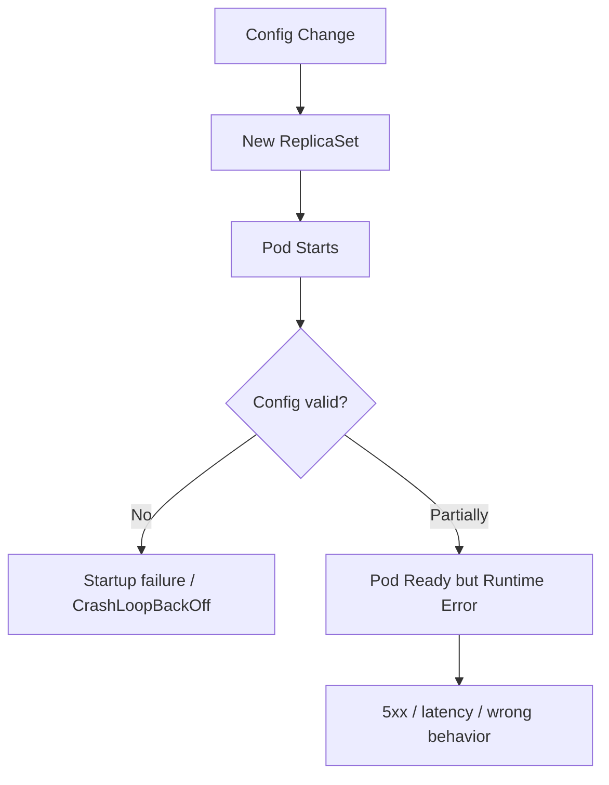
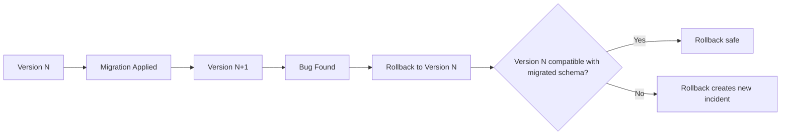
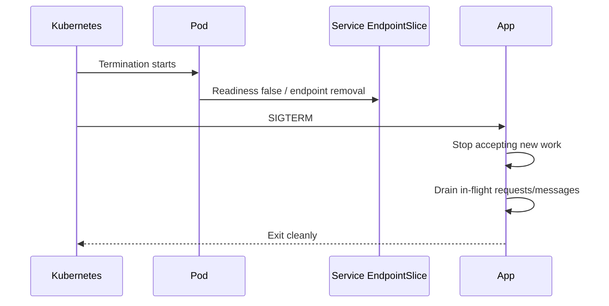
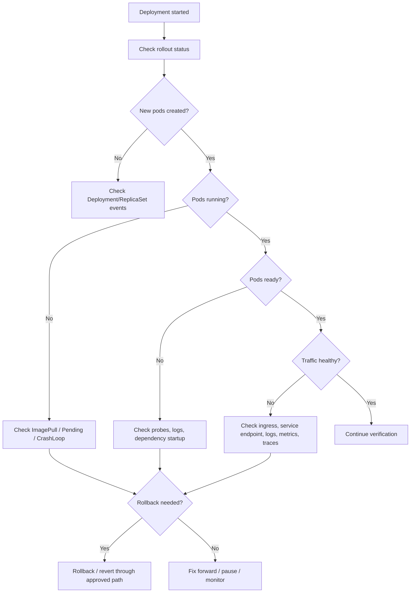

# Part 050 — Rollout and Rollback Operations

## Tujuan

Rollout adalah momen ketika desired state berubah dan Kubernetes mulai mengganti runtime production. Di sinilah banyak incident muncul: image salah, config salah, secret stale, readiness gagal, connection spike, schema migration tidak kompatibel, atau traffic masuk ke pod yang belum benar-benar siap.

Rollback bukan sekadar menjalankan command. Rollback adalah keputusan operasional yang harus mempertimbangkan:

- apakah versi sebelumnya masih kompatibel dengan database schema saat ini
- apakah event/message sudah diproses oleh versi baru
- apakah secret/config lama masih tersedia
- apakah image lama masih bisa ditarik dari registry
- apakah rollback menurunkan blast radius atau justru membuat data inconsistency

Part ini membahas rollout dan rollback dari sudut pandang backend service owner.

---

## 1. Rollout sebagai State Transition

Kubernetes Deployment melakukan perubahan melalui ReplicaSet baru.


Operationally, rollout bukan hanya `kubectl apply`. Rollout adalah sequence yang melewati scheduler, image pull, startup, readiness, service endpoint, traffic shifting, and old pod termination.

---

## 2. Rolling Update Basics

Contoh Deployment strategy:

```yaml
strategy:
  type: RollingUpdate
  rollingUpdate:
    maxSurge: 1
    maxUnavailable: 0
```

### `maxSurge`

Jumlah pod ekstra yang boleh dibuat di atas desired replica.

### `maxUnavailable`

Jumlah pod yang boleh unavailable selama rollout.

### Operational trade-off

| Setting | Benefit | Risk |
|---|---|---|
| `maxSurge: 1`, `maxUnavailable: 0` | availability lebih aman | butuh extra capacity |
| `maxSurge: 25%`, `maxUnavailable: 25%` | rollout lebih cepat | bisa mengurangi capacity saat rollout |
| `maxUnavailable: 1` pada replica kecil | simple | bisa outage jika hanya 1-2 replica |
| terlalu besar `maxSurge` | rollout cepat | connection spike ke DB/broker/cache |

Untuk backend Java service dengan connection pool besar, `maxSurge` dapat menaikkan koneksi ke PostgreSQL, Redis, Kafka, RabbitMQ, atau Camunda secara tiba-tiba.

---

## 3. Rollout Status Reading

### Lihat deployment

```bash
kubectl get deploy <deployment> -n <namespace>
```

Perhatikan:

```text
READY   UP-TO-DATE   AVAILABLE
```

### Lihat rollout status

```bash
kubectl rollout status deploy/<deployment> -n <namespace>
```

### Lihat revision history

```bash
kubectl rollout history deploy/<deployment> -n <namespace>
```

### Lihat ReplicaSet

```bash
kubectl get rs -n <namespace> -l app=<app-name>
```

### Lihat condition detail

```bash
kubectl describe deploy <deployment> -n <namespace>
```

Cari:

- `Progressing`
- `Available`
- `ProgressDeadlineExceeded`
- new ReplicaSet availability
- old ReplicaSet scale-down

---

## 4. Rollout Health Signals

Rollout sehat jika:

- image bisa dipull
- pod scheduled
- startup berhasil
- readiness menjadi true
- Service mendapatkan endpoint baru
- error rate tidak naik
- latency tidak naik tajam
- dependency metrics stabil
- logs tidak menunjukkan startup/runtime error
- deployment marker muncul di dashboard
- old pod termination berjalan graceful

Rollout tidak sehat jika:

- pod stuck `ImagePullBackOff`
- pod `CrashLoopBackOff`
- readiness gagal
- deployment `ProgressDeadlineExceeded`
- new ReplicaSet tidak available
- 5xx naik
- latency naik
- DB pool exhausted
- Kafka/RabbitMQ consumer rebalance/redelivery spike
- Camunda incidents naik
- cache error meningkat

---

## 5. Post-Deployment Verification

Post-deployment verification harus membuktikan bahwa service tidak hanya running, tetapi benar-benar melayani traffic dengan benar.

### Minimum verification

- Deployment available
- pods ready
- service has endpoints
- ingress route healthy
- smoke test successful
- error rate stable
- p95/p99 latency stable
- restart count stable
- no new CrashLoopBackOff
- dependency health stable
- business-critical endpoint works

### Backend-specific verification

Untuk JAX-RS API:

- health endpoint ready
- representative API returns expected status
- auth/permission path works
- timeout tidak berubah buruk
- DB query path works

Untuk Kafka consumer:

- consumer group stable
- lag tidak naik abnormal
- rebalance selesai
- offset commit normal
- DLQ tidak naik

Untuk RabbitMQ consumer:

- consumer count normal
- unacked tidak naik abnormal
- redelivery tidak spike
- DLQ normal

Untuk Camunda worker:

- job activation normal
- worker incidents tidak spike
- timeout/retry normal
- process correlation masih benar

---

## 6. Smoke Test Design

Smoke test bukan full regression test. Smoke test adalah minimal proof bahwa deployment bisa melayani jalur kritis.

Contoh smoke test API:

```bash
curl -fsS https://<host>/health/ready
curl -fsS https://<host>/api/quotes/<known-test-id>
```

Untuk service internal, smoke test bisa dilakukan melalui pipeline, synthetic monitor, atau controlled internal request.

### Smoke test harus jelas

- endpoint apa yang diuji
- data apa yang aman digunakan
- expected response apa
- timeout berapa
- environment apa
- apakah test read-only atau write
- apakah test meninggalkan side effect

### Anti-pattern

- smoke test yang selalu pass karena hanya cek `/health/live`
- smoke test yang write data production tanpa cleanup
- smoke test yang bypass ingress padahal masalah sering di ingress
- smoke test yang tidak validasi dependency utama

---

## 7. Rollback Mental Model

Rollback Deployment mengembalikan pod template ke revision sebelumnya.

```bash
kubectl rollout undo deploy/<deployment> -n <namespace>
```

Tetapi rollback aplikasi tidak selalu mengembalikan seluruh sistem.

Rollback tidak otomatis mengembalikan:

- database schema
- migrated data
- Kafka offsets
- RabbitMQ messages already acked/nacked
- Redis cache mutations
- external API side effects
- Camunda process state
- secret rotation
- config map external source

Karena itu, rollback harus dinilai sebagai mitigation, bukan magic reset.

---

## 8. Rollback Decision Matrix

| Situation | Rollback likely safe? | Notes |
|---|---:|---|
| Bad image, app won't start | tinggi | jika previous image masih ada |
| Bad config causing startup failure | sedang | mungkin fix config lebih cepat |
| Bad readiness path | tinggi | rollback bisa restore endpoint |
| Bad feature logic without data mutation | sedang-tinggi | tergantung compatibility |
| Bad DB migration already applied | rendah | butuh migration strategy |
| Message consumer produced bad side effects | rendah-sedang | perlu assess processed events |
| Secret rotation broke access | sedang | bisa rollback config atau fix secret/IAM |
| Dependency outage unrelated to deploy | rendah | rollback mungkin tidak membantu |

---

## 9. Common Rollout Failure: Bad Image

Symptoms:

- `ImagePullBackOff`
- `ErrImagePull`
- new ReplicaSet no pods ready
- old pods may still serve traffic if `maxUnavailable: 0`

Safe investigation:

```bash
kubectl describe pod <pod> -n <namespace>
kubectl get deploy <deployment> -n <namespace> -o jsonpath='{.spec.template.spec.containers[*].image}'
kubectl rollout history deploy/<deployment> -n <namespace>
```

Mitigation:

- rollback to previous revision
- correct image reference through GitOps/pipeline
- pause rollout if old pods still healthy

---

## 10. Common Rollout Failure: Bad Config

Symptoms:

- CrashLoopBackOff
- startup exception
- missing environment variable
- wrong endpoint URL
- wrong feature flag
- dependency connection failure

Failure path:



Mitigation options:

- rollback deployment
- revert config in GitOps
- apply corrected config through approved pipeline
- restart only if config reload requires it

Do not manually edit ConfigMap in production if GitOps will revert it or if audit process requires PR-based change.

---

## 11. Common Rollout Failure: Bad Secret

Symptoms:

- authentication failure to DB/broker/cloud service
- TLS handshake failure
- startup fails because secret missing
- pods ready but dependency calls return 401/403

Safe investigation:

- confirm secret exists
- confirm pod references expected secret name
- confirm secret version/timestamp if available
- confirm external secret sync status
- inspect app logs without exposing secret value
- check cloud IAM/secret access audit

Mitigation:

- fix secret source
- trigger external secret sync if approved
- restart pod if secret only loaded at startup
- rollback if previous deployment used compatible secret

Never paste secret values into incident notes.

---

## 12. Common Rollout Failure: Bad Migration

Migration failure is the most dangerous rollout class.

### Problem

Application rollback may not undo schema/data migration.



### Safer pattern

Use expand-contract:

1. Expand schema backward-compatible
2. Deploy app that can read/write both if needed
3. Backfill/migrate data safely
4. Switch reads/writes
5. Contract old schema later

### Rollback question

Before rollback, ask:

- Did this release apply schema migration?
- Is old version compatible with new schema?
- Did new version write data in new format?
- Are message/event formats backward compatible?
- Is migration reversible?
- Is there a database restore requirement?

---

## 13. Rollout Pause and Resume

Pause can be useful when rollout is partially progressed and more evidence is needed.

```bash
kubectl rollout pause deploy/<deployment> -n <namespace>
```

Resume:

```bash
kubectl rollout resume deploy/<deployment> -n <namespace>
```

### Use pause when

- error appears early but old pods still healthy
- canary-like manual observation is needed
- new pods are suspicious but not yet fully rolled out
- platform/SRE needs time to inspect

### Avoid pause when

- deployment is already fully broken and mitigation is clear
- pause leaves system with incompatible mixed versions
- consumer workload mixed versions cause event format issues

---

## 14. Rollout and Dependency Pressure

Rolling update creates temporary overlap between old and new pods.

Impact examples:

- PostgreSQL connections increase because old and new pods both hold pools
- Kafka consumers rebalance repeatedly
- RabbitMQ unacked messages spike during shutdown/startup
- Redis connection count spikes
- Camunda workers may activate jobs while old workers are terminating
- external API rate limits can be hit

### Review formula

```text
max_possible_pods_during_rollout = replicas + maxSurge
max_possible_db_connections = max_possible_pods_during_rollout * pool_size_per_pod
```

This should be compared against DB/broker/cache capacity.

---

## 15. Graceful Shutdown During Rollout

Rollout safety depends on old pod termination.

Important pieces:

- readiness flips false before termination
- pod is removed from Service endpoints
- app receives SIGTERM
- app stops accepting new work
- in-flight HTTP requests drain
- Kafka/RabbitMQ/Camunda workers stop fetching new work
- offsets/acks are handled safely
- process exits before grace period ends



If shutdown is not graceful, rollout itself can cause user-visible errors or duplicate processing.

---

## 16. GitOps-Aware Rollback

In GitOps environments, direct `kubectl rollout undo` may be temporary or overwritten.

Preferred rollback path usually:

1. identify bad revision
2. revert Git change or update desired image/config in Git
3. let GitOps reconcile
4. verify cluster state
5. mark incident/release timeline

Emergency direct rollback may still be allowed under break-glass, but must be reconciled back into Git afterward.

### Internal verification

- Does internal process allow direct rollback?
- Is rollback through GitOps required?
- Who approves production rollback?
- How is rollback communicated?
- How are deployment markers created?

---

## 17. Rollout Debugging Flow



---

## 18. Production-Safe Commands

### Read-only first

```bash
kubectl get deploy <deployment> -n <namespace>
kubectl describe deploy <deployment> -n <namespace>
kubectl rollout status deploy/<deployment> -n <namespace>
kubectl rollout history deploy/<deployment> -n <namespace>
kubectl get rs -n <namespace> -l app=<app-name>
kubectl get pod -n <namespace> -l app=<app-name> -o wide
kubectl describe pod <pod> -n <namespace>
kubectl logs <pod> -n <namespace> --previous
```

### Potentially mutating commands

Use only when approved:

```bash
kubectl rollout pause deploy/<deployment> -n <namespace>
kubectl rollout resume deploy/<deployment> -n <namespace>
kubectl rollout undo deploy/<deployment> -n <namespace>
kubectl scale deploy/<deployment> -n <namespace> --replicas=<n>
kubectl rollout restart deploy/<deployment> -n <namespace>
```

In GitOps-managed clusters, prefer PR/revert unless incident procedure permits direct action.

---

## 19. When to Rollback

Rollback is usually justified when:

- new release causes customer-visible outage
- error rate/latency violates SLO after deployment
- pods cannot become ready and previous version was healthy
- clear correlation exists between deployment and incident
- bad image/config/probe is detected
- mitigation by fix-forward is slower or riskier

Be cautious when:

- migration has changed schema/data
- message/event format changed
- rollback would create mixed-version incompatibility
- dependency outage is unrelated to deployment
- current version already processed irreversible side effects

---

## 20. When to Escalate

Escalate to platform/SRE when:

- rollout failure caused by node capacity/autoscaler
- ingress/controller issue is suspected
- registry/IAM/network pull failure is cluster-wide
- GitOps controller is unhealthy
- PDB/node drain/upgrade conflict occurs
- cluster event suggests platform component issue

Escalate to security when:

- secret/identity/RBAC change is involved
- credential rotation failed
- unauthorized access or leakage is suspected
- image vulnerability policy blocks release

Escalate to DBA/dependency owner when:

- migration failed or partially applied
- DB compatibility is uncertain
- connection pool spike affects shared DB
- Kafka/RabbitMQ/Redis/Camunda health is degraded

---

## 21. PR Review Checklist

Before approving rollout-related changes:

- [ ] Deployment strategy appropriate for replica count
- [ ] `maxSurge` and `maxUnavailable` safe
- [ ] Readiness/liveness/startup probes correct
- [ ] New image tag/digest explicit
- [ ] ConfigMap/Secret changes reviewed
- [ ] Migration compatibility assessed
- [ ] Rollback path documented
- [ ] Smoke test defined
- [ ] Deployment markers available
- [ ] Dashboard and alert coverage sufficient
- [ ] HPA/PDB interaction understood
- [ ] Dependency connection impact calculated
- [ ] Message consumer shutdown behavior safe
- [ ] GitOps rollback path clear

---

## 22. Internal Verification Checklist

Validate these in the internal team/platform context:

- [ ] Standard rollout strategy for backend services
- [ ] Default `maxSurge`/`maxUnavailable`
- [ ] Who can trigger production rollout
- [ ] Who can approve rollback
- [ ] GitOps rollback procedure
- [ ] Emergency direct rollback procedure
- [ ] Deployment marker mechanism
- [ ] Smoke test ownership
- [ ] Post-deployment verification checklist
- [ ] DB migration coordination process
- [ ] Feature flag policy
- [ ] Canary/blue-green availability
- [ ] Rollback image retention policy
- [ ] Incident communication channel
- [ ] Runbook for bad deployment
- [ ] Dashboard used during release window
- [ ] Alert suppression or release annotation process

---

## 23. Key Takeaways

- Rollout is a distributed runtime transition, not just a deploy command.
- Rollback is mitigation, not guaranteed full reversal.
- Bad image/config/secret/probe usually rollback cleanly; bad migration may not.
- Post-deployment verification must include application, Kubernetes, ingress, dependency, and business-critical signals.
- `maxSurge` and graceful shutdown directly affect dependency pressure and user-visible errors.
- In GitOps environments, rollback should usually be expressed through Git unless break-glass procedure says otherwise.

