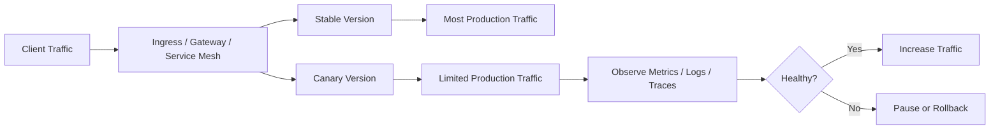
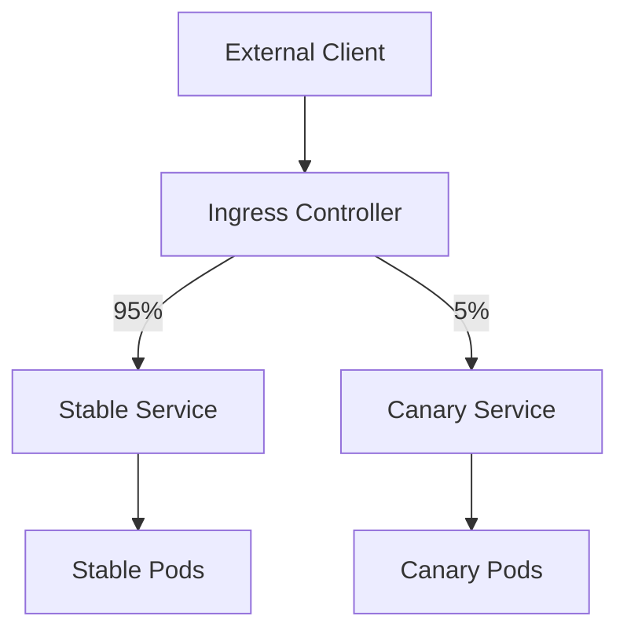
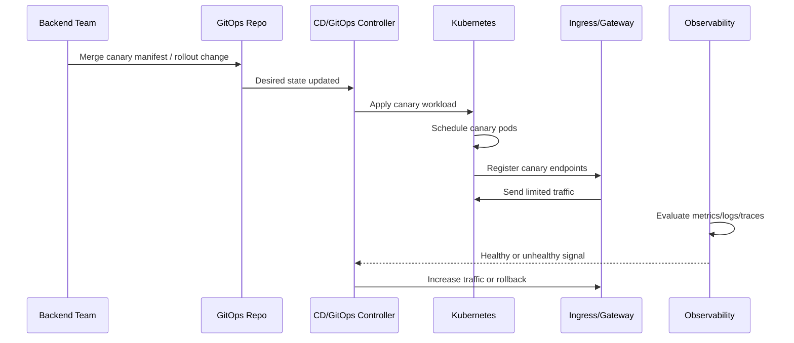
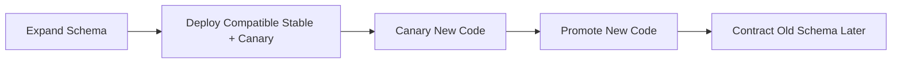
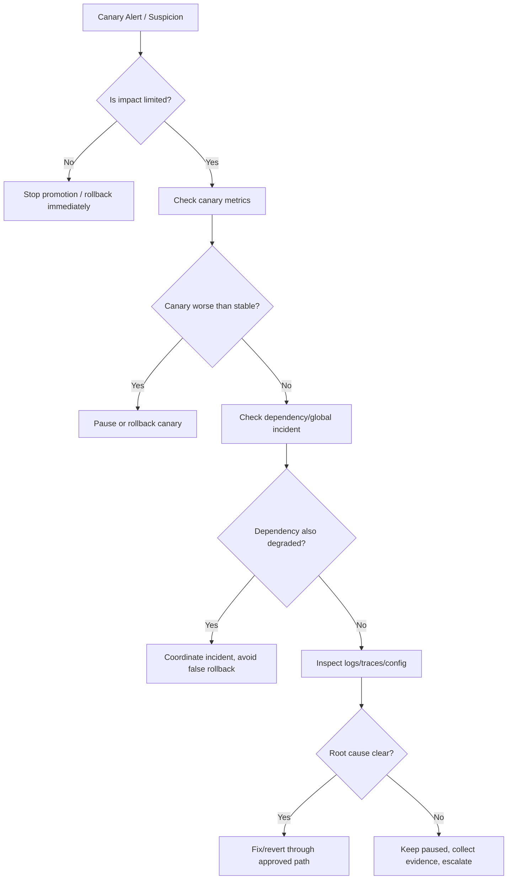

# Part 051 — Canary and Progressive Delivery Operations

## Tujuan

Canary dan progressive delivery adalah strategi release untuk mengurangi **blast radius**. Tujuannya bukan membuat deployment terlihat lebih canggih, tetapi memberi kesempatan kepada tim untuk mendeteksi kegagalan lebih awal sebelum seluruh production traffic terkena dampak.

Dalam konteks backend enterprise, terutama Java/JAX-RS service yang terhubung ke PostgreSQL, Kafka, RabbitMQ, Redis, Camunda, API gateway, dan dependency eksternal, canary harus dilihat sebagai mekanisme **risk control**.

Canary yang buruk hanya memindahkan risiko dari rolling update ke routing layer. Canary yang baik membatasi dampak, mengamati sinyal yang benar, dan memiliki rollback path yang jelas.

Part ini membahas:

- apa itu canary secara operasional
- kapan canary berguna dan kapan tidak
- traffic split dan routing strategy
- Argo Rollouts / Flagger awareness
- metric-based promotion
- auto rollback dan manual pause
- blast radius control
- canary untuk API, consumer, worker, dan batch workload
- checklist review untuk backend engineer

---

## 1. Canary Mental Model

Canary adalah deployment versi baru yang menerima sebagian kecil traffic atau workload terlebih dahulu.



Inti canary:

- versi baru hidup berdampingan dengan versi stabil
- traffic atau workload dibatasi secara eksplisit
- observability digunakan sebagai gate
- promosi dilakukan bertahap
- rollback harus cepat dan jelas

Canary bukan pengganti:

- automated test
- smoke test
- backward compatibility
- database migration safety
- feature flag discipline
- production readiness review

---

## 2. Progressive Delivery vs Rolling Update

Rolling update mengganti pod lama dengan pod baru secara bertahap di level Deployment.

Progressive delivery mengatur **berapa banyak traffic atau workload** yang boleh masuk ke versi baru berdasarkan health signal.

| Dimension | Rolling Update | Canary / Progressive Delivery |
|---|---|---|
| Control level | Replica replacement | Traffic/workload exposure |
| Main risk control | `maxSurge`, `maxUnavailable` | traffic percentage, routing rule, metric gate |
| Observability gate | usually manual | can be automated |
| Rollback trigger | human or deployment failure | metric threshold, human pause, automated analysis |
| Best for | normal release | risky release, high-criticality service, behavior change |
| Weakness | bad code can receive all traffic once ready | more complex routing and state compatibility |

A pod being `Ready` only means Kubernetes may route traffic to it. It does not prove the version is correct for real production behavior.

---

## 3. When Canary Makes Sense

Canary is useful when a change can fail under real production traffic in ways that tests may not catch.

Good candidates:

- new JAX-RS endpoint behavior
- changed validation/business rule
- changed SQL query or indexing assumption
- changed external API client behavior
- changed timeout/retry policy
- changed serialization/deserialization
- changed Kafka/RabbitMQ processing logic
- changed Redis cache key strategy
- changed Camunda worker behavior
- changed JVM/resource settings
- changed ingress/header/routing behavior

Canary may not help much when:

- change is purely internal and already isolated behind feature flag
- database migration is not backward compatible
- all traffic will share the same corrupted cache/state
- message consumer semantics cannot be safely split
- failure only appears after hours/days
- dependency side effect is irreversible
- there is no meaningful metric gate

---

## 4. Backend Engineer Responsibility

Backend service owner is responsible for:

- identifying risky application changes
- defining canary validation criteria
- defining safe traffic percentage
- defining business-critical smoke tests
- ensuring backward compatibility
- checking dependency capacity impact
- reviewing logs, metrics, traces, and error budget impact
- knowing rollback limitations
- coordinating DB migration and event compatibility

Backend engineer is not usually the owner of:

- cluster-wide ingress controller
- service mesh installation
- Argo Rollouts/Flagger controller operation
- cloud load balancer implementation
- global gateway policy
- platform-wide deployment controller

But backend engineer must understand enough to ask the right questions and review the workload-level impact.

---

## 5. Platform/SRE Responsibility

Platform/SRE usually owns:

- canary controller installation and lifecycle
- ingress/service mesh/Gateway API integration
- metric provider integration
- standard rollout templates
- progressive delivery guardrails
- traffic routing implementation
- default analysis templates
- operational dashboards for rollout health
- escalation process for controller failure

Backend service owner should verify the platform contract before relying on canary in production.

---

## 6. Common Canary Implementation Patterns

### Pattern 1 — Ingress-based traffic split

Traffic is split at ingress or gateway layer.



Useful for HTTP/JAX-RS services.

Watch out for:

- session affinity
- cache behavior
- auth header propagation
- path rewrite differences
- TLS/backend protocol mismatch
- ingress annotation complexity

### Pattern 2 — Service mesh traffic split

Traffic is split through service mesh routing rules.

Useful for:

- service-to-service traffic
- advanced routing
- retry/timeout policy
- mTLS-aware routing
- telemetry integration

Watch out for:

- sidecar resource overhead
- mesh policy ownership
- retry amplification
- difference between ingress traffic and internal traffic

### Pattern 3 — Gateway API / API gateway route split

Traffic split is managed through Gateway/HTTPRoute or enterprise API gateway.

Useful for:

- standardized route ownership
- edge policy
- header-based routing
- route delegation
- central security policy

Watch out for:

- route conflict
- ownership boundary
- auth/rate-limit behavior
- gateway-level timeout mismatch

### Pattern 4 — Controller-managed canary

A rollout controller such as Argo Rollouts or Flagger may orchestrate:

- canary ReplicaSet
- traffic weight
- metric analysis
- promotion
- pause
- rollback

Backend engineer should treat these tools as platform capabilities and verify internal usage before assuming availability.

---

## 7. Canary Routing Strategies

### Weight-based routing

Example progression:

```text
0% -> 1% -> 5% -> 10% -> 25% -> 50% -> 100%
```

Good for gradual exposure.

Risk:

- low traffic services may not get enough samples
- high traffic services may expose too many users even at 1%
- rare code path may not be exercised

### Header-based routing

Route requests with specific header to canary:

```text
X-Canary: true
```

Good for:

- internal testing
- QA/business validation
- targeted synthetic requests
- safe pre-production checks in production environment

Risk:

- not representative of real traffic
- header may leak or be spoofed if not controlled
- gateway must enforce route ownership safely

### User/account/tenant-based routing

Route selected tenants/users/accounts to canary.

Good for:

- controlled customer rollout
- internal tenant testing
- enterprise pilot rollout

Risk:

- fairness and privacy concerns
- data compatibility issues
- tenant-level blast radius can still be large
- support and communication complexity

### Region/zone-based routing

Expose canary in one region/zone first.

Good for:

- geographically isolated blast radius
- cloud failover validation

Risk:

- traffic shape differs by region
- dependency topology differs
- regional data rules may apply

---

## 8. Canary Sequence



Operational checkpoints:

1. canary pod created
2. canary pod ready
3. service endpoint present
4. route split active
5. deployment marker emitted
6. metric analysis running
7. logs/traces distinguish stable vs canary
8. rollback path tested

---

## 9. Canary Health Signals

Canary must be judged using **symptom and business-impact signals**, not only container health.

### Minimum signals

- canary pod readiness
- canary restart count
- HTTP 5xx rate
- HTTP 4xx abnormal spike
- p95/p99 latency
- request volume to canary
- dependency error rate
- CPU/memory/throttling
- logs with new exception pattern
- trace error spans

### Backend-specific signals

For JAX-RS API:

- route-level error rate
- auth failures
- validation failures
- DB query latency
- timeout rate
- downstream dependency failure

For Kafka consumer:

- consumer lag
- rebalance count
- offset commit failure
- processing error rate
- DLQ rate
- duplicate processing indicator

For RabbitMQ consumer:

- queue depth
- unacked messages
- redelivery rate
- nack rate
- DLQ rate

For Camunda worker:

- job activation rate
- job completion rate
- incident rate
- timeout rate
- retry exhaustion
- process correlation failures

---

## 10. Metric-Based Promotion

A canary should only be promoted when evidence is good enough.

Example gates:

| Gate | Example threshold |
|---|---|
| Availability | no significant 5xx increase |
| Latency | p95/p99 not worse than baseline beyond tolerance |
| Error logs | no new high-severity exception pattern |
| Dependency | DB/broker/cache error stable |
| Saturation | CPU/memory/throttling acceptable |
| Business signal | quote/order path success stable |
| Queue signal | lag/backlog not worsening |
| Workflow signal | Camunda incidents not increasing |

Avoid single-metric promotion. A canary with low 5xx but bad latency or silent business errors is not healthy.

---

## 11. Auto Rollback

Auto rollback is useful when the failure signal is clear and fast.

Good auto rollback triggers:

- canary pods crash
- readiness never passes
- 5xx rate crosses threshold
- latency crosses threshold
- error budget burn is high
- DLQ rate spikes
- workflow incident rate spikes

Dangerous auto rollback triggers:

- noisy metrics
- low sample volume
- unstable synthetic test
- metric delay longer than rollout step
- dependency outage unrelated to release
- alert that cannot distinguish stable vs canary

Auto rollback must be paired with evidence capture. Otherwise, the incident disappears before root cause is understood.

---

## 12. Manual Pause

Manual pause is needed when evidence is ambiguous.

Pause when:

- metrics are inconsistent
- canary sample size is too small
- dependency is degraded at the same time
- customer reports appear but dashboards are unclear
- rollback might be unsafe due to data/state change
- DB migration or event compatibility is uncertain

Safe actions during pause:

```bash
kubectl get deploy,rs,pod,svc,endpointslice -n <namespace> -l app=<app-name>
kubectl describe deploy <deployment> -n <namespace>
kubectl logs -n <namespace> deploy/<deployment> --since=15m
```

If using a rollout controller, use the internal approved command set or UI to inspect rollout state. Do not assume direct manual patching is allowed in a GitOps environment.

---

## 13. Blast Radius Control

Canary reduces blast radius only if the exposure boundary is real.

Blast radius dimensions:

- percentage of traffic
- number of tenants/users/accounts
- number of replicas
- dependency write access
- message queue share
- database schema compatibility
- cache namespace compatibility
- external side effects
- workflow/process impact

A 1% canary can still be dangerous if it writes bad state to shared PostgreSQL tables, corrupts shared Redis cache, publishes invalid Kafka events, or creates Camunda incidents that affect long-running processes.

---

## 14. Canary for JAX-RS API Services

For HTTP API services, canary is usually practical because traffic can be routed.

Review points:

- are stable and canary distinguishable in metrics?
- does canary receive real representative traffic?
- are traces tagged with version/revision?
- are access logs labeled with pod/version?
- does ingress/gateway route only intended traffic?
- does request stickiness create skew?
- are idempotent and non-idempotent endpoints treated differently?

JAX-RS-specific concerns:

- endpoint path changes
- request/response schema compatibility
- validation rule changes
- exception mapper behavior
- timeout behavior
- thread pool saturation
- DB transaction behavior
- security filters/interceptors

---

## 15. Canary for Kafka Consumers

Canary for Kafka consumers is not the same as HTTP canary.

If stable and canary join the same consumer group:

- Kafka will rebalance partitions
- canary may receive real partitions
- exposure is based on partition assignment, not traffic percentage
- a small canary replica can still process critical messages

If canary uses a separate consumer group:

- it may duplicate processing if it writes side effects
- it may be useful only for shadow/read-only validation
- offset semantics differ from stable processing

Operational questions:

- Is the canary allowed to commit offsets?
- Is processing idempotent?
- Can canary write to DB or publish events?
- Is DLQ shared?
- Are message versions backward compatible?
- What happens during rebalance?

For mission-critical event processing, canary often needs feature flags, shadow mode, or topic-level isolation.

---

## 16. Canary for RabbitMQ Consumers

RabbitMQ canary is risky if canary consumes from the same queue.

If canary connects as another consumer:

- broker may deliver real messages to canary
- exposure depends on dispatch/prefetch, not clean percentage
- bad canary can ack/nack real messages
- redelivery/DLQ behavior can change production state

Review points:

- canary queue or shared queue?
- canary prefetch setting?
- canary ack/nack behavior?
- retry/DLQ shared or isolated?
- idempotency of handler?
- poison message handling?

For unsafe changes, use shadow queue, replay environment, or feature-flagged handler path rather than directly canarying real queue consumption.

---

## 17. Canary for Camunda Workers

Camunda workers can activate real jobs if they subscribe to the same job type.

Risks:

- canary worker completes real process steps
- bad worker creates incidents
- retry exhaustion affects process instances
- process variables may be written incorrectly
- multiple worker versions may compete for jobs

Review points:

- job type subscription
- worker concurrency
- job timeout
- retry policy
- incident dashboard
- process version compatibility
- correlation ID propagation
- rollback limitations after job completion

For high-risk worker changes, consider controlled activation, lower concurrency, feature flags, or process-version isolation.

---

## 18. Canary and Database Compatibility

Canary requires database compatibility.

Stable and canary usually run at the same time. Therefore:

- old code must work with new schema
- new code must work with old or transitional schema
- writes from canary must not break stable code
- rollback must not require impossible data rollback

Use expand-contract where needed:



Avoid canarying code that depends on a schema change already incompatible with stable.

---

## 19. Canary and Cache Compatibility

Redis/cache-related risks:

- canary writes new cache format read by stable
- stable writes old cache format read by canary
- canary changes key naming
- canary changes TTL
- canary invalidates shared cache incorrectly
- canary warms cache with bad values

Safe patterns:

- versioned cache keys
- backward-compatible deserialization
- safe cache miss fallback
- limited canary write path
- clear cache rollback plan

Canary percentage does not limit damage if the canary writes to a shared cache used by all pods.

---

## 20. Canary and Event Compatibility

Event-driven systems require compatibility beyond HTTP.

Risks:

- canary emits new event schema consumed by stable downstream service
- canary changes event semantics without versioning
- canary publishes duplicate events after retry
- rollback leaves downstream systems with already-published events
- DLQ volume increases after canary promotion

Review:

- event schema versioning
- consumer compatibility
- idempotency key
- event ordering assumptions
- DLQ monitoring
- replay strategy
- downstream owner communication

---

## 21. Canary Observability Labels

Canary is almost useless if metrics cannot distinguish versions.

Required labels/dimensions:

- service name
- namespace
- deployment
- pod
- version
- Git SHA
- rollout revision
- stable/canary role
- route or endpoint
- HTTP status
- dependency name

Logs should include:

- trace ID
- correlation ID
- version/revision
- pod name
- request route
- tenant/account only if allowed by privacy policy

Traces should show:

- ingress/gateway span
- service span
- DB span
- broker span
- Redis span
- downstream HTTP span
- error and timeout spans

---

## 22. Safe Investigation Commands

Generic Kubernetes view:

```bash
kubectl get deploy,rs,pod,svc,endpointslice -n <namespace> -l app=<app-name>
kubectl describe deploy <deployment> -n <namespace>
kubectl get events -n <namespace> --sort-by=.lastTimestamp
```

Check image/version labels:

```bash
kubectl get pod -n <namespace> -l app=<app-name> \
  -o custom-columns=NAME:.metadata.name,READY:.status.containerStatuses[*].ready,IMAGE:.spec.containers[*].image,NODE:.spec.nodeName
```

Check logs by label:

```bash
kubectl logs -n <namespace> -l app=<app-name>,role=canary --since=15m
kubectl logs -n <namespace> -l app=<app-name>,role=stable --since=15m
```

Check endpoints:

```bash
kubectl get endpointslice -n <namespace> -l kubernetes.io/service-name=<service-name>
```

Check rollout state if using Deployment:

```bash
kubectl rollout status deploy/<deployment> -n <namespace>
kubectl rollout history deploy/<deployment> -n <namespace>
```

If internal platform uses Argo Rollouts, Flagger, service mesh, or Gateway API, use approved internal commands and dashboards.

---

## 23. Canary Failure Triage



Key question: is the canary worse than stable under comparable traffic?

If stable and canary are both bad, the issue may be dependency, gateway, network, or cluster-wide condition.

---

## 24. Rollback Decision Matrix

| Situation | Preferred action | Reason |
|---|---|---|
| Canary pods crash | rollback/pause | new version cannot run |
| Canary 5xx much higher than stable | rollback/pause | likely application regression |
| Canary latency worse but no errors | pause | need compare dependency and saturation |
| Metrics insufficient sample | pause | promotion would be blind |
| Dependency outage affects both stable/canary | do not blindly rollback | rollback may not help |
| Canary writes bad data | stop canary and start data assessment | rollback may not undo state |
| Canary emits incompatible event | stop canary, notify downstream owners | event effects may persist |
| Canary breaks only one endpoint | route/feature mitigation if available | targeted mitigation may be safer |

---

## 25. Anti-Patterns

- canary without version-labelled metrics
- canary without rollback path
- canary with automatic promotion but no meaningful analysis
- canary based only on pod readiness
- canarying DB-incompatible code
- canarying consumers against real queues without idempotency
- canarying worker logic that creates irreversible workflow incidents
- ignoring low sample size
- ignoring dependency saturation
- treating 1% traffic as always safe
- manually patching routing in production outside GitOps/audit process

---

## 26. Backend PR Review Checklist

Review a canary-related PR for:

- stable and canary workload separation
- traffic split mechanism
- route ownership
- service selectors
- version labels
- deployment markers
- metric gates
- rollback behavior
- database compatibility
- event compatibility
- cache compatibility
- consumer group behavior
- worker concurrency
- dependency capacity
- alert and dashboard coverage
- runbook link

---

## 27. Internal Verification Checklist

Verify internally:

- whether canary is supported in the target cluster
- which tool is used: Ingress annotations, Gateway API, service mesh, Argo Rollouts, Flagger, or platform-specific controller
- who owns rollout controller operation
- how traffic split is implemented
- how canary metrics are selected
- whether auto rollback is enabled
- whether manual pause is allowed
- where rollout status is visible
- whether dashboards distinguish stable vs canary
- whether logs/traces include version/revision
- whether deployment marker exists
- whether GitOps is source of truth
- how rollback is performed safely
- whether DB migration is compatible
- whether Kafka/RabbitMQ/Camunda worker canary is allowed
- whether security/compliance approval is needed for targeted tenant canary

---

## 28. Production Runbook: Canary Looks Bad

1. Freeze promotion.
2. Confirm canary traffic percentage and affected route.
3. Compare canary vs stable error rate and latency.
4. Check canary pod restarts and readiness.
5. Check recent deployment marker and Git SHA.
6. Check dependency metrics.
7. Check logs/traces by version.
8. Determine whether issue is canary-specific or global.
9. Rollback or keep paused based on evidence.
10. Capture timeline and key signals.
11. Notify platform/SRE if routing/controller behavior is suspicious.
12. Notify dependency owners if DB/broker/cache/workflow signals are involved.
13. Create follow-up corrective actions.

---

## 29. Practical Mental Model

Canary answers one question:

> Can this new version safely handle a controlled slice of real production workload without worsening user-visible, dependency, or business-critical signals?

It does not answer:

- whether schema migration is reversible
- whether all rare paths work
- whether long-running workflows will be safe
- whether message side effects can be undone
- whether downstream consumers are compatible

For backend engineers, the value of canary is not the tool. The value is disciplined exposure, clear health gates, and fast mitigation.
