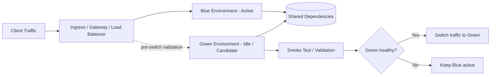
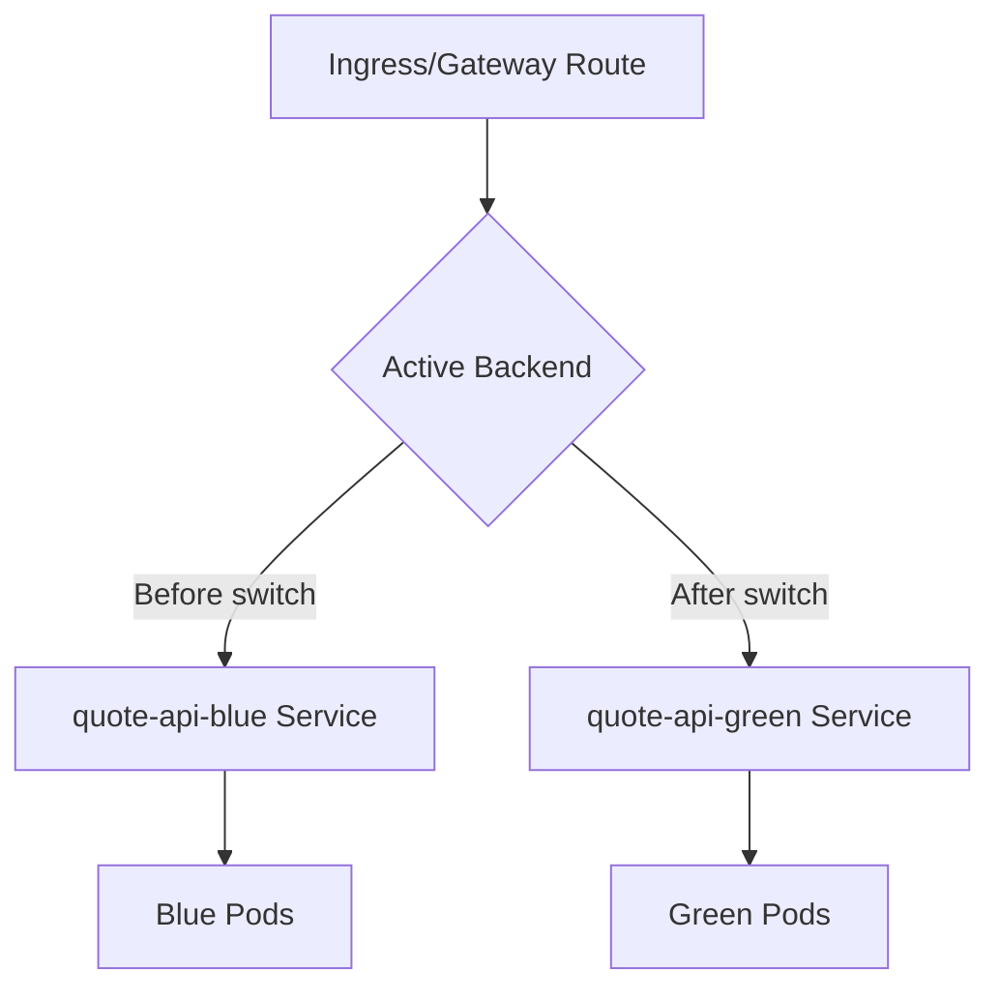
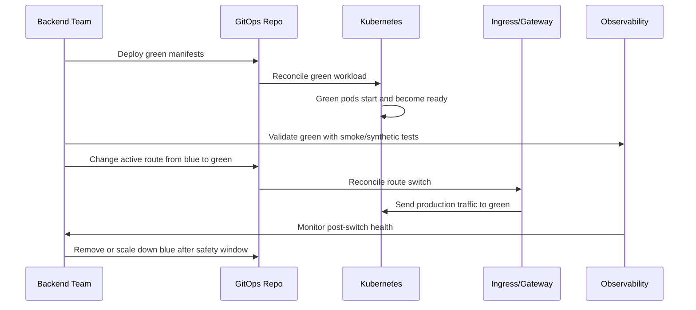
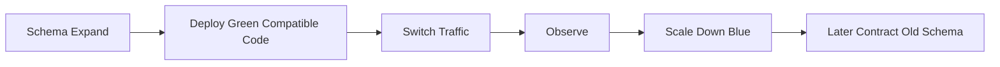
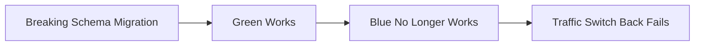
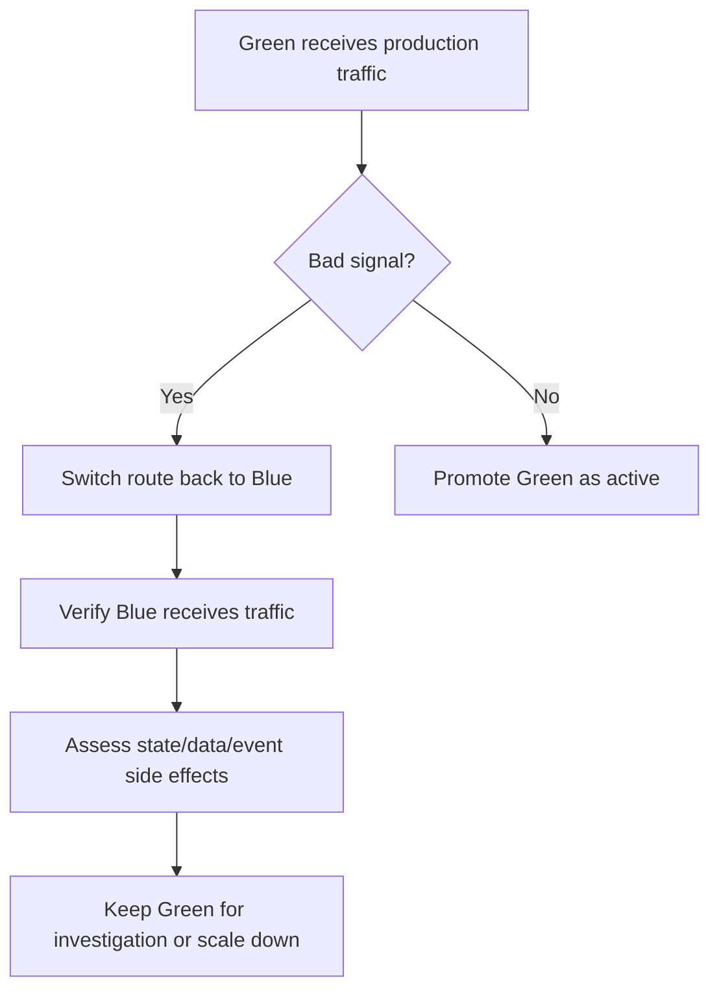
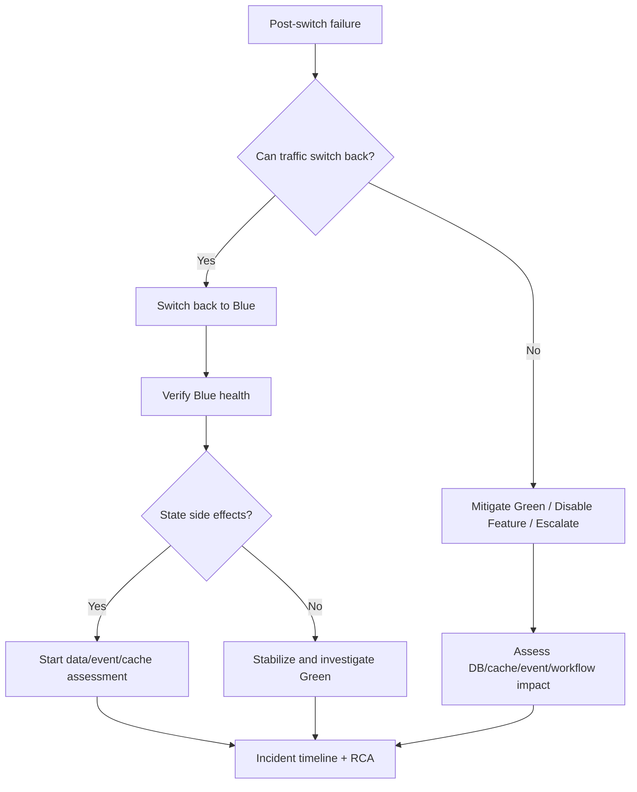

# Part 052 — Blue-Green Deployment Operations

## Tujuan

Blue-green deployment adalah strategi menjalankan dua versi environment/workload secara paralel: satu versi aktif melayani traffic, satu versi baru disiapkan dan divalidasi sebelum traffic dialihkan.

Dalam Kubernetes, blue-green terlihat sederhana: jalankan Deployment baru, lalu switch Service/Ingress/Gateway. Tetapi untuk backend enterprise, risiko utamanya bukan hanya routing. Risiko utamanya adalah **shared state**:

- database schema dan data
- Redis cache
- Kafka/RabbitMQ messages
- Camunda process state
- external API side effects
- secrets/config
- background workers dan scheduler
- connection pool dan dependency capacity

Part ini membahas blue-green deployment sebagai strategi operational safety, bukan sekadar teknik switching traffic.

---

## 1. Blue-Green Mental Model



Blue-green separates **deployment readiness** from **traffic activation**.

The core idea:

1. Keep blue serving production.
2. Deploy green separately.
3. Validate green before exposure.
4. Switch traffic when green is ready.
5. Keep blue available temporarily for rollback.

---

## 2. Blue-Green vs Canary

| Dimension | Canary | Blue-Green |
|---|---|---|
| Exposure model | gradual partial traffic | traffic switch from old to new |
| Runtime model | stable + canary both receive controlled traffic | blue active, green prepared, then switched |
| Best for | incremental risk exposure | fast cutover with pre-validation |
| Rollback | reduce canary traffic / revert rollout | switch traffic back to blue |
| Main risk | bad canary still writes shared state | green may look healthy before full traffic |
| Cost | moderate extra capacity | often near double capacity during overlap |
| Complexity | traffic weights and analysis | parallel environment compatibility |

Blue-green is useful when you want strong pre-switch validation and fast traffic cutover. Canary is better when you want real traffic exposure gradually.

---

## 3. Kubernetes Implementation Patterns

### Pattern 1 — Two Deployments, one Service selector switch

```yaml
apiVersion: v1
kind: Service
metadata:
  name: quote-api
spec:
  selector:
    app: quote-api
    color: blue
```

Switch by changing selector from `blue` to `green`.

Risk:

- selector switch can be abrupt
- GitOps may revert manual switch
- old connections may continue briefly
- service endpoint update must be observed

### Pattern 2 — Two Services, ingress/gateway switch



Often cleaner than Service selector switch because blue and green services remain stable.

Risk:

- ingress/gateway config complexity
- route ownership issues
- TLS/backend protocol mismatch
- cache/session assumptions

### Pattern 3 — Separate namespaces

Example:

```text
quote-order-blue
quote-order-green
```

Useful for environment-level separation.

Risk:

- duplicate config/secrets
- RBAC duplication
- NetworkPolicy duplication
- observability duplication
- drift between namespaces

### Pattern 4 — Separate clusters or regions

Useful for large-scale enterprise cutover.

Risk:

- DNS/LB propagation
- data replication complexity
- cloud/network policy differences
- DR/failover complexity
- much higher cost

---

## 4. Traffic Switch Sequence



Operational checkpoints:

- green deployed
- green ready
- green service endpoints present
- smoke test passed
- route switch approved
- post-switch metrics stable
- rollback window defined
- blue retained long enough

---

## 5. Backend Engineer Responsibility

Backend service owner is responsible for:

- verifying green app readiness
- defining smoke test and validation path
- ensuring backward compatibility with shared DB/cache/events
- reviewing connection pool impact
- ensuring background workers do not double-process
- defining rollback decision criteria
- validating observability labels
- coordinating migration and release sequence

Backend engineer should not assume:

- green is safe because pods are Ready
- blue can always be switched back safely
- DB migration can be rolled back with traffic switch
- cache/event side effects are isolated
- consumers/workers are inactive just because HTTP traffic is not routed

---

## 6. Platform/SRE Responsibility

Platform/SRE usually owns:

- traffic switching mechanism
- ingress/gateway/load balancer policy
- GitOps reconciliation behavior
- cluster capacity for parallel environments
- DNS/LB propagation rules
- standard blue-green templates
- production access controls
- audit and approval workflow

Backend team must verify the platform contract before relying on blue-green for production safety.

---

## 7. Blue-Green for JAX-RS API Services

Blue-green is well-suited for stateless HTTP APIs when dependencies are compatible.

Pre-switch validation:

- green pods ready
- management endpoint healthy
- representative JAX-RS endpoint works
- auth path works
- database connection works
- Redis connection works if used
- downstream HTTP calls work
- trace propagation works
- logs show correct version/Git SHA

JAX-RS concerns:

- request/response schema compatibility
- exception mapper behavior
- validation rule changes
- filter/interceptor behavior
- timeout/retry behavior
- thread pool sizing
- connection pool sizing
- graceful shutdown on blue after switch

---

## 8. Background Workers Are Not Controlled by HTTP Switch

This is one of the biggest blue-green traps.

If green deployment includes consumers or workers, they may start processing immediately when pods become Ready or even before readiness matters.

Risky workload types:

- Kafka consumers
- RabbitMQ consumers
- Camunda workers
- CronJobs
- schedulers
- reconciliation jobs
- migration jobs
- file processing workers

A traffic switch at Ingress/Gateway does not stop these workloads from consuming messages or executing jobs.

Safe patterns:

- separate worker deployment from API deployment
- disable green workers until cutover
- use feature flags for worker activation
- set replicas to zero until approved
- use controlled consumer group strategy
- prevent duplicate scheduler execution
- use leader election or distributed lock

---

## 9. Kafka Blue-Green Concerns

If blue and green Kafka consumers use the same consumer group:

- green joining causes rebalance
- partitions may move to green before HTTP switch
- green can process real events early
- rollback triggers another rebalance

If green uses a different consumer group:

- it may duplicate processing
- it may be useful only for shadow validation
- offset state differs

Review checklist:

- consumer group ID
- green consumer replica count
- whether green consumers are enabled
- offset commit behavior
- idempotency
- DLQ isolation
- event schema compatibility
- downstream write side effects

Blue-green for Kafka processing must be explicit. Do not rely on HTTP route switch to control event processing.

---

## 10. RabbitMQ Blue-Green Concerns

If blue and green both connect to the same queue:

- green becomes an additional consumer
- broker may dispatch real messages to green
- prefetch controls how many messages green can hold
- ack/nack behavior affects production messages
- rollback cannot un-ack messages

Review checklist:

- queue name
- consumer tag/version
- prefetch
- ack/nack behavior
- retry/DLQ policy
- idempotency
- green activation flag
- duplicate worker prevention

For risky handler changes, use shadow queues, replay, or disabled green consumers until cutover.

---

## 11. Camunda Worker Blue-Green Concerns

Camunda workers may activate jobs as soon as they are running.

Risks:

- blue and green compete for the same job type
- green completes process steps before cutover
- green creates incidents
- rollback does not undo completed jobs
- process variable changes persist

Review checklist:

- job type subscriptions
- worker activation flag
- concurrency
- job timeout
- retry policy
- incident visibility
- process version compatibility
- rollback behavior for in-flight process instances

Blue-green is safe for Camunda workers only when activation and compatibility are controlled.

---

## 12. Database Compatibility

Blue and green often share the same PostgreSQL database.

Therefore, both versions must be compatible with the same schema during overlap.

Safe pattern:



Dangerous pattern:



Rollback to blue only works if blue can still run against the current database state.

Review:

- schema backward compatibility
- data format compatibility
- write path compatibility
- migration lock
- migration observability
- rollback limitation
- long-running transaction risk

---

## 13. Cache Compatibility

Blue and green may share Redis or another cache.

Risks:

- green writes new format read by blue
- blue writes old format read by green
- green changes TTL behavior
- green invalidates shared keys
- green uses different serialization
- green warms bad cache values

Safe patterns:

- versioned cache keys
- backward-compatible cache reader
- safe cache miss fallback
- controlled cache warmup
- scoped cache invalidation
- rollback cache plan

Traffic switch does not isolate shared cache side effects.

---

## 14. Event Compatibility

Blue-green deployment must consider event compatibility.

Risks:

- green publishes events with schema unknown to blue/downstream
- blue and green publish different semantics
- event consumers receive mixed versions
- rollback leaves already-published events in the system
- replay behaves differently

Review:

- schema registry or schema contract
- event versioning
- forward/backward compatibility
- idempotency key
- event ordering assumption
- DLQ behavior
- downstream owner approval

---

## 15. External API and Callback Compatibility

Enterprise systems often interact with external systems.

Risks:

- green calls external API with new payload
- external partner callbacks still target blue route
- webhook registration points to old endpoint
- authentication client ID/secret differs
- external side effect cannot be rolled back

Review:

- external endpoint config
- callback URL
- auth credential
- idempotency key
- retry behavior
- partner contract
- audit trail

---

## 16. Config and Secret Compatibility

Blue and green may use different config/secret versions.

Risks:

- green uses rotated secret while blue uses old secret
- route switch changes to green but dependency rejects credential
- blue rollback fails because old secret was removed
- ConfigMap drift between environments
- namespace-specific secret missing

Review:

- config source
- secret source
- external secret sync
- secret rotation timeline
- blue rollback credential availability
- environment overlay drift
- GitOps rendered manifests

---

## 17. Capacity and Cost

Blue-green often doubles runtime capacity temporarily.

Capacity impact:

- extra pods
- extra CPU/memory requests
- extra connection pools
- extra JVM heap
- extra warmup load
- extra logs/metrics/traces
- extra load balancer or route resources

Dependency impact:

- PostgreSQL connections may double
- Redis connections may double
- Kafka/RabbitMQ connections may increase
- Camunda worker connections may increase
- external API traffic may increase during validation

Cost impact:

- node capacity
- load balancer/gateway resources
- NAT/egress
- observability volume
- idle green/blue runtime

Blue-green must be capacity-planned. Otherwise, the deployment strategy itself can trigger resource pressure.

---

## 18. Green Environment Validation

Green validation should be stronger than simple readiness.

Minimum pre-switch validation:

- pods ready
- service endpoints present
- ingress/gateway route to green test path works
- JAX-RS health and representative endpoint pass
- DB connectivity works
- Redis/cache path works if applicable
- Kafka/RabbitMQ/Camunda workers are either disabled or intentionally validated
- logs show correct version
- traces flow end-to-end
- no startup exceptions
- resource usage stable

Validation should answer:

> If production traffic moves now, what evidence says green can safely handle it?

---

## 19. Switch Execution

Switch should be done through approved source of truth.

In GitOps environments:

- change route/service selector in Git
- let controller reconcile
- observe sync health
- verify endpoint switch
- verify deployment marker

Avoid manual live edits unless explicitly allowed by break-glass procedure.

Potential switch mechanisms:

- Service selector update
- Ingress backend update
- Gateway/HTTPRoute backendRef update
- API gateway route update
- DNS/LB switch
- platform-specific release controller

---

## 20. Post-Switch Verification

After switch:

- confirm traffic reaches green
- confirm blue traffic drops as expected
- check 5xx rate
- check p95/p99 latency
- check DB latency and connection count
- check Redis error/latency
- check Kafka/RabbitMQ metrics
- check Camunda incidents
- check logs/traces by version
- check business-critical quote/order path
- check external callbacks if relevant

Do not scale down blue immediately unless rollback window is intentionally short and approved.

---

## 21. Rollback in Blue-Green

Rollback usually means switching traffic back to blue.



Rollback is fast only if:

- blue is still running
- blue is compatible with current DB schema/data
- blue credentials still work
- blue config still valid
- route switch can be reverted
- dependency state is not corrupted

Rollback is not enough if green already:

- wrote bad data
- published bad events
- acked/nacked messages incorrectly
- created Camunda incidents
- polluted shared cache
- triggered external side effects

---

## 22. Scale Down and Cleanup

After stabilization:

- decide when blue can be scaled down
- preserve blue long enough for rollback window
- remove obsolete route if needed
- clean old ConfigMaps/Secrets carefully
- keep audit trail
- update deployment docs
- update runbook if new failure was found

Do not delete old image or secret too early if rollback policy depends on them.

---

## 23. Safe Investigation Commands

Inspect blue and green workloads:

```bash
kubectl get deploy,rs,pod,svc,endpointslice -n <namespace> -l app=<app-name>
```

Check color/version labels:

```bash
kubectl get pods -n <namespace> -l app=<app-name> \
  -o custom-columns=NAME:.metadata.name,COLOR:.metadata.labels.color,VERSION:.metadata.labels.version,READY:.status.containerStatuses[*].ready,IMAGE:.spec.containers[*].image
```

Check services:

```bash
kubectl get svc <service-name> -n <namespace> -o yaml
kubectl get endpointslice -n <namespace> -l kubernetes.io/service-name=<service-name>
```

Check ingress/gateway route:

```bash
kubectl get ingress -n <namespace>
kubectl describe ingress <ingress-name> -n <namespace>
```

If Gateway API is used:

```bash
kubectl get gateway,httproute -n <namespace>
kubectl describe httproute <route-name> -n <namespace>
```

Use internal approved commands if the route switch is managed by a platform release controller.

---

## 24. Blue-Green Failure Triage



During triage, separate:

- routing failure
- green application failure
- dependency compatibility failure
- shared state corruption
- external side effect
- worker/consumer accidental activation

---

## 25. Common Failure Modes

### Route switch points to wrong backend

Symptoms:

- traffic still goes to blue
- traffic goes to green but wrong namespace/service
- 404/503 from gateway

Check:

- ingress/gateway route
- service name and port
- namespace
- EndpointSlice
- route sync status

### Green is ready but fails under real traffic

Symptoms:

- readiness OK
- post-switch 5xx/latency spike
- trace shows dependency failure

Check:

- config/secret parity
- connection pool
- dependency timeout
- DB query plan
- cache format

### Blue rollback fails

Symptoms:

- route switched back but blue errors
- blue cannot connect to dependency
- blue cannot read new data format

Check:

- schema compatibility
- secret availability
- config rollback
- cache/event side effects

### Green workers process early

Symptoms:

- Kafka rebalance before switch
- RabbitMQ consumer count doubled
- Camunda incidents from green version

Check:

- worker replica count
- activation flag
- consumer group
- queue subscription
- job type subscription

---

## 26. Anti-Patterns

- blue-green with breaking DB migration
- green workers active before cutover unintentionally
- manual Service selector switch outside GitOps
- blue deleted immediately after switch
- no version labels in metrics/logs/traces
- shared Redis cache format changed without compatibility
- Kafka/RabbitMQ processing treated like HTTP routing
- no rollback credential/config preserved
- no capacity plan for double runtime
- smoke test only checks `/health/live`
- route switch without post-switch verification

---

## 27. Backend PR Review Checklist

Review blue-green change for:

- blue/green label strategy
- service selector or route switch mechanism
- GitOps source of truth
- namespace/environment separation
- version/Git SHA annotation
- DB schema compatibility
- cache compatibility
- event compatibility
- worker/consumer activation control
- scheduler duplicate prevention
- connection pool impact
- resource/capacity impact
- secret/config parity
- ingress/gateway route correctness
- smoke test definition
- rollback path
- cleanup plan

---

## 28. Internal Verification Checklist

Verify internally:

- whether blue-green is supported and standardized
- which layer performs traffic switch: Service, Ingress, Gateway, API gateway, DNS, or release controller
- who is allowed to switch traffic
- whether GitOps is mandatory
- whether blue and green use separate namespaces or shared namespace
- whether blue remains running after switch
- rollback window duration
- DB migration compatibility standard
- cache compatibility standard
- event schema compatibility standard
- worker/consumer activation policy
- scheduler duplicate prevention mechanism
- capacity approval for parallel runtime
- observability labels for color/version
- dashboard view for blue vs green
- incident runbook for failed switch

---

## 29. Production Runbook: Blue-Green Release

### Pre-switch

1. Deploy green through approved pipeline/GitOps.
2. Confirm green pods are ready.
3. Confirm green service endpoints exist.
4. Run smoke tests against green route or internal route.
5. Confirm DB/cache/event compatibility.
6. Confirm green workers/consumers are intentionally enabled or disabled.
7. Confirm capacity and dependency connection budget.
8. Confirm rollback route to blue.
9. Confirm dashboards separate blue and green.

### Switch

1. Change active route through approved source of truth.
2. Watch route reconciliation.
3. Confirm traffic reaches green.
4. Watch 5xx, latency, saturation, and dependency metrics.
5. Confirm business-critical flows.

### Post-switch

1. Keep blue during rollback window.
2. Monitor error budget burn.
3. Check logs/traces by version.
4. Watch queue/workflow signals.
5. Decide promote, rollback, or pause.
6. Capture evidence.
7. Cleanup only after stabilization.

---

## 30. Practical Mental Model

Blue-green answers this question:

> Can we prepare a complete candidate runtime, validate it, and switch production traffic with a fast path back to the previous runtime?

It does not automatically solve:

- database rollback
- event rollback
- cache contamination
- worker duplicate processing
- external side effects
- insufficient capacity
- missing observability

For backend engineers, blue-green is valuable when it is paired with compatibility discipline, clear activation control, and production-grade validation.
