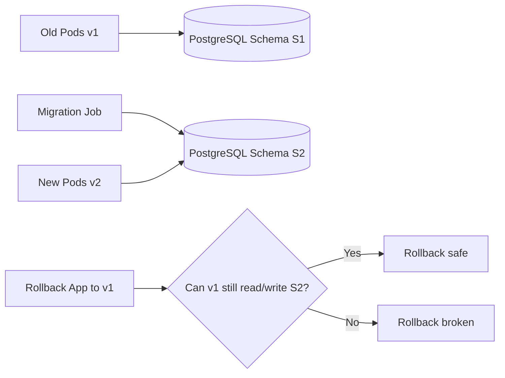
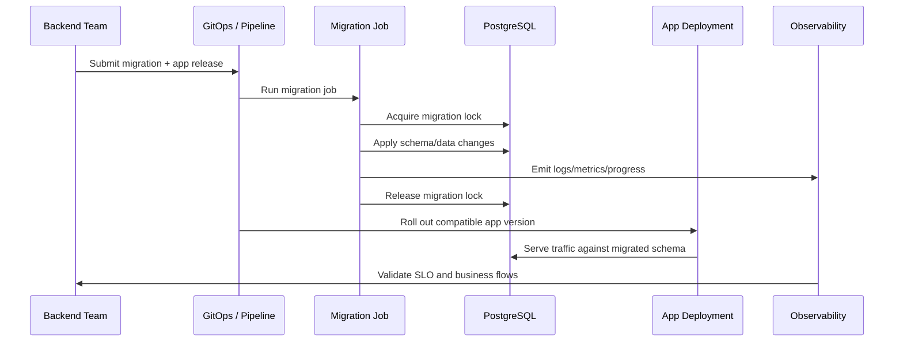
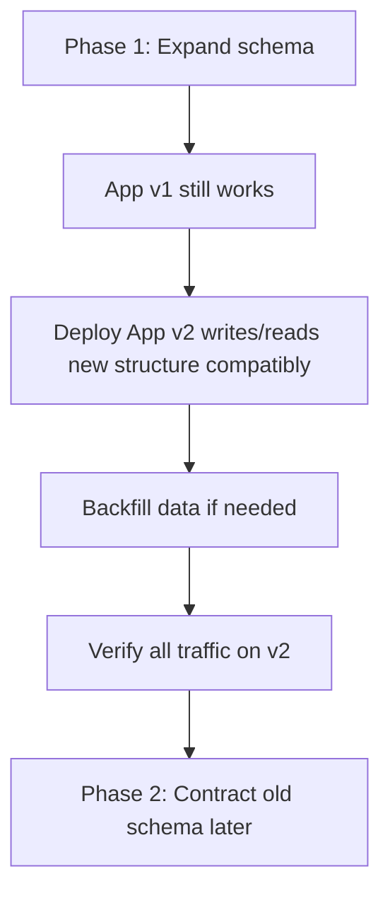
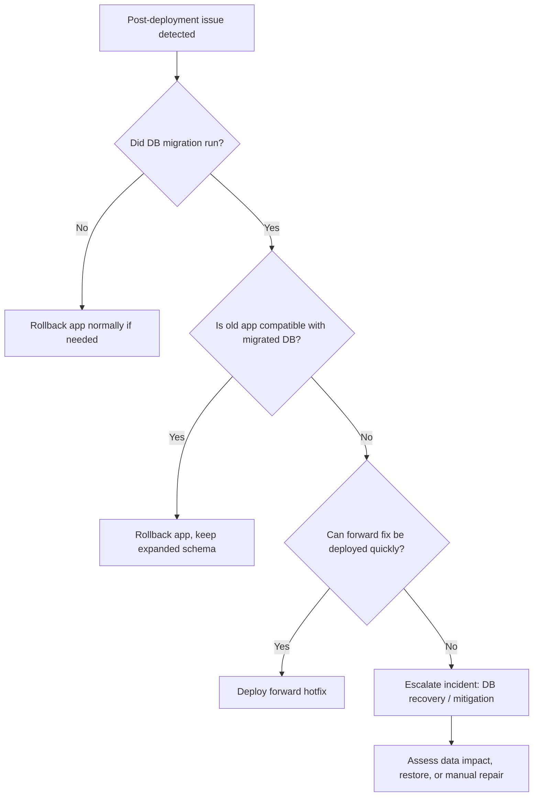

# Part 053 — Database Migration Coordination in Kubernetes

## Tujuan

Database migration adalah salah satu penyebab paling berbahaya dari incident deployment backend enterprise, karena perubahan database sering **tidak bisa di-rollback sesederhana rollback container image**.

Dalam Kubernetes, Deployment membuat perubahan aplikasi menjadi rolling dan gradual. Tetapi database sering menjadi shared state tunggal yang dipakai oleh:

- pod versi lama
- pod versi baru
- batch job
- scheduler
- Kafka/RabbitMQ consumer
- Camunda worker
- reporting job
- external integration
- support/admin tooling

Artinya, migration tidak boleh dipikirkan sebagai urusan `kubectl apply` atau `helm upgrade` saja. Migration harus dipikirkan sebagai **state transition lintas aplikasi, database, dependency, rollout strategy, rollback path, observability, dan operational ownership**.

Part ini membahas bagaimana senior backend engineer mengoordinasikan database migration di Kubernetes agar aman untuk production.

---

## 1. Core Mental Model

Kubernetes dapat melakukan rollback aplikasi dengan mengganti ReplicaSet. Database tidak selalu bisa mengikuti rollback yang sama.



Pertanyaan operational utama:

> Setelah migration berjalan, apakah versi aplikasi lama dan baru sama-sama bisa bekerja terhadap schema/data yang ada?

Kalau jawabannya tidak, maka rollback aplikasi tidak lagi cukup.

---

## 2. Why Database Migration Is Different from Application Rollout

Application rollout biasanya:

- reversible
- stateless atau semi-stateless
- dapat diganti ReplicaSet
- dapat dipause
- dapat dirollback
- dapat diuji melalui readiness dan smoke test

Database migration sering:

- mutates shared state
- berdampak lintas versi aplikasi
- berdampak ke data historis
- sulit dirollback
- bisa lock table
- bisa mengubah performance query
- bisa memengaruhi consumer/worker lama
- bisa gagal di tengah jalan
- bisa berjalan lebih lama dari deployment window

Karena itu, migration harus punya release choreography.

---

## 3. Migration Coordination Scope

Database migration coordination melibatkan:

| Area | Pertanyaan operasional |
|---|---|
| Schema | Apakah perubahan additive atau breaking? |
| Data | Apakah ada backfill, transform, cleanup, atau irreversible update? |
| Application version | Versi mana yang bisa berjalan di schema lama/baru? |
| Rollout | Migration dilakukan sebelum, selama, atau sesudah rollout aplikasi? |
| Rollback | Jika app rollback, apakah DB tetap kompatibel? |
| Locking | Apakah migration mengambil lock yang mengganggu transaksi online? |
| Performance | Apakah index creation/backfill mengganggu latency? |
| Observability | Bagaimana progress, failure, dan duration dipantau? |
| Ownership | Siapa boleh menjalankan, menghentikan, atau retry migration? |

---

## 4. Backend Engineer Responsibility

Backend engineer/service owner bertanggung jawab untuk:

- memahami compatibility aplikasi lama dan baru terhadap schema lama/baru
- mendesain migration yang aman untuk rolling deployment
- memilih strategi expand-contract bila perlu
- memastikan migration idempotent atau punya guard yang jelas
- menentukan apakah migration bisa auto-run atau harus manual/approved
- menyiapkan smoke test pasca migration
- menyiapkan rollback decision tree
- memastikan observability migration tersedia
- berkoordinasi dengan DBA/platform/SRE bila migration berat
- menghindari migration destructive dalam deployment biasa

Backend engineer tidak boleh menganggap:

- migration sukses karena pod menjadi Ready
- rollback image otomatis membatalkan perubahan DB
- migration kecil pasti aman di production data volume
- index creation selalu cepat
- column rename/drop aman saat rolling deployment
- consumer/worker tidak terdampak schema change

---

## 5. Platform/SRE/DBA Responsibility

Platform/SRE/DBA biasanya bertanggung jawab untuk:

- database availability dan maintenance window
- backup/restore process
- database performance monitoring
- lock monitoring
- connection limit monitoring
- migration approval untuk high-risk change
- production access control
- observability infra
- incident escalation
- operational guardrail di pipeline

Backend engineer tetap harus membawa desain migration yang benar. Platform/SRE/DBA bukan pengganti application compatibility reasoning.

---

## 6. Migration Patterns in Kubernetes

### Pattern 1 — Migration as a Kubernetes Job

```yaml
apiVersion: batch/v1
kind: Job
metadata:
  name: quote-db-migration-20260712-001
spec:
  backoffLimit: 0
  template:
    spec:
      restartPolicy: Never
      containers:
        - name: migrate
          image: registry.example.com/quote-service:2026.07.12
          command: ["java", "-jar", "migration.jar"]
```

Good for:

- explicit migration lifecycle
- logs separated from application pod
- clear success/failure state
- GitOps/pipeline orchestration
- controlled retry

Risk:

- failed Job may leave partial state
- retry may duplicate data changes if migration is not idempotent
- Job image must match migration code/version
- secret/config must match target environment

### Pattern 2 — Migration inside CI/CD pipeline

Pipeline runs migration before/after deployment.

Good for:

- approval gates
- ordered release control
- centralized audit

Risk:

- pipeline may lack cluster/database network path
- logs may not be visible in Kubernetes observability
- retry behavior may be unclear
- deployment and migration state can diverge

### Pattern 3 — Migration in application startup

Application pod runs migration during startup.

Usually dangerous for production when multiple replicas start concurrently.

Risk:

- multiple pods racing migration
- readiness delayed
- CrashLoopBackOff caused by DB change
- migration coupled to pod restart
- HPA/rollout can trigger unintended migration attempts
- hard to separate app failure from migration failure

This is often acceptable only for simple dev/test environments or with very strong locking and governance.

### Pattern 4 — Init container migration

Init container runs migration before app starts.

Risk:

- every new pod can attempt migration
- rollout stuck if migration fails
- scaling event can trigger migration path
- database operation hidden inside pod lifecycle
- unsafe for long-running migration

For enterprise production, init migration is usually an anti-pattern unless carefully controlled.

---

## 7. Migration Job Lifecycle



Minimum lifecycle signals:

- job created
- job started
- DB connection established
- migration lock acquired
- each migration step started/completed
- duration per step
- row count/backfill progress
- success/failure
- lock released
- post-migration validation

---

## 8. Expand-Contract Pattern

Expand-contract is the default safe pattern for schema evolution under rolling deployment.



### Expand phase

Add new things without breaking old app:

- add nullable column
- add new table
- add new index concurrently where supported
- add new enum value carefully
- add new foreign key later if expensive
- add compatibility view/function if needed

### Transition phase

Application supports both shapes:

- dual-read
- dual-write
- read-old/write-new
- write-old-and-new
- feature flag-controlled behavior
- backward-compatible serialization

### Contract phase

Remove old shape only after:

- all pods run new version
- all consumers/workers are upgraded
- no old readers/writers remain
- backfill completed
- dashboards confirm no old field usage
- rollback window has passed

---

## 9. Safe vs Dangerous Schema Changes

| Change | Risk level | Notes |
|---|---:|---|
| Add nullable column | Low | Usually safe if no default rewrite issue |
| Add table | Low | Safe if no blocking dependency |
| Add index concurrently | Medium | Safer but still monitor duration and lock |
| Add NOT NULL column with default | Medium/High | Can rewrite/lock depending database/version |
| Rename column | High | Breaks old app unless compatibility layer exists |
| Drop column | High | Breaks old app and rollback |
| Change column type | High | May lock table and break query assumptions |
| Add foreign key to large table | High | Validation can be expensive |
| Data backfill millions rows | High | Can cause IO, lock, replication, WAL pressure |
| Delete production data | Critical | Needs explicit approval, backup, audit |

For PostgreSQL, version and exact DDL matter. Do not generalize safety without verifying DB version and table size.

---

## 10. Rollout Ordering Patterns

### Migration before app rollout

Good when app v2 requires expanded schema and app v1 remains compatible.

Sequence:

1. Expand schema.
2. Confirm v1 still works.
3. Deploy v2.
4. Validate.

### App rollout before migration

Good when app v2 is prepared but feature disabled until schema exists.

Sequence:

1. Deploy app v2 with feature flag off.
2. Run migration.
3. Enable feature.
4. Validate.

### Migration after app rollout

Good for contract cleanup.

Sequence:

1. Deploy app no longer using old schema.
2. Observe for safety window.
3. Drop/contract later.

### Migration during rollout

Usually risky unless orchestrated by progressive delivery and compatibility is proven.

---

## 11. Rollback Limitation

Rollback has two dimensions:

| Rollback type | What changes |
|---|---|
| Application rollback | Reverts container image/config/manifests |
| Database rollback | Reverts schema/data state |

Application rollback is usually easy. Database rollback may be:

- impossible
- slow
- data-lossy
- requires restore
- requires reverse migration
- requires downtime
- unsafe under ongoing writes

Therefore release planning should prefer **forward-compatible rollback**:

> Roll back the application while keeping the expanded schema.

This requires old application version to tolerate the new schema.

---

## 12. Compatibility Matrix

Every migration should answer this matrix:

| App version | Schema old | Schema expanded | Schema contracted |
|---|---|---|---|
| v1 old app | must work | should work | may not work |
| v2 new app | may work | must work | must work after contract |
| rollback v1 | must work | must work | must not be needed |

Production-safe migration usually requires:

- v1 works with old schema
- v1 works with expanded schema
- v2 works with expanded schema
- contract happens only after rollback window

---

## 13. Migration Locking

Migration locking prevents multiple runners from applying the same migration concurrently.

Common mechanisms:

- migration framework lock table
- database advisory lock
- explicit lock row
- single pipeline execution gate
- GitOps sync wave with one Job

Operational concerns:

- what happens if the pod dies while holding lock?
- is lock automatically released at connection close?
- is there timeout?
- can a stale lock block future releases?
- who can clear the lock?
- is lock clearing audited?

---

## 14. Long-Running Migration

Long-running migration should not be hidden inside rollout.

Risks:

- table lock
- high IO
- replication lag
- WAL growth
- connection pool starvation
- transaction bloat
- vacuum pressure
- timeout
- partial progress
- stuck release pipeline

Safer techniques:

- chunked backfill
- idempotent progress table
- low batch size
- sleep between batches
- explicit progress metrics
- pause/resume support
- run outside peak window
- avoid large transaction
- monitor DB health continuously

---

## 15. Backfill Operations

Backfill is data migration, not just schema migration.

Backfill must define:

- source rows
- target rows
- ordering
- chunk size
- retry behavior
- idempotency rule
- progress checkpoint
- consistency verification
- failure notification
- pause/resume mechanism

Example checkpoint model:

```text
migration_name: quote_status_backfill_20260712
last_processed_id: 123456789
batch_size: 5000
status: RUNNING
started_at: ...
updated_at: ...
```

Avoid backfill that scans the entire table repeatedly without checkpointing.

---

## 16. Readiness Dependency Anti-Pattern

Do not make pod readiness depend on migration completion unless the relationship is clear.

Bad pattern:

```text
/readiness returns false until schema migration is complete
```

Risk:

- rollout stuck
- no endpoints available
- ingress 503
- HPA cannot help
- rollback unclear

Better pattern:

- migration is explicit Job
- app validates required schema on startup if needed
- readiness checks app serving ability
- deployment blocked by pipeline/GitOps gate if migration failed

---

## 17. Migration and Kafka/RabbitMQ Consumers

Consumers complicate migration because they process state asynchronously.

Check:

- can old consumer process messages after schema expansion?
- can new consumer process old messages?
- are event payloads versioned?
- does migration affect offset commit behavior?
- can rollback cause duplicate processing?
- does DLQ replay use old assumptions?
- do both old and new consumers write to same tables?

For Kafka:

- partition assignment changes during rollout
- rebalances can overlap with migration
- lag may hide failure until later

For RabbitMQ:

- unacked messages may return during pod shutdown
- redelivery may hit changed schema
- DLQ replay may use old payloads

---

## 18. Migration and Camunda Workers

Workflow state can span days or weeks. A migration can affect process instances already running.

Check:

- are old process variables compatible?
- do workers expect renamed fields?
- does job retry use old schema assumptions?
- can incidents increase after migration?
- can long-running processes resume correctly?
- does rollback app version still understand migrated variables/data?

Camunda migration requires thinking in terms of both database schema and process state lifecycle.

---

## 19. Migration and Redis Cache

Schema change may require cache compatibility.

Risks:

- old cache object shape incompatible with new app
- new app writes cache shape unreadable by old app
- rollback reads new cache incorrectly
- stale cache hides migration issue
- cache invalidation storm after deployment

Safer approaches:

- versioned cache key
- backward-compatible deserialization
- temporary dual-read
- controlled cache eviction
- feature flag for new cache format
- TTL-based migration window

---

## 20. PostgreSQL-Specific Operational Concerns

For PostgreSQL-backed Java services, verify:

- DDL lock behavior
- table size
- index creation mode
- transaction duration
- replication lag
- vacuum/autovacuum impact
- connection count
- query plan changes
- row update volume
- WAL generation
- statement timeout
- lock timeout
- maintenance window

Migration SQL must be reviewed not only for correctness but also for operational behavior under production data volume.

---

## 21. Migration Observability

Minimum observability:

- migration job status
- migration logs
- duration per migration step
- success/failure count
- DB lock wait
- DB active connections
- DB CPU/IO
- replication lag if applicable
- rows processed
- error count
- deployment marker
- post-migration app error rate
- dependency latency

Add deployment marker around migration and application rollout so traces/metrics can be correlated.

---

## 22. Production-Safe Investigation Commands

Use read-only commands first:

```bash
kubectl get job -n <namespace>
kubectl describe job <migration-job> -n <namespace>
kubectl get pods -n <namespace> -l job-name=<migration-job>
kubectl logs job/<migration-job> -n <namespace>
kubectl get events -n <namespace> --sort-by=.lastTimestamp
```

For rendered manifests:

```bash
kubectl get job <migration-job> -n <namespace> -o yaml
kubectl get configmap -n <namespace>
kubectl get secret -n <namespace> # do not print secret values
```

Avoid in production unless approved:

- manually deleting migration Job to retry
- editing Job live
- killing DB sessions
- clearing migration locks
- running ad-hoc DDL through exec
- printing secrets/env values
- running destructive SQL from pod shell

---

## 23. Failure Modes

### Migration job failed before applying changes

Likely causes:

- wrong DB credential
- wrong config/secret
- network policy/egress blocked
- DNS issue
- missing migration script
- image mismatch

Mitigation:

- fix config/secret/network/image
- rerun only if no partial change occurred

### Migration failed halfway

Likely causes:

- non-transactional DDL
- timeout
- lock conflict
- data violation
- disk/IO pressure
- duplicate key

Mitigation:

- inspect migration state
- determine completed steps
- use repair script only with approval
- avoid blind retry

### App rollout failed after successful migration

Likely causes:

- app incompatible with schema
- config mismatch
- query bug
- connection pool issue
- readiness failure

Mitigation:

- rollback app only if old app compatible with migrated schema
- otherwise deploy hotfix forward

### Rollback app fails after migration

Likely causes:

- breaking migration
- dropped/renamed column
- changed constraints
- incompatible data transform

Mitigation:

- stop rollout
- escalate
- consider forward fix
- DB restore only through formal incident process

---

## 24. Rollback Decision Tree



Rollback decision must be based on compatibility evidence, not hope.

---

## 25. Migration Release Checklist

Before merge:

- migration classified as additive, transitional, or destructive
- compatibility matrix documented
- rollback limitation documented
- migration tested on production-like data volume
- SQL reviewed for locks and long-running operations
- app v1/v2 compatibility verified
- backfill strategy documented
- observability defined
- approval owner identified

Before deployment:

- backup/restore status known
- DB health baseline captured
- migration job rendered manifest reviewed
- secrets/config verified
- NetworkPolicy/egress verified
- deployment order agreed
- rollback decision criteria agreed
- incident channel ready for high-risk migration

After deployment:

- migration completed successfully
- app rollout healthy
- error rate normal
- latency normal
- DB CPU/IO/lock normal
- consumer lag normal
- Camunda incidents normal
- business flow smoke test passed

---

## 26. GitOps and Migration

GitOps introduces important questions:

- Is migration Job committed as part of release?
- Is the Job one-shot or re-created every sync?
- Is Job name unique per migration?
- Does GitOps prune completed Jobs?
- Are sync waves used?
- Can app deploy before migration completes?
- How is failure represented in GitOps health?
- How is rollback represented in Git?

Migration Jobs should usually have unique names tied to migration version. Reusing the same Job name can create confusing behavior because Kubernetes Jobs are immutable in important fields.

---

## 27. Helm and Migration Hooks

Helm supports hooks such as `pre-install`, `pre-upgrade`, and `post-upgrade`.

Risks:

- hook failure can leave Helm release pending/failed
- hook logs may be missed
- hook delete policy can remove evidence
- rollback does not necessarily reverse DB migration
- hook rerun semantics must be understood

Use Helm hooks carefully for production migrations. Prefer explicit release choreography when migration risk is high.

---

## 28. Kustomize and Migration Jobs

With Kustomize, migration Jobs may be environment-specific.

Check:

- base job template
- overlay-specific DB target
- image tag override
- ConfigMap/Secret references
- namespace
- labels/annotations
- disable/enable switch per environment
- pruning behavior in GitOps

Avoid copy-paste migration jobs that drift across environments.

---

## 29. Anti-Patterns

- running destructive migration in the same PR as app rollout without compatibility plan
- dropping or renaming columns during rolling deployment
- migration in every app pod startup
- migration in init container for multi-replica service
- no migration lock
- no backfill checkpoint
- no post-migration validation
- no DB lock/performance review
- assuming rollback image rolls back database
- using latest image tag for migration job
- reusing mutable Job name for different migration
- no observability for migration progress
- no incident plan for partial migration

---

## 30. Backend PR Review Checklist

Review Kubernetes/database migration PR for:

- migration classification
- compatibility matrix
- expand-contract plan
- app v1/v2 compatibility
- rollout order
- rollback limitation
- migration job manifest
- image tag/digest
- DB credential source
- NetworkPolicy/egress
- timeout/lock timeout
- idempotency
- backfill checkpoint
- observability/logging
- approval and audit
- smoke test
- cleanup/contract phase

---

## 31. Internal Verification Checklist

Verify internally:

- approved migration tool/framework
- whether migrations run via Job, pipeline, Helm hook, or app startup
- who approves high-risk migrations
- whether DBA review is required
- backup/restore readiness
- production data volume testing standard
- DB lock monitoring dashboard
- migration logs location
- migration Job naming convention
- GitOps sync wave convention
- Helm hook policy
- Kustomize overlay policy
- rollback decision authority
- incident escalation path
- schema contract cleanup policy
- feature flag usage for transitional schema

---

## 32. Production Runbook: Database Migration Release

### Pre-release

1. Classify migration risk.
2. Confirm compatibility matrix.
3. Review SQL for locks, table size, and data volume.
4. Confirm backup/restore posture.
5. Confirm migration execution mechanism.
6. Confirm migration lock and idempotency.
7. Confirm observability and logs.
8. Confirm rollback decision tree.
9. Confirm release order.

### Execution

1. Capture baseline DB/app metrics.
2. Run migration through approved path.
3. Monitor job logs and DB health.
4. Confirm migration success.
5. Roll out compatible application version.
6. Run smoke tests and business flow verification.
7. Monitor error rate, latency, lock, lag, and incidents.

### If migration fails

1. Stop app rollout if not yet started.
2. Capture logs, events, and DB error.
3. Determine partial state.
4. Do not blindly retry.
5. Escalate to DB/platform/SRE if state is ambiguous.
6. Repair forward or rollback only through approved plan.

### If app fails after migration

1. Check compatibility with old app.
2. If compatible, rollback app and keep expanded schema.
3. If incompatible, prefer forward fix or controlled mitigation.
4. Escalate if data integrity risk exists.

---

## 33. Practical Mental Model

Database migration in Kubernetes is not a side effect of deployment. It is a **state transition** that must be coordinated with rolling pods, async consumers, workflow workers, cache formats, DB locks, GitOps reconciliation, and rollback reality.

A production-safe backend engineer asks:

- Can old and new app versions coexist with this schema?
- Can rollback still work after migration?
- What happens if migration fails halfway?
- What evidence proves migration completed correctly?
- What is the safest mitigation if production breaks?

The safest migration is not the one that runs fastest. It is the one whose failure modes are understood, observable, reversible where possible, and compatible with real production rollout behavior.
