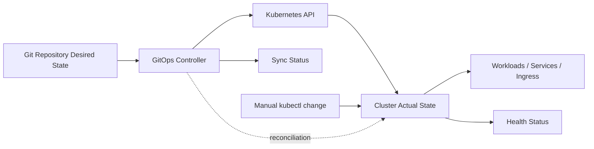
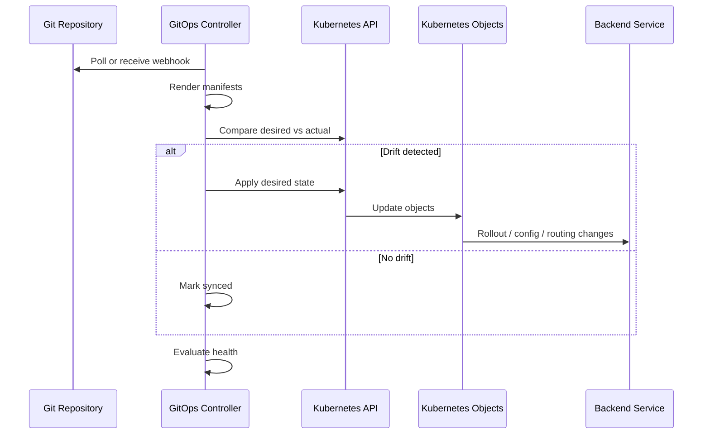
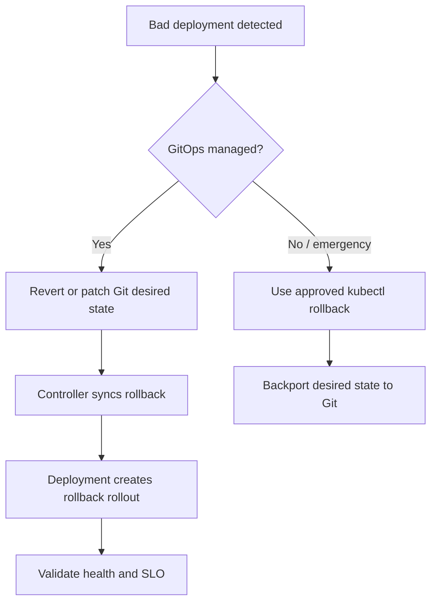

# Part 054 — GitOps Operations

## Tujuan

GitOps menjadikan Git sebagai source of truth untuk state Kubernetes. Untuk backend engineer, konsekuensinya besar:

- perubahan manual di cluster bisa dianggap drift dan dikembalikan otomatis
- rollback production seharusnya melalui Git, bukan sekadar `kubectl rollout undo`
- manifest yang berjalan bisa berasal dari Helm/Kustomize/rendered output, bukan file mentah yang terlihat di PR
- health workload tidak selalu sama dengan sync status
- incident mitigation harus mempertimbangkan reconciliation loop GitOps

Part ini membahas GitOps dari sudut pandang senior backend engineer yang perlu men-debug deployment, drift, rollout, config, secret reference, sync wave, dan rollback tanpa merusak source of truth.

---

## 1. GitOps Mental Model



GitOps controller continuously compares:

- desired state in Git
- actual state in Kubernetes

Then it reconciles drift depending on policy.

Core principle:

> In a GitOps-managed cluster, the correct operational question is not only "what is in the cluster?" but also "what does GitOps think should be in the cluster?"

---

## 2. Desired State vs Actual State vs Runtime Health

| Concept | Meaning | Example |
|---|---|---|
| Desired state | What Git declares | Deployment replicas = 4 |
| Actual state | What Kubernetes currently has | Deployment replicas = 2 |
| Sync status | Whether GitOps sees cluster matching Git | OutOfSync |
| Health status | Whether object is healthy | Deployment degraded |
| Runtime health | Whether app works | API 5xx spike |

A workload can be:

- Synced but unhealthy
- OutOfSync but healthy
- Healthy in Kubernetes but broken at application level
- Degraded because child resource failed
- Stuck because GitOps cannot apply manifest

Do not equate `Synced` with production-safe.

---

## 3. Backend Engineer Responsibility

Backend service owner is responsible for:

- understanding which repo/path owns their workload
- reviewing manifest changes before merge
- understanding rendered Helm/Kustomize output
- checking sync and health status after deployment
- avoiding manual changes that GitOps will revert
- coordinating rollback through Git when required
- ensuring labels/annotations support ownership and observability
- understanding sync wave/order for dependencies such as migration jobs
- checking config/secret references without exposing secret values
- escalating GitOps controller/platform issues appropriately

Backend engineer should not assume:

- `kubectl apply` manual fix will persist
- `kubectl rollout undo` is enough in GitOps-managed workload
- Git file equals rendered manifest
- GitOps health means application SLO is healthy
- drift is harmless
- sync failure is only platform issue

---

## 4. Platform/SRE Responsibility

Platform/SRE usually owns:

- GitOps controller installation and upgrades
- Argo CD/Flux access model
- application/project configuration
- sync policy defaults
- repository credentials
- cluster credentials
- admission/policy integration
- RBAC around sync/rollback
- platform-level health customizations
- controller observability

Backend teams usually own the application manifests and safe rollout semantics.

---

## 5. Common GitOps Tools

### Argo CD awareness

Argo CD concepts backend engineers should recognize:

- Application
- Project
- Source repo/path/chart
- Destination cluster/namespace
- Sync status
- Health status
- Sync policy
- Auto-sync
- Prune
- Self-heal
- Sync waves
- Hooks
- Diff
- History

### Flux awareness

Flux concepts backend engineers should recognize:

- SourceController
- Kustomization
- HelmRelease
- HelmRepository
- GitRepository
- Image automation
- Reconciliation interval
- Suspend/resume
- Health checks
- Drift correction

You do not need to administer the controller, but you need to understand how it affects your service runtime.

---

## 6. GitOps Reconciliation Loop



Operational implication:

- manual changes may be overwritten
- failed apply blocks sync
- invalid manifest blocks rollout
- policy rejection blocks reconciliation
- rendered output matters more than source fragment

---

## 7. Sync Status

Common statuses:

| Status | Meaning | Operational interpretation |
|---|---|---|
| Synced | Actual matches desired | Not necessarily healthy |
| OutOfSync | Actual differs from desired | Drift or pending change |
| Unknown | Controller cannot determine | Access/source/controller issue |
| SyncFailed | Apply failed | Manifest/policy/API problem |

For backend debugging, ask:

- What changed in Git?
- Has the GitOps controller applied it?
- Did apply succeed?
- Which resource is out of sync?
- Is drift intentional or accidental?
- Is auto-sync enabled?

---

## 8. Health Status

Health is resource-dependent.

Examples:

- Deployment healthy if desired replicas are available
- Service health may be neutral/unknown
- Ingress health may depend on controller integration
- Job health may be progressing/succeeded/failed
- Custom resources may require custom health rules

A GitOps application can be degraded because:

- Deployment rollout failed
- Job failed
- PVC pending
- Ingress rejected
- HPA invalid
- CRD/controller missing
- hook failed
- child resource unhealthy

Always inspect the degraded child object.

---

## 9. Drift

Drift means actual cluster state differs from Git desired state.

Sources of drift:

- manual `kubectl edit`
- emergency patch
- controller mutation
- admission webhook mutation
- defaulted fields
- generated fields
- HPA changing replica count
- cert-manager updating certificate status
- external-secrets updating Secret
- Helm/Kustomize rendering difference

Not all drift is bad. Some drift is expected and should be ignored or configured properly.

Dangerous drift:

- image tag differs from Git
- resource requests/limits changed manually
- env var/config changed manually
- Service selector changed manually
- Ingress route changed manually
- NetworkPolicy/RBAC changed manually
- secret reference changed manually

---

## 10. Manual Change Risk

In GitOps production, manual change can fail in two ways:

1. It is reverted by GitOps, so mitigation disappears.
2. It creates unexplained drift, so future releases behave unexpectedly.

Example:

```bash
kubectl scale deployment quote-api --replicas=8 -n prod
```

If Git says replicas = 4 and self-heal is enabled, GitOps may scale it back.

Safer options:

- change Git and sync
- use approved emergency override
- suspend reconciliation if platform process allows
- document manual change with incident context
- revert manual change through Git after incident

---

## 11. Auto-Sync, Prune, and Self-Heal

### Auto-sync

Controller automatically applies Git changes.

Risk:

- bad merge deploys quickly
- config mistake propagates
- insufficient approval gate

### Prune

Controller deletes resources no longer in Git.

Risk:

- accidental resource deletion
- old blue/green resources removed too early
- completed Jobs pruned before evidence captured

### Self-heal

Controller corrects manual drift.

Risk:

- emergency manual patch reverted
- HPA/replica changes conflict if not ignored properly

Backend engineers must know which of these are enabled for their application.

---

## 12. Rollback Through Git

In GitOps, preferred rollback is usually:

1. Revert Git commit.
2. Merge through approved process.
3. Let GitOps reconcile.
4. Verify rollout and runtime health.



If emergency rollback is done manually, Git must be updated quickly or GitOps may redeploy the bad state.

---

## 13. Why `kubectl rollout undo` Can Be Dangerous Under GitOps

`kubectl rollout undo` changes cluster actual state, not Git desired state.

If Git still points to the bad version:

- GitOps may re-apply bad image
- application returns to failing state
- incident becomes confusing
- audit trail splits between Git and cluster

Use manual rollout undo only when:

- Git rollback path is too slow for incident severity
- authority is clear
- reconciliation is paused or Git is updated immediately
- evidence is captured

---

## 14. GitOps and Deployment Markers

GitOps should leave traceable release metadata:

- Git commit SHA
- image digest
- app version
- chart version
- deployment timestamp
- release actor/system
- environment
- change ticket

Useful annotations:

```yaml
metadata:
  annotations:
    app.example.com/git-sha: "abc1234"
    app.example.com/image-digest: "sha256:..."
    app.example.com/change-id: "CHG-12345"
```

These support incident timeline reconstruction.

---

## 15. Rendered Manifest Matters

Backend engineers often review source files, but Kubernetes receives rendered manifests.

Rendering sources:

- Helm chart + values
- Kustomize base + overlays
- Jsonnet/CUE/custom templating
- CI-generated manifests
- image automation updates

Always ask:

- what exact image tag/digest is rendered?
- what env vars are rendered?
- what resource values are rendered?
- which namespace is rendered?
- are labels/selectors correct after templating?
- are secret/config names correct?

A PR can look safe while rendered production output is wrong due to values/overlay behavior.

---

## 16. Sync Waves and Ordering

Some changes must happen in order:

- namespace before resources
- CRD before CR
- Secret/ConfigMap before Deployment
- migration Job before app Deployment
- app before route exposure
- NetworkPolicy after service labels exist

Argo CD sync waves are one way to express order.

Example conceptual ordering:

```text
wave -2: namespace, RBAC
wave -1: secrets/config/external secret
wave  0: migration job
wave  1: deployment/service
wave  2: ingress/gateway/hpa/pdb
```

Risk:

- app deploys before migration
- route exposes app before readiness path is correct
- policy blocks migration job
- secret not synced before pod starts

---

## 17. GitOps Hooks

Hooks can run tasks during sync, such as migration jobs.

Operational concerns:

- hook retry behavior
- hook deletion policy
- evidence retention
- idempotency
- failure impact on sync
- timeout
- ordering with deployment
- rollback semantics

For high-risk DB migration, do not hide complexity behind hooks without explicit runbook and observability.

---

## 18. GitOps with Helm

Argo CD/Flux can deploy Helm charts.

Check:

- chart version
- app version
- values files
- environment-specific overrides
- secret values handling
- helm hooks
- rendered diff
- release history
- rollback policy

Risk:

- chart default changes unexpectedly
- values hierarchy overrides production incorrectly
- appVersion and image tag diverge
- secret values appear in Git or logs
- hook Job runs unexpectedly

---

## 19. GitOps with Kustomize

Check:

- base path
- overlay path
- patches
- image overrides
- namePrefix/nameSuffix
- namespace transformation
- configMapGenerator behavior
- secretGenerator behavior
- commonLabels impact on selectors

Risk:

- selector labels changed accidentally by commonLabels
- generated ConfigMap name triggers rollout unexpectedly
- overlay drift across environments
- production patch missing from lower env
- namespace injected incorrectly

---

## 20. GitOps and Secrets

GitOps should not expose secret values.

Common approaches:

- External Secrets Operator
- Secrets Store CSI Driver
- sealed secrets
- SOPS-encrypted secrets
- cloud secret references

Operational questions:

- does Git store values or references?
- who can decrypt?
- does secret rotation trigger pod restart?
- what happens if external secret sync fails?
- does GitOps health reflect secret sync failure?
- is secret diff suppressed safely?

Never paste decoded production secrets into incident notes or chat.

---

## 21. GitOps and HPA/Replica Drift

HPA changes replicas dynamically. Git may declare initial replica count.

Potential drift:

- Git says replicas = 3
- HPA scales to 8
- GitOps sees replicas = 8 as drift

Correct setup should ignore replica drift when HPA owns scaling, or avoid managing replicas directly after HPA creation depending on tool policy.

Verify internal standard.

---

## 22. GitOps and Emergency Mitigation

Emergency mitigation may require action faster than normal PR flow.

Examples:

- scale up replicas
- disable route
- rollback image
- patch config
- pause rollout
- block egress
- increase timeout temporarily

GitOps-safe emergency process should define:

- who can authorize
- whether reconciliation can be suspended
- whether manual patch is allowed
- how Git is updated afterward
- how evidence is captured
- how temporary workaround is removed

No emergency path means engineers improvise during outage.

---

## 23. Production-Safe Investigation Commands

Read-only commands:

```bash
kubectl get applications -A          # if Argo CD CRDs are accessible
kubectl get kustomizations -A        # if Flux CRDs are accessible
kubectl get helmreleases -A          # if Flux Helm controller is used
kubectl get deploy,rs,pod,svc,ingress -n <namespace>
kubectl describe deployment <name> -n <namespace>
kubectl get events -n <namespace> --sort-by=.lastTimestamp
```

For app resources:

```bash
kubectl get deployment <name> -n <namespace> -o yaml
kubectl rollout status deployment/<name> -n <namespace>
kubectl rollout history deployment/<name> -n <namespace>
```

Avoid without approval:

- `kubectl edit` production resources
- manual `kubectl apply` against GitOps-managed resource
- `kubectl delete` resource to force recreation
- `kubectl rollout undo` without Git update/reconciliation plan
- pausing/suspending GitOps controller outside process

---

## 24. Common Failure: OutOfSync

Possible causes:

- Git change not applied yet
- manual drift
- apply failed
- admission policy rejection
- immutable field change
- missing CRD
- namespace missing
- Helm/Kustomize render changed
- generated field diff noise

Debug sequence:

1. Identify resource out of sync.
2. Compare desired vs live diff.
3. Determine whether drift is expected.
4. Check apply/sync error.
5. Check admission/policy event.
6. Check whether manual patch occurred.
7. Fix desired state or ignore rule through approved path.

---

## 25. Common Failure: Synced but Application Broken

Possible causes:

- manifest applied successfully but bad app logic
- config valid syntactically but wrong semantically
- dependency unavailable
- secret value wrong but reference exists
- readiness too shallow
- HPA/resource issue
- ingress route correct but backend errors

Debug sequence:

1. Check deployment rollout.
2. Check pod health and logs.
3. Check app metrics and traces.
4. Check dependency dashboard.
5. Check recent Git commit/change.
6. Check config/secret version.
7. Decide rollback or forward fix.

`Synced` means Kubernetes state matches Git. It does not mean the business flow works.

---

## 26. Common Failure: Degraded Health

Possible causes:

- rollout stuck
- pod pending
- CrashLoopBackOff
- ImagePullBackOff
- failed Job/hook
- PVC pending
- Service has no endpoint
- custom health rule failure

Debug sequence:

1. Identify degraded child resource.
2. Use Kubernetes events.
3. Inspect object status/conditions.
4. Check controller logs if platform-owned and accessible.
5. Fix source of failure in Git or escalate.

---

## 27. Common Failure: Manual Fix Reverted

Symptom:

- engineer patches production resource
- issue temporarily improves
- issue returns
- GitOps event shows reconciliation

Root cause:

- Git desired state still contains old/bad value
- self-heal reverted actual state

Mitigation:

- apply fix through Git
- suspend reconciliation only through approved process
- document incident workaround
- remove temporary divergence cleanly

---

## 28. GitOps Rollback Runbook

### Normal rollback

1. Identify bad Git commit or chart/value change.
2. Confirm DB migration compatibility before rollback.
3. Revert Git commit or patch desired image/config.
4. Merge through approved process.
5. Trigger or wait for GitOps sync.
6. Watch rollout status.
7. Validate dashboard, logs, traces, and business flows.
8. Capture incident evidence.

### Emergency rollback

1. Confirm severity requires immediate action.
2. Coordinate with incident commander/platform owner.
3. Apply approved emergency rollback or pause GitOps if required.
4. Update Git desired state immediately after.
5. Confirm GitOps no longer wants the bad state.
6. Validate runtime and capture evidence.

---

## 29. GitOps PR Review Checklist

Review GitOps change for:

- correct repo/path/environment
- rendered manifest output
- image tag/digest
- resource request/limit changes
- replica/HPA interaction
- ConfigMap/Secret reference
- Service selector and labels
- Ingress/Gateway route
- NetworkPolicy/RBAC change
- migration Job ordering
- sync wave/hook behavior
- prune impact
- rollback path
- deployment marker annotations
- observability labels
- approval and audit metadata

---

## 30. Internal Verification Checklist

Verify internally:

- GitOps tool used: Argo CD, Flux, or other
- repo structure and ownership
- app/project naming convention
- environment promotion model
- auto-sync policy
- prune policy
- self-heal policy
- manual change policy
- emergency override process
- sync wave/hook standard
- Helm/Kustomize rendering process
- secret management approach
- rollback through Git process
- GitOps dashboard location
- alerting for sync/health failures
- access/RBAC for sync and rollback
- incident evidence requirements

---

## 31. Anti-Patterns

- manual `kubectl edit` as normal deployment process
- rollback with `kubectl rollout undo` while Git still has bad image
- no rendered manifest review
- config/secret reference changed without runtime validation
- auto-sync enabled with weak review gate for production
- prune enabled without understanding cleanup impact
- migration hook hidden in Helm chart without runbook
- HPA replica drift not handled
- GitOps health treated as application SLO
- no emergency override process
- no deployment metadata linking workload to Git commit
- completed migration evidence pruned too early

---

## 32. Practical Mental Model

GitOps adds another reconciliation loop above Kubernetes.

Kubernetes reconciles objects inside the cluster. GitOps reconciles the cluster against Git.

For backend engineers, this changes production operations:

- fix source of truth, not only runtime symptom
- inspect rendered desired state, not only source fragments
- treat manual patches as temporary and risky
- rollback through Git unless emergency process says otherwise
- separate sync health from application health
- coordinate migration/order/secret/config through controlled reconciliation

A GitOps-aware backend engineer can debug production without fighting the platform automation.
