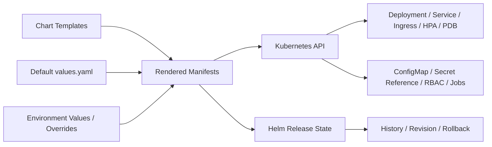
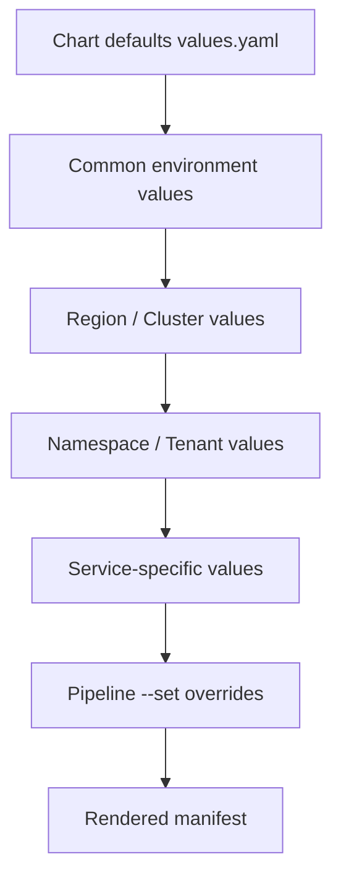
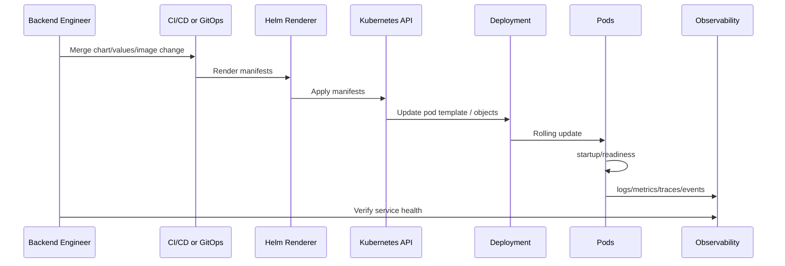
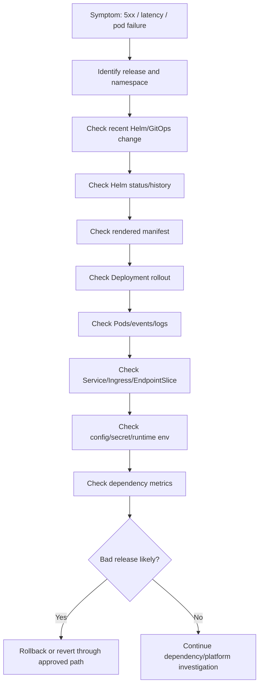

# Part 055 — Helm Operations

## Tujuan

Helm sering menjadi layer packaging di atas Kubernetes manifest. Untuk backend engineer, Helm bukan sekadar `helm install` atau `helm upgrade`. Helm adalah mekanisme yang dapat mengubah banyak object Kubernetes sekaligus: Deployment, Service, Ingress, HPA, PDB, ConfigMap, Secret reference, ServiceAccount, RBAC, NetworkPolicy, Job hook, dan annotation operasional.

Dalam production enterprise, risiko terbesar Helm bukan syntax template, tetapi perubahan tidak terlihat dari kombinasi:

- chart template
- `values.yaml`
- values per environment
- override dari pipeline
- rendered manifest
- GitOps reconciliation
- release history
- hook execution
- secret/config reference
- rollback semantics

Part ini membahas Helm sebagai operational release layer untuk backend service owner.

Fokusnya bukan menjadi chart maintainer penuh, tetapi mampu membaca, mereview, men-debug, dan mengoperasikan Helm release secara production-safe.

---

## 1. Helm Mental Model



Helm combines chart templates and values into rendered Kubernetes manifests.

Operationally, the important artifact is not only the chart source, but the rendered output that will be applied to the cluster.

Backend engineer should always reason through three layers:

| Layer | Question |
|---|---|
| Chart template | What Kubernetes objects can this chart generate? |
| Values | What environment-specific behavior is being selected? |
| Rendered manifest | What will Kubernetes actually receive? |

A Helm chart can be clean, but a bad value can still create production failure.

---

## 2. Why Helm Matters for Backend Engineers

Backend service owners often touch Helm indirectly through values:

- image repository/tag/digest
- replica count
- resource request/limit
- environment variables
- ConfigMap data
- Secret references
- readiness/liveness/startup probes
- ingress host/path/TLS annotations
- service port/targetPort
- HPA settings
- PDB settings
- service account
- RBAC rules
- NetworkPolicy rules
- migration Job enablement
- deployment annotations
- labels for observability/cost/ownership

That means a backend PR that “only changes values” can still change production behavior.

Examples:

| Values change | Possible impact |
|---|---|
| `resources.limits.memory` reduced | OOMKilled |
| `readinessProbe.path` changed | Service has no endpoint |
| `service.targetPort` changed | Ingress 502/503 |
| `ingress.annotations` changed | Timeout/body-size/TLS issue |
| `hpa.maxReplicas` increased | DB connection exhaustion |
| `migration.enabled=true` | Schema change side effect |
| `serviceAccount.name` changed | Cloud access denied |
| `networkPolicy.egress` tightened | Dependency timeout |

---

## 3. Helm Release Concepts

Important objects and terms:

| Concept | Meaning | Operational relevance |
|---|---|---|
| Chart | Package of templates and defaults | Defines possible Kubernetes objects |
| Chart version | Version of chart package | Template behavior may change |
| App version | Version of application | Usually app artifact version, not always image tag |
| Values | Input configuration | Environment/runtime behavior |
| Release | Installed instance of a chart | Runtime deployment unit |
| Revision | Release history entry | Rollback target |
| Upgrade | Apply new rendered manifests | Can trigger rollout and hooks |
| Rollback | Revert to prior release revision | May not undo external side effects |
| Hook | Lifecycle resource run by Helm | Migration/test/cleanup risk |
| Rendered manifest | Final Kubernetes YAML | Must be reviewed for production |

Do not confuse chart version and app version.

A chart version change can alter manifests even if app image stays the same.
An app image change can alter runtime behavior even if chart version stays the same.

---

## 4. Backend Engineer Responsibility

Backend engineer is responsible for understanding how Helm changes affect their service.

Specifically:

- know which chart/release owns the workload
- know which values files apply to each environment
- review rendered output for production-impacting changes
- verify image tag/digest and deployment metadata
- review resource/probe/HPA/PDB changes
- ensure service/ingress/port changes match application behavior
- verify config and secret references
- understand migration hooks and Jobs if chart includes them
- know rollback path and rollback limitations
- verify post-deployment runtime health
- escalate chart/platform issues when outside application ownership

Backend engineer should not casually:

- change chart templates without understanding all environments
- use values to hide environment-specific hacks
- put secret values into `values.yaml`
- rely only on Helm release status for application health
- rollback database migrations through Helm without compatibility analysis
- assume Helm rollback equals business rollback

---

## 5. Platform/SRE Responsibility

Platform/SRE commonly owns:

- Helm installation model
- chart repository access
- release automation
- environment promotion workflow
- GitOps integration
- chart standards
- security policy for chart templates
- admission policy integration
- cluster-level RBAC around Helm
- chart registry availability
- release audit trail

Backend team usually owns:

- service-specific values
- application image version
- application runtime config
- service readiness behavior
- dependency settings
- resource sizing input
- observability labels/annotations
- production validation

Boundary rule:

> If the Helm change modifies application behavior, backend team owns understanding it. If it modifies platform primitives or cross-tenant policy, platform/SRE/security must be involved.

---

## 6. Helm in GitOps Environments

Helm can be used in several ways:

1. Human or pipeline runs `helm upgrade` directly.
2. GitOps controller renders Helm chart and applies manifests.
3. GitOps controller manages a `HelmRelease` custom resource.
4. CI renders Helm output and commits generated manifests.
5. Platform pipeline packages chart, app pipeline updates values.

Operational implications:

| Model | Rollback style |
|---|---|
| Direct Helm | `helm rollback` may be used by authorized operator |
| GitOps with Helm source | rollback through Git values/chart revision |
| Flux HelmRelease | update/suspend/reconcile HelmRelease through Git |
| Rendered manifest committed | rollback generated manifest commit |

In GitOps, direct `helm rollback` may be overwritten by reconciliation if Git still declares the bad desired state.

---

## 7. Helm Rendered Manifest Review

Rendered manifest review is mandatory for production-grade Helm changes.

Useful local workflow:

```bash
helm template quote-order ./chart \
  -f values.yaml \
  -f values-prod.yaml \
  --namespace quote-order-prod \
  > rendered.yaml
```

Then review:

```bash
kubectl diff -f rendered.yaml --server-side
```

Or with plugin/tooling where allowed:

```bash
helm diff upgrade quote-order ./chart \
  -f values.yaml \
  -f values-prod.yaml \
  --namespace quote-order-prod
```

Review rendered output for:

- Deployment image and annotations
- resource request/limit
- probes
- env vars
- ConfigMap/Secret references
- Service selector and targetPort
- Ingress host/path/TLS/annotations
- HPA/PDB
- ServiceAccount/RBAC
- NetworkPolicy
- Jobs/hooks
- labels/annotations
- object deletion/prune behavior

Do not review only `values.yaml` if the chart template logic is non-trivial.

---

## 8. Helm Values Hierarchy

Values may come from multiple sources:



Common value sources:

- chart default `values.yaml`
- `values-dev.yaml`
- `values-test.yaml`
- `values-staging.yaml`
- `values-prod.yaml`
- customer/tenant overlays
- region-specific values
- pipeline `--set`
- GitOps Application values
- Flux `HelmRelease.spec.values`
- secret-backed values mechanism

Operational risk:

- the value you see in one file may be overridden elsewhere
- pipeline override may not be visible in PR
- production may use a different value file combination
- environment drift may hide real behavior
- chart default may change after chart version upgrade

---

## 9. Chart Version vs App Version

Example metadata:

```yaml
apiVersion: v2
name: quote-order-service
version: 2.4.1
appVersion: 1.18.7
```

Interpretation:

- `version`: chart package version
- `appVersion`: application version metadata

But actual image may be defined separately:

```yaml
image:
  repository: registry.example.com/quote-order-service
  tag: "1.18.7"
  digest: "sha256:..."
```

Review questions:

- Did the app version change?
- Did the image tag/digest change?
- Did the chart version change?
- Did templates change even if values did not?
- Did values change even if chart/app version did not?
- Does deployment annotation include Git commit/build ID?

A chart upgrade can break production without any code change.

---

## 10. Helm Upgrade Operational Flow



Operational gates:

1. Render succeeds.
2. Diff is reviewed.
3. Kubernetes apply succeeds.
4. Deployment rollout succeeds.
5. Pods become ready.
6. Service has endpoints.
7. Ingress route works.
8. App metrics remain healthy.
9. Dependency metrics remain healthy.
10. Business flow validation passes.

Helm release success is not the final gate.

---

## 11. Safe Pre-Deployment Review

Before approving a Helm change, ask:

### Scope

- Which release is affected?
- Which namespace/environment is affected?
- Is this shared chart used by other services?
- Is this template change or values-only change?
- Is this production or non-production?

### Runtime impact

- Will pod template hash change?
- Will rollout be triggered?
- Will Service/Ingress route change?
- Will HPA/PDB/resource behavior change?
- Will config/secret references change?
- Will RBAC/NetworkPolicy change?
- Will migration hooks run?

### Safety

- Is there a rollback path?
- Is DB/schema compatible?
- Is smoke test defined?
- Are dashboards/alerts ready?
- Is deployment marker included?
- Has rendered diff been reviewed?

---

## 12. Helm Values Review for Java/JAX-RS Services

For Java/JAX-RS services, review values such as:

```yaml
replicaCount: 4

image:
  repository: registry.example.com/quote-order-api
  tag: "2026.07.12-abc123"

resources:
  requests:
    cpu: "500m"
    memory: "1Gi"
  limits:
    memory: "2Gi"

java:
  opts: "-XX:MaxRAMPercentage=70 -XX:+ExitOnOutOfMemoryError"

readinessProbe:
  httpGet:
    path: /health/ready
    port: management

livenessProbe:
  httpGet:
    path: /health/live
    port: management

ingress:
  enabled: true
  host: quote-order.example.internal
  annotations:
    nginx.ingress.kubernetes.io/proxy-read-timeout: "60"
```

Review for:

- memory limit aligns with JVM heap/native memory
- probe path exists and does not depend on fragile downstream checks
- management port matches container port
- readiness timeout fits startup behavior
- ingress timeout fits request SLA
- replica count fits DB/broker capacity
- HPA max replica fits pool sizing

---

## 13. Service and Port Review

A small Helm value mistake can break routing:

```yaml
service:
  port: 80
  targetPort: http

containerPorts:
  http: 8080
  management: 8081
```

Failure modes:

- Service points to wrong targetPort
- named port missing from container spec
- Ingress backend points to wrong service port
- readiness probe uses app port but endpoint is on management port
- targetPort changes without app container change
- multiple containers expose confusing port names

Production symptom:

- Service has endpoints but traffic fails
- Ingress 502/503
- readiness failure
- connection refused from ingress/controller

Safe review:

```bash
kubectl get svc -n <namespace> <service> -o yaml
kubectl get endpointslice -n <namespace> -l kubernetes.io/service-name=<service>
kubectl describe ingress -n <namespace> <ingress>
```

---

## 14. Probe Values Review

Helm charts often expose probe values.

Bad probe values can cause:

- rollout stuck
- service has no endpoint
- restart loop
- traffic blackhole
- false healthy pods
- cascading incident during dependency outage

Review:

```yaml
startupProbe:
  failureThreshold: 30
  periodSeconds: 10

readinessProbe:
  timeoutSeconds: 2
  periodSeconds: 5
  failureThreshold: 3

livenessProbe:
  timeoutSeconds: 2
  periodSeconds: 10
  failureThreshold: 3
```

Questions:

- Is startupProbe used for slow Java startup?
- Is readiness separated from liveness?
- Does liveness avoid deep dependency checks?
- Are timeouts realistic under CPU throttling?
- Does readiness fail closed when service cannot accept traffic?
- Does probe path match actual JAX-RS/management endpoint?

---

## 15. Resource Values Review

Resource changes are production-sensitive.

Review:

```yaml
resources:
  requests:
    cpu: 500m
    memory: 1Gi
  limits:
    cpu: 1000m
    memory: 2Gi
```

Key questions:

- Is CPU request based on real usage?
- Is CPU limit intentionally set or inherited by policy?
- Is memory limit enough for heap + native memory?
- Does HPA CPU target require CPU request?
- Will higher requests cause pods Pending?
- Will lower requests increase node pressure or noisy-neighbor risk?
- Does LimitRange mutate defaults silently?

For Java services, always connect Helm resource values with JVM flags.

---

## 16. HPA Values Review

Example:

```yaml
hpa:
  enabled: true
  minReplicas: 3
  maxReplicas: 20
  targetCPUUtilizationPercentage: 70
```

Review impact:

- max replicas times DB pool size
- max replicas times Kafka/RabbitMQ connections
- max replicas vs Kafka partition count
- min replicas vs PDB requirement
- CPU request required for CPU-based HPA
- scale-up delay vs traffic burst
- scale-down stabilization vs cost

Dangerous pattern:

```yaml
hpa:
  maxReplicas: 50

app:
  dbPoolMaxSize: 30
```

This can create up to 1500 DB connections.

---

## 17. PDB Values Review

Example:

```yaml
pdb:
  enabled: true
  minAvailable: 2
```

Review:

- Does replica count support this PDB?
- What happens during node drain?
- What happens during cluster upgrade?
- Is single-replica workload protected incorrectly?
- Does PDB block voluntary disruption?
- Does HPA min replica align with PDB?

Bad combination:

```yaml
replicaCount: 1
pdb:
  minAvailable: 1
```

This can block voluntary eviction and complicate upgrades without providing real HA.

---

## 18. Ingress Values Review

Ingress-related values often hide high-impact changes:

```yaml
ingress:
  enabled: true
  className: nginx
  hosts:
    - host: quote-order.example.internal
      paths:
        - path: /api/quotes
          pathType: Prefix
  tls:
    - secretName: quote-order-tls
      hosts:
        - quote-order.example.internal
  annotations:
    nginx.ingress.kubernetes.io/proxy-read-timeout: "60"
    nginx.ingress.kubernetes.io/proxy-body-size: "10m"
```

Review:

- host/path ownership
- path rewrite behavior
- TLS secret reference
- ingressClass
- timeout annotations
- body size
- backend protocol
- auth/rate-limit annotations
- conflict with other ingress routes

Failure modes:

- 404 due to route mismatch
- 502 due to protocol mismatch
- 503 due to no endpoint
- 504 due to timeout mismatch
- TLS error due to wrong secret/cert

---

## 19. ConfigMap and Secret Reference Review

Helm values may create ConfigMaps and reference Secrets.

Safe pattern:

```yaml
env:
  QUOTE_TIMEOUT_MS: "3000"
  REDIS_HOST: "redis.internal"

secretRefs:
  database:
    name: quote-order-db-credentials
    keys:
      username: username
      password: password
```

Risky pattern:

```yaml
secrets:
  dbPassword: "plaintext-password"
```

Review:

- Are secret values stored in Git?
- Are values encrypted or externally sourced?
- Does chart create Kubernetes Secret directly?
- Does Secret already exist?
- Does service account have permission to external secret source?
- Does pod restart when config/secret changes?
- Is config environment-specific?

Do not copy secret values into issue tickets, PR comments, logs, or screenshots.

---

## 20. ServiceAccount and RBAC Values Review

Helm charts often support:

```yaml
serviceAccount:
  create: true
  name: quote-order-api
  annotations:
    eks.amazonaws.com/role-arn: arn:aws:iam::123456789012:role/quote-order-api

rbac:
  create: true
```

Review:

- Is ServiceAccount stable across deployment?
- Are annotations required for IRSA/Azure Workload Identity?
- Did the name change?
- Is `automountServiceAccountToken` needed?
- Are RBAC permissions least privilege?
- Does chart accidentally create ClusterRole?
- Does changing SA break cloud credential chain?

A ServiceAccount value change can cause access denied to AWS Secrets Manager, S3, Azure Key Vault, queues, or other cloud services.

---

## 21. NetworkPolicy Values Review

Example:

```yaml
networkPolicy:
  enabled: true
  egress:
    database: true
    kafka: true
    redis: true
    dns: true
```

Review:

- Is default deny enabled?
- Is DNS egress allowed?
- Are DB/broker/cache egress rules present?
- Are namespace labels correct?
- Are pod selectors correct?
- Are cloud/private endpoint CIDRs correct?
- Does policy match CNI behavior?

NetworkPolicy changes often manifest as timeouts, not explicit permission errors.

---

## 22. Helm Hooks and Migration Jobs

Helm hooks can create resources during lifecycle events:

- `pre-install`
- `post-install`
- `pre-upgrade`
- `post-upgrade`
- `pre-rollback`
- `post-rollback`
- `test`

Operational risk:

- migration hook runs automatically during upgrade
- hook failure blocks release
- hook succeeds but app rollout fails
- hook side effects are not undone by rollback
- hook resources are deleted before evidence is captured
- hook order differs from expected deployment sequence

Example annotation:

```yaml
metadata:
  annotations:
    "helm.sh/hook": pre-upgrade
    "helm.sh/hook-weight": "10"
    "helm.sh/hook-delete-policy": before-hook-creation,hook-succeeded
```

Backend review questions:

- Does this hook mutate database state?
- Is migration backward compatible?
- Is the hook idempotent?
- What happens if the hook partially fails?
- Are logs retained long enough?
- Is rollback safe after hook execution?

---

## 23. Helm Release Status

Useful command:

```bash
helm status <release> -n <namespace>
```

It can show:

- release name
- namespace
- status
- revision
- last deployment time
- notes
- resources
- hooks

Common statuses:

| Status | Meaning | Operational interpretation |
|---|---|---|
| deployed | release applied | not necessarily app healthy |
| failed | install/upgrade failed | inspect events/resources/hooks |
| pending-install | install in progress/stuck | check locks/hooks/API |
| pending-upgrade | upgrade in progress/stuck | avoid concurrent upgrade |
| pending-rollback | rollback in progress/stuck | check release lock and resources |
| superseded | old revision replaced | possible rollback target |
| uninstalled | release removed | object cleanup depends on policy |

Helm status is a release signal, not an SLO signal.

---

## 24. Helm History and Revision Review

```bash
helm history <release> -n <namespace>
```

Use it to answer:

- What was deployed before the incident?
- Which revision introduced the issue?
- Was a rollback already attempted?
- Did chart version or app version change?
- Who/what performed the upgrade?
- Is there a failed revision?

Pair Helm history with:

- Git commit history
- CI/CD deployment logs
- GitOps sync history
- Kubernetes deployment revision
- observability deployment markers
- incident timeline

---

## 25. Helm Rollback Semantics

```bash
helm rollback <release> <revision> -n <namespace>
```

Rollback can revert Kubernetes manifests tracked by Helm.

Rollback may not revert:

- database schema migrations
- external state mutation
- messages already published
- cache format changes
- data written by new code
- secret rotation
- cloud resource side effects
- manually changed resources
- resources controlled by another controller

Rollback safety checklist:

1. Confirm target revision.
2. Confirm app compatibility with current DB/schema.
3. Confirm config/secret compatibility.
4. Confirm dependency contract compatibility.
5. Confirm GitOps will not re-apply bad state.
6. Confirm rollout success after rollback.
7. Validate business flow.
8. Capture evidence.

---

## 26. Helm Diff Review Pattern

A useful review pattern:

```bash
helm diff upgrade <release> <chart> \
  -n <namespace> \
  -f values.yaml \
  -f values-prod.yaml
```

Review diff by object type:

### Deployment

- image
- env
- probes
- resources
- labels/annotations
- strategy
- service account
- volume mounts

### Service

- selector
- port
- targetPort
- type

### Ingress/Gateway

- host/path
- TLS
- annotations
- backend service

### HPA/PDB

- min/max replicas
- target metrics
- disruption budget

### RBAC/NetworkPolicy

- permission scope
- default deny impact
- egress allowlist

### ConfigMap/Secret references

- keys
- names
- mount paths
- envFrom usage

---

## 27. Common Failure: Failed Helm Upgrade

Symptoms:

- Helm release status `failed`
- deployment not updated
- partial objects updated
- hook failure
- admission policy rejection
- immutable field error
- invalid rendered manifest

Investigation:

```bash
helm status <release> -n <namespace>
helm history <release> -n <namespace>
kubectl get events -n <namespace> --sort-by=.lastTimestamp
kubectl get deploy,rs,pod,job -n <namespace> -l app.kubernetes.io/instance=<release>
```

Possible causes:

- invalid template rendering
- missing required value
- immutable Service field changed
- Job hook failed
- policy rejected privileged/invalid object
- RBAC denied to deployer/controller
- CRD missing
- timeout waiting for readiness

Mitigation:

- inspect failed resource
- fix values/chart in source
- avoid concurrent upgrades
- rollback only after understanding side effects
- escalate if platform-owned chart/controller issue

---

## 28. Common Failure: Pending Upgrade

Symptoms:

- release status `pending-upgrade`
- new upgrades blocked
- pipeline hangs or fails
- GitOps/Helm controller cannot reconcile

Possible causes:

- interrupted Helm operation
- hook still running
- Kubernetes API timeout
- lock in release secret/configmap
- controller crash during upgrade
- long rollout timeout

Investigation:

```bash
helm status <release> -n <namespace>
helm history <release> -n <namespace>
kubectl get jobs,pods -n <namespace> -l app.kubernetes.io/instance=<release>
kubectl get secret -n <namespace> -l owner=helm,name=<release>
```

Safe handling:

- do not blindly delete Helm release secrets
- identify whether hook/job is still active
- coordinate with platform/SRE if release state is locked
- capture evidence before cleanup
- recover through approved Helm/GitOps process

---

## 29. Common Failure: Rendered Manifest Different from Expected

Symptoms:

- PR value looks correct but pod has different env/resource
- production behavior differs from staging
- GitOps applies unexpected object
- template conditional enabled unexpected feature

Possible causes:

- values override order
- pipeline `--set`
- environment-specific file
- chart default changed
- templating conditional
- global values
- subchart values
- GitOps app-level override

Investigation:

1. Identify exact chart version.
2. Identify exact values files and override order.
3. Render locally using same inputs.
4. Compare rendered output to live object.
5. Compare live object to GitOps desired state.
6. Check pipeline logs for `--set` or generated values.

---

## 30. Common Failure: Secret Values Leaked Through Helm

Risk patterns:

- plaintext secret in values file
- secret printed by `helm template`
- secret shown in CI logs
- secret in Helm release secret history
- secret committed to Git
- secret exposed in PR diff

Safer approaches depend on internal standard:

- External Secrets Operator
- Secrets Store CSI Driver
- sealed/encrypted secrets
- cloud secret manager reference
- pipeline secret injection without logging
- chart references existing secret by name

Backend engineer checklist:

- never add plaintext secret to values
- verify chart does not render secret value into logs
- check whether Helm release stores rendered secrets
- follow internal secret management standard
- escalate suspected leakage immediately

---

## 31. Common Failure: Chart Template Change Breaks Multiple Services

Shared charts create shared blast radius.

Example:

- platform chart changes default readiness probe
- default securityContext changes
- default labels/selectors change
- ingress annotation template changes
- Service port naming template changes
- HPA template changes

Impact:

- many services roll out unexpectedly
- selectors break
- dashboards lose labels
- alerts break
- NetworkPolicy selectors mismatch
- traffic route changes

Mitigation:

- test chart upgrade with representative services
- require rendered diff per affected service
- version shared chart intentionally
- avoid changing selector labels casually
- document migration path
- coordinate rollout by environment

---

## 32. Common Failure: Helm Rollback Did Not Fix Incident

Possible reasons:

- bad state is outside Helm
- GitOps re-applied newer desired state
- database migration not reversible
- bad message/cache/data already produced
- dependency issue unrelated to release
- rollback target also bad
- ConfigMap/Secret external source unchanged
- HPA/replica/resource issue persists

Debug:

1. Confirm actual running image after rollback.
2. Confirm deployment revision and pod template.
3. Confirm Helm revision.
4. Confirm GitOps sync state.
5. Confirm config/secret runtime values.
6. Confirm schema/data compatibility.
7. Confirm app metrics and traces.

Rollback is a mitigation, not proof of root cause.

---

## 33. Helm and Java/JAX-RS Operational Readiness

For Java/JAX-RS workloads, Helm release review should verify:

- JVM options align with memory limit
- container port exposes JAX-RS runtime correctly
- management port exposes probes safely
- readiness/liveness/startup probes are separated
- graceful shutdown config matches termination grace period
- thread pool and DB pool values are documented
- HPA max replica does not exceed dependency capacity
- ingress timeout matches JAX-RS/API timeout
- deployment annotation includes commit/build ID
- logs/traces/metrics labels exist
- security context works with Java runtime and filesystem needs

---

## 34. Helm Operational Commands

Read-only or low-risk investigation commands:

```bash
helm list -n <namespace>
helm status <release> -n <namespace>
helm history <release> -n <namespace>
helm get values <release> -n <namespace>
helm get manifest <release> -n <namespace>
helm get hooks <release> -n <namespace>
```

Potentially changing commands; use only with authorization:

```bash
helm upgrade <release> <chart> -n <namespace> -f values.yaml
helm rollback <release> <revision> -n <namespace>
helm uninstall <release> -n <namespace>
```

Production rule:

> Prefer read-only inspection first. In GitOps environments, change desired state through approved Git workflow unless emergency procedure explicitly allows direct Helm action.

---

## 35. Helm PR Review Checklist

Review PR for:

- chart version change
- app/image tag or digest change
- values file changed for correct environment
- rendered manifest diff attached or generated by CI
- Deployment pod template changes
- Service selector/port/targetPort changes
- Ingress/Gateway host/path/TLS/annotation changes
- ConfigMap/Secret reference changes
- resource request/limit changes
- JVM option changes
- probe changes
- HPA/PDB changes
- ServiceAccount/RBAC changes
- NetworkPolicy changes
- hook/migration Job changes
- labels/annotations ownership changes
- deployment marker/commit annotation
- rollback path and limitation
- production validation plan

---

## 36. Incident Debugging Flow for Helm-Managed Workload



Important:

- do not start by editing live manifests
- identify whether Helm/GitOps will overwrite manual changes
- capture Helm revision in incident timeline
- correlate release timestamp with metrics and alerts

---

## 37. Internal Verification Checklist

Verify internally:

- Is Helm used directly, through CI/CD, or through GitOps?
- Which chart owns each backend service?
- Where are chart source and values stored?
- What values files apply to dev/test/staging/prod?
- Are there pipeline `--set` overrides?
- Is rendered manifest diff generated in PR?
- Is Helm diff plugin/tool allowed?
- Who can run Helm upgrade/rollback in production?
- How is Helm release history retained?
- Are hooks used for migrations/tests?
- Are hook logs retained?
- How are secrets handled in Helm?
- Is chart shared across multiple services?
- What is the rollback process under GitOps?
- Is there a standard chart for Java/JAX-RS services?
- Are labels/annotations standardized?
- Are SLO/deployment markers integrated?

---

## 38. Anti-Patterns

- reviewing only `values.yaml` without rendered manifest
- storing plaintext secrets in Helm values
- changing shared chart selector labels casually
- using Helm hooks for non-idempotent migrations without runbook
- assuming chart version and app version are the same
- using `helm rollback` in GitOps-managed production without updating Git
- increasing HPA max replicas without checking connection pools
- changing probes without understanding Java startup behavior
- hidden pipeline `--set` overrides not visible in PR
- no Helm history correlation in incident timeline
- no chart/version pinning
- no rollback validation
- treating `helm status deployed` as proof of service health

---

## 39. Practical Mental Model

Helm is a release packaging and rendering layer.

For backend engineers, the core operational discipline is:

1. Know which chart and values produce your workload.
2. Review rendered manifests, not only values.
3. Treat chart/template changes as production-impacting code.
4. Understand Helm release revision and rollback limitations.
5. Connect Helm changes to Kubernetes rollout, app health, dependency capacity, and GitOps source of truth.

A Helm-literate backend engineer can catch production risk before the cluster does.
