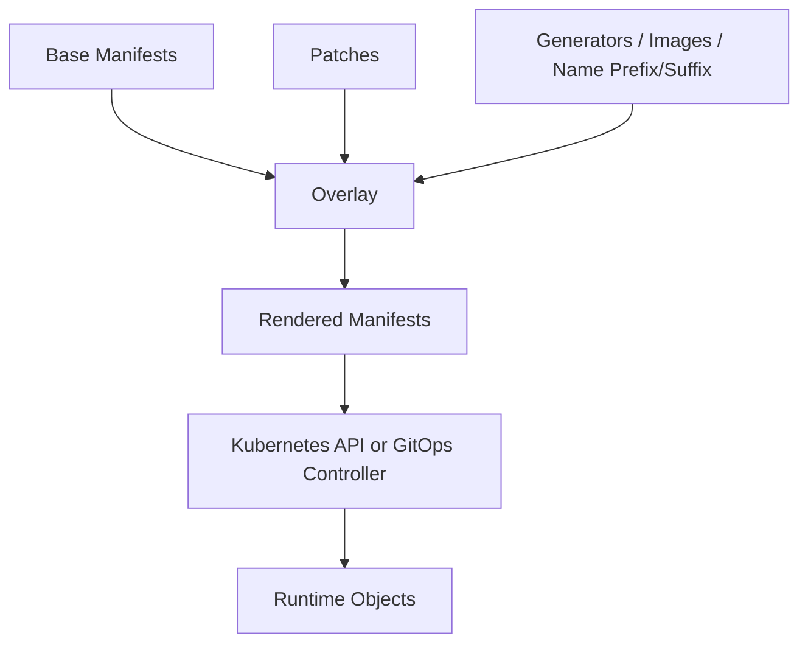
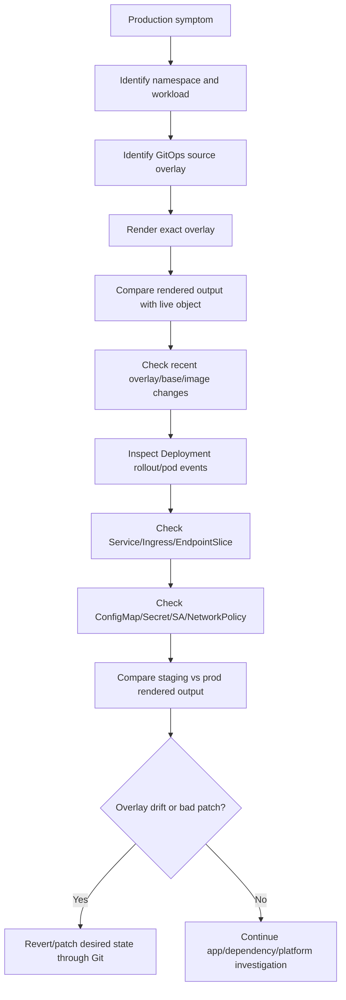

# Part 056 — Kustomize Operations

## Tujuan

Kustomize adalah mekanisme untuk mengelola manifest Kubernetes berbasis base dan overlay tanpa template language seperti Helm. Dalam production enterprise, Kustomize sering dipakai untuk menjaga manifest tetap eksplisit, tetapi tetap memungkinkan variasi per environment, region, cluster, tenant, atau customer.

Untuk backend engineer, risiko utama Kustomize bukan command `kubectl kustomize`, tetapi perubahan kecil pada overlay yang mengubah runtime behavior:

- image tag/digest
- replica count
- resource request/limit
- probes
- ConfigMap/Secret generation
- Service/Ingress patches
- HPA/PDB patches
- NetworkPolicy/RBAC patches
- labels/selectors
- namespace assignment
- environment-specific drift

Part ini membahas Kustomize sebagai operational configuration layer untuk backend services di Kubernetes.

---

## 1. Kustomize Mental Model



Kustomize starts with base manifests and applies overlays.

Core idea:

| Layer | Purpose |
|---|---|
| Base | Shared canonical Kubernetes objects |
| Overlay | Environment/cluster/customer-specific customization |
| Patch | Targeted mutation to existing objects |
| Generator | Generate ConfigMap/Secret from literals/files/env |
| Rendered output | Final manifest applied to cluster |

Like Helm, operational truth is the rendered manifest.

---

## 2. Why Kustomize Matters for Backend Engineers

Backend engineer may review or change Kustomize overlays for:

- app image promotion
- per-environment replica count
- resource tuning
- probe tuning
- env-specific config
- ingress host/path/TLS
- network policy egress
- service account annotation
- HPA scaling policy
- PDB availability policy
- deployment annotations
- migration Job enablement
- observability labels

A small overlay patch can change production behavior more directly than application code.

Example:

```yaml
patches:
  - path: patch-resources.yaml
    target:
      kind: Deployment
      name: quote-order-api
```

If `patch-resources.yaml` reduces memory limit, Java pods may start OOMKilled after merge.

---

## 3. Base and Overlay Structure

Typical structure:

```text
k8s/
  base/
    deployment.yaml
    service.yaml
    kustomization.yaml
  overlays/
    dev/
      kustomization.yaml
      patch-replicas.yaml
      patch-ingress.yaml
    staging/
      kustomization.yaml
      patch-resources.yaml
      patch-hpa.yaml
    prod/
      kustomization.yaml
      patch-resources.yaml
      patch-ingress.yaml
      patch-networkpolicy.yaml
```

Base should contain stable common shape.

Overlay should contain intentional environment difference.

Operational smell:

- prod overlay rewrites most of base
- staging differs from prod without explanation
- duplicate manifests copied across overlays
- patch target silently stops matching
- image tag updated in only one environment
- config generator creates unpredictable names without rollout awareness

---

## 4. Backend Engineer Responsibility

Backend engineer should be able to:

- identify base and overlay for their service
- render the exact environment manifest
- compare rendered output across environments
- review patches that affect runtime behavior
- verify image promotion path
- understand config/secret generator effects
- check whether patch targets match intended object
- understand GitOps reconciliation path
- review resource/probe/HPA/PDB changes
- check service/ingress/network policy changes
- validate post-deployment runtime health

Backend engineer should not assume:

- base manifest is what production runs
- dev overlay behavior equals prod overlay behavior
- patch file applies successfully just because YAML is valid
- generated ConfigMap/Secret names are stable
- image override is visible in deployment YAML
- Kustomize prevents drift by itself

---

## 5. Platform/SRE Responsibility

Platform/SRE commonly owns:

- GitOps integration with Kustomize
- repository layout standards
- overlay naming conventions
- environment promotion process
- admission/policy validation
- namespace and cluster mapping
- shared base/platform components
- production apply permissions
- drift detection and sync health

Backend team commonly owns:

- service-specific base or overlay content
- application image override
- resource sizing
- probes
- config values
- dependency endpoints/references
- observability metadata
- production validation

Boundary rule:

> Backend engineers own the workload semantics produced by Kustomize. Platform/SRE owns the cluster-level reconciliation and environment delivery machinery.

---

## 6. Kustomize Rendering Workflow

Render locally:

```bash
kubectl kustomize k8s/overlays/prod > rendered-prod.yaml
```

Or:

```bash
kustomize build k8s/overlays/prod > rendered-prod.yaml
```

Then compare with cluster:

```bash
kubectl diff -f rendered-prod.yaml --server-side
```

Or inspect important parts:

```bash
yq '.kind + "/" + .metadata.name' rendered-prod.yaml
```

Production review should focus on rendered output:

- Deployment pod template
- Service selector/port
- Ingress/Gateway route
- HPA/PDB
- ConfigMap/Secret names
- ServiceAccount/RBAC
- NetworkPolicy
- namespace assignment
- labels/annotations

---

## 7. Kustomization File Anatomy

Example:

```yaml
apiVersion: kustomize.config.k8s.io/v1beta1
kind: Kustomization

namespace: quote-order-prod

resources:
  - ../../base
  - ingress.yaml
  - hpa.yaml
  - pdb.yaml

images:
  - name: registry.example.com/quote-order-api
    newTag: 2026.07.12-abc123

commonLabels:
  app.kubernetes.io/part-of: quote-order
  app.kubernetes.io/managed-by: gitops

patches:
  - path: patch-resources.yaml
    target:
      kind: Deployment
      name: quote-order-api

configMapGenerator:
  - name: quote-order-config
    literals:
      - QUOTE_TIMEOUT_MS=3000
```

Operationally review:

- `namespace`
- `resources`
- `images`
- `commonLabels`
- `patches`
- generators
- name prefix/suffix
- replacements
- components if used

---

## 8. Base Manifest Review

Base should define the stable contract of the service:

- Deployment name and labels
- selector labels
- container name
- container ports
- Service name and targetPort
- common probes
- baseline resource shape
- common environment variables
- observability labels
- default security context

Base should avoid environment-specific values such as:

- production hostnames
- production secret names if different by environment
- prod-only replica count
- region-specific private endpoints
- cloud-account-specific IAM annotations
- cluster-specific storage class

If base contains too much environment-specific config, overlays become fragile.

---

## 9. Overlay Review

Overlay should answer:

- What differs in this environment?
- Why is the difference necessary?
- Is the difference documented?
- Does the difference match production risk?
- Is staging close enough to prod for validation?

Common overlay differences:

| Area | Example |
|---|---|
| replica count | prod uses 6, dev uses 1 |
| resources | prod memory limit larger |
| ingress | prod hostname/TLS secret |
| HPA | prod autoscaling enabled |
| PDB | prod disruption budget enabled |
| NetworkPolicy | prod egress more restrictive |
| secret reference | prod uses external secret |
| cloud identity | prod service account annotation |

Operational smell:

- overlay changes selector labels
- overlay changes container port unexpectedly
- overlay disables probes in prod
- overlay bypasses security context
- overlay includes emergency one-off patch with no expiry

---

## 10. Patch Types

Kustomize supports multiple patch styles.

### Strategic merge patch

```yaml
apiVersion: apps/v1
kind: Deployment
metadata:
  name: quote-order-api
spec:
  replicas: 4
```

### JSON 6902 patch

```yaml
- op: replace
  path: /spec/replicas
  value: 4
```

Operational implications:

- strategic merge is readable but can behave unexpectedly with lists
- JSON patch is precise but brittle to path changes
- target selection must match exactly
- patches may silently become ineffective depending on tooling/version/pipeline validation

Review patches carefully when they touch:

- selectors
- labels
- ports
- probes
- resources
- service account
- volumes
- env vars
- security context

---

## 11. Patch Target Risk

Example target:

```yaml
patches:
  - path: patch-deployment.yaml
    target:
      kind: Deployment
      name: quote-order-api
```

Risk scenarios:

- base deployment renamed
- namePrefix/nameSuffix changes final name
- patch target no longer matches
- patch matches too broadly
- patch applies to wrong object
- overlay accidentally patches multiple resources

Review:

```bash
kubectl kustomize k8s/overlays/prod | grep -n "name: quote-order-api"
```

Better:

- render output
- inspect final object
- validate expected fields changed
- compare against previous render

---

## 12. Image Override Operations

Kustomize image override:

```yaml
images:
  - name: registry.example.com/quote-order-api
    newName: registry.example.com/quote-order-api
    newTag: 2026.07.12-abc123
```

Or digest-oriented:

```yaml
images:
  - name: registry.example.com/quote-order-api
    digest: sha256:abcd...
```

Review:

- Does image name match base image exactly?
- Is tag immutable?
- Is digest used for production?
- Does deployment annotation include commit/build?
- Does image promotion update correct overlay?
- Are staging and prod using intended versions?

Failure modes:

- image override does not match base image name
- wrong environment promoted
- mutable tag points to different image
- GitOps not synced
- image tag exists but app version metadata mismatches

---

## 13. ConfigMap Generator Operations

Example:

```yaml
configMapGenerator:
  - name: quote-order-config
    literals:
      - QUOTE_TIMEOUT_MS=3000
      - FEATURE_X_ENABLED=false
```

By default, Kustomize may append a hash suffix to generated ConfigMap names.

Example rendered name:

```yaml
metadata:
  name: quote-order-config-7kg8b9bmt5
```

Operational benefit:

- config change changes pod template reference
- rollout is triggered automatically
- old/new config versions are distinguishable

Operational risk:

- name changes surprise operators
- external reference expects stable name
- multiple old ConfigMaps accumulate
- generated name breaks manual assumptions
- disabling hash removes automatic rollout signal

Review:

- Is hash suffix enabled intentionally?
- Does Deployment reference generated name correctly?
- Does GitOps prune old generated ConfigMaps?
- Are config changes visible in rollout history?

---

## 14. Secret Generator Operations

Example:

```yaml
secretGenerator:
  - name: quote-order-secret
    literals:
      - DB_USERNAME=quote_order
      - DB_PASSWORD=do-not-commit-this
```

Danger:

- secret literals in Git are unsafe unless encrypted and approved
- generated Secret may be stored in GitOps rendered output or logs
- secret hash suffix can trigger rollout
- secret data may be visible in release artifacts

Preferred enterprise patterns depend on internal standard:

- External Secrets Operator
- Secrets Store CSI Driver
- cloud secret manager reference
- sealed/encrypted secret workflow
- reference existing Secret by name

Backend engineer rule:

> Do not introduce plaintext secrets through Kustomize. Verify internal secret management path before touching `secretGenerator`.

---

## 15. Name Prefix, Suffix, and Namespace Operations

Kustomize can transform names:

```yaml
namePrefix: prod-
nameSuffix: -v2
namespace: quote-order-prod
```

Operational risks:

- Service name changes and Ingress backend breaks
- NetworkPolicy selectors no longer match
- RBAC binding refers to old name
- dashboard queries use old name
- dependency DNS name changes
- patch target mismatch

Namespace risk:

- namespace transformer changes resources unexpectedly
- cross-namespace references do not transform safely
- Secret expected in one namespace but workload runs in another
- NetworkPolicy scope changes

Review rendered output after any prefix/suffix/namespace change.

---

## 16. Labels and Selectors in Kustomize

Kustomize can add labels globally.

This is useful for:

- ownership
- observability
- cost allocation
- compliance
- GitOps tracking

But labels can be dangerous if they affect selectors.

Risk:

- changing selector labels recreates or breaks Deployment
- Service selector no longer matches pods
- NetworkPolicy podSelector changes traffic access
- HPA/PDB selector behavior changes indirectly
- dashboards/alerts lose cardinality or grouping

Review labels in:

- `metadata.labels`
- `spec.selector.matchLabels`
- pod template labels
- Service selectors
- NetworkPolicy selectors
- Prometheus/observability selectors

Selector labels are part of runtime wiring, not decoration.

---

## 17. Environment Drift

Environment drift occurs when overlays diverge in ways that are not intentional.

Examples:

- staging uses different probe path than prod
- prod has NetworkPolicy enabled, staging disabled
- prod has different JVM options
- dev uses different container port
- prod has older base reference
- one region has a hotfix patch not present elsewhere

Drift is not always bad. Undocumented drift is bad.

Drift review questions:

- Is this difference intentional?
- Is it documented?
- Was it introduced by incident workaround?
- Should it be promoted back to base?
- Does it affect test validity?
- Does it create production-only failure mode?

---

## 18. Overlay Sprawl

Overlay sprawl happens when overlays become large, duplicated, and inconsistent.

Symptoms:

- many overlays copy full manifests
- patches are hard to trace
- environment behavior cannot be predicted
- base is barely used
- changes require editing many files
- prod-specific fixes never return to base
- generated output differs unexpectedly

Operational consequences:

- PR review becomes unreliable
- staging no longer validates prod
- incident root cause hides in overlay patch
- rollback misses environment-specific mutation
- onboarding slows down

Mitigation:

- keep base meaningful
- use patches for minimal intentional differences
- document overlay purpose
- periodically compare rendered output
- promote common fixes back to base
- remove expired hotfix overlays

---

## 19. Kustomize and GitOps

GitOps controllers frequently render Kustomize overlays directly.

Operational questions:

- Which overlay path does GitOps sync?
- What cluster/namespace does it target?
- Is pruning enabled?
- Are generated ConfigMaps/Secrets pruned?
- Does controller use the same Kustomize version as local?
- Are plugins/components enabled?
- Does rendered output match local render?

In GitOps, changing an overlay is changing desired state.

Manual cluster changes may be overwritten by the GitOps reconciliation loop.

---

## 20. Rendered Output Is the Source of Operational Review

For any Kustomize PR, review:

```bash
kubectl kustomize k8s/overlays/prod > rendered-new.yaml
```

Compare with prior:

```bash
diff -u rendered-old.yaml rendered-new.yaml
```

Or use CI-generated diff.

Review by object:

### Deployment

- image
- env
- config/secret refs
- probes
- resources
- service account
- ports
- volumes
- strategy
- security context

### Service

- selector
- port/targetPort
- type

### Ingress/Gateway

- host/path/TLS
- annotations
- backend service

### HPA/PDB

- min/max replicas
- metrics
- disruption budget

### NetworkPolicy/RBAC

- traffic boundary
- permission boundary

---

## 21. Kustomize for Java/JAX-RS Services

For Java/JAX-RS workloads, overlay review should focus on:

- image version/digest
- JVM options
- memory request/limit
- CPU request/limit
- startup/readiness/liveness probes
- management endpoint port
- JAX-RS application port
- graceful shutdown env/config
- DB/Kafka/RabbitMQ/Redis/Camunda endpoints
- timeout config
- connection pool config
- tracing/logging config
- service/ingress mapping

Example patch:

```yaml
apiVersion: apps/v1
kind: Deployment
metadata:
  name: quote-order-api
spec:
  template:
    spec:
      containers:
        - name: app
          env:
            - name: JAVA_TOOL_OPTIONS
              value: "-XX:MaxRAMPercentage=70 -XX:+ExitOnOutOfMemoryError"
          resources:
            requests:
              cpu: "500m"
              memory: "1Gi"
            limits:
              memory: "2Gi"
```

Review whether this aligns with actual JVM memory behavior.

---

## 22. Service and Ingress Patch Risks

A Kustomize patch can easily break traffic flow.

Service patch risk:

```yaml
apiVersion: v1
kind: Service
metadata:
  name: quote-order-api
spec:
  ports:
    - name: http
      port: 80
      targetPort: 8080
```

Ingress patch risk:

```yaml
apiVersion: networking.k8s.io/v1
kind: Ingress
metadata:
  name: quote-order-api
  annotations:
    nginx.ingress.kubernetes.io/proxy-read-timeout: "10"
```

Review:

- targetPort matches containerPort
- port name is stable
- ingress backend service name is correct
- path rewrite is intentional
- timeout value matches API behavior
- TLS secret exists in target namespace
- host/path does not conflict with another route

---

## 23. HPA and Resource Patch Interaction

Kustomize often patches resources and HPA separately.

Risk:

```yaml
# patch-resources.yaml
resources:
  requests:
    cpu: "100m"
```

```yaml
# hpa.yaml
metrics:
  - type: Resource
    resource:
      name: cpu
      target:
        type: Utilization
        averageUtilization: 70
```

CPU-based HPA depends on CPU request.

Changing CPU request changes HPA scaling behavior even if HPA manifest does not change.

Review together:

- CPU request
- HPA target utilization
- min/max replicas
- observed CPU usage
- throttling metrics
- dependency capacity
- cost impact

---

## 24. NetworkPolicy Patch Risks

NetworkPolicy overlays are common because environments differ.

Risk areas:

- prod default deny enabled, staging not
- DNS egress missing
- private endpoint CIDR differs by region
- DB/broker/cache egress omitted
- namespace labels differ
- pod labels changed by commonLabels
- cloud service egress not covered

Production symptom:

- connection timeout
- DNS timeout
- database unavailable from pod
- Kafka/RabbitMQ connection failure
- Redis timeout
- cloud SDK timeout

Review rendered NetworkPolicy against actual labels and dependency map.

---

## 25. RBAC and ServiceAccount Patch Risks

Kustomize overlay may patch ServiceAccount annotations:

```yaml
apiVersion: v1
kind: ServiceAccount
metadata:
  name: quote-order-api
  annotations:
    eks.amazonaws.com/role-arn: arn:aws:iam::123456789012:role/quote-order-api-prod
```

Risk:

- wrong IAM role in prod
- missing Azure federated credential annotation
- SA name changed but Deployment still references old one
- RBAC RoleBinding points to old SA
- automount token disabled unexpectedly

Symptoms:

- AWS/Azure SDK access denied
- secret sync failure
- Key Vault/Secrets Manager access denied
- Kubernetes API permission denied

Review ServiceAccount, RoleBinding, and cloud identity together.

---

## 26. Common Failure: Patch Did Not Apply

Symptoms:

- PR patch merged but runtime unchanged
- rendered output does not contain expected field
- GitOps synced but app still uses old config

Possible causes:

- patch target name/kind mismatch
- namespace/namePrefix changed final name
- JSON patch path incorrect
- strategic merge list behavior unexpected
- overlay path not used by GitOps
- pipeline rendered different overlay
- patch file not referenced in `kustomization.yaml`

Debug:

1. Render exact overlay.
2. Search rendered output for expected field.
3. Check `kustomization.yaml` references patch.
4. Verify patch target after name transformations.
5. Check GitOps source path.
6. Compare live object with rendered output.

---

## 27. Common Failure: Wrong Overlay Deployed

Symptoms:

- production has staging config
- image version unexpected
- wrong hostname/secret/identity
- service connects to wrong dependency

Possible causes:

- GitOps points to wrong path
- CI updates wrong overlay
- environment folder naming confusion
- branch promotion mistake
- copied overlay not updated
- region/customer overlay mismatch

Debug:

```bash
kubectl get deploy -n <namespace> <deploy> -o yaml
kubectl get app -A  # if Argo CD CRDs accessible
```

Check:

- GitOps Application source path
- namespace/cluster destination
- image tag in rendered manifest
- deployment annotations
- config values
- dependency endpoint

Mitigation:

- correct GitOps source path or overlay update
- roll forward/rollback through Git
- validate config and route after sync

---

## 28. Common Failure: ConfigMap Hash Caused Unexpected Rollout

Symptoms:

- pods restarted after config change
- Deployment pod template changed
- generated ConfigMap name changed
- old pods still reference old ConfigMap during rollout

This is often expected behavior.

Risk appears when:

- config change was not intended to trigger rollout
- rollout happened during freeze window
- old ConfigMaps were pruned too early
- generated name exceeded assumptions
- operational docs mention stable ConfigMap name

Review:

- generator hash behavior
- rollout timing
- GitOps sync window
- ConfigMap reference in Deployment
- prune behavior
- rollback behavior

---

## 29. Common Failure: Selector Breakage

Symptoms:

- Service has no endpoint
- Deployment cannot update selector
- NetworkPolicy no longer matches pods
- PDB/HPA behavior unexpected

Possible causes:

- commonLabels applied to selectors
- selector labels changed in base
- overlay patch modified pod labels but not service selector
- namePrefix/suffix changed object names but not external references

Debug:

```bash
kubectl get svc -n <namespace> <service> -o yaml
kubectl get pods -n <namespace> --show-labels
kubectl get endpointslice -n <namespace> -l kubernetes.io/service-name=<service>
```

Selector labels are part of runtime wiring. Treat selector changes as high-risk.

---

## 30. Common Failure: Environment Drift Broke Production Only

Symptoms:

- staging tests passed
- production failed after same app image
- only prod overlay has additional patch
- prod has stricter network/security/resource policy

Possible drift areas:

- ingress timeout
- NetworkPolicy
- secret source
- IAM/workload identity
- memory limit
- CPU request
- replica/HPA config
- DB endpoint
- feature flag
- JVM options

Debug:

1. Render staging and prod.
2. Diff rendered outputs.
3. Classify intentional vs suspicious differences.
4. Map differences to symptom.
5. Validate with logs/metrics/events.

---

## 31. Kustomize PR Review Checklist

Review PR for:

- correct base and overlay path
- image override target and tag/digest
- rendered manifest diff
- Deployment pod template changes
- resource request/limit changes
- JVM option changes
- probe changes
- Service port/targetPort changes
- Ingress/Gateway host/path/TLS/annotation changes
- ConfigMap generator changes
- Secret generator or secret reference changes
- ServiceAccount/RBAC changes
- NetworkPolicy changes
- HPA/PDB changes
- selector/label changes
- namespace/namePrefix/nameSuffix changes
- generated name/hash impact
- GitOps source path alignment
- rollback path
- production validation plan

---

## 32. Safe Operational Commands

Render overlay:

```bash
kubectl kustomize k8s/overlays/prod
```

Save rendered output:

```bash
kubectl kustomize k8s/overlays/prod > rendered-prod.yaml
```

Diff against cluster:

```bash
kubectl diff -f rendered-prod.yaml --server-side
```

Dry-run apply validation:

```bash
kubectl apply --dry-run=server -f rendered-prod.yaml
```

Inspect live objects:

```bash
kubectl get deploy,svc,ingress,hpa,pdb -n <namespace>
kubectl describe deploy -n <namespace> <deployment>
kubectl get events -n <namespace> --sort-by=.lastTimestamp
```

Changing command; use only through approved process:

```bash
kubectl apply -k k8s/overlays/prod
```

In GitOps-managed production, prefer Git change and controller reconciliation over direct apply.

---

## 33. Incident Debugging Flow for Kustomize-Managed Workload



Incident discipline:

- preserve rendered manifest used during incident
- capture Git commit and overlay path
- capture diff between previous and current render
- avoid manual patch unless emergency process allows it
- update Git source of truth after any emergency change

---

## 34. Kustomize and Rollback

Rollback usually means reverting Git changes:

- image override revert
- patch revert
- base revert
- overlay path revert
- config generator revert
- NetworkPolicy/RBAC revert

Rollback limitations:

- generated ConfigMap/Secret names may change again
- old generated objects may be pruned
- DB migration is not automatically reverted
- external state is not reverted
- bad messages/cache/data may persist
- GitOps may take time to reconcile

Rollback checklist:

1. Identify exact bad commit.
2. Render rollback target.
3. Confirm DB/config/secret compatibility.
4. Merge revert through approved process.
5. Watch GitOps sync.
6. Watch rollout and endpoints.
7. Validate service/dashboard/traces.
8. Capture evidence.

---

## 35. Internal Verification Checklist

Verify internally:

- Is Kustomize used directly or through GitOps?
- What repo/path owns base and overlays?
- Which overlay maps to each environment/cluster/region?
- Who owns base vs overlay?
- Is rendered diff generated in CI?
- Which Kustomize version does CI/GitOps use?
- Are plugins/components/replacements used?
- Are ConfigMap/Secret generators allowed?
- How are secrets managed safely?
- Is image promotion automated?
- Are hotfix overlays tracked and cleaned up?
- Is drift between staging/prod reviewed?
- Are selector label changes guarded?
- Are NetworkPolicy/RBAC changes reviewed by security/platform?
- Is rollback through Git documented?
- Are generated objects pruned by GitOps?

---

## 36. Anti-Patterns

- assuming base equals production manifest
- reviewing overlay files without rendered output
- copying full manifests into every overlay
- using overlays as permanent hotfix graveyard
- changing selector labels casually
- committing plaintext secrets through `secretGenerator`
- disabling ConfigMap hash without rollout plan
- enabling namePrefix/nameSuffix without checking references
- patching resources and HPA independently without checking scaling behavior
- staging/prod drift not documented
- wrong overlay path in GitOps Application
- direct `kubectl apply -k` in GitOps-managed production without approval
- no rollback plan for config generator changes

---

## 37. Practical Mental Model

Kustomize is explicit manifest composition.

It does not hide complexity; it moves complexity into base/overlay relationships.

For backend engineers, the core practice is:

1. Know the exact overlay that represents your runtime.
2. Render before reviewing.
3. Treat patches as production code.
4. Watch for selector, port, probe, resource, identity, and network changes.
5. Compare environments to detect drift.
6. Roll back by fixing desired state in Git.

A Kustomize-aware backend engineer can reason about environment-specific Kubernetes behavior without getting lost in scattered YAML.
