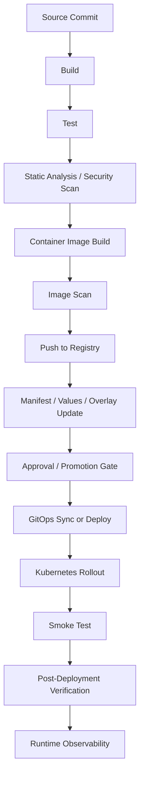
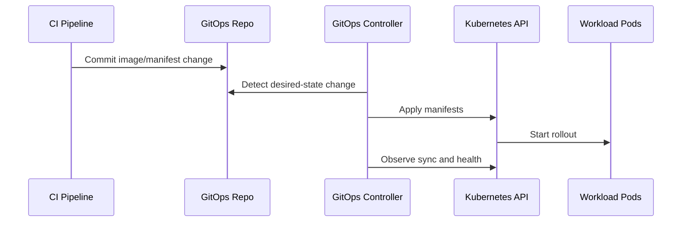
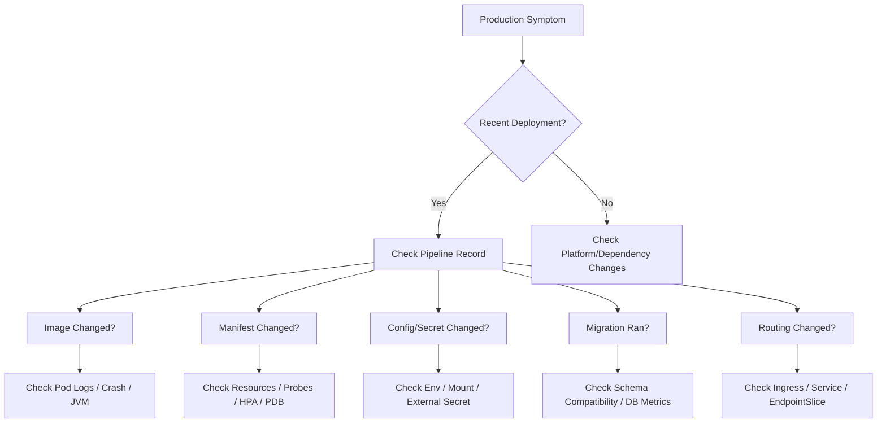

# Part 057 — CI/CD Pipeline Operations for Kubernetes

## Tujuan

CI/CD pipeline untuk Kubernetes bukan hanya otomasi build dan deploy. Dalam sistem enterprise, pipeline adalah control point yang menentukan apakah sebuah perubahan aplikasi, image, manifest, config, secret reference, migration, atau routing change bisa masuk ke runtime production dengan aman.

Untuk backend engineer, pipeline harus dipahami sebagai jalur perubahan dari source code sampai running pod:

- commit
- build
- unit/integration test
- static analysis
- dependency scan
- container image build
- image scan
- image push
- manifest update
- GitOps reconciliation atau direct deploy
- approval gate
- rollout
- smoke test
- post-deployment verification
- rollback path
- evidence capture

Part ini membahas CI/CD pipeline dari sudut pandang day-2 operations: bagaimana membaca jalur deployment, menemukan failure point, memastikan traceability, dan mencegah perubahan menjadi incident.

---

## 1. Pipeline Mental Model



Operationally, a deployment is not complete when the pipeline is green.

A deployment is complete when:

- intended image is running
- intended manifest is applied
- pods are ready
- service has endpoints
- ingress/backend route is healthy
- smoke test passes
- core SLI remains stable
- dependency error does not spike
- queue lag does not regress
- no hidden CrashLoop/OOM/restart pattern appears
- rollback path remains available

---

## 2. Why CI/CD Pipeline Matters for Backend Engineers

Backend engineers often think pipeline belongs to DevOps or platform team. That is only partly true.

Platform/DevOps may own pipeline infrastructure, but backend engineers own the runtime effect of application changes.

A backend service owner must understand:

- what image version is being deployed
- what commit produced the image
- what manifest version references the image
- which environment receives the change
- whether config and secret references changed
- whether database migration runs before/after rollout
- whether rollout strategy protects availability
- whether smoke test validates meaningful user paths
- whether alert and dashboard show deployment markers
- whether rollback can restore service safely

In CPQ, quote management, order management, billing integration, and workflow-heavy systems, a bad pipeline can break not only an API endpoint but also long-running business state.

Example failure:

```text
Code change is backward compatible.
Image builds successfully.
Manifest promotes to production.
Migration job runs destructively.
Old pods still serving traffic fail against new schema.
Rollback cannot restore data shape.
Incident becomes data recovery problem.
```

Pipeline review must include application lifecycle, data compatibility, and operational verification.

---

## 3. Pipeline Ownership Boundaries

| Area | Backend Service Owner | Platform / DevOps / SRE |
|---|---|---|
| Build correctness | Owns app build, tests, artifact semantics | Provides build runner and standard stages |
| Image content | Owns app runtime dependencies | Provides base image policy and registry controls |
| Manifest semantics | Owns service-specific runtime behavior | Provides manifest standards and deployment tooling |
| Environment promotion | Validates app readiness | Provides promotion mechanism and gates |
| Production deploy | Owns application risk | Owns platform-safe delivery mechanics |
| Rollback decision | Provides app-level rollback safety judgment | Supports rollback execution and platform state |
| Smoke test | Defines meaningful service checks | Provides execution framework |
| Observability | Defines service signals | Provides logging/metrics/tracing platform |
| Security scan findings | Fixes app/library findings | Maintains scanning policy and exceptions |

Boundary rule:

> Platform owns the delivery machinery. Backend owns whether the delivered workload is correct, safe, observable, and reversible.

---

## 4. Commit-to-Runtime Traceability

Every production pod should be traceable back to:

- source commit SHA
- repository
- branch/tag
- build number
- container image digest
- chart version or manifest revision
- GitOps commit
- deployment timestamp
- release ticket/change request
- actor or automation identity

Recommended pod/deployment annotations:

```yaml
metadata:
  annotations:
    app.example.com/git-commit: "9f2a1c7"
    app.example.com/build-id: "build-2026-07-12-1042"
    app.example.com/image-digest: "sha256:..."
    app.example.com/release-id: "REL-12345"
    app.example.com/deployed-by: "gitops-controller"
```

Recommended labels:

```yaml
metadata:
  labels:
    app.kubernetes.io/name: quote-order-api
    app.kubernetes.io/component: api
    app.kubernetes.io/part-of: quote-order
    app.kubernetes.io/version: "2026.07.12.1"
    app.kubernetes.io/managed-by: argocd
```

Operational question during incident:

```text
Which exact code, image, manifest, and config is currently serving production traffic?
```

If the answer requires guesswork, the pipeline is not production-grade enough.

---

## 5. Build Stage Operations

Build stage validates whether application artifact can be created repeatably.

For Java/JAX-RS service, check:

- Java version consistency, for example Java 17+
- Maven/Gradle lockfile or dependency reproducibility
- generated code step
- annotation processing
- OpenAPI/client generation
- unit test execution
- integration test execution
- dependency vulnerability scan
- license policy
- artifact checksum

Operational failure modes:

| Failure | Operational Meaning |
|---|---|
| Build passes locally but fails in CI | Environment drift, missing generated artifact, dependency resolution issue |
| Build is flaky | Non-deterministic test, shared state, time dependency, concurrency issue |
| Dependency download failure | Repository outage, proxy issue, credential issue |
| Build uses mutable dependency | Reproducibility risk |
| Build skips tests for speed | Production risk shifted downstream |

Backend engineer should know which failures block deployment and which can be waived only through formal exception.

---

## 6. Test Stage Operations

Tests in CI/CD should not be treated as generic quality decoration. They are release gates.

Minimum test categories for backend Kubernetes workload:

- unit tests
- service-level tests
- API contract tests
- repository/database tests
- messaging contract tests
- serialization compatibility tests
- migration compatibility tests
- failure-path tests
- idempotency tests for consumers/jobs
- startup/config validation tests

For CPQ/order systems, useful tests include:

- quote creation path
- quote validation path
- pricing/catalog dependency behavior
- order submission path
- downstream integration failure behavior
- retry/DLQ behavior
- workflow correlation behavior
- idempotent event processing

Pipeline smell:

```text
All tests pass, but none of them validate the path that production users actually depend on.
```

---

## 7. Static Analysis and Security Gates

Security and quality gates may include:

- SAST
- dependency vulnerability scan
- container image scan
- secret scanning
- IaC/manifest scanning
- license scanning
- code quality threshold
- policy-as-code validation

Backend engineer should care because findings may affect runtime:

- vulnerable library in JAX-RS stack
- vulnerable base image
- leaked secret in config
- privileged container setting
- missing resource limit
- invalid NetworkPolicy
- unsafe RBAC permission
- deprecated Kubernetes API

Operational rule:

> A security gate is not only a compliance step. It is a production risk filter.

---

## 8. Container Image Build Operations

Image build should produce a deterministic, deployable runtime unit.

Review checklist:

- base image is approved
- Java version matches service requirement
- image runs as non-root if policy requires
- image has minimal required packages
- timezone/locale behavior is known
- CA certificates are included
- JVM flags are configurable
- entrypoint handles SIGTERM
- health endpoint is available after startup
- image tag is not the only identity; digest is available

Example image metadata expectation:

```text
image: registry.example.com/quote-order-api:2026.07.12.1
imageID: registry.example.com/quote-order-api@sha256:...
```

Tag tells human intent.
Digest tells immutable runtime identity.

---

## 9. Registry and Image Promotion

Image promotion determines which artifact reaches each environment.

Common patterns:

| Pattern | Meaning | Risk |
|---|---|---|
| Rebuild per environment | Build image separately for dev/stage/prod | Artifact drift |
| Promote same digest | Same image digest moves across environments | Better traceability |
| Mutable tag promotion | Tag like `latest` or `prod` is moved | Runtime ambiguity |
| Immutable release tag | Unique version tag per release | Safer |

Production-safe preference:

```text
Build once, scan once, promote immutable digest through environments.
```

Backend engineer should verify:

- stage and prod use same image digest unless intentionally different
- image scan completed before promotion
- deployment manifest references expected tag/digest
- registry auth works from target cluster
- rollback image still exists in registry

---

## 10. Manifest Update Stage

The pipeline may update Kubernetes manifests through:

- direct YAML patch
- Helm values update
- Kustomize image override
- GitOps repo commit
- generated environment manifest
- release automation tool

Example Kustomize image update:

```yaml
images:
  - name: registry.example.com/quote-order-api
    newTag: 2026.07.12.1
```

Example Helm values update:

```yaml
image:
  repository: registry.example.com/quote-order-api
  tag: 2026.07.12.1
```

Operational checks:

- Did only the intended image/config change?
- Did resource/probe/HPA/PDB change accidentally?
- Did environment overlay drift?
- Did Helm/Kustomize render expected output?
- Did generated ConfigMap/Secret name change and trigger rollout?
- Did Service selector remain stable?
- Did NetworkPolicy still allow dependency traffic?

Rendered manifest must be reviewed, not only source templates.

---

## 11. Deployment Trigger Models

There are two common delivery models.

### Direct deploy

Pipeline applies changes directly:

```bash
kubectl apply -f rendered.yaml
```

Pros:

- simple flow
- immediate feedback
- fewer moving parts

Cons:

- weaker GitOps traceability
- harder drift control
- greater risk of manual deploy ambiguity

### GitOps deploy

Pipeline commits desired state to GitOps repo, then controller reconciles:



Pros:

- desired state is auditable
- rollback through Git
- drift visibility
- cleaner production change record

Cons:

- delayed reconciliation
- sync wave complexity
- requires understanding GitOps controller health

---

## 12. Environment Promotion

Promotion is not merely copying image tag from staging to production.

Promotion should validate:

- same image digest tested in lower environment
- migration strategy approved
- feature flags configured
- environment-specific config reviewed
- dependency endpoints correct
- secrets available
- ingress route correct
- HPA/PDB/resources ready
- observability ready
- rollback path known

Promotion failure modes:

| Failure | Example |
|---|---|
| Config mismatch | Staging uses mock endpoint, prod uses real billing integration |
| Secret missing | Prod external secret not synced |
| Dependency permission missing | IRSA/Azure Workload Identity not allowed |
| Network egress blocked | NetworkPolicy allows staging DB only |
| Migration not compatible | Prod schema rollout breaks old pods |
| Smoke test weak | Pipeline validates `/health` only, not business path |

---

## 13. Approval Gates

Approval gates are useful when they force risk review, not when they become ceremonial clicks.

Good approval gate asks:

- What changed?
- What is the blast radius?
- Is rollback safe?
- Does this include migration?
- Does this change config/secret/identity/networking?
- Are dashboards and alerts ready?
- Is there a known incident or freeze window?
- Who owns validation after deployment?

Bad approval gate:

```text
Approve because pipeline is green.
```

Production-grade approval should include application, platform, and security context when relevant.

---

## 14. Smoke Test Operations

Smoke test validates that deployed workload can perform minimal meaningful function.

Bad smoke test:

```bash
curl /health
```

This only proves that the process responds.

Better smoke test examples:

- GET readiness endpoint
- call one authenticated API path
- validate dependency connectivity in safe mode
- execute quote retrieval for test fixture
- validate order validation endpoint with non-mutating payload
- check Kafka/RabbitMQ consumer group availability
- check workflow worker registration
- verify no 5xx spike after deployment

Smoke test must avoid:

- mutating production business data without cleanup
- triggering real billing/order fulfillment
- bypassing auth path if auth is part of runtime risk
- relying only on pod readiness

---

## 15. Post-Deployment Verification

After rollout, verify runtime state.

Safe command examples:

```bash
kubectl -n <namespace> rollout status deploy/<deployment>
kubectl -n <namespace> get deploy <deployment>
kubectl -n <namespace> get rs -l app.kubernetes.io/name=<service>
kubectl -n <namespace> get pods -l app.kubernetes.io/name=<service>
kubectl -n <namespace> get endpointslice -l kubernetes.io/service-name=<service>
kubectl -n <namespace> describe deploy <deployment>
```

Check observability:

- error rate
- latency p95/p99
- request volume
- restart count
- pod readiness
- CPU/memory/throttling
- GC pause
- DB pool usage
- Kafka lag
- RabbitMQ queue depth/unacked messages
- Redis latency/errors
- Camunda incidents/job backlog
- ingress 5xx
- dependency errors

Verification rule:

> Rollout success means Kubernetes accepted and progressed the deployment. It does not prove business correctness.

---

## 16. Deployment Markers

Deployment markers help correlate metric changes with releases.

They should appear in:

- logs
- metrics dashboard
- tracing system
- incident timeline
- release dashboard
- change management record

Useful marker fields:

```text
service=quote-order-api
version=2026.07.12.1
commit=9f2a1c7
image_digest=sha256:...
environment=prod
namespace=quote-order-prod
release_id=REL-12345
```

Without deployment markers, incident debugging often starts with a weak question:

```text
Did anything change recently?
```

With markers, it becomes:

```text
Error rate increased 4 minutes after release 2026.07.12.1 reached 100% traffic.
```

---

## 17. Rollback Path in Pipeline

Rollback must be designed before deployment.

Rollback may mean:

- revert GitOps commit
- restore previous Helm release
- update Kustomize image back to previous digest
- use `kubectl rollout undo` only if compatible with delivery model
- disable feature flag
- pause canary
- switch traffic back in blue-green
- run compensating migration only if approved

Rollback questions:

- Is previous image still available?
- Is previous config still available?
- Is previous secret version still available?
- Did DB migration break backward compatibility?
- Did event schema change break consumers?
- Did cache data format change?
- Did workflow version change create mixed process state?
- Who is authorized to execute rollback?

Pipeline should expose rollback path as an operational procedure, not tribal knowledge.

---

## 18. CI/CD Failure Mode Map



Pipeline evidence narrows incident search space.

---

## 19. Kubernetes-Specific Pipeline Failure Modes

| Failure Mode | Detection | Typical Mitigation |
|---|---|---|
| Wrong image tag | Pod image differs from expected release | Promote correct image, rollback bad manifest |
| ImagePullBackOff | Pod event shows pull failure | Fix registry auth/tag/network, rollback if needed |
| Bad resource limit | OOMKilled or CPU throttling after deploy | Restore previous resource config, tune JVM |
| Bad probe | Pods not ready or restart loop | Fix probe path/port/timing, rollback |
| Bad ConfigMap | App startup failure or wrong behavior | Restore config, restart pods safely |
| Missing Secret | CrashLoopBackOff or access denied | Fix secret sync/reference, rollback if needed |
| Bad NetworkPolicy | Dependency timeout | Add minimal rule with approval, rollback policy change |
| Migration incompatibility | Old/new app fail against schema | Stop rollout, rollback app if possible, DB recovery plan |
| GitOps drift | Controller reverts manual fix | Fix desired state in Git |

---

## 20. Java/JAX-RS Pipeline Concerns

For Java/JAX-RS service, pipeline should verify:

- Java version matches base image
- app starts under container memory limit
- readiness endpoint returns only after server is ready
- graceful shutdown works under SIGTERM
- DB migrations are coordinated
- dependency timeout config is environment-specific but intentional
- OpenAPI contract compatibility is checked
- serialization compatibility is checked
- thread pool and connection pool values fit replica count
- JVM flags are carried into deployment

Example risk:

```text
Pipeline changes replica count from 4 to 12.
DB pool remains maxPoolSize=30 per pod.
Potential DB connections jump from 120 to 360.
PostgreSQL max_connections is exhausted during rollout surge.
```

CI/CD review must include runtime math.

---

## 21. Messaging and Workflow Pipeline Concerns

For Kafka/RabbitMQ/Camunda workloads, deployment can change processing semantics.

Check:

- consumer group ID
- topic/queue names
- DLQ configuration
- retry policy
- offset commit behavior
- prefetch/concurrency
- worker type
- workflow version compatibility
- schema/event compatibility
- idempotency guarantee
- shutdown behavior

Risk examples:

```text
New consumer version starts before producer schema is deployed.
```

```text
Rollback reintroduces old worker that cannot process jobs created by new version.
```

```text
Replica increase triggers Kafka rebalance storm during release window.
```

---

## 22. Safe Investigation Commands

Use read-only investigation first:

```bash
kubectl -n <namespace> get deploy <deployment> -o wide
kubectl -n <namespace> get deploy <deployment> -o yaml
kubectl -n <namespace> get rs -l app.kubernetes.io/name=<service>
kubectl -n <namespace> get pods -l app.kubernetes.io/name=<service> -o wide
kubectl -n <namespace> describe pod <pod>
kubectl -n <namespace> logs <pod> --since=30m
kubectl -n <namespace> logs <pod> --previous
kubectl -n <namespace> rollout history deploy/<deployment>
kubectl -n <namespace> rollout status deploy/<deployment>
```

If GitOps is used, also check:

```bash
# Tool-specific; verify internal command/process first.
argocd app get <app>
argocd app history <app>
argocd app diff <app>
```

Do not execute rollback, delete pod, restart deployment, or sync GitOps manually unless you know the internal authority and blast radius.

---

## 23. Production-Safe Pipeline Review Checklist

Before deployment, review:

- [ ] What commit is being deployed?
- [ ] What image digest is being promoted?
- [ ] Was the same digest tested in staging?
- [ ] Did the manifest change beyond image tag?
- [ ] Did resources/probes/HPA/PDB change?
- [ ] Did ConfigMap/Secret references change?
- [ ] Did Service/Ingress/Gateway route change?
- [ ] Did NetworkPolicy/RBAC/ServiceAccount change?
- [ ] Does deployment include DB migration?
- [ ] Is migration backward compatible?
- [ ] Is rollback safe after migration?
- [ ] Are smoke tests meaningful?
- [ ] Are deployment markers visible?
- [ ] Are dashboards ready?
- [ ] Are alerts healthy before deploy?
- [ ] Is rollback path documented?
- [ ] Is owner available for post-deployment verification?

---

## 24. Internal Verification Checklist

Verify in your internal environment:

- pipeline stages for service build, test, scan, image push, deployment
- artifact promotion model
- registry used for production
- image tag and digest policy
- GitOps repository and controller if used
- Helm/Kustomize render process
- environment promotion policy
- approval gate requirements
- release freeze window
- change management process
- smoke test implementation
- post-deployment verification checklist
- deployment marker integration
- rollback process
- database migration process
- security scan exception process
- incident linkage from deployment to timeline
- ownership boundary between backend, platform, SRE, DevOps, and security

Do not assume CSG/team specifics. Confirm actual pipeline, GitOps repo, registry, approval process, runbook, and deployment authority internally.

---

## 25. Practical Review Questions

Ask during PR/release review:

1. Is this a code-only change, or does it change runtime configuration?
2. Is the image immutable and traceable to commit?
3. Does production run the same artifact tested in staging?
4. Is the rendered manifest reviewed?
5. Does this change require migration coordination?
6. Could rollback fail due to data, cache, event, or workflow compatibility?
7. Does the deployment affect connection count, consumer count, or queue pressure?
8. Is there enough observability to know whether release is healthy?
9. Who validates after deploy?
10. What is the fastest safe mitigation if this fails?

---

## 26. Key Takeaways

- CI/CD is part of production operations, not only automation.
- Backend engineers own the runtime impact of their service changes.
- Immutable image digest is stronger than mutable tag.
- Rendered manifest is the real deployable artifact.
- Pipeline green does not equal production healthy.
- Smoke tests must validate meaningful service behavior.
- Rollback must be designed before deployment.
- Deployment markers are critical for incident debugging.
- GitOps changes must be fixed in Git, not only with manual kubectl.
- Pipeline review must include code, config, image, manifest, dependency, migration, observability, and rollback safety.
