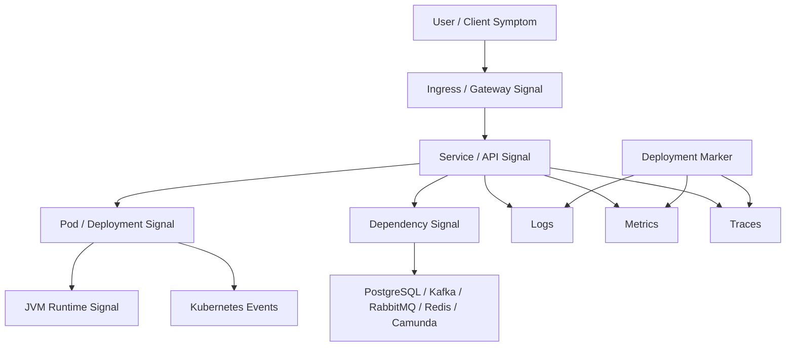
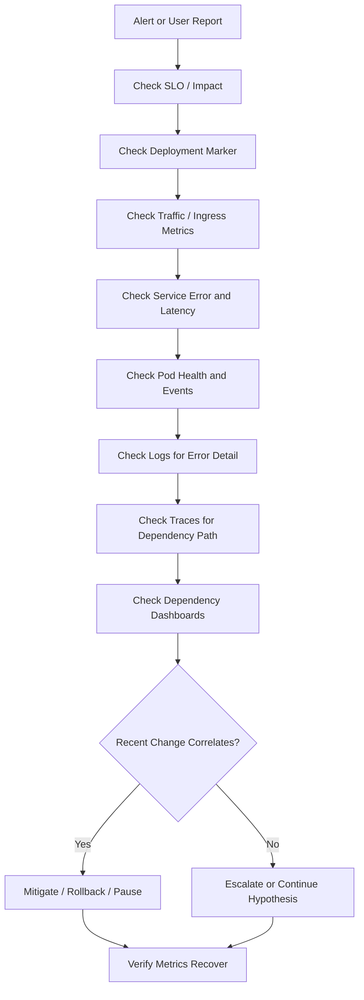

# Part 058 — Observability Foundation for Kubernetes Operations

## Tujuan

Observability adalah kemampuan untuk memahami keadaan internal sistem dari sinyal eksternal. Dalam Kubernetes production, observability bukan hanya dashboard CPU dan memory. Backend engineer harus bisa membaca hubungan antara:

- application logs
- Kubernetes events
- pod/deployment metrics
- ingress metrics
- JVM metrics
- dependency metrics
- distributed traces
- deployment markers
- alerts
- SLO burn rate
- runbooks

Part ini membangun fondasi observability untuk operasi backend service di Kubernetes. Fokusnya bukan tool tertentu, melainkan mental model: sinyal apa yang harus dilihat, bagaimana menghubungkannya, dan bagaimana menggunakannya saat incident.

---

## 1. Observability Mental Model



Good observability answers:

- What is broken?
- Who is affected?
- Since when?
- Did anything change?
- Is the issue in ingress, service, pod, JVM, network, or dependency?
- Is it getting worse?
- What is the safest mitigation?
- Did mitigation work?

---

## 2. The Four Core Signals

| Signal | What It Tells You | Typical Use |
|---|---|---|
| Logs | Discrete application/runtime events | Error details, correlation, evidence |
| Metrics | Numeric health over time | Trends, saturation, alerting, SLO |
| Traces | Request path across services | Latency breakdown, dependency path |
| Events | Kubernetes lifecycle facts | Scheduling, image pull, probe, restart, mount issues |

Common mistake:

```text
Looking at logs first for every incident.
```

Better approach:

```text
Start from symptom and scope, use metrics/traces/events to locate layer, then use logs for details.
```

---

## 3. Observability Scope for Backend Engineers

Backend engineers should observe:

- API request rate
- API latency
- API error rate
- business operation failure rate
- JVM heap/non-heap/GC/thread metrics
- pod readiness and restarts
- CPU usage and throttling
- memory usage and OOM events
- DB pool usage and query latency
- Kafka lag and consumer errors
- RabbitMQ queue depth and unacked messages
- Redis latency and errors
- Camunda job backlog/incidents
- ingress 4xx/5xx and upstream latency
- deployment markers
- SLO burn rate

Platform/SRE commonly observes:

- node health
- cluster capacity
- CNI health
- CoreDNS health
- ingress controller health
- metrics/logging/tracing platform health
- control plane health
- storage CSI health
- autoscaler health

Boundary rule:

> Backend engineers must understand platform signals enough to identify escalation, but they should own application and workload-level observability deeply.

---

## 4. Kubernetes Events as Operational Facts

Kubernetes events explain lifecycle transitions.

Useful event categories:

- FailedScheduling
- Pulling / Pulled
- ErrImagePull / ImagePullBackOff
- Created / Started
- Unhealthy
- Killing
- BackOff
- FailedMount
- FailedAttachVolume
- Preempted
- Evicted

Safe commands:

```bash
kubectl -n <namespace> describe pod <pod>
kubectl -n <namespace> get events --sort-by='.lastTimestamp'
kubectl -n <namespace> get events --field-selector involvedObject.name=<pod>
```

Events are often the fastest source for:

- pod pending
- image pull issue
- probe failure
- mount failure
- node pressure eviction
- restart reason

Limit: events may have short retention. Capture evidence early during incident.

---

## 5. Logs as Evidence, Not the Whole Truth

Logs are useful for:

- exception stack trace
- validation failure detail
- dependency error message
- business error context
- request correlation
- startup/shutdown sequence
- migration execution
- worker processing failure
- security/auth failure

For Kubernetes workload, check:

```bash
kubectl -n <namespace> logs <pod> --since=30m
kubectl -n <namespace> logs <pod> --previous
kubectl -n <namespace> logs deploy/<deployment> --since=30m
kubectl -n <namespace> logs <pod> -c <container> --since=30m
```

Operational logging requirements:

- structured JSON if platform supports it
- timestamp
- log level
- service name
- environment
- pod name if injected
- version/commit
- correlation ID
- trace ID
- sanitized error detail
- no secret/PII leakage

Bad log:

```text
Error happened
```

Better log:

```json
{
  "level": "ERROR",
  "service": "quote-order-api",
  "operation": "submitOrder",
  "correlationId": "c-123",
  "traceId": "t-456",
  "errorType": "DependencyTimeout",
  "dependency": "billing-gateway",
  "timeoutMs": 3000
}
```

---

## 6. Metrics for Workload Health

Metrics show health over time and support alerting.

Core Kubernetes workload metrics:

- pod ready status
- restart count
- CPU usage
- CPU throttling
- memory working set
- memory limit utilization
- network receive/transmit
- ephemeral storage usage
- deployment available replicas
- unavailable replicas
- HPA current/desired replicas
- pending pods

Core application metrics:

- request rate
- error rate
- latency p50/p95/p99
- HTTP status distribution
- active requests
- thread pool utilization
- queue size
- DB pool active/idle/waiting
- JVM heap/non-heap
- GC pause
- classloader/metaspace
- direct memory if available

Dependency metrics:

- PostgreSQL connection count/query latency/errors
- Kafka consumer lag/rebalance/errors
- RabbitMQ queue depth/unacked/redelivery
- Redis latency/errors/connection count
- Camunda incidents/job backlog/worker failures

---

## 7. Traces for Request and Dependency Path

Distributed tracing answers:

```text
Where did this request spend time?
```

Trace should show:

- ingress/gateway span if instrumented
- service entry span
- downstream HTTP calls
- database calls
- Kafka/RabbitMQ produce/consume spans if propagated
- Redis calls
- external cloud service calls
- error status
- latency breakdown

Trace is especially useful for:

- p99 latency investigation
- dependency timeout
- retry storm
- partial outage
- service-to-service regression
- missing propagation
- finding slow database query or external API

Operational smell:

- traces exist only for API calls, not async flows
- trace ID not present in logs
- sampling hides rare errors
- ingress strips propagation headers
- Kafka/RabbitMQ messages lose correlation

---

## 8. Deployment Markers

Deployment markers connect release activity to runtime behavior.

Markers should appear on dashboards as vertical annotations:

```text
2026-07-12 10:42 UTC+7
quote-order-api
version=2026.07.12.1
commit=9f2a1c7
imageDigest=sha256:...
release=REL-12345
```

With markers, debugging can answer:

- Did error rate increase after deployment?
- Did latency change after config update?
- Did Kafka lag grow after consumer rollout?
- Did OOMKilled start after memory limit change?
- Did ingress 5xx start after route change?

Without markers, teams rely on memory, chat history, and guesswork.

---

## 9. Service Health Dashboard

A backend service dashboard should answer in one screen:

- Is the service receiving traffic?
- Is it serving successfully?
- Is latency normal?
- Are pods ready?
- Are pods restarting?
- Is CPU/memory healthy?
- Are dependencies healthy?
- Did a deployment happen recently?
- Are queues/backlogs stable?
- Are SLOs burning?

Recommended top-level panels:

| Panel | Purpose |
|---|---|
| Request rate | Detect traffic drop/spike |
| Error rate | Detect user-visible failure |
| Latency p95/p99 | Detect performance regression |
| Pod readiness | Detect availability loss |
| Restart count | Detect crash/restart loops |
| CPU/memory/throttling | Detect resource saturation |
| JVM heap/GC/thread | Detect Java runtime pressure |
| Dependency latency/errors | Detect external/internal dependency issue |
| Deployment markers | Correlate change with symptom |
| SLO burn | Detect reliability budget impact |

---

## 10. Kubernetes Workload Dashboard

Workload dashboard should show:

- desired replicas
- available replicas
- unavailable replicas
- updated replicas
- pod readiness
- restart count by pod
- pod phase
- OOMKilled count
- CPU usage vs request/limit
- CPU throttling
- memory usage vs limit
- ephemeral storage usage
- HPA current/desired replicas
- node placement
- pod age

Operational questions:

```text
Are all replicas ready?
Are restarts concentrated in one pod or all pods?
Did new pods fail after rollout?
Is HPA trying to scale but pods are pending?
Are pods on a bad node?
```

---

## 11. Ingress and Traffic Dashboard

Ingress dashboard should show:

- request rate by host/path
- 2xx/3xx/4xx/5xx distribution
- 502/503/504 count
- upstream latency
- request duration
- upstream connect time
- TLS errors if available
- rejected requests
- body size/rewrite issues if available
- controller reload errors

Use it to distinguish:

| Symptom | Likely Layer |
|---|---|
| 404 only | Route/path/host mismatch |
| 502 | backend protocol/TLS/upstream connection issue |
| 503 | no endpoint/backend unavailable |
| 504 | timeout/upstream latency/dependency slowness |
| high 499 | client timeout/client disconnect |

---

## 12. Dependency Dashboard

Dependency dashboard should include:

### PostgreSQL

- connection pool active/idle/waiting
- database connection count
- query latency
- lock wait
- error count
- transaction time
- migration status

### Kafka

- consumer lag
- rebalance count
- consumer error count
- processing rate
- commit latency/failure
- DLQ rate

### RabbitMQ

- queue depth
- unacked messages
- consumer count
- redelivery rate
- publish/consume rate
- DLQ count

### Redis

- command latency
- error rate
- connection count
- timeout count
- memory pressure if owned/visible

### Camunda

- active jobs
- incidents
- worker failure
- job timeout
- process completion latency
- backlog by process type

Dependency observability prevents blaming Kubernetes for a dependency bottleneck.

---

## 13. Alerting Foundation

An alert should be:

- actionable
- owned
- tied to impact or imminent risk
- linked to dashboard
- linked to runbook
- severity-tagged
- deduplicated
- validated in incident review

Good alert:

```text
quote-order-api: p95 latency above SLO for 10 minutes and error budget burn > threshold.
Runbook: link
Dashboard: link
Owner: Quote & Order backend
```

Weak alert:

```text
CPU > 80%
```

CPU may be normal under load. Alert on symptoms first, saturation second.

Recommended alert hierarchy:

1. User impact alerts: availability, error rate, latency, workflow failure.
2. Dependency impact alerts: DB pool exhausted, Kafka lag growing, RabbitMQ backlog, Camunda incidents.
3. Workload risk alerts: CrashLoopBackOff, OOMKilled, replicas unavailable, no endpoint.
4. Capacity alerts: CPU throttling, memory near limit, pending pods, disk pressure.

---

## 14. SLO Awareness

SLO connects metrics to reliability target.

Example SLI categories:

| Service Type | Useful SLI |
|---|---|
| JAX-RS API | availability, latency, error rate |
| Kafka consumer | processing freshness, lag, DLQ rate |
| RabbitMQ consumer | queue age, queue depth, processing failure |
| Camunda worker | job completion latency, incident rate |
| Batch job | completion success, freshness, duration |
| Integration service | dependency success rate, timeout rate |

SLO-aware debugging asks:

```text
Is this issue burning error budget?
```

If yes, mitigation speed matters more than perfect root cause.

---

## 15. Runbook Integration

Observability without runbook creates dashboards that people stare at during incidents.

Every critical alert should link to:

- likely causes
- first 5 checks
- safe commands
- dashboards
- logs/traces queries
- mitigation options
- rollback criteria
- escalation owner
- evidence capture instructions

Runbook structure:

```text
Alert: quote-order-api high 5xx
Impact: API failures for quote/order operations
First checks:
  1. Deployment marker
  2. Ingress 5xx by path
  3. Pod readiness/restarts
  4. Logs by correlation/trace ID
  5. Dependency errors
Safe mitigation:
  - pause rollout
  - rollback if tied to recent deployment
Escalate:
  - platform if ingress/controller issue
  - DB team if PostgreSQL saturation
  - security if auth/access-denied spike
```

---

## 16. Incident Debugging Observability Flow



This flow prevents jumping directly into pod exec or random restarts.

---

## 17. Observability for Java/JAX-RS Services

Minimum Java service metrics:

- HTTP request count by route/status
- HTTP latency histogram
- exception count by type
- active request count
- thread pool active/queued/rejected
- DB pool active/idle/pending
- JVM heap usage
- JVM non-heap usage
- GC pause/count
- thread count
- class loading
- direct memory if applicable
- process uptime
- startup duration
- graceful shutdown duration if instrumented

JAX-RS-specific concern:

- route labels must not explode cardinality
- exception mapping should preserve useful error category
- correlation ID should propagate through filters
- request timeout should be observable
- dependency timeout should be tagged by dependency

Bad metric label:

```text
path=/quotes/123456789
```

Better:

```text
route=/quotes/{quoteId}
```

---

## 18. Observability for Async Workloads

API dashboards are not enough for consumers and workers.

Kafka consumer observability:

- lag by topic/partition/group
- records processed/sec
- processing latency
- commit failures
- rebalance count
- DLQ rate
- retry count
- poison message count

RabbitMQ consumer observability:

- queue depth
- queue age
- unacked count
- redelivery count
- consumer count
- ack/nack rate
- DLQ rate

Camunda worker observability:

- activated jobs
- completed jobs
- failed jobs
- incidents
- job timeout
- worker concurrency
- process completion latency

Batch observability:

- last successful run
- run duration
- rows/items processed
- failures
- retries
- checkpoint progress
- skipped items
- lock acquisition failure

---

## 19. High-Cardinality and Cost Awareness

Observability can become expensive and unstable.

Avoid high-cardinality labels:

- user ID
- quote ID
- order ID
- request ID
- trace ID
- raw URL with IDs
- exception message
- SQL query text
- tenant if tenant count is very high and not controlled

Good labels:

- service
- namespace
- environment
- route template
- status code class
- dependency name
- operation name
- error category
- workload type

Cost risks:

- verbose logs during retry storm
- debug logs enabled in production
- per-request large payload logging
- metric label explosion
- trace sampling too high on high-volume paths
- unbounded event export

Observability must be useful and economically sustainable.

---

## 20. Security and Privacy Concerns

Never log or expose:

- password
- token
- API key
- secret value
- full authorization header
- payment data
- sensitive customer data
- raw payload containing PII
- database connection string with password
- private key

Operationally risky debug behavior:

```text
Temporarily log full request body to debug production issue.
```

Safer approach:

- log stable identifiers only when allowed
- hash sensitive identifiers when needed
- use correlation ID
- reproduce in lower environment
- use redaction filters
- capture minimal evidence
- follow internal privacy/security process

---

## 21. Common Observability Failure Modes

| Failure Mode | Impact |
|---|---|
| No deployment marker | Hard to correlate release and regression |
| Logs without correlation ID | Hard to follow one request |
| Metrics without route template | Latency/error analysis becomes weak |
| Traces sampled too aggressively | Rare errors disappear |
| Alert without runbook | On-call loses time |
| Dashboard without dependency panels | Team blames app while dependency fails |
| Kubernetes events not retained | Lifecycle evidence disappears |
| Missing JVM metrics | OOM/throttling/GC cause hidden |
| High-cardinality labels | Metrics cost and query performance degrade |
| Sensitive logs | Security/privacy incident risk |

---

## 22. Minimum Observability Baseline per Workload

For every production backend workload:

- [ ] logs are structured
- [ ] correlation ID exists
- [ ] trace ID exists or trace integration is planned
- [ ] request/error/latency metrics exist for API services
- [ ] workload-specific metrics exist for consumers/jobs/workers
- [ ] Kubernetes workload dashboard exists
- [ ] dependency dashboard exists
- [ ] JVM dashboard exists for Java services
- [ ] ingress/gateway dashboard exists for externally routed APIs
- [ ] deployment markers exist
- [ ] alerts link to runbooks
- [ ] SLO or at least service health objective exists
- [ ] sensitive data redaction is enforced
- [ ] owner is clear

---

## 23. Production-Safe Observability Commands

Kubernetes checks:

```bash
kubectl -n <namespace> get deploy <deployment>
kubectl -n <namespace> get pods -l app.kubernetes.io/name=<service> -o wide
kubectl -n <namespace> describe pod <pod>
kubectl -n <namespace> logs <pod> --since=30m
kubectl -n <namespace> logs <pod> --previous
kubectl -n <namespace> get events --sort-by='.lastTimestamp'
kubectl -n <namespace> top pod
kubectl -n <namespace> top pod <pod> --containers
```

Avoid during incident unless authorized:

- arbitrary `kubectl exec` into production pod
- enabling debug logs globally without time limit
- dumping full environment variables if secrets may appear
- downloading heap dumps without security approval
- increasing log volume without checking cost impact
- restarting pods as first response without evidence

---

## 24. Internal Verification Checklist

Verify internally:

- logging platform used by team
- metrics platform used by team
- tracing platform used by team
- dashboard location and naming convention
- alerting system and on-call route
- deployment marker integration
- service-level dashboard standard
- JVM dashboard standard
- dependency dashboard availability
- ingress/gateway dashboard availability
- Kubernetes event retention
- log retention
- trace retention and sampling
- SLO definitions
- runbook template
- incident evidence process
- sensitive data logging policy
- observability owner boundary between backend/platform/SRE/security

Do not assume stack details. Confirm actual tools, dashboards, alert rules, SLOs, runbooks, and ownership with the internal team.

---

## 25. Practical Debugging Questions

Ask during an incident:

1. What user-visible symptom triggered this?
2. Which service, route, queue, worker, or batch is affected?
3. Is this tied to a deployment marker?
4. Did error rate, latency, or availability change first?
5. Are pods ready and stable?
6. Are there Kubernetes events explaining lifecycle failure?
7. Are logs showing one error type or many?
8. Do traces point to a dependency?
9. Are dependency dashboards healthy?
10. Is this burning SLO/error budget?
11. What mitigation can be verified quickly?
12. When should this be escalated?

---

## 26. Key Takeaways

- Observability is an operational decision system, not a dashboard collection.
- Use logs, metrics, traces, and events together.
- Kubernetes events explain lifecycle; metrics show trend; traces show path; logs provide detail.
- Deployment markers are essential for release correlation.
- Backend engineers must own service-level, JVM-level, dependency-level, and workload-level observability.
- Alerts must be actionable, owned, and linked to runbooks.
- SLOs help prioritize mitigation over endless investigation.
- Observability must protect privacy and control cost.
- A production service without dashboard, alert, SLO, and runbook is not operationally mature.
