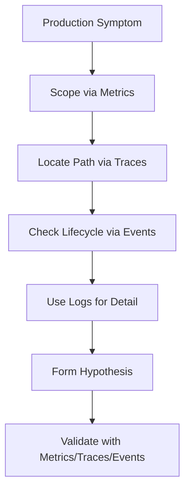
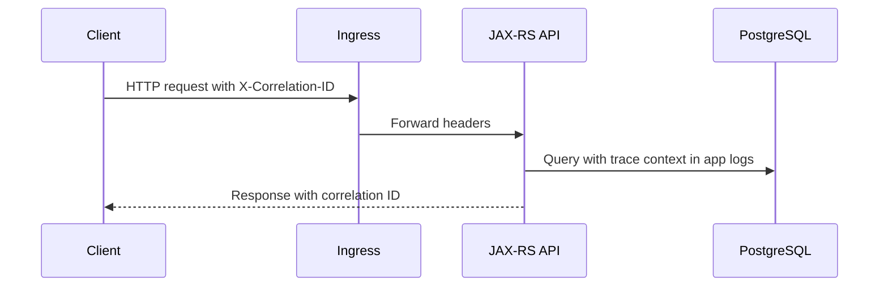
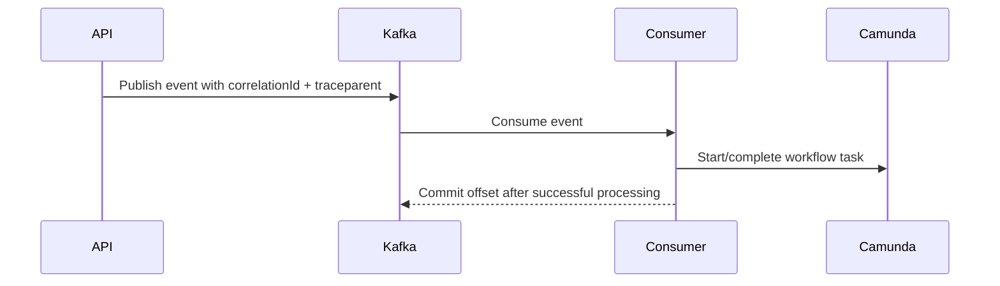
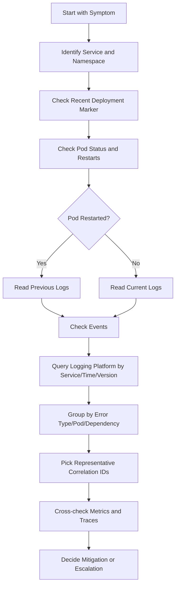

# Part 059 — Kubernetes Logs Operations

## Tujuan

Log adalah salah satu sinyal observability paling sering dipakai saat production incident. Namun log juga sering menjadi sumber kebingungan: terlalu banyak, tidak terstruktur, hilang setelah restart, tidak punya correlation ID, mengandung data sensitif, atau hanya menunjukkan efek akhir tanpa menunjukkan akar masalah.

Part ini membahas operasi log Kubernetes dari sudut pandang senior backend engineer yang mengoperasikan Java/JAX-RS service, Kafka consumer, RabbitMQ consumer, Redis-backed service, Camunda worker, batch job, scheduler, dan dependency-heavy microservices.

Fokusnya bukan sekadar `kubectl logs`, tetapi bagaimana menggunakan log sebagai evidence operasional yang aman, terstruktur, bisa dikorelasikan, dan berguna untuk debugging.

---

## 1. Core Mental Model

Log adalah catatan diskret tentang sesuatu yang terjadi pada aplikasi atau runtime. Log menjawab:

- apa yang aplikasi lihat
- apa yang aplikasi coba lakukan
- error apa yang terjadi
- request/message/job mana yang terdampak
- dependency mana yang gagal
- apakah failure terjadi saat startup, runtime, shutdown, atau rollout

Namun log tidak selalu menjawab:

- seberapa luas impact-nya
- kapan persis degradasi dimulai secara agregat
- apakah latency meningkat sebelum error
- apakah pod kehabisan CPU/memory
- apakah ingress/service/EndpointSlice bermasalah
- apakah failure hanya terjadi pada subset pod/node/zone

Karena itu, logs harus dipakai bersama metrics, traces, dan Kubernetes events.



Operational rule:

> Logs are evidence, not the whole investigation.

---

## 2. What Backend Engineers Should Own

Backend service owner should own:

- application log quality
- structured logging format
- log level discipline
- correlation ID propagation
- trace ID propagation
- meaningful startup/shutdown logs
- dependency call failure logs
- business operation failure logs
- retry/DLQ logs
- worker/job processing logs
- sanitized error detail
- no secret leakage
- no sensitive customer data leakage
- enough logs for incident evidence
- not so many logs that cost and signal quality collapse

Platform/SRE usually owns:

- log collector/agent
- log backend availability
- retention policy implementation
- index/storage cost control
- node/container log collection path
- cluster-level logs
- ingress controller logs
- audit log pipeline
- access control to logging platform

Security/compliance usually owns:

- PII/secret logging policy
- data retention rules
- access audit
- masking/redaction standards
- incident evidence retention rules

Backend engineers do not need to own the log platform, but they must make service logs operationally useful.

---

## 3. Kubernetes Log Sources

| Source | Example | Operational Use |
|---|---|---|
| Container stdout/stderr | Application logs | Runtime error, request handling, startup/shutdown |
| Previous container logs | `kubectl logs --previous` | CrashLoopBackOff, OOM before restart, startup failure |
| Init container logs | `kubectl logs -c <init>` | Migration/init failure, config bootstrap issue |
| Sidecar logs | proxy, agent, shipper | TLS, routing, local proxy, telemetry failure |
| Ingress controller logs | NGINX/ALB/AGIC controller | 502/503/504, upstream timeout, route issue |
| Kubernetes events | not logs, but lifecycle facts | Scheduling, image pull, probe, mount, eviction |
| Application audit logs | business/security audit | Who did what, compliance evidence |

Important distinction:

```text
Application log says what the app experienced.
Kubernetes event says what Kubernetes did to the workload.
Metric says how often/how much.
Trace says where time/error happened in the request path.
```

---

## 4. Production-Safe kubectl Log Commands

Basic current logs:

```bash
kubectl -n <namespace> logs <pod>
```

Use time window to avoid huge output:

```bash
kubectl -n <namespace> logs <pod> --since=30m
kubectl -n <namespace> logs <pod> --since=2h
```

Previous container logs after restart:

```bash
kubectl -n <namespace> logs <pod> --previous
kubectl -n <namespace> logs <pod> --previous --since=30m
```

Deployment-level logs:

```bash
kubectl -n <namespace> logs deploy/<deployment> --since=30m
```

Specific container in multi-container pod:

```bash
kubectl -n <namespace> logs <pod> -c <container> --since=30m
```

Follow logs only when safe and scoped:

```bash
kubectl -n <namespace> logs <pod> -f --since=5m
```

Add timestamps if not already present:

```bash
kubectl -n <namespace> logs <pod> --timestamps --since=30m
```

Limit lines:

```bash
kubectl -n <namespace> logs <pod> --tail=200
```

For label selector, use carefully:

```bash
kubectl -n <namespace> logs -l app.kubernetes.io/name=<service-name> --since=15m --tail=200
```

Production caution:

- Avoid broad `-f` across many pods during high-volume incidents.
- Avoid dumping large logs into terminal during incident calls.
- Avoid copying logs that may contain secrets or PII into public/shared channels.
- Prefer logging platform queries for large-scale analysis.

---

## 5. Current Logs vs Previous Logs

Current logs show the currently running container instance.

Previous logs show the terminated container instance when a container restarted.

This distinction is critical for:

- CrashLoopBackOff
- startup failure
- JVM crash
- application exits after config validation
- missing secret/config
- migration failure
- OOM before readiness
- liveness probe restart

Example investigation:

```bash
kubectl -n quote-prod get pod <pod>
kubectl -n quote-prod describe pod <pod>
kubectl -n quote-prod logs <pod> --previous --tail=300
kubectl -n quote-prod logs <pod> --tail=300
```

Interpretation:

| Observation | Meaning |
|---|---|
| Error only in `--previous` | Container crashed and restarted; current logs may look normal because new process started |
| Error only in current logs | Runtime failure, not necessarily restart cause |
| No previous logs | No previous terminated container or logs already rotated/unavailable |
| Previous logs end abruptly | Possible OOM, SIGKILL, node issue, or abrupt process termination |
| Previous logs show graceful shutdown | Restart may be rollout/drain, not crash |

CrashLoopBackOff rule:

> Always check `--previous` before assuming the current process log explains the crash.

---

## 6. Multi-Container Pod Logging

A pod may contain:

- application container
- sidecar proxy
- log/telemetry agent
- init container
- service mesh sidecar
- certificate/secret agent
- file watcher

List containers:

```bash
kubectl -n <namespace> get pod <pod> -o jsonpath='{.spec.containers[*].name}'
kubectl -n <namespace> get pod <pod> -o jsonpath='{.spec.initContainers[*].name}'
```

Check specific container:

```bash
kubectl -n <namespace> logs <pod> -c <container> --since=30m
```

Operational examples:

| Symptom | Container to Check |
|---|---|
| App cannot start | app container + init container |
| TLS handshake error | app container + sidecar/proxy if present |
| Inbound traffic fails | app container + service mesh sidecar/ingress logs |
| Secret not mounted | init/secret agent + pod events |
| Trace/log shipping missing | telemetry sidecar/agent |
| File processing stuck | app container + any file watcher sidecar |

Internal verification:

- Is service mesh injected?
- Are there init containers?
- Are there sidecars that affect traffic?
- Are logs collected from all containers or only app container?
- Are sidecar failures visible in dashboard/alert?

---

## 7. Structured Logs

Structured logs are machine-queryable logs, usually JSON.

Bad log:

```text
Failed to process order
```

Better log:

```json
{
  "timestamp": "2026-07-12T10:15:21.123Z",
  "level": "ERROR",
  "service": "quote-order-api",
  "environment": "prod",
  "version": "1.42.7",
  "pod": "quote-order-api-7d9f8d6b8c-pk2xz",
  "traceId": "4b1e9a...",
  "correlationId": "QO-20260712-8842",
  "operation": "submitQuote",
  "quoteId": "masked-or-tokenized",
  "dependency": "postgresql",
  "errorType": "SQLTransientConnectionException",
  "message": "Database connection acquisition timed out"
}
```

Good structured logs enable queries like:

```text
service = "quote-order-api"
AND environment = "prod"
AND level = "ERROR"
AND operation = "submitQuote"
AND dependency = "postgresql"
```

Minimum fields for backend service logs:

| Field | Why It Matters |
|---|---|
| timestamp | Reconstruct timeline |
| level | Filter severity |
| service | Identify owner |
| environment | Avoid mixing prod/non-prod |
| version/commit | Correlate with deployment |
| pod/node if available | Identify pod/node-local issue |
| traceId | Connect to distributed trace |
| correlationId/requestId | Connect user/business flow |
| operation | Understand business/API action |
| dependency | Identify failing dependency |
| errorType | Group failure modes |
| sanitized message | Human-readable detail |

---

## 8. Correlation ID and Trace ID

For enterprise backend operations, logs without correlation are weak evidence.

You need at least two identifiers:

| Identifier | Scope | Use |
|---|---|---|
| Trace ID | Distributed technical request path | Connect logs, traces, services, dependencies |
| Correlation ID | Business/request/workflow context | Connect API, async events, workflow, user action |

For synchronous HTTP:



For asynchronous message flow:



Operational requirements:

- inbound HTTP correlation ID accepted or generated
- correlation ID included in response header
- trace context propagated to downstream HTTP calls
- trace/correlation context propagated to Kafka headers
- trace/correlation context propagated to RabbitMQ message headers
- worker logs include process instance/job/message ID where safe
- DLQ logs preserve correlation ID
- retry logs preserve original correlation ID

Failure mode:

```text
API logs have correlation ID, but Kafka consumer logs do not.
```

Impact:

- difficult to trace quote/order lifecycle
- incident timeline becomes manual
- duplicate/retry debugging becomes slower
- RCA evidence becomes weaker

---

## 9. Java/JAX-RS Logging Concerns

For Java/JAX-RS service, log quality depends on framework and runtime integration.

Important areas:

- request filter/interceptor logging
- exception mapper logging
- MDC/thread context propagation
- async executor context propagation
- HTTP client interceptor
- Kafka/RabbitMQ producer/consumer interceptors
- OpenTelemetry/log correlation integration
- startup configuration summary
- graceful shutdown summary
- dependency health logs

Typical JAX-RS operational logs:

| Lifecycle | Useful Log |
|---|---|
| Startup | version, commit, active profile, listening port, management port |
| Config load | config source names, not secret values |
| DB initialization | pool started, connection validation status |
| Kafka startup | topic, group ID, assignment summary |
| RabbitMQ startup | queue/exchange binding, consumer started |
| Readiness transition | readiness became true/false and reason |
| Request failure | endpoint, status, operation, dependency, error type |
| Shutdown | SIGTERM received, stopped accepting traffic, drained workers, closed pools |

Unsafe logs:

```text
Database password: ...
Authorization: Bearer ...
Full customer payload: ...
Credit card / payment details: ...
Full contract document content: ...
```

Better:

```text
Credential source resolved: aws-secrets-manager:quote-order/db-credential version=12
```

Do not log secret values to prove they exist.

---

## 10. Log Levels and Operational Signal Quality

Recommended use:

| Level | Use | Avoid |
|---|---|---|
| ERROR | Failed operation requiring attention | Expected validation errors at high volume |
| WARN | Recoverable anomaly, retry, fallback, slow dependency | Normal business rejection |
| INFO | Lifecycle, deployment, important business transition | Per-row/per-message noise at huge volume |
| DEBUG | Detailed troubleshooting in non-prod or temporary scoped prod use | Always-on verbose payload logging |
| TRACE | Deep diagnostics | Production default |

Common anti-patterns:

- logging every request at INFO with full payload
- logging expected 4xx validation as ERROR
- swallowing exception and logging only generic message
- logging stack trace repeatedly for same retry loop
- logging secret/config values during startup
- logging without correlation ID
- logging only after retries are exhausted without logging retry context
- using DEBUG in production permanently

Operational rule:

> Log level should represent operational meaning, not developer frustration.

---

## 11. Logs for Kafka Consumer Operations

Useful Kafka consumer logs:

- service version and group ID at startup
- subscribed topics
- partition assignment/revocation
- consumer lag snapshots if application reports them
- processing start/end for important message type
- offset commit success/failure
- retry attempt count
- DLQ publish result
- poison message classification
- graceful shutdown and final commit state

Avoid:

- logging full message payload by default
- logging every message at INFO for high-throughput topics
- logging duplicate stack traces during tight retry loop

Operational log pattern:

```json
{
  "level": "ERROR",
  "service": "quote-event-consumer",
  "operation": "consumeQuoteSubmitted",
  "topic": "quote.submitted",
  "partition": 12,
  "offset": 883912,
  "consumerGroup": "quote-order-consumer-prod",
  "correlationId": "QO-20260712-8842",
  "traceId": "...",
  "retryAttempt": 3,
  "action": "publish_to_dlq",
  "errorType": "ValidationMappingException"
}
```

Debugging questions:

- Is the consumer assigned partitions?
- Did rebalance occur near incident start?
- Are failures concentrated on specific partition/offset?
- Is retry loop generating log flood?
- Are offsets committed before or after processing?
- Is DLQ receiving failed messages?

---

## 12. Logs for RabbitMQ Consumer Operations

Useful RabbitMQ logs:

- queue/exchange/routing key at startup
- consumer tag
- prefetch value
- connection/channel lifecycle
- ack/nack/reject decision for failed message
- redelivery flag
- retry attempt
- DLQ publish result
- shutdown drain result

Operational log pattern:

```json
{
  "level": "WARN",
  "service": "order-activation-worker",
  "operation": "consumeActivationRequest",
  "queue": "order.activation.request",
  "correlationId": "ORD-20260712-4419",
  "redelivered": true,
  "retryAttempt": 2,
  "action": "nack_requeue_false",
  "errorType": "DownstreamTimeoutException"
}
```

Debugging questions:

- Are messages unacked because workers are stuck?
- Are redeliveries increasing?
- Is prefetch too high for processing time?
- Does shutdown nack or ack in-flight work correctly?
- Is connection churn visible in logs?

---

## 13. Logs for Camunda Worker Operations

Useful Camunda worker logs:

- worker started with worker type/topic
- max jobs active/concurrency
- job activation success/failure
- process instance ID
- job key/activity ID where safe
- retry count
- BPMN error vs technical error
- incident creation/update
- completion/failure outcome
- graceful shutdown: stop activation, finish in-flight jobs

Operational log pattern:

```json
{
  "level": "ERROR",
  "service": "quote-camunda-worker",
  "workerType": "price-validation-worker",
  "operation": "completeExternalTask",
  "processInstanceId": "masked-or-tokenized",
  "businessKey": "QO-20260712-8842",
  "correlationId": "QO-20260712-8842",
  "retryRemaining": 0,
  "action": "raise_incident",
  "errorType": "CatalogServiceUnavailable"
}
```

Debugging questions:

- Are jobs activated but not completed?
- Is worker concurrency too high/low?
- Are incidents rising after deployment?
- Are process correlation IDs present?
- Did pod restart interrupt in-flight jobs?

---

## 14. Logs for Startup and Readiness Failures

Startup logs should answer:

- What version started?
- What commit/image started?
- What profile/environment is active?
- What config source was loaded?
- Which dependencies were initialized?
- Which port is listening?
- Did readiness become true?

Safe startup log example:

```text
service=quote-order-api version=1.42.7 commit=abc123 env=prod startup_phase=config_loaded config_sources=[configmap,external-secret] secrets=[db-credential:version-12]
```

Unsafe startup log:

```text
DB_URL=jdbc:postgresql://...
DB_USER=quote_prod
DB_PASSWORD=plain-secret-value
```

Readiness failure investigation:

```bash
kubectl -n <namespace> describe pod <pod>
kubectl -n <namespace> logs <pod> --since=20m
kubectl -n <namespace> logs <pod> --previous --tail=300
```

Look for:

- wrong port/path
- management endpoint not started
- dependency check blocking readiness
- startup too slow for probe config
- JVM warmup/GC pressure
- thread pool starvation
- config validation failure

---

## 15. Logs for Graceful Shutdown

During rollout, node drain, or scale-down, logs should show shutdown sequence.

Expected Java service shutdown logs:

```text
SIGTERM received
readiness set to false
stopped accepting new requests
waiting for in-flight requests to finish
stopping Kafka/RabbitMQ consumers
closing DB/Redis/HTTP pools
shutdown complete
```

For consumer workloads:

```text
SIGTERM received
pause consumption
finish in-flight message
commit offset / ack message
close consumer/channel
shutdown complete
```

If logs jump from normal processing to process start again, investigate:

- terminationGracePeriodSeconds too short
- liveness probe killed process
- OOMKilled
- node eviction
- process crash
- forced SIGKILL

Commands:

```bash
kubectl -n <namespace> describe pod <pod>
kubectl -n <namespace> logs <pod> --previous --tail=500
kubectl -n <namespace> get events --field-selector involvedObject.name=<pod>
```

---

## 16. Log Retention and Incident Evidence

Log retention defines how far back you can investigate.

Questions to verify internally:

- How long are production application logs retained?
- Is retention different by environment?
- Are ERROR logs retained longer than INFO logs?
- Can logs be exported for incident evidence?
- Who can access production logs?
- Are logs immutable after ingestion?
- Are audit logs retained separately?
- Are logs replicated across region/account/subscription?
- What is the procedure for legal/compliance hold?

Incident evidence capture should include:

- time window
- affected services
- query used
- sample sanitized log lines
- count/aggregation of error type
- correlation IDs for representative failures
- deployment version/commit
- dashboard/traces linked if available

Evidence should not include:

- raw secrets
- bearer tokens
- customer PII beyond policy
- full sensitive payloads
- credentials or private keys

---

## 17. Log Volume and Cost Operations

Logs cost money and can degrade observability if noisy.

Common log cost drivers:

- per-request INFO logs with full payload
- retry loops logging stack trace every attempt
- high-volume consumer logs per message
- debug logs left enabled
- large exception payloads
- health check logs
- noisy dependencies
- sidecar logs duplicated into application logs

Operational smell:

```text
The service produces more logs when it is unhealthy, but the logs are mostly duplicate stack traces.
```

Better approach:

- aggregate repeated errors
- use error counters/metrics for high-frequency events
- sample high-volume successful operations
- log first/last retry or important retry thresholds
- log DLQ decision clearly
- avoid full payload logging
- exclude health check noise

Cost-aware logging review:

| Question | Why It Matters |
|---|---|
| Logs per request/message? | Direct ingestion cost |
| Average log size? | Storage/index cost |
| DEBUG enabled in prod? | Noise and cost |
| Repeated stack traces? | Cost and poor signal |
| Sensitive data logged? | Security/compliance risk |
| Retention too long for all logs? | Cost risk |

---

## 18. Query Strategy in Logging Platform

When using a logging platform, avoid starting with broad text search.

Better sequence:

1. Scope by environment.
2. Scope by service.
3. Scope by time window.
4. Scope by version/deployment marker.
5. Scope by severity/error type.
6. Add correlation ID/trace ID if known.
7. Group by pod/version/dependency/operation.
8. Compare before/after deployment.

Example query logic:

```text
environment = "prod"
AND service = "quote-order-api"
AND timestamp BETWEEN incident_start - 15m AND now
AND level IN ("ERROR", "WARN")
```

Then group by:

```text
errorType, operation, dependency, pod, version
```

For rollout regression:

```text
service = "quote-order-api"
AND version IN ("1.42.6", "1.42.7")
AND level = "ERROR"
GROUP BY version, errorType
```

For dependency issue:

```text
service = "quote-order-api"
AND dependency = "postgresql"
AND level IN ("ERROR", "WARN")
GROUP BY errorType, pod
```

---

## 19. Logs and Deployment Markers

During incident, always ask:

```text
Did the log pattern change after deployment?
```

Useful fields:

- version
- commit SHA
- image digest
- deployment time
- rollout revision
- Helm chart version
- GitOps commit
- environment

Without deployment markers, you rely on memory and chat history.

With deployment markers, you can compare:

- before vs after deployment
- old ReplicaSet vs new ReplicaSet
- canary vs stable
- blue vs green
- region/zone/node pool differences

Operational requirement:

> Every production log should be attributable to a service version and deployment revision.

---

## 20. Sensitive Data and Secret Leakage

Logs are often widely accessible compared to secrets. Treat logs as sensitive data stores.

Never log:

- passwords
- access tokens
- refresh tokens
- API keys
- private keys
- database connection strings with credentials
- Authorization headers
- Set-Cookie headers
- raw customer PII beyond policy
- full payment data
- internal credentials
- signed URLs if they grant access

Risky fields requiring policy:

- customer ID
- quote ID
- order ID
- account ID
- email
- phone
- address
- contract content
- billing details
- free-form user input

Safer alternatives:

- tokenized ID
- hashed ID
- truncated ID
- classification label
- error code
- correlation ID
- trace ID
- operation name

Bad:

```text
Failed payload: { full customer data }
```

Better:

```json
{
  "level": "ERROR",
  "operation": "submitQuote",
  "correlationId": "QO-20260712-8842",
  "validationErrorCode": "MISSING_REQUIRED_PRODUCT_ATTRIBUTE",
  "payloadClass": "QuoteSubmissionRequest",
  "payloadSizeBytes": 4821
}
```

---

## 21. Logs During Incident Triage

Use logs to answer targeted questions.

Incident example: users see 503 from quote API.

Do not start with:

```bash
kubectl logs -f deploy/quote-order-api
```

Better flow:

```bash
kubectl -n quote-prod get deploy quote-order-api
kubectl -n quote-prod get pods -l app.kubernetes.io/name=quote-order-api
kubectl -n quote-prod get endpointslice -l kubernetes.io/service-name=quote-order-api
kubectl -n quote-prod get events --sort-by='.lastTimestamp'
kubectl -n quote-prod logs deploy/quote-order-api --since=20m --tail=300
```

Then use logging platform:

- filter by service
- filter by incident window
- group errors by type
- compare version before/after deployment
- inspect representative correlation IDs
- cross-check with traces and metrics

Logs should support a hypothesis like:

```text
503 started because all new pods failed readiness after deployment 1.42.7 due to missing ConfigMap key. Old pods were terminated during rollout, leaving no ready endpoints.
```

Not:

```text
There are some errors in logs.
```

---

## 22. Common Log Failure Modes

| Failure Mode | Symptom | Operational Risk |
|---|---|---|
| No correlation ID | Cannot trace user/order flow | Slow RCA |
| No version field | Cannot tie errors to deployment | Weak rollback decision |
| Logs only in local file | `kubectl logs` empty | Lost observability |
| Logs too verbose | High cost, poor signal | Alert/log fatigue |
| Logs too sparse | No evidence | Blind debugging |
| Full payload logging | Security/privacy exposure | Compliance incident |
| Wrong log level | Alert noise or missed issue | Bad triage |
| Missing previous logs | Crash cause unavailable | Slower recovery |
| Multi-container logs ignored | Sidecar/proxy issue missed | Wrong owner escalation |
| Log platform delay | Recent incident not visible yet | False negative |

---

## 23. Production-Safe Log Investigation Runbook



Safe commands:

```bash
kubectl -n <namespace> get pods -l app.kubernetes.io/name=<service>
kubectl -n <namespace> describe pod <pod>
kubectl -n <namespace> logs <pod> --previous --tail=300
kubectl -n <namespace> logs <pod> --since=30m --tail=300
kubectl -n <namespace> logs <pod> -c <container> --since=30m --tail=300
kubectl -n <namespace> get events --sort-by='.lastTimestamp'
```

Avoid during incident unless explicitly approved:

```bash
kubectl exec <pod> -- cat /path/to/app.log
kubectl cp <pod>:/logs/full.log ./full.log
kubectl logs -f -l app=<broad-selector>
```

Reasons:

- may expose sensitive local logs
- may add load/noise
- may violate production access policy
- may capture more data than needed

---

## 24. Backend-Specific Log Review Checklist

For Java/JAX-RS API service:

- request correlation ID present
- error mapper logs useful error type
- HTTP status and operation are logged
- downstream dependency failures are classified
- timeouts include dependency name and configured timeout
- startup logs show version/config source safely
- shutdown logs show graceful termination

For Kafka consumer:

- topic/partition/offset included where safe
- consumer group included
- rebalance logs available
- retry/DLQ decision logged
- offset commit failure logged
- payload not dumped

For RabbitMQ consumer:

- queue and consumer tag logged
- prefetch available at startup
- ack/nack decision logged
- redelivery flag logged
- DLQ decision logged
- connection/channel lifecycle logged

For Camunda worker:

- worker type/topic logged
- process correlation available
- job activation/completion/failure logged
- retry/incident decision logged
- shutdown drain logged

For batch/scheduler:

- job run ID logged
- schedule/time window logged
- checkpoint/lock logged
- partial completion logged
- retry/failure notification logged

---

## 25. Internal Verification Checklist

Verify internally:

- What logging platform is used?
- What is the production log retention period?
- Are application logs structured JSON?
- Are correlation IDs mandatory?
- Are trace IDs present in logs?
- Are pod name, namespace, version, and commit available in logs?
- Are deployment markers integrated with log queries?
- Are previous container logs accessible after restart?
- Are multi-container pod logs collected from all containers?
- Are init container logs collected?
- Are ingress controller logs accessible to backend engineers?
- Are sensitive data masking rules enforced?
- Are Authorization headers and secrets redacted?
- Are production log access permissions audited?
- Is there a log query cookbook for common incidents?
- Are log samples included in incident evidence templates?
- Is log volume/cost reviewed per service?
- Are noisy logs tracked as operational debt?
- Are DEBUG/TRACE logs disabled by default in production?
- Is temporary debug logging approved, time-bound, and rolled back?

---

## 26. PR Review Checklist

When reviewing a Kubernetes/backend PR, check:

- Does the new code preserve correlation ID propagation?
- Does it log enough for startup/shutdown diagnosis?
- Does it avoid logging secrets and sensitive payloads?
- Does it include version/commit/deployment metadata in logs?
- Does it classify dependency failures clearly?
- Does it avoid per-message/per-row INFO log flood?
- Does it log retry and DLQ behavior clearly?
- Does it include operation/business context safely?
- Does it avoid converting expected validation failures into ERROR noise?
- Does Helm/Kustomize set log level appropriately per environment?
- Does the deployment include labels/annotations needed by log pipeline?
- Does the logging platform parse the fields correctly?

---

## 27. Failure-Oriented Summary

Use logs to answer concrete questions:

- Did this pod crash? Check `--previous`.
- Did startup fail? Check startup logs and events.
- Did readiness fail? Check app logs, probe events, and management endpoint.
- Did a dependency fail? Search by dependency and error type.
- Did deployment cause regression? Compare logs by version/commit.
- Did only one pod fail? Group logs by pod/node.
- Did only async processing fail? Search by topic/queue/worker/job type.
- Did security/privacy risk occur? Check whether logs contain sensitive data.

Operational invariant:

> Good logs make incident evidence precise. Bad logs make production debugging depend on luck.

