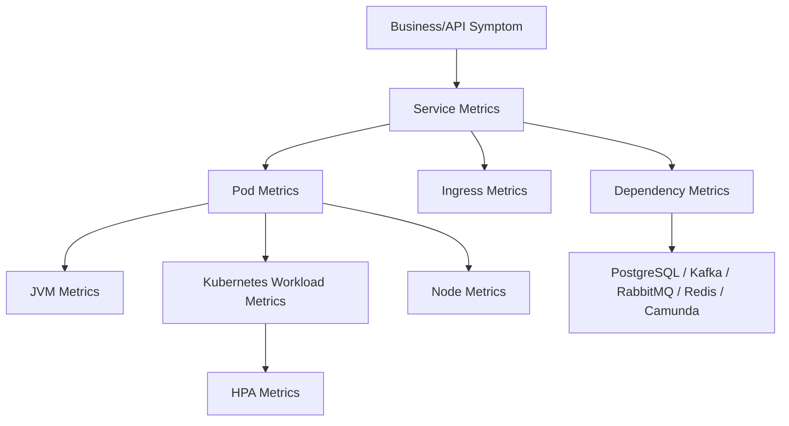
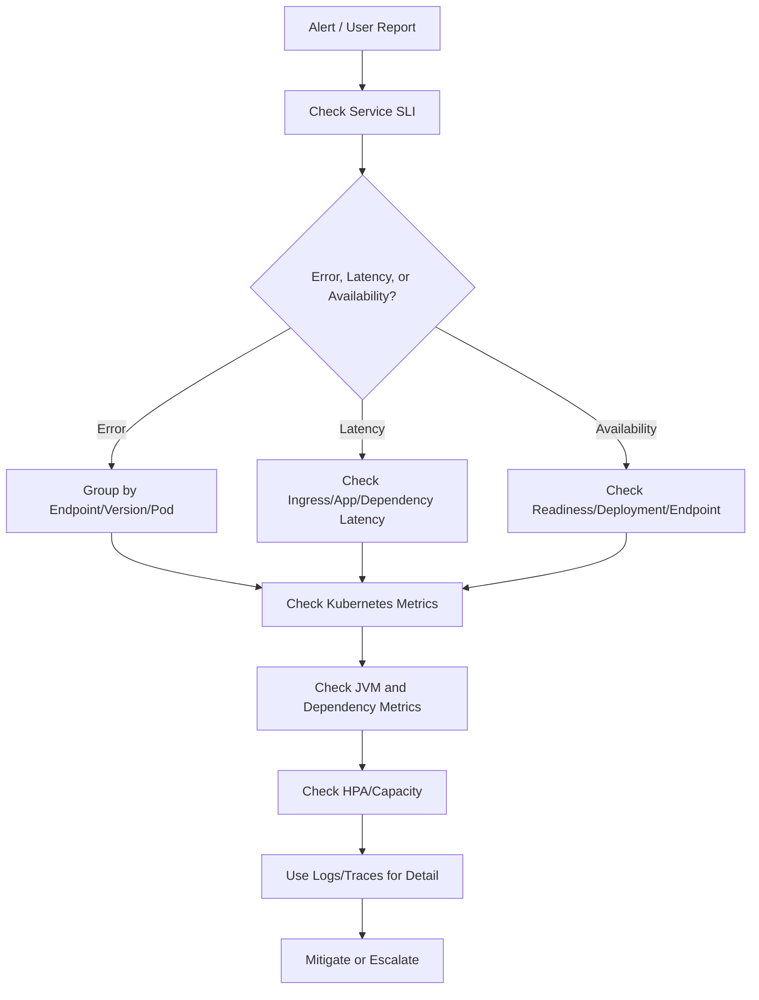

# Part 060 — Kubernetes Metrics Operations

## Tujuan

Metrics adalah sinyal numerik yang menunjukkan keadaan sistem dari waktu ke waktu. Dalam Kubernetes production, metrics membantu backend engineer menjawab:

- apakah service sehat atau hanya terlihat hidup?
- apakah error/latency meningkat?
- apakah pod kekurangan CPU atau memory?
- apakah CPU throttling berdampak ke latency?
- apakah OOM/restart meningkat?
- apakah readiness turun?
- apakah HPA bekerja?
- apakah node pressure memengaruhi workload?
- apakah dependency seperti PostgreSQL, Kafka, RabbitMQ, Redis, atau Camunda menjadi bottleneck?

Part ini membahas cara membaca metrics Kubernetes untuk backend service, bukan sekadar melihat grafik CPU/memory.

---

## 1. Metrics Mental Model

Metrics harus dibaca sebagai hubungan antar-layer.



Metrics are useful when they answer:

- How much?
- How often?
- Since when?
- Compared to what baseline?
- Is it isolated or widespread?
- Is it correlated with deployment?
- Is it correlated with dependency degradation?
- Is it saturation, traffic increase, bug, or platform issue?

Bad metric usage:

```text
CPU looks high, so add replicas.
```

Better metric reasoning:

```text
P95 latency increased after deployment. CPU usage is flat, but CPU throttling increased on new pods because CPU limit was reduced. GC pause also increased. Error rate is low, but timeout rate from ingress increased. Likely latency regression due to throttling, not traffic growth.
```

---

## 2. Metrics Scope for Backend Engineers

Backend engineers should deeply understand:

- API request rate
- API latency percentiles
- API error rate
- business operation failure rate
- pod readiness
- pod restart count
- container CPU usage
- CPU throttling
- container memory usage
- JVM heap/non-heap/native indicators
- GC pause/count
- thread pool saturation
- DB pool active/idle/waiting
- HTTP client pool saturation
- Kafka consumer lag
- RabbitMQ queue depth/unacked messages
- Redis latency/errors
- Camunda incident/job backlog
- deployment availability
- HPA status and scaling events

Platform/SRE usually owns:

- node health metrics
- control plane metrics
- CNI metrics
- CoreDNS metrics
- ingress controller platform health
- metrics pipeline availability
- cluster autoscaler/Karpenter metrics
- storage CSI metrics

Backend engineer should not blindly ignore platform metrics. They should read enough to decide when to escalate.

---

## 3. First Questions During Metric Investigation

When a metric looks bad, ask:

1. What changed?
2. When did it start?
3. Which service/version is affected?
4. Which pods are affected?
5. Which namespace/environment is affected?
6. Is it all traffic or one operation?
7. Is it all pods or one pod/node/zone?
8. Is it request path, dependency path, or worker path?
9. Did HPA scale up/down?
10. Is the metric source reliable?

Operational principle:

> Never interpret a single metric in isolation during production debugging.

---

## 4. Useful kubectl Metrics Commands

Basic resource usage:

```bash
kubectl -n <namespace> top pod
kubectl -n <namespace> top pod <pod>
kubectl top node
```

Sort by CPU or memory:

```bash
kubectl -n <namespace> top pod --sort-by=cpu
kubectl -n <namespace> top pod --sort-by=memory
```

Check requests/limits:

```bash
kubectl -n <namespace> describe pod <pod>
kubectl -n <namespace> get pod <pod> -o jsonpath='{.spec.containers[*].resources}'
```

Check Deployment and HPA:

```bash
kubectl -n <namespace> get deploy <deployment>
kubectl -n <namespace> describe deploy <deployment>
kubectl -n <namespace> get hpa
kubectl -n <namespace> describe hpa <hpa-name>
```

Check restart counts:

```bash
kubectl -n <namespace> get pods -o wide
kubectl -n <namespace> get pods -o custom-columns=NAME:.metadata.name,READY:.status.containerStatuses[*].ready,RESTARTS:.status.containerStatuses[*].restartCount,PHASE:.status.phase,NODE:.spec.nodeName
```

Limit of `kubectl top`:

- usually shows recent usage, not history
- does not show throttling directly
- does not show JVM heap/non-heap
- does not show request latency/error rate
- depends on metrics-server availability

For serious analysis, use metrics platform dashboards/queries.

---

## 5. CPU Usage Metrics

CPU usage tells how much CPU the container consumed.

Important comparisons:

| Compare | Meaning |
|---|---|
| usage vs request | Scheduling/capacity pressure and HPA CPU utilization basis |
| usage vs limit | Risk of throttling if near limit |
| usage vs latency | Whether CPU saturation correlates with slow response |
| usage vs traffic | Whether CPU cost per request changed |
| usage by pod | Hot pod or imbalance |
| usage before/after deployment | Regression detection |

Common mistake:

```text
CPU usage is only 500m, so CPU is fine.
```

Maybe wrong if:

- request is 250m and HPA is already pressured
- limit is 500m and throttling is high
- Java app has many runnable threads but quota restricts execution
- GC needs CPU but is throttled
- single-threaded bottleneck exists

Operational questions:

- Is CPU usage increasing because traffic increased?
- Did CPU per request increase after deployment?
- Are all pods equally loaded?
- Is one pod receiving more traffic?
- Is CPU usage near limit?
- Is throttling high even when average CPU looks moderate?

---

## 6. CPU Throttling Metrics

CPU throttling indicates the container wanted more CPU than the CFS quota allowed.

Symptoms that often correlate:

- higher p95/p99 latency
- timeout increase
- GC pause increase
- worker throughput drop
- queue lag increase
- readiness timeout
- liveness false positive
- slower startup

Useful metric concepts:

- throttled periods
- throttled seconds
- throttling ratio
- CPU quota/limit
- CPU usage vs CPU limit

Interpretation:

| Observation | Possible Meaning |
|---|---|
| High throttling + high latency | CPU limit may be too low |
| High throttling after deployment | resource limit changed or CPU cost increased |
| High throttling only on one pod | imbalance, noisy node, hot partition, hot traffic |
| Low CPU usage but high throttling | bursty workload constrained by quota |
| HPA not scaling despite throttling | CPU request/metric target may not reflect saturation |

Backend-specific risk:

Java services may be latency-sensitive even when average CPU usage looks acceptable. Thread scheduling, GC, JIT, TLS, serialization, JSON processing, and connection pool waits can all worsen under throttling.

Mitigation options:

- increase CPU limit
- remove CPU limit if internal policy allows
- increase CPU request
- tune HPA target
- reduce expensive code path
- reduce thread over-subscription
- optimize serialization/query calls
- coordinate with platform on node capacity

Do not blindly remove CPU limits without understanding cluster policy and noisy-neighbor risk.

---

## 7. Memory Usage Metrics

Memory metrics are harder than CPU because Java memory includes more than heap.

Watch:

- container memory working set
- RSS if available
- memory limit
- JVM heap used/committed/max
- non-heap/metaspace
- direct buffer memory
- thread count/stack memory
- GC pressure
- OOMKilled events
- node memory pressure

Important comparisons:

| Compare | Meaning |
|---|---|
| container memory vs limit | OOM risk |
| JVM heap max vs container limit | Heap may leave too little native memory |
| memory growth over time | Leak or cache growth |
| memory after GC | Live set trend |
| pod memory by replica | Imbalance or leak in subset |
| memory before/after deployment | Regression |

Java-specific warning:

```text
-Xmx is not the container memory usage.
```

Container memory includes:

- Java heap
- metaspace
- direct buffers
- thread stacks
- JIT/code cache
- native libraries
- TLS/native allocations
- mmap/file buffers
- application temporary buffers

Operational questions:

- Is memory usage stable after warmup?
- Does memory climb until restart?
- Did direct memory increase due to Netty/HTTP client/Kafka/Redis client?
- Did thread count increase?
- Did deployment change heap percentage?
- Is OOMKilled visible in pod status/events?

---

## 8. Restart Count Metrics

Restart count is one of the fastest workload health indicators.

High restart count can indicate:

- CrashLoopBackOff
- liveness probe killing app
- OOMKilled
- startup failure
- dependency failure during startup
- bad config/secret
- node eviction
- rollout churn

Commands:

```bash
kubectl -n <namespace> get pods
kubectl -n <namespace> describe pod <pod>
kubectl -n <namespace> logs <pod> --previous --tail=300
```

Metrics to watch:

- container restart increase rate
- restart count by pod
- restart count by deployment
- restart reason if exported
- deployment unavailable replicas
- pod readiness transitions

Interpretation:

| Pattern | Likely Direction |
|---|---|
| Restart spike after deployment | bad code/config/probe/resource |
| Restart only on one node | node pressure/runtime issue |
| Restart only one pod repeatedly | bad partition/state/local issue |
| Restart with OOMKilled | memory sizing/leak/native memory |
| Restart with liveness failure | probe config or app deadlock |
| Restart during node drain | planned maintenance/disruption |

---

## 9. Pod Readiness Metrics

Readiness controls whether pod receives traffic through Service/EndpointSlice.

Watch:

- ready pods count
- unavailable replicas
- EndpointSlice endpoint readiness
- readiness probe failure count
- readiness transition frequency
- time to readiness after startup
- readiness by version/ReplicaSet

Operational impact:

| Readiness Pattern | Impact |
|---|---|
| No pods ready | service outage / ingress 503 |
| Some pods not ready | reduced capacity |
| Flapping readiness | unstable traffic and latency |
| New version never ready | stuck rollout |
| Slow readiness | rollout slow, HPA scale-up slow |

Metrics should be correlated with events/logs:

```bash
kubectl -n <namespace> describe pod <pod>
kubectl -n <namespace> get endpointslice -l kubernetes.io/service-name=<service>
kubectl -n <namespace> logs <pod> --since=30m
```

Backend-specific question:

> Is readiness checking only local service ability, or is it blocked by a dependency that can cause cascading unready pods?

Dependency-heavy readiness can create traffic blackholes during transient dependency issues.

---

## 10. Deployment Availability Metrics

Deployment metrics help answer whether Kubernetes achieved desired availability.

Useful signals:

- desired replicas
- updated replicas
- ready replicas
- available replicas
- unavailable replicas
- observed generation
- rollout progress
- ProgressDeadlineExceeded

Commands:

```bash
kubectl -n <namespace> get deploy <deployment>
kubectl -n <namespace> describe deploy <deployment>
kubectl -n <namespace> rollout status deploy/<deployment>
```

Interpretation:

| Observation | Meaning |
|---|---|
| updated replicas low | rollout not progressing |
| ready replicas low | pods not ready |
| available replicas low | availability below minimum |
| old RS still serving | rollout partially complete |
| progress deadline exceeded | rollout stuck |
| desired > available | capacity or readiness issue |

Operational metrics should be compared with:

- rollout event
- deployment marker
- pod logs
- service endpoints
- ingress errors
- HPA scaling

---

## 11. HPA Metrics

HPA uses resource/custom/external metrics to adjust replica count.

Watch:

- current replicas
- desired replicas
- min replicas
- max replicas
- current metric value
- target metric value
- scaling events
- unable to fetch metric
- stabilization behavior
- scale-up/scale-down rate

Commands:

```bash
kubectl -n <namespace> get hpa
kubectl -n <namespace> describe hpa <hpa-name>
```

Interpretation:

| Observation | Possible Cause |
|---|---|
| HPA target unknown | metrics unavailable |
| HPA not scaling | metric below target, max/min bound, missing requests |
| HPA stuck at max | workload saturated or target too low |
| HPA flapping | unstable metric, low stabilization, bursty workload |
| HPA scales but latency remains high | dependency bottleneck or per-pod limit |
| HPA scales consumers too high | broker/DB pressure, rebalance, partition limit |

Backend owner must verify:

- metric represents actual bottleneck
- max replicas does not exceed dependency capacity
- scale-up time matches business expectation
- scale-down does not interrupt in-flight work
- CPU request exists when CPU utilization target is used

---

## 12. Network Metrics

Network metrics help identify traffic imbalance, egress issues, and dependency communication pattern changes.

Useful metrics:

- ingress request rate
- ingress 4xx/5xx
- upstream latency
- pod receive/transmit bytes
- pod network errors/drops if available
- connection count
- DNS request/error rate
- egress volume
- NAT/proxy metrics if available

Operational questions:

- Did request volume increase?
- Is traffic reaching ingress but not pods?
- Are 5xx errors from ingress or app?
- Did egress to dependency spike?
- Is one pod receiving more traffic?
- Did network errors/drops appear on affected node?
- Did NAT/proxy become bottleneck?

For Java/JAX-RS service:

- compare API request rate with pod CPU/memory
- compare upstream latency with app latency
- compare dependency client timeout rate with egress/network metrics

For cost:

- egress bytes matter, especially cross-zone, NAT, cross-region, and cloud-private endpoint paths.

---

## 13. Disk and Ephemeral Storage Metrics

Disk metrics matter for:

- file uploads
- batch processing
- temp files
- container writable layer
- logs
- EmptyDir
- local cache
- heap dumps

Watch:

- container filesystem usage
- ephemeral storage usage
- EmptyDir usage if available
- node disk pressure
- log volume
- eviction count
- PVC usage for stateful workloads

Operational symptoms:

- pod evicted
- node DiskPressure
- failed writes
- file processing stuck
- app cannot create temp file
- logs stop shipping
- crash during heap dump

Commands:

```bash
kubectl -n <namespace> describe pod <pod>
kubectl describe node <node>
kubectl -n <namespace> get events --sort-by='.lastTimestamp'
```

Be careful with `kubectl exec` disk inspection in production. Follow internal access policy.

---

## 14. Node Pressure Metrics

Node pressure can indirectly break backend workloads.

Node conditions:

- MemoryPressure
- DiskPressure
- PIDPressure
- Ready false/unknown
- NetworkUnavailable

Workload symptoms:

- pod eviction
- pod rescheduling
- increased latency
- image pull issue
- DNS/network issue on one node
- CPU contention
- noisy neighbor

Backend engineer should check:

```bash
kubectl get nodes
kubectl describe node <node>
kubectl -n <namespace> get pods -o wide
```

Then escalate if issue is node/platform-owned.

Interpretation:

| Pattern | Likely Direction |
|---|---|
| Only pods on one node fail | node issue |
| Evictions across node pool | capacity/pressure issue |
| Same app fails across nodes | app/deployment/config issue |
| Only one zone affected | zone/network/capacity issue |
| Node NotReady during incident | platform/SRE escalation |

---

## 15. JVM Metrics for Kubernetes Operations

For Java 17+ backend services, Kubernetes metrics are incomplete without JVM metrics.

Essential JVM metrics:

- heap used/committed/max
- non-heap/metaspace
- GC pause duration
- GC count
- thread count
- blocked/waiting threads
- class loading
- direct buffer pool
- HTTP server thread pool
- DB pool active/idle/waiting
- executor queue depth

Correlate with Kubernetes metrics:

| Kubernetes Metric | JVM Metric to Compare |
|---|---|
| container memory near limit | heap, non-heap, direct memory, thread count |
| CPU throttling | GC pause, runnable threads, latency |
| restart count | OOM, fatal JVM error, liveness failure |
| readiness failures | thread pool, DB pool, startup time, GC |
| latency spike | GC, thread pool, DB pool, HTTP client pool |

Example reasoning:

```text
Container memory climbs steadily, but JVM heap after GC is stable. Direct buffer memory and thread count increase. OOMKilled occurs at container limit. Likely native/direct/thread memory issue, not heap leak.
```

---

## 16. Dependency Metrics

Backend workload health depends on dependencies.

PostgreSQL metrics:

- connection count
- connection pool usage
- wait time to acquire connection
- query latency
- lock waits
- deadlocks
- transaction duration
- error count

Kafka metrics:

- consumer lag
- rebalance count
- assigned partitions
- commit latency/errors
- poll duration
- DLQ rate

RabbitMQ metrics:

- queue depth
- unacked messages
- redelivery rate
- consumer count
- publish/ack/nack rate
- channel/connection churn

Redis metrics:

- command latency
- connection count
- timeout/error rate
- evictions
- memory usage
- blocked clients

Camunda metrics:

- job backlog
- incidents
- activation latency
- completion failure
- worker throughput
- retry exhaustion

Operational principle:

> If service latency increases while CPU/memory look normal, check dependency metrics before scaling pods.

---

## 17. Application/API Metrics

For JAX-RS API service, core metrics:

- request rate by endpoint/operation
- response status count
- p50/p95/p99 latency
- error rate
- timeout rate
- request size/response size if relevant
- in-flight requests
- thread pool saturation
- dependency latency per client

Avoid excessive cardinality:

Bad labels:

```text
path=/quotes/123456789/items/987654321
customerId=...
quoteId=...
orderId=...
```

Better labels:

```text
route=/quotes/{quoteId}/items/{itemId}
operation=submitQuote
status_class=5xx
```

High cardinality can break metrics storage and increase cost.

---

## 18. Metrics and Deployment Markers

Metrics should be readable around deployments.

Need markers for:

- deployment start
- rollout complete
- rollback
- canary step
- blue-green traffic switch
- config change
- migration job

Questions:

- Did latency/error/restart increase after deployment?
- Are only new ReplicaSet pods affected?
- Did CPU/memory per request change?
- Did dependency calls increase?
- Did HPA scale differently?
- Did queue lag change after consumer deployment?

Without deployment markers, incident analysis becomes guesswork.

---

## 19. Metrics During Rollout

During rollout, watch:

- old vs new pod readiness
- unavailable replicas
- restart count
- readiness probe failures
- p95/p99 latency
- 5xx rate
- CPU/memory/throttling on new pods
- DB pool usage
- Kafka/RabbitMQ lag/backlog
- ingress upstream errors
- deployment progress

Rollback decision should consider metrics like:

- sustained error rate increase
- SLO burn spike
- no pods ready in new ReplicaSet
- CrashLoopBackOff on new pods
- severe latency regression
- dependency overload caused by new version
- consumer lag increasing due to new version

Do not rely only on rollout status. Kubernetes can consider a rollout successful while the business operation is degraded.

---

## 20. Metrics for Incident Triage

Incident flow:



Questions metrics should answer quickly:

- Is this a user-visible symptom?
- Is it one service or many?
- Is it one version or all versions?
- Is it one pod/node/zone?
- Did it start after deployment?
- Is dependency degraded?
- Is workload saturated?
- Is autoscaling helping?
- Is rollback likely to help?

---

## 21. Common Metrics Misinterpretations

| Misinterpretation | Better Interpretation |
|---|---|
| CPU low means service is healthy | It may be blocked on DB/network/thread pool |
| Memory below limit means no memory issue | JVM/native leak may still be growing |
| HPA scaled up so incident is fixed | Dependency may still be bottleneck |
| No error logs means no issue | Metrics may show latency/SLO burn |
| Rollout complete means release is healthy | Business operation metrics may be broken |
| Queue depth low means consumers are fine | Messages may be failing and going to DLQ |
| Restart count unchanged means no issue | Readiness may be flapping or latency degraded |
| Node CPU high means app bug | Could be noisy neighbor or cluster capacity |

---

## 22. Metric Cardinality and Cost

Metrics cardinality is the number of unique time series.

High-cardinality labels include:

- user ID
- quote ID
- order ID
- account ID
- raw URL path with IDs
- pod UID if not needed
- exception message
- full SQL query
- message key

Safe labels usually include:

- service
- environment
- namespace
- operation
- route template
- status class
- dependency
- error type
- version
- pod for infrastructure metrics

Cost and reliability risk:

- high ingestion cost
- slow dashboard queries
- dropped metrics
- cardinality limit breach
- unstable alert queries

Backend PR review should include metric label review.

---

## 23. Metrics for Autoscaling Decisions

Autoscaling metric must represent the scaling bottleneck.

| Workload | Better Scaling Signal |
|---|---|
| CPU-bound API | CPU utilization + latency guardrail |
| IO-bound API | latency, in-flight requests, pool saturation, custom metric |
| Kafka consumer | lag per partition/group + processing rate |
| RabbitMQ consumer | queue depth/unacked + processing rate |
| Batch worker | backlog + job duration + dependency capacity |
| Camunda worker | activated jobs/backlog/incidents + throughput |

Bad autoscaling pattern:

```text
Scale Kafka consumers using CPU only.
```

Possible problem:

- lag increases but CPU remains low because consumer is blocked on DB
- HPA does not scale
- backlog grows

Better:

- queue/lag-based scaling
- max replicas limited by partition/dependency capacity
- latency/error guardrails
- scale-down stabilization

---

## 24. Alerting Metrics vs Dashboard Metrics

Not every dashboard metric should alert.

Paging alerts should be:

- symptom-based
- user-impacting
- actionable
- owned
- linked to runbook

Good paging candidates:

- SLO burn rate
- high 5xx error rate
- severe latency regression
- no ready pods for critical service
- CrashLoopBackOff across replicas
- consumer lag above business threshold
- queue backlog breaching SLA
- dependency pool exhaustion causing failures

Ticket/non-paging candidates:

- moderate CPU request waste
- slow memory growth below risk threshold
- log volume increase
- single pod restart recovered automatically
- non-critical dashboard missing metric

Avoid alerting directly on every low-level metric without user impact.

---

## 25. Example: Latency Spike Investigation

Symptom:

```text
Quote submission p95 latency increased from 500ms to 4s.
```

Metric investigation:

1. Check API latency by endpoint/operation.
2. Check error/timeout rate.
3. Check deployment marker.
4. Compare old/new version if rollout occurred.
5. Check pod CPU usage and throttling.
6. Check JVM GC pause and thread pool saturation.
7. Check DB pool waiting time and query latency.
8. Check ingress upstream latency.
9. Check dependency metrics.
10. Use traces/logs for representative slow requests.

Possible findings:

```text
Latency spike starts after deployment. CPU usage unchanged, but DB connection pool wait time rises from 5ms to 2s. DB active connections equal max pool across all pods. New version increased parallel DB calls per request. Scaling pods would worsen DB pressure.
```

Mitigation may be rollback or feature flag disable, not HPA scale-up.

---

## 26. Example: Consumer Lag Investigation

Symptom:

```text
Kafka lag for quote.submitted consumer group is increasing.
```

Metric investigation:

1. Check lag by partition.
2. Check consumer replica count.
3. Check assigned partitions per pod.
4. Check rebalance count.
5. Check processing rate.
6. Check DB/HTTP dependency latency.
7. Check error/DLQ rate.
8. Check CPU/memory/throttling.
9. Check HPA/KEDA status.
10. Check recent deployment.

Possible findings:

```text
Lag increases after rollout. Consumer pods are healthy, CPU low, but DB pool wait is high and retry rate increased. More replicas would exceed DB connection budget. Safer mitigation is rollback or reduce concurrency, not scale out.
```

---

## 27. Internal Verification Checklist

Verify internally:

- What metrics backend is used?
- What metrics are available for pods, deployments, nodes, ingress, HPA, and dependencies?
- Is metrics-server installed and reliable?
- Are Prometheus-style metrics available?
- Are JVM metrics exported for Java services?
- Are DB pool metrics exported?
- Are HTTP client pool metrics exported?
- Are Kafka consumer lag metrics available?
- Are RabbitMQ queue depth/unacked metrics available?
- Are Redis latency/error metrics available?
- Are Camunda worker/job/incident metrics available?
- Are deployment markers visible on dashboards?
- Are metrics tagged with service, namespace, environment, version, and team?
- Are high-cardinality labels controlled?
- Are HPA target metrics visible and explainable?
- Are node pressure metrics visible to backend engineers?
- Are dashboards linked from alerts?
- Are SLO burn-rate metrics defined?
- Is metrics retention sufficient for incident/RCA?
- Are metrics access permissions appropriate?
- Are cost/cardinality reports reviewed?

---

## 28. PR Review Checklist

When reviewing backend or Kubernetes PRs, check:

- Does the change add or modify metrics?
- Are labels low-cardinality?
- Are operation/route labels normalized?
- Are sensitive identifiers excluded?
- Are JVM metrics still exposed?
- Are dependency metrics still exposed?
- Does resource request/limit change affect HPA?
- Does new workload need custom/external metric?
- Does scaling max replica respect dependency capacity?
- Are dashboard panels updated?
- Are alert thresholds still valid?
- Are deployment markers preserved?
- Does readiness metric reflect traffic safety?
- Are new async/batch workflows observable?

---

## 29. Production Debugging Checklist

During incident, check metrics in this order:

1. Service SLI: availability, latency, error rate.
2. Traffic: request rate, operation mix, ingress status.
3. Deployment: marker, version, rollout state.
4. Pods: ready count, restarts, unavailable replicas.
5. Resources: CPU, memory, throttling, ephemeral storage.
6. JVM: heap, GC, threads, pool saturation.
7. Dependencies: DB, Kafka, RabbitMQ, Redis, Camunda, external APIs.
8. Autoscaling: HPA desired/current, metric availability, max replica.
9. Node: pressure, NotReady, zone/node pool concentration.
10. Logs/traces: details for representative failures.

The goal is not to stare at dashboards. The goal is to narrow the failure domain.

---

## 30. Failure-Oriented Summary

Metrics help separate these cases:

- Traffic increased vs code became expensive.
- CPU saturation vs CPU throttling.
- JVM heap leak vs native memory growth.
- Pod crash vs readiness failure.
- App regression vs dependency bottleneck.
- HPA metric failure vs cluster capacity shortage.
- Node-local issue vs service-wide issue.
- Queue backlog due to low consumers vs downstream bottleneck.
- Rollout success at Kubernetes level vs business SLO regression.

Operational invariant:

> Good metrics make failure domain visible before logs explain the details.

