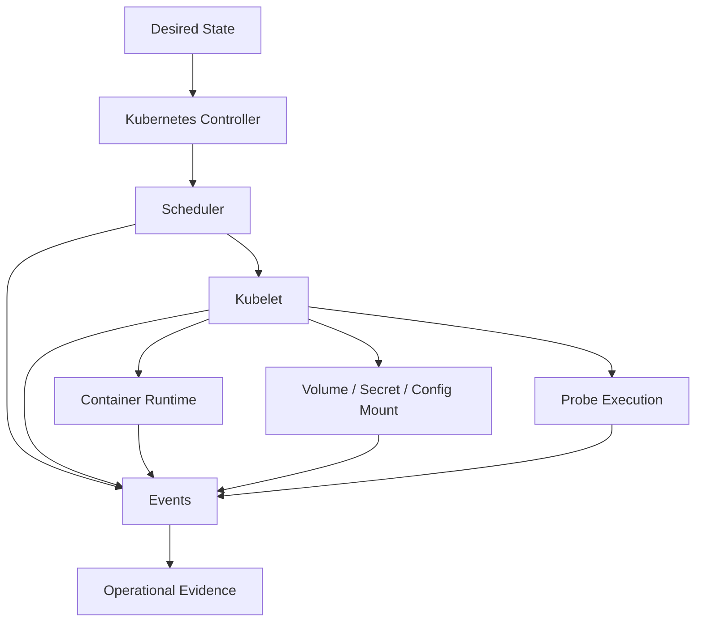
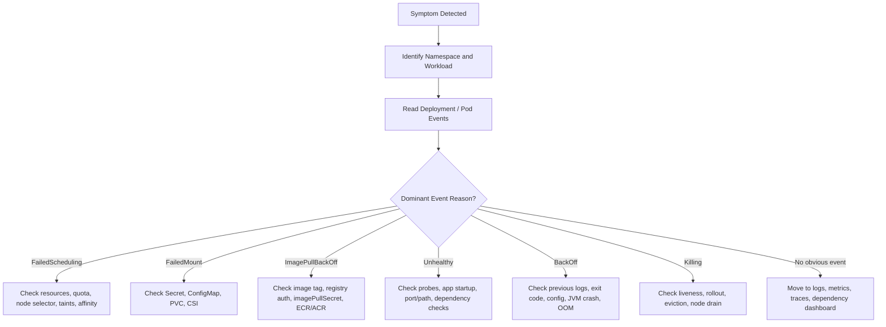
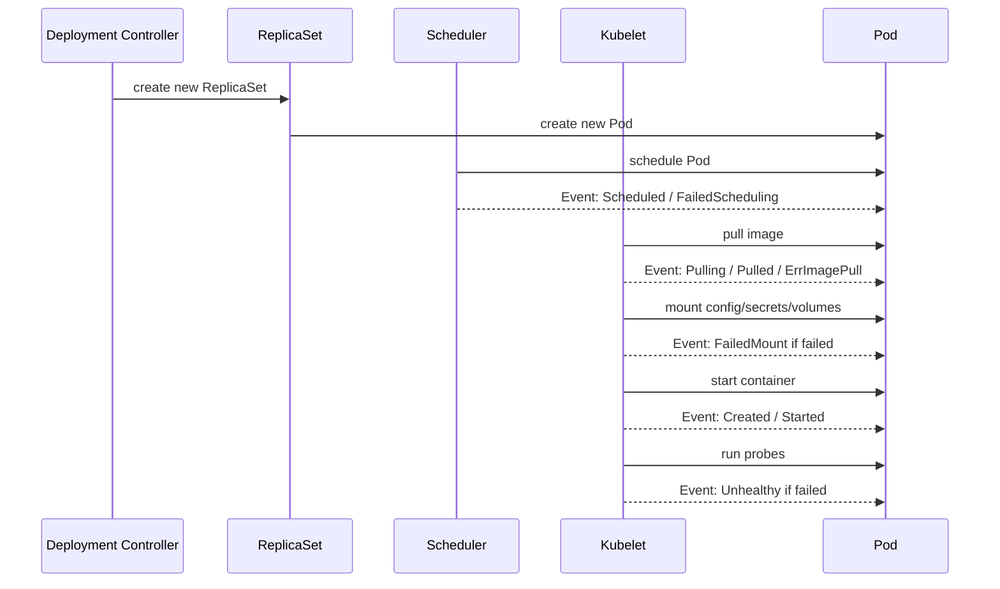

# Part 061 — Kubernetes Events Operations

## Tujuan

Kubernetes Events adalah catatan singkat tentang sesuatu yang terjadi pada object Kubernetes: pod gagal dijadwalkan, image gagal ditarik, volume gagal di-mount, probe gagal, container dibunuh, node menekan pod karena resource pressure, dan sebagainya.

Untuk backend engineer, Events adalah lapisan observability pertama sebelum masuk ke logs, metrics, traces, atau dashboard dependency.

Events membantu menjawab:

- apakah pod gagal karena aplikasi atau scheduler?
- apakah container crash atau tidak pernah sempat start?
- apakah image pull gagal karena registry/auth/network?
- apakah readiness failure berasal dari probe atau aplikasi lambat?
- apakah volume/secret/config gagal di-mount?
- apakah pod di-kill karena liveness probe, eviction, rollout, atau node drain?
- apakah issue muncul setelah deployment terbaru?
- apakah failure isolated ke satu pod/node/namespace atau widespread?

Part ini membahas cara membaca Kubernetes Events secara operasional, bukan sekadar menjalankan `kubectl describe`.

---

## 1. Events Mental Model



Events are not application logs. They are Kubernetes control-plane and node-side signals.

A useful interpretation rule:

> Logs tell what the application said. Events tell what Kubernetes tried to do to the workload.

Examples:

| Symptom | Event can reveal |
|---|---|
| Pod Pending | FailedScheduling, quota, taint, affinity, insufficient CPU/memory |
| Pod not starting | Pulling, Pulled, Failed, ImagePullBackOff, ErrImagePull |
| Pod crash loop | BackOff, Killing, container exit reason |
| Pod not ready | Unhealthy readiness probe failed |
| Pod restarting | Killing due to liveness probe or container failure |
| Pod missing config | FailedMount, secret/configmap not found |
| Pod evicted | Evicted, node pressure, ephemeral storage/memory issue |

Events should be read early in an incident because they often reduce the search space quickly.

---

## 2. What Events Are Good For

Events are excellent for detecting lifecycle and orchestration failures:

- scheduling failures
- image pull failures
- container start failures
- mount failures
- probe failures
- restart loops
- node pressure and eviction
- rollout-related pod replacement
- PDB/drain-related disruption
- HPA-related replica changes
- ingress/controller reconciliation messages
- service endpoint changes in some controllers

Events are weaker for:

- application business logic errors
- SQL query performance
- Kafka consumer lag root cause
- RabbitMQ message redelivery logic
- Redis hot-key behavior
- Camunda process incident details
- request-level latency diagnosis
- distributed trace propagation issues

Use Events as the first Kubernetes truth layer, then correlate with logs, metrics, traces, and dependency dashboards.

---

## 3. Event Object Fields That Matter

A Kubernetes Event usually has fields similar to:

| Field | Meaning | How to use it |
|---|---|---|
| `type` | `Normal` or `Warning` | Warning needs investigation; Normal may provide timeline |
| `reason` | Short machine-readable cause | Main grouping key for triage |
| `message` | Human-readable details | Read carefully; often contains exact missing object or scheduling reason |
| `involvedObject` | Object affected | Pod, Deployment, ReplicaSet, Job, Node, etc. |
| `source` / `reportingController` | Component reporting event | kubelet, scheduler, controller, ingress controller |
| `firstTimestamp` | First time event occurred | Helps correlate with deployment or incident start |
| `lastTimestamp` | Last time event occurred | Shows whether problem is ongoing |
| `count` | Number of repeated occurrences | Indicates recurrence or flapping |

Operationally, `reason`, `message`, `involvedObject`, `lastTimestamp`, and `count` are the most immediately useful.

---

## 4. Production-Safe Event Commands

Safe read-only commands:

```bash
kubectl get events -n <namespace> --sort-by=.lastTimestamp
```

```bash
kubectl get events -n <namespace> \
  --field-selector involvedObject.kind=Pod \
  --sort-by=.lastTimestamp
```

```bash
kubectl describe pod <pod-name> -n <namespace>
```

```bash
kubectl describe deployment <deployment-name> -n <namespace>
```

```bash
kubectl describe job <job-name> -n <namespace>
```

```bash
kubectl get events -A --sort-by=.lastTimestamp
```

Use cluster-wide `-A` carefully in large production clusters. Prefer namespace-specific investigation unless incident impact is unclear.

Useful watch during active incident:

```bash
kubectl get events -n <namespace> --watch
```

Use watch only when needed. For evidence capture, static snapshots are easier to attach to incident notes.

---

## 5. Event Triage Flow



The goal is not to memorize every reason. The goal is to map each reason to the next safest investigation step.

---

## 6. Common Event Reasons and Meaning

| Event reason | Typical meaning | First check |
|---|---|---|
| `Scheduled` | Pod assigned to node | Confirms scheduler succeeded |
| `FailedScheduling` | Scheduler cannot place pod | Resources, quota, taints, affinity, PVC |
| `Pulling` | Node starts pulling image | Image path reachable at least attempted |
| `Pulled` | Image successfully pulled | Registry/image likely fine |
| `Failed` | Generic failure; message matters | Read message exactly |
| `ErrImagePull` | Immediate image pull failure | Tag, registry, auth, network |
| `ImagePullBackOff` | Retrying image pull after failure | Same as above plus repeated backoff |
| `Created` | Container created | Runtime created container |
| `Started` | Container started | App process started |
| `BackOff` | Restart backoff after crash | Previous logs and exit reason |
| `Killing` | Kubelet killing container | Liveness, rollout, eviction, shutdown |
| `Unhealthy` | Probe failed | Probe config and endpoint behavior |
| `FailedMount` | Volume/secret/config mount failed | Secret, ConfigMap, PVC, CSI |
| `FailedAttachVolume` | Volume attach failed | Storage/CSI/cloud volume issue |
| `Evicted` | Pod evicted due to pressure | Node pressure, memory, disk, ephemeral storage |

Important: event reason alone is not enough. The `message` usually contains the real clue.

---

## 7. FailedScheduling Events

`FailedScheduling` means the pod has not been assigned to a node.

Typical messages include:

```text
0/12 nodes are available: 8 Insufficient cpu, 4 node(s) had untolerated taint.
```

```text
0/8 nodes are available: 8 node(s) didn't match Pod's node affinity/selector.
```

```text
0/5 nodes are available: persistentvolumeclaim "..." not found.
```

Operational interpretation:

| Message clue | Likely cause | Backend action |
|---|---|---|
| `Insufficient cpu` | Requests too high or node capacity insufficient | Review request, HPA/replica count, escalate capacity |
| `Insufficient memory` | Memory request too high | Review sizing and node pool capacity |
| `untolerated taint` | Workload not allowed on node pool | Check tolerations/placement policy |
| `didn't match node selector` | Selector too restrictive/wrong | Review manifest/Helm values |
| `pod affinity/anti-affinity` | Placement constraint impossible | Review spread/anti-affinity rules |
| `quota exceeded` | Namespace quota reached | Check ResourceQuota and ownership |
| `PVC not found/bound` | Storage dependency missing | Check PVC and storage owner |

Backend engineer should usually not modify node capacity directly. The safe action is evidence capture and escalation with precise event messages.

---

## 8. Image Pull Events

Image pull events include:

- `Pulling`
- `Pulled`
- `ErrImagePull`
- `ImagePullBackOff`

Common failure modes:

| Failure | Event clue | Likely cause |
|---|---|---|
| Wrong tag | `manifest unknown` | Image was not pushed or tag mismatch |
| Auth failure | `unauthorized` / `denied` | ImagePullSecret, ECR/ACR permission |
| Registry unavailable | timeout / connection refused | Registry outage or network issue |
| Private registry route issue | DNS/connection timeout | Egress/proxy/private endpoint issue |
| Rate limit | rate limit message | Public registry limit or mirror issue |

Production-safe investigation:

```bash
kubectl describe pod <pod> -n <namespace>
```

```bash
kubectl get pod <pod> -n <namespace> -o jsonpath='{.spec.containers[*].image}'
```

```bash
kubectl get secret -n <namespace>
```

Do not print secret data. Validate secret existence/reference, not credential contents.

Internal verification checklist:

- is the image tag/digest expected?
- did pipeline push the image?
- does the workload use correct `imagePullSecrets`?
- does ECR/ACR permission exist?
- is registry reachable from node/pod network?
- is GitOps rendering the expected image?

---

## 9. FailedMount Events

`FailedMount` often means Kubernetes cannot mount a volume, Secret, ConfigMap, projected token, or PVC.

Examples:

```text
MountVolume.SetUp failed for volume "app-config": configmap "quote-service-config" not found
```

```text
MountVolume.SetUp failed for volume "db-secret": secret "quote-db-secret" not found
```

```text
Unable to attach or mount volumes: unmounted volumes=[data]
```

Common causes:

- ConfigMap not created
- Secret not created
- wrong namespace
- typo in manifest/values
- GitOps sync ordering issue
- External Secrets sync failure
- CSI driver issue
- PVC pending
- cloud volume attach failure
- projected service account token issue

Backend relevance:

- missing DB credential can prevent Java app startup
- missing truststore/keystore secret can break TLS
- missing ConfigMap can cause CrashLoopBackOff
- stale or missing external secret can break cloud access
- PVC mount failure can block batch/file processing job

Production-safe commands:

```bash
kubectl describe pod <pod> -n <namespace>
```

```bash
kubectl get configmap <name> -n <namespace>
```

```bash
kubectl get secret <name> -n <namespace>
```

```bash
kubectl get pvc -n <namespace>
```

Do not decode secret values during normal investigation.

---

## 10. Unhealthy Probe Events

`Unhealthy` means kubelet probe failed.

Common messages:

```text
Readiness probe failed: HTTP probe failed with statuscode: 503
```

```text
Liveness probe failed: Get "http://10.x.x.x:8080/health": context deadline exceeded
```

```text
Startup probe failed: dial tcp 10.x.x.x:8080: connect: connection refused
```

Operational interpretation:

| Probe | Impact |
|---|---|
| Startup probe failure | Container may be killed before app fully starts |
| Readiness probe failure | Pod removed from Service endpoints; traffic stops |
| Liveness probe failure | Container restarted; can cause restart loop |

Backend-specific causes:

- Java startup slower than configured initial delay
- wrong management port
- wrong health path
- dependency health check blocks readiness
- DB pool initialization slow
- Kafka/RabbitMQ connection attempted during startup
- Redis/Camunda dependency check too strict
- GC pause or CPU throttling causes timeout
- app server bound to localhost instead of container interface

Safe investigation:

```bash
kubectl describe pod <pod> -n <namespace>
```

```bash
kubectl logs <pod> -n <namespace> --previous
```

```bash
kubectl get endpointslice -n <namespace> -l kubernetes.io/service-name=<service>
```

Escalate if probe failures correlate with node pressure, CNI issue, ingress controller issue, or platform-wide DNS/dependency failure.

---

## 11. BackOff Events

`BackOff` means Kubernetes is delaying restart attempts after repeated container failures.

Typical clue:

```text
Back-off restarting failed container app in pod quote-service-...
```

Common backend causes:

- missing environment variable
- invalid configuration
- missing secret/config mount
- JVM exits during bootstrap
- incompatible database migration
- port already unavailable inside container
- application fails to bind expected port
- OOM before readiness
- fatal dependency initialization
- classpath/library mismatch

Investigation order:

1. Read pod events.
2. Read current logs.
3. Read previous logs.
4. Check exit code and reason.
5. Check recent deployment/config/secret changes.
6. Check resource and OOM status.
7. Decide rollback vs config fix vs escalation.

Commands:

```bash
kubectl describe pod <pod> -n <namespace>
```

```bash
kubectl logs <pod> -n <namespace> --previous
```

```bash
kubectl get pod <pod> -n <namespace> -o jsonpath='{.status.containerStatuses[*].lastState.terminated}'
```

---

## 12. Killing Events

`Killing` can be normal or dangerous.

Normal cases:

- rolling update replaces old pod
- scale down reduces replicas
- node drain evicts pod
- manual deletion by authorized operator

Dangerous cases:

- liveness probe keeps killing app
- pod evicted due to node pressure
- application ignores SIGTERM and receives SIGKILL
- rollout kills too many pods due to bad maxUnavailable/PDB
- HPA scales down while queue consumer still processing

Questions to ask:

- Was there a deployment or scale event?
- Did liveness probe fail before killing?
- Was node drained?
- Did termination grace period expire?
- Did the app shut down gracefully?
- Were in-flight HTTP requests or Kafka/RabbitMQ messages interrupted?
- Did Camunda worker finish/extend/return active jobs safely?

---

## 13. Event Retention and Limitations

Kubernetes Events are not long-term audit logs.

Limitations:

- events expire quickly depending on cluster configuration
- repeated events are aggregated by count
- event messages can be truncated
- not every controller emits enough detail
- application-level causes may not appear in events
- event timestamps may need correlation with other systems
- event volume can be high during incidents

Implication:

> Capture events early during an incident.

Evidence capture example:

```bash
kubectl get events -n <namespace> --sort-by=.lastTimestamp > events-<incident-id>.txt
```

Only do this according to internal incident evidence policy.

---

## 14. Events in Rollout Debugging

During rollout, Events help distinguish:

- new pod cannot schedule
- new image cannot pull
- new config/secret cannot mount
- new pod starts but fails readiness
- new pod crash loops
- old pod being killed normally
- deployment progress deadline exceeded

Sequence:



A rollout is not just `kubectl rollout status`. It is a sequence of event-backed state transitions.

---

## 15. Events and Java/JAX-RS Backend

Kubernetes Events do not understand JAX-RS, but they expose runtime symptoms around it:

| Java/JAX-RS issue | Possible event |
|---|---|
| slow JVM startup | startup/readiness `Unhealthy` |
| bad environment config | `BackOff`, crash events |
| missing DB secret | `FailedMount` or app crash |
| wrong management endpoint | probe `Unhealthy` |
| app binds wrong port | probe connection refused |
| CPU throttling causing probe timeout | `Unhealthy` plus metrics correlation |
| OOM during startup | `Killing`, `BackOff`, `OOMKilled` status |
| graceful shutdown too slow | `Killing`, SIGKILL after grace period |

Events show the Kubernetes-side symptom. Logs/metrics/traces explain the application-side reason.

---

## 16. Events and Dependencies

Events can expose dependency setup failure indirectly:

| Dependency | Event-related symptom |
|---|---|
| PostgreSQL | app crash/backoff due to invalid DB config or TLS secret mount failure |
| Kafka | consumer pod crash/backoff if bootstrap config invalid |
| RabbitMQ | consumer readiness failure if strict broker readiness check is used |
| Redis | readiness failure or crash if Redis config missing |
| Camunda | worker crash/backoff or readiness failure due to endpoint/credential issue |
| NGINX/Ingress | ingress controller events may show backend/service config issue |

Be careful: dependency runtime degradation usually appears more clearly in application metrics/traces/logs than Kubernetes Events.

---

## 17. EKS/AKS/On-Prem Considerations

### EKS

Event clues may relate to:

- VPC CNI IP exhaustion causing scheduling/networking symptoms
- EBS CSI volume attach/mount failures
- ECR auth/image pull failures
- AWS Load Balancer Controller reconciliation events
- node group capacity and spot interruption-related pod movement

### AKS

Event clues may relate to:

- Azure CNI/subnet capacity
- Azure Disk CSI mount/attach failures
- ACR pull permission failures
- Application Gateway Ingress Controller events
- node pool capacity and VMSS issues

### On-prem/hybrid

Event clues may relate to:

- private registry access
- proxy/NO_PROXY misconfiguration
- internal CA/trust issues
- storage provisioner failures
- corporate DNS problems
- firewall-blocked dependency routes

Internal verification is mandatory. Do not infer platform topology from generic Kubernetes behavior.

---

## 18. Safe Mitigation Based on Events

| Event pattern | Possible safe mitigation | Escalation |
|---|---|---|
| Bad image tag | rollback manifest/image version | CI/CD or release owner |
| Missing ConfigMap | restore expected config through GitOps | app/platform depending on owner |
| Missing Secret | trigger approved secret sync/rotation path | security/platform |
| Probe failure after deploy | rollback or fix probe/app config | app owner |
| FailedScheduling due to capacity | reduce accidental request spike or escalate capacity | platform/SRE |
| FailedMount PVC/CSI | avoid repeated risky restarts; escalate | platform/storage |
| Node pressure/eviction | capture affected pods; escalate | platform/SRE |
| NetworkPolicy-related symptom | propose minimal rule change | security/platform |

Do not mutate production blindly because an event looks obvious. Use events to narrow the hypothesis, then validate safely.

---

## 19. Internal Verification Checklist

For each critical backend workload, verify:

- namespace event visibility
- event retention window
- access to `kubectl get events`
- access to `kubectl describe` for Pod/Deployment/Job
- event export into observability stack if available
- dashboard panel for recent Kubernetes events
- alert correlation with events
- common event runbooks
- policy for evidence capture during incident
- policy for reading events across namespaces
- mapping from event reason to owner/escalation path
- known platform-specific event patterns for EKS/AKS/on-prem
- runbook for FailedScheduling
- runbook for FailedMount
- runbook for ImagePullBackOff
- runbook for Unhealthy probe
- runbook for BackOff/CrashLoopBackOff
- runbook for Evicted

CSG/team-specific items to verify internally:

- which observability stack stores Kubernetes events
- whether events are retained beyond Kubernetes default retention
- whether backend engineers have read access to events in production
- which team owns CSI/storage failures
- which team owns registry/image pull failures
- which team owns ingress controller events
- which team owns CNI/networking-related events
- whether incident templates require event snapshots

---

## 20. PR Review Checklist

When reviewing Kubernetes workload changes, check whether the PR can create event-visible failure:

- image tag/digest changed?
- `imagePullSecrets` changed?
- resource requests increased beyond namespace/node capacity?
- node selector/affinity/toleration changed?
- PVC/volume reference changed?
- ConfigMap/Secret reference changed?
- probe path/port/timeout changed?
- lifecycle hook changed?
- termination grace period changed?
- service account changed?
- NetworkPolicy changed?
- ingress/service port changed?
- rollout strategy changed?
- Helm/Kustomize overlay changed only in one environment?

Ask: if this fails, what event would we expect to see, and do we have a runbook for it?

---

## 21. Operational Anti-Patterns

Avoid these patterns:

- jumping to application logs before reading pod events
- treating `Normal` events as irrelevant
- ignoring event count and last timestamp
- assuming `CrashLoopBackOff` always means code bug
- assuming `Pending` always means cluster issue
- decoding secrets during routine event investigation
- deleting pods to “fix” unknown failures without root cause
- using `kubectl get events -A` as first step in known namespace incident
- failing to capture events before retention expires
- ignoring node-related events affecting only one subset of pods

---

## 22. Final Mental Model

Kubernetes Events are operational breadcrumbs.

They do not replace logs, metrics, or traces, but they tell you what Kubernetes attempted and where orchestration failed.

Use this sequence:

```text
Symptom
→ Identify workload
→ Read Events
→ Map Event reason to lifecycle phase
→ Correlate with logs/metrics/traces
→ Check recent changes
→ Choose safe mitigation
→ Escalate with evidence when outside backend ownership
```

For senior backend engineers, Events are a fast way to avoid wrong debugging paths.

A production-ready service owner should know the common Events for their workload, what they mean, what evidence to capture, and which team owns the next action.
