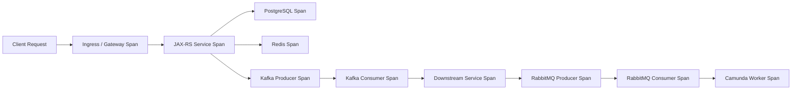
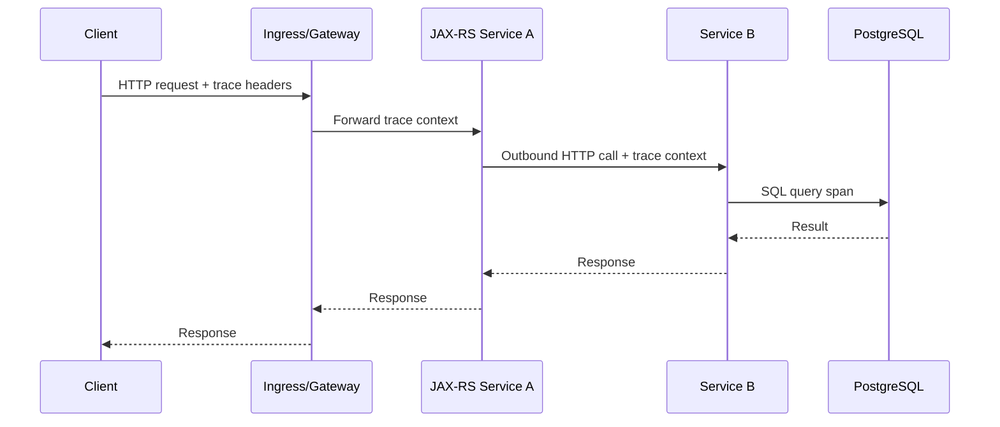
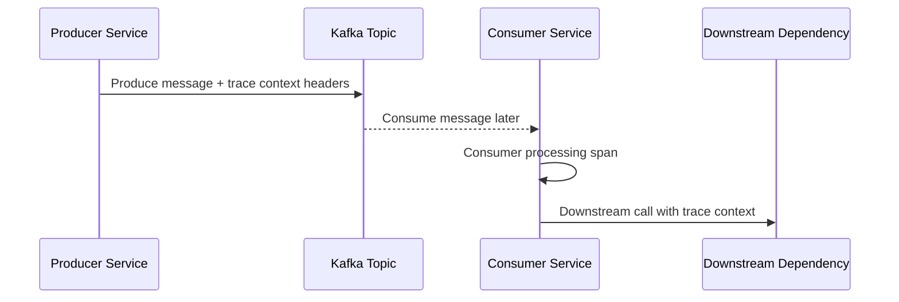
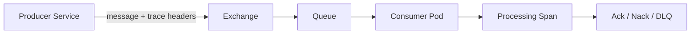
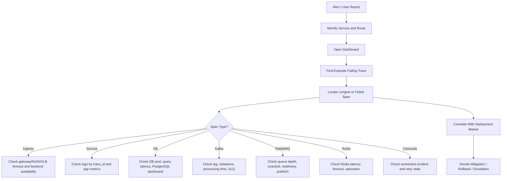

# Part 062 — Distributed Tracing Across Kubernetes Services

## Tujuan

Distributed tracing membantu backend engineer mengikuti satu request atau business operation saat melewati banyak boundary:

- client
- ingress/API gateway/NGINX
- Kubernetes Service
- Java/JAX-RS service
- internal HTTP call
- PostgreSQL query
- Kafka publish/consume
- RabbitMQ publish/consume
- Redis call
- Camunda worker/job execution
- external AWS/Azure service

Dalam sistem CPQ, quote management, order lifecycle, billing integration, dan enterprise integration, satu user action jarang berhenti di satu service. Tanpa tracing, incident analysis sering berubah menjadi pencarian log manual antar service.

Part ini membahas tracing sebagai alat operasional production debugging untuk Kubernetes backend workloads.

---

## 1. Tracing Mental Model



A trace is an end-to-end graph of related spans.

A span represents one unit of work:

- inbound HTTP request
- outbound HTTP call
- DB query
- Redis command
- Kafka publish
- Kafka consume/process
- RabbitMQ publish
- RabbitMQ consume/process
- Camunda job activation/execution
- external cloud API call

The key operational question:

> Where did time, failure, retry, or context propagation break?

---

## 2. Core Concepts

| Concept | Meaning | Operational use |
|---|---|---|
| Trace | Whole request/operation path | End-to-end debugging |
| Trace ID | ID shared by all spans in one trace | Correlate logs, metrics, and traces |
| Span | Timed unit of work | Locate latency/failure segment |
| Parent span | Caller span | Reconstruct call hierarchy |
| Child span | Work triggered by parent | Detect downstream latency |
| Span attribute | Metadata on span | Route, status, peer, DB, topic, queue |
| Span event | Point-in-time event inside span | Retry, exception, checkpoint |
| Baggage | Context propagated across services | Use carefully; avoid sensitive data |
| Sampling | Decision to keep/drop traces | Explains missing traces |

Trace ID must appear in application logs where possible. Without log correlation, tracing loses much of its incident value.

---

## 3. Why Tracing Matters in Kubernetes

Kubernetes adds runtime indirection:

```text
Client
→ DNS
→ Load Balancer
→ Ingress Controller
→ Service
→ EndpointSlice
→ Pod
→ Container
→ JAX-RS endpoint
→ Dependency call
```

Metrics can show latency increased. Logs can show errors. Events can show pod lifecycle. Tracing connects them through the actual request path.

Tracing is especially useful when:

- ingress latency is high but pod CPU looks normal
- API returns timeout but downstream service logs look healthy
- Kafka consumer lag increases after upstream deployment
- RabbitMQ redelivery increases but consumer pods are ready
- PostgreSQL latency affects only specific API route
- Redis timeout causes cascading service failure
- Camunda worker incidents spike after deployment
- only one tenant/account/quote/order flow is affected
- retry storm hides the first failure

---

## 4. Backend Engineer Responsibility

Backend engineer should ensure:

- inbound HTTP requests generate spans
- outbound HTTP clients propagate trace context
- logs include trace ID and span ID when possible
- important business identifiers are added safely as low-cardinality attributes where allowed
- sensitive data is not added to traces
- database spans are useful but not leaking SQL secrets/PII
- Kafka/RabbitMQ producer and consumer context propagation works
- async processing creates linkable traces where parent-child is not exact
- errors and exceptions are recorded on spans
- timeout/retry metadata is visible enough for debugging
- deployment/version attributes exist
- service name and environment are consistent

Backend engineer does not usually own:

- tracing backend infrastructure
- collector deployment
- retention policy
- sampling platform policy
- ingress controller instrumentation
- cluster-wide OpenTelemetry operator
- vendor-specific observability platform

But backend engineer must understand these enough to debug missing traces and escalate clearly.

---

## 5. Platform/SRE Responsibility

Platform/SRE commonly owns:

- OpenTelemetry Collector deployment
- trace backend/vendor integration
- trace retention
- default sampling policy
- collector scaling and availability
- SDK baseline standards
- sidecar/agent/daemonset pattern if used
- ingress/controller trace integration
- dashboard links and service maps
- alert integration with traces
- governance for high-cardinality attributes

Boundary rule:

> Application teams own meaningful spans and context propagation. Platform owns the trace pipeline and storage reliability.

---

## 6. HTTP Trace Propagation

For HTTP services, context propagation usually uses headers such as:

```text
traceparent
tracestate
baggage
```

Some environments may also preserve legacy headers:

```text
x-request-id
x-correlation-id
x-b3-traceid
x-b3-spanid
```

Internal verification required: do not assume which standard is active in the organization.

HTTP propagation chain:



Operational checks:

- does ingress preserve trace headers?
- does service create inbound server span?
- does JAX-RS framework instrumentation capture route template, not raw high-cardinality URL?
- does outbound HTTP client inject trace context?
- does downstream service continue same trace?
- are errors and HTTP status recorded?
- are timeouts visible as span errors?

---

## 7. JAX-RS and Java Service Tracing

For Java/JAX-RS services, tracing usually comes from one or more of:

- OpenTelemetry Java agent
- framework instrumentation
- servlet/container instrumentation
- HTTP client instrumentation
- JDBC instrumentation
- manual spans for business operations
- logging MDC integration

A good JAX-RS trace should show:

- service name
- environment
- version/build/git commit
- HTTP method
- route template
- status code
- latency
- downstream calls
- DB query timing
- exception if failed
- tenant/customer/order identifiers only if approved and safe

Avoid high-cardinality or sensitive attributes:

- full quote payload
- customer PII
- raw authorization token
- full SQL values
- card/payment data
- unbounded order IDs if the tracing backend cannot handle cardinality

Use approved identifiers and masking policies.

---

## 8. Logs and Trace Correlation

Tracing is strongest when logs contain trace IDs.

Expected log fields:

```json
{
  "timestamp": "...",
  "level": "ERROR",
  "service": "quote-service",
  "trace_id": "...",
  "span_id": "...",
  "correlation_id": "...",
  "message": "dependency timeout"
}
```

Operational workflow:

```text
Alert fires
→ Open dashboard
→ Find failing route/service
→ Open trace exemplar or trace search
→ Copy trace_id
→ Search logs by trace_id
→ Compare logs with span timing
→ Identify failing dependency or code path
```

If logs and traces cannot be joined, incident response slows down dramatically.

---

## 9. Kafka Trace Propagation

Kafka breaks the simple request-response model. Trace context must be carried in message headers or linked explicitly.



Operational concerns:

- producer span and consumer span may be separated by queue time
- consumer processing may happen minutes later
- one produced message may fan out to many consumers
- rebalance/retry can duplicate processing attempts
- DLQ publish should preserve or link context
- lag should be interpreted together with trace timing

Kafka-specific useful attributes:

- topic
- partition
- offset
- consumer group
- message key classification if safe
- processing duration
- retry count if available
- DLQ topic if applicable

Avoid recording full message payload.

---

## 10. RabbitMQ Trace Propagation

RabbitMQ propagation also depends on message headers.



Operational concerns:

- trace context can be lost if publisher does not inject headers
- redelivered messages may create repeated spans
- unacked messages can hide long processing time
- prefetch affects concurrency and trace volume
- DLQ/retry exchange should preserve context where safe

RabbitMQ useful attributes:

- exchange
- routing key classification
- queue
- consumer tag/service
- redelivered flag
- ack/nack outcome
- retry count if available
- processing duration

Again: never put full message body or sensitive payload into span attributes.

---

## 11. Camunda Worker Tracing

Camunda workers often process business workflows asynchronously. A single quote/order operation may pass through workflow tasks, service calls, and human/system wait states.

Tracing can help connect:

- API request that started process
- process instance/correlation key
- job activation
- worker execution
- downstream service call
- incident/failure
- retry behavior

Possible span model:

```text
HTTP POST /orders
→ Start process span
→ Publish/process event span
→ Worker job activation span
→ Worker execution span
→ PostgreSQL/Kafka/RabbitMQ/HTTP dependency spans
```

Useful attributes, if approved:

- process definition key
- activity ID
- worker type
- job type
- retry count
- incident flag
- sanitized business operation type

Be careful with process instance IDs and business keys. Treat them according to internal privacy and observability policy.

---

## 12. Database and Redis Spans

Database and cache spans are useful for latency decomposition.

PostgreSQL spans should help answer:

- is API latency dominated by DB time?
- which operation class is slow?
- is connection acquisition slow?
- is query execution slow?
- did timeout occur in pool, network, or database?

Redis spans should help answer:

- is Redis call latency high?
- are timeouts clustered by command type?
- is cache miss causing DB amplification?
- is Redis dependency causing readiness or request failure?

Operational caution:

- avoid raw SQL with literal values if it leaks data
- prefer normalized statement if available
- avoid recording keys containing tenant/customer/order data unless approved
- do not use tracing as a high-cardinality data store

---

## 13. Ingress and Gateway Spans

Ingress/gateway spans help distinguish edge latency from application latency.

Useful fields:

- host
- route
- upstream service
- status code
- request duration
- upstream duration
- retry/connection failure
- TLS termination point
- rate-limit/auth decision if applicable

If ingress is not instrumented, you may still correlate with:

- ingress access logs
- NGINX request ID
- trace headers passed to backend
- deployment markers
- backend server spans

Internal verification required:

- does NGINX ingress preserve `traceparent`?
- does API gateway create server spans?
- does edge auth service preserve propagation?
- are 502/503/504 represented in traces or only logs/metrics?

---

## 14. Sampling and Missing Traces

Missing traces do not always mean tracing is broken.

Common reasons:

| Symptom | Possible cause |
|---|---|
| Only some requests have traces | Sampling policy |
| Errors missing traces | Tail sampling misconfigured or not enabled |
| Downstream service starts new trace | propagation missing |
| Kafka consumer trace disconnected | message headers not propagated |
| No DB spans | JDBC instrumentation disabled |
| No ingress spans | ingress/controller not instrumented |
| Trace stops at service boundary | outbound client not instrumented |
| Logs have trace ID but no trace in backend | trace dropped by collector/sampler |
| Trace exists but missing attributes | instrumentation incomplete |

Debugging missing trace:

```text
Check sampling policy
→ Check service instrumentation loaded
→ Check inbound trace headers
→ Check outbound propagation
→ Check collector health
→ Check trace backend ingestion
→ Check service name/environment filters
```

---

## 15. Trace-Based Production Debugging Flow



Trace is not the final answer. It is a map to the suspicious segment.

---

## 16. Trace Attributes for Kubernetes Runtime

Useful Kubernetes/resource attributes:

- `service.name`
- `service.version`
- `deployment.environment`
- `k8s.namespace.name`
- `k8s.pod.name`
- `k8s.container.name`
- `k8s.deployment.name`
- `k8s.node.name` if allowed/useful
- Git commit/build version
- release version

These attributes help answer:

- did only new version fail?
- did failure occur only in one namespace/environment?
- did one pod/node show worse latency?
- did the problem correlate with a rollout?

Backend engineer should verify service names are stable and consistent. Bad service naming destroys service maps.

---

## 17. Trace Context Across Retries

Retries can make traces confusing.

Patterns:

| Retry pattern | Trace implication |
|---|---|
| HTTP client retry | multiple child spans under one parent |
| Kafka retry topic | new async processing spans linked to original context |
| RabbitMQ redelivery | repeated consumer spans, redelivered attribute useful |
| DLQ | final span should show failure path/context |
| Circuit breaker fallback | span should mark fallback decision |
| Timeout retry storm | trace shows repeated dependency timeout spans |

Operational question:

> Is the trace showing one failure, or many retries caused by one failure?

This matters for mitigation. Scaling pods rarely fixes retry storms caused by dependency timeouts.

---

## 18. Tracing Failure Modes

| Failure mode | Detection | Mitigation direction |
|---|---|---|
| Propagation lost at ingress | new trace starts at backend | check ingress/gateway header forwarding |
| Propagation lost in HTTP client | downstream service starts new trace | check client instrumentation |
| Propagation lost in Kafka | consumer trace disconnected | check message headers/serializer |
| Propagation lost in RabbitMQ | consumer trace disconnected | check publisher/consumer header handling |
| Collector overloaded | dropped spans, partial traces | escalate platform/SRE |
| Sampling too aggressive | hard to find incident traces | review sampling policy |
| High-cardinality attributes | backend cost/performance issue | sanitize attribute strategy |
| Sensitive data in spans | security/privacy incident | remove attributes, rotate if needed, escalate security |
| Wrong service.name | broken service map | fix instrumentation config |

---

## 19. Tracing and Rollout Verification

After deployment, tracing should help verify:

- new version receives traffic
- error spans did not increase
- latency distribution did not regress
- DB/Kafka/RabbitMQ/Redis/Camunda spans are normal
- retry count did not increase
- timeout spans did not increase
- downstream calls still propagate context
- route naming remains stable
- service map is not fragmented by bad service name

Deployment marker + trace comparison is powerful:

```text
Before deployment:
P95 route latency = 250ms, DB span = 40ms, downstream call = 80ms

After deployment:
P95 route latency = 1.8s, DB span unchanged, downstream call = 1.5s timeout/retry

Conclusion:
Regression likely in downstream call behavior or timeout/retry config, not DB or Kubernetes scheduling.
```

---

## 20. Security and Privacy Concerns

Tracing can leak sensitive information if uncontrolled.

Never record:

- authorization headers
- session tokens
- passwords
- API keys
- full request/response bodies
- raw quote/order/customer payload
- payment/billing sensitive data
- full SQL parameter values
- unmasked tenant/customer identifiers unless approved

Review:

- attribute allowlist
- baggage policy
- log correlation fields
- trace retention
- access control to trace backend
- incident evidence export policy
- masking/scrubbing pipeline

For enterprise systems, tracing data is operational evidence and must be treated as sensitive observability data.

---

## 21. Cost and Cardinality Concerns

Tracing can become expensive.

Cost drivers:

- high request volume
- 100% sampling on hot APIs
- too many spans per request
- high-cardinality attributes
- verbose DB/message spans
- long retention
- duplicated spans due to retries
- unbounded business IDs as attributes

Practical strategy:

- sample normal traffic
- keep more error/slow traces if tail sampling exists
- avoid high-cardinality labels
- use route templates instead of raw paths
- summarize business operation type rather than full IDs
- validate trace value against storage cost

Do not solve observability gaps by recording everything forever.

---

## 22. Internal Verification Checklist

Verify internally:

- tracing standard: OpenTelemetry, vendor agent, or custom
- trace propagation format used: W3C, B3, both, or legacy headers
- whether NGINX/Ingress/API Gateway preserves trace headers
- whether ingress creates spans
- Java instrumentation method: agent, library, manual, or mixed
- JAX-RS/server instrumentation coverage
- outbound HTTP client instrumentation coverage
- JDBC/PostgreSQL instrumentation coverage
- Redis client instrumentation coverage
- Kafka producer/consumer propagation
- RabbitMQ producer/consumer propagation
- Camunda worker tracing pattern
- trace/log correlation field names
- service naming convention
- environment/version/deployment attributes
- sampling policy
- error/slow trace retention
- collector ownership
- trace backend ownership
- privacy/security policy for attributes
- approved business identifiers, if any
- runbook for missing traces
- runbook for collector degradation

CSG/team-specific items to verify:

- which trace backend is used
- whether quote/order correlation IDs exist
- whether CPQ/order lifecycle operations have business-level trace markers
- whether Kafka/RabbitMQ headers preserve trace context
- whether Camunda process correlation is visible in tracing or separate dashboard
- whether billing integration calls are traced end-to-end
- whether production incident workflow uses trace links

---

## 23. PR Review Checklist

When reviewing backend or Kubernetes changes, ask:

- does service name stay stable?
- does deployment environment/version attribute remain correct?
- does new HTTP client propagate context?
- does new Kafka producer preserve trace headers?
- does new Kafka consumer continue or link trace context?
- does new RabbitMQ publisher/consumer preserve trace headers?
- does new DB/client library remain instrumented?
- does new async worker create meaningful spans?
- are sensitive fields excluded from span attributes?
- are route names low-cardinality?
- does sampling still capture error/slow traces?
- does log format still include trace ID?
- will rollout verification compare traces before/after deployment?

If a change adds a critical dependency without tracing, incident response becomes harder.

---

## 24. Operational Anti-Patterns

Avoid:

- relying on traces without logs and metrics
- assuming missing trace means no request happened
- using raw URL paths with IDs as span names
- adding customer/order payload as trace attributes
- losing context at async boundaries
- creating new traces for every consumer processing step without linking
- ignoring sampling during incident search
- treating tracing backend outage as application outage
- using trace data as business analytics source
- not testing propagation in staging/pre-prod
- changing service name on every release

---

## 25. Final Mental Model

Distributed tracing answers:

```text
Where did this operation go?
Where did it spend time?
Where did it fail?
Where was context lost?
Which service/dependency/version is involved?
```

For Kubernetes backend operations, tracing connects runtime layers that otherwise appear separate:

```text
Ingress / Service / Pod
→ JAX-RS endpoint
→ HTTP dependency
→ PostgreSQL / Redis
→ Kafka / RabbitMQ
→ Camunda worker
→ external AWS/Azure services
```

A senior backend engineer should not only read traces. They should design service instrumentation so traces are useful during real incidents.

The production standard is simple:

> Every critical backend operation should be traceable across synchronous and asynchronous boundaries, without leaking sensitive data, without exploding cardinality, and with enough metadata to correlate with deployment, logs, metrics, and dependency health.
