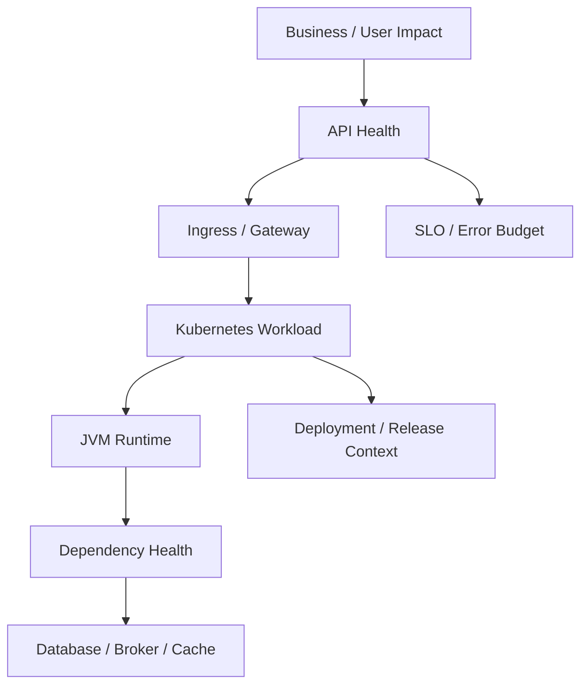
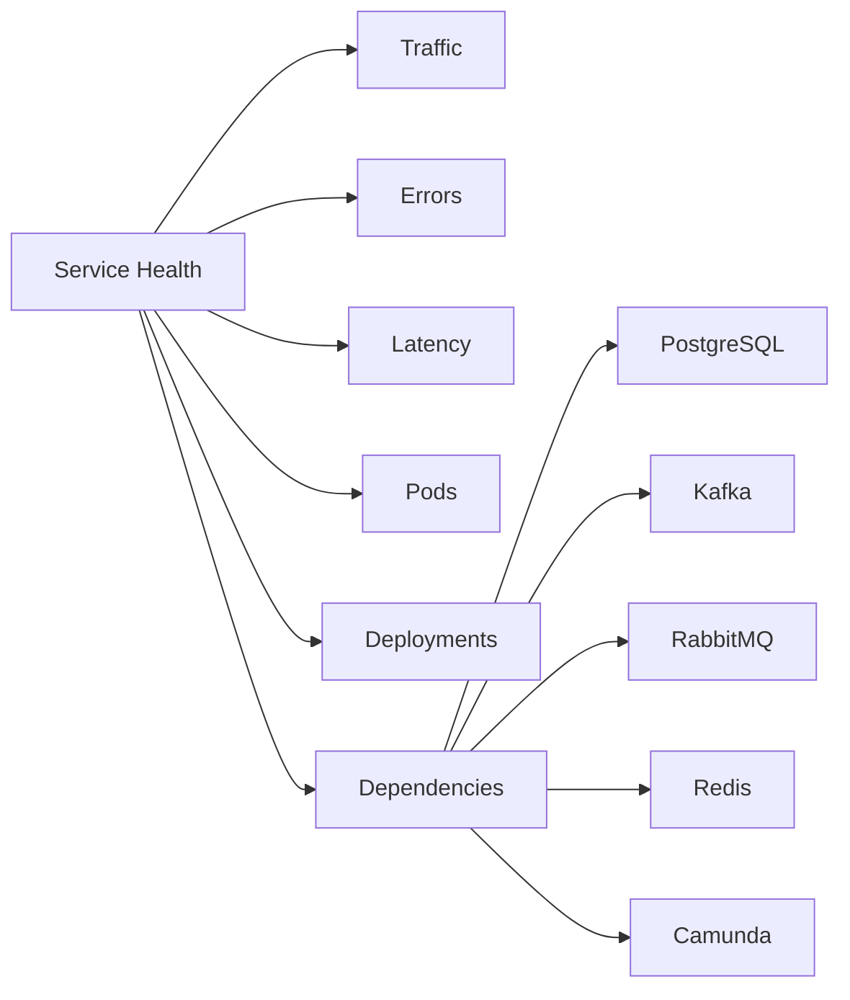
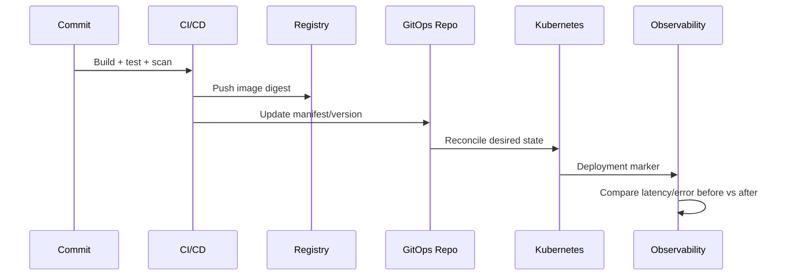
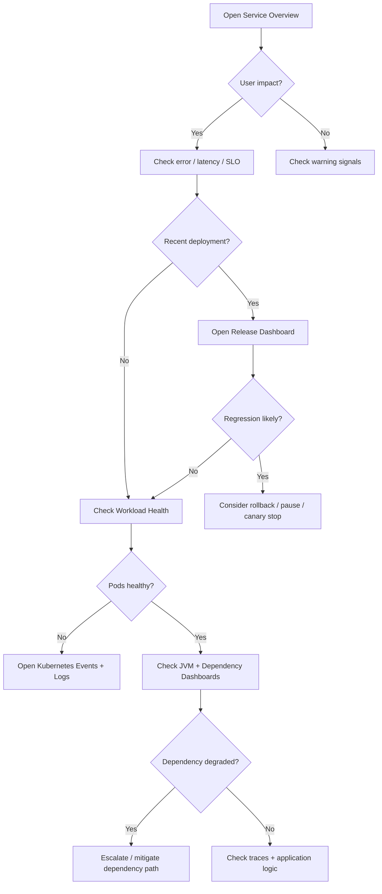

# Part 063 — Dashboard Design for Backend Service Operations

## Tujuan

Dashboard bukan pajangan.

Dalam production Kubernetes, dashboard harus membantu backend engineer menjawab pertanyaan operasional dengan cepat:

- apakah service sedang sehat?
- siapa yang terdampak?
- apakah masalah baru muncul setelah deployment?
- apakah error berasal dari ingress, pod, JVM, dependency, broker, cache, database, atau downstream service?
- apakah perlu rollback, scale out, disable feature, drain traffic, atau eskalasi ke platform/SRE?

Part ini membahas cara mendesain dashboard backend service yang berguna saat incident, PR review, release verification, capacity review, dan operational readiness.

Fokusnya bukan membuat grafik sebanyak mungkin, tetapi membangun dashboard yang punya decision value.

---

## 1. Dashboard Mental Model

Dashboard yang baik menyusun sinyal dari luar ke dalam.



Urutan investigasi yang disarankan:

1. mulai dari impact
2. cek API symptom
3. cek recent deployment
4. cek workload health
5. cek runtime Java/JVM
6. cek dependency
7. cek saturation/capacity
8. cek platform signals
9. pilih mitigation

Dashboard harus mengikuti alur itu.

Jika dashboard memaksa engineer membuka 20 panel tanpa arah, dashboard itu belum incident-ready.

---

## 2. Dashboard Anti-Pattern

Dashboard yang buruk biasanya punya pola berikut.

| Anti-pattern | Masalah | Dampak saat incident |
|---|---|---|
| Too many panels | Semua metric dimasukkan | Engineer bingung memilih sinyal |
| No ownership | Tidak jelas service/team/env | Salah service saat triage |
| No deployment marker | Tidak terlihat kapan release terjadi | Sulit korelasi incident dengan change |
| Only infrastructure metrics | CPU/memory saja | User impact tidak terlihat |
| Only application metrics | Error/latency saja | Runtime failure tidak terlihat |
| No dependency view | DB/broker/cache tidak terlihat | Root cause terlambat ditemukan |
| No SLO view | Tidak tahu severity real | Escalation terlambat atau berlebihan |
| No drill-down link | Tidak terhubung ke logs/traces/runbook | Investigasi lambat |
| No environment filter | prod/staging/dev tercampur | Analisis salah konteks |
| High-cardinality panels | Query mahal/lambat | Dashboard tidak usable saat traffic tinggi |

Operational rule:

> A dashboard must reduce time-to-understand, not increase cognitive load.

---

## 3. Dashboard Layers

Untuk backend service di Kubernetes, minimal ada beberapa layer dashboard.

```text
Service Overview Dashboard
API / Endpoint Dashboard
Dependency Dashboard
JVM Dashboard
Kubernetes Workload Dashboard
Ingress / Gateway Dashboard
Kafka / RabbitMQ Dashboard
Redis Dashboard
Database Dashboard
Release Dashboard
SLO Dashboard
```

Tidak semua harus menjadi dashboard terpisah.

Namun sinyalnya harus tersedia dan mudah ditemukan.

---

## 4. Service Overview Dashboard

Service overview adalah entrypoint saat incident.

Tujuannya menjawab:

> Is this service currently healthy, and what changed?

Panel penting:

| Panel | Tujuan |
|---|---|
| Request rate | Apakah traffic normal, drop, spike, atau shifted |
| Error rate | Apakah 4xx/5xx meningkat |
| Latency p50/p95/p99 | Apakah user experience memburuk |
| Availability / success rate | Apakah SLO terdampak |
| Saturation summary | CPU, memory, thread, pool, queue |
| Pod readiness | Apakah semua replica melayani traffic |
| Restart count | Apakah ada crash loop atau instability |
| Recent deployments | Korelasi change dengan symptom |
| Top failing endpoints | Prioritaskan route yang terdampak |
| Dependency status | Lihat apakah root cause upstream/downstream |

Contoh struktur:



Untuk CPQ/quote/order domain, service overview sebaiknya juga bisa menampilkan business operation signal jika tersedia:

- quote creation failure
- quote validation latency
- order submission error
- pricing dependency latency
- catalog lookup latency
- billing integration failure
- workflow incident count

Jangan menaruh PII, customer name, contract detail, atau payload sensitif di label metric.

---

## 5. API Dashboard

API dashboard fokus pada HTTP/JAX-RS behavior.

Panel penting:

| Panel | Dimensi yang berguna | Catatan |
|---|---|---|
| Request rate by route | route template, method | Hindari raw URL dengan ID |
| Error rate by route | status class, route | Prioritaskan 5xx |
| Latency by route | p50/p95/p99 | Gunakan route template |
| Timeout count | route, dependency | Korelasikan dengan timeout chain |
| Rejection / overload | route, reason | Thread pool penuh, queue penuh |
| Top status codes | status, route | Bedakan 4xx vs 5xx |
| Payload size if safe | route | Berguna untuk upload/buffer issue |
| In-flight requests | instance/pod | Deteksi stuck request |

Route label harus distandardisasi.

Baik:

```text
POST /quotes/{quoteId}/submit
GET /orders/{orderId}
```

Buruk:

```text
POST /quotes/9e1f4a97-...
GET /orders/123456789
```

Raw URL membuat cardinality meledak dan berpotensi membocorkan identifier.

---

## 6. Ingress / Gateway Dashboard

Ingress dashboard membantu membedakan problem edge/gateway dari problem backend pod.

Panel penting:

| Panel | Kenapa penting |
|---|---|
| Ingress request rate | Apakah traffic sampai ke cluster |
| Ingress 4xx/5xx | Apakah error muncul sebelum backend |
| Upstream latency | Latency dari ingress ke service |
| Upstream response status | Backend status dari sudut ingress |
| 502/503/504 rate | Gateway/backend availability signal |
| TLS handshake error | Cert/SNI/client issue |
| Request body size rejection | Upload/body-size issue |
| NGINX reload count | Config churn/instability |
| Active connections | Saturation di ingress |
| Controller pod restart | Ingress controller instability |

Ingress dashboard harus bisa menjawab:

- apakah request masuk ke ingress?
- apakah ingress menemukan backend endpoint?
- apakah backend timeout?
- apakah TLS mismatch?
- apakah body/request ditolak sebelum aplikasi?
- apakah ingress controller baru reload atau restart?

Jika ada API gateway di depan ingress, dashboard harus menunjukkan chain-nya.

```text
Client → API Gateway → Cloud LB → Ingress Controller → Service → Pod
```

---

## 7. Kubernetes Workload Dashboard

Workload dashboard menampilkan health Kubernetes object.

Panel penting:

| Panel | Operational use |
|---|---|
| Desired replicas | Expected capacity |
| Available replicas | Real serving capacity |
| Ready replicas | Endpoint eligibility |
| Updated replicas | Rollout progress |
| Unavailable replicas | Availability risk |
| Pod restart count | Crash/runtime instability |
| Pod phase | Pending/Running/Failed |
| Pod condition | Ready/Scheduled/Initialized |
| OOMKilled count | Memory failure |
| CPU throttling | Latency risk |
| Memory usage vs limit | OOM risk |
| CPU usage vs request | HPA/capacity signal |
| Eviction count | Node/storage pressure |
| HPA replica count | Scaling behavior |
| PDB allowed disruptions | Maintenance safety |

Workload dashboard harus difilter minimal oleh:

- cluster
- namespace
- environment
- service/workload
- version
- team

Contoh decision:

| Symptom | Panel yang dilihat |
|---|---|
| 503 from ingress | Ready replicas, EndpointSlice, pod readiness |
| Latency spike | CPU throttling, JVM GC, dependency latency |
| Traffic drop | ingress request rate, service request rate, pod readiness |
| Rollout stuck | updated replicas, unavailable replicas, deployment condition |
| Pod Pending | pod phase, FailedScheduling events, node capacity |
| Random errors | restart count, OOMKilled, node pressure |

---

## 8. JVM Dashboard

Untuk Java 17+ service, Kubernetes dashboard saja tidak cukup.

JVM dashboard harus menjawab:

> Apakah masalah berasal dari runtime Java di dalam container?

Panel penting:

| Panel | Kenapa penting |
|---|---|
| Heap used / max | Heap pressure |
| Non-heap memory | Metaspace/classloader pressure |
| Direct memory if exposed | Netty/HTTP client/buffer pressure |
| GC pause duration | Latency impact |
| GC frequency | Allocation pressure |
| Thread count | Thread leak / pool pressure |
| Runnable/blocked/waiting threads | Contention clue |
| HTTP server thread pool usage | Request saturation |
| DB pool active/idle/pending | Database bottleneck |
| HTTP client pool active/pending | Downstream bottleneck |
| Class loading | Leak/redeploy issue |
| JVM uptime | Correlate with restarts |

Kubernetes memory usage tidak memberi tahu apakah heap, native memory, direct buffer, atau thread stack yang bermasalah.

Karena itu JVM dashboard harus dipasangkan dengan:

- container memory usage
- memory limit
- OOMKilled events
- GC metrics
- thread pool metrics
- connection pool metrics

---

## 9. Dependency Dashboard

Dependency dashboard menunjukkan apakah service bermasalah karena dependency.

Minimal dependency untuk konteks backend enterprise:

- PostgreSQL
- Kafka
- RabbitMQ
- Redis
- Camunda
- internal HTTP services
- external AWS/Azure services
- billing/catalog/pricing/order downstream systems

Panel dependency umum:

| Panel | Tujuan |
|---|---|
| Dependency call rate | Apakah call volume berubah |
| Dependency error rate | Apakah downstream gagal |
| Dependency latency | Apakah downstream lambat |
| Timeout count | Apakah timeout chain aktif |
| Retry count | Apakah retry storm terjadi |
| Circuit breaker state | Apakah dependency diputus sementara |
| Pool usage | Apakah connection pool penuh |
| Queue/backlog | Untuk async dependency |
| DLQ count | Failure yang sudah diparkir |

Dependency dashboard yang baik membedakan:

- application cannot reach dependency
- dependency reachable but slow
- dependency reachable but returning error
- dependency overloaded by this service
- dependency rejecting authentication/authorization
- dependency error caused by bad request/data

---

## 10. PostgreSQL Dashboard for Service Owners

Backend engineer tidak selalu memiliki database dashboard penuh.

Namun service owner perlu minimal signal berikut:

| Panel | Operational use |
|---|---|
| DB request rate from service | Load from this workload |
| Query latency | Slow dependency |
| Connection pool active | Pool saturation |
| Connection pool pending | Threads waiting for DB connection |
| Connection pool timeout | User-facing failure risk |
| Transaction error | Application/data issue |
| Deadlock count if exposed | Concurrency issue |
| Lock wait if exposed | Blocking transaction |
| DB max connection usage | System-level capacity risk |

Operational warning:

> Replica count × pool size can exceed database capacity.

Dashboard harus menampilkan pool per pod dan total estimated connection pressure jika memungkinkan.

---

## 11. Kafka Dashboard for Service Owners

Kafka dashboard untuk Kubernetes consumer/producer service harus menampilkan:

| Panel | Operational use |
|---|---|
| Consumer lag | Backlog / freshness risk |
| Lag by partition | Skew / stuck partition |
| Consumer group members | Replica membership |
| Rebalance rate | Instability |
| Processing rate | Throughput |
| Error rate | Processing failure |
| Retry rate | Downstream/application issue |
| DLQ publish rate | Failed messages |
| Commit latency/error | Offset safety |
| Producer error | Publish failure |

Untuk Kubernetes, tambahkan korelasi:

- pod restart count
- deployment marker
- replica count
- HPA/KEDA scaling events
- CPU/memory saturation

Consumer lag tidak cukup.

Lag bisa naik karena:

- upstream volume naik
- consumer processing lambat
- dependency lambat
- rebalance berulang
- partition count membatasi parallelism
- pod crash/restart
- bad deployment
- broker issue

Dashboard harus membantu membedakannya.

---

## 12. RabbitMQ Dashboard for Service Owners

RabbitMQ dashboard untuk consumer service harus menampilkan:

| Panel | Operational use |
|---|---|
| Queue depth | Backlog |
| Ready messages | Work not yet delivered |
| Unacked messages | Work delivered but not completed |
| Consumer count | Active capacity |
| Ack rate | Successful processing throughput |
| Nack/reject rate | Failure behavior |
| Redelivery rate | Retry loop risk |
| DLQ depth | Parked failures |
| Connection/channel count | Client lifecycle issue |
| Prefetch impact | Unacked inflation / unfair delivery |

Korelasi Kubernetes:

- replica count
- pod readiness
- pod restart
- deployment marker
- consumer logs
- CPU/memory
- downstream dependency latency

Queue depth naik bukan selalu berarti perlu scale out.

Bisa juga berarti:

- downstream service lambat
- DB pool penuh
- prefetch terlalu besar
- message poison menyebabkan retry loop
- consumer stuck but still connected
- queue routing salah

---

## 13. Redis Dashboard for Service Owners

Redis-backed service perlu dashboard untuk cache, lock, session, token, rate limit, atau ephemeral state.

Panel penting:

| Panel | Operational use |
|---|---|
| Redis command latency | Cache/dependency slowdown |
| Redis error rate | Connection/auth/timeout issue |
| Connection pool usage | Client saturation |
| Timeout count | User latency/failure |
| Hit/miss ratio | Cache effectiveness |
| Key eviction | Memory pressure / bad TTL |
| Memory usage | Redis pressure |
| Reconnect count | Network/Redis instability |
| Lock acquisition failure | Workflow contention |

Untuk backend engineer, Redis dashboard harus menjawab:

- apakah cache miss menyebabkan DB spike?
- apakah Redis timeout menyebabkan API timeout?
- apakah lock stuck menyebabkan workflow stuck?
- apakah eviction mengubah behavior service?
- apakah connection pool habis saat HPA scale out?

---

## 14. Camunda / Workflow Dashboard

Untuk Camunda worker atau workflow-based backend, dashboard harus menampilkan workflow health.

Panel penting:

| Panel | Operational use |
|---|---|
| Activated jobs | Worker demand |
| Completed jobs | Throughput |
| Failed jobs | Worker/application failure |
| Incident count | Workflow interruption |
| Retry count | Recovery behavior |
| Job timeout | Worker too slow / crashed |
| Worker concurrency | Capacity control |
| Process completion latency | Business SLA |
| Stuck process count | Workflow health |
| Correlation failure | Message/event mismatch |

Korelasi Kubernetes:

- worker pod restarts
- worker replica count
- deployment marker
- DB dependency latency
- broker dependency latency
- CPU/memory saturation

Workflow dashboard harus berorientasi pada lifecycle bisnis, bukan hanya worker process.

---

## 15. Release Dashboard

Release dashboard menjawab:

> What changed recently?

Panel penting:

| Panel | Operational use |
|---|---|
| Current version per environment | Detect version mismatch |
| Deployment marker | Correlate symptoms with release |
| Git commit SHA | Trace source change |
| Image digest | Confirm artifact identity |
| Rollout status | Available/updated/unavailable |
| Error/latency before vs after | Release validation |
| Config/secret version | Runtime change correlation |
| Migration status | Schema change risk |
| Canary/blue-green status | Progressive delivery state |

Release dashboard sangat penting karena banyak incident production berasal dari change.



---

## 16. SLO Dashboard

SLO dashboard harus memaksa diskusi reliability berbasis user impact.

Panel penting:

| Panel | Tujuan |
|---|---|
| Availability SLI | Success ratio |
| Latency SLI | p95/p99 against objective |
| Error budget remaining | Release risk |
| Burn rate | Incident urgency |
| Top contributing endpoints | Prioritize fix |
| Dependency contribution | Identify root cause |
| Queue freshness SLI | Async user impact |
| Workflow completion SLI | Business process impact |

SLO dashboard bukan hanya untuk SRE.

Backend service owner perlu memahami apakah service masih boleh menerima risky deployment atau harus fokus reliability.

---

## 17. Dashboard for Different Operational Modes

Dashboard harus mendukung beberapa mode.

| Mode | Dashboard need |
|---|---|
| Incident triage | Fast impact + root cause direction |
| Release verification | Before/after health comparison |
| Capacity review | Usage, saturation, trend, headroom |
| PR review | Expected impact of manifest/config changes |
| Postmortem | Historical evidence and timeline |
| Onboarding | Service map and operational context |

Satu dashboard tidak harus menyelesaikan semua mode, tetapi dashboard set harus punya entrypoint untuk tiap mode.

---

## 18. Dashboard Drill-Down Design

Dashboard panel harus punya jalur drill-down:

```text
Metric spike
→ logs with same service/version/pod
→ traces for failing route
→ deployment marker
→ Kubernetes events
→ dependency dashboard
→ runbook
```

Contoh drill-down links:

- service logs filtered by service/env/version
- traces filtered by route/status/latency
- Kubernetes pod list filtered by namespace/workload
- deployment pipeline run
- Git commit / PR
- runbook
- incident channel
- dependency dashboard

Dashboard tanpa drill-down membuat incident response lambat.

---

## 19. Label and Dimension Hygiene

Dashboard bergantung pada label yang konsisten.

Recommended dimensions:

- service
- namespace
- environment
- cluster
- region
- version
- pod
- route template
- method
- status class
- dependency
- topic/queue if bounded
- team

Avoid high-cardinality dimensions:

- user ID
- account ID
- quote ID
- order ID
- raw URL
- raw exception message
- request body fields
- SQL text with parameters
- arbitrary tenant labels without control

Operational rule:

> Use business identifiers in logs/traces carefully, not as uncontrolled metric labels.

---

## 20. Dashboard Query Safety

Bad queries can become an operational risk.

Checklist:

- query loads quickly during incident
- time range defaults are reasonable
- panels do not scan excessive cardinality
- aggregation is correct
- rate/increase functions are used correctly
- units are clear
- percentile windows are meaningful
- missing data is distinguishable from zero
- filters default to production-safe scope
- dashboard works during partial outage

A dashboard that times out during incident is not production-ready.

---

## 21. Backend Engineer Responsibility

Backend engineer should own or influence:

- service-level dashboard requirements
- application metrics emitted by service
- route/status/error/latency metrics
- JVM metrics exposure
- connection pool metrics exposure
- business operation metrics where safe
- trace/log correlation
- deployment/version labels
- runbook links
- interpretation of service-specific signals

Backend engineer usually does not own:

- observability backend platform
- cluster-level dashboard infra
- Prometheus/Grafana/Datadog/New Relic/Splunk administration
- retention policy
- global metric scraping policy
- ingress controller dashboards if platform-owned

But backend engineer must know what signals are missing and escalate precisely.

---

## 22. Platform/SRE Responsibility

Platform/SRE usually owns:

- cluster-wide metrics pipeline
- log collection pipeline
- trace collection pipeline
- default Kubernetes dashboards
- node dashboards
- ingress controller dashboards
- HPA/cluster autoscaler dashboards
- alert routing integration
- dashboard provisioning standards
- production observability availability
- dashboard access control

Escalation to platform/SRE should include:

- affected service/namespace/cluster
- missing or suspicious metric
- expected signal
- observed gap
- incident impact
- time window
- dashboard/panel link

---

## 23. Dashboard Review Checklist

Use this checklist when reviewing dashboard readiness for one backend service.

### Service health

- [ ] Request rate visible
- [ ] Error rate visible
- [ ] Latency p50/p95/p99 visible
- [ ] Availability/success ratio visible
- [ ] Top failing routes visible
- [ ] SLO status visible if defined

### Kubernetes workload

- [ ] Desired/available/ready replicas visible
- [ ] Restart count visible
- [ ] OOMKilled visible
- [ ] CPU/memory usage visible
- [ ] CPU throttling visible
- [ ] HPA state visible if used
- [ ] Deployment marker visible

### Runtime

- [ ] JVM heap visible
- [ ] GC pause/frequency visible
- [ ] Thread count visible
- [ ] HTTP server pool visible if applicable
- [ ] DB/HTTP/Redis pool visible

### Dependencies

- [ ] PostgreSQL latency/error/pool visible
- [ ] Kafka lag/rebalance/DLQ visible if applicable
- [ ] RabbitMQ queue/unacked/redelivery/DLQ visible if applicable
- [ ] Redis latency/error/pool visible if applicable
- [ ] Camunda incidents/job failures visible if applicable
- [ ] External HTTP dependencies visible

### Incident usability

- [ ] Logs drill-down exists
- [ ] Trace drill-down exists
- [ ] Runbook link exists
- [ ] Dashboard filters are correct
- [ ] Panel units are clear
- [ ] Query performance is acceptable
- [ ] Environment/cluster/namespace is obvious

---

## 24. Internal Verification Checklist

Verify internally before treating dashboard as production-ready:

- which observability stack is officially used
- where canonical service dashboard lives
- whether dashboard is generated from template or manually maintained
- service naming standard
- namespace/environment labels
- deployment marker source
- Git commit/image digest visibility
- route metric standard
- JVM metric exporter/instrumentation
- OpenTelemetry standard if used
- log correlation standard
- trace ID propagation standard
- dashboard ownership
- alert ownership
- SLO ownership
- runbook link convention
- sensitive data rules for metrics/logs/traces
- retention policy
- access control policy
- on-call dashboard entrypoint
- dependency dashboard owner
- platform/SRE escalation path

---

## 25. Practical Dashboard Layout

Recommended layout for a backend service dashboard:

```text
[Header]
Service / env / namespace / cluster / owner / runbook / current version

[Impact]
Request rate | Error rate | Latency | Availability | SLO burn

[Recent Change]
Deployment marker | Current image | Commit SHA | Config version

[Workload]
Replicas | Readiness | Restarts | OOMKilled | CPU | Memory | Throttling

[API]
Top routes by volume | Top routes by error | Top routes by latency

[Runtime]
JVM heap | GC | threads | pools

[Dependencies]
PostgreSQL | Kafka | RabbitMQ | Redis | Camunda | external HTTP

[Drill-down]
Logs | Traces | Events | Deployment | Runbook
```

This ordering supports incident triage.

---

## 26. Failure-Oriented Dashboard Questions

A good dashboard lets you answer these quickly.

### Availability

- Are pods ready?
- Does Service have endpoints?
- Is ingress returning 503?
- Did deployment reduce available replicas?

### Latency

- Is latency at ingress or app?
- Is JVM GC high?
- Is CPU throttling present?
- Is DB/broker/cache latency high?
- Are retries increasing?

### Errors

- Are 5xx concentrated on one route?
- Did errors start after deployment?
- Are dependency errors correlated?
- Is there a config/secret change?

### Capacity

- Are requests above normal?
- Is HPA scaling?
- Are pods pending?
- Is node capacity constrained?
- Is dependency pool saturated?

### Release

- What version is running?
- Is rollout complete?
- Is canary healthy?
- Is rollback possible?
- Did migration run?

---

## 27. Mermaid: Incident Dashboard Flow



---

## 28. Dashboard Quality Bar

A dashboard is ready when:

- a new on-call engineer can understand service health in under a few minutes
- recent deployment correlation is obvious
- user impact is visible before infrastructure detail
- dependency health is visible
- Kubernetes workload state is visible
- JVM/runtime saturation is visible
- logs/traces/runbook are one click away
- dashboard avoids sensitive data
- panel queries are stable under production load
- dashboard has an owner

If any of these are missing, the dashboard is incomplete.

---

## 29. Key Takeaways

- Dashboard is an incident decision tool, not a metric museum.
- Start from user/business impact, then drill into workload/runtime/dependency.
- Kubernetes health and Java runtime health must be shown together.
- Deployment markers are mandatory for production debugging.
- Dependency dashboards are essential in CPQ/order/billing systems.
- Good dashboard design reduces MTTR and prevents random debugging.
- Backend engineer owns service signal quality even when platform owns observability infrastructure.
