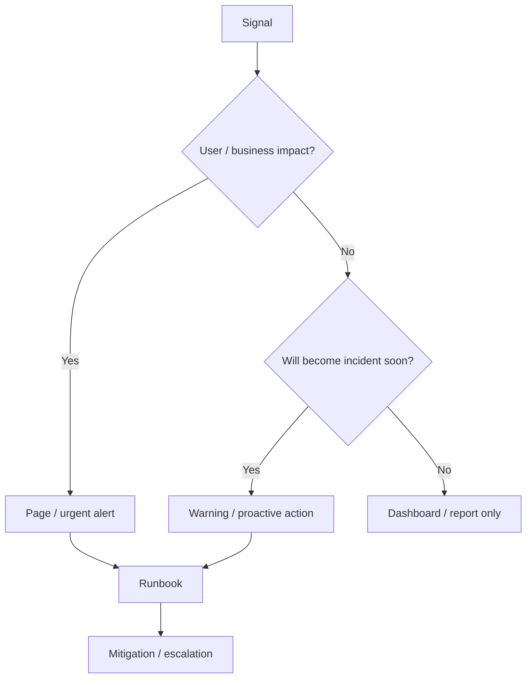
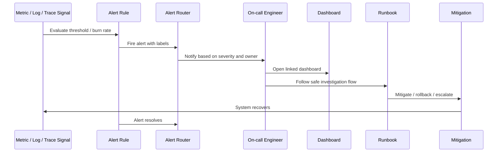

# Part 064 — Alert Design for Kubernetes Workloads

## Tujuan

Alert bukan sekadar notifikasi bahwa metric melewati threshold.

Alert adalah mekanisme untuk memanggil manusia ketika sistem membutuhkan keputusan operasional.

Alert yang baik harus menjawab:

- apa yang rusak?
- siapa yang terdampak?
- seberapa parah?
- siapa owner-nya?
- apa tindakan pertama yang aman?
- dashboard mana yang harus dibuka?
- runbook mana yang harus diikuti?
- apakah ini perlu page sekarang atau cukup ticket?

Part ini membahas desain alert untuk Kubernetes backend workloads: Java/JAX-RS API service, Kafka/RabbitMQ consumer, Redis-backed service, Camunda worker, batch job, scheduler, dan dependency-heavy enterprise services.

---

## 1. Alert Mental Model

Alert harus berorientasi pada symptom dan action.



Operational rule:

> Alert only when a human needs to act.

Metric anomaly without required action should usually be dashboarded, not paged.

---

## 2. Alert Anti-Pattern

| Anti-pattern | Why it is bad | Better design |
|---|---|---|
| CPU high page | May not affect users | Page on latency/error/SLO burn; warn on sustained saturation |
| Every pod restart pages | Many restarts self-heal | Page on crash loop or availability impact |
| Alert with no owner | No one acts | Attach service/team/on-call owner |
| Alert with no runbook | Slow response | Link runbook and dashboard |
| Alert on raw error count | Traffic-dependent noise | Use error ratio and burn rate |
| Alert on single data point | Flapping | Use duration/window |
| Alert on dependency internals owned elsewhere | Wrong responder | Alert service symptom; route dependency alert to owner |
| Alert without environment label | Dev/staging noise | Filter production or set severity lower |
| Alert without recent change context | Slower diagnosis | Include deployment marker/version |
| Alert for known non-actionable issue | Alert fatigue | Suppress, ticket, or fix instrumentation |

Alert fatigue is not a people problem only. It is an engineering design failure.

---

## 3. Symptom-Based vs Cause-Based Alerting

### Symptom-based alert

A symptom alert indicates user-visible or business-visible failure.

Examples:

- API availability below SLO
- p95 latency above objective
- 5xx ratio above threshold
- quote submission failure rate high
- order workflow completion delayed
- Kafka consumer freshness SLO violated
- RabbitMQ queue age exceeds objective

### Cause-based alert

A cause alert indicates a likely root cause or risk.

Examples:

- pod CrashLoopBackOff
- CPU throttling high
- DB pool exhausted
- HPA unable to fetch metrics
- no ready replicas
- certificate expiring soon
- secret sync failing

Both are useful, but paging should prioritize symptoms.

Cause-based alerts are good when:

- the failure is known to lead to outage quickly
- the remediation is clear
- the alert has low false-positive rate
- the owner is clear

---

## 4. Alert Severity Model

Severity should reflect impact and urgency, not technical drama.

| Severity | Meaning | Example |
|---|---|---|
| SEV1 / Critical | Major production impact, immediate action | Public API down, quote/order submission failing broadly |
| SEV2 / High | Significant degraded production behavior | High 5xx for critical route, consumer backlog breaching freshness |
| SEV3 / Medium | Risk or partial impact requiring timely action | One replica crash-looping but service still available |
| SEV4 / Low | Non-urgent issue or hygiene | Cert expires in 21 days, dashboard gap, low disk trend |

Do not map severity purely from metric value.

A 95% CPU alert may be SEV4 if no user impact.
A 5% error rate may be SEV1 if it blocks order submission.

---

## 5. Page vs Ticket vs Dashboard

| Destination | Use when | Example |
|---|---|---|
| Page | Immediate human action needed | SLO burn high, no ready replicas, critical API failing |
| Ticket | Needs action but not immediate | cert expiring in 14 days, resource request inefficient |
| Dashboard only | Informational / context | normal HPA scale event, deploy marker |
| Slack/Teams notification | Awareness or coordinated release | deployment started/completed, canary paused |

A good alert strategy intentionally decides where each signal goes.

---

## 6. Core Alert Fields

Every production alert should include:

- alert name
- service/workload
- namespace
- cluster
- environment
- severity
- owner/team
- current value
- threshold/objective
- duration/window
- affected route/topic/queue if applicable
- current version/image/commit if available
- dashboard link
- runbook link
- escalation instruction
- safe first action

Bad alert:

```text
HighErrorRate firing
```

Better alert:

```text
quote-api prod 5xx ratio 8.2% for POST /quotes/{id}/submit over 10m.
SLO burn rate high. Current version 2026.07.12-abc123.
Open dashboard: ...
Runbook: ...
First action: check recent deployment and dependency latency; consider rollback if regression confirmed.
```

---

## 7. Alert Windows and Duration

Single-point alerts create noise.

Use windows.

| Alert type | Suggested window idea |
|---|---|
| Critical availability | short window plus SLO burn |
| Latency degradation | sustained p95/p99 over several minutes |
| Queue backlog | age/freshness over objective window |
| Pod crash loop | repeated restarts over window |
| CPU throttling | sustained throttling plus latency correlation |
| Memory pressure | high usage plus growth trend / OOM risk |
| Cert expiry | days/weeks before expiry |
| Secret sync failure | sustained sync error, not one transient failure |

Thresholds must account for traffic volume.

Low traffic services can produce misleading ratios.

---

## 8. SLO Burn-Rate Alerts

SLO burn-rate alerting is usually better than raw error threshold for critical services.

Conceptually:

```text
Burn rate = how fast the service is consuming error budget
```

Useful alert types:

- fast burn: severe issue now
- slow burn: sustained degradation
- ticket-level budget consumption: reliability trend

For backend services, SLO alerts can cover:

- HTTP availability
- HTTP latency
- queue freshness
- workflow completion
- successful order submission
- successful quote calculation
- dependency success ratio

SLO alerts should be tied to runbooks and release policy.

If error budget is nearly exhausted, risky deployment should be questioned.

---

## 9. Kubernetes Workload Alerts

Useful Kubernetes workload alerts:

| Alert | Page? | Notes |
|---|---|---|
| Deployment has zero ready replicas | Yes | Direct availability risk |
| Available replicas below safe threshold | Usually | Depends on criticality |
| Rollout stuck / ProgressDeadlineExceeded | Usually | Especially during production release |
| Pod CrashLoopBackOff repeated | Usually | Page if capacity/user impact |
| OOMKilled repeated | Usually | Page if recurring or affecting availability |
| Pod Pending sustained | Sometimes | Page if rollout/capacity affected |
| HPA at max replicas and saturation remains | Usually | Capacity risk |
| PDB blocking maintenance | Ticket | Unless upgrade blocked during incident |
| Node pressure affecting pods | Platform/SRE route | Service owner may need context |

Avoid paging on every restart.

A pod restart is a signal. Repeated restarts plus impact is an alert.

---

## 10. API Service Alerts

For Java/JAX-RS API services, alert on user-facing symptoms.

| Alert | Why it matters |
|---|---|
| 5xx ratio above threshold | Server-side failure |
| Critical route error rate | Business operation failure |
| Latency SLO burn | User experience degradation |
| Timeout rate high | Dependency/runtime bottleneck |
| No traffic when traffic expected | Routing/DNS/ingress issue |
| Request rejection high | Thread/queue/pool saturation |
| Dependency error contribution high | Downstream root cause |

Route-level alerts should use route templates, not raw paths.

Critical CPQ/order flows may deserve route-specific alerting:

- quote create
- quote validate
- quote submit
- order submit
- order status transition
- pricing calculation
- catalog lookup
- billing integration callback

Use internal validation before defining business-critical route list.

---

## 11. JVM Runtime Alerts

JVM alerts should not page blindly unless tied to risk/impact.

Useful JVM alerts:

| Alert | Page? | Notes |
|---|---|---|
| JVM heap near limit sustained | Warning / page if impact | Memory leak risk |
| GC pause high and latency high | Page if user impact | Correlated symptom |
| Thread pool exhausted | Usually page | Direct request failure risk |
| DB pool pending high | Usually page | Dependency capacity bottleneck |
| HTTP client pool exhausted | Usually page | Downstream bottleneck |
| Native memory pressure | Warning/page | Harder to detect; needs runbook |

Avoid:

- paging only because heap usage is high after GC-unaware measurement
- paging on GC count without latency impact
- paging on thread count without baseline/context

---

## 12. PostgreSQL-Related Alerts for Service Owners

Backend service owner should receive alerts when service behavior toward PostgreSQL is failing.

| Alert | Meaning |
|---|---|
| DB pool timeout | Requests cannot obtain connection |
| DB latency high | User latency likely affected |
| DB error rate high | Query/availability/auth issue |
| Connection pool active near max | Saturation risk |
| Pending connection requests | Thread waiting for DB |
| Transaction rollback spike | Application/data issue |

Database platform alerts like disk, replication, backup failure may go to DB/SRE team, but service owner needs dependency symptom visibility.

---

## 13. Kafka Alerts

Kafka workload alerting should be freshness-oriented, not only lag-number-oriented.

| Alert | Meaning |
|---|---|
| Consumer lag age/freshness breached | User/business delay |
| Lag increasing while replicas at max | Capacity/dependency limit |
| Consumer group has no active member | Processing stopped |
| Rebalance rate high | Instability / restart / scaling issue |
| DLQ rate high | Processing failure |
| Commit failures | Offset safety issue |
| Producer error rate high | Event publication failure |

Lag count alone is insufficient.

A lag of 10,000 may be fine for high-throughput topic if processing catches up quickly.
A lag of 50 may be severe if messages are old and block order progression.

---

## 14. RabbitMQ Alerts

RabbitMQ consumer alerts should distinguish backlog, stuck consumption, and poison message loop.

| Alert | Meaning |
|---|---|
| Queue age above objective | Freshness breach |
| Queue depth increasing sustained | Backlog growth |
| Consumer count zero | Processing stopped |
| Unacked messages high | Consumers stuck/slow or prefetch too high |
| Redelivery rate high | Retry loop / poison message |
| DLQ depth increasing | Failed processing |
| Ack rate drops to zero | Consumer not completing work |

Do not page every queue depth spike.

Page when backlog threatens business freshness or no consumer is making progress.

---

## 15. Redis Alerts

Redis-related service alerts:

| Alert | Meaning |
|---|---|
| Redis timeout rate high | Cache/dependency unavailable or slow |
| Redis command latency high | User latency risk |
| Redis connection pool exhausted | Client-side saturation |
| Cache hit ratio drops sharply | DB load risk |
| Lock acquisition failures high | Workflow contention |
| Redis errors high | Auth/network/server issue |

If Redis is used for locks or workflow state, alert severity may be higher than if Redis is only best-effort cache.

---

## 16. Camunda / Workflow Alerts

For workflow workers, alert on process health, not only pod health.

| Alert | Meaning |
|---|---|
| Incident count spike | Workflow execution broken |
| Job timeout high | Worker not completing jobs |
| Failed job rate high | Application/dependency failure |
| Worker unavailable | Processing stopped |
| Process completion latency breached | Business SLA risk |
| Correlation failure spike | Message/event mismatch |
| Retry exhaustion | Manual intervention likely |

A worker pod can be ready while workflow processing is broken.

Therefore pod readiness alert is not enough.

---

## 17. Batch and CronJob Alerts

Batch alerting must focus on completion and timeliness.

| Alert | Meaning |
|---|---|
| CronJob missed schedule | Expected job did not start |
| Job failed | Batch result unavailable |
| Job running too long | Stuck / dependency slow |
| Job overlap detected | Concurrency/idempotency risk |
| Job completed with partial failures | Data correctness risk |
| Reconciliation backlog growing | System not converging |

Do not rely only on pod status.

A job can complete successfully from Kubernetes perspective while business processing partially failed.

---

## 18. Ingress and Traffic Alerts

Ingress alerts help detect routing and gateway-level impact.

| Alert | Meaning |
|---|---|
| Ingress 5xx spike | Gateway/backend failure |
| 502 spike | Bad gateway/protocol/backend issue |
| 503 spike | No endpoint/unavailable backend |
| 504 spike | Upstream timeout |
| TLS error spike | Certificate/SNI/client trust issue |
| Request body rejection spike | Body size/config issue |
| No backend endpoint | Routing to empty service |

Ingress alerts should route to service owner or platform depending on source:

- service-specific backend 5xx → service owner
- ingress controller global failure → platform/SRE
- cert/global gateway failure → platform/security/SRE

---

## 19. Secret and Config Alerts

Useful alerts:

| Alert | Meaning |
|---|---|
| ExternalSecret sync failed | Secret may become stale/missing |
| Secret expiry approaching | Credential/cert rotation needed |
| Config drift detected | Runtime differs from Git source |
| Secret mount failure | Pod startup failure |
| ConfigMap missing | Pod startup/runtime failure |
| Pods not restarted after critical config change | Stale runtime config |

Secret alerts require careful content hygiene.

Never include secret values in alert payload.

---

## 20. Certificate Alerts

Certificate alerts should fire early enough for normal change process.

Suggested categories:

- certificate expires in 30 days → ticket/warning
- certificate expires in 14 days → higher urgency
- certificate expires in 7 days → page or urgent workflow depending on criticality
- certificate already expired → page if production path affected
- TLS handshake error spike → symptom alert

Include:

- certificate common name / SAN if safe
- namespace/secret reference
- ingress/service affected
- expiry timestamp
- owner
- rotation runbook

Do not include private key material.

---

## 21. Autoscaling Alerts

Autoscaling alerts should detect scaling failure and scaling insufficiency.

| Alert | Meaning |
|---|---|
| HPA unable to get metrics | Scaling blind |
| HPA at max replicas with high saturation | Capacity limit reached |
| Desired replicas high but pods Pending | Node capacity/scheduling issue |
| Scaling thrash | Instability/noisy load metric |
| KEDA scaler error | Event-based scaling broken |
| Queue backlog grows despite scale-out | Downstream/partition/dependency bottleneck |

Do not page just because HPA scaled.

Scaling is normal behavior.

Alert when scaling cannot protect reliability.

---

## 22. Cost-Aware Alerts

Cost alerts are usually ticket-level, not paging.

Useful cost signals:

- sustained low CPU/memory utilization vs request
- idle replicas for non-critical service
- log volume spike
- metric cardinality spike
- NAT egress spike
- load balancer count unexpected
- HPA max replicas sustained without traffic justification

Cost alerts should avoid causing unsafe underprovisioning.

Reliability comes first.

---

## 23. Alert Routing and Ownership

Every alert must have an owner.

Routing dimensions:

- service
- team
- namespace
- environment
- severity
- dependency owner
- platform vs application boundary
- security-sensitive category

Examples:

| Alert | Primary owner | Secondary owner |
|---|---|---|
| quote-api 5xx SLO burn | Backend service owner | SRE |
| ingress controller down | Platform/SRE | Service owners if impacted |
| external secret sync denied | Platform/security or service owner depending permission model | Backend owner |
| DB pool exhausted | Backend owner | DBA/platform |
| cluster autoscaler failing | Platform/SRE | Backend owner if workload impacted |
| image vulnerability critical | Security/platform | Backend owner |

Wrong routing is a common cause of slow incidents.

---

## 24. Alert Runbook Requirements

Every actionable alert needs a runbook.

Runbook should contain:

- meaning of alert
- expected impact
- first safe checks
- dashboard links
- log query links
- trace query links
- Kubernetes commands that are read-only/safe
- likely causes
- mitigation options
- rollback criteria
- escalation criteria
- evidence to capture
- known false positives

Runbook should explicitly mark dangerous actions.

Example:

```text
Safe:
- kubectl get
- kubectl describe
- kubectl logs
- check dashboard
- check traces

Requires approval / role:
- rollout restart
- scale deployment
- rollback production
- modify NetworkPolicy
- rotate secret
```

---

## 25. Alert Message Design

Alert message should be concise but complete.

Recommended shape:

```text
[SEV2] quote-api prod high 5xx ratio

Impact:
POST /quotes/{id}/submit 5xx ratio is 8.2% for 10m.

Context:
cluster=prod-eks-a namespace=quote-order service=quote-api version=abc123
last deployment=12m ago

Start here:
Dashboard: <link>
Logs: <link>
Traces: <link>
Runbook: <link>

First safe checks:
1. Check deployment marker and rollout status.
2. Check route traces and dependency latency.
3. If regression confirmed, follow rollback section in runbook.
```

Avoid alert messages that require tribal knowledge.

---

## 26. Alert Noise Reduction

Noise reduction techniques:

- use symptom-based paging
- add `for` duration/window
- suppress known maintenance windows
- deduplicate alerts by service/route/severity
- group related alerts under one incident
- avoid paging lower environments
- use ticket for slow-burn non-urgent issues
- tune thresholds based on baseline
- remove alerts with no action
- review noisy alerts after incidents

If an alert fires often and no one acts, either the alert is wrong or the team is ignoring real risk.

Both need correction.

---

## 27. Alert Testing

Alert rules should be tested.

Testing questions:

- does the query return expected result?
- does alert fire for historical incidents?
- does alert avoid known false positives?
- does alert include labels needed for routing?
- does alert include dashboard/runbook links?
- is threshold aligned with SLO or operational objective?
- does alert resolve automatically after recovery?
- is notification routed correctly?
- does on-call know what to do?

Alert rules are production code.

Review them like production code.

---

## 28. PR Review Checklist for Alert Changes

When reviewing alert PR:

- [ ] What user/business impact does this alert represent?
- [ ] Is it symptom-based, cause-based, or hygiene?
- [ ] Should it page, ticket, or only notify?
- [ ] Is owner/routing clear?
- [ ] Is severity justified?
- [ ] Is threshold/window justified?
- [ ] Does it avoid high-cardinality labels?
- [ ] Does it include dashboard link?
- [ ] Does it include runbook link?
- [ ] Does it avoid sensitive data?
- [ ] Does it handle low traffic correctly?
- [ ] Does it duplicate another alert?
- [ ] Was it tested against historical data?
- [ ] Is there an action the receiver can take?

---

## 29. Internal Verification Checklist

Verify internally before relying on alerting:

- official alerting platform
- paging tool and routing model
- severity definitions
- on-call ownership
- escalation policy
- service/team label standards
- production vs non-production routing
- SLO definitions
- alert rule repository
- alert review process
- runbook location
- dashboard link convention
- deployment marker integration
- maintenance window/silence process
- alert suppression rules
- incident channel creation process
- security/privacy rules for alert payloads
- dependency alert ownership
- platform/SRE boundary
- security team boundary
- audit/compliance evidence requirements

---

## 30. Mermaid: Alert Lifecycle



---

## 31. Failure-Oriented Alert Questions

For every alert, ask:

- what failure mode does this represent?
- how does it affect Java/JAX-RS service behavior?
- does it affect PostgreSQL/Kafka/RabbitMQ/Redis/Camunda interaction?
- does Kubernetes know about it, or only application telemetry?
- is it EKS/AKS/on-prem specific?
- is the first action safe for backend engineer?
- when should platform/SRE be involved?
- when should security be involved?
- when is rollback appropriate?
- when is scale-out appropriate?
- when is dependency escalation appropriate?
- what evidence must be captured?

If these cannot be answered, alert design is incomplete.

---

## 32. Key Takeaways

- Alert when human action is required.
- Page on user/business impact first, not raw infrastructure noise.
- Cause-based alerts are useful only when action is clear.
- Every production alert needs owner, severity, dashboard, and runbook.
- SLO burn-rate alerts are stronger than naive error thresholds for critical services.
- Queue/workflow alerts should focus on freshness and completion, not just raw backlog.
- Kubernetes alerts must be correlated with Java runtime and dependency health.
- Alert rules are production code and deserve review, testing, and ownership.
