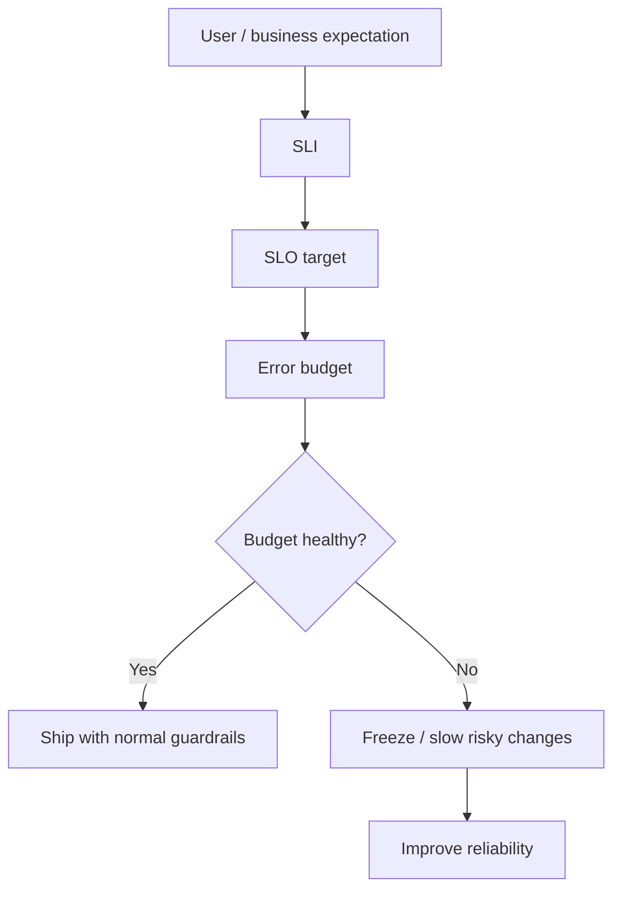
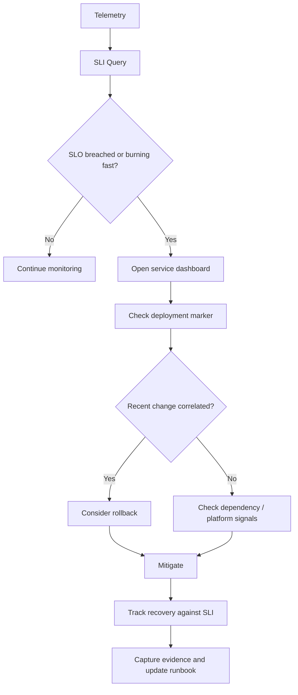

# Part 065 — SLO for Kubernetes Backend Services

## Tujuan

SLO adalah kontrak operasional antara ekspektasi bisnis, perilaku aplikasi, dan kemampuan runtime production.

Untuk backend engineer, SLO bukan hanya urusan SRE. SLO menentukan:

- kapan incident benar-benar terjadi
- kapan alert harus page
- kapan rollout harus dihentikan
- kapan rollback lebih aman daripada hotfix
- kapan latency masih acceptable
- kapan consumer lag sudah berdampak ke freshness bisnis
- kapan workflow delay sudah melanggar ekspektasi user
- kapan dependency degradation perlu dieskalasi
- kapan error budget sudah terlalu banyak terbakar

Part ini membahas cara mendefinisikan dan mengoperasikan SLO untuk Kubernetes backend services: Java/JAX-RS API service, Kafka/RabbitMQ consumer, Redis-backed service, Camunda worker, batch job, scheduler, dan enterprise quote/order workflow.

---

## 1. SLO Mental Model

SLI mengukur realitas.

SLO mendefinisikan target realitas yang bisa diterima.

Error budget adalah ruang gagal yang masih dapat ditoleransi sebelum reliability menjadi prioritas utama.



Operational rule:

> SLO should describe what users and business workflows experience, not merely what Kubernetes objects report.

A pod can be Running while the quote submission path is broken.
A Deployment can be Available while Kafka consumer freshness is violating business expectations.

---

## 2. Why SLO Matters in Kubernetes Operations

Kubernetes gives many signals:

- pod ready
- pod restart count
- deployment available
- service endpoint exists
- ingress returning 5xx
- HPA scaling
- node pressure
- container CPU/memory usage

But these are not automatically reliability targets.

SLO translates technical runtime signals into reliability decisions.

Without SLO:

- teams argue whether an alert is serious
- rollback decisions become subjective
- latency spikes are dismissed until users complain
- queue lag grows silently
- workflow completion delay is ignored
- release velocity competes blindly with stability
- incident severity is inconsistent

With SLO:

- incident trigger is clearer
- alert severity is grounded
- deployment guardrail is measurable
- capacity planning has objective target
- backend and platform discussions become less emotional

---

## 3. SLI vs SLO vs SLA

| Term | Meaning | Example |
|---|---|---|
| SLI | Indicator, what is measured | `POST /quotes/{id}/submit` success ratio |
| SLO | Objective, target for SLI | 99.9% successful quote submissions over 30 days |
| SLA | External/legal/business commitment | Contractual uptime commitment to customer |

Backend engineers usually participate most directly in SLI and SLO design.
SLA is often owned by product, business, legal, customer success, or service management.

Do not start with Kubernetes metrics.
Start with what matters to the workflow.

---

## 4. Good SLO Properties

A production-grade SLO should be:

- user or business meaningful
- measurable from reliable telemetry
- owned by a team
- scoped to a service or workflow
- time-windowed
- connected to alerting
- connected to runbook action
- reviewed after incidents
- usable for release decisions
- not overly broad
- not overly fragile

Bad SLO:

```text
Pods should be healthy.
```

Better SLO:

```text
99.9% of quote submission requests should complete successfully within 2 seconds over 30 days.
```

Even better for operations:

```text
For production quote-api, POST /quotes/{id}/submit should maintain:
- availability >= 99.9% over 30 days
- p95 latency <= 2s over 30 days
- p99 latency <= 5s over 30 days
- high burn-rate alert for 5xx ratio over 5m/1h windows
```

---

## 5. Backend Engineer Responsibility

Backend service owner should own:

- application-level SLI definition
- endpoint criticality classification
- success/failure semantics
- latency expectation per route
- dependency timeout behavior
- retry behavior
- idempotency behavior
- queue lag interpretation
- workflow completion interpretation
- dashboard usefulness
- runbook first actions
- release decision based on service-level health

Backend engineer should not blindly delegate SLO to platform/SRE.

Platform/SRE may provide tooling and reliability practice, but application team must explain what success means.

---

## 6. Platform/SRE Responsibility

Platform/SRE commonly owns or supports:

- metrics platform
- log platform
- tracing platform
- alert routing
- SLO tooling
- burn-rate alert templates
- cluster-level availability metrics
- node/platform reliability SLOs
- ingress controller metrics
- managed Kubernetes control plane awareness
- common dashboards
- incident process

Platform/SRE should not be expected to infer domain semantics such as:

- whether a quote status transition is successful
- whether a Camunda workflow is stuck
- whether Kafka lag is business-critical
- whether order submission failure should page
- whether a batch reconciliation delay is acceptable

Those require backend/domain input.

---

## 7. Availability SLI

Availability measures whether valid requests or operations succeed.

For HTTP service:

```text
availability = successful requests / valid requests
```

Typical success:

- 2xx
- sometimes selected 3xx
- sometimes selected 4xx if client error is expected and not service failure

Typical failure:

- 5xx
- gateway timeout
- upstream timeout
- application exception
- dependency unavailable leading to failed business operation

Do not blindly treat all non-2xx as service failure.

For example:

| Status | Usually counts as | Reason |
|---|---|---|
| 200/201/204 | Success | Request completed |
| 400 | Excluded or success-like | Invalid client input, not service reliability failure |
| 401/403 | Usually excluded | Auth/authorization semantics may be expected |
| 404 | Context-specific | Could be valid not found or routing bug |
| 409 | Context-specific | Could be domain conflict |
| 429 | Failure or overload signal | Depends on ownership of rate limit |
| 500/502/503/504 | Failure | Service/runtime/dependency failure |

Define this explicitly.

---

## 8. Latency SLI

Latency SLO should focus on user-visible and workflow-critical routes.

Common indicators:

- p50 latency
- p90 latency
- p95 latency
- p99 latency
- max latency, rarely as SLO

For operations, p95 and p99 are usually more useful than average.

Average latency hides tail behavior.

Example:

```text
p95 latency of POST /quotes/{id}/submit <= 2 seconds over 30 days
p99 latency of POST /quotes/{id}/submit <= 5 seconds over 30 days
```

Latency must be scoped.

Do not mix all endpoints into one global p95 if endpoints have different behavior.

| Endpoint type | Likely latency expectation |
|---|---|
| Health check | very low |
| Read API | low |
| Quote calculation | medium/high |
| Order submission | medium/high but business critical |
| Report export | high, maybe async preferred |
| Batch trigger | not comparable to normal API |

---

## 9. Error Rate SLI

Error rate is often used for alerting.

```text
error_rate = failed_requests / total_valid_requests
```

Operational interpretation depends on route criticality.

A 1% error rate on a low-traffic admin endpoint may be low severity.
A 1% error rate on order submission during peak traffic may be serious.

Error rate should be:

- route-aware
- method-aware
- environment-aware
- version-aware
- dependency-aware if possible
- grouped by service owner

Avoid high-cardinality labels like raw user ID, quote ID, order ID, or customer ID in metric labels.

---

## 10. Freshness SLI

Freshness measures how recently data or processing state was updated.

Useful for:

- Kafka consumers
- RabbitMQ consumers
- Redis stream consumers
- reconciliation jobs
- materialized views
- cache refresh
- quote/order status propagation
- billing integration handoff

Examples:

```text
99% of quote status events are processed within 60 seconds.
```

```text
Order synchronization lag must remain below 5 minutes for 99.5% of intervals.
```

Freshness is often more meaningful than raw queue depth.

Queue depth alone does not tell whether customers are impacted.

---

## 11. Queue Lag SLI

For Kafka:

- consumer lag by partition
- total group lag
- max partition lag
- lag age / time lag if available
- processing rate vs produce rate

For RabbitMQ:

- ready messages
- unacked messages
- queue age
- consumer utilization
- redelivery rate
- DLQ growth

For Redis streams:

- pending entries
- oldest pending age
- consumer idle time
- retry count

Better SLO:

```text
99% of pricing update events should be consumed within 2 minutes.
```

Weaker SLO:

```text
Kafka lag should be below 10,000.
```

A lag of 10,000 can be fine for high-throughput low-criticality stream, or catastrophic for low-throughput critical workflow.

---

## 12. Workflow Completion SLI

For CPQ, quote-to-order, billing integration, and workflow-driven systems, request success is not enough.

A synchronous API may return success while downstream workflow later fails.

Useful workflow SLIs:

- quote creation completion rate
- quote approval completion rate
- order submission completion rate
- order activation handoff success rate
- billing handoff success rate
- Camunda process completion time
- workflow incident rate
- stuck process count
- retry exhaustion count

Example:

```text
99.5% of order submission workflows should reach accepted-for-fulfillment state within 10 minutes.
```

This is much closer to business reliability than pod availability.

---

## 13. Dependency SLI

Backend service reliability depends on dependencies:

- PostgreSQL
- Kafka
- RabbitMQ
- Redis
- Camunda
- external HTTP services
- AWS/Azure services
- identity provider
- internal API dependencies

Useful dependency indicators:

- dependency request success ratio
- dependency latency
- timeout rate
- connection pool saturation
- circuit breaker open ratio
- retry rate
- DLQ growth
- database error class
- broker publish/consume failure

Dependency SLI should not hide ownership.

If PostgreSQL is down, backend service may be impacted, but DB platform owner may own mitigation.

The backend service still needs symptom SLO to know customer impact.

---

## 14. Kubernetes-Level SLI

Kubernetes-level SLIs are useful, but usually supporting indicators.

Examples:

- deployment available replicas ratio
- ready pods ratio
- restart rate
- CrashLoopBackOff count
- HPA scaling health
- pod scheduling success
- ingress 5xx ratio
- endpoint availability
- node pressure

These help explain symptoms.

They should not replace user/business SLO.

Example supporting SLI:

```text
quote-api should maintain at least 2 ready replicas during normal operations.
```

This is useful, but it does not prove quote submission works.

---

## 15. Error Budget

Error budget is the allowed unreliability.

If SLO is 99.9% availability over 30 days, error budget is 0.1% of valid requests or time window depending on measurement model.

Operationally, error budget answers:

- can we keep shipping normally?
- should we slow down risky releases?
- should reliability work be prioritized?
- should noisy dependency be addressed?
- should rollback threshold be stricter?

Error budget is not permission to ignore failure.
It is a decision tool.

---

## 16. Burn Rate

Burn rate measures how fast error budget is being consumed.

High burn rate means the service is failing too fast.

Example:

```text
If a 30-day SLO budget is being consumed at 14x normal rate, page immediately.
```

Burn-rate alerting is better than static threshold because it accounts for reliability target and time window.

Common pattern:

| Window | Purpose |
|---|---|
| 5m + 1h | Fast burn, urgent incident |
| 30m + 6h | Medium burn, sustained issue |
| 2h + 24h | Slow burn, ticket or proactive work |

Use platform/SRE standard if available.

---

## 17. SLO for Java/JAX-RS API Service

For a Java/JAX-RS API service, define SLO around critical routes.

Example categories:

| Route category | Suggested SLI |
|---|---|
| Read quote | availability, p95 latency |
| Create quote | availability, p95/p99 latency, dependency error |
| Submit quote/order | availability, latency, workflow handoff success |
| Pricing calculation | latency, timeout rate, dependency latency |
| Admin/internal route | lower severity, separate SLO |
| Health endpoint | supporting signal, not user SLO |

Java-specific supporting signals:

- thread pool saturation
- DB pool saturation
- GC pause time
- heap usage
- CPU throttling
- HTTP client timeout rate
- connection reset rate

SLO should not be based only on `/health`.

---

## 18. SLO for Kafka Consumer Service

Kafka consumer service often needs freshness and correctness SLO.

Useful SLOs:

- event processing freshness
- consumer lag age
- successful processing ratio
- DLQ rate
- retry exhaustion rate
- duplicate processing rate if measurable
- partition assignment stability

Example:

```text
99% of quote lifecycle events consumed by quote-event-worker should be processed within 60 seconds over rolling 7 days.
```

Supporting indicators:

- consumer lag by partition
- rebalance count
- pod restart count
- processing rate
- error rate by handler
- DLQ growth

Replica count alone is not an SLO.

---

## 19. SLO for RabbitMQ Consumer Service

RabbitMQ consumer SLO should focus on queue age, processing success, and retry behavior.

Useful SLOs:

- oldest ready message age
- oldest unacked message age
- processing success ratio
- DLQ growth rate
- redelivery rate
- retry exhaustion count
- consumer availability

Example:

```text
99.5% of order notification messages should be acknowledged successfully within 2 minutes.
```

Supporting indicators:

- queue depth
- unacked messages
- consumer count
- prefetch setting
- redelivery rate
- connection/channel errors

Queue depth alone is not enough.

---

## 20. SLO for Camunda Worker

Camunda worker SLO should be workflow-aware.

Useful SLOs:

- job activation success
- job completion success
- job timeout rate
- incident rate
- process completion time
- stuck workflow count
- retry exhaustion
- external task backlog or Zeebe job backlog, depending on Camunda version

Example:

```text
99% of quote approval workflows should progress from approved to order-submission-requested within 5 minutes.
```

Supporting indicators:

- worker pod readiness
- worker concurrency
- job activation latency
- incident count
- retry count
- dependency timeout
- process correlation ID availability

A worker pod being Running does not mean workflow is progressing.

---

## 21. SLO for Batch and Scheduler Workloads

Batch workloads need different SLO shape.

Useful SLOs:

- job starts on schedule
- job completes within expected window
- job success ratio
- partial failure rate
- data freshness after job
- reconciliation backlog
- missed schedule count
- failure notification delivery

Example:

```text
Daily billing reconciliation job should complete successfully by 03:00 local business time on 99% of business days.
```

Supporting indicators:

- CronJob missed schedule
- Job duration
- retry count
- failed pods
- records processed
- checkpoint progress
- lock contention

---

## 22. SLO and Rollout Decision

SLO should influence release behavior.

During rollout, watch:

- availability SLI
- latency SLI
- error rate
- critical dependency latency
- workflow completion
- queue freshness
- pod readiness
- restart count
- CPU/memory/throttling
- deployment marker

Rollback should be considered when:

- new version correlates with SLO burn
- critical route error rate increases
- latency objective is breached after rollout
- consumer freshness degrades after deployment
- workflow incident rate increases
- dependency call pattern regresses
- no safe forward fix exists quickly

Do not wait for all dashboards to be red before rollback.

---

## 23. SLO and Autoscaling

Autoscaling should support SLO, not merely chase CPU.

For API services:

- scale based on CPU only if CPU correlates with latency/load
- consider request rate, concurrency, queue length, or custom metrics
- verify scale-out improves p95 latency
- avoid scale-out that exhausts DB connections

For consumers:

- scale based on lag/freshness when possible
- respect partition count
- respect broker limits
- respect downstream dependency capacity
- avoid rebalance storm

Autoscaling target should be validated against SLO behavior.

---

## 24. SLO and Dependency Capacity

SLO cannot be met if dependencies cannot absorb load.

Check:

- PostgreSQL max connections
- DB CPU/I/O latency
- Kafka broker capacity
- RabbitMQ queue/broker capacity
- Redis memory/CPU/connection limit
- Camunda engine capacity
- external API rate limit
- cloud service quota

Example failure:

- HPA scales quote-api from 5 pods to 30 pods
- each pod has DB pool max 20
- potential DB connections rise from 100 to 600
- PostgreSQL max connection is 300
- SLO gets worse after scaling

SLO requires system-level capacity reasoning.

---

## 25. SLO and Security/Privacy

SLO telemetry must avoid sensitive data leakage.

Do not put these in metric labels:

- customer ID
- user ID
- quote ID
- order ID
- account number
- email
- phone number
- raw tenant identifiers if policy forbids
- free-form error message

Use controlled labels:

- service
- namespace
- environment
- route template
- method
- status class
- dependency name
- workload type
- error category
- version

For compliance-sensitive systems, validate telemetry with security/privacy team.

---

## 26. SLO and Cost

Reliability has cost.

Cost-sensitive SLO questions:

- is the SLO stricter than business need?
- does p99 target require excessive overprovisioning?
- can async processing reduce synchronous latency pressure?
- does high replica minimum waste capacity at night?
- does log/trace volume explode during incidents?
- does NAT or cross-zone traffic increase with architecture?
- does high cardinality telemetry increase observability cost?

Do not optimize cost by silently weakening reliability.
Make the trade-off explicit.

---

## 27. Example SLO Set for Quote API

Example only. Internal values must be verified.

```yaml
service: quote-api
environment: production
critical_routes:
  - route: POST /quotes
    availability_slo: 99.9%
    latency_slo: p95 <= 1500ms
  - route: POST /quotes/{id}/submit
    availability_slo: 99.95%
    latency_slo: p95 <= 2000ms
    workflow_slo: 99.5% reach order-submission-requested within 10m
supporting_signals:
  - deployment_available_replicas
  - ingress_5xx_ratio
  - db_pool_saturation
  - kafka_publish_failure_rate
  - camunda_incident_rate
  - cpu_throttling_ratio
  - pod_restart_rate
alerts:
  - fast_burn_page
  - medium_burn_page_or_ticket
  - workflow_delay_page
  - dependency_error_warning
```

Do not copy this blindly.
Use it as a thinking template.

---

## 28. Example SLO Set for Kafka Consumer

```yaml
service: quote-event-consumer
environment: production
workload_type: kafka-consumer
slo:
  freshness: 99% of events processed within 60s
  success_ratio: 99.9% successful processing excluding known invalid events
  dlq_growth: no sustained DLQ growth above approved threshold
supporting_signals:
  - consumer_group_lag
  - max_partition_lag
  - processing_rate
  - rebalance_count
  - pod_restart_count
  - handler_error_rate
  - downstream_timeout_rate
alerts:
  - freshness_burn_page
  - dlq_growth_page_or_ticket
  - consumer_stalled_page
```

Key operational question:

> Is the consumer keeping up with business freshness expectations, or only keeping pods Running?

---

## 29. Example SLO Set for Camunda Workflow

```yaml
workflow: quote-to-order-submission
slo:
  completion: 99.5% complete within 10 minutes
  incident_rate: below agreed threshold per day
  stuck_instance_age: no critical instance stuck beyond threshold
supporting_signals:
  - worker_ready_replicas
  - job_activation_latency
  - job_completion_error_rate
  - retry_exhaustion_count
  - camunda_incident_count
  - dependency_timeout_rate
alerts:
  - workflow_completion_burn
  - incident_spike
  - worker_backlog
```

Workflow SLO is essential when business value spans multiple services.

---

## 30. SLO Review Checklist

When defining or reviewing an SLO:

- [ ] What user or business workflow does it represent?
- [ ] Is the SLI measurable with current telemetry?
- [ ] Is the telemetry trustworthy?
- [ ] Is the SLO scoped to service, route, queue, workflow, or dependency?
- [ ] Is success/failure classification explicit?
- [ ] Are expected 4xx responses excluded correctly?
- [ ] Are latency percentiles chosen appropriately?
- [ ] Is the time window clear?
- [ ] Is owner clear?
- [ ] Does alerting use burn rate or equivalent objective-based logic?
- [ ] Is there a runbook?
- [ ] Does SLO influence rollout/rollback decision?
- [ ] Does it account for dependency capacity?
- [ ] Does it avoid sensitive labels?
- [ ] Is it reviewed after incidents?

---

## 31. Internal Verification Checklist

Verify internally before relying on SLOs:

- official SLO ownership model
- service catalog and criticality tier
- production route inventory
- business-critical workflow list
- SLI query source
- metric naming convention
- log/tracing correlation standard
- burn-rate alert template
- error budget policy
- release freeze policy if budget is exhausted
- rollback decision authority
- dependency ownership map
- dashboard link convention
- runbook location
- incident severity mapping
- compliance/privacy constraints for telemetry
- SLO review cadence
- historical incident mapping to SLI
- platform/SRE support boundary
- backend service owner responsibility
- security/privacy review process

---

## 32. Mermaid: SLO to Incident Decision Flow



---

## 33. Failure-Oriented SLO Questions

Ask these questions before trusting an SLO:

- can this SLO detect user-visible failure?
- can it detect workflow delay?
- can it detect consumer freshness violation?
- can it distinguish application failure from client misuse?
- can it guide rollback decision?
- can it guide scale-out decision?
- can it identify dependency-related degradation?
- can it avoid alert noise during low traffic?
- can it avoid sensitive data leakage?
- can it be explained to product/business stakeholders?
- can an on-call engineer act on it at 03:00?

If not, the SLO is probably too abstract or too technical.

---

## 34. Key Takeaways

- SLO connects Kubernetes operations with user/business reliability.
- Backend engineers must help define what success means for service, route, queue, and workflow.
- Kubernetes health is supporting evidence, not the whole reliability target.
- API services need availability, latency, and error-rate SLOs for critical routes.
- Consumer workloads need freshness, lag age, processing success, and DLQ indicators.
- Workflow systems need completion-time and incident-rate SLOs.
- Burn-rate alerting is stronger than static threshold alerting for critical services.
- SLO should influence rollout, rollback, autoscaling, capacity, and incident decisions.
- SLO telemetry must be safe, low-cardinality, and privacy-aware.
